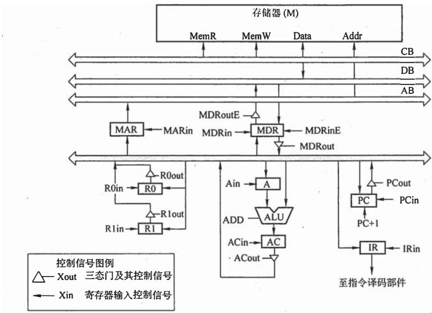

# 2009年全国硕士研究生入学统一考试

# 计算机科学与技术学科联考计算机学科专业基础综合试题

# 一、单项选择题（第 $1\sim 40$ 小题，每小题2分，共80分。下列每题给出的四个选项中，只有一个选项最符合试题要求）

1. 为解决计算机主机与打印机之间速度不匹配问题，通常设置一个打印数据缓冲区，主机将要输出的数据依次写入该缓冲区，而打印机则依次从该缓冲区中取出数据。该缓冲区的逻辑结构应该是________。

A. 栈

B. 队列

C. 树

D. 图

2. 设栈 S 和队列 Q 的初始状态均为空，元素 a, b, c, d, e, f, g 依次进入栈 S。若每个元素出栈后立即进入队列 Q，且 7 个元素出队的顺序是 b, d, c, f, e, a, g，则栈 S 的容量至少是 ______。

A. 1

B. 2

C. 3

D. 4

3. 给定二叉树如右图所示。设 N 代表二叉树的根，L 代表根结点的左子树，R 代表根结点的右子树。若遍历后的结点序列是 $3,1,7,5,6,2,4$ ，则其遍历方式是

A. LRN

B. NRL

C. RLN

D. RNL

4. 下列二叉排序树中，满足平衡二叉树定义的是____。

  
A.

  
B.

  
C.

  
D.

5. 已知一棵完全二叉树的第 6 层（设根为第 1 层）有 8 个叶结点，则该完全二叉树的结点个数最多是 ______。

A. 39

B. 52

C. 111

D. 119

6. 将森林转换为对应的二叉树，若在二叉树中，结点 $\mathbf{u}$ 是结点 $\mathbf{v}$ 的父结点的父结点，则在原来的森林中， $\mathbf{u}$ 和 $\mathbf{v}$ 可能具有的关系是

I. 父子关系

II. 兄弟关系

III. u的父结点与 $\mathbf{v}$ 的父结点是兄弟关系

A. 只有 II

B. I 和 II

C. I 和 III

D. I、II 和 III

7. 下列关于无向连通图特性的叙述中，正确的是

I. 所有顶点的度之和为偶数

II. 边数大于顶点个数减 1

III. 至少有一个顶点的度为 1

A. 只有 I

B. 只有 II

C. I 和 II

D. I 和 III

8. 下列叙述中，不符合 $m$ 阶B树定义要求的是

A. 根结点最多有 $m$ 棵子树

B. 所有叶结点都在同一层上

C. 各结点内关键字均升序或降序排列

D. 叶结点之间通过指针链接

9. 已知关键字序列 5, 8, 12, 19, 28, 20, 15, 22 是小根堆（最小堆），插入关键字 3，调整后得到的小根堆是

A. 3, 5, 12, 8, 28, 20, 15, 22, 19

B. 3, 5, 12, 19, 20, 15, 22, 8, 28

C. 3, 8, 12, 5, 20, 15, 22, 28, 19

D. 3, 12, 5, 8, 28, 20, 15, 22, 19

10. 若数据元素序列 11, 12, 13, 7, 8, 9, 23, 4, 5 是采用下列排序方法之一得到的第二趟排序后的结果，则该排序算法只能是

A. 冒泡排序

B. 插入排序

C. 选择排序

D. 二路归并排序

11. 冯·诺依曼计算机中指令和数据均以二进制形式存放在存储器中，CPU 区分它们的依据是____。

A. 指令操作码的译码结果

B. 指令和数据的寻址方式

C. 指令周期的不同阶段

D. 指令和数据所在的存储单元

12. 一个 C 语言程序在一台 32 位机器上运行。程序中定义了三个变量 x、y 和 z，其中 x 和 z 为 int 型，y 为 short 型。当 $x = 127$ ， $y = -9$ 时，执行赋值语句 $z = x + y$ 后，x、y 和 z 的值分别是 ________。

A. $x = 0000007FH, y = FFF9H, z = 00000076H$   
B. $x = 0000007FH, y = FFF9H, z = FFFF0076H$   
C. $x = 0000007FH, y = FFF7H, z = FFFF0076H$   
D. $x = 0000007 \mathrm{FH}, y = \mathrm{FFF7H}, z = 00000076 \mathrm{H}$

13. 浮点数加、减运算过程一般包括对阶、尾数运算、规格化、舍入和判溢出等步骤。设浮点数的阶码和尾数均采用补码表示，且位数分别为 5 位和 7 位（均含 2 位符号位）。若有两个数 $X = 2^{7} \times 29 / 32$ ， $Y = 2^{5} \times 5 / 8$ ，则用浮点加法计算 $X + Y$ 的最终结果是 ______。

A. 001111100010

B. 00111 0100010

C. 01000 0010001

D. 发生溢出

14. 某计算机的 Cache 共有 16 块，采用 2 路组相联映射方式（即每组 2 块）。每个主存块大小为 32B，按字节编址。主存 129 号单元所在主存块应装入到的 Cache 组号是 ________。

A. 0

B. 1

C. 4

D. 6

15. 某计算机主存容量为 64KB，其中 ROM 区为 4KB，其余为 RAM 区，按字节编址。现要用 $2\mathrm{K} \times 8$ 位的 ROM 芯片和 $4\mathrm{K} \times 4$ 位的 RAM 芯片来设计该存储器，则需要上述规格的 ROM 芯片数和 RAM 芯片数分别是 ________。

A. 1、15

B. 2、15

C. 1、30

D. 2、30

16. 某机器字长为 16 位，主存按字节编址，转移指令采用相对寻址，由两个字节组成，第一个字节为操作码字段，第二个字节为相对位移量字段。假定取指令时，每取一个字节 PC 自动加 1。若某转移指令所在主存地址为 $2000 \mathrm{H}$ ，相对位移量字段的内容为 $06 \mathrm{H}$ ，则该转移指令成功转移后的目标地址是 ________。

A. 2006H

B. 2007H

C. 2008H

D. 2009H

17. 下列关于 RISC 的叙述中, 错误的是

A. RISC 普遍采用微程序控制器

B. RISC 大多数指令在一个时钟周期内完成  
C. RISC 的内部通用寄存器数量相对 CISC 多  
D. RISC 的指令数、寻址方式和指令格式种类相对 CISC 少

18. 某计算机的指令流水线由四个功能段组成，指令流经各功能段的时间（忽略各功能段之间的缓存时间）分别为90ns、80ns、70ns、和60ns，则该计算机的CPU时钟周期至少是

A. 90ns

B. 80ns

C. 70ns

D. 60ns

19. 相对于微程序控制器，硬布线控制器的特点是

A. 指令执行速度慢，指令功能的修改和扩展容易  
B. 指令执行速度慢, 指令功能的修改和扩展难  
C. 指令执行速度快, 指令功能的修改和扩展容易  
D. 指令执行速度快, 指令功能的修改和扩展难

20. 假设某系统总线在一个总线周期中并行传输 4B 信息, 一个总线周期占用 2 个时钟周期, 总线时钟频率为 $10 \mathrm{MHz}$ , 则总线带宽是_____。

A. $10 \mathrm{MB} / \mathrm{s}$

B. $20 \mathrm{MB} / \mathrm{s}$

C. $40 \mathrm{MB} / \mathrm{s}$

D. $80 \mathrm{MB} / \mathrm{s}$

21. 假设某计算机的存储系统由 Cache 和主存组成，某程序执行过程中访存 1000 次，其中访问 Cache 缺失（未命中）50 次，则 Cache 的命中率是 ______。

A. $5\%$

B. $9.5\%$

C. $50\%$

D. $95\%$

22. 下列选项中，能引起外部中断的事件是

A. 键盘输入

B. 除数为 0

C. 浮点运算下溢

D. 访存缺页

23. 单处理机系统中, 可并行的是

I进程与进程

II 处理机与设备

III 处理机与通道 IV 设备与设备

A. I、II 和 III

B. I、II 和 IV

C. I、III 和 IV

D. II、III 和 IV

24. 下列进程调度算法中，综合考虑进程等待时间和执行时间的是____。

A. 时间片轮转调度算法

B. 短进程优先调度算法

C. 先来先服务调度算法

D. 高响应比优先调度算法

25. 某计算机系统中有 8 台打印机, 由 $K$ 个进程竞争使用, 每个进程最多需要 3 台打印机。该系统可能会发生死锁的 $K$ 的最小值是______。

A. 2

B. 3

C. 4

D. 5

26. 分区分配内存管理方式的主要保护措施是

A. 界地址保护

B. 程序代码保护

C. 数据保护

D. 栈保护

27. 一个分段存储管理系统中，地址长度为32位，其中段号占8位，则最大段长是

A. $2^{8} \mathrm{~B}$

B. $2^{16} \mathrm{~B}$

C. $2^{24} \mathrm{~B}$

D. $2^{32} \mathrm{~B}$

28. 下列文件物理结构中，适合随机访问且易于文件扩展的是________。

A. 连续结构

B. 索引结构

C. 链式结构且磁盘块定长

D. 链式结构且磁盘块变长

29. 假设磁头当前位于第 105 道，正在向磁道序号增加的方向移动。现有一个磁道访问请求序列为 35, 45, 12, 68, 110, 180, 170, 195，采用 SCAN 调度（电梯调度）算法得到的磁道访问序列是 ______。

A. 110, 170, 180, 195, 68, 45, 35, 12

B. 110, 68, 45, 35, 12, 170, 180, 195   
C. 110, 170, 180, 195, 12, 35, 45, 68   
D. 12,35,45,68,110,170,180,195

30. 文件系统中，文件访问控制信息存储的合理位置是

A. 文件控制块

B. 文件分配表

C. 用户口令表

D. 系统注册表

31. 设文件 F1 的当前引用计数值为 1，先建立 F1 的符号链接（软链接）文件 F2，再建立 F1 的硬链接文件 F3，然后删除 F1。此时，F2 和 F3 的引用计数值分别是 ________。

A. 0、1

B. 1、1

C. 1、2

D. 2、1

32. 程序员利用系统调用打开 I/O 设备时，通常使用的设备标识是________。

A. 逻辑设备名

B. 物理设备名

C. 主设备号

D. 从设备号

33. 在 OSI 参考模型中，自下而上第一个提供端到端服务的层次是____。

A. 数据链路层

B. 传输层

C. 会话层

D. 应用层

34. 在无噪声情况下, 若某通信链路的带宽为 $3 \mathrm{kHz}$ , 采用 4 个相位, 每个相位具有 4 种振幅的 QAM 调制技术, 则该通信链路的最大数据传输速率是

A. 12kbps

B. 24kbps

C. 48kbps

D. 96kbps

35. 数据链路层采用后退 $N$ 帧（GBN）协议，发送方已经发送了编号为 $0 \sim 7$ 的帧。当计时器超时时，若发送方只收到0、2、3号帧的确认，则发送方需要重发的帧数是

A. 2

B. 3

C. 4

D. 5

36. 以太网交换机进行转发决策时使用的 PDU 地址是

A. 目的物理地址

B. 目的 IP 地址

C. 源物理地址

D. 源IP地址

37. 在一个采用 CSMA/CD 协议的网络中, 传输介质是一根完整的电缆, 传输速率为 1Gbps, 电缆中的信号传播速度为 $200000 \mathrm{~km} / \mathrm{s}$ 。若最小数据帧长度减少 800bit, 则最远的两个站点之间的距离至少需要

A. 增加 $160 \mathrm{~m}$

B. 增加 $80 \mathrm{~m}$

C. 减少 $160 \mathrm{~m}$

D. 减少 $80 \mathrm{~m}$

38. 主机甲与主机乙之间已建立一个 TCP 连接，主机甲向主机乙发送了两个连续的 TCP 段，分别包含 300B 和 500B 的有效载荷，第一个段的序列号为 200，主机乙正确接收到两个段后，发送给主机甲的确认序列号是 ______。

A. 500

B. 700

C. 800

D. 1000

39. 一个TCP连接总是以1KB的最大段长发送TCP段，发送方有足够多的数据要发送。当拥塞窗口为16KB时发生了超时，如果接下来的4个RTT（往返时间）时间内的TCP段的传输都是成功的，那么当第4个RTT时间内发送的所有TCP段都得到肯定应答时，拥塞窗口大小是

A. 7KB

B. 8KB

C. 9KB

D. 16KB

40. FTP 客户和服务器间传递 FTP 命令时，使用的连接是

A. 建立在 TCP 之上的控制连接

B. 建立在 TCP 之上的数据连接

C. 建立在 UDP 之上的控制连接

D. 建立在 UDP 之上的数据连接

# 二、综合应用题（第 $41\sim 47$ 题，共70分）

41.（10分）带权图（权值非负，表示边连接的两顶点间的距离）的最短路径问题是找出从初始顶点到目标顶点之间的一条最短路径。假设从初始顶点到目标顶点之间存在路径，现有一种解决该问题的方法：

(1) 设最短路径初始时仅包含初始顶点, 令当前顶点 $\mathbf{u}$ 为初始顶点;  
② 选择离 $\mathbf{u}$ 最近且尚未在最短路径中的一个顶点 $\mathbf{v}$ , 加入最短路径中, 修改当前顶点 $\mathbf{u} = \mathbf{v}$ ;  
(3) 重复步骤②，直到 u 是目标顶点时为止。

请问上述方法能否求得最短路径？若该方法可行，请证明之；否则，请举例说明。

42. (15 分) 已知一个带有表头结点的单链表, 结点结构为

<table><tr><td>data</td><td>link</td></tr></table>

假设该链表只给出了头指针 list。在不改变链表的前提下，请设计一个尽可能高效的算法，查找链表中倒数第 $k$ 个位置上的结点（ $k$ 为正整数）。若查找成功，算法输出该结点的 data 域的值，并返回 1；否则，只返回 0。要求：

1）描述算法的基本设计思想。  
2）描述算法的详细实现步骤。  
3）根据设计思想和实现步骤，采用程序设计语言描述算法（使用 C、C++ 或 Java 语言实现），关键之处请给出简要注释。  
43.（8分）某计算机的CPU主频为 $500\mathrm{MHz}$ ，CPI为5（即执行每条指令平均需5个时钟周期）。假定某外设的数据传输率为 $0.5\mathrm{MB / s}$ ，采用中断方式与主机进行数据传送，以32位为传输单位，对应的中断服务程序包含18条指令，中断服务的其他开销相当于2条指令的执行时间。请回答下列问题，要求给出计算过程。

1）在中断方式下，CPU用于该外设I/O的时间占整个CPU时间的百分比是多少？  
2）当该外设的数据传输率达到 $5\mathrm{MB / s}$ 时，改用DMA方式传送数据。假定每次DMA传送块大小为5000B，且DMA预处理和后处理的总开销为500个时钟周期，则CPU用于该外设I/O的时间占整个CPU时间的百分比是多少（假设DMA与CPU之间没有访存冲突）？  
44.（13分）某计算机字长为16位，采用16位定长指令字结构，部分数据通路结构如下图所示，图中所有控制信号为1时表示有效、为0时表示无效。例如，控制信号MDRinE为1表示允许数据从DB打入MDR，MDRin为1表示允许数据从内总线打入MDR。假设MAR的输出一直处于使能状态。加法指令“ADD(R1)，R0”的功能为 $(\mathrm{R0}) + ((\mathrm{R1}))\rightarrow (\mathrm{R1})$ ，即将R0中的数据与R1的内容所指主存单元的数据相加，并将结果送入R1的内容所指主存单元中保存。

下表给出了上述指令取指和译码阶段每个节拍（时钟周期）的功能和有效控制信号，请按表中描述方式用表格列出指令执行阶段每个节拍的功能和有效控制信号。

<table><tr><td>时钟</td><td>功能</td><td>有效控制信号</td></tr><tr><td>C1</td><td>MAR←(PC)</td><td>PCout, MARin</td></tr><tr><td>C2</td><td>MDR←M(MDR)
PC←(PC)+1</td><td>MemR, MDRinE, PC+1</td></tr><tr><td>C3</td><td>IR←(MDR)</td><td>MDRout, IRin</td></tr><tr><td>C4</td><td>指令译码</td><td>无</td></tr></table>

45.（7分）三个进程 $\mathbf{P}_1$ 、 $\mathbf{P}_2$ 、 $\mathbf{P}_3$ 互斥使用一个包含 $N(N > 0)$ 个单元的缓冲区。 $\mathbf{P}_1$ 每次用produce()生成一个正整数并用put()送入缓冲区某一空单元中； $\mathbf{P}_2$ 每次用getodd()从该缓冲区中取出一个奇数并用countodd()统计奇数个数； $\mathbf{P}_3$ 每次用geteven()从该缓冲区中取出一个偶数并用counteven()统计偶数个数。请用信号量机制实现这三个进程的同步与互斥活动，并说明所定义信号量的含义（要求用伪代码描述）。

46.（8分）请求分页管理系统中，假设某进程的页表内容见下表。

<table><tr><td>页号</td><td>页框(Page Frame)号</td><td>有效位(存在位)</td></tr><tr><td>0</td><td>101H</td><td>1</td></tr><tr><td>1</td><td></td><td>0</td></tr><tr><td>2</td><td>254H</td><td>1</td></tr></table>

页面大小为4KB，一次内存的访问时间为100ns，一次快表（TLB）的访问时间为10ns，处理一次缺页的平均时间为 $10^{8}\mathrm{ns}$ （已含更新TLB和页表的时间)，进程的驻留集大小固定为2，采用最近最少使用置换算法（LRU）和局部淘汰策略。假设①TLB初始为空；②地址转换时先访问TLB，若TLB未命中，再访问页表（忽略访问页表之后的TLB更新时间）；③有效位为0表示页面不在内存中，产生缺页中断，缺页中断处理后，返回到产生缺页中断的指令处重新执行。设有虚地址访问序列2362H、1565H、25A5H，请问：

1）依次访问上述三个虚地址，各需多少时间？给出计算过程。

2）基于上述访问序列，虚地址1565H的物理地址是多少？请说明理由。

47.（9分）某网络拓扑如下图所示，路由器R1通过接口E1、E2分别连接局域网1、局域网2，通过接口L0连接路由器R2，并通过路由器R2连接域名服务器与互联网。R1的L0接口的IP地址是202.118.2.1，R2的L0接口的IP地址是202.118.2.2，L1接口的IP地址是130.11.120.1，E0接口的IP地址是202.118.3.1，域名服务器的IP地址是202.118.3.2。

R1和R2的路由表结构为  

<table><tr><td>目的网络IP地址</td><td>子网掩码</td><td>下一跳IP地址</td><td>接口</td></tr></table>

1）将IP地址空间202.118.1.0/24划分为2个子网分别分配给局域网1、局域网2，每个局域网需分配的IP地址数不少于120个。请给出子网划分结果，说明理由或给出必要的计算过程。  
2）请给出R1的路由表，使其明确包括到局域网1的路由、局域网2的路由、域名服务器的主机路由和互联网的路由。  
3）请采用路由聚合技术，给出R2到局域网1和局域网2的路由。