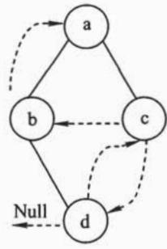
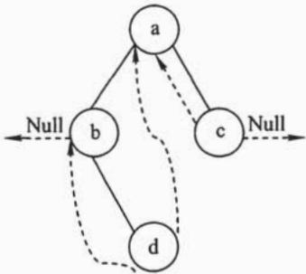
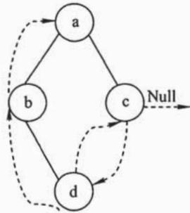
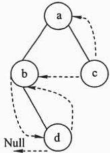
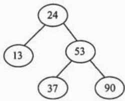
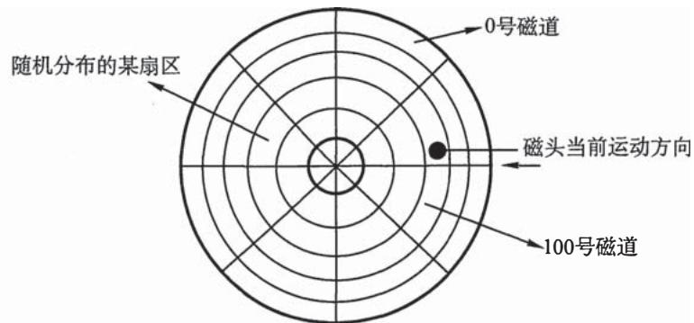
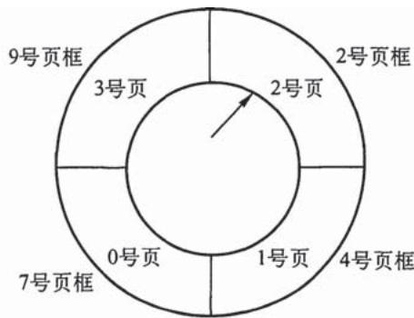

# 2010年全国硕士研究生入学统一考试

# 计算机科学与技术学科联考计算机学科专业基础综合试题

# 一、单项选择题（第 $1\sim 40$ 小题，每小题2分，共80分。下列每题给出的四个选项中，只有一个选项最符合试题要求）

1. 若元素 a, b, c, d, e, f 依次进栈，允许进栈、退栈操作交替进行，但不允许连续三次进行退栈操作，则不可能得到的出栈序列是 ______。

A. dcebfa

B. c b d a e f

C. bcaefd

D. afedcb

2. 某队列允许在其两端进行入队操作，但仅允许在一端进行出队操作。若元素a,b,c,d,e依次入此队列后再进行出队操作，则不可能得到的出队序列是

A.bace

B. dbace

C. dbcae

D. ECBad

3. 下列线索二叉树中（用虚线表示线索），符合后序线索树定义的是____。

  
A.

  
B.

  
C.

  
D.

4. 在右图所示的平衡二叉树中，插入关键字 48 后得到一棵新平衡二叉树。在新平衡二叉树中，关键字 37 所在结点的左、右子结点中保存的关键字分别是



A. 13,48

B. 24, 48

C. 24,53

D. 24, 90

5. 在一棵度为 4 的树 T 中，若有 20 个度为 4 的结点，10 个度为 3 的结点，1 个度为 2 的结点，10 个度为 1 的结点，则树 T 的叶结点个数是

A. 41

B. 82

C. 113

D. 122

6. 对 $n$ ( $n \geq  2$ )个权值均不相同的字符构造成哈夫曼树。下列关于该哈夫曼树的叙述中,错误的是_____。

A. 该树一定是一棵完全二叉树  
B. 树中一定没有度为 1 的结点  
C. 树中两个权值最小的结点一定是兄弟结点  
D. 树中任一非叶结点的权值一定不小于下一层任一结点的权值

7. 若无向图 $\mathrm{G} = (\mathrm{V}, \mathrm{E})$ 中含有 7 个顶点，要保证图 $\mathrm{G}$ 在任何情况下都是连通的，则需要的边数最少是 ______。

A. 6

B. 15

C. 16

D. 21

8. 对右图进行拓扑排序, 可以得到不同的拓扑序列的个数是


A. 4   
B. 3   
C. 2   
D. 1

9. 已知一个长度为 16 的顺序表 L，其元素按关键字有序排列。若采用折半查找法查找一个 L 中不存在的元素，则关键字的比较次数最多的是 ________。

A. 4   
B. 5   
C. 6   
D. 7

10. 采用递归方式对顺序表进行快速排序。下列关于递归次数的叙述中, 正确的是____。

A. 递归次数与初始数据的排列次序无关  
B. 每次划分后, 先处理较长的分区可以减少递归次数  
C. 每次划分后, 先处理较短的分区可以减少递归次数  
D. 递归次数与每次划分后得到的分区的处理顺序无关

11．对一组数据（2,12,16,88,5,10）进行排序，若前三趟排序结果如下：

第一趟排序结果：2,12,16,5,10,88

第二趟排序结果：2,12,5,10,16,88

第三趟排序结果：2,5,10,12,16,88

则采用的排序方法可能是

A. 冒泡排序

B. 希尔排序

C. 归并排序

D. 基数排序

12. 下列选项中, 能缩短程序执行时间的措施是

I. 提高CPU时钟频率

II. 优化数据通路结构

III. 对程序进行编译优化

A. 仅 I 和 II

B. 仅 I 和 III

C. 仅 II 和 III

D. I、II 和 III

13. 假定有 4 个整数用 8 位补码分别表示 $\mathrm{r}1 = \mathrm{FEH}$ ， $\mathrm{r}2 = \mathrm{F2H}$ ， $\mathrm{r}3 = 90\mathrm{H}$ ， $\mathrm{r}4 = \mathrm{F8H}$ ，若将运算结果存放在一个 8 位寄存器中，则下列运算中会发生溢出的是 ______。

A. $\mathrm{r}1 \times \mathrm{r}2$

B. $r 2 \times r 3$

C. $\mathrm{r} 1 \times \mathrm{r} 4$

D. $r 2 \times r 4$

14. 假定变量 $i$ 、 $f$ 和 $d$ 的数据类型分别为 int、float 和 double（int 用补码表示，float 和 double 分别用 IEEE 754 单精度和双精度浮点数格式表示），已知 $i = 785, f = 1.5678e3, d = 1.5e100$ 。若在 32 位机器中执行下列关系表达式，则结果为“真”的是 ________。

I. $\mathrm{i} =$ (int)(float)i

II. $f == (\text{float})(\text{int})f$

III. $f =$ (float)(double)f

IV. $(d + f) - d = f$

A. 仅 I 和 II

B. 仅 I 和 III

C. 仅 II 和 III

D. 仅 III 和 IV

15. 假定用若干 $2\mathrm{K} \times 4$ 位的芯片组成一个 $8\mathrm{K} \times 8$ 位的存储器，则地址0B1FH所在芯片的最小地址是 ______。

A. 0000H

B. 0600H

C. ${0700}\mathrm{H}$

D. 0800H

16. 下列有关 RAM 和 ROM 的叙述中, 正确的是____。

I. RAM是易失性存储器，ROM是非易失性存储器  
II. RAM和ROM都采用随机存取方式进行信息访问

III. RAM和ROM都可用作Cache   
IV. RAM和ROM都需要进行刷新

A. 仅 I 和 II  
B. 仅 II 和 III  
C. 仅 I、II 和 IV  
D. 仅 II、III 和 IV

17. 下列命中组合情况中，一次访存过程中不可能发生的是________。

A. TLB 未命中, Cache 未命中, Page 未命中  
B. TLB 未命中, Cache 命中, Page 命中  
C. TLB 命中, Cache 未命中, Page 命中  
D. TLB 命中, Cache 命中, Page 未命中

18. 下列寄存器中，汇编语言程序员可见的是

A. 存储器地址寄存器 (MAR)  
B. 程序计数器 (PC)  
C. 存储器数据寄存器 (MDR)  
D. 指令寄存器 (IR)

19. 下列选项中，不会引起指令流水线阻塞的是________。

A. 数据旁路（转发）  
B. 数据相关  
C. 条件转移   
D. 资源冲突

20. 下列选项中的英文缩写均为总线标准的是________。

A. PCI、CRT、USB、EISA  
B. ISA、CPI、VESA、EISA  
C. ISA、SCSI、RAM、MIPS  
D. ISA、EISA、PCI、PCI-Express

21. 单级中断系统中，中断服务程序内的执行顺序是

I. 保护现场

II. 开中断

III. 关中断

IV. 保存断点

V. 中断事件处理

VI. 恢复现场

VII. 中断返回

A. $\mathrm{I} \rightarrow \mathrm{V} \rightarrow \mathrm{VI} \rightarrow \mathrm{II} \rightarrow \mathrm{VII}$

B. $\mathrm{III} \rightarrow \mathrm{I} \rightarrow \mathrm{V} \rightarrow \mathrm{VII}$

C. $\mathrm{III} \rightarrow \mathrm{IV} \rightarrow \mathrm{V} \rightarrow \mathrm{VI} \rightarrow \mathrm{VII}$

D. $\mathrm{IV} \rightarrow \mathrm{I} \rightarrow \mathrm{V} \rightarrow \mathrm{VI} \rightarrow \mathrm{VII}$

22. 假定一台计算机的显示存储器用DRAM芯片实现，若要求显示分辨率为 $1600 \times 1200$ ，颜色深度为24位，帧频为 $85\mathrm{Hz}$ ，显存总带宽的 $50\%$ 用来刷新屏幕，则需要的显存总带宽至少约为

A. 245Mbps   
B. 979Mbps   
C. 1958Mbps   
D. 7834Mbps

23. 下列选项中，操作系统提供给应用程序的接口是____。

A. 系统调用

B. 中断

C. 库函数

D. 原语

24. 下列选项中，导致创建新进程的操作是________。

I. 用户登录成功

II. 设备分配

III. 启动程序执行

A. 仅 I 和 II

B. 仅 II 和 III

C. 仅 I 和 III

D. I、II 和 III

25. 设与某资源关联的信号量初值为 3 , 当前值为 1 。若 $M$ 表示该资源的可用个数, $N$ 表示等待该资源的进程数, 则 $M$ 、 $N$ 分别是_____。

A. 0、1

B. 1、0

C. 1、2

D. 2、0

26. 下列选项中，降低进程优先级的合理时机是________。

A. 进程的时间片用完

B. 进程刚完成 I/O, 进入就绪列队

C. 进程长期处于就绪列队中

D. 进程从就绪状态转为运行状态

27. 进程 $\mathbf{P}_0$ 和 $\mathbf{P}_1$ 的共享变量定义及其初值为：

boolean flag[2];

int turn $= 0$

flag[0]=FALSE; flag[1]=FALSE;

若进程 $\mathbf{P}_0$ 和 $\mathbf{P}_1$ 访问临界资源的类C伪代码实现如下：

```c
void P0() //进程P0  
{  
while (TRUE)  
{  
    flag[0] = TRUE; turn = 1;  
    while (flag[1] && (turn == 1));  
   临界区；  
    flag[0] = FALSE;  
} 
```

```lisp
void P1() //进程P1  
{  
while (TRUE)  
{  
    flag[1] = TRUE; turn = 0;  
    while (flag[0] && (turn == 0));  
   临界区；  
    flag[1] = FALSE;  
} 
```

则并发执行进程 $\mathbf{P}_0$ 和 $\mathbf{P}_1$ 时产生的情形是

A. 不能保证进程互斥进入临界区, 会出现 “饥饿” 现象  
B. 不能保证进程互斥进入临界区, 不会出现 “饥饿” 现象  
C. 能保证进程互斥进入临界区, 会出现 “饥饿” 现象  
D. 能保证进程互斥进入临界区, 不会出现 “饥饿” 现象

28. 某基于动态分区存储管理的计算机，其主存容量为 55MB（初始为空闲），采用最佳适配（Best Fit）算法，分配和释放的顺序为：分配 15MB，分配 30MB，释放 15MB，分配 8MB，分配 6MB，此时主存中最大空闲分区的大小是 ______。

A. 7MB

B. 9MB

C. 10MB

D. 15MB

29. 某计算机采用二级页表的分页存储管理方式，按字节编址，页大小为 $2^{10}\mathrm{B}$ ，页表项大小为 2B，逻辑地址结构为

<table><tr><td>页目录号</td><td>页号</td><td>页内偏移量</td></tr></table>

逻辑地址空间大小为 $2^{16}$ 页，则表示整个逻辑地址空间的页目录表中包含表项的个数至少是

A. 64

B. 128

C. 256

D. 512

30. 设文件索引结点中有 7 个地址项, 其中 4 个地址项是直接地址索引, 2 个地址项是一级间接地址索引, 1 个地址项是二级间接地址索引, 每个地址项大小为 4B。若磁盘索引块和磁盘数据块大小均为 256B, 则可表示的单个文件最大长度是_____。

A. 33KB

B. 519KB

C. 1057KB

D. 16513KB

31. 设置当前工作目录的主要目的是

A. 节省外存空间

B. 节省内存空间

C. 加快文件的检索速度

D. 加快文件的读/写速度

32. 本地用户通过键盘登录系统时，首先获得键盘输入信息的程序是

A. 命令解释程序

B. 中断处理程序

C. 系统调用服务程序

D. 用户登录程序

33. 下列选项中，不属于网络体系结构所描述的内容是

A. 网络的层次

B. 每层使用的协议

C. 协议的内部实现细节

D. 每层必须完成的功能

34. 在右图所示的采用“存储-转发”方式的分组交换网络中，所有链路的数据传输速率为100Mbps，分组大小为1000B，其中分组头大小为20B。若主机H1向主机H2发送一个大小为980000B的文件，则在不考虑分组拆装时间和传播延迟的情况下，从H1发送开始到H2接收完为止，需要的时


A. $80 \mathrm{~ms}$

B. $80.08 \mathrm{~ms}$

C. $80.16 \mathrm{~ms}$

D. $80.24 \mathrm{~ms}$

35. 某自治系统内采用 RIP 协议，若该自治系统内的路由器 R1 收到其邻居路由器 R2 的距离矢量，距离矢量中包含信息 $<\text{net}1, 16>$ ，则能得出的结论是 ______。

A. R2 可以经过 R1 到达 net1, 跳数为 17  
B. R2 可以到达 net1, 跳数为 16  
C. R1 可以经过 R2 到达 net1, 跳数为 17  
D. R1 不能经过 R2 到达 net1

36. 若路由器 R 因为拥塞丢弃 IP 分组，则此时 R 可向发出该 IP 分组的源主机发送的 ICMP 报文类型是 ______。

A. 路由重定向

B. 目的不可达

C. 源点抑制

D. 超时

37. 某网络的 IP 地址空间为 192.168.5.0/24, 采用定长子网划分, 子网掩码为 255.255.255.248, 则该网络中的最大子网个数、每个子网内的最大可分配地址个数分别是____。

A. 32,8

B. 32,6

C. 8,32

D. 8,30

38. 下列网络设备中，能够抑制广播风暴的是

I. 中继器

II. 集线器

III. 网桥

IV. 路由器

A. 仅 I 和 II

B. 仅 III

C. 仅 III 和 IV

D. 仅 IV

39. 主机甲和主机乙之间已建立了一个TCP连接，TCP最大段长度为1000B。若主机甲的当前拥塞窗口为4000B，在主机甲向主机乙连续发送两个最大段后，成功收到主机乙发送的第一个段的确认段，确认段中通告的接收窗口大小为2000B，则此时主机甲还可以向主机乙发送的最大字节数是____。

A. 1000

B. 2000

C. 3000

D. 4000

40. 如果本地域名服务器无缓存，当采用递归方法解析另一网络某主机域名时，用户主机、本地域名服务器发送的域名请求消息数分别为________。

A. 一条、一条

B. 一条、多条

C. 多条、一条

D. 多条、多条

# 二、综合应用题（第 $41\sim 47$ 题，共70分）

41.（10分）将关键字序列（7,8,30,11,18,9,14）散列存储到散列表中。散列表的存储空间是一个下标从0开始的一维数组，散列函数为 $\mathrm{H(key) = (key\times 3)\bmod 7}$ ，处理冲突采用线性探测再散列法，要求装填（载）因子为0.7。

1）请画出所构造的散列表。

2）分别计算等概率情况下查找成功和查找不成功的平均查找长度。

42.（13分）设将 $n(n > 1)$ 个整数存放到一维数组R中。试设计一个在时间和空间两方面都尽可能高效的算法。将R中保存的序列循环左移 $p$ （ $0 < p < n$ ）个位置，即将R中的数据由 $(\mathbf{X}_0, \mathbf{X}_1, \dots, \mathbf{X}_{n-1})$ 变换为 $(\mathbf{X}_p, \mathbf{X}_{p+1}, \dots, \mathbf{X}_{n-1}, \mathbf{X}_0, \mathbf{X}_1, \dots, \mathbf{X}_{p-1})$ 。要求：

1）给出算法的基本设计思想。

2）根据设计思想，采用C、C++或Java语言描述算法，关键之处给出注释。

3）说明你所设计算法的时间复杂度和空间复杂度。

43.（11分）某计算机字长为16位，主存地址空间大小为128KB，按字编址。采用单字长指令格式，指令各字段定义如下图所示。

<table><tr><td>15</td><td>12</td><td>11</td><td>6</td><td>5</td><td>0</td></tr><tr><td>OP</td><td>Ms</td><td>Rs</td><td>Md</td><td>Rd</td><td></td></tr><tr><td colspan="6">源操作数 目的操作数</td></tr></table>

转移指令采用相对寻址方式，相对偏移量用补码表示，寻址方式定义见下表。

<table><tr><td>Ms/Md</td><td>寻址方式</td><td>助记符</td><td>含义</td></tr><tr><td>000B</td><td>寄存器直接</td><td>Rn</td><td>操作数 = (Rn)</td></tr><tr><td>001B</td><td>寄存器间接</td><td>(Rn)</td><td>操作数 = ((Rn))</td></tr><tr><td>010B</td><td>寄存器间接、自增</td><td>(Rn)+</td><td>操作数 = ((Rn)), (Rn) + 1 → Rn</td></tr><tr><td>011B</td><td>相对</td><td>D(Rn)</td><td>转移目标地址 = (PC) + (Rn)</td></tr></table>

注：(X)表示存储器地址 X 或寄存器 X 的内容。

请回答下列问题：

1）该指令系统最多可有多少条指令？该计算机最多有多少个通用寄存器？存储器地址寄存器（MAR）和存储器数据寄存器（MDR）至少各需要多少位？  
2）转移指令的目标地址范围是多少？  
3）若操作码0010B表示加法操作（助记符为add)，寄存器R4和R5的编号分别为100B和101B，R4的内容为 $1234\mathrm{H}$ ，R5的内容为 $5678\mathrm{H}$ ，地址 $1234\mathrm{H}$ 中的内容为 $5678\mathrm{H}$ ，地址 $5678\mathrm{H}$ 中的内容为 $1234\mathrm{H}$ ，则汇编语言为“ $\mathrm{add(R4),(R5)+}$ ”（逗号前为源操作数，逗号后为目的操作数）对应的机器码是什么（用十六进制表示）？该指令执行后，哪些寄存器和存储单元中的内容会改变？改变后的内容是什么？  
44.（12分）某计算机的主存地址空间大小为 $256\mathrm{MB}$ ，按字节编址。指令Cache和数据Cache分离，均有8个Cache行，每个Cache行大小为64B，数据Cache采用直接映射方式。现有两个功能相同的程序A和B，其伪代码如下：

程序A: int a[256][256] ..... int sum_array1() { int i,j,sum $= 0$ for $(\mathrm{i} = 0;\mathrm{i} <   256;\mathrm{i} + + )$ for(j=0;j<256;j++) sum+=a[i][j]; return sum; }

程序B: int a[256][256] int sum_array2() { int i,j,sum $= 0$ for $(j = 0;j <   256;j + + )$ for $(i = 0;i <   256;i + + )$ sum+=a[i][j]; return sum; }

假定int类型数据用32位补码表示，程序编译时i、j、sun均分配在寄存器中，数组a按行优先方式存放，其首地址为320（十进制数）。请回答下列问题，要求说明理由或给出计算过程。

1）若不考虑用于Cache一致性维护和替换算法的控制位，则数据Cache的总容量为多少？  
2）数组元素a[0][31]和a[1][1]各自所在的主存块对应的Cache行号分别是多少（Cache行号从0开始）？

3）程序A和B的数据访问命中率各是多少？哪个程序的执行时间更短？

45.（7分）假设计算机系统采用CSCAN（循环扫描）磁盘调度策略，使用2KB的内存空间记录16384个磁盘块的空闲状态。

1）请说明在上述条件下如何进行磁盘块空闲状态的管理。  
2）设某单面磁盘旋转速度为 $6000\mathrm{rpm}$ ，每个磁道有100个扇区，相邻磁道间的平均移动时间为1ms。若在某时刻，磁头位于100号磁道处，并沿着磁道号增大的方向移动（见下图），磁道号请求队列为50,90,30,120，对请求队列中的每个磁道需读取1个随机分布的扇区，则读完这4个扇区点共需要多少时间？要求给出计算过程。  
3）如果将磁盘替换为随机访问的Flash半导体存储器（如U盘、SSD等），是否有比CSCAN更高效的磁盘调度策略？若有，给出磁盘调度策略的名称并说明理由；若无，说明理由。



46.（8分）设某计算机的逻辑地址空间和物理地址空间均为64KB，按字节编址。若某进程最多需要6页（Page）数据存储空间，页的大小为1KB，操作系统采用固定分配局部置换策略为此进程分配4个页框（Page Frame）。在时刻260前的该进程访问情况见下表（访问位即使用位）。

<table><tr><td>页号</td><td>页框号</td><td>装入时刻</td><td>访问位</td></tr><tr><td>0</td><td>7</td><td>130</td><td>1</td></tr><tr><td>1</td><td>4</td><td>230</td><td>1</td></tr><tr><td>2</td><td>2</td><td>200</td><td>1</td></tr><tr><td>3</td><td>9</td><td>260</td><td>1</td></tr></table>

当该进程执行到时刻260时，要访问逻辑地址为17CAH的数据。请回答下列问题：

1）该逻辑地址对应的页号是多少？  
2）若采用先进先出（FIFO）置换算法，该逻辑地址对应的物理地址是多少？要求给出计算过程。  
3）若采用时钟（CLOCK）置换算法，该逻辑地址对应的物理地址是多少？要求给出计算过程（设搜索下一页的指针沿顺时针方向移动，且当前指向2号页框，示意图见下图）。



47.（9分）某局域网采用CSMA/CD协议实现介质访问控制，数据传输速率为10Mbps，主机甲和主机乙之间的距离为 $2\mathrm{km}$ ，信号传播速度为 $200000\mathrm{km/s}$ 。请回答下列问题，要求说明理由或写出计算过程。

1）若主机甲和主机乙发送数据时发生冲突，则从开始发送数据时刻起，到两台主机均检测到冲突时刻止，最短需经过多长时间？最长需经过多长时间（假设主机甲和主机乙发送数据过程中，其他主机不发送数据）？

2）若网络不存在任何冲突与差错，主机甲总是以标准的最长以太网数据帧（1518B）向主机乙发送数据，主机乙每成功收到一个数据帧后立即向主机甲发送一个64B的确认帧，主机甲收到确认帧后方可发送下一个数据帧。此时主机甲的有效数据传输速率是多少（不考虑以太网的前导码）？