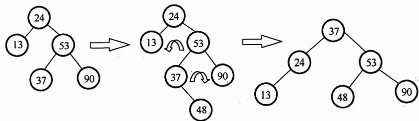
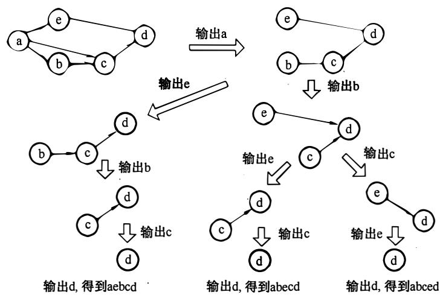
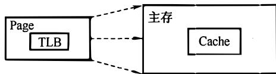
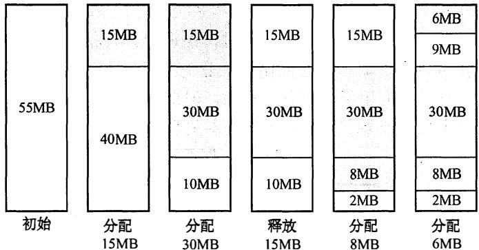
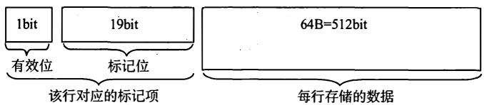

# 2010 年计算机学科专业基础综合试题参考答案

# 一、单项选择题

1.  2.  3.  4.  5.  6.  7.  8.

9. 10. 11. 12. 13.  14.  15.  16.

17. 18. 19.  20.  21.  22.  23.  24.

25.  26.  27.  28.  29.  30.  31.  32.

33. 34. 35. 36. 37. 38. 39. 40.

1. 解析：

选项 可由 in, in, in, in, out, out, in, out, out, in, out, out 得到；选项 可由 in, in, in, out, out, in, out, out, in, out, in, out 得到；选项 可由 in, in, out, in, out, out, in, in, out, in, out, out 得到；选 可由 in, out, in, in, in, in, in, out, out, out, out, out 得到，但题意要求不允许连续三次退栈操作， 不可能得到。

【另解】先进栈的元素后出栈，进栈顺序为 b, c, d, e, f, 故连续出栈时的序列必然是按字母表逆序的，若出栈序列中出现了长度大千等于 的连续逆序子序列，则为不符合要求的出栈序列。

2. 解析：

本题的队列实际上是一个输出受限的双端队列。 操作： 左入（或右入）、 左入、入、 右入、 右入。 操作： 左入（或右入）、 左入、 右入、 左入、 右入。 操作： a左入（或右入）、 左入、 左入、 右入、 左入。 操作： 左入（或右入）、 右入、因出，此时只能进队， 怎么进都不可能在 之间。

【另解】初始时队列为空，第 个元素 左入（或右入），而第 个元素 无论是左入还是右入都必与 相邻，而选项 不相邻，不合题意。

3. 解析：

题中所给二叉树的后序序列为 d, b, c, 。结点 无前驱和左子树，左链域空，无右子树，右链域指向其后继结点 b; 结点 无左子树，左链域指向其前驱结点 d; 结点 无左子树，左链域指向其前驱结点 无右子树，右链域指向其后继结点 。故选

4. 解析：

插入 以后，该二叉树根结点的平衡因子由 变为 在最小不平衡子树根结点的右子的左子树 中插入新结点引起的不平衡属千 RL 型平衡旋转，需要做两次旋转操作（先右旋后左旋）。

调整后，关键字 37 所在结点的左、右子结点中保存的关键字分别是 24 53

# 5. 解析：

设树中度为 $\textit { i } ( { i } = 0 , 1 , 2 , 3 , 4 )$ 的结点数分别为 $N _ { i }$ , 树中结点总数为 $N _ { : }$ , 则树中各结点的度之和等于 $N { - } 1$ , 即 $N = 1 + N _ { 1 } + 2 N _ { 2 } + 3 N _ { 3 } + 4 N _ { 4 } = N _ { 0 } + N _ { 1 } + N _ { 2 } + N _ { 3 } + N _ { 4 }$ , 根据题设中的数据， 即可得到。 $N _ { 0 } = 8 2$ , 即树 $\dot { \boldsymbol { \mathrm { T } } }$ 的叶结点的个数是82。

# 6. 解析：

哈夫曼树为带权路径长度最小的二叉树， 不一定是完全二叉树。哈夫曼树中没有度为1的结点，B正确；构造哈夫曼树时， 最先选取两个权值最小的结点作为左、右子树构造一棵新的二叉树，C正确；哈夫曼树中任一非叶结点P的权值为其左、右子树根结点权值之和， 其权值不小千其左、右子树根结点的权值， 在与结点P的左、右子树根结点处于同一层的结点中，若存在权值大于结点P权值的结点Q, 则结点Q的兄弟结点中权值较小的一个应该与结点P作为左、右子树构造新的二叉树。 综上可知，哈夫曼树中任一非叶结点的权值一定不小千下一层任 一结点的权值。

# 7. 解析：

要保证无向图G在任何情况下都是连通的，即任意变动图G中的边，G始终保待连通，首先需要G的任意6个结点构成完全连通子图GI, 需 $n ( n - 1 ) / 2 = 6 \times ( 6 - 1 ) / 2 = 1 5$ 条边， 然后再添一条边将第7个结点与Gl连接起来， 共需16条边。

# 8. 解析：

拓扑排序的过程如下图所示。

可以得到3个不同的拓扑序列， 分别为abced、abecd、aebcd。

# 9. 解析：

折半查找法在查找成功时进行的关键字比较次数最多为 $\log _ { 2 } n \rfloor + 1$ , 即判定树的高度；折半查找法在查找不成功时进行的关键字比较次数最多为 $\log _ { 2 } n \rfloor + 1$ 。 题中 $n = 1 6$ , 因此最多比较$\left\lfloor \log _ { 2 } 1 6 \right\rfloor + 1 = 5$ 次。 也可以画出草图求解。

思考：若本题题干改为求最少的比较次数呢？

# 10. 解析：

快递排序的递归次数与元素的初始排列有关。若每次划分后分区比较平衡，则递归次数少；若划分后分区不平衡， 则递归次数多。但快速排序的递归次数与分区处理顺序无关， 即先处理较长的分区或先处理较短的分区都不影响递归次数。

此外，可以形象地把快速排序的递归调用过程用一个二叉树描述，先处理较长或较短分区

可以想象为交换某一递归结点处的左右子树， 这并 不会影响树中的分支数 。

# 11. 解析：

题中所给的三趟排序过程中，每一趟排序是从前往后依次比较，使最大值 “沉底”，符合冒泡排序的特点 。

看第一趟可知仅有88被移到最后。

• 如果是希尔排序，则12,88, 10应变为10,12, 88 。 因此排除希尔排序。  
• 如果是归并排序，则长度为2 的子序列是有序的。 因此 可排除归并排序。  
• 如果是基数排序，则16,5, 10应变为10,5, 16 。 因此排除基数排序。

提示：对于此 类题，先看备选项的排序算法有什么特征，再看题目中的排序过程是否符合这一特征，从而得出答案。 一般先从选项中的简单排序方法（插入排序、起泡排序、选择排序）开始判断，若简单排序方法不符合，再判断排序方法（希尔排序、快速排序、堆排序、归并排序）。

# 12. 解析：

（主 ）越 一个执行步骤所用的时间就越短，执行指令的速度越快，I正确。 数据通路的功能是实现CPU内部的运算器和换，优化数据通路结构，可以有效提高计算机系统的吞吐量，从而加快程序的执行，II正确。计算机程序需要先转化成机器指令序列才能最终得到执行，通过对程序进行编译优化可以得到更优的指令序列，从而使得程序的执行时间也越短，III正确。

【另解】定量分析：CPU执行时间 $=$ （程序指令条数 $\times$ 每条指令时钟周期数）／时钟频率。提高时钟频率显然可以缩短CPU执行时间；编译优化可能减少程序的指令数或优化指令结构；优化数据通路结构可能减少时钟周期，即提高时钟频率，故选D。

# 13. 解析：

本题的真正意图是考查补码的表示范围，而不是补码的乘法运算。 若采用补码乘法规则计算出4个选项，是费力不讨好的做法，而且极容易出错。

8位补码所能表示的整数范围为 $- 1 2 8 \sim + 1 2 7$ 将4个数全部转换为十进制： $\mathbf { r } 1 = - 2 , \mathbf { r } 2 = - 1 4$ ,$\mathbf { r } 3 = - 1 1 2$ , $\mathbf { r } 4 = - 8$ , 得 $\mathtt { r } 2 \mathtt { \times } \mathtt { r } 3 = 1 5 6 8$ , 远超出了表示范围，发生溢出。

【提示】解题时，尤其是对于这种看似很复杂的题，不要轻易动笔，要弄清题目考查的真正意图，而尽可能地 “走捷径” ，以免绕进命题者设计的 “死胡同” 。

# 14. 解析：

题中三种数据类型的精度从低到高为int-float-double, 从低到高的转换通常可以保持其值不变，I 和III正确，而从高到低的转换可能会有数据的舍入，从而损失精度。 对于II, 先将float型的f转换为int型，小数点后的数位丢失，故其结果不为真。 对于IV, 初看似乎没有问题，但浮点运算 $\mathbf { d { + } f }$ 时需要对阶 ，对阶后f的尾数有效位被舍去而变为o, 故 $\mathbf { d { + } f }$ 仍然为d,再减去d后结果为o, 故 IV结果不为真。

此外，根据不同类型数据混合运算的” 类型提升” 原则，在IV中，等号左端的类型为double型，结果不为真。

# 15. 解析：

用 $2 \mathrm { K } { \times } 4$ 位的芯片组成一个 $8 \mathrm { K } \times 8$ 位存储器，共需8片 $2 \mathrm { K } \times 4$ 位的芯片，分为4 组，每组由2片 $2 \mathrm { K } { \times } 4$ 位的芯片并联组成 $2 \mathbf { K } { \times } 8$ 位的芯片，各组芯片的地址分配如下：

第一组(2个芯片并联）： $0 0 0 0 \mathrm { H } { \sim } 0 7 \mathrm { F F H } .$ 。

第二组(2个芯片并联）： ${ 0 } 8 0 0 \mathrm { H } { \sim } 0 \mathrm { F F H } .$

第三组(2个芯片并 联）： $1 0 0 0 \mathrm { H } { \sim } 1 7 \mathrm { F F H } .$ 。

第四组(2个芯片并 联）： 1800H-IFFFH。

地址OBIFH 所在的芯片属于第二组，故其所在 芯片的最小地址为0800H。

# 16. 解析：

RAM (分为DRAM和SRAM)断电后会失去信息，而ROM断电后不会丢失信息，它们都采用 随机存取方式（注意，采用随机存取方式的存储器并不一定就是随机存储器）。 Cache一般采用高速的SRAM制成，而ROM只可读，不能用作 Cache, III错误。DRAM需要定期刷新，而ROM不需要刷新，故IV错误。

# 17. 解析：

Cache中存放的是主存的一部分副本，TLB(快表）中存放的是Page(页表）的一部分副本。在同时具有虚拟页式存储器（有TLB )和Cache的系统中，CPU发出访存命令，先查找对应的Cache块。

1)若Cache命中，则说明所需内容在 Cache 内， 其所在页面必然已调入主存，因此Page必然命中，但TLB不一定命中。  
2)若Cache不命中，并不能说明所需 内容未调入主存，和TLB、Page命中与否没有联 系。但若TLB命中，Page也必然命中；而当Page命中，TLB则未必命中，故D不可能发生。

主存、Cache、TLB和Page的关 系如下图所示。

【提示】本题看似既涉及虚拟存储器又涉及Cache, 实际上这里并不需要考虑Cache命中与否。 因为一旦缺页，说明信息不在主存， 那么TLB 中就一定 没有该页表项，所以不存在TLB命中、Page缺失的情况，也根本谈不上访问 Cache 是否命中。

# 18. 解析：

读者首先必须明白“汇编语言程序员可见”的含义，即汇编语言程序员通过汇编程序可以对某个寄存器进行访问。汇编程序员可以通过指定待执行指令的地址来设置PC 的值，如转移指令、子程序调用指令等。 而IR、MAR、MDR 是CPU的内部工作 寄存器，程序员无法直接获取和设置它们的值，也无法直接对它们进行 其他 操作，所以对程序员不可见。

【提示】 $\textcircled{1}$ 指令寄存器 IR中的内容总是根据PC所取出的指令代码。 $\textcircled{2}$ 在CPU的专用 寄存器中，只有PC和PSWR是汇编程序员可见的。

# 19. 解析：

采用流水线方式，相邻或相近的两条指令可能会因为存在某种关 联，后一条指令不能按照原指定的时钟周期运行，从而使流水线断流。有三种相关可能引起指令流水线阻塞： $\textcircled{1}$ 结构相关，又称资源相关； $\textcircled{2}$ 数据相关； $\textcircled{3}$ 控制相关， 主要由转移指令引起。

数据旁路技术， 其 主要思想是不必待某条指令的执行结果送回到寄存器，再从寄存器中取出该结果，作为下一条指令的源操作数，而是直接将执行结果送到其他指令所需要的地方，这样可以使流水线不发生停顿。

# 20. 解析：

典型的总线标准有： ISA、EISA、VESA、PCI、PCI-Expres s、AGP、USB、R S-232C等。A 中的CRT是纯平显示器；B 中的CPI 是每条指令的时钟周期数；C中的RAM 是半导体随机存储器、MIPS是每秒执行多少百万条指令数。

# 21. 解析：

在单级（或单重） 中断系统中， 不允许中断嵌套。中断处理过程为： $\textcircled{1}$ 关中断； $\textcircled{2}$ 保存断点； $\textcircled{3}$ 识别中断源； $\textcircled{4}$ 保存现场； $\textcircled{5}$ 中断事件处理； $\textcircled{6}$ 恢复现场； $\textcircled{7}$ 开中断； $\textcircled{8}$ 中断返回。其中， $\textcircled{1} \sim \textcircled{3}$ 由硬件完成， $\textcircled{4} \sim \textcircled{8}$ $\textcircled{4}$ $\textcircled{8}$ 由中断服务程序完成， 故选A。

【排除法】选项B、C、D的第一个任务（保存断点或关中断）都是由中断隐指令完成的，即由硬件直接执行， 与中断服务程序无关。

# 22. 解析：

刷新所需带宽 $=$ 分辨率 $. \times$ 色深 $\lvert \times \rvert$ 帧频 $= 1 6 0 0 { \times } 1 2 0 0 { \times } 2 4 \mathbf { b i t } { \times } 8 5 \mathbf { H } \mathbf { z } = 3 9 1 6 . 8 \mathbf { M } \mathbf { b p s }$ , 显存总带宽的 50%用来刷屏， 于是需要的显存总带宽为 3916.SMbps/0.5= 7833.6Mbps:=:::: 飞34Mbps。 $5 0 \%$ $3 9 1 6 . 8 \mathbf { M } \mathbf { b } \mathbf { p } \mathbf { s } / 0 . 5 = 7 8 3 3 . 6 \mathbf { M } \mathbf { b } \mathbf { p } \mathbf { s } \approx 7 8 3 4 \mathbf { M } \mathbf { b } \mathbf { p } \mathbf { s } \circ$

# 23. 解析：

操作系统提供的接口主要有两类：命令接口和系统调用。系统调用是能完成特定功能的子程序，当应用程序请求操作系统提供某种服务时， 便调用具有相应功能的系统调用。库函数则是高级语言中提供的与系统调用对应的函数（也有些库函数与系统调用无关）， 目的是隐藏访管指令的细节， 使系统调用更为方便、抽象。但要注意，库函数属千用户程序而非系统调用， 是系统调用的上层。下图是Linux中的分层关系。

# 24. 解析：

引起进程创建的事件有；用户登录、作业调度、提供服务、应用请求等。I，用户登录成功后， 系统要为此创建一个用户管理的进程， 包括用户桌面、环境等。所有的用户进程会在该进程下创建和管理。II. 设备分配是通过在系统中设置相应的数据结构实现的， 不需要创建进程。III. 启动程序执行是典型的引起创建进程的事件。

# 25. 解析：

信号量表示相关资源的当前可用数量。当信号量 $K > 0$ 时，表示还有 $K$ 个相关资源可用，所以该资源的可用个数是1。而当信号量 $K < 0$ 时，表示有 $| K |$ 个进程在等待该资源。由于资源有剩余， 可见没有其他进程等待使用该资源， 故 进程数为0。

# 26. 解析：

进程时间片用完， 可降低其优先级以让别的进程被调度进入执行状态。B选项中进程刚完成1/0, 进入就绪队列等待被处理机调度， 为了让其尽快处理1/0结果， 故应提高优先权 C选项中进程长期处于就绪队列， 为不至于产生饥饿现象， 也应适当提高优先级。D选项中进程的优先级不应该在此时降低， 而应在时间片用完后再降低。

# 27. 解析：

这是皮特森算法的实际实现， 保证进入临界区的进程合理安全。该算法为了防止两个进程为进入临界区而无限期等待， 设置变量turn, 表示不允许进入临界区的编号， 每个进程在先设

置自己标志后再设置tum标志，不允许另一个进程进入，这时，再同时检测另一个进程状态标志和不允许进入表示，这样可以保证当两个进程同时要求进入临界区时只允许一个进程进入临界区。保存的是较晚的一次赋值，因此较晚的进程等待，较早的进程进入。 先到先入，后到等待， 从而完成临界区访问的要求。

其实这里可以想象为两个人进门，每个人进门前都会和对方客套一句 “你先走”。如果进门时没别人，就当和空气说句废话，然后大步登门入室；如果两人同时进门，就互相请先，但各自只客套一次，所以先客套的人请完对方，就等着对方请自己，然后光明正大地进门。

# 28. 解析：

最佳适配算法是指每次为作业分配内存 时 总是找到能满足空间大小需要的最小的空闲分区给作业，可以产生最小的内存空闲分区，如下图所示。

# 29. 解析：

页大小为 $2 ^ { 1 0 } \mathbf { B }$ , 页表项大小为2B, 故一页可以存放 $2 ^ { 9 }$ 个页表项，逻辑地址空间大小为 $2 ^ { 1 6 }$ 页，即共需 $2 ^ { 1 6 }$ 个页表项，则需要 $2 ^ { 1 6 } / 2 ^ { 9 } = 2 ^ { 7 } = 1 2 8$ 个页面保存页表项，即页目录表中包含表项的个数至少是128。

# 30. 解析：

每个磁盘索引块和磁盘数据块大小均为256B, 每个磁盘索引块有 $2 5 6 / 4 { = } 6 4$ 个地址项。因此，4个直接地址索引指向的数据块大小为 $4 \times 2 5 6 \mathrm { B }$ ; 2个一级间接索引包含的直接地址索引数为 $2 \times ( 2 5 6 / 4 )$ , 即其指向的数据块大小为 $2 \times ( 2 5 6 / 4 ) { \times } 2 5 6 \mathrm { B }$ 。1个二级间接索引所包含的直接地址索引数为 $( 2 5 6 / 4 ) ^ { \times } ( 2 5 6 / 4 )$ , 即其所指向的数据块大小为 $( 2 5 6 / 4 ) \times ( 2 5 6 / 4 ) \times 2 5 6 \mathrm { B }$ 。即7个地址项所指向的数据块总大小为 $4 \times 2 5 6 + 2 \times ( 2 5 6 / 4 ) \times 2 5 6 + ( 2 5 6 / 4 ) \times ( 2 5 6 / 4 ) \times 2 5 6 = 1 0 8 2 3 6 8 { \mathrm { B } } = 1 0 5 7 { \mathrm { K B } } .$ 。

# 31. 解析：

当一个文件系统含有多级目录时，每访问一个文件，都要使用从树根开始到树叶为止、 包括各中间结点名的全路径名。当前目录又称工作目录，进程对各个文件的访问都相对于当前目录进行，而不需要从根目录一层一层的检索，加快了文件的检索速度。选项A 和 B都与相对目录无关；选项D, 文件的读／写速度取决于磁盘的性能。

# 32. 解析：

键盘是典型的通过中断1/0方式工作的外设，当用户输入信息时，计算机响应中断并通过中断处理程序获得输入信息。

# 33. 解析：

计算机网络 的各层及其协议的集合称为体系结构，分层就涉及对各层功能的划分 ，因此A、、D正确。体系结构是抽象的，它不包括各层协议的具体实现细节。《计算机网络》中在讲解网络层次时，仅有讲各层的协议和功能，而内部实现细节没有提及。内部实现细节是由具体设备厂

家来确定的。

# 34. 解析：

分组大小为IOOOB, 其中分组头大小为20B, 则分组携带的数据大小为980B, 文件长度为980000B, 需拆分为1000个分组，加上头部后，每个分组大小为IOOOB, 总共需要传送的数据量大小为1MB。由于所有链路的数据传输速度相同，因此文件传输经过最短路径时所需时间最少，最短路径经过 2个分组交换机。

当 $t = 1 \mathbf { M } { \times } 8 / ( 1 0 0 \mathbf { M } \mathbf { b p s } ) = 8 0 \mathbf { m s }$ 时，HI 发送完最后一个比特。

当Hl发送完最后一个分组时，该分组需要经过2个分组交换机的转发，在 2次转发完成后，所有分组均到达H2。每次转发的时间为 $t _ { 0 } = 1 \mathrm { K } { \times } 8 / ( 1 0 0 \mathrm { M } \mathrm { b p s } ) = 0 . 0 8 \mathrm { m s } .$ 。

所 以，在不考虑分组拆装时间和传播延迟的情况下，当 $t = 8 0 \mathrm { m s } + 2 t _ { 0 } = 8 0 . 1 6 \mathrm { m s }$ 时，H2 接收完文件，即所需的时间至少 为 $8 0 . 1 6 \mathrm { { m s } }$ 。

# 35. 解析：

RI在收到信息并更新路由表后，若需要经过R2到达netl, 则 其跳数为17, 由于距离为16表示不可达，因此Rl不能经过R2到达netl, R2也不可能到达netl。B、C错误，D正确。而题目中并未给出Rl 向R2发送的信息，因此A也不正确。

# 36: 解析：

IC MP差错报告报文有 5种：终点不可达、源点抑制、时间超过、参数问题、改变路由（重定向），其中源点抑制是当路由器或主机由于拥塞而丢弃数据报时，就向源点发送源点抑制报文，使源点 知道应当把数据报的发送速率放慢。

# 37. 解析：

由于该网络的IP地址为192.168.5.0/24, 网络号为前24位，后 8位 为子网号 $+$ 主机号。 子网掩码为255 .25 5 .25 5 .248, 第4个字节 248转换成二进制 为11111000, 因此后8位中，前5位用于 子网号，在CIDR中可以表示 $2 ^ { 5 } = 3 2$ 个子网；后3位用于主机号，除去全0和全l的情况，可以表示 $2 ^ { 3 } - 2 = 6$ 个主机地址。

# 38. 解析：

中继器和集线器工作在物理层，既不隔离冲突域也不隔离广播域。为了解决冲突域的问题，人们利用网桥和交换机来分隔互联网的各个网段中的通信量，建立多个分离的冲突域，但当网桥和交换机接收到一个未知转发信息的数据帧时，为了保证该帧能被目的结点正确接收，将该帧从所有的端口广播出去，可以看出网桥和交换机的冲突域等于端口个数，广播域为 1。路由器工作在网络层，既隔离冲突域，也隔离广播域。

【提示】广播风暴产生于网络层，因此只有网络层设备才能抑制。 链路层设备和物理层设备对网络层的数据包是透明传输，对是否为广播报文是不可知的。

# 39. 解析：

发送方的发送窗口的上限值取接收方窗口和拥塞窗口这两个值中较小的一个，于是此时发送方的发送窗口 为 $\operatorname* { m i n } \{ 4 0 0 0 , 2 0 0 0 \} = 2 0 0 0 \mathrm { B }$ 。由于发送方还没有收到第二个最大段的确认， 所以此时甲还可以向乙发送的最大字节数为 $2 0 0 0 \small { - } 1 0 0 0 = 1 0 0 0 0 $ 。

# 40. 解析：

当采用递归查询时，如果主机所询问的本地域名服务器不知道被查询域名的IP地址，那么本地域名服务器 就 以DNS客户的身份，向 其他根域名服务器继续发出查询请求 报文，而不是让该主机自已进行下一步的查询。因此，这种方法用户主机和本地域名服务器发送的域名请求条数均为1条。因此选A。

# 二、 综合应用题

# 41. 解答：

1)由装载因子为 0.7, 数据总数为 7, 得一维数组大小为 $7 / 0 . 7 = 1 0$ , 数组下标为 $\textstyle 0 \sim 9$ 。所构造的散列函数值见下表。

<table><tr><td>key</td><td>7</td><td>8</td><td>30</td><td>11</td><td>18</td><td>9</td><td>14</td></tr><tr><td>H(key)</td><td>0</td><td>3</td><td>6</td><td>5</td><td>5</td><td>6</td><td>0</td></tr></table>

采用线性探测再散列法处理冲突， 所构造的散列表见下表。

<table><tr><td>地址</td><td>0</td><td>1</td><td>2</td><td>3</td><td>4</td><td>5</td><td>6</td><td>7</td><td>8</td><td>9</td></tr><tr><td>关键字</td><td>7</td><td>14</td><td></td><td>8</td><td></td><td>11</td><td>30</td><td>18</td><td>9</td><td></td></tr></table>

2)查找成功时 ， 是根据每个元素查找次数来计算平均长度的， 在等概率的情况下， 各关键字的查找次数见下表。

<table><tr><td>key</td><td>7</td><td>8</td><td>30</td><td>11</td><td>18</td><td>9</td><td>14</td></tr><tr><td>次数</td><td>1</td><td>1</td><td>1</td><td>1</td><td>3</td><td>3</td><td>2</td></tr></table>

ASL成功 $=$ 查找次数／元素个数 $= ( 1 + 2 + 1 + 1 + 1 + 3 + 3 ) / 7 = 1 2 / 7 .$ 。

这里要特别防止惯性思维。 查找失败时，是根据查找失败位置计算平均次数， 根据散列函数 mod 7, 初始只可能在 $0 { \sim } 6$ 的位置。 等概率情况下，查找 $0 { \sim } 6$ 位置查找失败的查找次数见下表。

<table><tr><td>H(key)</td><td>0</td><td>1</td><td>2</td><td>3</td><td>4</td><td>5</td><td>6</td></tr><tr><td>次数</td><td>3</td><td>2</td><td>1</td><td>2</td><td>1</td><td>5</td><td>4</td></tr></table>

ASL不成功 $=$ 查找次数I散列后的地址个数 $= ( 3 + 2 + 1 + 2 + 1 + 5 + 4 ) / 7 = 1 8 / 7 .$

# 42. 解答：

# 1)算法的基本设计思想：

可以将这个问题视为把数组ab转换成数组 ba Ca代表数组的前 $p$ 个元素，b 代表数组中余下的 $_ { n - p }$ 个元素）， 先将a逆置得到 $\mathsf { a } ^ { - 1 } \mathsf { b }$ , 再将 b 逆置得到 ${ \mathsf { a } } ^ { - 1 } { \mathsf { b } } ^ { - 1 }$ ， 最后将整个 ${ \mathsf { a } } ^ { - 1 } { \mathsf { b } } ^ { - 1 }$ 逆置得到$( a ^ { - 1 } b ^ { - 1 } ) ^ { - 1 } = b a$ 。设Reverse函数执行将数组元素逆置的操作，对abcdefgh向左循环移动3 $( p = 3 )$ )个位置的过程如下：

Reverse(O,p一 1)得到cbadefgh;

Reverse $( \mathbb { P } , \mathfrak { n } { - } 1 )$ )得到cbahgfed;

Reverse $( 0 , \mathtt { n - 1 } )$ )得到defghabc。

注： Reverse中， 两个参数分别表示数组中待转换元素的始末位置。

2）使用C语言描述算法如下;

void Reverse(int R[],int from,int to){ int i, temp; for $(\mathrm{i} = 0;\mathrm{i} <   (\mathrm{to - from + 1}) / 2;\mathrm{i}++)$ {temp $=$ R(from+i]；R(from+i]=R(to-i]；R(to-i]=temp;}   
}//Reverse   
void Converse(int R[],int n,int p){ Reverse(R,0,p-1); Reverse(R,p,n-1); Reverse(R,0,n-1);

3)上述算法中 3个Reverse函数的时间复杂度分别为 $\mathbf { O } ( p / 2 )$ 、 $\mathrm { { O } } ( ( n { - } p ) / 2 )$ )和 $\mathbf { O } ( n / 2 )$ , 故所设计的算法的时间复杂度为 ${ \bf O } ( n )$ , 空间复杂度为0(1)。

【另解】借助辅助数组来实现。

算法思想：创建大小为 $p$ 的辅助数组s, 将R中前 $p$ 个整数依次暂存在S中 ，同时将R中后 $_ { n - p }$ 个整数左移，然后将S中暂存的 $p$ 个数依次放回到R中的后续单元 。

时间复杂度为 ${ \bf O } ( n )$ , 空间复杂度为 $\mathbf { O } ( p )$ 。

# 43. 解答：

1) 操作码占4位，则该指令系统最多可有 $2 ^ { 4 } = 1 6$ 条指令。操作数占6位，其中寻址方式占3位、寄存器编号占3位，因此该机最多有 $2 ^ { 3 } = 8$ 个通用寄存器。主存地址空间大小为128KB, 按字编址， 字长为16位，共有 $1 2 8 \mathrm { K B } / 2 \mathrm { B } = 2 ^ { 1 6 }$ 个存储单元 ，因此MAl皂巨少为16位；因为字长为16位，故MDR至少为16位。

2)寄存器 字长为16位，PC 和Rn可表示的地址范围均为 $0 \sim 2 ^ { 1 6 } - 1$ , 而主存地址空间为 $2 ^ { 1 6 }$ ,故转移指令的目标地址范围为OOOOH-FFFFH $( 0 { \sim } 2 ^ { 1 6 } { - } 1 )$ 。

3)汇编语句"add (R4), $( \mathbb { R } 5 ) + ?$ , 对应的机器码为

<table><tr><td>字段</td><td>OP</td><td>Ms</td><td>Rs</td><td>Md</td><td>Rd</td></tr><tr><td>内容</td><td>0010</td><td>001</td><td>100</td><td>010</td><td>101</td></tr><tr><td>说明</td><td>add</td><td>寄存器间接</td><td>R4</td><td>寄存器间接、自增</td><td>R5</td></tr></table>

将对应的机器码写成十六进制形式为 $0 0 1 0 0 0 1 1 0 0 0 1 0 1 0 1 \mathrm { B } = 2 3 1 5 \mathrm { H } .$ 。

该指令的功能是将R4的内容所指存储单元的数据与R5的内容所指存储单元的数据相加，并将结果送入R5的内容所指存储单元中。 $( \mathtt { R 4 } ) = 1 2 3 4 \mathrm { H }$ , $( 1 2 3 4 \mathrm { H } ) = 5 6 7 8 \mathrm { H }$ ; $( \mathrm { R } 5 ) = 5 6 7 8 \mathrm { H }$ , (5678H) $=$ 1234H: 执行加法操作 $5 6 7 8 \mathrm { H } + 1 2 3 4 \mathrm { H } = 6 8 \mathrm { A C H }$ , 之后RS自增。

该指令执行后，RS 和存储单元5678H的内容会改变 ，RS的内容从5678H变为5679H, 存储单元 5678H中的内容变为该指令的计 算结果68ACH。

【注意】第3问中两个操作数的存储地址和数值有点令人晕头， 请读者务必保持清醒。

# 44. 解答：

1)每个Cache行对应一个标记项，如下图所示。

<table><tr><td>有效位</td><td>脏位</td><td>替换控制位</td><td>标记位</td></tr></table>

不考虑用于Cache 一致性维护和替换算法的控制位。地址总长度为28位 $( 2 ^ { 2 8 } = 2 5 6 { \bf M } )$ 块内地址6位 $\cdot 2 ^ { 6 } = 6 4 ^ { \cdot }$ ) , Cache块号3位 $( 2 ^ { 3 } = 8 )$ ' 故Tag的位数为 $2 8 - 6 - 3 = 1 9$ 位，还需使用 一个有效位，故题中数据Cache行的结构如下图所示。

数据Cache共有8行，因此数据Cache的总容量为 $\mathbf { 8 \times } ( 6 4 + 2 0 / 8 ) \mathbf { B } = 5 3 2 \mathbf { B }$ 。

2) 数组a在主存的 存放位置及其 与Cache之 间的映射关系如下图所示。

数组按行优先方式存放，首地址为320, 数组元素占4字节。 a[0][31]所在的主存块对应的Cache行号为 $( 3 2 0 + 3 1 \times 4 ) / 6 4 = 6$ ; a[l][l]所在的 主存块对应的Cache 行号为 $( 3 2 0 + 2 5 6 \times 4 +$ $1 { \times } 4 ) / 6 4 \% 8 = 5$ 。

【另解】由1)可知主存和Cache的地址格式如下图所示 。

数组按行优先方式存放，首地址320, 数组元素占4字节。a[0][31] 的地址为 $3 2 0 + 3 1 \times 4 = 1$ 10111100B, 故其对应的 Cache行号为 $1 1 0 \mathbf { B } = 6$ ; a[l][l]的地址为 $3 2 0 + 2 5 6 { \times } 4 + 1 { \times } 4 = 1 3 4 8 = 1 0 1$ 0100 OIOOB, 故其对应的Cache行号为 $1 0 1 \mathbf { B } = 5$ 。

3)数组a 的大小为 $2 5 6 { \times } 2 5 6 { \times } 4 \mathbf { B } = 2 ^ { 1 8 } \mathbf { B }$ , 占用 $2 ^ { 1 8 } / 6 4 = 2 ^ { 1 2 }$ 个主存块， 按行优先存放， 程序A逐行访问数组a, 共需访问 的次数为 $2 ^ { 1 6 }$ 次 ， 未命中 次数为 $2 ^ { 1 2 }$ 次（即每个字块的第一个数未命中），因此程序A的命中率为 $( 2 ^ { 1 6 } - 2 ^ { 1 2 } ) / 2 ^ { 1 6 } \times 1 0 0 \% = 9 3 . 7 5 \% .$ 。

【另解】数组a 按行存放， 程序A按行存取。 每个字块中存放16个int型数据， 除访问 的第一个不命中 ，随后的15个全都命中，访问全部字块都符合这一规律，且数组大小为字块大小的整数倍， 故程序A的命中率为 $1 5 / 1 6 = 9 3 . 7 5 \%$ 。

程序B逐列访问数组a, Cache总容量为 $6 4 \mathrm { B } { \times } 8 = 5 1 2 \mathrm { B }$ , 数组a 一行的大小为1KB, 正好是Cache容量的2倍， 可知不同行 的同一列数组元素使用的是同一个 Cache单元， 故逐列访问每个数据时， 都会将之前的字块置换出， 也即每次访问都不会命中 ， 命中率为0。

由于从Cache读数据比从主存读数据快很多 ， 所以程序A 的执行比程序B 快得多。

注意：本题考查Cache容量计算， 直接映射方式的地址计算， 以及命中率计算（注意：行优先遍历与列优先遍历命中率差别很大）。

# 45. 解答：

位图表示磁盘的空闲状态。 表示 一个磁盘块的空闲状态 ， 共需要 $1 6 ~ 3 8 4 / 3 2 = 5 1 2$ 字 $= 5 1 2 { \times } 4$ 字节 $=$ 2KB, 正好可放在系统提供的内存中。  
2)采用CSCAN调度算法， 访问磁道的顺序和移动的磁道数见下表。

<table><tr><td>被访问的下一个磁道号</td><td>移动距离（磁道数）</td></tr><tr><td>120</td><td>20</td></tr><tr><td>30</td><td>90</td></tr><tr><td>50</td><td>20</td></tr><tr><td>90</td><td>40</td></tr></table>

移动的磁道数为 $2 0 + 9 0 + 2 0 + 4 0 = 1 7 0$ , 故 总的移动 磁道时间为 $1 7 0 \mathrm { m s }$ 。

由千转速为 $6 0 0 0 \mathrm { m m }$ , 则平均 旋转延迟为 $5 \mathrm { m } \mathsf { s }$ , 总的旋转延迟 时间 $= 2 0 \mathrm { m } \mathrm { s }$

由于转速为 $6 0 0 0 \mathrm { r p m }$ , 则读取一个磁道上 一个扇区的平均 读取时间为 $0 . 1 \mathrm { m s }$ , 总的读取扇区的时间为 $0 . 4 \mathrm { m s }$ 。

综上， 读取上述磁道上 所有扇区所花的总时间为 $1 9 0 . 4 \mathrm { { m s } }$ 。

3)采用FCFS (先来先服务）调度策略更高效。 因为Flash半导体存储器的物理结构不需要考虑寻道时间和旋转延迟，可直接按1/0请求的先后 顺序服务。

# 46. 解答：

I)由于该计算机 的逻辑地址空间和物理地址空间均为 $6 4 \mathrm { K B } = 2 ^ { 1 6 } \mathrm { B }$ , 按字节编址，且页的大小为 $1 \mathrm { K B } = 2 ^ { 1 0 } \mathrm { B }$ , 故 逻辑地址和物理地址的地址格式均为

<table><tr><td>页号/页框号（6位）</td><td>页内偏移量（10位）</td></tr></table>

17CAH = 0001 0111 1100 1010B, 可知该逻辑地址的页号为 $0 0 0 1 0 1 \mathbf { B } = 5 \mathbf { \Omega }$

2) FIFO算法，需要替换装入时间最早的页，故需要置换装入时间最早的0号页， 即将5号页装入7号页框中，所以物理地址为 $0 0 0 1 1 1 1 1 1 1 0 0 1 0 1 0 \mathrm { B } = 1 \mathrm { F C A H } .$ 。  
3)根据CLOCK算法，如果当前指针所指页框的使用位为o, 则替换该页；否则将使用位清零，并将指针指向 下 一个页框，继续查找。根据题设 和示意图， 将从 2号页框开始，前4次查找页框号的顺序为 $2 {  } 4 {  } 7 {  } 9$ , 并将对应页框的使用位清零 。 在第5次查找中， 指针指向2号页框，因 2号页框的使用位为o, 故淘汰2号页框 对应的2号页，把5号页装入2号页框中，并将对应 使用位设置为1, 所以对应的物理地址为 $0 0 0 0 1 0 1 1 1 1 0 0 1 0 1 0 \mathrm { B } = 0 \mathrm { B C A H } .$ $=$

# 47. 解答：

1)显然当甲和乙同时向 对方发送数据时，信号在信道中发生冲突后， 冲突信号继续向两个方向传播。 这种情况下两台主机均检测到冲突需要经过的时间最短：

$$
T _ {\mathrm {(a)}} = 1 \mathrm {k m} / 2 0 0 0 0 0 \mathrm {k m} / \mathrm {s} \times 2 = 0. 0 1 \mathrm {m s} = \text {单 程 传 播 时 延} t _ {0}
$$

设甲 先发送数据， 当 数据即将到达乙时，乙也开始发送数据，此时乙将立刻检测到冲突，而甲要检测到冲突还需等待冲突信号 从乙传播到甲。两台主机均检测到冲突的时间最长：

$$
T _ {\mathrm {(b)}} = 2 \mathrm {k m} / 2 0 0 0 0 0 \mathrm {k m} / \mathrm {s} \times 2 = 0. 0 2 \mathrm {m s} = \text {双 程 传 播 时 延} 2 t _ {0}
$$

  
(a)时间最短的情况

  
(b)时间最长的情况

2)甲发送一个数据帧的时间， 即发送时延 $t _ { 1 } = 1 5 1 8 { \times } 8 \mathrm { b i t } / ( 1 0 \mathrm { M b p s } ) = 1 . 2 1 4 4 \mathrm { m s }$ ; 乙每成功收到一个数据帧后，向甲发送一个确认帧， 确认帧的发送时延 $t _ { 2 } = 6 4 { \times } 8 \mathrm { b i t } / 1 0 \mathrm { M b p s } = 0 . 0 5 1 2 \mathrm { m s }$ ; 主机甲收到确认帧后，即发送下 一 数据帧，故主机甲的发送周期 $T =$ 数据帧发送时延 $t _ { 1 } +$ 确认帧 发送时延 $t _ { 2 } +$ 双程传播 时延 $= t _ { 1 } + t _ { 2 } + 2 t _ { 0 } = 1 . 2 8 5 6 \mathrm { m s }$ 。 于是主机甲的有效数据传输率为 $1 5 0 0 \times 8 / T =$ 12000bit/l.2856ms""'='9.33Mbps ( 太网帧的 部分为1500B)。