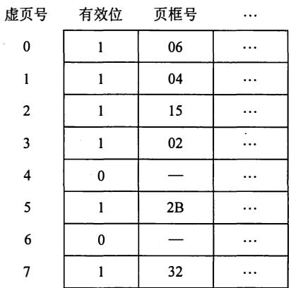
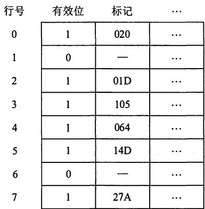

# 2011年全国硕士研究生人学统一考试

# 计算机科学与技术学科联考计算机学科专业基础综合试题

# 一、单项选择题（ $_ { 1 \sim 4 0 }$ 小题，每小题2分，共80分。下列每小题给出的四个选项中，只有一项符合题目要求)

1.设 $_ n$ 是描述问题规模的非负整数，下面程序片段的时间复杂度是

$$
\begin{array}{r l} & \mathbf {x} = 2; \\ & \text {w h i l e} (\mathbf {x} <   \mathbf {n} / 2) \\ & \mathbf {x} = 2 ^ {*} \mathbf {x}; \end{array}
$$

A. ${ \mathrm { O } } ( \log _ { 2 } n )$

B.0(n)

C. O(nlog2n)

D.O(n2)

2．元素a,b,c,d,e依次进入初始为空的栈中，若元素进栈后可停留、可出栈，直到所有元素都出栈，则在所有可能的出栈序列中，以元素d开头的序列个数是

A.3

B.4

3．已知循环队列存储在一维数组A[0...n-1]中，且队列非空时 front 和 rear分别指向队头元素和队尾元素。若初始时队列为空，且要求第1个进入队列的元素存储在A[0]处，则初始时 front和rear的值分别是 。

A.0,0

B.0,n-1

C. n-1,0

D. n-1, n-1

4．若一棵完全二叉树有 768个结点，则该二叉树中叶结点的个数是

A. 257

B.258

C.384

D.385

5．若一棵二叉树的前序遍历序列和后序遍历序列分别为1,2,3,4和4,3,2,1，则该二叉树的中序遍历序列不会是

A. 1,2,3,4

B. 2,3,4,1

C. 3,2,4,1

D. 4,3,2,1.

6．已知一棵有2011个结点的树，其叶结点个数为116，该树对应的二叉树中无右孩子的结点个数是 。

A. 115

B.116

C. 1895

D. 1896

7．对于下列关键字序列，不可能构成某二叉排序树中一条查找路径的序列是

A. 95,22,91,24,94, 71

B. 92,20,91,34,88,35

C. 21, 89,77,29,36,38

D. 12,25,71,68,33,34

8．下列关于图的叙述中，正确的是

I．回路是简单路径

II．存储稀疏图，用邻接矩阵比邻接表更省空间

III．若有向图中存在拓扑序列，则该图不存在回路

A.仅I

B.仅I、I

C.仅II

D.仅I、HI

9．为提高散列（Hash）表的查找效率，可以采取的正确措施是

I．增大装填（载）因子

II．设计冲突（碰撞）少的散列函数

III. 处理冲突（碰撞）时避免产生聚集（堆积）现象

A. 仅I

B. 仅II

C. 仅I、II

D. 仅II、III

10. 为实现快速排序算法， 待排序序列宜采用的存储方式是

A. 顺序存储

B. 散列存储

C. 链式存储

D. 索引存储

11. 已知序列25,13, 10, 12, 9 是大根堆， 在序列尾部插入新元素18, 将其再调整为大根堆，调整过程中元素之间进行的比较次数是 。

A. 1

B. 2

C. 4

D. 5

12. 下列选项中， 描述浮点数操作速度指标的是

A. MIPS

B. CPI

C. IPC

D. MFLOPS

13. float型数据通常用IEEE 754单精度浮点数格式表示。 若编译器将float型变量 $\mathbf { x }$ 分配到一个32位浮点寄存器FRI中， 且 ${ \bf x } = - 8 . 2 5$ , 则FRI的内容是 。

A. C104 OOOOH

B. C242 OOOOH

C. C184 OOOOH

D. C1C2 OOOOH

14. 下列各类存储器中， 不采用随机存取方式的是 。

A. EPROM

B. CDROM

C. DRAM

D. SRAM

15. 某计算机存储器按字节编址，主存地址空间大小为64MB 现用 $4 { \bf M } { \bf B } { \bf \times } { \bf 8 }$ 位的RAM芯片组成32MB的主存储器， 则存储器地址寄存器MAR的位数至少是

A. 22位

B. 23位

C. 25位

D. 26位

16. 偏移寻址通过将某个寄存器内容与一个形式地址相加而生成有效地址。下列寻址方式中，不属于偏移寻址方式的是 。

A. 间接寻址

B. 基址寻址

C. 相对寻址

D. 变址寻址

17. 某机器有一个标志寄存器， 其中有进位／借位标志CF、零标志ZF、符号标志SF 和溢出标志OF, 条件转移指令hgt (无符号整数比较大于时转移）的转移条件是 。

A. $\mathrm { C F } + \mathrm { O F } = 1$

B. $\overline { { \mathsf { S F } } } + Z \mathbf { F } = 1$

C. $\mathrm { C F } { + } \mathrm { Z F } = 1$

D. CF+SF=l

18. 下列给出的指令系统特点中， 有利于实现指令流水线的是 。

I. 指令格式规整且长度一致

II. 指令和数据按边界对齐存放

III. 只有Load/Store指令才能对操作数进行存储访问

A. 仅I、II

B. 仅II、III

C. 仅I、III

D. I、II、III

19. 假定不采用Cache和指令预取技术， 且机器处于 “开中断” 状态。在下列有关指令执行的叙述中，错误的是 。

A. 每个指令周期中CPU都至少访问内存一次   
B. 每个指令周期一定大于等于一个CPU时钟周期  
C. 空操作指令的指令周期中任何寄存器的内容都不会被改变  
D. 当前程序在每条指令执行结束时都可能被外部中断打断

20. 在系统总线的数据线上，不可能传输的是 。

A. 指令

B. 操作数

C. 握手（应答）信号

D. 中断类型号

21. 某计算机有五级中断 ${ \mathrm { L } } _ { 4 } { \sim } { \mathrm { L } } _ { 0 }$ ， 中断屏蔽字为 $\mathbf { M _ { 4 } M _ { 3 } M _ { 2 } M _ { 1 } M _ { 0 } }$ , ${ \bf M } _ { i } = 1$ $\langle 0 { \leqslant } i { \leqslant } 4 \rangle$ )表示对$\mathbf { L } _ { i }$ 级中断进行屏蔽。若中断响应优先级从高到低的顺序是 $\mathrm { L } _ { 4 } {  } \mathrm { L } _ { 0 } {  } \mathrm { L } _ { 2 } {  } \mathrm { L } _ { 1 } {  } \mathrm { L } _ { 3 }$ , 则 ${ \mathrm { L } } _ { 1 }$ 的中断处理程序中设置的中断屏蔽字是 。

1 1 1 1 0

B . 0 1 1 0 1

000 1 1

D . 0 1 0 1 0

某计算机处理器主频为 ${ 5 0 } \mathbf { M } \mathbf { H } \mathbf { z }$ , 采用定时查询方式控制设备 A 的 I/0, 查询程序运行一次所用的时钟周期数至少为500。在设备A工作期间，为保证数据不丢失，每秒需对其查询至少200次，则CPU用于设备A的I/O的时间占整个CPU时间的百分比至少是

A. $0 . 0 2 \%$   
B . $0 . 0 5 \%$   
C. $0 . 2 0 \%$   
D . $0 . 5 0 \%$

下列选项中， 满足短任务优先且不会发生饥饿现象的调度算法是 。

先来先服务  
B. 高响应比优先  
时间片轮转  
D 非抢占式短任务优先

下列选项中， 在用户态执行的是 。

命令解释程序  
B. 缺页处理程序  
进程调度程序  
D 时钟中断处理程序

在支持多线程的系统中， 进程 P 创建的若干线程不能共享的是

进程 P 的代码段  
B. 进程 P 中打开的文件  
C．进程P的全局变量  
D．进程P中某线程的栈指针

用户程序发出磁盘 I/0 请求后， 系统的正确处理流程是

用户程序 $\twoheadrightarrow$ 系统调用处理程序 $\twoheadrightarrow$ 中断处理程序 $\twoheadrightarrow$ 设备驱动程序  
用户程序 $\twoheadrightarrow$ 系统调用处理程序 $\twoheadrightarrow$ 设备驱动程序 $\twoheadrightarrow$ 中断处理程序  
用户程序一设备驱动程序一系统调用处理程序 $\twoheadrightarrow$ 中断处理程序  
用户程序 $\twoheadrightarrow$ 设备驱动程序 $\twoheadrightarrow$ 中断处理程序 $\twoheadrightarrow$ 系统调用处理程序

某时刻进程的资源使用情况如下表所示。

<table><tr><td rowspan="2">进程</td><td colspan="3">已分配资源</td><td colspan="3">尚需分配</td><td colspan="3">可用资源</td></tr><tr><td>R1</td><td>R2</td><td>R3</td><td>R1</td><td>R2</td><td>R3</td><td>R1</td><td>R2</td><td>R3</td></tr><tr><td>P1</td><td>2</td><td>0</td><td>0</td><td>0</td><td>0</td><td>1</td><td rowspan="4">0</td><td rowspan="4">2</td><td rowspan="4">1</td></tr><tr><td>P2</td><td>1</td><td>2</td><td>0</td><td>1</td><td>3</td><td>2</td></tr><tr><td>P3</td><td>0</td><td>1</td><td>1</td><td>1</td><td>3</td><td>1</td></tr><tr><td>P4</td><td>0</td><td>0</td><td>1</td><td>2</td><td>0</td><td>0</td></tr></table>

此时的安全序列是

A. $\mathbf { P } _ { 1 } , \mathbf { P } _ { 2 } , \mathbf { P } _ { 3 } , \mathbf { P } _ { 4 }$   
B . $\mathbf { P } _ { 1 } , \mathbf { P } _ { 3 } , \mathbf { P } _ { 2 } , \mathbf { P } _ { 4 }$   
C. $\mathbf { P } _ { 1 } , \mathbf { P } _ { 4 } , \mathbf { P } _ { 3 } , \mathbf { P } _ { 2 }$   
D. 不存在的

在缺页处理过程中， 操作系统执行的操作可能是 。

修改页表

II 磁 盘 1/0

III . 分配页框

仅 I 、 II

B . 仅 II

C . 仅 III

D . I 、 II 和 III

当系统发生抖动 (thrashing) 时， 可以采取的有效措施是 。

撤销部分进程

II. 增加磁盘交换区的容量

提高用户进程的优先级

仅 I

B . 仅 II

C . 仅 III

D . 仅 I 、 II

在虚拟内存管理中 地址变换机构将逻辑地址变换为物理地址 形成该逻辑地址的阶段是 。

编辑

B 编译

C. 链接

D . 装 载

31. 某文件占10个磁盘块， 现要把该文件磁盘块逐个读入主存缓冲区 ，并送用户区进行分析 ，假设一个缓冲区与一个磁盘块大小相同，把一个磁盘块读入缓冲区的时间 为 $1 0 0 \mu \mathbf { s }$ , 将缓冲区的数据传送到用户区的时间是 $5 0 \mu \ s$ , CPU对一块数据进行分析的时间 为 $5 0 \mu \mathbf { s }$ 。在单缓冲区和双缓冲区结构下， 读入并分析完该文件的时间分别是 。

A. l_SOOµs、lOOOµs

B. $1 5 5 0 \mu \mathbf { s }$ 、llOOµs

C. 1550µs、1550µs

D. 2000µs、2000µs

32. 有两个并发执行的进程 ${ \bf P } _ { 1 }$ 和 ${ \bf P } _ { 2 }$ , 共享初值为1的变量 $\mathbf { x }$ 。 ${ \bf P } _ { 1 }$ 对 $\mathbf { x }$ 加1, ${ \bf P } _ { 2 }$ 对 $\mathbf { x }$ 减l。加1和减l操作的指令序列分别如下所示。

／／加1操作 II减1操作 load $\mathbb { R 1 } , \mathbb { x }$ / /取 $\mathbf { x }$ 到寄存器Rl 中 load R2, x inc Rl. dei::: �2 玩ore x, Rl //将Rl的内容存入又 s氐re x,

两个操作完成后， $\mathbf { x }$ 的值

A. 可能为-1或3

B. 只能为1

C. 可能为0、 1或2

D. 可能为-1、 0 、 1或2

33. TCP/IP参考模型的网络层提供的是 。

A. 无连接不可靠的数据报服务

B. 无连接可靠的数据报服务

C. 有连接不可靠的虚电路服务

D. 有连接可靠的虚电路服务

34. 若某通信链路的数据传输速率 为2400bps,采用四相位调制，则该链路的波特率是 。

A. 600波特

B. 1200波特

C. 4800波特

D. 9600波特

35. 数据链路层采用选择重传协议(SR) 传输数据，发送方已发送了 $0 { \sim } 3$ 号数据帧 ，现已收到1号帧的确认 ，而O、 2号帧依次超时， 则此时需要重传的帧数是 。

A. 1

B. 2

C. 3

D. 4

36. 下列选项中，对正确接收到的数据帧进行确认的 MAC协议是 。

A. CSMA

B. CDMA

C. CSMA/CD

D. CSMA/CA

37. 某网络拓扑如下图所示，路由器Rl只有到达子网192.168.1.0/24的路由。为使Rl可以将1P分组正确地路由到 图中所有的 子网，则在 Rl中需要增加的一条路由（目的网络，子网掩码，下一跳）是 。


A. 192.168.2.0

255.255.255.128

192.168.1.1

B. 192.168.2.0

255.255.255.0

192.168.1.1

C. 192.168.2.0

255.255.255.128

192.168.1.2

D. 192.168.2.0

255.255.255.0

192.1�8.l.2

38. 在子网192.168.4.0/30中能接收目的地址为192.168.4.3的IP分组的最大主机数是 。

A. 0

B. 1

C. 2

D. 4

39. 主机甲向主机乙发送一个( $\mathbf { \nabla } \cdot \mathbf { S } \mathbf { Y } \mathbf { N } = 1$ , $\mathtt { s e q } = 1 1 2 2 0$ )的TCP段，期望与主机乙建立TCP

连接，若主机乙接受该连接请求，则主机乙向主机甲发送的正确的TCP段可能是 。

A. $\mathbf { S Y N } = 0$ , $\mathbf { A C K } = 0$ , $\mathtt { s e q } = 1 1 2 2 1$ , $\mathbf { a c k } = 1 1 2 2 1 .$ )   
B. $\mathbf { S Y N } = 1$ , $\mathbf { A C K } = 1$ , $\mathtt { s e q } = 1 1 2 2 0$ , $\mathbf { a c k } = 1 1 2 2 0 ,$ )   
C. $\mathbf { S Y N } = 1$ , $\mathbf { A C K } = 1$ , $\mathtt { s e q } . = 1 1 2 2 1$ , $\mathbf { a c k } = 1 1 2 2 1 \AA )$ )   
D. $\mathbf { S Y N } = 0$ , $\mathbf { A C K } = 0$ , $\mathtt { s e q } = 1 1 2 2 0$ , ack = 11220)

40. 主机甲与主机乙之间已建立一个TCP连接，主机甲向主机乙发送了3个连续的TCP段，分别包含300B、400B和500B的有效载荷， 第3个段的序号为900。 若主机乙仅正确接收到第1段和第3段，则主机乙发送给主机甲的确认序号是 。

A. 300

B. 500

C. 1200

D. 1400

# 二、综合应用题（第 $4 1 { \sim } 4 7$ 小题，共70分）

41. (8分）已知有6个 顶点（顶点 编号为 $0 \sim 5$ ) 的有向带权图G, 其邻接矩阵 $A$ 为上三角矩阵，按行为主序（行优先）保存在如下的一维数组中 。

<table><tr><td>4</td><td>6</td><td>∞</td><td>∞</td><td>∞</td><td>5</td><td>∞</td><td>∞</td><td>∞</td><td>4</td><td>3</td><td>∞</td><td>∞</td><td>3</td><td>3</td></tr></table>

要求：

(1)写出图G的邻接矩阵 $A$ 。  
(2)画出有向带权图G。  
(3)求图G的关键路径，并计算该关键路径的长度。

42. (15分） 一 $L$ $( L { \geqslant } 1 )$ )的升序序列S, 处在第 $\lfloor { L } / { 2 } \rceil$ 个位置的数称为 S的中位数。例如，若序列 $\mathrm { S } 1 = ( 1 1 , 1 3 , 1 5 , 1 7 , 1 9 )$ $\mathbf { S } 1 =$ , 则Sl的中位数是15, 两个序列的中位数是含它们所有元素的升序序列的中位数。例如，若 ${ \bf S } 2 = ( 2 , 4 , 6 , 8 , 2 0 )$ , 则 Sl和S2的中位数是11。现在有两个等长升序序列A和B, 试设计一个在时间和空间两方面都尽可能高效的算法，找出两个序列A和B的中位数。要求：

(1)给出算法的基本设计思想 。  
(2)根据设计思想，采用C、 ${ \mathrm { C } } { \mathrm { + } } { \mathrm { + } }$ 或Java语言描述算法，关键之处给出注释。  
(3)说明你所设计算法的时间复杂度和空间复杂度。

43. Cll分）假定在一个8位字长的计算机中 运 行如下 C程序段 ：

```txt
unsigned int x=134;  
unsigned int y=246;  
int m=x;  
int n=y;  
unsigned int z1=x-y;  
unsigned int z2=x+y;  
int k1=m-n;  
int k2=m+n; 
```

若 编译器编译时将8个8位寄存器 ${ \bf R } 1 \sim { \bf R } 8$ 分别分配给变量x、y、m、n、zl、z2、kl和k2。请回答下列问题 。（提示：带符号整数用补码表示。）

(1)执行上述程序段后，寄存器Rl、R5和R6的内容分别 是什么（用十六进制表示）？  
(2)执行上述程序段后，变量 $\mathbf { m }$ 和kl的值分别是多少（用十进制表示）？  
(3)上述程序段涉及带符号整数加／减、无符号整数加／减运算，这四种运算能否利用同一个加法器辅助电路实现？简述理由。  
(4)计算机内部如何判断带符号整数加I减运算的结果是否发生溢出？上述程序段中，哪些带

符号整数运算语句的执行结果会发生溢出？

44. (12分）某计算机存储器按字节编址，虚拟（逻辑）地址空间大小为16MB, 主存（物理）地址空间大小为1MB, 页面大小为4KB; Cache采用直接映射方式，共8行；主存与Cache之间交换的块大小为32B。 系统运行到某一时刻时，页表的部分内容和Cache的部分内容分别如题44-a图、 题44-b图所示，图中页框号及标记字段的内容为十六进制形式。

  
题44-a图 页表的部分内容

  
题44-b图 Cache的部分内容

请回答下列问题。

(1)虚拟地址共有几位，哪儿位表示虚页号？物理地址共有几位，哪几位表示页框号（物理页号）？  
(2)使用物理地址访问Cache时，物理地址应划分成哪儿个字段？要求说明每个字段的位数及在物理地址中的位置。  
(3)虚拟地址001C60H所在的页面是否在主存中？若在主存中，则该虚拟地址对应的物理地址是什么？访问该地址时是否Cache命中？要求说明理由。  
(4) 一 TLB共可存放8个页表项， 若其当前内容（ 十六进制）如题44-c图所示， 则此时虚拟地址024BACH所在的页面是否存在主存中？要求说明理由。

题44-c图 TLB的部分内容  

<table><tr><td>组号</td><td>有效位</td><td>标记</td><td>页框号</td><td>有效位</td><td>标记</td><td>页框号</td><td>有效位</td><td>标记</td><td>页框号</td><td>有效位</td><td>标记</td><td>页框号</td></tr><tr><td>0</td><td>0</td><td>-</td><td>-</td><td>1</td><td>001</td><td>15</td><td>0</td><td>-</td><td>-</td><td>1</td><td>012</td><td>1F</td></tr><tr><td>1</td><td>1</td><td>013</td><td>2D</td><td>0</td><td>-</td><td>-</td><td>1</td><td>008</td><td>7E</td><td>0</td><td>-</td><td>-</td></tr></table>

45. (8分）某银行提供1个服务窗口和10个供顾客等待的座位。 顾客到达银行时，若有空座位，则到取号机上领取一个号，等待叫号。取号机每次仅允许一位顾客使用。 当营业员空闲时，通过叫号选取一位顾客，并为其服务。顾客和营业员的活动过程描述如下：

```txt
cobegin  
{process 顾客i从取号机获取一个号码；等待叫号；获取服务；}process 营业员
```

```txt
while（TRUE） 叫号； 为客户服务； }   
}coend
```

请添加必要的信号量和P、V (或wait()、signal())操作，实现上述过程中的互斥与同步。 要求写出完整的过程，说明信号量的含义并赋初值。

46. (7分）某 文件系统为一级目录结构，文件的数据 一次性写入磁盘，已写入的文件不可修改，但可多次创建新文件。 请回答如下问题。

(1)在连续、 链式、 索引三种文件的数据块组织方式中，哪种更合适？要求说明理由。 为定位文件数据块，需要FCB中设计哪些相关描述字段？  
(2)为快速找到文件，对于FCB, 是集中存储好，还是与对应的文件数据块连续存储好？要求说明理由。

47. (9分） 某主机的MAC地址为00-15-CS-Cl-SE-28 , IP地址为10.2.128.100 (私有地址）。 题47-a图是网络拓扑，题47-b图是该主机进行Web请求的1个以太网 数据帧前80B的十六进制及ASCII码内容。

  
题47-b图 以太网数据帧（前80B)

题47-a图 网络拓扑

```txt
0000 00 21 27 21 51 ee 00 15 c5 c1 5e 28 08 00 45 00 .!!Q....^(.E.  
0010 01 ef 11 3b 40 00 80 06 ba 9d 0a 02 80 64 40 aa ...@... ....d@.  
0020 62 20 04 ff 00 50 e0 e2 00 fa 7b f9 f8 05 50 18 b ...P...{...P.  
0030 fa f0 1a c4 00 00 47 45 54 20 2f 72 66 63 2e 68 ....GE T /rfc.h  
0040 74 6d 6c 20 48 54 54 50 2f 31 2e 31 0d 0a 41 63 tml HTTP /1..Ac 
```

请参考图中的数据 回答以下问题。

(1) Web服务器的IP地址是什么？该主机的默认网关的MAC地址是什么？  
(2)该主机在构造题47-b图的数据帧时，使用什么协议确定目的MAC地址？封装该协议请求报文的以太网帧的目的MAC地址是什么？  
(3)假设HTTP/1.1协议以持续 的非流水线方式工作，一次请求－响应时间为RTT , rfc.html页面引用了5个JPEG小图像，则从发出题47-b图中的Web请求开始到浏览器收到全部内容为止，需要多少个RTT?  
(4)该帧所封装的IP分组经过路由器R转发时，需修改IP分组头中的哪些字段？

注： 以太网数据帧结构和IP分组头结构分别如题47-c图、题47-d图所示。

<table><tr><td>6B</td><td>6B</td><td>2B</td><td>46-1500B</td><td>4B</td></tr><tr><td>目的MAC地址</td><td>源MAC地址</td><td>类型</td><td>数据</td><td>CRC</td></tr></table>

题47-c图 以太网帧结构  
题47-d图 IP分组头结构  

<table><tr><td colspan="5">比特 0 8 16 24 31</td></tr><tr><td>版本</td><td>头部长度</td><td>服务类型</td><td colspan="2">总长度</td></tr><tr><td colspan="3">标识</td><td>标志</td><td>片偏移</td></tr><tr><td colspan="2">生存时间(TTL)</td><td>协议</td><td colspan="2">头部校验和</td></tr><tr><td colspan="5">源IP地址</td></tr><tr><td colspan="5">目的IP地址</td></tr></table>