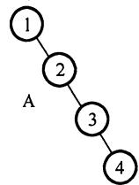
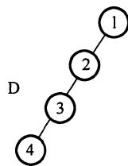
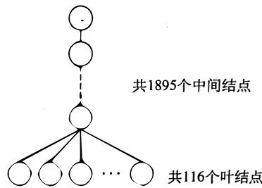
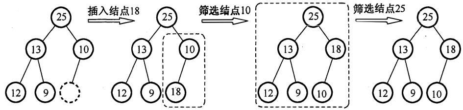
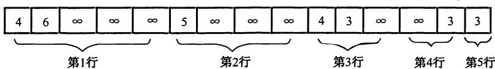
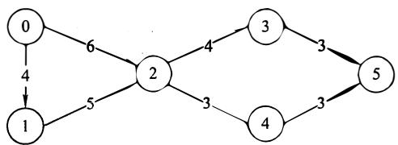

# 2011 年计算机学科专业基础综合试题参考答案

# 一、单项选择题

1.9. A 2. 10. A 3. 11. B 4. 12. 5. 13. A 6. 14. D 7. A 8. 16. 17. C 18. D 19. C 20. C 21. D 22. C 23. B 24. A 25. D 26. B 27. D 28. D 29. A 30. C 31. B 32. C 33. A 34. B 35. B 36. D 37. D 38. C 39. C 40. B

l. 解析：

在程序中，执行频率最高的语句为 "x=2*x"。设该语句共执行了 T(n)次，则 n)+l~n/2, ${ } ^ { 6 6 } \mathbf { x } { = } 2 ^ { * } \mathbf { X } ^ { \prime \prime }$ $T ( n )$ $2 ^ { { \cal T } ( n ) + 1 } { \leqslant } n / 2$ $T ( n ) = \log _ { 2 } ( n / 2 ) - 1 = \log _ { 2 } n - 2$ , $T ( n ) = { \cal { O } } ( \log _ { 2 } n ) .$

2. 解析：

为第 个出栈元素，则 之前的元素必定是进栈后在栈中停留。因而出栈顺序必为 d_c_b_a_,的顺序不定，在任一"_"上都有可能，一共有 种可能。

【另解】 首先出栈，则 abc 停留在栈中，此时栈的状态如右图所示。

此时可以有如下 种操作： (De 进栈后出栈，则出栈序列为 decba; ®c $\textcircled{1} \textcircled{1} \textcircled { }$ $\textcircled{2} \textcircled { < } \textcircled { 2 } \textcircled { < }$ 栈， 进栈后出栈，出栈序列为 dceba; @cb 出栈， 进栈后出栈，出栈序列为 $\textcircled{3} \textcircled { 2 }$ dcbea; ©cba 出栈， 进栈后出栈，出栈序列为 dcbae


3. 解析：

根据题意，第一个元素进入队列后存储在 处，此时 值都为 。入队时由于要执行(rear+ 1)%n 操作，所以如果入队后指针指向 o, rear 初值为 n-1, 而由千第一个元素在 $( \mathrm { r e a r } + 1 ) \%  { \mathrm { n } }$ $n { - } 1$ A[O]中，插入操作只改变 rear 指针，所以 front 不变。

注意：©循环队列是指顺序存储的队列，而不是指逻辑上的循环，如循环单链表表示的队列 $\textcircled{1}$ 不能称为循环队列。 @front rear 的初值并不是固定的。 $\textcircled{2}$

【排除法】如果 front rear 的初值相等，则无法判断队列空和队列满，排除 。第进入队列的元素存储在 A[O]处，进队操作不会改变 的值，由题意可知队列非空时 指向队头元素，故 front 初值为 o, 只能选

4. 解析：

根据完全二叉树的性质，最后一个分支结点的序号为Ln12 =L16s12 =384, 故叶子结点的个 $\underline { { n } } / 2 \rfloor = \lfloor 7 6 8 / 2 \rfloor = 3 8 4$ 数为 $7 6 8 - 3 8 4 = 3 8 4$ 。

【另解 】由二叉树的性质 n=n n1+n2 =n2+ 可知， n=2n -I +ni, 2n -I +n1=768, $n = n _ { 0 } + n _ { 1 } + n _ { 2 }$ $n _ { 0 } = n _ { 2 } + 1$ $n = 2 n _ { 0 } { - } 1 + n _ { 1 }$ $2 n _ { 0 } - 1 + n _ { 1 } = 7 6 8$ 显然 $n _ { \mathrm { l } } = 1$ $2 n _ { 0 } = 7 6 8$ ，则 $n _ { 0 } = 3 8 4$ 。

【另解 】完全二叉树的叶子结点只可能出现在最下两层，由题可计算完全二叉树的高度为10 。第 10 层的叶子结点数为 768-(29-1) = 257; 10 层的叶子结点在第 层共有「257127= 129 $7 6 8 - ( 2 ^ { 9 } - 1 ) = 2 5 7$ $\overline { { 2 5 7 / 2 } } \overline { { 1 2 9 } }$ 父结点，第 层的叶子结点数为(29-1)-129= 127, 则叶子结点的总数为 257 + 127 = 384 $( 2 ^ { 9 } – 1 ) - 1 2 9 = 1 2 7$ $2 5 7 + 1 2 7 = 3 8 4$

5. 解析：

前序序列为 NLR, 后序序列为 LRN, 由千前序序列和后序序列刚好相反，故不可能存在一个结点同时存在左右孩子，即二叉树的高度为 为根结点，由千根结点只能有左孩子（或右

孩子)，因此，在中序序列中，1或在序列首或在序列尾，ABCD 皆满足要求。仅考虑以1的孩子结点2 为根结点的子树 它也只能有左孩子 （或右孩子）， 因此， 在中序序列中 ， 2 或在序列首或序列尾，ABD皆满足要求

【另解】画出各选项与题干信息所对应的二叉树如下，故ABD均满足。



  
B



# 6. 解析：

树转换为二叉树时，树中每一个分支结点的所有子结点中的最右子结点无右孩子，根结点转换后也没有右孩子，因此，对应的二叉树中无右孩子的结点个数 $=$ 分支结点数 $+ 1 = 2 0 1 1 - 1 1 6 + 1 =$

1896。通常本题应采用特殊法解，设题意中的树是如右图所示的结构，则对应的二叉树中仅有前115个叶结点有右孩子，故无右孩子的结点个数 $= 2 0 1 1 - 1 1 5 = 1 8 9 6 .$ 。

# 7. 解析：

在二叉排序树中，左子树结点值小于根结点，右子树结点值大于根结点。在选项A中，当查找到91后再向24查找，说明这一条路径（左子树）之后查找的数都要比91小，而后面却查找到了94 C解题过程中，建议配合画图），因此错误。



【画图法】各选项对应的查找过如下图， BCD对应的查找树都是二叉排序树，A对应的查找树不是二叉排序树，因为在91为根的左子树中出现了比91大点的结点94。

  
(a)选项A的查找过程

  
(b)选项B的查找过程

  
(c)选项C的查找过程

  
(d)选项D的查找过程

# 8 . 解析：

第一个顶点和最后一个顶点相同的路径称为回路；序列中顶点不重复出现的路径称为简单路径；回路显然不是简单路径，故I错误；稀疏图是边比较少的情况，此时用邻接矩阵的空间复杂度为 ${ \mathsf { O } } ( n ^ { 2 } )$ , 必将浪费大量的空间，而邻接表的空间复杂度为 ${ \bf O } ( n { + } e )$ , 应该选用邻接表，故II错误。存在回路的有向图不存在拓扑序列，若拓扑排序输出结束后所余下的顶点都有前驱，则说明只得到了部分顶点的拓扑有序序列，图中存在回路，故III正确。

# 9. 解析：

Hash表的查找效率取决于散列函数、处理冲突的方法和装填因子。显然，冲突的产生概率与装填因子（表中记录数与表长之比）的大小成正比，即装填得越满越容易发生冲突，I错误。II

显然正确。采用合适的处理冲突的方式避免产生聚集现象，也将提高查找效率，例如用拉链法解决冲突时就不存在聚集现象，用线性探测法解决冲突时易引起聚集现象， 正确。

# 10. 解析：

对绝大部分内部排序而言，只适用于顺序存储结构。快速排序在排序的过程中，既要从后向前查找，也要从前向后查找，因此宜采用顺序存储。

# 11. 解析：

插入 后，首先将 与 0 比较，交换位置，再将 18 与 25 比较，不交换位置。共比较了 2次，调整的过程如下图所示。



# 12. 解析：

M 是每秒执行多少百万条指令，适用千衡量标量机的性能。CPI 是平均每条指令的时钟周期数。 是 的倒数，即每个时钟周期执行的指令数。 是每秒执行多少百万条浮点数运算，用来描述浮点数运算速度，适用于衡量向量机的性能。

# 13. 解析：

本题题意即考查IEEE754单精度浮点数的表示。先将 $\mathbf { x }$ 转换成二进制为- $- 1 0 0 0 . 0 1 = - 1 . 0 0 0 0 1 { \times } 2 ^ { 3 }$ ,其次计算阶码 E, 根据 IEEE 754 单精度浮点数格式，有 $\mathbf { E } - 1 2 7 = 3$ , 故 $\mathrm { E } = 1 3 0$ , 转换成二进制为 。最后，根据 标准，最高位的 $^ { \dprime } { } ^ { \dprime }$ 是被隐藏的。

IEEE 754 单精度浮点数格式：数符(1位） $^ +$ 阶码 (8 位） $+$ 尾数 (23 位）。

故，FRI 内容为 1; 1000 0010; 0000 10000 0000 0000 0000 000。

即，1100 0001 0000 0100 0000 0000 0000 0000 = C104000H。

本题易误选 D, 未考虑 IEEE 754 标准隐含最高位 1 的情况，偏置值是 128。

# 14. 解析：

随机存取方式是指 CPU 可以对存储器的任一存储单元中的内容随机存取， 而且存取时间与存储单元的物理位置无关。选项 A、 C、 D 均采用随机存取方式，CD-ROM 即光盘，采用串行存取方式。

注意：CD-ROM 是只读型光盘存储器，而不属于只读存储器 (ROM)。

# 15. 解析：

主存按字节编址，地址空间大小为 64MB, M凡＼的寻址范围为 $6 4 \mathrm { M } = 2 ^ { 2 6 }$ , 故为 26 位。实际的主存容量 不能代表 凡过勺位数，考虑到存储器扩展的需要八丛 应保证访问到整个主存地址空间，反过来， 凡辽彴位数决定了主存地址空间的大小。

# 16. 解析：

间接寻址不需要寄存器， $\mathbf { E A } = ( \mathbf { A } )$ 。基址寻址 $\operatorname { E A } = \mathbf { A } +$ 基址寄存器 BR内容；相对寻址 $\mathbf { E A } =$ $\mathbf { A } +$ 程序计数器 PC内容；变址寻址 $\operatorname { E A } = \mathbf { A } +$ 变址寄存器 IX内容。后三者都是将某个寄存器内容与一个形式地址相加而形成有效地址，故选A。

# 17. 解析：

假设两个无符号整数 A 和 B,bgt 指令会将 A 和 B 进行比较，也就是将 A 和 B 相减。如果 $\mathbf { A } > \mathbf { B }$ ,

也不为 0 (为 0 时表示两数相同），故而 CF 和 ZF 均为 o, 选 C。其中用到了符号标志 SF 和溢出标志 OF, 显然应当排除。

# 18. 解析：

对齐和仅 Load/Store指令访存，这 3 个都是 RISC 的特征，指令格式规整且长度一致能大大简化指令译码的复杂度，有利于实现流水线。指令和数据按边界对齐存放能保证在一个存取周期内取到需要的数据和指令，不用多余的延迟等待，也有利于实现流水线。只有Load/Store指令才能对操作数进行存储访问使取指令、取操作数操作简化且时间长度固定，能够有效地简化流水线的复杂度。

# 19. 解析：

由于不采用指令预取技术，每个指令周期都需要取指令，而不采用 Cache技术，则每次取指令都至少要访问内存一次（当指令字长与存储字长相等且按边界对齐时），A正确。时钟周期是CPU 的最小时间单位，每个指令周期一定大于或等于一个 CPU 时钟周期，B正确。即使是空操作指令，在取指操作后，PC也会自动加1, C 错误。由于机器处于 “开中断” 状态，在每条指令执行结束时都可能被外部中断而打断。

# 20. 解析：

在取指令时，指令便是在数据线上传输的。操作数显然在数据线上传输。中断类型号用以指出中断向量的地址，CPU 响应中断请求后，将中断应答信号-(�TR)发回到数据总线上，CPU从数据总线上读取中断类型号后，查找中断向量表，找到相应的中断处理程序入口。而握手（应答）信号属于通信联络控制信号，应在通信总线上传输。

# 21. 解析：

高优先级置 0 表示可被中断，比该中断优先级低（或相等）的置 l 表示不可被中断， $\mathrm { L } _ { 1 }$ 只能屏蔽 L3和其自身，故 M3和M置1, 中断屏蔽字汕M 凡M品=01010。 $\mathrm { L } _ { 3 }$ $\mathbf { M } _ { 3 }$ $\mathbf { M } _ { 1 }$ $\mathbf { M } _ { 4 } \mathbf { M } _ { 3 } \mathbf { M } _ { 2 } \mathbf { M } _ { 1 } \mathbf { M } _ { 0 } = 0 1 0 1 0$

# 22. 解析：

每秒至少查询 200次，每次查询至少 500个时钟周期，总的时钟周期数为 $2 0 0 { \times } 5 0 0 = 1 0 0 0 0 0$ ,因此CPU 用于设备A的I/0的时间占CPU 时间比为 $1 0 0 0 0 0 / 5 0 \mathbf { M } = 0 . 2 0 \%$ 。

# 23. 解析：

高响应比优先算法是一种综合考虑任务长度和等待时间的调度算法，响应比 $=$ （等待时间 $^ +$ 执行时间）／执行时间。高响应比优先算法在等待时间相同的情况下，作业执行时间越短则响应比越高，满足短任务优先。随着长任务的等待时间增加，响应比也会变大，执行机会也就增大，所以不会发生饥饿现象。先来先服务和时间片轮转不符合短任务优先，非抢占式短任务优先会产生饥饿现象。

# 24. 解析：

缺页处理和时钟中断都属千中断，在核心态执行；进程调度是操作系统内核进程，无须用户干预，在核心态执行；命令解释程序属于命令接口，是四个选项中唯一能面对用户的，它在用户态执行。

# 25. 解析：

进程是资源分配的基本单位，线程是处理机调度的基本单位。因此开的文件、进程的全局变量等都是进程的资源，唯有进程中某线程的栈指针是属于线程的，属于进程的资源可以共享，属于线程的栈是独享的，对其他线程透明。

# 26. 解析：

输入／输出软件一般从上到下分为四个层次：用户层、与设备无关的软件层、设备驱动程序以

及中断处理程序。 与设备无关的软件层也就是系统调用的处理程序。

当用户使用设备时， 首先在用户程序中发起一次系统调用，操作系统的内核接到该调用请求后请求调用处理程序进行处理， 再转到相应的设备驱动程序， 当设备准备好或所需数据到达后设备硬件发出中断， 将数据按上述调用顺序逆向回传到用户程序中。

# 27. 解析：

本题应采用排除法，逐个代入分析。当剩余资源分配给 ${ \bf P } _ { 1 }$ , 待 ${ \bf P } _ { 1 }$ 执行完后，可用资源数为(2, , 1),此时仅能满足 ${ \tt P } _ { 4 }$ 的需求，排除AB; 接着分配给 ${ \tt P } _ { 4 }$ , 待 $\mathbf { P _ { 4 } }$ 执行完后， 可用资源数为(2, 2, 2), 此时已无法满足任何进程的需求， 排除C。 此外，本题还可以使用银行家算法求解（对于选择题来说， 显得过于复杂）。

# 28. 解析：

缺页中断产生后， 需要在内存中找到空闲页框并分配给需要访问的页（可能涉及页面置换），之后缺页中断处理程序调用设备驱动程序做磁盘I/0, 将位于 外存上的页面调入内存， 调入后需要修改页表， 将页表中代表该页是否在内存的标志位（或有效位） 置为1, 并将物理页框号填入相应位置， 若必要还需修改其他相关表项等。

# 29. 解析：

在具有对换功能的操作系统中， 通常把外存分为文件区和 对换区。 前者用于存放文件， 后者用于存放从内存换出的进程。抖动现象是指刚刚被换出的页很快又要被访问， 为此又要换出其他页，而该页又很快被访问， 如此频繁地置换页面， 以致大部分时间都花在页面置换上， 引起系统性能下降。 撤销部分进程可以减少所要用到的页面数，防止抖动。 对换区大小和进程优先级都与抖动无关。

# 30. 解析：

编译后的模块需要经过链接才能装载，而链接后形成的地址才是整个程序的完整逻辑地址空间。 以C语言为例： C语言经过预处理(cpp)-编译(eel) $\twoheadrightarrow$ 汇编(as) $\twoheadrightarrow$ 链接Cld)产生可执行文件。其中链接的前一步，产生了可重定位的二进制的目标文件。C语言采用源文件独立编译的方法，如程序main.e, filel.e, file2.e, filel.h, file2.h, 在链接的前 一步生成了main.o,filel.o, file2.o,这些目标模块采用的逻辑地址都从 0开始，但只是相对于该模块的逻辑地址。链接器将这三个 文件，libe和其他的库文件链接成一个可执行 文件。 链接阶段主要完成了重定位， 形成整个程序的完整逻辑地址空间。

例如，filel.o的逻辑地址为 $0 \sim 1 0 2 3$ 3, main.o的逻辑地址为 $0 \sim 1 0 2 3$ 3, 假设链接时将filel.o链接在main.o之后， 则重定位之后filel.o对应的逻辑地址就应为 $1 0 2 4 { \sim } 2 0 4 7$ 。

一 题有不少同学会对C选项有疑问，认为产生逻辑地址的阶段是链接，下面引入一个线性地址的概念来解释为什么链接是不对的。 为了区分各种不同的地址， 下面也把逻辑地址和物理地址一并介绍。

逻辑地址(LogiealAddress)是指在程序各个模块中的偏移地址。 它是相对于当前模块首址的地址。

地址(LinearAddress)是指在分页式存储管理中单个程序所有模块集合在一起构成的地址。

物理地址(PhysiealAddress)是指出现在CPU外部地址总线上的寻址物理内存的地址信号，是地址变换的最终结果地址。 它实际上就是物理内存真正的地址。 线性地址的概念在很多操作系统书中并不涉及，在这里引入只是为了把这题解释清楚。选择C选项的同学应该是把题目所说的逻辑地址当成了线性地址。 实际上， 很多书中也不会把这线性地址和逻辑地址区分得那么清楚，

而统一的称为逻辑地址， 这就导致了这题的错误选择。

总之，在这题中，逻辑地址指的就是段内的偏移量而不是链接后生成的整个程序全局的逻辑地址空间， 所以逻辑地址是编译时产生的。编者在查相关资料的过程中看到了关于这个问题的 很多不一样的 说法， 这 也是操作系统这门课的一个 “ 特色”，所以这里综合了各个 说法，并给出了一个觉得相对合理的解释， 读者不必过多纠结，实际考试碰上这种问题的概率还是很低的。

# 31. 解析：

在单缓冲区中，当上一个磁盘块从缓冲区读入用户区完成时，下一磁盘块才能开始读入， 也就是当最后一块磁盘块读入用户区完毕时所 用时间为 $1 5 0 { \times } 1 0 = 1 5 0 0 \mu \ s$ , 加上处理最后一个磁盘块的时间 $5 0 \mu \mathbf { s }$ , 得 $1 5 5 0 \mu \ s$ 。双缓冲区中，不存在等待磁盘块从缓冲区读入用户区的问题，10个磁盘块可以连续从外存读入主存缓冲区，加上将最后一个磁盘块从缓冲区送到用户区的传输时间$5 0 \mu \ s$ 以及处理时间 $5 0 \mu \ s$ , 也就是 $1 0 0 { \times } 1 0 + 5 0 + 5 0 = 1 1 0 0 up \mu \mathbf { s }$ 。

# 32. 解析：

将 ${ \bf P } _ { 1 }$ 中3条语句依次编号为1,2,3: ${ \bf P } _ { 2 }$ 中3条语句依次编号为4,5, 6 。 依次执行1,2, 3, 4, 5,6得结果1 , 依次执行1,2, 4, 5, 6, 3得结果2 , 执行4,5, 1, 2, 3, 6得结果0 。因此结果-1 不可能得出。

# 33. 解析：

TCP/IP的网络层向上只提供简单灵活的、无连接的、尽最大努力交付的数据报服务。考查IP首部，如果是面向连接的，那么应有用于建立连接的字段，但是没有；如果提供可靠的服务，那么至少应有序号和校验 和两个字段，但是IP分组头中也没有(IP首部中只是首部校验和）。通常有连接、 可靠的应用是由运输层的TCP实现的。

# 34. 解析：

波特率 $B$ 与数据传输率 $C$ 的关系： $C = B \mathrm { l o g } _ { 2 } N$ $N$ 为一个码元所取的离散值个数。采用4种相位，也即可以表示4种变化，故一个码元可携带 $1 0 \mathbf { { g } } _ { 2 } 4 = 2 \mathbf { { b } } \mathbf { { i t } }$ 信息， 则该链路的波特率 $=$ 比特率 $/ 2 = 1 2 0 0$ 波特。

# 35. 解析：

在选择 重传协议中，接收方逐个确认正确接收的分组，不管接收到的分组是否有序 ， 只要正确接收就发送选择ACK分组进行确认。因此选择重传协议中的ACK分组不再具有累积确认的作用，要特别注意其与GBN协议的区别。本题中只收到1号帧的确认，O、 2号帧超时，由于对于1号帧的确认不具累积确认的作用，因此发送方认为接收方没有收到0、2号帧，于是重传这两帧。因为3号帧计时器并无超时， 所以暂时不用重传3号帧。

# 36. 解析：

CSMA/CA是无线局域网标准802.11中的协议，它在CSMA的基础上增加了冲突避免的功能。ACK帧是CSMA/CA避免冲突的机制之一， 也就是说，只有当发送方收到接收方发回的ACK帧后才确认发出的数据帧已正确到达目的地。

【排除法】首先CDMA即码分多址，是物理层的内容； CSMA/CD即带冲突检测的载波监听多路访问，接收方并 不需要确认；对于 CSMA, 既然CSMA/CD 是其超集，是CSMA/CD没有的内容， CSMA自然也没有。 于是 使用排除法选D。

# 37. 解析：

要使Rl能够正确将分组路由到所有子网，则Rl中需要有到192.168.2.0/25和192.168.2.128/25的路由，分别转换成二进制如下;

192.168.2.0: 11000000 10101000 00000010 00000000

192.168.2.128: 11000000 10101000 00000010 10000000

前24 位都是相同的，于是可以聚合成超网192.168.2.0/24, 子网掩码为前24位，即255.255.255.0。下 一跳是与Rl直接 相连的R2的地址，因此是192.168.1.2。

# 38. 解析：

192.168.4.0/30这个网络，主机号只占2位，地址范围为192.168.4.0-192.168.4.3,主机号全l时，即192.168.4.3是广播地址， 主机号全0表示本网络 本身，不作为主机地址使用，因此可容纳 $4 - \ 2 = 2$ 个 主机 。

【注意】有些题（特别是综合题）可能采用逆向思维模拟考查 给出最大容量的主机数 要当的子网划分 也必须依照上述规律而灵活应用。

# 39. 解析：

在确认报文段中，同步位SYN和确认位ACK必须都是1; 返回的确认号seq是甲发送的初始序号 $\mathtt { s e q } = 1 1 2 2 0$ 加1, 即 $\mathbf { a c k } = 1 1 2 2 1$ ; 同时乙也要选择并消耗一个初始序号seq, seq值由乙的TCP进程任意给出，它与确认号、请求报文段的序号没有任何关系。

# 40. 解析：

TCP首部的序号字段是指本报文段数据部分的第一个字节的序号，而确认号是期待收到对方下 一个报文段的第一个字节的序号。第三个段的序号为900, 则第二个段的序号为 $9 0 0 - 4 0 0 = 5 0 0$ ,现在主机乙期待收到第二个段，故发给甲的确认号是500。

# 二、综合应用题

# 41. 解答：

I)在上三角矩阵A[6][6]中，第1行至第5行主对角线上方的元素个数分别为5, 4, 3, 2, I,由此可以画出压缩存储数组中的元素所属行的情况，如下图所示。



用 “ 平移” 的思想，将前5个、后4个、后3个、后2个、后1个元素，分别移动到矩阵对角线 $( ^ { \mathfrak { a } } 0 ^ { \mathfrak { n } } )$ 右边的行上。图G的邻接矩阵 $\pmb { A }$ 如下 所示。

$$
A = \left[ \begin{array}{l l l l l l} 0 & 4 & 6 & \infty & \infty & \infty \\ \infty & 0 & 5 & \infty & \infty & \infty \\ \infty & \infty & 0 & 4 & 3 & \infty \\ \infty & \infty & \infty & 0 & \infty & 3 \\ \infty & \infty & \infty & \infty & 0 & 3 \\ \infty & \infty & \infty & \infty & \infty & 0 \end{array} \right]
$$

2)根据上面的邻接矩阵，画出有向带权图G, 如下图所示。



3)按照算法，先计算各个事件的最早发生时间，计算过程如下：

$$
\begin{array}{l} \mathbf {v e} (0) = 0; \\ \mathbf {v e} (1) = \mathbf {v e} (0) + \mathbf {a} _ {0 - 1} = 4; \\ \operatorname {v e} (2) = \max  \left\{\operatorname {v e} (0) + a _ {0 - 1}, \operatorname {v e} (1) + a _ {1 - 2} \right\} = \max  (6, 4 + 5) = 9; \\ \end{array}
$$

$$
\begin{array}{l} \operatorname {v e} (3) = \operatorname {v e} (2) + a _ {2 \rightarrow 3} = 9 + 4 = 1 3; \\ \mathrm {v e} (4) = \mathrm {v e} (2) + \mathrm {a} _ {2 \rightarrow 4} = 9 + 3 = 1 2; \\ \operatorname {v e} (5) = \max  \left\{\operatorname {v e} (3) + a _ {3 - 5}, \operatorname {v e} (4) + a _ {4 - 5} \right\} = \max  (1 6, 1 5) = 1 6; \\ \end{array}
$$

接下来求各个时间的最迟发生时间，计算过程如下：

$$
\begin{array}{l} \operatorname {v l} (5) = \operatorname {v e} (5) = 1 6; \\ \operatorname {v l} (4) = \operatorname {v l} (5) - a _ {4 \rightarrow 5} = 1 6 - 3 = 1 3; \\ \operatorname {v l} (3) = \operatorname {v l} (5) - a _ {3 \rightarrow 5} = 1 6 - 3 = 1 3; \\ \operatorname {v l} (2) = \min  \left\{\operatorname {v l} (3) - a _ {2 - 3}, \operatorname {v l} (4) - a _ {2 - 4} \right\} = \min  (9, 1 0) = 9; \\ \operatorname {v l} (1) = \operatorname {v l} (2) - a _ {1 - 2} = 4; \\ \operatorname {v l} (0) = \min  \left\{\operatorname {v l} (2) - a _ {0 - 2}, \operatorname {v l} (1) - a _ {0 - 1} \right\} = \min  (3, 0); \\ \end{array}
$$

即ve()和vl()数组如下表所示。

<table><tr><td>i</td><td>0</td><td>1</td><td>2</td><td>3</td><td>4</td><td>5</td></tr><tr><td>ve(i)</td><td>0</td><td>4</td><td>9</td><td>13</td><td>12</td><td>16</td></tr><tr><td>vl(i)</td><td>0</td><td>4</td><td>9</td><td>13</td><td>13</td><td>16</td></tr></table>

接下来计算所有活动的最早和最迟发生时间e()和1():

$$
\begin{array}{l} \mathrm {e} \left(\mathrm {a} _ {0 - 1}\right) = \mathrm {e} \left(\mathrm {a} _ {0 - 2}\right) = \mathrm {v e} (0) = 0; \\ \mathrm {e} \left(\mathrm {a} _ {1 - 2}\right) = \mathrm {v e} (1) = 4; \\ \mathrm {e} \left(\mathrm {a} _ {2 - 3}\right) = \mathrm {e} \left(\mathrm {a} _ {2 - 4}\right) = \mathrm {v e} (2) = 9; \\ \mathrm {e} \left(\mathrm {a} _ {3 - 5}\right) = \mathrm {v e} (3) = 1 3; \\ \mathrm {e} \left(\mathrm {a} _ {4 - 5}\right) = \mathrm {v e} (4) = 1 2; \\ \mathrm {l} \left(\mathrm {a} _ {4 \rightarrow 5}\right) = \mathrm {v l} (5) - \mathrm {a} _ {4 \rightarrow 5} = 1 6 - 3 = 1 3; \\ \mathrm {l} \left(\mathrm {a} _ {3 \rightarrow 5}\right) = \mathrm {v l} (5) - \mathrm {a} _ {3 \rightarrow 5} = 1 6 - 3 = 1 3; \\ \mathrm {l} \left(\mathrm {a} _ {2 - 4}\right) = \mathrm {v l} (4) - \mathrm {a} _ {2 - 4} = 1 3 - 3 = 1 0; \\ \mathrm {l} \left(\mathrm {a} _ {2 - 3}\right) = \mathrm {v l} (3) - \mathrm {a} _ {2 - 3} = 1 3 - 4 = 9; \\ \mathrm {l} \left(\mathrm {a} _ {1 \rightarrow 2}\right) = \mathrm {v l} (2) - \mathrm {a} _ {1 \rightarrow 2} = 9 - 5 = 4; \\ \mathrm {l} \left(\mathrm {a} _ {0 \rightarrow 2}\right) = \mathrm {v l} (2) - \mathrm {a} _ {0 \rightarrow 2} = 9 - 6 = 3; \\ \mathrm {l} \left(\mathrm {a} _ {0 \rightarrow 1}\right) = \mathrm {v l} (1) - \mathrm {a} _ {0 \rightarrow 1} = 4 - 4 = 0; \\ \end{array}
$$

e()和1()数组与它们的差值如下表所示。

<table><tr><td></td><td>a0-1</td><td>a0-2</td><td>a1-2</td><td>a2-3</td><td>a2-4</td><td>a3-5</td><td>a4-5</td></tr><tr><td>e()</td><td>0</td><td>0</td><td>4</td><td>9</td><td>9</td><td>13</td><td>12</td></tr><tr><td>l()</td><td>0</td><td>3</td><td>4</td><td>9</td><td>10</td><td>13</td><td>13</td></tr><tr><td>l-e</td><td>0</td><td>3</td><td>0</td><td>0</td><td>1</td><td>0</td><td>1</td></tr></table>

满足 $1 ( ) - { \mathfrak { e } } ( ) = 0$ 的路径就是关键路径，所以关键路径为 $a _ { 0 ^ { - } 1 } \circ \mathsf { a } _ { 1 ^ { - } 2 } \circ \mathsf { a } _ { 2 ^ { - } 3 } \circ \mathsf { a } _ { 3 ^ { - } 5 }$ $\mathsf { a } _ { 0 } \mathrm { - } _ { 1 }$ '如下图所示（粗线表示），长度为 $4 + 5 + 4 + 3 = 1 6$ 。


# 42. 解答：

I 两个序列A和B的中位数最简单的办法就是将两个升序序列进行归并排序，然后求其中位数。这种解法虽可求解，但在时间和空间两方面都不大符合高效的要求，但也能获得部分分值。

根据题目分析，分别求两个升序序列A和B的中位数，设为a和b。

$\textcircled{1}$ 若 $\mathtt { a } = \mathtt { b }$ , 则a或 $\boldsymbol { \mathsf { b } }$ 即为所求的中位数。

原因：容易验证，如果将两个序列归并排序，则最终序列中，排在子序列ab前边的元素为先前两个序列中排在a和b前边的元素；排在子序列ab后边的元素为先前两个序列中排在a和b后边的元素。所以子序列ab一定位于最终序列的中间，又因为 $\mathtt { a } = \mathtt { b }$ , 显然a就是中位数。

$\textcircled{2}$ 否则（假设 $\mathsf { a } < \mathsf { b } .$ ), 中位数只能出现(a, b)范围内。

原因：同样可以用归并排序后的序列来验证，归并排序后必然有形如…a… b…的序列出现，中位数必出现在(a, b)之间。因此可以做如下处理：舍弃a所在序列A的较小一半，同时舍弃 b所在序列 B的较大一半。在保留两个升序序列中求出新的中位数a和 $\mathfrak { b }$ , 重复上述过程，直到两个序列中只含一个元素时为止，则较小者即为所求的中位数。每次总的元素个数变为原来的一半。

算法的基本设计思想如下。

分别求出序列A和B的中位数，设为a和b, 求序列A和B的中位数过程如下：

$\textcircled{1}$ 若 $\mathtt { a } = \mathtt { b }$ , 则a或b即为所求中位数，算法结束。  
$\textcircled{2}$ 若 $\mathsf { a } < \mathsf { b }$ , 则舍弃序列A中较小的一半，同时舍弃序列 B中较大的一半，要求舍弃的长度相等。  
$\textcircled{3}$ 若 ${ \mathfrak { a } } > { \mathfrak { b } }$ , 则舍弃序列A中较大的一半，同时舍弃序列 B中较小的一半，要求舍弃的长度相等。

在保留的两个升序序列中，重复过程 $\textcircled{1}$ 、 $\textcircled{2}$ 、 $\textcircled{3}$ ，直到两个序列中只含一个元素时为止，较小者即为所求的中位数。

# 2)算法的实现如下：

```txt
int M_Search(int A[], int B[], int n) {
    int s1 = 0, d1 = n - 1, m1, s2 = 1, d2 = n - 1, m2;
    //分别表示序列A和B的首位数、末位数和中位数
    while (s1 != d1 || s2 != d2) {
        m1 = (s1 + d1) / 2;
        m2 = (s2 + d2) / 2;
        if (A[m1] == B[m2])
            return A[m1]; //满足条件1)
        if (A[m1] < B[m2]) { //满足条件2)
            if ((s1 + d1) % 2 == 0) {
                s1 = m1; //舍弃A中间点以前的部分，且保留中间点
                d2 = m2; //舍弃B中间点以后的部分，且保留中间点
            }
        } else {
            s1 = m1 + 1; //舍弃A中间点及中间点以前部分
            d2 = m2; //舍弃B中间点以后部分且保留中间点
        }
    } else {
        if ((s1 + d1) % 2 == 0) { //若元素个数为奇数
            d1 = m1; //舍弃A中间点以后的部分，且保留中间点
        }
    }
}
```

```javascript
s2=m2; //舍弃B中间点以前的部分，且保留中间点  
}  
else{ //元素个数为偶数  
d1=m1+1; //舍弃A中间点以后部分，且保留中间点  
s2=m2; //舍弃B中间点及中间点以前部分  
}  
}  
return A[s1]<B[s2]? A[s1]:B[s2];
```

3)算 法的时间复杂度为 ${ \bf O } ( \log _ { 2 } n )$ , 空间复杂度为0(1)。

【另解】对两个长度为 $_ n$ 的升序序列A和B的元素按由小到大的顺序依次访问 ， 这里访问的含义只是比较序列中两个元素的大小， 并不实现 两个序列的合并， 因此空间复杂度为0(1)。按照上述规则访问到第 $_ n$ 个元素时， 这个元素即为两个序列A和 B的中位数。

# 43. 解答：

I) $1 3 4 = 1 2 8 + 6 = 1 0 0 0 0 1 1 0 \mathbf { B }$ , 所以 $\mathbf { x }$ 的机器数为1000 0110B, 故Rl的内容为8 6H。

$2 4 6 = 2 5 5 - \ 9 = 1 1 1 1 \ 0 1 1 0 \mathbf { B }$ , 所以y的机器数为1111 0110B。

$\mathbf { x } - \mathbf { y }$ : $1 0 0 0 0 1 1 0 + 0 0 0 0 1 0 1 0 = ( 0 ) 1 0 0 1 0 0 0 0$ , 括弧中为加法器的进位， 故R5的内容为90H。

$\mathbf x + \mathbf y$ : $1 0 0 0 0 1 1 0 + 1 1 1 1 0 1 1 0 = ( 1 ) 0 1 1 1 1 1 1 1 0 0$ , 括弧中为加法器的进位， 故R6的内容为7CH。

2) $\mathbf { m }$ 的机器数与 $\mathbf { x }$ 的机器数相同， 皆为 $8 6 \mathrm { H } = 1 0 0 0 \ 0 1 1 0 \mathrm { B }$ , 解释为带符号整数 $\mathbf { m }$ (用补码表示）时， 其值为 $- 1 1 1 \ 1 0 1 0 \mathbf { B } = - 1 2 2 ,$ 。

$\mathfrak { m } ^ { - } \mathfrak { n }$ 的机器数与 $\mathbf x \gets \mathbf y$ 的机器数相同， 皆为 $9 0 \mathrm { H } = 1 0 0 1 \ 0 0 0 0 \mathrm { B }$ , 解释为带符号整数kl (用补码表示）时，其值为 $- 1 1 1 0 0 0 0 \mathbf { B } = - 1 1 2  \it$ 。

3)能。 $_ n$ 位加法器 实现的是模 $2 ^ { n }$ 无符号整数加法运算。对于无符号整数a和b, ${ \mathfrak { a } } + { \mathfrak { b } }$ 可以直接用加法器 实现 ， 而a - b可用a 加b的 补数实现 ，即 $\mathbf { a } - \mathbf { b } = \mathbf { a } + [ - \mathbf { b } ] _ { \ast } ( \mathbf { m o d } 2 ^ { n } )$ $2 ^ { n \cdot }$ , 所以 $_ n$ 位无符号整数加／减运算都可在 $_ n$ 位加法器中实现。

由于带符号整数用补码表示，补码加／减运算公式为[a+ b]补= [a]补十 [b]补(mod2j, $[ { \mathsf { a } } \mathrm { - } { \mathsf { b } } ] _  \ast \} = [ { \mathsf { a } } ] _  \ast \} +$ $[ - \mathbf { b } ] _ { * } ( \mathbf { m o d } 2 ^ { \eta } )$ , 所以 $_ n$ 位带符号整数加／减运算都可在 $_ n$ 位加法器中实现。

4)带符号整数加I减运算的溢出判断规则为：若加法器的 两个输入端（加法）的符号 相同，且不同于输出端（和）的符号 ， 则结果溢出， 或加法器完成加法操作时， 若次高位的进位和最 高位的进位不同， 则结果溢出。

最后一条语句执行时会发生溢出。因为 $1 0 0 0 0 1 1 0 + 1 1 1 1 0 1 1 0 { = } ( 1 ) 0 1 1 1 1 1 1 1 1 0 0$ , 括弧中为加法器的进位，根据上述溢出判断规则，可知结果溢出。或因为2个带符号整数均为负数，它们相加之后， 结果小于8位二进制所能表示的最小负数。

# 44. 解答：

1)存储器按字节编址， 虚拟地址空间大小为 $1 6 \mathbf { M B } = 2 ^ { 2 4 } \mathbf { B }$ , 故虚拟地址为24位；页面大小为 $4 \mathrm { K B } = 2 ^ { 1 2 } \mathrm { B }$ , 故高 12位为虚页号。主存地址空间大小为 $1 \mathbf { M B } = 2 ^ { 2 0 } \mathbf { B }$ , 故物理地址为20位；由于页内地址为12位， 故高8位为页框号。

2)由于Cache采用直接映射方式， 所以物理地址各字段的划分如下。

<table><tr><td>主存字块标记</td><td>Cache字块标记</td><td>字块内地址</td></tr></table>

由于块大小为32B, 故字块内地址占5位；Cache共8行， 故Cache字块标记占3位；主存字块标记占 $2 0 - 5 - 3 = 1 2$ 位。

3)虚拟地址001C60H的前12位为虚页号 ， 即OOIH, 查看OOIH处的 页表项， 其对应的有

效位为1, 故虚拟地址001C60H所在的页面在主存中。页表001H处的页框号为04H, 与页内偏移（虚拟地址后12位）拼接成 物理地址为04C60H。物理地址 $0 4 \mathrm { C } 6 0 \mathrm { H } = 0 0 0 0 0 1 0 0 1 1 0 0 0 1 1 0 0 0 0 0 \mathrm { B }$ ,主存块只能映射到Cache的第3行 （ 即第011B行）， 由于该行的有效位 $= 1$ , 标记（值为 $1 0 5 \mathrm { H } ) \neq$ 04CH (物理地址高12位），故不命中。

4) 由于TLB采用四路组相联，故 TLB被分为 $8 / 4 = 2$ 个组，因此虚页号中 高11位为TLB标记、最低1位为TLB组号。虚拟地址 $0 2 4 \mathrm { B A C H } = 0 0 0 0 0 0 0 1 0 0 1 0 0 1 0 1 1 1 0 1 0 1 1 0 0 \mathrm { B } ,$ , 虚页号为0000 0010 0100B, TLB标记为0000 0010 010B C即 012H), TLB组号为OB, 因此 ，该虚拟地址所对应 物理页面只可能映射到TLB的第0组。组0中存在有效位 $= 1$ 、标记 $= 0 1 2 \mathrm { H }$ 的项，因此访问TLB命中， 即虚拟地址024BACH所在的页面在主存中。

# 45. 解答：

1)互斥资源：取号机（ 一次 只一位顾客领号），因此设一个互斥信号量 mutex。  
2)同步问题：顾客需要获得空座位等待叫号，当营业员空闲时，将选取一位顾客并为其服务。空座位的有、无影响等待顾客数量，顾客的有、无决定了营业员 是否能开始服务，故分别设置信号量empty和full来实现这一同步关系。另外，顾客获得空座位后， 需要等待叫号和被服务。这样，顾客与营业员就服务何时开始又构成了一个同步关系，定义信号量service来完成这一同步过程。

```txt
semaphore empty=10; //空座位的数量  
semaphore mutex=1; //互斥使用取号机  
semaphore full=0; //已占座位的数量  
semaphore service=0; //等待叫号  
process 顾客 i{  
P(empty); //等空位  
P(mutex); //申请使用取号机  
从取号机上取号；  
V(mutex); //取号完毕  
V(full); //通知营业员有新顾客  
P(service); //等待营业员叫号  
接受服务；  
}  
process 营业员{  
while(True) {  
P(full); //没有顾客则休息  
V(empty); //离开座位  
V(service); //叫号  
为顾客服务；  
}
```

# 46. 解答：

1)在磁盘中连续 存放（采取连续结构），磁盘寻道时间更短，文件随机访问 效率更高 在FCB中加入的字段 为：＜起始块号， 块数 $>$ 或者＜起始块号，结束块号＞。  
2)将所有的FCB集中存放，文件数据集中存放。这样在随机查找文件名时，只需访问FCB对应的块，可减少磁头移动和磁盘1/0访问次数。

# 47. 解答：

1）以太网帧的数据部分是IP数据报，只要数出相应字段所在的字节即可。由图可知以太网帧头部有 $6 + 6 + 2 = 1 4$ 字节，IP数据报首部的目的IP地址字段前有 $4 \times 4 = 1 6$ 字节，从帧的第1字节开始数 $1 4 + 1 6 = 3 0$ 字节，得目的IP地址40.aa.62.20 (十六进制），转换成十进制为64.170.98.32。可知以

淘宝店铺：光速考研工作室

太网帧的前6字节00-21-27-21- 51 - ee是目的MAC地址，即为主机的默认网关10.2.128.1端口的MAC地址。

2) A旺协议用于解决IP地址到MAC地址的映射问题。主机的ARP进程在本以太网以广播的形式发送 ARP 请求分组，在以太网上广播时，以太网帧的目的地址为全1，即FF-FF-FF-FF-FF-FF。

3) 续的非流水线方式工作时，服务器在发送响应后仍然在一段时间内保持这段连接， 客户机在收到前一 个请求的响应后才能发出下一个请求。第一 个RTT用于 请求Web页面，客户机收到第一 个请求的响应后（还有五个请求未发送），每访问一次对象就 用去一 个RTT。故共需 $1 + 5 = 6$ 个RTT后浏览器收到全部内容。

4) 源IP地址Oa.02.80.64改为65.0c.7b.Of; ) 1; 校验和字段重新计算私有地址和Internet上的主机通信时，须由NAT路由器进行网络地址转换，把IP数据报的源IP地址（本题为私有地址10.2.128.100)转换为NAT路由器的一 个全球IP 地址（本题为101.12.123.1 5)。因此，源IP地址字段 $0 \textmd a 0 2 8 0 6 4$ 变为65Oc 7b Of 。IP数据报 每经过一 个路由器，生存时间 TTL值就减1, 并重新计算首部校验和。若IP分组的长度超过输出链路的MTU, 则总长度字段 、标志字段、片偏移字段也要发生变化。

注意：题47-b图中每行前 4bit是数据帧的字节计数，不属于以太网数据帧的内容。

【评分说明】若考生解答时将所有IP头中的字段进行罗列，不给分，其他情况酌情给分。