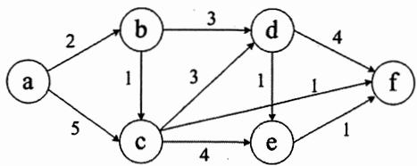
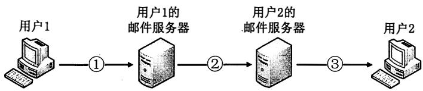
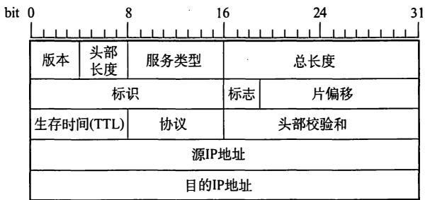

# 2012 年全国硕士研究生人学统一考试

# 计算机科学与技术学科联考计算机学科专业基础综合试题

# 一、单项选择题（第 $1 { \sim } 4 0$ 小题，每小题2分，共80分。下列每题给出的四个选项中，只有一个选项最符合试题要求)

1．求整数n $\scriptstyle . n \geq 0 .$ ）阶乘的算法如下，其时间复杂度是

int fact(int n){ if $(\mathfrak{n} <   = 1)$ return 1; return $\mathbf{n}^{\star}$ fact(n-1);

A. ${ \mathrm { O } } ( \log _ { 2 } n )$

B.0(n)

C. O(nlog2n)

D. ${ \mathsf { O } } ( n ^ { 2 } )$

2．已知操作符包括‘+'、‘-’、‘*’、‘/'、‘（’和‘)’。将中缀表达式 $\mathbf { a } { + } \mathbf { b } { - } \mathbf { a } ^ { * } ( ( \mathbf { c } { + } \mathbf { d } ) / \mathbf { e } { - } \mathbf { f } ) { + } \mathbf { g }$ 转换为等价的后缀表达式 $\mathbf { a b + a c d + e / f - ^ { * } - g + }$ 时，用栈来存放暂时还不能确定运算次序的操作符，若栈初始时为空，则转换过程中同时保存在栈中的操作符的最大个数是 _0

A.5

B.7

c.8

D.11

3．若一棵二叉树的前序遍历序列为a,e,b,d,c，后序遍历序列为b,c,d,e,a，则根结点的孩子结点 。

A．只有e

B.有e、b

C.有e、c

D．无法确定

4．若平衡二叉树的高度为6，且所有非叶结点的平衡因子均为1，则该平衡二叉树的结点总数为 。

A.10

B.20

C.32

D.33

5．对有 $_ n$ 个结点、 $^ e$ 条边且使用邻接表存储的有向图进行广度优先遍历，其算法时间复杂度是 。

A.0(n)

B. 0(e)

C. ${ \mathrm { O } } ( n + e )$

6．若用邻接矩阵存储有向图，矩阵中主对角线以下的元素均为零，则关于该图拓扑序列的结论是 。

A．存在，且唯一

B．存在，且不唯一

C．存在，可能不唯一

D．无法确定是否存在

7．如右图所示的有向带权图，若采用迪杰斯特拉（Dijkstra）算法求从源点a到其他各顶点的最短路径，则得到的第一条最短路径的目标顶点是b，第二条最短路径的目标顶点是c，后续得到的其余各最短路径的目标顶点依次是 。



A. d,e,f

B.e,d,f

C. f,d,e

D. f,e,d

8．下列关于最小生成树的叙述中，正确的是

I．最小生成树的代价唯一

II. 所有权值最小的边一定会出现在所有的最小生成树中  
III. 使用普里姆(Prim)算法从不同顶点开始得到的最小生成树一定相同  
IV. 使用普里姆算法和克鲁斯卡尔(Kruskal)算法得到的最小生成树总不相同

A. 仅I

B. 仅II

C. 仅1、III

D. 仅II、IV

9. 已知一棵3阶B-树，如下图所示。删除关键字78得到一棵新B-树，其最右叶结点中的关键字是


A. 60

B. 60 62

C. 62,65

D. 65

10. 在内部排序过程中，对尚未确定最终位置的所有元素进行一遍处理称为一趟排序。下列排序方法中，每一趟排序结束都至少能够确定一个元素最终位置的方法是 。

I. 简单选择排序

II. 希尔排序

III. 快速排序

IV. 堆排序

v. 二路归并排序

A. 仅I、III、IV

B. 仅I 、 III 、 V

C. 仅II 、 III 、 IV

D. 仅III 、 IV 、 V

11. 对一待排序序列分别进行折半插入排序和直接插入排序，两者之间可能的不同之处是 。

A. 排序的总趟数

B. 元素的移动次数

C. 使用辅助空间的数量

D. 元素之间的比较次数

12. 假定基准程序A在某计算机上的运行时间为100秒，其中90秒为CPU时间，其余为1/0时间。若CPU速度提高 $5 0 \%$ , 1/0速度不变，则运行基准程序A所耗费的时间是 。

A. 55s

B. 60s

C. 65s

D. 70s

13. 假定编译器规定int和short型长度分别为32位和16位，执行下列C语言语句： unsigne!d sho工t $\scriptstyle \mathbf { x } = 6 5 5 3 0$ ; urii:i:i,gped . inl;. ·Y": 幻

得到y的机器数为 。

A. 0000 7FFAH

B. 0000 FFFAH

C. FFFF 7FFAH

D. FFFF FFFAH

14. float类型（即IEEE 754单精度浮点数格式）能表示的最大正整数是 。

A. $2 ^ { 1 2 6 } – 2 ^ { 1 0 3 }$

B. $2 ^ { 1 2 7 } ~ 2 ^ { 1 0 4 }$

C. $2 ^ { 1 2 7 } - 2 ^ { 1 0 3 }$

D. $2 ^ { 1 2 8 } 2 ^ { 1 0 4 }$

15. 某计算机存储器按字节编址，采用小端方式存放数据。假定编译器规定int型和short型长度分别为32位和16位，并且数据按边界对齐存储。某C语言程序段如下：

```txt
struct {
    int a;
    char b;
    short c;
} record;
record.a=273; 
```

若record变量的首地址为 $0 \mathbf { x } \mathbf { C } 0 0 8$ ,则地址 $0 \mathbf { x } { \mathbf { C 0 0 8 } }$ 中内容及record.c的地址分别为

A. OxOO 、 OxCOOD

B. OxOO、OxCOOE

C. Oxll、OxCOOD

D. Oxll、OxCOOE

16. 下列关于闪存CFlash Memory)的叙述中， 错误的是 。

A. 信息可读 可写， 并且读、 写速度一样快  
B. 存储元由MOS管组成， 是一种半导体存储器  
C. 掉电后信息不丢失， 是一种非易失性存储器  
D. 采用随机访问方式， 可替代计算机外部存储器

17. 假设某计算机按字编址，Cache有4个行，Cache和主存之间交换的块大小为1个字。若Cache的内容初始为空，采用2路组相联映射方式和LRU替换策略。访问的主存地址依次为0, 4, 8, 2, 0, 6, 8, 6, 4, 8 时， 命中Cache的次数是 。

A. 1

B. 2

C. 3

D. 4

18. 某计算机的控制器采用微程序控制方式， 微指令中的操作控制字段采用字段直接编码法，共有33个微命令，构成5个互斥类，分别包含7、3、12、5 和6个微命令，则操作控制字段至少有 。

A. 5位

B. 6位

C. 15位

D. 33位

19. 某同步总线的时钟频率为100MHz, 宽度为32位， 地址／数据线复用，每传输一个地址或数据占用一个时钟周期。若该总线支持突发（猝发）传输方式，则一 次 “ 主存写”总线事务传输128位数据所需要的时间至少是 。

A. 20ns

B. 40ns

C. 50ns

D. 80ns

20. 下列关于USB总线特性的描述中，错误的是 。

A. 可实现外设的即插即用和热拔插  
B. 可通过级联方式连接多台外设  
C. 是一种通信总线， 连接不同外设  
D. 同时可传输2位数据， 数据传输率高

21. 下列选项中，在1/0总线的数据线上传输的信息包括 。

I. 1/0接口中的命令字

II. 1/0接口中的状态字

III. 中断类型号

A. 仅I、II

B. 仅I、III

C. 仅II、III

D. I、II、III

22. 响应外部中断的过程中， 中断隐指令完成的操作，除保护断点外，还包括 。

I. 关中断

II. 保存通用寄存器的内容

III. 形成中断服务程序入口地址并送PC

A. 仅I、II

B. 仅I、III

C. 仅II、III

D. I、II、III

23. 下列选项中，不可能在用户态发生的事件是 。

A. 系统调用

B. 外部中断

C. 进程切换

D. 缺页

24. 中断处理和子程序调用都需要压栈以保护现场， 中断处理一定会保存而子程序调用不需要保存其内容的是 。

A. 程序计数器

B. 程序状态字寄存器

c. 通用数据寄存器

D. 通用地址寄存器

25. 下列关于虚拟存储器的叙述中， 正确的是

A. 虚拟存储只能基于连续分配技术  
B. 虚拟存储只能基于非连续分配技术  
C. 虚拟存储容量只受外存容量的限制  
D. 虚拟存储容量只受内存容量的限制

26. 操作系统的1/0子系统通常由四个层次组成，每一 层明确定义了与邻近层次的接口。

其合理的层次组织排列顺序是

A. 用户级I/0软件、设备无关软件、设备驱动程序、中断处理程序  
B. 用户级I/0软件、设备无关软件、中断处理程序、设备驱动程序  
C. 用户级I/0软件、设备驱动程序、设备无关软件、中断处理程序  
D. 用户级1/0软件、中断处理程序、设备无关软件、设备驱动程序

27. 假设5 个进程 ${ \bf P } _ { 0 }$ 、 ${ \bf P } _ { 1 }$ 、 ${ \bf P } _ { 2 }$ 、 ${ \bf P } _ { 3 }$ 、 $\mathtt { P } _ { 4 }$ 共享三类资源 ${ \bf R } _ { 1 }$ 、 ${ \bf R } _ { 2 }$ 、 ${ \tt R } _ { 3 }$ , 这些资源总数分别为18、6、22。TO时刻的资源分配情况如下表所示，此时存在的一个安全序列是 。

<table><tr><td rowspan="2">进程</td><td colspan="3">已分配资源</td><td colspan="3">资源最大需求</td></tr><tr><td>R1</td><td>R2</td><td>R3</td><td>R1</td><td>R2</td><td>R3</td></tr><tr><td>P0</td><td>3</td><td>2</td><td>3</td><td>5</td><td>5</td><td>10</td></tr><tr><td>P1</td><td>4</td><td>0</td><td>3</td><td>5</td><td>3</td><td>6</td></tr><tr><td>P2</td><td>4</td><td>0</td><td>5</td><td>4</td><td>0</td><td>11</td></tr><tr><td>P3</td><td>2</td><td>0</td><td>4</td><td>4</td><td>2</td><td>5</td></tr><tr><td>P4</td><td>3</td><td>1</td><td>4</td><td>4</td><td>2</td><td>4</td></tr></table>

A. $\mathrm { P } _ { 0 } , \mathrm { P } _ { 2 } , \mathrm { P } _ { 4 } , \mathrm { P } _ { 1 } , \mathrm { P } _ { 3 }$

B. $\mathbf { P } _ { 1 } , \mathbf { P } _ { 0 } , \mathbf { P } _ { 3 } , \mathbf { P } _ { 4 } , \mathbf { P } _ { 2 }$

C. $\mathrm { P } _ { 2 } , \mathrm { P } _ { 1 } , \mathrm { P } _ { 0 } , \mathrm { P } _ { 3 } , \mathrm { P } _ { 4 }$

D. $\mathrm { P } _ { 3 } , \mathrm { P } _ { 4 } , \mathrm { P } _ { 2 } , \mathrm { P } _ { 1 } , \mathrm { P } _ { 0 }$

28. 若一个用户进程通过read系统调用读取一个磁盘文件中的数据，则下列关于此过程的叙述中，正确的是 。

I. 若该文件的数据不在内存中，则该进程进入睡眠等待状态  
II. 请求read系统调用会导致CPU从用户态切换到核心态  
III. read系统调用的参数应包含文件的名称

A. 仅I、II

B. 仅I、III

C. 仅II、III

D. I、II 和III

29. 一个多道批处理系统中仅有 $\mathbf { P } _ { 1 }$ 和 ${ \bf P } _ { 2 }$ 两个作业， ${ \bf P } _ { 2 }$ 比 ${ \bf P } _ { 1 }$ 晚5ms到达，它们的计算和1/0操作顺序如下：

$\mathbf { P } _ { 1 }$ : 计算 $6 0 \mathrm { m s }$ , $\mathrm { I } / \mathrm { O } 8 0 \mathrm { m s }$ , 计算 $2 0 \mathrm { m } \mathsf { s }$

${ \bf P } _ { 2 }$ : 计算 $1 2 0 \mathrm { m s }$ , 1/0 40ms, 计算 $4 0 \mathrm { m } \tt s$

若不考虑调度和切换时间，则完成两个作业需要的时间最少是

A. 240ms

B. 260ms

C. 340ms

D. 360ms

30. 若某单处理器多进程系统中有多个就绪态进程，则下列关于处理机调度的叙述中，错误的是 。

A. 在进程结束时能进行处理机调度  
B. 创建新进程后能进行处理机调度  
C. 在进程处于临界区时不能进行处理机调度  
D. 在系统调用完成并返回用户态时能进行处理机调度

31. 下列关于进程和线程的叙述中，正确的是

A. 不管系统是否支待线程，进程都是资源分配的基本单位  
B. 线程是资源分配的基本单位，进程是调度的基本单位  
C. 系统级线程和用户级线程的切换都需要内核的支持  
D. 同一进程中的各个线程拥有各自不同的地址空间

32. 下列选项中，不能改善磁盘设备1/0性能的是 +

A. 重排1/0请求次序

B. 在一个磁盘上设置多个分区

C. 预读和滞后写

D. 优化文件物理块的分布

33. 在 TCP/IP体系结构中， 直接为ICMP提供服务的协议是 。

A. PPP

B. IP

C. UDP

D. TCP

34. 在物理层接口特性中， 用于描述完成每种功能的事件发生顺序的是 。

A. 机械特性

B. 功能 特性

C. 过程特性

D. 电气特性

35. 以太网的MAC 协议提供的是 。

A. 无连接不可靠服务

B. 无连接可靠服务

C. 有连接不可靠服务

D. 有连接可靠服务

36. 两台主机之间的数据链路层采用后退 $N$ 帧协议(GBN)传输数据， 数据传输速率 为16kbps, 单向传播时延为270ms, 数据帧长度范围是 $1 2 8 { \sim } 5 1 2$ 字节， 接收方总是以与数据帧等长的帧进行确认。 为使信道利用率达到最高， 帧序号的比特数至少为 。

A. 5

B. 4

C. 3

D. 2

37. 下列关千IP路由器功能 的描述中， 正确的是 。

I. 运行路由协议， 设置路由表  
II. 监测到拥塞时， 合理丢弃IP分组  
III. 对收到的IP分组头进行差错校验， 确保传输的IP分组不丢失  
IV. 根据收到的IP分组的目 的 IP地址， 将其转发到合适的输出线路上

A. 仅III、.IV

B. 仅I 、 II 、 III

c. 仅I、II、IV

D. I、II、III、IV

38. ARP协议的功能是 。

A. 根据IP地址查询MAC地址

B. 根据MAC地址查询IP地址

C. 根据域名查询IP地址

D. 根据IP地址查询域名

39. 某主机的IP地址为180.80.77.55, 子网掩码为255.255.252.0。 若该主机向其所在子网发送广播分组 ， 则目的地址可以是 。

A. 180.80.76.0

B. 180.80.76.255

C. 180.80.77.255

D. 180.80.79.255

40. 若用户1 与用户2之间发送和接收电子邮件的过程如下图所示， 则图中 $\textcircled{1}$ 、 $\textcircled{2}$ 、 $\textcircled{3}$ 阶段分别使用的应用层协议可以是 。



A. SMTP 、 SMTP 、 SMTP

B. POP3、SMTP、POP3

C. POP3、 SMTP、 SMTP

D. SMTP 、 SMTP 、 POP3

# 二、综合应用题（第 $4 1 { \sim } 4 7$ 题， 共70分）

41. 设有6个有序表A、B、C、D、E、F, 分别含有10、35、40、50、60和200个数据元素， 各表中元素按升序排列。 要求通过5次两 两合并， 将6个表最终合并成1个升序表， 并在最坏情况下比较的总次数达到最小。请回答下列问题。

1)给出完整的合并过程， 并求出最坏情况下比较的总次数。  
2)根据你的合并过程， 描述N( $. N { \geqslant } 2 .$ )个不等长升序表的合并策略， 并说明理由。  
42. 假定采用带头结点的 单链表保存单词， 当两个单词有相同的后缀时， 则可共享相同的

后缀存储空间， 例如，"loading"和"being" 的存储映像如下图所示。


设strl和 str2分别指向两个 单词所在单链表的头结点， 链表结点结构为I I I, 请设计一个时间上尽可能高效的算法， 找出由strl和str2 所指向两个链表共同后缀的起始位置（如图中字符i 所在结点的位置p)。 要求：

1)给出算法的基本设计思想。

2)根据设计思想 ， 采用C或 ${ \mathsf { C } } { + } { + }$ 或Java语言描述算法， 关键之处给出注释。

3)说明你所 设计算法的时间复杂度 。

43. 假定某计算机的CPU主频为80MHz,CPI为4,平均每条指令访存1.5次，主存与Cach之间交换的块大小为 16B,Cache的命中率为 $9 9 \%$ , 存储器总线宽度为32位。请回答下列问题。

1) 该计算机的MIPS数是多少？平均每秒Cache缺失的次数是多少？在不考虑DMA传送的情况下， 主存带宽至少达到多少才能满足CPU的访存要求？

2）假定在Cache 缺失的情况下访问主存时，存在 $0 . 0 0 0 5 \%$ 的缺页率，则CPU平均每秒产生多少次缺页异常？若页面大小为4KB, 每次缺页都需要访问磁盘， 访问磁盘时DMA传送采用周期挪用方式， 磁盘1/0接口的数 据缓冲寄存器为32 位， 则磁盘1/0接口平均每秒发出的DMA请求次数至少是多少？

3) CPU和DMA控制器同时要求使用存储器总线时， 哪个优先级更高？为什么？

4)为了提高性能，主存采用四体低位交叉存储模式，工作时每1/4个存储周期启动一个体。若每个体的存储周期为50ns, 则该主存能提供的最大带宽是多少？

44. 某16位计算机中， 带符号整数用补码表示， 数据Cache和指令Cache分离。 题 表给出了指令系统中部分指令格式， 其中Rs和Rd表示寄存器， mem表示存储单元地址，(x)表示寄存器 $\mathbf { x }$ 或存储单元 $\mathbf { x }$ 的内容。

指令系统中部分指令格式  

<table><tr><td>名称</td><td>指令的汇编格式</td><td>指令功能</td></tr><tr><td>加法指令</td><td>ADD Rs, Rd</td><td>(Rs) + (Rd) -&gt;Rd</td></tr><tr><td>算术/逻辑左移</td><td>SHL Rd</td><td>2*(Rd) -&gt;Rd</td></tr><tr><td>算术右移</td><td>SHR Rd</td><td>(Rd)/2-&gt;Rd</td></tr><tr><td>取数指令</td><td>LOAD Rd, mem</td><td>mem) -&gt;Rd</td></tr><tr><td>存数指令</td><td>STORE Rs, mem</td><td>(Rs) -&gt;mem</td></tr></table>

该计算机采用5段流水方式执行指令，各流水段分别是取指（IF）、译码/读寄存器（ID)、执行／计算有效地址(EX)、 访问存储器CM)和结果写回寄存器(WB),流水线采用 “ 按序发射， 按序完成” 方式， 没有采用转发技术处理数据相关， 并且同一个寄存器的读和写操作不能在同一个时钟周期内进行。 请回答下列问题 ：

1)若int型变量 $\mathbf { x }$ 的值为-513, 存放在寄存器Rl中， 则执行指令"SHR Rl"后，Rl 的内容是多少？ (用十六进制表示)

2)若某个时间段中， 有连续的4条指令进入流水线，在其 执行过程中没有发生任何阻塞，则执行这4条指令所需的时钟周期数为多少？

3)若高级语言程序中某赋值语句为 $\mathbf { x } = \mathbf { a } + \mathbf { b }$ , X、 a和 b均为int型变量，它们的存储单元地址分别表示为[x]、[a]和 b]。 该语句对应的指令序列及其在指令流水线中的执行过程如下图所示。

$$
\begin{array}{l} I _ {1} \quad L O A D \quad R 1, [ a ] \\ \mathrm {I} _ {2} \quad \text {L O A D} \quad \mathrm {R 2}, [ \mathrm {b} ] \\ I _ {3} \quad A D D \quad R 1, R 2 \\ I _ {4} \quad S T O R E \quad R 2, [ x ] \\ \end{array}
$$

<table><tr><td></td><td colspan="14">时间单元</td></tr><tr><td>指令</td><td>1</td><td>2</td><td>3</td><td>4</td><td>5</td><td>6</td><td>7</td><td>8</td><td>9</td><td>10</td><td>11</td><td>12</td><td>13</td><td>14</td></tr><tr><td>\(I_1\)</td><td>IF</td><td>ID</td><td>EX</td><td>M</td><td>WB</td><td></td><td></td><td></td><td></td><td></td><td></td><td></td><td></td><td></td></tr><tr><td>\(I_2\)</td><td></td><td>IF</td><td>ID</td><td>EX</td><td>M</td><td>WB</td><td></td><td></td><td></td><td></td><td></td><td></td><td></td><td></td></tr><tr><td>\(I_3\)</td><td></td><td></td><td>IF</td><td></td><td></td><td></td><td>ID</td><td>EX</td><td>M</td><td>WB</td><td></td><td></td><td></td><td></td></tr><tr><td>\(I_4\)</td><td></td><td></td><td></td><td></td><td></td><td></td><td>IF</td><td></td><td></td><td></td><td>ID</td><td>EX</td><td>M</td><td>WB</td></tr></table>

则这 4条指令执行过程中， $\mathrm { I } _ { 3 }$ 的ID段和 $\mathrm { I } _ { 4 }$ 的IF段被阻塞的原因各是什么？

4)若高级语言程序中某赋值语句为 ${ \bf x } = { \bf x } ^ { * } 2 + { \bf a }$ , $\mathbf { x }$ 和 a均为unsigned int类型变量，它们的存储单元地址分别表示为[x]、[a], 则执行这条语句至少需要多少个时钟周期？要求模仿题 44图画出这条语句对应的指令序列及其在流水线中的执行过程示意图。  
45. 某请求分页系统的局部页面置换策略如下：系统从0时刻开始扫描，每隔5个时间单位扫描一轮驻留集（扫描时间忽略不计），本轮没有被访问过的页框将被系统回收，并放入到 空闲页框链尾，其中内容在下一次分配之前不被清空。 当发生缺页时，如果该页曾被使用过且还在空闲页链表中， 那么重新放回进程的驻留集中；否则，从空闲页框链表头部取出一个页框。

假设不考虑其他进程的影响和系统开销。初始时进程驻留集为空。 目前系统空闲页框链表中页框号依次为32、 15、 21、 41。进程P依次访问的＜虚拟页号，访问时刻＞是 $< 1$ ,I>, <3, 2>, <O,$4 \mathrm { > } , < 0 , 6 \mathrm { > } , < 1 , 1 1 > , < 0 , 1 3 > , < 2 , 1 4 > \circ$ ${ \tt < } 0$ $1 3 >$ $1 4 >$ 。请回答下列问题。

1)访问 $\mathrm { < } 0 , 4 >$ 时，对应的页框号是什么？说明理由。  
2)访问 $< 1$ ,11>时，对应的页框号是什么？说明理由。  
3)访问 $^ { < 2 }$ , $1 4 >$ 时，对应的页框号是什么？说明理由。  
4)该策略是否适合于时间局部性好的程序？说明理由。

46. 某文件系统 空间的最大容量为4TB $\mathbf { \partial } _ { \cdot } 1 \mathbf { T B } = 2 ^ { 4 0 } \mathbf { B } )$ ), 以磁盘块为基本分配单位。磁盘块大小为IKB。文件控制块(FCB)包含一个 512B的索引表区。请回答下列问题。

1)假设索引表区仅采用直接索引结构，索引表 区存放文件占用的磁盘块号，索引表项中块号最少占多少字节？可支持的单个文件最大长度是多少字节？  
2）假设索引表区采用如下结构：第 $0 \sim 7$ 字节采用<起始块号，块数 $>$ 格式表示文件创建时预分配的连续存储 空间，其中起始块号占6B , 块数占2B; 剩余504字节采用直接索引结构，一个索引项占6B, 那么可支持的单个文件最大长度是多少字节？为了使单个文件的长度达到最大，请指出起始块号和块数分别所占字节数的合理值并说明理由。  
47. 主机H通过快速以太网连接Internet, IP地址为192.168.0.8, 服务器S 的IP地址为211.68.71.80。H与S使用TCP通信时，在H上捕获的其中5个IP分组如题47-a表所示。

题 47-a表  

<table><tr><td>编号</td><td colspan="5">IP分组的前40字节内容（十六进制）</td></tr><tr><td rowspan="2">1</td><td>45 00 00 30</td><td>01 9b 40 00</td><td>80 06 1d e8</td><td>c0 a8 00 08</td><td>d3 44 47 50</td></tr><tr><td>0b d9 13 88</td><td>84 6b 41 c5</td><td>00 00 00 00</td><td>70 02 43 80</td><td>5d b0 00 00</td></tr><tr><td rowspan="2">2</td><td>43 00 00 30</td><td>00 00 40 00</td><td>31 06 6e 83</td><td>d3 44 47 50</td><td>c0 a8 00 08</td></tr><tr><td>13 88 0b d9</td><td>e0 59 9f ef</td><td>84 6b 41 c6</td><td>70 12 16 d0</td><td>37 e1 00 00</td></tr><tr><td rowspan="2">3</td><td>45 00 00 28</td><td>01 9c 40 00</td><td>80 06 1d ef</td><td>c0 a8 00 08</td><td>d3 44 47 50</td></tr><tr><td>0b d9 13 88</td><td>84 6b 41 c6</td><td>e0 59 9f f0</td><td>50 f0 43 80</td><td>2b 32 00 00</td></tr><tr><td rowspan="2">4</td><td>45 00 00 38</td><td>01 9d 40 00</td><td>80 06 1d de</td><td>c0 a8 00 08</td><td>d3 44 47 50</td></tr><tr><td>0b d9 13 88</td><td>84 6b 41 c6</td><td>e0 59 9f f0</td><td>50 18 43 80</td><td>e6 55 00 00</td></tr><tr><td rowspan="2">5</td><td>45 00 00 28</td><td>68 11 40 00</td><td>31 06 06 7a</td><td>d3 44 47 50</td><td>c0 a8 00 08</td></tr><tr><td>13 88 0b d9</td><td>e0 59 9f f0</td><td>84 6b 41 d6</td><td>50 10 16 d0</td><td>57 d2 00 00</td></tr></table>

回答下列问题。

题 表中的 分组中， 哪几个是由 发送的？哪儿个完成了 连接建立过程？哪几个在通过快速以太网传输时进行了填充？  
根据题 表中的 分组， 分析 已经收到的应用层数据字节数是多少？  
若题 表中的某个 分组在 发出时的前 字节如题 表所示，则该 分组到达 时经过了多少个路由器？

题47-b表  

<table><tr><td rowspan="2">来自S的分组</td><td>45000028</td><td>68114000</td><td>4006ecad</td><td>d3444750</td><td>ca760106</td></tr><tr><td>1388a108</td><td>e0599f0</td><td>846b41d6</td><td>501016d0</td><td>b7d60000</td></tr></table>

注： 分组头和 段头结构分别如题 图和题 图所示。

  
题 图 分组头结构

  
题 图 段头结构