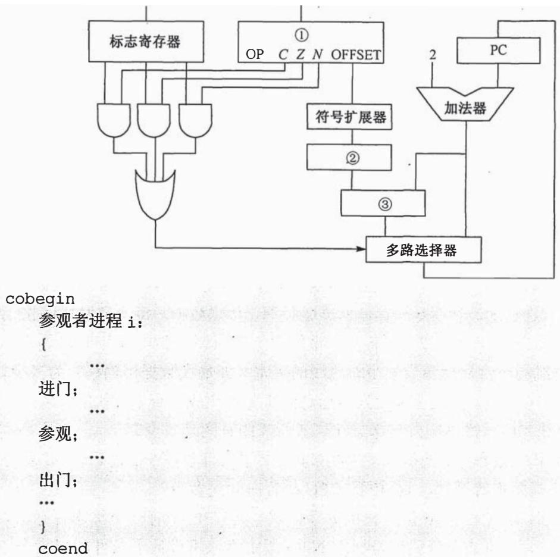
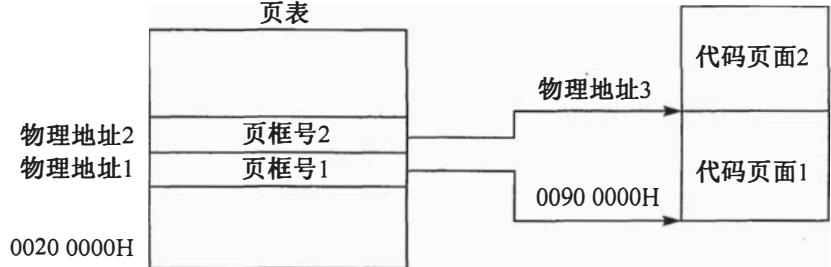

# 2013年全国硕士研究生入学统一考试

# 计算机科学与技术学科联考计算机学科专业基础综合试题

# 一、单项选择题（第 $1\sim 40$ 小题，每小题2分，共80分。下列每题给出的四个选项中，只有一个选项最符合试题要求）

1. 已知两个长度分别为 $m$ 和 $n$ 的升序链表，若将它们合并为一个长度为 $m + n$ 的降序链表，则最坏情况下的时间复杂度是 ______。

A. $\mathrm{O}\left( n\right)$

B. $\mathrm{O}\left( {mn}\right)$

C. $\mathrm{O}\left( {\min \left( {m,n}\right) }\right)$

D. $\mathrm{O}\left( {\max \left( {m,n}\right) }\right)$

2. 一个栈的入栈序列为 $1, 2, 3, \dots, n$ ，其出栈序列是 $\mathfrak{p}_1, \mathfrak{p}_2, \mathfrak{p}_3, \dots, \mathfrak{p}_n$ 。若 $\mathfrak{p}_2 = 3$ ，则 $\mathfrak{p}_3$ 可能取值的个数是 ______。

A. $n - 3$

B. $n - 2$

C. $n - 1$

D. 无法确定

3. 若将关键字 1,2,3,4,5,6,7 依次插入到初始为空的平衡二叉树 T 中，则 T 中平衡因子为 0 的分支结点的个数是

A. 0

B. 1

C. 2

D. 3

4. 已知三叉树 T 中 6 个叶结点的权分别是 2,3,4,5,6,7，T 的带权（外部）路径长度最小是

A. 27

B. 46

C. 54

D. 56

5. 若 X 是后序线索二叉树中的叶结点，且 X 存在左兄弟结点 Y，则 X 的右线索指向的是____。

A. X 的父结点

B. 以 $\mathrm{Y}$ 为根的子树的最左下结点

C. X 的左兄弟结点 Y

D. 以 $\mathrm{Y}$ 为根的子树的最右下结点

6. 在任意一棵非空二叉排序树 $\mathrm{T}_{1}$ 中，删除某结点 $\mathbf{v}$ 之后形成二叉排序树 $\mathrm{T}_{2}$ ，再将 $\mathbf{v}$ 插入 $\mathrm{T}_{2}$ 形成二叉排序树 $\mathrm{T}_{3}$ 。下列关于 $\mathrm{T}_{1}$ 与 $\mathrm{T}_{3}$ 的叙述中，正确的是 ______。

I. 若 $\mathbf{v}$ 是 $\mathrm{T}_{1}$ 的叶结点，则 $\mathrm{T}_{1}$ 与 $\mathrm{T}_{3}$ 不同

II，若 $\mathbf{v}$ 是 $\mathrm{T}_{1}$ 的叶结点，则 $\mathrm{T}_{1}$ 与 $\mathrm{T}_{3}$ 相同

III. 若 $\mathrm{v}$ 不是 $\mathrm{T}_{1}$ 的叶结点，则 $\mathrm{T}_{1}$ 与 $\mathrm{T}_{3}$ 不同

IV. 若 $\mathrm{v}$ 不是 ${\mathrm{T}}_{1}$ 的叶结点,则 ${\mathrm{T}}_{1}$ 与 ${\mathrm{T}}_{3}$ 相同

A. 仅 I、III

B. 仅 I、IV

C. 仅 II、III

D. 仅 II、IV

7. 设图的邻接矩阵 $A$ 如下所示。各顶点的度依次是

$$
A = \left[ \begin{array}{l l l l} 0 & 1 & 0 & 1 \\ 0 & 0 & 1 & 1 \\ 0 & 1 & 0 & 0 \\ 1 & 0 & 0 & 0 \end{array} \right]
$$

A. 1,2,1,2

B. 2,2,1,1

C. $3,4,2,3$

D. 4, 4, 2, 2

8. 若对如下无向图进行遍历，则下列选项中，不是广度优先遍历序列的是

A. h, c, a, b, d, e, g, f

B. e, a, f, g, b, h, c, d

C. d, b, c, a, h, e, f, g

D. a, b, c, d, h, e, f, g

9. 下列 AOE 网表示一项包含 8 个活动的工程。通过同时加快若干活动的进度可以缩短整个工程的工期。下列选项中，加快其进度就可以缩短工程工期的是 ________ 。

A. c 和 e

B. d 和 c

C. f和d

D. f 和 h

10. 在一棵高度为 2 的 5 阶 B 树中，所含关键字的个数最少是

A. 5

B. 7

C. 8

D. 14

11．对给定的关键字序列110,119,007,911,114,120,122进行基数排序，则第2趟分配收集后得到的关键字序列是

A. 007, 110, 119, 114, 911, 120, 122

B. 007, 110, 119, 114, 911, 122, 120

C. 007, 110, 911, 114, 119, 120, 122

D. 110, 120, 911, 122, 114, 007, 119

12. 某计算机主频为 $1.2 \mathrm{GHz}$ , 其指令分为 4 类, 它们在基准程序中所占比例及 CPI 如下表所示。

<table><tr><td>指令类型</td><td>所占比例</td><td>CPI</td></tr><tr><td>A</td><td>50%</td><td>2</td></tr><tr><td>B</td><td>20%</td><td>3</td></tr><tr><td>C</td><td>10%</td><td>4</td></tr><tr><td>D</td><td>20%</td><td>5</td></tr></table>

该机的MIPS数是

A. 100

B. 200

C. 400

D. 600

13. 若某数采用 IEEE754 单精度浮点数格式表示为 $\mathrm{C} 6400000 \mathrm{H}$ , 则该数的值是

A. $1.5 \times 2^{13}$

B. $1.5 \times 2^{12}$

C. $0.5 \times 2^{13}$

D. $0.5 \times 2^{12}$

14. 某字长为 8 位的计算机中，已知整型变量 $x$ 和 $y$ 的机器数分别为 $[x]_{\text{补}} = 11110100$ ， $[y]_{\text{补}} = 10110000$ 。若整型变量 $z = 2x + y / 2$ ，则 $z$ 的机器数为 ________。

A. 11000000

B. 0 0100100

C. 10101010

D. 溢出

15. 用海明码对长度为 8 位的数据进行检/纠错时，若能纠正一位错，则校验位数至少为 ______。

A. 2

B. 3

C. 4

D. 5

16. 某计算机主存地址空间大小为 $256 \mathrm{MB}$ , 按字节编址。虚拟地址空间大小为 4GB, 采用

页式存储管理，页面大小为 $4 \mathrm{KB}$ ，TLB（快表）采用全相联映射，有 4 个页表项，内容如下表所示。

<table><tr><td>有效位</td><td>标记</td><td>页框号</td><td>...</td></tr><tr><td>0</td><td>FF180H</td><td>0002H</td><td>...</td></tr><tr><td>1</td><td>3FFF1H</td><td>0035H</td><td>...</td></tr><tr><td>0</td><td>02FF3H</td><td>0351H</td><td>...</td></tr><tr><td>1</td><td>03FFFH</td><td>0153H</td><td>...</td></tr></table>

则对虚拟地址03FF F180H进行虚实地址变换的结果是

A. 0153180H

B. 0035180H

C. TLB 缺失

D. 缺页

17. 假设变址寄存器 R 的内容为 $1000 \mathrm{H}$ , 指令中的形式地址为 $2000 \mathrm{H}$ ; 地址 $1000 \mathrm{H}$ 中的内容为 $2000 \mathrm{H}$ , 地址 $2000 \mathrm{H}$ 中的内容为 $3000 \mathrm{H}$ , 地址 $3000 \mathrm{H}$ 中的内容为 $4000 \mathrm{H}$ , 则变址寻址方式下访问到的操作数是

A. ${1000}\mathrm{H}$

B. 2000H

C. ${3000}\mathrm{H}$

D. ${4000}\mathrm{H}$

18. 某CPU主频为 $1.03\mathrm{GHz}$ , 采用4级指令流水线, 每个流水段的执行需要1个时钟周期。假定CPU执行了100条指令, 在其执行过程中, 没有发生任何流水线阻塞, 此时流水线的吞吐率为____。

A. $0.25 \times 10^{9}$ 条指令/秒

B. $0.97 \times 10^{9}$ 条指令/秒

C. $1.0 \times 10^{9}$ 条指令/秒

D. $1.03 \times 10^{9}$ 条指令/秒

19. 下列选项中，用于设备和设备控制器（I/O接口）之间互连的接口标准是________。

A. PCI

B. USB

C. AGP

D. PCI-Express

20. 下列选项中，用于提高 RAID 可靠性的措施有____。

I. 磁盘镜像

II. 条带化

III. 奇偶校验

IV. 增加 Cache 机制

A. 仅 I、II

B. 仅 I、III

C. 仅 I、III 和 IV

D. 仅 II、III 和 IV

21. 某磁盘的转速为 $10000\mathrm{rpm}$ ，平均寻道时间是 $6\mathrm{ms}$ ，磁盘传输速率是 $20\mathrm{MB/s}$ ，磁盘控制器延迟为 $0.2\mathrm{ms}$ ，读取一个4KB的扇区所需的平均时间约为 ______。

A. 9ms

B. $9.4 \mathrm{~ms}$

C. $12 \mathrm{~ms}$

D. $12.4 \mathrm{~ms}$

22. 下列关于中断 I/O 方式和 DMA 方式比较的叙述中, 错误的是

A. 中断 I/O 方式请求的是 CPU 处理时间, DMA 方式请求的是总线使用权  
B. 中断响应发生在一条指令执行结束后, DMA 响应发生在一个总线事务完成后  
C. 中断 I/O 方式下数据传送通过软件完成, DMA 方式下数据传送由硬件完成  
D. 中断 I/O 方式适用于所有外部设备, DMA 方式仅适用于快速外部设备

23. 用户在删除某文件的过程中，操作系统不可能执行的操作是

A. 删除此文件所在的目录

B. 删除与此文件关联的目录项

C. 删除与此文件对应的文件控制块

D. 释放与此文件关联的内存缓冲区

24. 为支持 CD-ROM 中视频文件的快速随机播放，播放性能最好的文件数据块组织方式是____。

A. 连续结构

B. 链式结构

C. 直接索引结构

D. 多级索引结构

25. 用户程序发出磁盘 I/O 请求后，系统的处理流程是：用户程序 $\rightarrow$ 系统调用处理程序 $\rightarrow$ 设备驱动程序 $\rightarrow$ 中断处理程序。其中，计算数据所在磁盘的柱面号、磁头号、扇区号的程序是______。

A. 用户程序

B. 系统调用处理程序

C. 设备驱动程序

D. 中断处理程序

26. 若某文件系统索引结点（inode）中有直接地址项和间接地址项，则下列选项中，与单个文件长度无关的因素是________。

A. 索引结点的总数

B. 间接地址索引的级数

C. 地址项的个数

D. 文件块大小

27. 设系统缓冲区和用户工作区均采用单缓冲，从外设读入 1 个数据块到系统缓冲区的时间为 100，从系统缓冲区读入 1 个数据块到用户工作区的时间为 5，对用户工作区中的 1 个数据块进行分析的时间为 90（如下图所示）。进程从外设读入并分析 2 个数据块的最短时间是 ______。

A. 200

B. 295

C. 300

D. 390

28. 下列选项中，会导致用户进程从用户态切换到内核态的操作是________。

I. 整数除以零 II. sin()函数调用 III. read 系统调用

A. 仅 I、II

B. 仅 I、III

C. 仅 II、III

D. I、II 和 III

29. 计算机开机后，操作系统最终被加载到________。

A. BIOS

B. ROM

C. EPROM

D. RAM

30. 若用户进程访问内存时产生缺页，则下列选项中，操作系统可能执行的操作是____。

I. 处理越界错 II. 置换页 III. 分配内存

A. 仅 I、II

B. 仅 II、III

C. 仅 I、III

D. I、II 和 III

31. 某系统正在执行三个进程 $\mathrm{P}_{1} 、 \mathrm{P}_{2}$ 和 $\mathrm{P}_{3}$ , 各进程的计算 (CPU) 时间和 I/O 时间比例如下表所示。

<table><tr><td>进程</td><td>计算时间</td><td>I/O 时间</td></tr><tr><td>P1</td><td>90%</td><td>10%</td></tr><tr><td>P2</td><td>50%</td><td>50%</td></tr><tr><td>P3</td><td>15%</td><td>85%</td></tr></table>

为提高系统资源利用率，合理的进程优先级设置应为________。

A. $\mathrm{P}_{1} > \mathrm{P}_{2} > \mathrm{P}_{3}$

B. $\mathrm{P}_{3} > \mathrm{P}_{2} > \mathrm{P}_{1}$

C. $\mathrm{P}_{2} > \mathrm{P}_{1} = \mathrm{P}_{3}$

D. $P_{1} > P_{2} = P_{3}$

32. 下列关于银行家算法的叙述中，正确的是

A. 银行家算法可以预防死锁  
B. 当系统处于安全状态时, 系统中一定无死锁进程  
C. 当系统处于不安全状态时, 系统中一定会出现死锁进程  
D. 银行家算法破坏了死锁必要条件中的 “请求和保持” 条件

33. 在 OSI 参考模型中，下列功能需由应用层的相邻层实现的是________。

A. 对话管理

B. 数据格式转换

C. 路由选择

D. 可靠数据传输

34. 若下图为 10BaseT 网卡接收到的信号波形，则该网卡收到的比特串是 ______。

A. 00110110

B. 1010 1101

C. 0101 0010

D. 11000101

35. 主机甲通过 1 个路由器（存储转发方式）与主机乙互联，两段链路的数据传输速率均为 $10 \mathrm{Mbps}$ ，主机甲分别采用报文交换和分组大小为 $10 \mathrm{kb}$ 的分组交换向主机乙发送 1 个大小为 $8 \mathrm{Mb} (1 \mathrm{M} = 10^{6} \mathrm{kb})$ 的报文。若忽略链路传播延迟、分组头开销和分组拆装时间，则两种交换方式完成该报文传输所需的总时间分别为 ________。

A. 800ms、1600ms

B. $801 \mathrm{~ms} 、 1600 \mathrm{~ms}$

C. $1600 \mathrm{~ms} 、 800 \mathrm{~ms}$

D. $1600 \mathrm{~ms} 、 801 \mathrm{~ms}$

36. 下列介质访问控制方法中, 可能发生冲突的是_____。

A. CDMA

B. CSMA

C. TDMA

D. FDMA

37. HDLC协议对011111000111110组帧后对应的比特串为

A. 0111100 00111110 10

B. 01111100 01111101 0111110

C. 01111100 01111101 0

D. 01111100 01111110 01111101

38. 对于 100Mbps 的以太网交换机，当输出端口无排队，以直通交换（cut-through switching）方式转发一个以太网帧（不包括前导码）时，引入的转发延迟至少是 ______。

A. $0 \mu \mathrm{s}$

B. $0.48 \mu \mathrm{s}$

C. $5.12 \mu \mathrm{s}$

D. $121.44 \mu \mathrm{s}$

39. 主机甲与主机乙之间已建立一个 TCP 连接，双方持续有数据传输，且数据无差错与丢失。若甲收到 1 个来自乙的 TCP 段，该段的序号为 1913、确认序号为 2046、有效载荷为 100 字节，则甲立即发送给乙的 TCP 段的序号和确认序号分别是 ________。

A. 2046、2012

B. 2046、2013

C. 2047、2012

D. 2047、2013

40. 下列关于SMTP协议的叙述中，正确的是

I. 只支持传输 7 比特 ASCII 码内容

II. 支持在邮件服务器之间发送邮件

III. 支持从用户代理向邮件服务器发送邮件

IV. 支持从邮件服务器向用户代理发送邮件

A. 仅 I、II 和 III

B. 仅 I、II 和 IV

C. 仅 I、III 和 IV

D. 仅 II、III 和 IV

# 二、综合应用题（第 $41\sim 47$ 小题，共70分）

41.（13分）已知一个整数序列 $\mathrm{A} = (a_{0}, a_{1}, \dots, a_{n - 1})$ ，其中 $0 \leqslant a_{i} < n$ （ $0 \leqslant i < n$ ）。若存在 $a_{p1} = a_{p2} = \dots = a_{pm} = x$ 且 $m > n / 2$ （ $0 \leqslant p_{k} < n, 1 \leqslant k \leqslant m$ ），则称 $x$ 为 A 的主元素。例如 $\mathrm{A} = (0, 5, 5, 3, 5, 7, 5, 5)$ ，则 5 为主元素；又如 $\mathrm{A} = (0, 5, 5, 3, 5, 1, 5, 7)$ ，则 A 中没有主元素。假设 A 中的 $n$ 个元素保存在一个一维数组中，请设计一个尽可能高效的算法，找出 A 的主元素。若存在主元素，则输出该元素；否则输出-1。要求：

(1) 给出算法的基本设计思想。  
(2) 根据设计思想, 采用 C、C++或 Java 语言描述算法, 关键之处给出注释。  
（3）说明你所设计算法的时间复杂度和空间复杂度。

42.（10分）设包含4个数据元素的集合 $\mathrm{S} = \{\text{"do"，"for"，"repeat"，"while"}\}$ ，各元素的查找概率依次为 $p_1 = 0.35$ ， $p_2 = 0.15$ ， $p_3 = 0.15$ ， $p_4 = 0.35$ 。将S保存在一个长度为4的顺序表中，采用折半查找法，查找成功时的平均查找长度为2.2。请回答：

（1）若采用顺序存储结构保存S，且要求平均查找长度更短，则元素应如何排列？应使用何种查找方法？查找成功时的平均查找长度是多少？  
(2) 若采用链式存储结构保存 S, 且要求平均查找长度更短, 则元素应如何排列? 应使用何种查找方法? 查找成功时的平均查找长度是多少?

43.（9分）某32位计算机，CPU主频为 $800\mathrm{MHz}$ ，Cache命中时的CPI为4，Cache块大小为32字节；主存采用8体交叉存储方式，每个体的存储字长为32位、存储周期为40ns；存储器总线宽度为32位，总线时钟频率为 $200\mathrm{MHz}$ ，支持突发传送总线事务。每次读突发传送总线事务的过程包括：送首地址和命令、存储器准备数据、传送数据。每次突发传送32字节，传送地址或32位数据均需要一个总线时钟周期。请回答下列问题，要求给出理由或计算过程。

(1) CPU 和总线的时钟周期各为多少? 总线的带宽 (即最大数据传输率) 为多少?  
(2) Cache 缺失时, 需要用几个读突发传送总线事务来完成一个主存块的读取?  
（3）存储器总线完成一次读突发传送总线事务所需的时间是多少？  
(4) 若程序 BP 执行过程中，共执行了 100 条指令，平均每条指令需进行 1.2 次访存，Cache 缺失率为 $5\%$ ，不考虑替换等开销，则 BP 的 CPU 执行时间是多少？  
44. (14 分) 某计算机采用 16 位定长指令字格式, 其 CPU 中有一个标志寄存器, 其中包含进位/借位标志 CF、零标志 ZF 和符号标志 NF。假定为该机设计了条件转移指令, 其格式如下:

<table><tr><td>15</td><td>11</td><td>10</td><td>9</td><td>8</td><td>7</td><td>0</td></tr><tr><td>0</td><td>0</td><td>0</td><td>0</td><td>C</td><td>Z</td><td>N</td></tr></table>

其中，00000为操作码OP； $C$ 、 $Z$ 和 $N$ 分别为CF、ZF和NF的对应检测位，某检测位为1时表示需检测对应标志位，需检测的标志位中只要有一个为1就转移，否则不转移。例如，若 $C = 1$ ， $Z = 0$ ， $N = 1$ ，则需检测CF和NF的值，当 $\mathrm{CF} = 1$ 或 $\mathrm{NF} = 1$ 时发生转移；OFFSET是相对偏移量，用补码表示。转移执行时，转移目标地址为 $(\mathrm{PC}) + 2 + 2\times \mathrm{OFFSET}$ ；顺序执行时，下条指令地址为 $(\mathrm{PC}) + 2$ 。请回答下列问题。

（1）该计算机存储器按字节编址还是按字编址？该条件转移指令向后（反向）最多可跳转多少条指令？  
（2）某条件转移指令的地址为 $200\mathrm{CH}$ ，指令内容如下图所示，若该指令执行时 $\mathrm{CF} = 0$ $\mathrm{ZF} = 0$ ， $\mathrm{NF} = 1$ ，则该指令执行后PC的值是多少？若该指令执行时 $\mathrm{CF} = 1$ ， $\mathrm{ZF} = 0$ ， $\mathrm{NF} = 0$ ，则该指令执行后PC的值又是多少？请给出计算过程。

<table><tr><td>15</td><td>11</td><td>10</td><td>9</td><td>8</td><td>7</td><td>0</td></tr><tr><td>0</td><td>0</td><td>0</td><td>0</td><td>0</td><td>1</td><td>1</td></tr></table>

(3) 实现“无符号数比较小于等于时转移”功能的指令中, $C 、 Z$ 和 $N$ 应各是什么?  
(4) 以下是该指令对应的数据通路示意图, 要求给出图中部件①～③的名称或功能说明。

45.（7分）某博物馆最多可容纳500人同时参观，有一个出入口，该出入口一次仅允许一个人通过。参观者的活动描述如下：

请添加必要的信号量和 P、V（或 wait()、signal()）操作，以实现上述过程中的互斥与同步。要求写出完整的过程，说明信号量的含义并赋初值。

46.（8分）某计算机主存按字节编址，逻辑地址和物理地址都是32位，页表项大小为4字节。请回答下列问题。

（1）若使用一级页表的分页存储管理方式，逻辑地址结构如下：

<table><tr><td>页号（20位）</td><td>页内偏移量（12位）</td></tr></table>

则页的大小是多少字节？页表最大占用多少字节？

(2) 若使用二级页表的分页存储管理方式, 逻辑地址结构如下:

<table><tr><td>页目录号（10位）</td><td>页表索引（10位）</td><td>页内偏移量（12）</td></tr></table>

设逻辑地址为 LA，请分别给出其对应的页目录号和页表索引的表达式。

（3）采用（1）中的分页存储管理方式，一个代码段起始逻辑地址为 00008000H，其长度为 8KB，被装载到从物理地址 00900000H 开始的连续主存空间中。页表从主存 00200000H 开始的物理地址处连续存放，如下图所示（地址大小自下向上递增）。请计算出该代码段对应的两个页表项的物理地址、这两个页表项中的页框号以及代码页面 2 的起始物理地址。

47.（9分）假设Internet的两个自治系统构成的网络如题47图所示，自治系统ASI由路由

器R1连接两个子网构成；自治系统AS2由路由器R2、R3互联并连接3个子网构成。各子网地址、R2的接口名、R1与R3的部分接口IP地址如题47图所示。

  
题47图 网络拓扑结构

请回答下列问题。

（1）假设路由表结构如下表所示。请利用路由聚合技术，给出R2的路由表，要求包括到达题47图中所有子网的路由，且路由表中的路由项尽可能少。

<table><tr><td>目的网络</td><td>下一跳</td><td>接口</td></tr></table>

（2）若R2收到一个目的IP地址为194.17.20.200的IP分组，R2会通过哪个接口转发该IP分组？  
（3）R1与R2之间利用哪个路由协议交换路由信息？该路由协议的报文被封装到哪个协议的分组中进行传输？