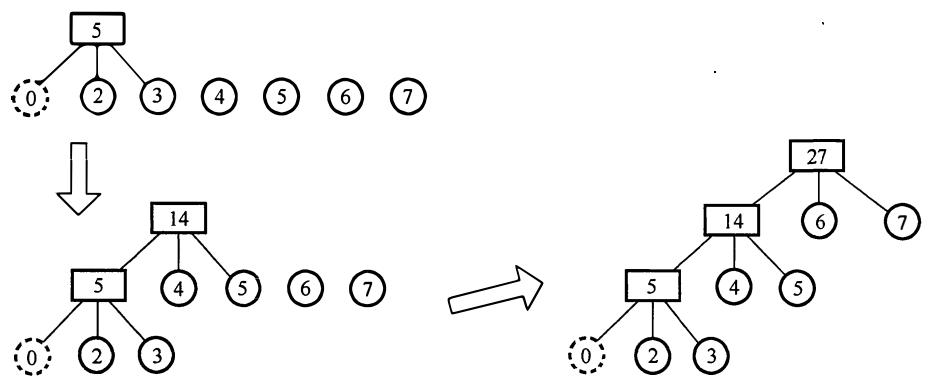
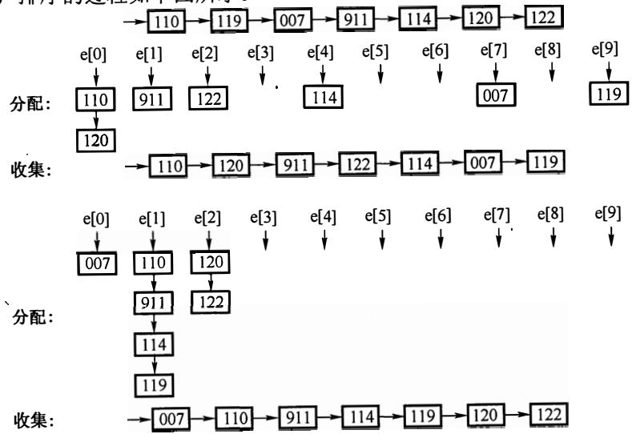
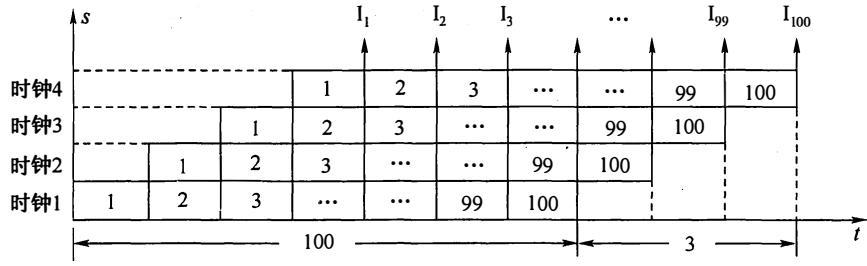
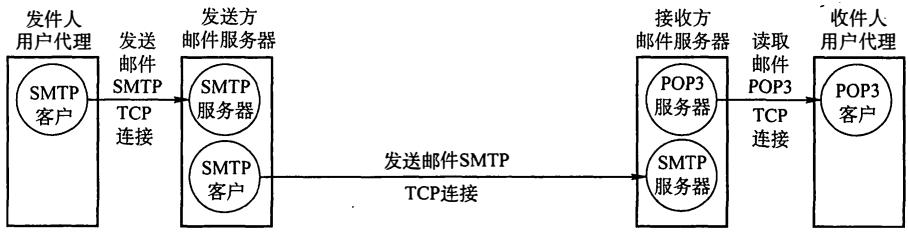
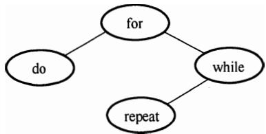
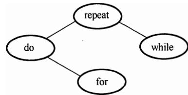

# 2013 年计算机学科专业基础综合试题参考答案

# 一、单项选择题

D 2. 1.  3.  4.  5.  6.  7.  8.   
C 10. 9.  11.  12.  13.  14.  15.  16.   
D 18. 17.  19.  20.  21.  22.  23.  24.   
C 26. 25.  27.  28.  29.  30.  31.  32.   
B 34. 33.  35.  36.  37.  38.  39.  40.

# 1. 解析：

两个升序链表合并，两两比较表中元素，每比较一次确定一个元素的链接位置（取较小元素，头插法）。当一个链表比较结束后，将另一个链表的剩余元素插入即可。最坏的情况是两个链表中的元素依次进行比较，直到两个链表都到表尾，即每个元素都经过比较，时间复杂度为$\operatorname { O } ( m + n ) = \operatorname { O } ( \operatorname* { m a x } ( m , n ) )$ 。

# 2. 解析：

显然， 之后的 4, 5, …， 都是 p3可取的数（一直进栈直到该数入栈后马上出栈）。接下来 $_ n$ ${ \mathfrak { p } } _ { 3 }$ 分析 2: Pt 只能是 之前入栈的数（可能是 2), P1= 时， p3 可取 2; P1=2 时， $\mathfrak { p } _ { 1 }$ $\mathfrak { p } _ { 1 } = 1$ ${ \mathfrak { p } } _ { 3 }$ $\mathtt { p } _ { 1 } = 2$ p3 可取 1, p3 可能取除 之外的所有数，个数为 n-1 ${ \mathfrak { p } } _ { 3 }$ ${ \mathfrak { p } } _ { 3 }$ $n { - } 1$

# 3. 解析：

利用 个关键字构建平衡二叉树 T, 平衡因子为 的分支结点个数为 3, 构建的平衡二叉树如下图所示。构造及调整的过程如下：


# 4. 解析：

将哈夫曼树的思想推广到三叉树的情形。为了构成严格的三叉树，需添加权为 的虚叶结点，对于严格的三叉树(n -1)%(3-1) = u = 1 -to, 需要添加 m-u-1 = 3-1-1 个叶结点，说明 $( n _ { 0 } - 1 ) \% ( 3 - 1 ) = u = 1 \neq 0$ $m { - } u { - } 1 = 3 { - } 1 { - } 1$ 叶结点刚好可以构成一个严格的三叉树。按照哈夫曼树的原则，权为 的叶结点应离树根最远，构造最小带权生成树的过程如下：



最小的带权路径长度为 $( 2 + 3 ) { \times } 3 + ( 4 + 5 ) { \times } 2 + ( 6 + 7 ) { \times } 1 = 4 6 { _ { \circ } }$ 。

# 5. 解析：

根据后序线索二叉树的定义， $\mathbf { \boldsymbol { x } }$ 结点为叶子结点且有左兄弟，那么这个结点为右孩子结点，利用后序遍历的方式可知 X结点的后序后继是其父结点，即其右线索指向的是父结点。 为了更加形象，在解题的过程中可以画出如下草图。


# 6. 解析：

在一棵二叉排序树中删除一个结点后再将此结点插入到二叉排序树中，如果删除的结点是叶子结点， 那么在插入结点后，后来的二叉排序树与删除结点之前相同。 如果删除的结点不是叶子结点，那么再插入这个结点后，后来的二叉树会发生变化，不完全相同。

# 7. 解析：

邻接矩阵A为非对称矩阵，说明图是有向图，度为入度加出度之和。各顶点的度是矩阵中此结点对应的行（对应出度）和列（对应入度）的非零元素之和。

# 8. 解析：

此题为送分题。 只要掌握DFS和BFS的遍历过程，便能轻易解决。 逐个代入，手工模拟，选项D是深度优先遍历，而不是广度优先遍历。


# 9. 解析：

找出AOE网的全部关键路径为(b,d, c, g)、(b,d, e, h)和(b, f, h)。 根据定义， 只有关键路径上的活动时间同时减少时，才能缩短工期， 即正确选项中的两条路径必须涵盖在所有关键路径之中。 利用关键路径算法可求出图中的关键路径共有三条： (b, d, c, g)、(b,d, e, h)和(b, f, h)。 由此可知，选项A和B中并不能包含(b, f, h)这条路径，选项C中，并不能包含(b,d, c, g)和(b,d,e, h)这两条路径，只有C包含了所有的关键路径，因此只有加快f和d的进度才能缩短工期（建

淘宝店铺：光速考研工作室

议考生在图中检验)。

# 解析：

对于5阶B树，根结点只有达到5个关键字时才能产生分裂，成为高度为2的B树，因此高度为2的5阶B树所含关键字的个数最少是5。

# 解析：

基数排序的第1趟排序是按照个位数字的大小来排序的，第2趟排序是按照十位数字的大小进行排序的，排序的过程如下图所示。



# 解析：

基准程序的CPI=2×0.5'+3×0.2+4×0.1+ 5×0.2=3。计算机的主频为1.2GHz,即 1200MHz, $\mathrm { C P I } = 2 { \times } 0 . 5 + 3 { \times } 0 . 2 + 4 { \times } 0 . 1 + 5 { \times } 0 . 2 = 3$ 故该机器的 $\mathrm { M I P S } = 1 2 0 0 / 3 = 4 0 0$ 。

# 13．解析：

IEEE 754单精度浮点数格式为C640 0000H，二进制格式为1100 01100100 0000 0000 000000000000，转换为标准的格式为

<table><tr><td>S</td><td>阶码</td><td>尾数</td></tr><tr><td>1</td><td>1000 1100</td><td>100 0000 0000 0000 0000 0000</td></tr></table>

数符=1表示负数；阶码值为1000 1100-0111111=0000 1101=13；尾数值为1.5（注意其有 $= 1$ $1 0 0 0 \ 1 1 0 0 - 0 1 1 1 \ 1 1 1 1 1 = 0 0 0 0 \ 1 1 0 1 = 1 3$ 隐含位，要加1)。因此，浮点数的值为-1.5×213。 $\cdot 1 . 5 { \times } 2 ^ { 1 3 }$

# 14．解析：

x*2，将x算术左移一位为11101000；y/2，将y算术右移一位为11011000，均无溢出或 $\mathbf { x } ^ { \ast } \mathbf { 2 }$ $\mathbf { x }$ $\mathbf { y }$ 丢失精度。补码相加为11101000＋11011000=11000000，亦无溢出。 $1 \ 1 1 0 1 0 0 0 + 1 \ 1 0 1 1 0 0 0 = 1 \ 1 0 0 0 0 0 0$

# 解析：

设校验位的位数为k，数据位的位数为n，海明码能纠正一位错应满足下述关系：2*≥n+k+1。 $k$ $_ n$ $2 ^ { k } \geq _ { n } + k + 1$ = 8 当 k = 4 时 2 $n = 8$ $k = 4$ $2 ^ { 4 } ~ ( = 1 6 ) > 8 + 4 + 1$ $2 ^ { 4 }$ $\left( = 1 3 \right)$

# 16．解析：

按字节编址，页面大小为4KB，页内地址共12位。地址空间大小为4GB，虚拟地址共 32位，前20位为页号。虚拟地址为03FFF180H，故页号为03FFFH，页内地址为180H。查找页 $1 8 0 \mathrm { H }$ 标记 03FFFH 所对应的页表项，页框号为0153H，页框号与页内地址拼接即为物理地址 0153180H。

# 17. 解析：

根据变址寻址的方法，变址寄存器的内容(1000H)与形式地址的内容(2000H)相加， 得到操作数的实际地址( 3000H), 根据实际地址访问内存， 获取操作数4000H。


# 18. 解析：

采用 4级流水执行100条指令，在执行过程中共用 $4 + ( 1 0 0 - 1 ) = 1 0 3$ 个时钟周期。CPU的主频是1.03GHz, 也就是说每秒钟有1.03G个时钟周期。流水线的吞吐率为 $1 . 0 3 \mathrm { G } \times 1 0 0 / 1 0 3 = 1 . 0 { \times } 1 0 ^ { 9 }$ 条指令／秒。



# 19. 解析：

USB是一种连接外部设备的 I/0 总线标准， 属于设备总线， 是设备和设备控制器之间 的接口。而PCI、AGP、PCI-E作为计算机系统的局部总线标准， 通常用来连接主存 、网卡、视频卡等。

# 20. 解析：

RAID0方案是无冗余和无校验的磁盘阵列，而RAID1～5方案均是加入了冗余（镜像）或校验的磁盘阵列。条带化技术就是一种自动地将1/0的负载均衡到多个物理磁盘上的技术，条带化技术就是将一块连续的数据分成很多小部分并把它们分别存储到不同磁盘上去。这就能使多个进程同时访问数据的多个不同部分但不会造成磁盘冲突， 而且在需要对这种数据进行顺序访问的时候可以获得最大程度上的1/0并行能力， 从而获得非常好的性能。故能够提高RAID可靠性的措施主要是对磁盘进行镜像处理和奇偶校验， 其余选项不符合条件。

# 21. 解析：

磁盘转速是 $1 0 0 0 0 \mathrm { r p m }$ , 转一圈的时间为6ms, 因此平均查询扇区的时间为 $3 \mathrm { m } \mathrm { s }$ , 平均寻道时间为6ms, 读取4KB扇区信息的时间为 $4 \mathrm { K B } / ( 2 0 \mathrm { M B } / \mathrm { s } ) = 0 . 2 \mathrm { m s }$ , 磁盘控制器延迟为 $\mathbf { 0 . 2 m s }$ ,总时间为 $3 + 6 + 0 . 2 + 0 . 2 = 9 . 4 \mathrm { m s }$ 。

# 22. 解析：

中断处理方式：在1/0设备输入每个数据的过程中， 由于无须CPU干预， 因而可使CP与1/0设备并行工作。仅当输完一个数据时， 才需CPU花费极短的时间去做些中断处理。因此中断申请使用的是 CPU处理时间，发生的时间是在一条指令执行结束之后，数据是在软件的控制下完成传送的。而DMA方式与之不同。 DMA方式：数据传输的基本单位是数据块， 即在CPU与1/0设备之间， 每次传送至少一个数据块； DMA方式每次申请的是总线的使用权， 所传送的数据是从设备直接送入内存的，或者相反；仅在传送一才需CPU干预， 整块数据的传送是在控制器的控制下完成的。

# 解析：

此文件所在目录下可能还存在其他文件，因此删除文件时不能（也不需要）删除文件所在的目录，而与此文件关联的目录项和文件控制块需要随着文件一同删除，同时释放文件关联的内存缓冲区。

# 解析：

为了实现快速随机播放，要保证最短的查询时间，即不能选取链表和索引结构，因此连续结构最优。

# 解析：

计算磁盘号、磁头号和扇区号的工作是由设备驱动程序完成的。题中的功能因设备硬件的不同而不同，因此应由厂家提供的设备驱动程序实现。

# 解析：

四个选项中，只有A选项是与单个文件长度无关的。索引结点的总数即文件的总数，与单个文件的长度无关；间接地址级数越多、地址项数越多、文件块越大，单个文件的长度就会越大。

# 解析：

数据块1从外设到用户工作区的总时间为105，在这段时间中，数据块2没有进行操作。在数据块1进行分析处理时，数据块2从外设到用户工作区的总时间为105，这段时间是并行的。再加上处理数据块2的时间90，总时间为300，答案为C。

# 解析：

需要在系统内核态执行的操作是整数除零操作(需要中断处理)和 read 系统调用函数，sin()函数调用是在用户态下进行的。

# 解析：

此题为基本常识题，送分题。系统开机后，操作系统的程序会被自动加载到内存中的系统区，这段区域是RAM。

# 解析：

用户进程访问内存时缺页会发生缺页中断。发生缺页中断，系统会执行的操作可能是置换页面或分配内存。系统内没有越界的错误，不会进行越界出错处理。

# 解析：

为了合理地设置进程优先级，应该将进程的CPU时间和I/O 时间做综合考虑，对于CPU占用时间较少而IVO占用时间较多的进程，优先调度能让I/O 更早地得到使用，提高了系统的资源利用率，显然应该具有更高的优先级。

# 解析：

银行家算法是避免死锁的方法，破坏死锁产生的必要条件是预防死锁的方法。利用银行家算法，系统处于安全状态时就可以避免死锁（即此时必然无死锁)；当系统进入不安全状态后便可能进入死锁状态 (但也不是必然)。

# 解析：

在OSI参考模型中，应用层的相邻层是表示层。表示层是OSI七层协议的第六层。表示层的功能是表示出用户看得懂的数据格式，实现与数据表示有关的功能。主要完成数据字符集的转换、数据格式化和文本压缩、数据加密和解密等工作。

# 解析：

10Base T即10Mbps 的以太网，采用曼彻斯特编码，将一个码元分成两个相等的间隔，前

一个间隔为低电平后一个间隔为高电平表示码元1; 码元0正好相反，也可以采用相反的规定。故对应比特串可以是0011 0110或1100 1001 。

# 35. 解析：

不进行分组时，发送一个报文的时延是 $8 \mathbf { M 6 } / 1 0 \mathbf { M 6 } \mathbf { p s } = 8 0 0 \mathbf { m s }$ , 采用报文交换时，主机甲发送报文需要一次时延， 而报文到达路由器进行存储转发又需要一次时延，总时延为 $8 0 0 { \bf m } { \bf s } \times 2 =$ $1 6 0 0 \mathrm { m s }$ 。 进行分组后， 发送一个报文的时延是 $1 0 \mathbf { k } \mathbf { b } / 1 0 \mathbf { M } \mathbf { b } \mathbf { p } \mathbf { s } = 1 \mathbf { m } \mathbf { s } .$ , 一共有 $8 \mathbf { M } \mathbf { b } / 1 0 \mathbf { k } \mathbf { b } = 8 0 0$ 个分组， 主机甲发送800个分组需要 $1 \mathrm { m } \mathbf { s } \times 8 0 0 = 8 0 0 \mathrm { m } \mathbf { s }$ 的时延， 而路由器接 收到第一个分组后直接开始转发，即除了第一个分组，其余分组经过路由器转发不会产生额外的时延，总时延就为$8 0 0 \mathrm { m s } + 1 \mathrm { m s } = 8 0 1 \mathrm { m s } .$ 。

# 36. 解析：

选项A、C和D都是信道划分协议，信道划分协议是静态划分信道的方法，肯定不会发生冲突。CSMA全称是载波侦听多路访问协议，其原理是站点在发送数据前先侦听信道，发现信道空闲后再发送，但在发送过程中有可能会发生冲突。

# 37. 解析：

HDLC协议对比特串进行组帧时，HDLC数据帧以位模式0111 1110标识每一个帧的开始和结束，因此在帧数据中凡是出现了5个连续的位 $^ { \mathfrak { \omega } _ { 1 } \mathfrak { p } }$ 的时候，就会在输出的位流中填充一个$^ { \dprime } { \bf 0 } ^ { \dprime }$ 。 因此组帧后的比特串为OllllIQO OOlllllQ 10 (下画线部分为新增的0)。

# 38. 解析：

直通交换在输入端口检测到一个数据帧时，检查帧首部，获取帧的目的地址，启动内部的动态查找表转换成相应的输出端口，在输入与输出交叉处接通，把数据帧直通到相应的端口，实现交换功能。 直通交换方式只检查帧的目的地址，共6B, 所以最短的传输延迟是$6 { \times } 8 6 \mathrm { i } \mathrm { t } / 1 0 0 \mathrm { M } \mathrm { b p s } = 0 . 4 8 \mu \mathrm { s } .$ 。

# 39. 解析：

确认序号ack是期望收到对方下一个报文段的数据的第一个字节的序号， 序号seq是指本报文段所发送的数据的第一个字节的序号。甲收到1个来自乙的TCP段，该段的序号 $\mathsf { s e q } = 1 9 1 3 .$ 、确认序号 $\mathbf { a c k } = 2 0 4 6$ 、 有效载荷为100 字节，表明到序号 $1 9 1 3 + 1 0 0  – 1 = 2 0 1 2$ 为止的所有数据甲均已收到，而乙期望收到下一个报文段的序号从2046开始。故甲发给乙的TCP段的序号 $\mathsf { s e q } _ { 1 } =$ $\mathbf { a c k } = 2 0 4 6$ 和确认序号 $\mathsf { a c k } _ { 1 } = \mathsf { s e q } + 1 0 0 = 2 0 1 3$ 。

# 40. 解析：

根据下图可知， SMTP协议用于用户代理向邮件服务器发送邮件，或在邮件服务器之间发送邮件。SMTP协议只支持传输7比特的ASCII码内容。



# 二、 综合应用题

# 41. 解答：

(1)给出算法的基本设计思想：

算法的策略是从前向后扫描数组元素，标记出一个可能成为主元素的元素Num 。然后重新

计数， 确认Num是否是主元素。

算法可分为以下两步：

$\textcircled{1}$ 选取候选的主元素：依次扫描所给数组中的每个整数， 将第一个遇到的整数Num保存到c中，记录Num的出现次数为1；若遇到的下一个整数仍等于Num，则计数加1，否则计数减1；当计数减到0时，将遇到的下一个整数保存到c中，计数重新记为1，开始新一轮计数，即从当前位置开始重复上述过程，直到扫描完全部数组元素。  
$\textcircled{2}$ 判断c中元素是否是真正的主元素：再次扫描该数组，统计c中元素出现的次数，若大于 $_ { n / 2 }$ , 则为主元素；否则， 序列中不存在主元素。

# (2)算法实现：

```c
int Majority(int A[],int n)  
{  
    int i, c, count = 1; //c用来保存候选主元素，count用来计数  
    c = A[0]; //设置A[0]为候选主元素  
    for (i = 1; i < n; i++) //查找候选主元素  
        if (A[i] == c)  
            count++; //对A中的候选主元素计数  
        else  
            if (count > 0) //处理不是候选主元素的情况  
            count--;  
        else //更换候选主元素，重新计数  
        { c = A[i]; count = 1; }  
    }  
if (count > 0)  
    for (i = count = 0; i < n; i++) //统计候选主元素的实际出现次数  
        if (A[i] == c)  
            count++;  
    }  
if (count > n/2) return c; //确认候选主元素  
else return -1; //不存在主元素 
```

【Cl)、(2)的评分说明】 $\textcircled{1}$ 若考生设计的算法满足题目的功能要求且正确， 则(1)、(2)根据所实现算法的效率给分， 细则见下表：

<table><tr><td>时间复杂度</td><td>空间复杂度</td><td>(1)得分</td><td>(2)得分</td><td>说明</td></tr><tr><td>O(n)</td><td>O(1)</td><td>4</td><td>7</td><td></td></tr><tr><td>O(n)</td><td>O(n)</td><td>4</td><td>6</td><td>如采用计数排序思想,见表后Majority1 程序</td></tr><tr><td>O(nlog2n)</td><td>其他</td><td>3</td><td>6</td><td>如采用其他排序的思想</td></tr><tr><td>≥O(n2)</td><td>其他</td><td>3</td><td>5</td><td>其他方法</td></tr></table>

```txt
int Majority1(int A[], int n) { //采用计数排序思想，时间 O(n)，空间 O(n)  
int k, *p, max;  
p = (int *)malloc(sizeof(int) *n); //申请辅助计数数组  
for (k = 0; k < n; k++) p[k] = 0; //计数数组清零  
max = 0;  
for (k = 0; k < n; k++) {  
    p[A[k]]++; //计数器 +1  
    if (p[A[k]] > p[max]) max = A[k]; //记录出现次数最多的元素  
}  
if (p[max] > n/2) return max; 
```

```txt
else return -1; 
```

$\textcircled{2}$ 若在算法的基本设计思想描述中因文字表达没有非常清晰反映出算法思路，但在算法实现中能够清晰看出算法思想且正确的，可参照 $\textcircled{1}$ 的标准给分。  
$\textcircled{3}$ 若算法的基本设计思想描述或算法实现中部分正确，可参照 $\textcircled{1}$ 中各种情况的相应给分标准酌情给分。

# （3）说明算法复杂性：

参考答案中实现的程序的时间复杂度为 ${ \mathrm { O } } ( n )$ ，空间复杂度为O(1)。

【评分说明】若考生所估计的时间复杂度与空间复杂度与考生所实现的算法一致，可各给1分。

【说明】本题如果采用先排好序再统计的方法（时间复杂度可为 ${ \mathrm { O } } ( n \log _ { 2 } n ) )$ ，只要解答正确，最高可拿11分。即便是写出 ${ \mathrm { O } } ( n ^ { 2 } )$ 的算法，最高也能拿10分，因此对于统考算法题，去花费大量时间去思考最优解法是得不偿失的。

# 解答：

1）折半查找要求元素有序顺序存储，若各个元素的查找概率不同，则折半查找的性能不一定优于顺序查找。采用顺序查找时，元素按其查找概率的降序排列时查找长度最小。

采用顺序存储结构，数据元素按其查找概率降序排列。采用顺序查找方法。

查找成功时的平均查找长度 $= 0 . 3 5 { \times } 1 + 0 . 3 5 { \times } 2 + 0 . 1 5 { \times } 3 + 0 . 1 5 { \times } 4 = 2 . 1$ 。

此时，显然查找长度比折半查找的更短。

2）答案一：采用链式存储结构时，只能采用顺序查找，其性能和顺序表一样，类似于上题。数据元素按其查找概率降序排列，构成单链表。采用顺序查找方法。

查找成功时的平均查找长度 $= 0 . 3 5 { \times } 1 + 0 . 3 5 { \times } 2 + 0 . 1 5 { \times } 3 + 0 . 1 5 { \times } 4 = 2 . 1$ 。

答案二：还可以构造成二叉排序树的形式。采用二叉链表的存储结构，构造二叉排序树，元素的存储方式见下图。采用二叉排序树的查找方法。

  
二叉排序树1  
或

  
二叉排序树2

查找成功时的平均查找长度 $= 0 . 1 5 { \times } 1 + 0 . 3 5 { \times } 2 + 0 . 3 5 { \times } 2 + 0 . 1 5 { \times } 3 = 2 . 0 \nonumber$ 。

【1）、2）的评分说明】 $\textcircled{1}$ 若考生以实际元素表示“降序排列”，同样给分。

$\textcircled{2}$ 若考生正确求出与其查找方法对应的查找成功时的平均查找长度，给2分；若计算过程正确，但结果错误，给1分。  
$\textcircled{3}$ 考生给出其他更高效的查找方法且正确，可参照评分标准给分。

# 解答：

CPU 的时钟周期是主频的倒数， 即 $1 / 8 0 0 \mathbf { M H z } = 1 . 2 5 \mathbf { n s } .$

总线的时钟周期是总线频率的倒数，即 $1 / 2 0 0 \mathbf { M H z } = 5 \mathbf { n } \dot { \mathbf { s } }$ 。

总线宽度为32位，故总线带宽为 $4 \mathrm { B } { \times } 2 0 0 \mathrm { M } \mathrm { H z } = 8 0 0 \mathrm { M } \mathrm { B } / \mathrm { s }$ 或 $4 \mathrm { B } / 5 \mathrm { n s } = 8 0 0 \mathrm { M B } / { \bf s } .$

2)Cache块大小是32B，因此 Cache 缺失时需要一个读突发传送总线事务读取一个主存块。

一次 读突发传送总线事务包括一次地址传送和 32B 数据传送： 用 1 个总线时钟周期传输地址；每隔 $4 0 \mathrm { n s } / 8 = 5 \mathrm { n s }$ 启动一个体工作（各进行1次存取)，第一个体读数据花费 40ns，之

时钟周期传输数据。读突发传送总线事务时间：5ns+ 40ns$\mathbf { \nabla } + 8 { \times } 5 \mathbf { n } \mathbf { s } = 8 5 \mathbf { n } \mathbf { s } .$ ，缺告时带来的额外开销

中时的指令执行时间和Cache缺失时带来的额外开销。1.25ns = 500ns。 指令执行过程中 Cache缺失 时的额外开 销： $1 0 0 { \times } 4 { \times } ~ 1 . 2 5 \mathrm { { n s } ~ = ~ 5 0 0 \mathrm { { n s } } } .$ = 10ns。BP的CPU执行时间： 500ns+ 510ns ,; 1010ns。 $1 . 2 { \times } 1 0 0 { \times } 5 \% { \times } 8 5 \mathrm { n s } = 5 1 0 \mathrm { n s }$ $5 0 0 \mathrm { n s } + 5 1 0 \mathrm { n s } = 1 0 1 0 \mathrm { n s } .$

【评分说明】 $\textcircled{1}$ 执行时间采用如下公式计算时，可酌情给分。

执行 时间 $=$ 指令条数 $\mathsf { x C P l } \mathsf { x }$ 时钟周期 $\lvert \times$ 命中率 $^ { + }$ 访存次数 $\times$ 缺失率 $\times$ 缺失损失

$\textcircled{2}$ 计算公式正确但运算 结果不正确时， 可酌情给分。

# 44. 解答：

1)因为指令长度为16位，且下 条指令地址为 $( \mathbf { P } \mathbf { C } ) + 2$ , 故编址单位是字节。

偏移量OFFSET为 8位补码，范围为 $- 1 2 8 \mathrm { \sim } 1 2 7$ , 故相对于当前条件转移 指令，向后最多可跳转127条指令。

【评分说明】若正确给出 OFFSET的取值范围，则酌情给分。

2)指令中 $C = 0$ , $Z = 1$ , $N = 1$ , 故应根据ZF和NF的值来判断是否转移 。当 $\mathrm { C F } = 0$ , $\tt Z F = 0$ ,$\mathbf { N F } = 1$ 时，需转移。已知指令中偏移量为 $1 1 1 0 0 0 1 1 \mathrm { B } = \mathrm { E } 3 \mathrm { H }$ , 符号扩展后为FFE3 H, 左移 一位（乘2)后为FFC6H, 故PC的值 （即转移目标地址）为 $2 0 0 { \mathrm { C H } } + 2 + { \mathrm { F F C } } 6 { \mathrm { H } } = 1 { \mathrm { F D } } 4 { \mathrm { H } }$ 。当 $\mathrm { C F } =$ 1, $\mathbf { Z } \mathbf { F } = 0$ , $\mathbf { N F } = 0$ 时不转移。PC的值为 $2 0 0 \mathrm { C H } + 2 = 2 0 0 \mathrm { E H }$ 。  
3)指令中的C、 $Z$ 和 $N$ 应分别设置为 $C = \overline { { Z } } = 1$ , $N = 0$ , 进行数之间的大小比较通常是对两个数进行 减法，而因为是无符号 数比较小于等于时转移，即两个数相减 结果为0或者负数都应该转移，若是o, 则ZF标志应当为1, 所以是负数，则借位标志应该为1, 而无符号数并不涉及符号标志NF。  
4)部件 $\textcircled{1}$ 用于存放当前指令，不难得出为指令寄存器； 多路选择器根据符号标志C/ZIN来决定下 一条指令的地址是 $\mathbf { P C } + 2$ 还是 $\mathbf { P C } + 2 + 2 { \times } \mathbf { O F F S E T }$ , 故多路选择器 左边线上的结果 应该是 $\mathbf { P C } + 2 + 2 { \times } \mathbf { O F F S E T }$ 。根据运算的先后顺序以及与 $\mathsf { P C } + 2$ 的连接，部件 $\textcircled{2}$ 用于左移一位实现乘2, 为移位寄存器。部件 $\textcircled{3}$ 用于 $\mathtt { P C } + 2$ 和2xOFFSET相加，为加法器。

部件 $\textcircled{2}$ ：移位寄存器（用于左移 一位）；部件 $\textcircled{3}$ ：加法器（地址 相加）。

【评分说明】合理给出 部件名称或功能说明均给分。

# 45. 解答：

出入口一次仅允许一个人通过， 设置互斥信号量mutex, 初值为1。博物馆最多可同时容纳500人，故设置信号量empty, 初值为500。

```txt
Semaphore empty=500; //博物馆可以容纳的最多人数  
Semaphore mutex =1; //用于出入口资源的控制  
cobegin  
参观者进程i:  
{  
    P(empty);  
    P(mutex);  
    进门;  
    V(mutex);  
    参数;  
    P(mutex);  
    出门;  
    V(mutex);
```

```erlang
V(empty);   
} coend 
```

【评分说明】 $\textcircled{1}$ 信号量初值给l分， 说明含义给1分， 两个信号量的初值和含义共 4 分。

$\textcircled{2}$ 对mutex的P、V操作正确给2分。  
$\textcircled{3}$ 对empty的P、V操作正确给1分。  
$\textcircled{4}$ 其他答案，参照 $\textcircled{1} \sim \textcircled{3}$ 的标准给分。

46. 解答：

1)因为主存按字节编制， 页内偏移量是12 位， 所以页大小为 $2 ^ { 1 2 } \mathrm { B } = 4 \mathrm { K B }$ 。(I分）  
页表项 数为 $2 ^ { 2 0 }$ , 故该一级页表最大 为 $2 ^ { 2 0 } \times 4 \mathrm { B } = 4 \mathrm { M B }$ 。 (2 分）  
2 )页目录号可表示为： (((unsigned int)(LA))>>22) & $0 \tt x 3 F F$ 。(I 分）

页表索引可表示为： (((unsigned int)(LA))>>12) & $0 \tt { x } 3 \tt { F } \tt { F }$ 。(I分）

【评分说明】 $\textcircled{1}$ 页目录号也可以写成((unsigned int)(LA)) $> > 2 2$ ; 如果两个表达式没有对LA进行类型转换， 同样给分。

$\textcircled{2}$ 如果用除法 和其他开销很大的运算方法， 但对基本原理 是理解的， 同样给分。  
$\textcircled{3}$ 参考答案给出的是C语言的描述， 用其他语言（包括自然语言）正确地表述了， 同样给分。  
3 )代码页面l的逻辑地址为0000 8000H, 表明其位于第8个页处， 对应页表中的第8个页表项， 所以第8个页表项的物理地址 $=$ 页表起始地址 $+ \ 8 \times$ 页表项的字节数 $= 0 0 2 0 0 0 0 0 0 +$ $8 { \times } 4 = 0 0 2 0 0 0 2 0 \mathrm { H }$ 。 由此可得如下图所示的答案 。(3分）


【评分说明】共5个答数。物理地址1和物理地址2共1分；页框号l和页框号2共1分；物理地址3给1分。

47. 解答：

1）要求R2的路由表能到达图中所有的子网，且路由项尽可能的少，则应对每个路由接□的子网进行聚合。 在ASl中， 子网153.1 4.5.0/25和子网153.14.5.128/25可以聚合为子网153.14.5.0/2 4 ; 在AS2 中， 子网1 94.17.20.0/25 和子网194.17.21.0/24 可以聚合 为子 网194.17.20.0/23; 子网 194.17.20.128/25单独连接到R2 的 接口EO。(6分）

于是可以得到R2的路由表如下：

<table><tr><td>目的网络</td><td>下一跳</td><td>接口</td></tr><tr><td>153.14.5.0/24</td><td>153.14.3.2</td><td>S0</td></tr><tr><td>194.17.20.0/23</td><td>194.17.24.2</td><td>S1</td></tr><tr><td>194.17.20.128/25</td><td>—</td><td>E0</td></tr></table>

【评分说明】 $\textcircled{1}$ 每正确解答l个路由项， 给2 分， 共6分。 每条路由项正确解答目的网络IP地址但无前缀长度， 给0.5分， 正确解答前缀长度 给0.5分， 正确解答下一跳IP地址给0.5分， 正确解答接口给0.5 分。

$\textcircled{2}$ 路由项解答部分正确或路由项多于3条， 可酌情给分。

2)该IP分组的目的IP地址194.17.20.200与路由表中194.17.20.0/23和194.17.20.128/25两个路由表项均匹配， 根据最长匹配原则， R2将通过EO接口转发该1P分组。(1分）  
3) Rl和R2属于不同的自治系统，故应使用边界网关协议BOP(或BGP4)交换路由信息；(1分） BOP是应用层协议， 它的报文被封装到TCP协议段中进行传输。(1分）

【评分说明】若考生解答为EGP协议， 且正确解答EGP采用IP协议进行通信， 亦给分。