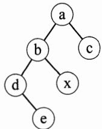
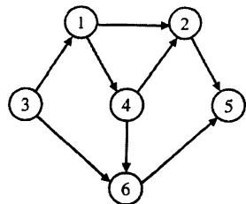

# 2014年全国硕士研究生入学统一考试

# 计算机科学与技术学科联考计算机学科专业基础综合试题

# 一、单项选择题（第 $1\sim 40$ 小题，每小题2分，共80分。下列每题给出的四个选项中，只有一个选项最符合试题要求）

1. 下列程序段的时间复杂度是

count=0;  
for $(k = 1;k <   = n;k^{\star} = 2)$ for $(j = 1;j <   = n;j + + )$ count++;

A. $O(\log_2 n)$

B. $\mathrm{O}\left( n\right)$

C. $\mathrm{O}\left( {{n\log }_{2}n}\right)$

D. $O(n^{2})$

2. 假设栈初始为空，将中缀表达式 $a / b + (c^* d - e^* f) / g$ 转换为等价的后缀表达式的过程中，当扫描到 $f$ 时，栈中的元素依次是

A. $+ (* -$

B. $+(-^{*})$

C. $/ + \left( {{}^{ * } -  * }\right)$

D. $/ + -  *$

3. 循环队列放在一维数组 $\mathrm{A}[0\dots M - 1]$ 中，end1指向队头元素，end2指向队尾元素的后一个位置。假设队列两端均可进行入队和出队操作，队列中最多能容纳 $M - 1$ 个元素。初始时为空。下列判断队空和队满的条件中，正确的是

A. 队空: end1 == end2;

队满： $\mathrm{end1} = = (\mathrm{end2} + 1)\mathrm{mod}M$

B. 队空: end1 == end2;

队满： $\mathrm{end2} == (\mathrm{end1} + 1) \mod (M - 1)$

C. 队空: $\operatorname{end}2 = (\operatorname{end}1 + 1) \bmod M$ ;

队满： $\mathrm{end1} = = (\mathrm{end2} + 1)\mathrm{mod}M$

D. 队空: $\operatorname{end} 1 == (\operatorname{end} 2 + 1) \bmod M$ ;

队满： $\mathrm{end2} = = (\mathrm{end1} + 1)$ mod $(M - 1)$

4. 若对如下的二叉树进行中序线索化，则结点 $\mathbf{x}$ 的左、右线索指向的结点分别是

A.e、c

B.e、a

C. d、c

D.b、a

5. 将森林 F 转换为对应的二叉树 T，F 中叶结点的个数等于 ______。

A. T中叶结点的个数

B. T 中度为 1 的结点个数

C. T中左孩子指针为空的结点个数

D. T 中右孩子指针为空的结点个数

6.5个字符有如下4种编码方案，不是前缀编码的是

A. 01,0000,0001,001,1

B. 011,000,001,010,1

C. 000, 001, 010, 011, 100

D. 0, 100, 110, 1110, 1100

7. 对如下所示的有向图进行拓扑排序，得到的拓扑序列可能是

A. 3,1,2,4,5,6

B. 3,1,2,4,6,5

C. $3,1,4,2,5,6$

D. 3, 1, 4, 2, 6, 5

8. 用哈希（散列）方法处理冲突（碰撞）时可能出现堆积（聚集）现象。下列选项中，会受堆积现象直接影响的是________。

A. 存储效率

B. 散列函数

C. 装填（装载）因子

D. 平均查找长度

9. 在一棵具有 15 个关键字的 4 阶 B 树中，含关键字的结点个数最多是

A. 5

B. 6

C. 10

D. 15

10. 用希尔排序方法对一个数据序列进行排序时，若第1趟排序结果为9,1,4,13,7,8,20,23,15，则该趟排序采用的增量（间隔）可能是

A. 2

B. 3

C. 4

D. 5

11．下列选项中，不可能是快速排序第2趟排序结果的是

A. 2,3,5,4,6,7,9

B. 2, 7, 5, 6, 4, 3, 9

C. 3,2,5,4,7,6,9

D. 4,2,3,5,7,6,9

12. 程序 P 在机器 M 上的执行时间是 20 秒，编译优化后，P 执行的指令数减少到原来的 $70\%$ ，而 CPI 增加到原来的 1.2 倍，则 P 在 M 上的执行时间是

A. 8.4秒

B. 11.7秒

C. 14秒

D. 16.8秒

13.若 $x = 103,y = -25$ ，则下列表达式采用8位定点补码运算实现时，会发生溢出的是

A. $x + y$

B. $-x + y$

C. $x - y$

D. -x-y

14. float 型数据常用 IEEE754 单精度浮点格式表示。假设两个 float 型变量 x 和 y 分别存放在 32 位寄存器 $f_1$ 和 $f_2$ 中, 若 $(f_1) = \mathrm{CC90000H}$ , $(f_2) = \mathrm{B0C0000H}$ , 则 x 和 y 之间的关系为____。

A. $x < y$ 且符号相同

B. $x < y$ 且符号不同

C. $x > y$ 且符号相同

D. $x > y$ 且符号不同

15. 某容量为 256MB 的存储器由若干 $4\mathrm{M} \times 8$ 位的 DRAM 芯片构成，该 DRAM 芯片的地址引脚和数据引脚总数是 ______。

A. 19

B. 22

C. 30

D. 36

16. 采用指令 Cache 与数据 Cache 分离的主要目的是

A. 降低 Cache 的缺失损失

B. 提高 Cache 的命中率

C. 降低 CPU 平均访存时间

D. 减少指令流水线资源冲突

17．某计算机有16个通用寄存器，采用32位定长指令字，操作码字段（含寻址方式位）为8位，Store指令的源操作数和目的操作数分别采用寄存器直接寻址和基址寻址方式。若基址寄存器可使用任一通用寄存器，且偏移量用补码表示，则Store指令中偏移量的取值范围是

A. $-32768\sim +32767$

B. $-32767\sim +32768$

C. $-65536\sim +65535$

D. $-65535\sim +65536$

18．某计算机采用微程序控制器，共有32条指令，公共的取指令微程序包含2条微指令，各指令对应的微程序平均由4条微指令组成，采用断定法（下地址字段法）确定下条微指令地

址，则微指令中下地址字段的位数至少是

A. 5

B. 6

C. 8

D. 9

19. 某同步总线采用数据线和地址线复用方式，其中地址/数据线有 32 根，总线时钟频率为 $66\mathrm{MHz}$ ，每个时钟周期传送两次数据（上升沿和下降沿各传送一次数据），该总线的最大数据传输率（总线带宽）是 ______。

A. $132\mathrm{MB} / \mathrm{s}$

B. $264 \mathrm{MB} / \mathrm{s}$

C. $528 \mathrm{MB} / \mathrm{s}$

D. $1056 \mathrm{MB} / \mathrm{s}$

20. 一次总线事务中，主设备只需给出一个首地址，从设备就能从首地址开始的若干连续单元读出或写入多个数据。这种总线事务方式称为 ________。

A. 并行传输

B. 串行传输

C. 突发传输

D. 同步传输

21. 下列有关 I/O 接口的叙述中，错误的是

A. 状态端口和控制端口可以合用同一个寄存器

B. I/O 接口中 CPU 可访问的寄存器称为 I/O 端口

C. 采用独立编址方式时, I/O 端口地址和主存地址可能相同

D. 采用统一编址方式时, CPU 不能用访存指令访问 I/O 端口

22. 若某设备中断请求的响应和处理时间为 100ns, 每 400ns 发出一次中断请求, 中断响应所允许的最长延迟时间为 50ns, 则在该设备持续工作过程中, CPU 用于该设备的 I/O 时间占整个 CPU 时间的百分比至少是____。

A. $12.5\%$

B. $25\%$

C. $37.5\%$

D. $50\%$

23. 下列调度算法中，不可能导致饥饿现象的是

A. 时间片轮转

B. 静态优先数调度

C. 非抢占式短作业优先

D. 抢占式短作业优先

24. 某系统有 $n$ 台互斥使用的同类设备，三个并发进程分别需要 3、4、5 台设备，可确保系统不发生死锁的设备数 $n$ 最小为 ______。

A. 9

B. 10

C. 11

D. 12

25. 下列指令中，不能在用户态执行的是

A．trap指令

B. 跳转指令

C. 压栈指令

D. 关中断指令

26. 一个进程的读磁盘操作完成后，操作系统针对该进程必做的是________。

A. 修改进程状态为就绪态

B. 降低进程优先级

C. 给进程分配用户内存空间

D. 增加进程时间片大小

27. 现有一个容量为 10GB 的磁盘分区，磁盘空间以簇（Cluster）为单位进行分配，簇的大小为 4KB，若采用位图法管理该分区的空闲空间，即用一位（bit）标识一个簇是否被分配，则存放该位图所需簇的个数为 ________。

A. 80

B. 320

C. $80 \mathrm{~K}$

D. 320K

28. 下列措施中，能加快虚实地址转换的是________。

I.增大块表（TLB）容量

II. 让页表常驻内存

III. 增大交换区（swap）

A. 仅 I

B. 仅 II

C. 仅 I、II

D. 仅 II、III

29. 在一个文件被用户进程首次打开的过程中，操作系统需要做的是________。

A. 将文件内容读到内存中

B. 将文件控制块读到内存中

C. 修改文件控制块中的读写权限

D. 将文件的数据缓冲区首指针返回给用户进程

30. 在页式虚拟存储管理系统中，采用某些页面置换算法，会出现 Belady 异常现象，即进程的缺页次数会随着分配给该进程的页框个数的增加而增加。下列算法中，可能出现 Belady 异

常现象的是

I. LRU算法

II. FIFO算法

III. OPT算法

A. 仅 II

B. 仅 I、II

C. 仅 I、III

D. 仅 II、III

31. 下列关于管道（Pipe）通信的叙述中，正确的是________。

A. 一个管道可实现双向数据传输  
B. 管道的容量仅受磁盘容量大小限制  
C. 进程对管道进行读操作和写操作都可能被阻塞  
D. 一个管道只能有一个读进程或一个写进程对其操作

32. 下列选项中, 属于多级页表优点的是

A. 加快地址变换速度

B. 减少缺页中断次数

C. 减少页表项所占字节数

D. 减少页表所占的连续内存空间

33. 在 OSI 参考模型中，直接为会话层提供服务的是________。

A. 应用层

B. 表示层

C. 传输层

D. 网络层

34. 某以太网拓扑及交换机当前转发表如下图所示，主机 00-e1-d5-00-23-a1 向主机 00-e1-d5-00-23-c1 发送 1 个数据帧，主机 00-e1-d5-00-23-c1 收到该帧后，向主机 00-e1-d5-00-23-a1 发送 1 个确认帧，交换机对这两个帧的转发端口分别是 ______。

A. $\{3\}$ 和 $\{1\}$

B. $\{2,3\}$ 和 $\{1\}$

C. $\{2,3\}$ 和 $\{1,2\}$

D. $\{1,2,3\}$ 和 $\{1\}$

35. 下列因素中，不会影响信道数据传输速率的是

A. 信噪比

B. 频率宽带

C. 调制速率

D. 信号传播速度

36. 主机甲与主机乙之间使用后退 $N$ 帧协议（GBN）传输数据，甲的发送窗口尺寸为 1000，数据帧长为 1000 字节，信道带宽为 100Mbps，乙每收到一个数据帧立即利用一个短帧（忽略其传输延迟）进行确认，若甲、乙之间的单向传播延迟是 50ms，则甲可以达到的最大平均数据传输速率约为 ______。

A. 10Mbps

B. 20Mbps

C. 80Mbps

D. 100Mbps

37. 站点 A、B、C 通过 CDMA 共享链路，A、B、C 的码片序列（chipping sequence）分别是 $(1,1,1,1)$ 、 $(1,-1,1,-1)$ 和 $(1,1,-1,-1)$ 。若 C 从链路上收到的序列是 $(2,0,2,0,0,-2,0,-2,0,2,0,2)$ ，则 C 收到 A 发送的数据是 ________。

A. 000

B. 101

C. 110

D. 111

38. 主机甲和主机乙已建立了TCP连接，甲始终以 $\mathrm{MSS} = 1\mathrm{KB}$ 大小的段发送数据，并一直有数据发送；乙每收到一个数据段都会发出一个接收窗口为 $10\mathrm{KB}$ 的确认段。若甲在 $t$ 时刻发生超时时拥塞窗口为 $8\mathrm{KB}$ ，则从 $t$ 时刻起，不再发生超时的情况下，经过10个RTT后，甲的发送窗口是

A. 10KB

B. 12KB

C. $14 \mathrm{KB}$

D. 15KB

39. 下列关于 UDP 协议的叙述中，正确的是

I. 提供无连接服务

II. 提供复用/分用服务

III. 通过差错校验，保障可靠数据传输

A. 仅 I

B. 仅 I、II

C. 仅 II、III

D. I、II、III

40. 使用浏览器访问某大学Web网站主页时，不可能使用到的协议是

A. PPP

B. ARP

C. UDP

D. SMTP

# 二、综合应用题（第 $41\sim 47$ 小题，共70分）

41.（13分）二叉树的带权路径长度（WPL）是二叉树中所有叶结点的带权路径长度之和。给定一棵二叉树T，采用二叉链表存储，结点结构如下：

<table><tr><td>left</td><td>weight</td><td>right</td></tr></table>

其中叶结点的 weight 域保存该结点的非负权值。设 root 为指向 T 的根结点的指针，请设计求 T 的 WPL 的算法，要求：

1）给出算法的基本设计思想。  
2）使用C或 $\mathrm{C + + }$ 语言，给出二叉树结点的数据类型定义。  
3）根据设计思想，采用C或 $\mathrm{C + + }$ 语言描述算法，关键之处给出注释。  
42.（10分）某网络中的路由器运行OSPF路由协议，题42表是路由器R1维护的主要链路状态信息（LSI)，题42图是根据题42表及R1的接口名构造出来的网络拓扑。

题42表 R1所维护的LSI  

<table><tr><td colspan="2"></td><td>R1的LSI</td><td>R2的LSI</td><td>R3的LSI</td><td>R4的LSI</td><td>备注</td></tr><tr><td colspan="2">Router ID</td><td>10.1.1.1</td><td>10.1.1.2</td><td>10.1.1.5</td><td>10.1.1.6</td><td>标识路由器的IP地址</td></tr><tr><td rowspan="3">Link1</td><td>ID</td><td>10.1.1.2</td><td>10.1.1.1</td><td>10.1.1.6</td><td>10.1.1.5</td><td>所连路由器的Router ID</td></tr><tr><td>IP</td><td>10.1.1.1</td><td>10.1.1.2</td><td>10.1.1.5</td><td>10.1.1.6</td><td>Link1的本地IP地址</td></tr><tr><td>Metric</td><td>3</td><td>3</td><td>6</td><td>6</td><td>Link1的费用</td></tr><tr><td rowspan="3">Link2</td><td>ID</td><td>10.1.1.5</td><td>10.1.1.6</td><td>10.1.1.1</td><td>10.1.1.2</td><td>所连路由器的Router ID</td></tr><tr><td>IP</td><td>10.1.1.9</td><td>10.1.1.13</td><td>10.1.1.10</td><td>10.1.1.14</td><td>Link2的本地IP地址</td></tr><tr><td>Metric</td><td>2</td><td>4</td><td>2</td><td>4</td><td>Link2的费用</td></tr><tr><td rowspan="2">Net1</td><td>Prefix</td><td>192.1.1.0/24</td><td>192.1.6.0/24</td><td>192.1.5.0/24</td><td>192.1.7.0/24</td><td>直连网络Net1的网络前缀</td></tr><tr><td>Metric</td><td>1</td><td>1</td><td>1</td><td>1</td><td>到达直连网络Net1的费用</td></tr></table>

  
题42图 R1构造的网络拓扑

请回答下列问题。

1）本题中的网络可抽象为数据结构中的哪种逻辑结构？  
2）针对题42表中的内容，设计合理的链式存储结构，以保存题42表中的链路状态信息

(LSI)。要求给出链式存储结构的数据类型定义，并画出对应题42表的链式存储结构示意图（示意图中可仅以ID标识结点）。

3）按照迪杰斯特拉（Dijkstra）算法的策略，依次给出R1到达题42图中子网192.1.x.x的最短路径及费用。

43.（9分）请根据题42描述的网络，继续回答下列问题。

1）假设路由表结构如下表所示，请给出题42图中R1的路由表，要求包括到达题42图中子网192.1.x.x的路由，且路由表中的路由项尽可能少。

<table><tr><td>目的网络</td><td>下一跳</td><td>接口</td></tr></table>

2）当主机192.1.1.130向主机192.1.7.211发送一个 $\mathrm{TL} = 64$ 的IP分组时，R1通过哪个接口转发该IP分组？主机192.1.7.211收到的IP分组TTL是多少？  
3）若R1增加一条Metric为10的链路连接Internet，则题42表中R1的LSI需要增加哪些信息？  
44.（12分）某程序中有如下循环代码段P：“for $(\mathrm{nt}i = 0;i <   N;i + + )\mathrm{sum} += A[i];$ 。假设编译时变量sum和i分别分配在寄存器R1和R2中。常量N在寄存器R6中，数组A的首地址在寄存器R3中。程序段P起始地址为 $08048100\mathrm{H}$ ，对应的汇编代码和机器代码如下表所示。

<table><tr><td>编号</td><td>地址</td><td>机器代码</td><td>汇编代码</td><td>注释</td></tr><tr><td>1</td><td>08048100H</td><td>00022080H</td><td>loop: sll R4, R2, 2</td><td>(R2) &lt;&lt; 2 → R4</td></tr><tr><td>2</td><td>08048104H</td><td>00083020H</td><td>add R4, R4, R3</td><td>(R4) + (R3) → R4</td></tr><tr><td>3</td><td>08048108H</td><td>8C850000H</td><td>load R5, 0(R4)</td><td>((R4) + 0) → R5</td></tr><tr><td>4</td><td>0804810CH</td><td>00250820H</td><td>add R1, R1, R5</td><td>(R1) + (R5) → R1</td></tr><tr><td>5</td><td>08048110H</td><td>20420001H</td><td>add R2, R2, 1</td><td>(R2) + 1 → R2</td></tr><tr><td>6</td><td>08048114H</td><td>1446FFFFAH</td><td>bne R2, R6, loop</td><td>if(R2)!=(R6) goto loop</td></tr></table>

执行上述代码的计算机 M 采用 32 位定长指令字, 其中分支指令 bne 采用如下格式:

<table><tr><td>31 26</td><td>25 21</td><td>20 16</td><td>15 0</td></tr><tr><td>OP</td><td>Rs</td><td>Rd</td><td>OFFSET</td></tr></table>

OP 为操作码；Rs 和 Rd 为寄存器编号；OFFSET 为偏移量，用补码表示。请回答下列问题，并说明理由。

1）M的存储器编址单位是什么？  
2）已知sll指令实现左移功能，数组A中每个元素占多少位？  
3）表中bne指令的OFFSET字段的值是多少？已知bne指令采用相对寻址方式，当前PC内容为bne指令地址，通过分析表中指令地址和bne指令内容，推断出bne指令的转移目标地址计算公式。  
4）若M采用如下“按序发射、按序完成”的5级指令流水线：IF（取值）、ID（译码及取数）、EXE（执行）、MEM（访存）、WB（写回寄存器），且硬件不采取任何转发措施，分支指令的执行均引起3个时钟周期的阻塞，则P中哪些指令的执行会由于数据相关而发生流水线阻塞？哪条指令的执行会发生控制冒险？为什么指令1的执行不会因为与指令5的数据相关而发生阻塞？  
45. 假设对于 44 题中的计算机 M 和程序 P 的机器代码，M 采用页式虚拟存储管理；P 开始执行时， $(R1) = (R2) = 0$ ， $(R6) = 1000$ ，其机器代码已调入主存但不在 Cache 中；数组 A 未调入主存，且所有数组元素在同一页，并存储在磁盘同一个扇区。请回答下列问题并说明理由。

1）P执行结束时，R2的内容是多少？  
2）M的指令Cache和数据Cache分离。若指令Cache共有16行，Cache和主存交换的块大小为32字节，则其数据区的容量是多少？若仅考虑程序段P的执行，则指令Cache的命中率为多少？  
3) P 在执行过程中，哪条指令的执行可能发生溢出异常？哪条指令的执行可能产生缺页异常？对于数组 A 的访问，需要读磁盘和 TLB 至少各多少次？  
46. 文件 F 由 200 条记录组成，记录从 1 开始编号。用户打开文件后，欲将内存中的一条记录插入到文件 F 中，作为其第 30 条记录。请回答下列问题，并说明理由。  
1）若文件系统采用连续分配方式，每个磁盘块存放一条记录，文件F存储区域前后均有足够的空闲磁盘空间，则完成上述插入操作最少需要访问多少次磁盘块？F的文件控制块内容会发生哪些改变？  
2）若文件系统采用链接分配方式，每个磁盘块存放一条记录和一个链接指针，则完成上述插入操作需要访问多少次磁盘块？若每个存储块大小为1KB，其中4字节存放链接指针，则该文件系统支持的文件最大长度是多少？  
47. 系统中有多个生产者进程和多个消费者进程, 共享一个能存放 1000 件产品的环形缓冲区 (初始为空)。当缓冲区未满时, 生产者进程可以放入其生产的一件产品, 否则等待; 当缓冲区未空时, 消费者进程可以从缓冲区取走一件产品, 否则等待。要求一个消费者进程从缓冲区连续取出 10 件产品后, 其他消费者进程才可以取产品。请使用信号量 P, V (或 wait(), signal()) 操作实现进程间的互斥与同步, 要求写出完整的过程, 并说明所用信号量的含义和初值。