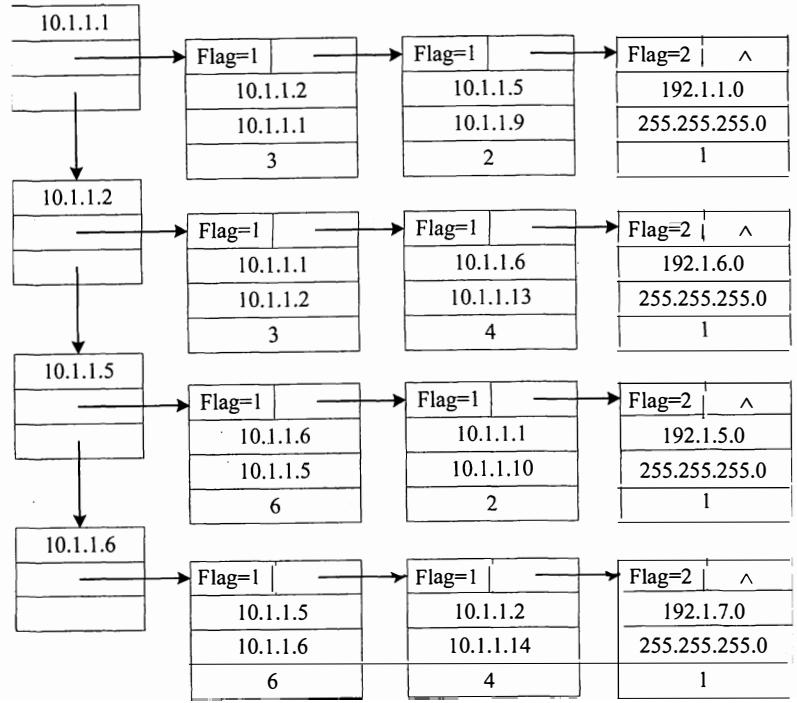

# 2014 年计算机学科专业基础综合试题参考答案

# 一、单项选择题

<table><tr><td>1.</td><td>C</td><td>2.</td><td>B</td><td>3.</td><td>A</td><td>4.</td><td>D</td><td>5.</td><td>C</td><td>6.</td><td>D</td><td>7.</td><td>D</td><td>8.</td><td>D</td></tr><tr><td>9.</td><td>D</td><td>10.</td><td>B</td><td>11.</td><td>C</td><td>12.</td><td>D</td><td>13.</td><td>C</td><td>14.</td><td>A</td><td>15.</td><td>A</td><td>16.</td><td>D</td></tr><tr><td>17.</td><td>A</td><td>18.</td><td>C</td><td>19.</td><td>C</td><td>20.</td><td>C</td><td>21.</td><td>D</td><td>22.</td><td>B</td><td>23.</td><td>A</td><td>24.</td><td>B</td></tr><tr><td>25.</td><td>D</td><td>26.</td><td>A</td><td>27.</td><td>A</td><td>28.</td><td>C</td><td>29.</td><td>B</td><td>30.</td><td>A</td><td>31.</td><td>C</td><td>32.</td><td>D</td></tr><tr><td>33.</td><td>C</td><td>34.</td><td>B</td><td>35.</td><td>D</td><td>36.</td><td>C</td><td>37.</td><td>B</td><td>38.</td><td>A</td><td>39.</td><td>B</td><td>40.</td><td>D</td></tr></table>

# 1. 解析：

内层循环条件 $\scriptstyle { j < = n }$ 与外层循环的变量无关，每次循环 $j$ 自增 每次内层循环都执行 $_ n$ 次。外层循环条件为 $k { < } { = } n$ , 增量定义为 ${ \bf k } ^ { * } { = } 2$ , 可知循环次数为 $2 ^ { k } < = n$ , $k { < } { = } \log _ { 2 } n$ 。所以内层循环的时间复杂度是 ${ \mathrm { O } } ( n )$ , 外层循环的时间复杂度是 ${ \mathrm { O } } ( \log _ { 2 } n )$ 。对千嵌套循环，根据乘法规则可知，该段程序的时间复杂度 $T ( n ) = T _ { 1 } ( n ) T _ { 2 } ( n ) = \operatorname { O } ( n ) \operatorname { O } ( \log _ { 2 } n ) = \operatorname { O } ( n \log _ { 2 } n )$ ,

# 2. 解析：

将中缀表达式转换为后缀表达式的算法思想如下：

从左向右开始扫描中缀表达式；

遇到数字时，加入后缀表达式；

遇到运算符时：

a. 若为＇（＇，入栈；  
b. 若为＇）＇，则依次把栈中的运算符加入后缀表达式中，直到出现＇（＇，从栈中删除＇（＇；BDD  
C. 若为除括号外的其他运算符，当其优先级高于除＇（＇以外的栈顶运算符时，直接入栈；否则从栈顶开始，依次弹出比当前处理的运算符优先级高和优先级相等的运算符，直到一个比它优先级低的或者遇到了一个左括号为止。

当扫描的中缀表达式结束时，栈中的所有运算符依次出栈加入后缀表达式。

<table><tr><td>待处理序列</td><td>栈</td><td>后缀表达式</td><td>当前扫描元素</td><td>动作</td></tr><tr><td>a/b+(c*d-e*f)/g</td><td></td><td></td><td>a</td><td>a加入后缀表达式</td></tr><tr><td>/b+(c*d-e*f)/g</td><td></td><td>a</td><td>/</td><td>/入栈</td></tr><tr><td>b+(c*d-e*f)/g</td><td>/</td><td>a</td><td>b</td><td>b加入后缀表达式</td></tr><tr><td>+(c*d-e*f)/g</td><td>/</td><td>ab</td><td>+</td><td>+优先级低于栈顶的/,弹出/</td></tr><tr><td>+(c*d-e*f)/g</td><td></td><td>ab/</td><td>+</td><td>+入栈</td></tr><tr><td>(c*d-e*f)/g</td><td>+</td><td>ab/</td><td>(</td><td>(入栈</td></tr><tr><td>c*d-e*f)/g</td><td>+(</td><td>ab/</td><td>c</td><td>c加入后缀表达式</td></tr><tr><td>*d-e*f)/g</td><td>+(</td><td>ab/c</td><td>*</td><td>栈顶为(, *入栈</td></tr><tr><td>d-e*f)/g</td><td>+(*</td><td>ab/c</td><td>d</td><td>d加入后缀表达式</td></tr><tr><td>-e*f)/g</td><td>+(*</td><td>ab/cd</td><td>-</td><td>-优先级低于栈顶的*,弹出*</td></tr><tr><td>-e*f)/g</td><td>+(</td><td>ab/cd*</td><td>-</td><td>栈顶为(,-入栈</td></tr><tr><td>e*f/g</td><td>+(-</td><td>ab/cd*</td><td>e</td><td>e加入后缀表达式</td></tr><tr><td>*f/g</td><td>+(-</td><td>ab/cd*e</td><td>*</td><td>*优先级高于栈顶的-, *入栈</td></tr><tr><td>f/g</td><td>+(-*</td><td>ab/cd*e</td><td>f</td><td>f加入后缀表达式</td></tr><tr><td>)/g</td><td>+(-*</td><td>ab/cd*ef</td><td>)</td><td>把栈中(之前的符号加入表达式</td></tr><tr><td>/g</td><td>+</td><td>ab/cd*ef*-</td><td>/</td><td>/优先级高于栈顶的+, /入栈</td></tr><tr><td>g</td><td>+/</td><td>ab/cd*ef*-</td><td>g</td><td>g加入后缀表达式</td></tr><tr><td></td><td>+/</td><td>ab/cd*ef*-g</td><td></td><td>扫描完毕,运算符依次退栈加入表达式</td></tr><tr><td></td><td></td><td>ab/cd*ef*-g/+</td><td></td><td>完成</td></tr></table>

由此可知，当扫描到 的时候，栈中的元素依次是 $+ ( - ^ { * }$ ，选B。

在此，再给出中缀表达式转换为前缀或后缀表达式的手工做法，以上面给出的中缀表达式为例：

第一步：按照运算符的优先级对所有的运算单位加括号。

式子变成 $( ( \mathbf { a } / \mathbf { b } ) \mathbf { + } ( ( ( \mathbf { c } ^ { \ast } \mathbf { d } ) \mathbf { - } ( \mathbf { e } ^ { \ast } \mathbf { f } ) ) / \mathbf { g } ) )$ 。

第二步：转换为前缀或后缀表达式。

前缀：把运算符号移动到对应的括号前面，则变成 $+ ( / ( \mathrm { a b } ) / ( - ( ^ { \ast } ( \mathrm { c d } ) ^ { \ast } ( \mathrm { e f } ) ) \mathbf { g } ) )$ 。

把括号去掉： $+ / { \mathsf { a b } } / { - } ^ { * } { \mathsf { c d } } ^ { * } { \mathsf { e f g } }$ 前缀式子出现。

后缀：把运算符号移动到对应的括号后面，则变成 $( ( \mathbf { a b } ) / ( ( ( \mathbf { c d } ) ^ { * } ( \mathbf { e f } ) ^ { * } ) - \mathbf { g } ) / ) + \mathfrak { o }$

把括号去掉： $\mathbf { a b } / \mathbf { c d } ^ { * } \mathbf { e f } ^ { * } \mathbf { - g } / +$ 后缀式子出现。

当题目要求直接求前缀或后缀表达式时，这种方法会比上一种快捷得多。

# 3. 解析：

指向队头元素，那么可知出队的操作是先从 读数，然后 再加 。 指向队尾元素的后一个位置，那么可知入队操作是先存数到 然后 再加 。 若把 储存第一个元素，当队列初始时，入队操作是先把数据放到 然后 自增，即可知 初值为0; 指向的是队头元素，队头元素的在数组 中的下标为o, 所以得知 初值也为o, 可知队空条件为 $=$ 。然后考虑队列满时，因为队列最多能容纳 $M - 1$ 个元素，假设队列存储在下标为 到下标为 $M - 2$ 的 $M - 1$ 个区域队头为 队尾为 此时队列满，考虑在这种情况下 和 的状态， 指向队头元素，可知 $\scriptstyle = 0$ 指向队尾元素的后一个位置，可知 $\mathrm { e n d } 2 = M ^ { - } 2 + 1 = M ^ { - } 1$ 所以可知队满的条件为 $=$ 1) mo M 选 。

注意：考虑这类具体问题时 用一些特殊情况判断往往比直接思考问题能更快地得到答案并可以画出简单的草图以方便解题。

# 4. 解析：

线索二叉树的线索实际上指向的是相应遍历序列特定结点的前驱结点和后继结点，所以先写出二叉树的中序遍历序列 中序遍历中在 $\mathbf { x }$ 左边和右边的字符，就是它在中序线索化的左、 右线索，即b、a, 选D。

# 5. 解析：

将森林转化为二叉树即相当于用孩子兄弟表示法表示森林。 在变化过程中，原森林某结点的第一个孩子结点作为它的左子树，它的兄弟作为它的右子树。 那么森林中的叶结点由千没有孩子结点，那么转化为二叉树时，该结点就没有左结点，所以 中叶结点的个数就等于 中左孩子指针为空的结点个数，选 。 此题还可以通过一些特例来排除 、 、 选项。

# 6. 解析：

前缀编码的定义是在一个字符集中，任何一个字符的编码 都 不是另一个字符 编码的前缀。选项D 中编码 110 是编码 1100的前缀，违反了前缀编码的规则，所以D不是前缀编码。

# 7. 解析：

按照拓扑 排序的算法，每次都 选择入度为0的结点从图中删去 ， 此图中一开始只有结点3的入度为0; 删掉结点3后，只有结点1的入度为0; 删掉结点1后， 只有结点4的入度为O;删掉结点4后， 结点2和结点6的入度 都为o, 此时选择删去不同的结点， 会得出不同的拓扑序列 ， 分别处理完毕后 可知可能的拓扑序列为3,1, 4, 2, 6, 5和3,1,4,6,2,5, 选D。

# 8. 解析：

产生堆积现象，即产生了冲突，它对存储效率、散列函数和装填因子均 不会有影响，而平均查找长度 会因为堆积现象而增大，选D。

# 9. 解析：

关键字数量 不变，要求结点数量 最多，那么 即每个结点中含关键字的数最最少。根据4 阶B树的定义，根 结点最少含l个关键字，非根结点中最少含 $\left\lceil 4 / 2 \right\rceil - 1 = 1$ 个关键字 ，所以每个结点中，关键字数量最少都为1个，即每个结点都 有2个分支，类似于排序 二叉树，而15个结点正好可以构造一个4层的4阶B树， 使得叶结点全在第四层 ，符合B树定义， 因此选D。

# 10. 解析：

首先，第二个元素为1, 是整个序列中的最小元素，所以可知该希尔排序为从小到大排 序 。然后考虑增量问题， 若增量为2, 第 $^ { 1 + 2 }$ 个元素4明显比第1个元素9要大，A排除；若增量为3, 第 $i , ~ i + 3 , ~ i + 6$ 个元素都为有序序列 $( i = 1 , 2 , 3 )$ , 符合希尔排序的定义；若增量为4,第1个元素9比第 $1 + 4$ 个元素7要大，C排除；若增量为5, 第1个元素9比第 $1 + 5$ 个元素8要大，D排除，选B。

# 11. 解析：

快排的阶段性排序 结果的特点是，第 $_ i$ 趟完成时， 会有 $_ i$ 个以上的数出现在它最终将要出现的位置，即它左边的数 都比它小，它右边的数 都比它大。题目问第二趟 排序的结果，即要找不存在两个这样的数的选项。A选项中2、3、6、7、9均符合，所以A排除；B选项中，2、9均符合，所以B排除；D选项中5、9均符合，所以 $\mathbf { D }$ 选项排除；最后看C选项，只有9一个数符合，所以C不可能 是快速排序第二趟的结果。

# 12. 解析：

不妨设原来指令条数为 $x$ , 那么原CPI就为 ${ 2 0 } / { x }$ , 经过编译优化后， 指令条数减少到原来的 $70 \%$ , 即指令条数为 $0 . 7 x$ , 而CPI增加到原来的1.2倍，即 $2 4 / x$ , 那么 现在P 在M上的执行时间就为指令条数 $\times \mathrm { C P I } = 0 . 7 x \times 2 4 / x = 2 4 { \times } 0 . 7 = 1 6 . 8 s$ , 选D。

# 13. 解析：

8位定点补码表示的数据范围为- $- 1 2 8 \sim 1 2 7$ , 若运算结果超出这个范围则会溢出，A选项 $x +$ $y = 1 0 3 - 2 5 = 7 8$ , 符合范围，A排除；B选项 $- x + y = - 1 0 3 - 2 5 = - 1 2 8$ , 符合范围，B排除；D选项 $- x - y = - 1 0 3 + 2 5 = - 7 8$ , 符合范围，D排除；C选项 $x - y = 1 0 3 + 2 5 = 1 2 8$ , 超过了127, 选C。

该题也可按照二进制写出两个数进行运算，观察运算的进位信息得到 结果，不过这种方法更为麻烦和耗时，在实际考试中并不推荐。

# 14. 解析：

(fl)和位）对应的二进制分别是(110011001001 … )2和(101100001100 … )2, 根据IEEE754浮点数标准，可知(fl)的数符为1, 阶码为10011001, 尾数为1.001,而(f2)的数符为1, 阶码为01100001,

尾数为 1.1, 则可知两数均为负数， 符号相同， B、 D排除。 (fl)的绝对值为 $1 . 0 0 1 \times 2 ^ { 2 6 }$ , (f2)的绝对值为 $1 . 1 \times 2 ^ { - 3 0 }$ , 则(fl)的绝对值比(f2)的绝对值大， 而符号为负， 真值大小相反， 即(fl)的真值比(f2)的真值小， 即 $x < y$ , 选 A。

此题还有更为简便的算法， (fl)与(f2)的前 4 位为 1100 与 1011, 可以看出两数均为负数，而阶码用移码表示， 两数的阶码头三位分别为 100 和 011, 可知(fl)的阶码大于(f2)的阶码， 又因为是 IEEE754 规格化的数， 尾数部分均为 l.xxx, 则阶码大的数， 真值的绝对值必然大， 可知(fl)真值的绝对值大于(f2)真值的绝对值， 因为都为负数， 则(fl)<(f2), 即 $x < y$ 。

# 15. 解析：

$4 \mathbf { M } \times 8$ 位的芯片数据线应为8 根， 地址线应为 $\mathrm { l o g } _ { 2 } 4 \mathrm { M } = 2 2$ 根， 而 DRAM 采用地址复用技术， 地址线是原来的 1/2, 且地址信号分行、 列两次传送。 地址线数为 $2 2 / 2 = 1 1$ 根， 所以地址引脚与数据引脚的总数为 $1 1 + 8 = 1 9$ 根， 选 A。

此题需要注意的是DRAM是采用传两次地址的策略， 所以地址线为正常的一半， 这是很多考生容易忽略的地方。

# 16. 解析：

把指令Cache与数据Cache分离后， 取指和取数分别到不同的Cache中寻找， 那么指令流水线中取指部分和取数部分就可以很好地避免冲突， 即减少了指令流水线的冲突， 选D。

# 17. 解析：

采用 32 位定长指令字， 其中操作码为8 位， 两个地址码一共占用 $3 2 \div 8 \ u = 2 4$ 位， 而 Store指令的源操作数和目的操作数分别采用寄存器直接寻址和基址寻址，机器中共有 16 个通用寄存器， 则寻址一个寄存器需要 $\log _ { 2 } 1 6 = 4$ 位， 源操作数中的寄存器直接寻址用掉 4 位， 而目的操作数采用基址寻址也要指定一个寄存器， 同样用掉 4 位， 则留给偏移址的位数为 $2 4 - 4 - 4 \ : = \ : 1 6$ 位， 而偏移址用补码表示， 16位补码的表示范围为 $- 3 2 7 6 8 \sim + 3 2 7 6 7$ , 选A。

# 18. 解析：

计算机共有32条指令，各个指令对应的微程序平均为4条，则指令对应的微指令为 $3 2 { \times } 4 =$ 128 条， 而公共微指令还有2 条， 整个系统中微指令的条数一共为 $1 2 8 + 2 = 1 3 0$ 条， 所以需要$\log _ { 2 } 1 3 0 = 8$ 位才能寻址到 130条微指令， 答案选 C。

# 19. 解析：

数据线有 32 根， 也就是一次可以传送 $3 2 \mathrm { b i } \mathsf { t } / 8 = 4 \mathrm { B }$ 的数据， 66MHz 意味着有66M 个时钟周期，而每个时钟周期传送两次数据， 可知总线每秒传送的最大数据量为 $6 6 \mathbf { M } { \times } 2 { \times } 4 \mathbf { B } = 5 2 8 \mathbf { M } \mathbf { B }$ ,所以总线的最大数据传输率为528MB/s, 选C。

# 20. 解析：

猝发（突发）传输是在一个总线周期中， 可以传输多个存储地址连续的数据， 即一次传输一个地址和一批地址连续的数据， 并行传输是在传输中有多个数据位同时在设备之间进行的传输，串行传输是指数据的二进制代码在一条物理信道上以位为单位按时间顺序逐位传输的方式，同步传输是指传输过程由统一的时钟控制， 选 C。

# 21. 解析：

采用统一编址时，CPU访存和访问1/0端口用的是一样的指令，所以访存指令可以访问I/0端口，D选项错误， 其他三个选项均为正确陈述， 选D。

# 22. 解析：

每 400ns 发出一次中断请求， 而响应和处理时间为 lOOns, 其中允许的延迟为干扰信息，因为在 50ns 内， 无论怎么延迟， 每 400ns 还是要花费 $1 0 0 \mathrm { n s }$ 处理中断的， 所以该设备的I/0时

间占整个CPU时间的百分比为 $1 0 0 \mathrm { n s } / 4 0 0 \mathrm { n s } = 2 5 \%$ , 选B。

# 23. 解析：

采用静态优先级调度时， 当系统总是出现优先级高的任务时， 优先级低的任务会总是得不到处理机而产生饥饿现象；短任务优先调度不管是抢占式或是非抢占的， 当系统总是出现新来的短任务时， 长任务会总是得不到处理机， 产生饥饿现象， 因此B、C、D 都错误， 选A。

# 2 4. 解析：

三个并发进程分别需要3 、4 、5台设备， 当系统只有 $( 3 - 1 ) + ( 4 - 1 ) + ( 5 - 1 ) = 9$ 台设备时，第一个进程分配2台，第二个进程分配3台，第三个进程分配4台。这种情况下， 三个进程均无法继续执行下去， 发生死锁。 当系统中再增加1台设备， 也就是总共10台设备时， 这最后1台设备分配给任意一个进程都可以顺利执行完成，因此保证系统不发生死锁的最小设备数为10 。

# 25. 解析：

trap指令、跳转指令和压栈指令均可以在用户态执行， 其中trap指令负责由用户态转换成为内核态， 而关中断指令为特权指令， 必须在核心态才能执行， 选D。

# 26. 解析：

进程申请读磁盘操作的时候， 因为要等待I/0操作完成， 会把自身阻塞， 此时进程就变为了阻塞状态， 当 I/0操作完成后， 进程得到了想要的资源， 就会从阻塞态转换到就绪态（这是操作系统的行为）。而降低进程优先级、分配用户内存空间和增加进程的时间片大小都不一定会发生， 选A。

# 27. 解析：

簇的总数为 $1 0 \mathrm { G B } / 4 \mathrm { K B } = 2 . 5 \mathrm { M }$ , 用一位标识一簇是否被分配， 则整个磁盘共需要2.5M位，即需要 $2 . 5 \mathrm { M } / 8 = 3 2 0 \mathrm { K B }$ , 因此共需要 $3 2 0 \mathrm { K B } / 4 \mathrm { K B } = 8 0$ $= 8 0$ 个簇， 选A。

# 2 8. 解析：

虚实地址转换是指逻辑地址和物理地址的转换。增大快表容量能把更多的表项装入快表中， 会加快虚实地址转换的平均速率；让页表常驻内存可以省去一些不在内存中的页表从磁盘上调入的过程， 也能加快虚实地址转换；增大交换区对虚实地址转换速度无影响， 因此 I、 II正确， 选C。 /

# 29. 解析：

一个文件被用户进程首次打开即被执行了Open操作， 会把文件的FCB调入内存， 而不会把文件内容读到内存中， 只有进程希望获取文件内容的时候才会读入文件内容；C、D明显错误， 选 B。

# 30. 解析：

只有FIFO算法才会导致Belady异常， 选A。

# 31. 解析：

管道实际上是一种固定大小的缓冲区， 管道对于管道两端的进程而言， 就是一个文件， 但它不是普通的文件， 它不属于某种文件系统， 而是自立门户， 单独构成一种文件系统， 并且只存在于内存中。它类似于通信中半双工信道的进程通信机制， 一个管道可以实现双向的数据传输， 而同一个时刻只能最多有一个方向的传输， 不能两个方向同时进行。管道的容量大小通常为内存上的一页， 它的大小并不是受磁盘容量大小的限制。当管道满时， 进程在写管道会被阻塞， 而当管道空时， 进程在读管道会被阻塞， 因此选C。

# 32. 解析：

多级页表不仅不会加快地址的变换速度，而且会因为增加更多的查表过程，使地址变换速度减慢；也不会减少缺页中断的次数， 反而如果访问过程中多级的页表都不在内存中，会大大增加缺页的次数，也并不会减少页表项所占的字节数，而多级页表能够减少页表所占的连续内存空间，即当页表太大时，将页表再分级，可以把每张页表控制在一页之内，减少页表所占的连续内存空间，因此选 D。

# 解析：

直接为会话层提供服务的是会话层的下一层， 即传输层，选C。

# 34. 解析：

主机 向 发送数据帧时， 交换机转发 表 中没 有这项，所以向除 接口外的所有接口广播这帧，即 、 端口会转发这帧， 同时因为转发表中并没有 00-e1-dS-00-23-al 这项，所以转发表会把（目的地址端口 这项加入转发表。 而当 向 发送确认帧时， 由于转发表已经有 这项，所以交换机只向 端口转发，选 。

# 解析：

由香农定理可知，信噪比和频率带宽都可以限制信道的极限传输速率，所以信噪比和频率带宽对信道的数据传输速率是有影响的，A、B错误；信道的传输速率实际上就是信号的发送速率，而调制速度也会直接限制数据的传输速率， 错误；信号的传播速度是信号在信道上传播的速度，与信道的发送速率无关，选 。

# 36. 解析：

考虑制约甲的数据传输速率的因素， 首先，信道带宽能直接制约数据的传输速率，传输速率一定是小于等于信道带宽的；其次， 主机甲、 乙之间采用后退 $N$ 帧协议，那么因为甲、 乙主机之间采用后退 $N$ 送一个数据到接收到它的确认之前，最多能发送多少数据，甲的最大传输速率受这两个条件的约束， 所以甲的最大传输速率是这两个值中小的那一个。 甲的发送窗口的尺寸为 即收到第一个数据的确认之前，最多能发送 个数据帧，也就是发送 $1 0 0 0 { \times } 1 0 0 0 \mathbf { B } = 1 \mathbf { M } \mathbf { B }$ 的内容，而从发送第一个帧到接收到它的确认的时间是一个往返时延，也就是 $5 0 + 5 0 = 1 0 0 \mathrm { m s } = 0 . 1 s$ 即在 $1 0 0 \mathrm { m s }$ 中，最多能传输 的数据，因此，此时的最大传输速率为 $1 \mathbf { M B } / 0 . 1 \mathbf { s } = \mathbf { \Gamma } 1 0 \mathbf { M B } / \mathbf { s } = \mathbf { \Gamma } 8 0 \mathbf { M b p s }$ 。 信道带宽为 所以答案为$\operatorname* { m i n } \{ 8 0 \mathbf { M } \mathbf { b } \mathbf { p s } , 1 0 0 \mathbf { M } \mathbf { b } \mathbf { p s } \} = 8 0 \mathbf { M } \mathbf { b } \mathbf { p s }$ , 选 C。

# 37. 解析：

把收到的序列分成每 个数字一组， 即为 、 、 因为题目求的是 发送的数据，因此把这三组数据与 站的码片序列(1, 做内积运算，结果分别是$0 , 2 , 0 ) \cdot ( 1 , 1 , 1 , 1 ) / 4 = 1 .$ 、 $( 0 , - 2 , 0 , - 2 ) \bullet ( 1 , 1 , 1 , 1 ) / 4 = - 1$ 、 $( 0 , 2 , 0 , 2 ) \cdot ( 1 , 1 , 1 , 1 ) / 4 = 1$ 所以C接收到的A发送的数据是 选 。

# 解析：

当 时刻发生超时时，把 设为 的一半，即为 且拥塞窗口设为 。然后经历个 后，拥塞窗口的大小依次为 而发送窗口取当时的拥塞窗口和接收窗口的最小值，而接收窗口始终为 所以此时的发送窗口为 选 。

实际上该题接收窗口一直为 可知不管何时，发送窗口一定小千等于 选项中只有 选项满足条件， 故选 。

# 39. 解析：

UDP提供的是无连接的服务，I正确；同时UDP也提供复用I分用服务，II正确；UDP虽然有差错校验机制，但是UDP 的差错校验只是检查数据在传输的过程中有没有出错，出错的数据直接丢弃，并没有重传等机制，不能保证可 靠传输， 使用UDP协议时， 可靠传输必须由应用层实现，III错误。 答案选B。

# 40. 解析：

当接入网络时可能会用到PPP协议，A可能用到；当计算机不知道某主机的MAC地址时，用IP地址查询相应的MAC地址时会用到ARP协议，B可 能用到；当访问Web网站时，若DNS缓冲没有存储相应域名的IP地址，用域名查询相应的IP地址时要使用DNS协议， 而DNS 是基于UDP协议的，所以C 可能用到； SMTP只有使用邮件客户端发送邮件，或是邮件服务器向别的邮件服务器发送邮件时才会用到，单纯的访问Web网页不可能用到，选D。

# 二、 综合应用题

# 41. 解答：

I)算法的基本设计思想：

$\textcircled{1}$ 基千先序递归遍历的算法思想是用一个static变量记录wpl, 把每个结点的深度作为递归函数的一个参数传递， 算法步骤如下：

若该结点是叶子结点， 则变量wpl加上该结点的深度与权值之积；

若该结点非叶子结点， 则若左子树不为空，对左子树调用递归算法， 若右子树不为空，对右子树调用递归算法， 深度参数均为本结点的深度参数加I;

最后返回计算出 的wpl即可。

$\textcircled{2}$ 基于层次遍历的算法思想是使用队列进行层次遍历，并记录当前的层数，

当遍历到叶子结点时， 累计wpl;

当遍历到非叶子结点时， 把该结点的子树加入队列；

当某结点为该层的最后一个结点时， 层数自增1;

队列空时遍历结束， 返回wpl。

2)二叉树结点的数据类型定义如下：

```txt
typedef struct BiTNode{ int weight; struct BiTNode \*lchild,\*rchild; }BiTNode,\*BiTree; 
```

3)算法代码如下：

$\textcircled{1}$ 基千先序遍历的算法：

int WPL(BiTree root){ return wpl_PreOrder(root,0);   
} intwpl_PreOrder(BiTree root,intdeep){ static intwpl $= 0$ //定义一个static变量存储wpl if(root->lchild $\equiv =$ NULL&&root->rchild $\equiv =$ NULL) //若为叶子结点，累积wpl wpl $+ =$ deep\*root->weight; if(root->lchild！ $=$ NULL） //若左子树不空，对左子树递归遍历 wpl_PreOrder(root->lchild,deep+1); if(root->rchild！ $=$ NULL） //若右子树不空，对右子树递归遍历 wpl_PreOrder(root->rchild,deep+1);

```txt
return wpl; 
```

$\textcircled{2}$ 基于层次遍历的算法：

define MaxSize 100 //设置队列的最大容量  
int wpl_LevelOrder(BiTree root){BiTree q[MaxSize]; //声明队列，end1为头指针，end2为尾指针int end1, end2; //队列最多容纳MaxSize-1个元素end1 = end2 = 0; //头指针指向队头元素，尾指针指向队尾的后一个元素int wpl = 0, deep = 0; //初始化wpl和深度BiTree lastNode; //lastNode用来记录当前层的最后一个结点BiTree newlastNode; //newlastNode用来记录下一层的最后一个结点lastNode = root; //lastNode初始化为根结点newlastNode = NULL; //newlastNode初始化为空q[ $\mathrm{end2 + + ]} =$ root; //根结点入队while(end1 != end2){//层次遍历，若队列不空则循环BiTreet $= q[$ end1++]； //拿出队列中的头一个元素if(t->lchild == NULL & t->lchild == NULL){wpl += deep\*t->weight;} //若为叶子结点，统计wp1if(t->lchild != NULL){ //若非叶子结点把左结点入队q[ $\mathrm{end2 + + ]} = \mathrm{t - > lchild};$ newlastNode $= \mathrm{t - > lchild};$ } //并设下一层的最后一个结点为该结点的左结点if(t->rchild != NULL){ //处理叶结点q[ $\mathrm{end2 + + ]} = \mathrm{t - > rchild};$ newlastNode $= \mathrm{t - > rchild};$ }if(t == lastNode){ //若该结点为本层最后一个结点，更新lastNodelastNode $=$ newlastNode;deep $+ = 1$ //层数加1}}//whilereturn wpl; //返回wpl

# 【评分说明】

$\textcircled{1}$ 若考生给出能够满足题目要求的其他算法且正确，可同样给分。  
$\textcircled{2}$ 考生答案无论使用C或者 $\mathbf { C } + +$ 语言，只要答案正确同样给分。  
$\textcircled{3}$ 若对算法的基本设计思想和主要数据结构描述不十分准确， 但在算法实现中能够清晰反映出算法思想且正确，参照 $\textcircled{1}$ 的标准给分。  
$\textcircled{4}$ 若考生给出的二叉树结点的数据类型定义和算法实现中，使用的是除整型之外的其他数值，可视同使用整型类型。  
$\textcircled{5}$ 若考生给出的答案中算法主要设计思想或算法中部分正确，可酌情给分。

注意： 上述两个算法一个为递归的先序遍历 一个为非递归的层次遍历 读者应当选取自己最擅长的书写方式。 直观看去 先序遍历代码行数少 不用运用其他工具 书写也更容易，希望读者能掌握。

在先序遍历的算法中，static是一个静态变量， 只在首次调用函数时声明wpl并赋值为o,以后的递归调用并不会使得wpl为o, 具体用法请参考相关资料中的关键字static说明，也可以在函数之外预先设置一个全局变量，并初始化。 不过考虑到历年真题算法答案通常都直接仅由

一个函数构成， 所以参考答案使用static。 若对static不熟悉的同学可以使用以下形式的递归：

```c
int wpl_PreOrder(BiTree root,int deep){ int lwpl,rwpl; //用于存储左子树和右子树的产生的wpl lwpl=rwpl=0; if(root->lchild==NULL&&root->lchild==NULL) //若为叶结点，计算当前叶结点的wpl return deep\*root->weight; if(root->lchild!=NULL) //若左子树不空，对左子树递归遍历 lwpl=wpl_PreOrder(root->lchild,deep+1); if(root->rchild!=NULL) //若右子树不空，对右子树递归遍历 rwpl=wpl_PreOrder(root->rchild,deep+1); returnlwpl+rwpl;
```

CIC++语言基础好的同学可以使用以下更简便的形式：

```c
int wpl_PreOrder(BiTree root,int deep){ if(root->lchild==NULL&&root->lchild==NULL) //若为叶子结点，累积wpl return deep\*root->weight; return (root->lchild!=NULL ? wpl_PreOrder(root->lchild,deep+1):0) + (root->rchild!=NULL ? wpl_PreOrder(root->rchild,deep+1):0); } 
```

这个形式只是上面方法的简化而已， 本质是一样的，而这个形式的代码更短， 在时间有限的情况下更具优势，相比写层次遍历能节约很多时间，所以读者应当在保证代码正确的情况下，尽量写一些较短的算法， 为解答其他题目赢得更多的时间。 但是， 对于基础不扎实的考生， 还是建议使用把握更大的方法， 否则可能会得不偿失。 例如在上面的代码中， 考生容易忘记三元式(x?y:z)两端的括号，若不加括号， 则答案就会是错误的。

在层次遍历的算法中， 读者要理解lastNode和newlasNodet 的区别，lastNode指的是当前遍历层的最后一个结点，而newlastNode指的是下一层的最后一个结点， 是动态变化的， 直到遍历到本层的最后一个结点， 才能确认下层真正的最后一个结点是哪个结点，而函数中入队操作并没有判断队满，若考试时用到，读者最好加上队满条件， 这里队列的队满条件为end $=$ (end2+ 1)mod M。 同时， 考生也可以尝试使用记录每层的第一个结点来进行层次遍历的算法， 这里不再给出代码， 请考生自行练习。

# 42. 解答：

很多考生乍看之下以为是网络的题目，其实该题本身并没有涉及太多的网络知识点，只是应用了网络的模型， 实际上考查的还是数据结构的内容。

# (1)图(1分）

题中给出的是一个简单的网络拓扑图， 可以抽象为无向图。

# 【评分说明】

只要考生的答案中给出与图含义相似的描述， 例如，“网状结构”“非线性结构” 等， 同样给分。

(2)链式存储结构的如下图所示。

弧结点的两种基本形态  

<table><tr><td>Flag=1</td><td>Next</td><td>Flag=2</td><td>Next</td></tr><tr><td colspan="2">ID</td><td colspan="2">Prefix</td></tr><tr><td colspan="2">IP</td><td colspan="2">Mask</td></tr><tr><td colspan="2">Metric</td><td colspan="2">Metric</td></tr></table>

其数据类型定义如下：（3分)  
对应上述链式存储结构的示意图如下。（2分)  
typedef struct{ unsigned int ID,IP; }LinkNode; //Link的结构 typedef struct{ unsigned int Prefix，Mask; }NetNode; //Net的结构 typedefstruct Node{ int Flag; //Flag $= 1$ 为Link;Flag $= 2$ 为Net union{ LinkNodeLnode; NetNodeNnode }LinkORNet; unsigned int Metric; struct Node \*next; }ArcNode; //弧结点 typedefstruct HNode{ unsigned intRouterID; ArcNode \*LN_link; struct HNode \*next; }HNODE; //表头结点



# 【评分说明】

$\textcircled{1}$ 若考生给出的答案是将链表中的表头结点保存在一个一维数组中（即采用邻接表形式)，同样给分。  
$\textcircled{2}$ 若考生给出的答案中，弧结点没有使用union定义，而是采用两种不同的结构分别表示Link 和Net，同时在表头结点中定义了两个指针，分别指向由这两种类型的结点构成的两个链表，同样给分。

$\textcircled{3}$ 考生所给答案的弧结点中，可以在单独定义的域中保存各直连网络IP地址的前缀长度，也可以与网络地址保存在同一个域中。

$\textcircled{4}$ 数据类型定义中，只要采用了可行的链式存储结构 ， 并保存了题目中 所给的LSI信息，如各网络抽象为一类结点，写出含8个表头结点的链式存储结构，均可参照 $\textcircled{1} \sim \textcircled{3}$ $\textcircled{3}$ 的标准给分。

$\textcircled{5}$ 若考生给出的答案中，图示部分与其数据类型定义部分一致，图示只要能够体现链式存储结构和网络连接关系（可以不给出结点内细节信息），即可给分。

$\textcircled{6}$ 若解答不完全正确，酌情给分。

(3) 计算结果 如下表所示。(4分）

<table><tr><td></td><td>目的网络</td><td>路径</td><td>代价(费用)</td></tr><tr><td>步骤1</td><td>192.1.1.0/24</td><td>直接到达</td><td>1</td></tr><tr><td>步骤2</td><td>192.1.5.0/24</td><td>R1→R3→192.1.5.0/24</td><td>3</td></tr><tr><td>步骤3</td><td>192.1.6.0/24</td><td>R1→R2→192.1.6.0/24</td><td>4</td></tr><tr><td>步骤4</td><td>192.1.7.0/24</td><td>R1→R2→R4→192.1.7.0/24</td><td>8</td></tr></table>

# 【评分说明】

$\textcircled{1}$ 若考生给出的各条最短路径的结果部分正确， 可酌情给分。

$\textcircled{2}$ 若考生给出的从Rl到达子网192.1.x.x的最短路径 及代价正确，但不完全符合代价不减的次序， 可酌情给分。

# 43. 解答：

(1)因为题目要求路由表中的路由项尽可能少， 所以这里可以把子网 192.1.6.0/24和192. 1. 7 .0/24聚合为子网192.1.6.0/23。其他网络照常， 可得到路由表如下： (6分）

<table><tr><td>目的网络</td><td>下一条</td><td>接口</td></tr><tr><td>192.1.1.0/24</td><td>-</td><td>E0</td></tr><tr><td>192.1.6.0/23</td><td>10.1.1.2</td><td>L0</td></tr><tr><td>192.1.5.0/24</td><td>10.1.1.10</td><td>L1</td></tr></table>

# 【评分说明】

$\textcircled{1}$ 每 正确解答一个路由项，给 2分，共6分。

$\textcircled{2}$ 路由项解答不完全正确，或路由项多于3条， 可酌情给分。

(2) 通过查路由表可知： RI通过LO接口转发该 IP分组。(I分）因为该分组要经过3个路由器(RI, R2, R4), 所以主机192.1.7.211收到的IP分组的T TL是 $6 4 - 3 = 6 1$ 。(I分）

(3) RI 的LSI需要增加一条特殊的直连网络，网络前缀Prefix为 $^ { 6 6 } 0 . 0 . 0 . 0 / 0 ^ { 3 }$ , Metric 为10。(I分）

# 【评分说明】

考生只要回答： 增加前缀Prefix为" $^ { 6 6 } 0 . 0 . 0 . 0 / 0 ^ { 3 }$ , Metric为10, 同样给分。

# 44. 解答：

该题涉及指令系统、存储管理以及CPU三个部分内容，考生应注意各章节内容之间的联系，才能更好地把握当前考试的趋势。

I)已知计算机M采用32位定长指令字，即一条指令占4B, 观察表中各指令的地址 可知，每条指令的地址差为4个地址单位，即4个地址单位代表4B, 一个地址单位就代表了1B, 所以该 计算机是按字节编址的。(2分）

2)在二进制中某数左移两位相当于乘以4, 由该条件可知，数组间的数据间隔为4个地址

单位， 而计算机按字节编址， 所以数组A中每个元素占4B 。(2分）

3)由表可知，bne指令的机器代码为1446FFFAH, 根据题目给出的指令格式， 后2B的内容为OFFSET字段， 所以该指令的OFFSET字段为FFFAH, 用补码表示， 值为-6(1分）。 当系统执行到bne指令时，PC自动加4,PC的 内容就为08048118H, 而跳转的目标是08048100H,两者相差了18H,即24个单位的地址间隔， 所以偏移址的 一位即是真实跳转地址的- $- 2 4 / - 6 = 4$ 位(1分）。 可知bne指令的转移目标地址计算公式为 $( \mathrm { P C } ) + 4 + { \mathrm { O F F S E T } } { \times } 4$ (1分）。

4)由于数据相关而发生阻塞的 指令为第2 、 3 、 4 、 6条， 因 为第2 、 3 、 4 、 6条指令都与各自前一条指令发生数据相关。(3分）

第6条指令会发生控制冒险。(1分）

当前循环的第五条指令与下次循环的第一条指令虽然有数据相关， 但由于第6条指令后有3个时钟周期的阻塞，因而消除了该数据相关。(1分)

# 【评分说明】

对于第1问，若考生回答： 因 为指令l和2 、 2和3 、 3和4、 5和6发生数据相关， 因 而发生阻塞的 指令为第2 、 3 、 4 、 6条， 同样给 3分。 答对3 个以上给 3分， 部分正确酌情给分。

# 45. 解答：

1) R2里装的是i的值， 循环条件是 $i < N$ (1000), 即当 $_ i$ 自增到不满足这个条件时跳出循环， 程序结束， 所以此时i的值为1000。(1分）

2) Cache共有16块， 每 块32字节， 所以Cache数据区的容量为 $1 6 { \times } 3 2 \mathrm { B } = 5 1 2 \mathrm { B }$ 。(1分）

P共有6条指令， 占24字节， 小于主存块大小C32B), 其起始地址为08048100H, 对应一块的开始位置， 由此可知所有指令都在一个主 存块内。 读取第一条指令时会发生Cache缺失， 故将P 所在的主存块调入Cache某一块， 以后每次读取指令时，都能在指令Cache中命中。 因此在1000次循环中， 只会发生1次指令访问缺失， 所以指令Cache的命中率为 $( 1 0 0 0 { \times } 6 - 1 ) / ( 1 0 0 0 { \times } 6 ) =$ $9 9 . 9 8 \%$ 。 (2分）

【评分说明】若考生给出正确的命中率， 而未说明原因和过程， 给 1 分。 若命中率计算错误， 但解题思路正确， 可酌情给分。

3) 指令4 为加法指令，即对应 $\mathsf { s u m } + = \mathbf { A } [ \mathrm { i } ]$ ,当数组A中元素的值过大时，则会导致这条加法指令发生溢出异常；而指令2、5虽然都是加法指令，但它们分别为数组地址的计算指令和存储变量i的寄存器进行自增的指令，而i最大到达1000,所以它们 都不会产生溢出异常。(2分）

只有访存指令可能产生缺页异常， 即指令3 可能产生缺页异常。(1分）

因为数组A在磁盘的 一页上，而一开始数组并不在主存中，第一次访问数组时会导致访盘，把A调入内存，而以后数组A的元素都在内存中，则不会导致访盘，所以该程序一共访盘一次。(2分）

每 访问一次内存数据就会查TLB 一次，共访问数组1000次，所以此时又访问TLBlOOO次，还要考虑到第一次访问数组A,即访问A[O] 时， 会多访问一次TLB(第一次访问A O[ ] 会先查一次TLB, 然后产生缺页，处理完缺页中断后，会重新访问A[O],此时又查TLB),所以访问TLB的次数一共是1001次。(2分）

# 【评分说明】

$\textcircled{1}$ 对于第1问， 若答案中除指令4外还包含其他运算类指令（即指令1 、 2 、 5), 则给l分， 其他情况， 则给 0分。  
$\textcircled{2}$ 对于第2问， 只要回答"load指令”，即可得分。  
$\textcircled{3}$ 对于第3问，若答案中给出的 读TLB 的次数为1002, 同样给分。若直接给出正确的

TLB 及磁盘的访问次数，而未说明原因，给3分。若给出的TLB及磁盘访问次数不正确，但解题思路正确，可酌情给分。

# 解答：

1）系统采用顺序分配方式时，插入记录需要移动其他的记录块，整个文件共有200 条记录，要插入新记录作为第30条，而存储区前后均有足够的磁盘空间，且要求最少的访问存储块数，则要把文件前29条记录前移，若算访盘次数移动一条记录读出和存回磁盘各是一次访盘，29 条记录共访盘58次，存回第30条记录访盘1次，共访盘59次。（1分）  
F 的文件控制区的起始块号和文件长度的内容会因此改变。（1分)  
2）文件系统采用链接分配方式时，插入记录并不用移动其他记录，只需找到相应的记录，修改指针即可。插入的记录为其第30条记录，那么需要找到文件系统的第29块，一共需要访盘 29次，然后把第 29块的下块地址部分赋给新块，把新块存回内存会访盘1次，然后修改内存中第 29 块的下块地址字段，再存回磁盘(1分)，一共访盘31次。（1分)  
4字节共32位，可以寻址 $2 ^ { 3 2 } = 4 0$ 块存储块，每块的大小为1KB，即1024B，其中下块地址部分占4B，数据部分占1020B，那么该系统的文件最大长度是 $4 \mathrm { G } { \times } 1 0 2 0 \mathrm { B } = 4 0 8 0 \mathrm { G B }$ 。(2分）

# 【评分说明】

$\textcircled{1}$ 第1）小题的第2小问，若答案中不包含文件的起始地址和文件大小，则不给分。  
$\textcircled{2}$ 若按 $1 0 2 4 \times 2 ^ { 3 2 } \mathrm { B } = 4 0 9 6 \mathrm { G B }$ 计算最大长度，给1分。

# 解答：

这是典型的生产者和消费者问题，只对典型问题加了一个条件，只需在标准模型上新加一个信号量，即可完成指定要求。

设置四个变量 mutex1、mutex2、empty 和 full，mutex1 用于一个控制一个消费者进程一个周期（10次）内对于缓冲区的控制，初值为1；mutex2用于进程单次互斥的访问缓冲区，初值为1；empty代表缓冲区的空位数，初值为0；full代表缓冲区的产品数，初值为 1000，具体进程的描述如下：

semaphore mutex1=1;   
semaphore mutex2=1;   
semaphore empty=n;   
semaphore full $= 0$ producer(){ while(1){ 生产一个产品; P(empty); //判断缓冲区是否有空位 P(mutex2); //互斥访问缓冲区 把产品放入缓冲区； V(mutex2); //互斥访问缓冲区 V(full); //产品的数量加1 }   
}   
consumer(){ while(1){ P(mutex1) //连续取10次 for(int $\mathrm{i} = 0$ . $\mathrm{i} <   10$ ++i){ P(full); //判断缓冲区是否有产品 P(mutex2); //互斥访问缓冲区

```txt
从缓冲区取出一件产品；  
V(mutex2)； //互斥访问缓冲区  
V(empty)； //腾出一个空位  
消费这件产品；  
}  
V(mutex1)  
}
```

# 【评分说明】

$\textcircled{1}$ 信号量的初值和含义都正确给2分。  
$\textcircled{2}$ 生产者之间的互斥操作正确给l分；生产者与消费者之间的同步操作正确给2分；消费者之间互斥操作正确给l分。  
$\textcircled{3}$ 控制消费者连续取产品数量正确给2分。  
$\textcircled{4}$ 仅给出经典生产者－消费者问题的信号量定义和伪代码描述最多给3分。  
$\textcircled{5}$ 若考生将题意理解成缓冲区至少有10件产品，消费者才能开始取，其他均正确，得6分。  
$\textcircled{6}$ 部分完全正确，酌情给分。