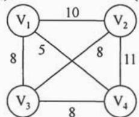
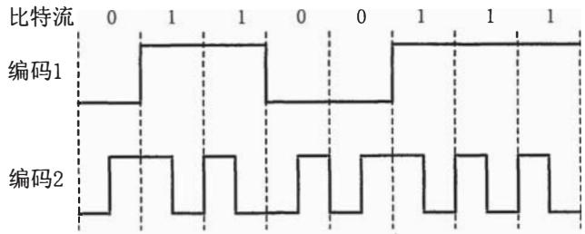
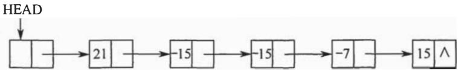
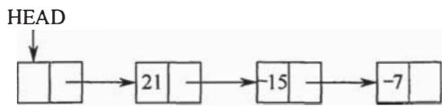
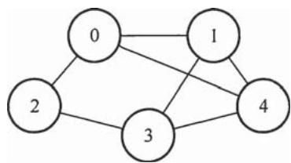
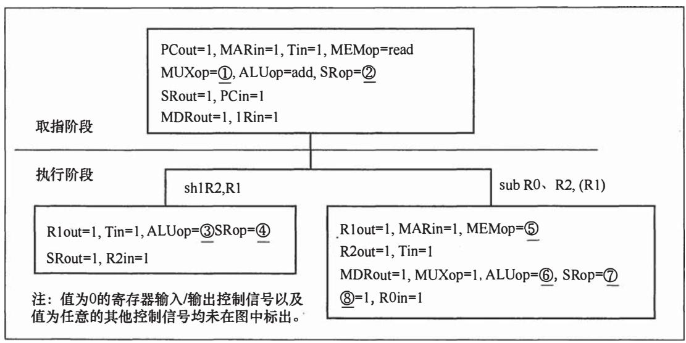
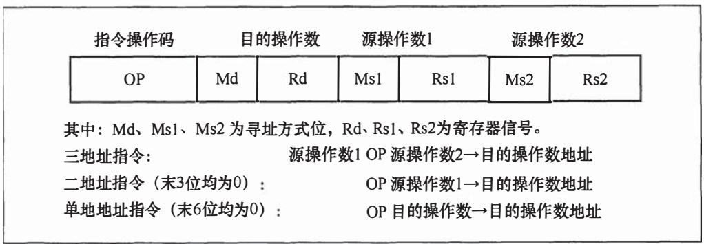
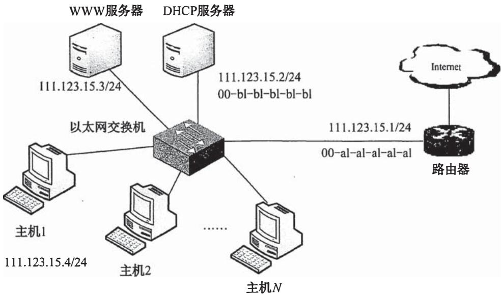

# 2015年全国硕士研究生入学统一考试

# 计算机科学与技术学科联考计算机学科专业基础综合试题

# 一、单项选择题（第 $1\sim 40$ 小题，每小题2分，共80分。下列每题给出的四个选项中，只有一个选项最符合试题要求）

1. 已知程序如下：

```c
int S(int n)  
{ return (n <= 0)?0:s(n-1)+n;}  
void main()  
{ cout << S(1);} 
```

程序运行时使用栈来保存调用过程的信息，自栈底到栈顶保存的信息依次对应的是

A. main()→S(1)→S(0)

B. $\mathrm{S}(0) \rightarrow \mathrm{S}(1) \rightarrow \mathrm{main}()$

C. main()→S(0)→S(1)

D. $\mathrm{S}(1) \rightarrow \mathrm{S}(0) \rightarrow \mathrm{main}()$

2. 先序序列为a,b,c,d的不同二叉树的个数是

A. 13

B. 14

C. 15

D. 16

3. 下列选项给出的是从根分别到达两个叶结点路径上的权值序列，能属于同一棵哈夫曼树的是

A. 24, 10, 5 和 24, 10, 7

B. 24, 10, 5 和 24, 12, 7

C. 24, 10, 10 和 24, 14, 11

D. 24, 10, 5 和 24, 14, 6

4. 现有一棵无重复关键字的平衡二叉树（AVL 树），对其进行中序遍历可得到一个降序序列。下列关于该平衡二叉树的叙述中，正确的是________。

A. 根结点的度一定为 2

B. 树中最小元素一定是叶结点

C. 最后插入的元素一定是叶结点

D. 树中最大元素一定是无左子树

5. 设有向图 $\mathrm{G} = (\mathrm{V}, \mathrm{E})$ ，顶点集 $\mathrm{V} = \{\mathrm{v}_0, \mathrm{v}_1, \mathrm{v}_2, \mathrm{v}_3\}$ ，边集 $\mathrm{E} = \{<\mathrm{v}_0, \mathrm{v}_1>, <\mathrm{v}_0, \mathrm{v}_2>, <\mathrm{v}_0, \mathrm{v}_3>, <\mathrm{v}_1, \mathrm{v}_3>\}$ 。若从顶点 $\mathrm{V}_0$ 开始对图进行深度优先遍历，则可能得到的不同遍历序列个数是

A. 2

B. 3

C. 4

D. 5

6. 求下面带权图的最小（代价）生成树时，可能是克鲁斯卡（Kruskal）算法第2次选中但不是普里姆（Prim）算法（从 $\mathrm{V}_4$ 开始）第2次选中的边是

A. $(\mathrm{V}_{1}, \mathrm{~V}_{3})$

B. $\left(\mathrm{V}_{1}, \mathrm{~V}_{4}\right)$

C. $\left(\mathrm{V}_{2}, \mathrm{~V}_{3}\right)$

D. $\left(\mathrm{V}_{3}, \mathrm{~V}_{4}\right)$



7. 下列选项中，不能构成折半查找中关键字比较序列的是

A. 500, 200, 450, 180

B. 500, 450, 200, 180

C. 180, 500, 200, 450

D. 180, 200, 500, 450

8. 已知字符串 S 为 “abaabaabacacaabaabcc”, 模式串 t 为 “abaabc”。采用 KMP 算法进行匹配, 第一次出现 “失配” (s[i] ≠ t[j]) 时, i = j = 5 , 下次开始匹配时, i 和 j 的值分别是_____。

A. $\mathrm{i} = 1, \mathrm{j} = 0$

B. $i = 5, j = 0$

C. $\mathrm{i} = 5, \mathrm{j} = 2$

D. $i = 6, j = 2$

9. 下列排序算法中，元素的移动次数与关键字的初始排列次序无关的是________。

A. 直接插入排序

B. 起泡排序

C. 基数排序

D. 快速排序

10．已知小根堆为8,15,10,21,34,16,12，删除关键字8之后需重建堆，在此过程中，关键字之间的比较次数是

A. 1

B. 2

C. 3

D. 4

11. 希尔排序的组内排序采用的是

A. 直接插入排序

B. 折半插入排序

C. 快速排序

D. 归并排序

12. 计算机硬件能够直接执行的是________。

I. 机器语言程序

II. 汇编语言程序

III. 硬件描述语言程序

A. 仅 I

B. 仅 I、II

C. 仅 I、III

D. I、II、III

13. 由3个“1”和5个“0”组成的8位二进制补码，能表示的最小整数是____。

A. -126

B. -125

C. -32

D. -3

14. 下列有关浮点数加减运算的叙述中，正确的是

I. 对阶操作不会引起阶码上溢或下溢

II. 右规和尾数舍入都可能引起阶码上溢

III. 左规时可能引起阶码下溢

IV. 尾数溢出时, 结果不一定溢出

A. 仅 II、III

B. 仅 I、II、IV

C. 仅 I、III、IV

D. I、II、III、IV

15. 假定主存地址为 32 位，按字节编址，主存和 Cache 之间采用直接映射方式，主存块大小为 4 个字，每字 32 位，采用回写（Write Back）方式，则能存放 4K 字数据的 Cache 的总容量的位数至少是 ______。

A. 146k

B. 147K

C. 148K

D. 158K

16. 假定编译器将赋值语句“ $x = x + 3$ ”转换为指令“add xaddr, 3”，其中 xaddr 是 $x$ 对应的存储单元地址。若执行该指令的计算机采用页式虚拟存储管理方式，并配有相应的 TLB，且 Cache 使用直写（Write Through）方式，则完成该指令功能需要访问主存的次数至少是 ________。

A. 0

B. 1

C. 2

D. 3

17. 下列存储器中，在工作期间需要周期性刷新的是________。

A. SRAM

B. SDRAM

C. ROM

D. FLASH

18. 某计算机使用 4 体交叉编址存储器，假定在存储器总线上出现的主存地址（十进制）序列为 8005, 8006, 8007, 8008, 8001, 8002, 8003, 8004, 8000，则可能发生访存冲突的地址对是____。

A. 8004 和 8008

B. 8002 和 8007

C. 8001 和 8008

D. 8000 和 8004

19. 下列有关总线定时的叙述中，错误的是

A. 异步通信方式中, 全互锁协议最慢

B. 异步通信方式中, 非互锁协议的可靠性最差  
C. 同步通信方式中, 同步时钟信号可由各设备提供  
D. 半同步通信方式中, 握手信号的采样由同步时钟控制

20. 若磁盘转速为 $7200\mathrm{rpm}$ ，平均寻道时间为 $8\mathrm{ms}$ ，每个磁道包含1000个扇区，则访问一个扇区的平均存取时间大约是

A. 8.1ms

B. $12.2 \mathrm{~ms}$

C. 16.3ms

D. $20.5 \mathrm{~ms}$

21. 在采用中断 I/O 方式控制打印输出的情况下，CPU 和打印控制接口中的 I/O 端口之间交换的信息不可能是________。

A. 打印字符

B. 主存地址

C. 设备状态

D. 控制命令

22. 内部异常（内中断）可分为故障（fault）、陷阱（trap）和终止（abort）三类。下列有关内部异常的叙述中，错误的是________。

A. 内部异常的产生与当前执行指令相关  
B. 内部异常的检测由 CPU 内部逻辑实现  
C. 内部异常的响应发生在指令执行过程中  
D. 内部异常处理后返回到发生异常的指令继续执行

23. 处理外部中断时，应该由操作系统保存的是________。

A. 程序计数器 (PC) 的内容

B. 通用寄存器的内容

C. 块表 (TLB) 中的内容

D. Cache 中的内容

24. 假定下列指令已装入指令寄存器，则执行时不可能导致 CPU 从用户态变为内核态（系统态）的是________。

A. DIV R0, R1 ; (R0)/(R1)→R0   
B. INT n ；产生软中断   
C. NOT R0 ; 寄存器 R0 的内容取非  
D. MOV R0, addr ; 把地址 addr 处的内存数据放入寄存器 R0 中

25. 下列选项中，会导致进程从执行态变为就绪态的事件是。

A. 执行 P.wait) 操作  
B. 申请内存失败   
C. 启动 I/O 设备  
D. 被高优先级进程抢占

26. 若系统 S1 采用死锁避免方法, S2 采用死锁检测方法。下列叙述中, 正确的是

I. S1 会限制用户申请资源的顺序，而 S2 不会  
II. S1 需要进程运行所需资源总量信息，而 S2 不需要  
III. S1 不会给可能导致死锁的进程分配资源，而 S2 会

A. 仅 I、II

B. 仅 II、III

C. 仅 I、III

D. I、II、III

27. 系统为某进程分配了 4 个页框，该进程已访问的页号序列为 2,0,2,9,3,4,2,8,2,4,8,4,5。若进程要访问的下一页的页号为 7，依据 LRU 算法，应淘汰页的页号是 ______。

A. 2

B. 3

C. 4

D. 8

28. 在系统内存中设置磁盘缓冲区的主要目的是

A. 减少磁盘 I/O 次数

B. 减少平均寻道时间

C. 提高磁盘数据可靠性

D. 实现设备无关性

29. 在文件的索引结点中存放直接索引指针 10 个，一级和二级索引指针各 1 个。磁盘块大小为 $1 \mathrm{KB}$ ，每个索引指针占 4 字节。若某文件的索引结点已在内存中，则把该文件偏移量（按

字节编址）为1234和307400处所在的磁盘块读入内存，需访问的磁盘块个数分别是____。

A. 1,2

B. 1,3

C. 2,3

D. 2,4

30. 在请求分页系统中，页面分配策略与页面置换策略不能组合使用的是________。

A. 可变分配, 全局置换

B. 可变分配, 局部置换

C. 固定分配, 全局置换

D. 固定分配, 局部置换

31. 文件系统用位图法表示磁盘空间的分配情况，位图存于磁盘的 $32 \sim 127$ 号块中，每个盘块占 1024 字节，盘块和块内字节均从 0 开始编号。假设要释放的盘块号为 409612，则位图中要修改的位所在的盘块号和块内字节序号分别是 ________。

A. 81、1

B. 81、2

C. 82、1

D. 82、2

32. 某硬盘有 200 个磁道（最外侧磁道号为 0），磁道访问请求序列为 130,42,180,15,199，当前磁头位于第 58 号磁道并从外侧向内侧移动。按照 SCAN 调度方法处理完上述请求后，磁头移过的磁道数是 ________。

A. 208

B. 287

C. 325

D. 382

33. 通过POP3协议接收邮件时，使用的传输层服务类型是

A. 无连接不可靠的数据传输服务

B. 无连接可靠的数据传输服务

C. 有连接不可靠的数据传输服务

D. 有连接可靠的数据传输服务

34. 使用两种编码方案对比特流 01100111 进行编码的结果如下图所示，编码 1 和编码 2 分别是 ______。



A. NRZ 和曼彻斯特编码

B. NRZ 和差分曼彻斯特编码

C. NRZI 和曼彻斯特编码

D. NRZI 和差分曼彻斯特编码

35. 主机甲通过 128kbps 卫星链路，采用滑动窗口协议向主机乙发送数据，链路单向传播延迟为 $250\mathrm{ms}$ ，帧长为 1000 字节。不考虑确认帧的开销，为使链路利用率不小于 $80\%$ ，帧序号的比特数至少是 ______。

A. 3

B. 4

C. 7

D. 8

36. 下列关于 CSMA/CD 协议的叙述中, 错误的是____。

A. 边发送数据帧，边检测是否发生冲突  
B. 适用于无线网络, 以实现无线链路共享  
C. 需要根据网络跨距和数据传输速率限定最小帧长  
D. 当信号传播延迟趋近 0 时, 信道利用率趋近 $100\%$

37. 下列关于交换机的叙述中, 正确的是

A. 以太网交换机本质上是一种多端口网桥  
B. 通过交换机互连的一组工作站构成一个冲突域  
C. 交换机每个端口所连网络构成一个独立的广播域  
D. 以太网交换机可实现采用不同网络层协议的网络互联

38. 某路由器的路由表如下表所示。

<table><tr><td>目的网络</td><td>下一跳</td><td>接 口</td></tr><tr><td>169.96.40.0/23</td><td>176.1.1.1</td><td>S1</td></tr><tr><td>169.96.40.0/25</td><td>176.2.2.2</td><td>S2</td></tr><tr><td>169.96.40.0/27</td><td>176.3.3.3</td><td>E3</td></tr><tr><td>0.0.0.0/0</td><td>176.4.4.4</td><td>E4</td></tr></table>

若路由器收到一个目的地址为169.96.40.5的IP分组，则转发该IP分组的接口是

A. S1

B. S2

C. S3

D. S4

39. 主机甲和主机乙新建一个 TCP 连接, 甲的拥塞控制初始阈值为 $32 \mathrm{KB}$ , 甲向乙始终以 $\mathrm{MSS} = 1 \mathrm{KB}$ 大小的段发送数据, 并一直有数据发送; 乙为该连接分配 $16 \mathrm{KB}$ 接收缓存, 并对每个数据段进行确认, 忽略段传输延迟。若乙收到的数据全部存入缓存, 不被取走, 则甲从连接建立成功时刻起, 未发送超时的情况下, 经过 4 个 RTT 后, 甲的发送窗口是

A. 1KB

B. 8KB

C. 16KB

D. 32KB

40. 某浏览器发出的 HTTP 请求报文如下：

GET /index.html HTTP/1.1

Host: www.test.edu.cn

Connection: Close

Cookie: 123456

下列叙述中，错误的是

A. 该浏览器请求浏览 index.html   
B. Index.html存放在www.test.edu.cn上  
C. 该浏览器请求使用持续连接  
D. 该浏览器曾经浏览过 www.test.edu.cn

# 二、综合应用题（第 $41\sim 47$ 小题，共70分）

41.（15分）用单链表保存 $m$ 个整数，结点的结构为[data][link]，且|data| $\leqslant n(n$ 为正整数）。现要求设计一个时间复杂度尽可能高效的算法，对于链表中 data 的绝对值相等的结点，仅保留第一次出现的结点而删除其余绝对值相等的结点。例如，若给定的单链表 HEAD 如下：



则删除结点后的 HEAD 为



要求：

1）给出算法的基本设计思想。  
(2) 使用 C 或 C++ 语言, 给出单链表结点的数据类型定义。  
3）根据设计思想，采用C或C++语言描述算法，关键之处给出注释。  
4）说明你所设计算法的时间复杂度和空间复杂度。  
42.（8分）已知含有5个顶点的图G如下图所示。



# 请回答下列问题：

1）写出图G的邻接矩阵 $A$ （行、列下标从0开始）。  
2）求 $A^2$ ，矩阵 $A^2$ 中位于0行3列元素值的含义是什么？  
3）若已知具有 $n$ （ $n \geqslant 2$ ）个顶点的图的邻接矩阵为 $B$ ，则 $B^{m}$ （ $2 \leqslant m \leqslant n$ ）中非零元素的含义是什么？  
43.（13分）某16位计算机的主存按字节编码，存取单位为16位；采用16位定长指令字格式；CPU采用单总线结构，主要部分如下图所示。图中 $\mathrm{R0}\sim \mathrm{R3}$ 为通用寄存器；T为暂存器；SR为移位寄存器，可实现直送（mov）、左移一位（left）和右移一位（right）3种操作，控制信号为SRop，SR的输出由信号SRout控制；ALU可实现直送A（mova）、A加B（add）、A减B（sub）、A与B（and）、A或B（or）、非A（not）和A加1（inc）7种操作，控制信号为ALUop。


# 请回答下列问题。

(1) 图中哪些寄存器是程序员可见的? 为何要设置暂存器 T?  
2）控制信号ALUop和SRop的位数至少各是多少？  
3）控制信号SRout所控制部件的名称或作用是什么？  
4）端点①～⑨中，哪些端点须连接到控制部件的输出端？  
5）为完善单总线数据通路，需要在端点①～⑨中相应的端点之间添加必要的连线。写出连线的起点和终点，以正确表示数据的流动方向。  
6）为什么二路选择器MUX的一个输入端是2？

44.（10分）题43中描述的计算机，其部分指令执行过程的控制信号如题44图a所示。

  
题44图a 部分指令控制信号

该机指令格式如题44图b所示，支持寄存器直接和寄存器间接两种寻址方式，寻址方式位分别为0和1，通用寄存器 $\mathrm{R0}\sim \mathrm{R3}$ 的编号分别为0、1、2和3。

  
题44图b 指令格式

请回答下列问题。

1）该机的指令系统最多可定义多少条指令？  
2）若inc、shl和sub指令的操作码分别为01H、02H和03H，则以下指令对应的机器代码各是什么？

```asm
inc R1 ; R1 + 1→R1  
sh1 R2,R1 ; (R1) << 1→R2  
sub R3, (R1), R2 ; ((R1)) - (R2) → R3 
```

3）假设寄存器X的输入和输出控制信号分别为Xin和Xout，其值为1表示有效，为0表示无效（如PCout $= 1$ 表示PC内容送总线)；存储器控制信号为MEMop，用于控制存储器的读（read)和写（write）操作写出题图a中标号 $① \sim ⑧$ 处的控制信号或控制信号的取值。  
4）指令“sub R1, R3, (R2)”和“inc R1”的执行阶段至少各需要多少个时钟周期？

45.（9分）有A、B两人通过信箱进行辩论，每个人都从自己的信箱中取得对方的问题。将答案和向对方提出的新问题组成一个邮件放入对方的邮箱中。假设A的信箱最多放 $M$ 个邮件，B的信箱最多放 $N$ 个邮件。初始时A的信箱中有 $x$ 个邮件 $(0 < x < M)$ ，B的信箱中有 $y$ 个 $(0 < y < N)$ 。辩论者每取出一个邮件，邮件数减1。A和B两人的操作过程描述如下：

# CoBegin

<table><tr><td>A{</td><td>B{</td></tr><tr><td>while (TRUE) {</td><td>while (TRUE) {</td></tr><tr><td>从A的信箱中取出一个邮件;</td><td>从B的信箱中取出一个邮件;</td></tr><tr><td>回答问题并提出一个新问题;</td><td>回答问题并提出一个新问题;</td></tr><tr><td>将新邮件放入B的信箱;</td><td>将新邮件放入A的信箱;</td></tr><tr><td>}</td><td>}</td></tr><tr><td>}</td><td>}</td></tr></table>

# CoEnd

当信箱不为空时，辩论者才能从信箱中取邮件，否则需要等待。当信箱不满时，辩论者才能将新邮件放入信箱，否则需要等待。请添加必要的信号量和 P、V（或 wait、signal）操作，以实现上述过程的同步。要求写出完整过程，并说明信号量的含义和初值。

46.（6分）某计算机系统按字节编址，采用二级页表的分页存储管理方式，虚拟地址格式如下所示：

<table><tr><td>10位</td><td>10位</td><td>12位</td></tr><tr><td>页目录号</td><td>页表索引</td><td>页内偏移量</td></tr></table>

请回答下列问题。

1）页和页框的大小各为多少字节？进程的虚拟地址空间大小为多少页？  
2）假定页目录项和页表项均占4字节，则进程的页目录和页表共占多少页？要求写出计算过程。  
3）若某指令周期内访问的虚拟地址为01000000H和01112048H，则进行地址转换时共访问多少个二级页表？要求说明理由。  
47.（9分）某网络拓扑如下图所示，其中路由器内网接口、DHCP服务器、WWW服务器与主机1均采用静态IP地址配置，相关地址信息见图中标注；主机2～主机 $N$ 通过DHCP服务器动态获取IP地址等配置信息。



请回答下列问题。

1）DHCP 服务器可为主机 $2 \sim$ 主机 $N$ 动态分配 IP 地址的最大范围是什么？主机 2 使用 DHCP 协议获取 IP 地址的过程中，发送的封装 DHCP Discover 报文的 IP 分组的源 IP 地址和目

的IP地址分别是什么？

2) 若主机 2 的 ARP 表为空, 则该主机访问 Internet 时, 发出的第一个以太网帧的目的 MAC 地址是什么? 封装主机 2 发往 Internet 的 IP 分组的以太网帧的目的 MAC 地址是什么?  
3）若主机1的子网掩码和默认网关分别配置为255.255.255.0和111.123.15.2，则该主机是否能访问WWW服务器？是否能访问Internet？请说明理由。