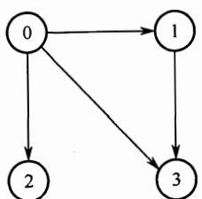
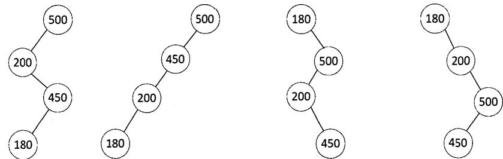

# 2015 年计算机学科专业基础综合试题参考答案

# 一、单项选择题

<table><tr><td>1.</td><td>A</td><td>2.</td><td>B</td><td>3.</td><td>D</td><td>4.</td><td>D</td><td>5.</td><td>D</td><td>6.</td><td>C</td><td>7.</td><td>A</td><td>8.</td><td>C</td></tr><tr><td>9.</td><td>C</td><td>10.</td><td>C</td><td>11.</td><td>A</td><td>12.</td><td>A</td><td>13.</td><td>B</td><td>14.</td><td>D</td><td>15.</td><td>C</td><td>16.</td><td>B</td></tr><tr><td>17.</td><td>B</td><td>18.</td><td>D</td><td>19.</td><td>C</td><td>20.</td><td>B</td><td>21.</td><td>B</td><td>22.</td><td>D</td><td>23.</td><td>B</td><td>24.</td><td>C</td></tr><tr><td>25.</td><td>D</td><td>26.</td><td>B</td><td>27.</td><td>A</td><td>28.</td><td>A</td><td>29.</td><td>B</td><td>30.</td><td>C</td><td>31.</td><td>C</td><td>32.</td><td>C</td></tr><tr><td>33.</td><td>D</td><td>34.</td><td>A</td><td>35.</td><td>B</td><td>36.</td><td>B</td><td>37.</td><td>A</td><td>38.</td><td>C</td><td>39.</td><td>A</td><td>40.</td><td>C</td></tr></table>

1. 解析：

递归调用函数时，在系统栈里保存的函数信息需满足先进后出的特点，依次调用了 main(),S(l), S(O), 故栈底到栈顶的信息依次是 main(), S(1), S(O)

2. 解析：

根据二叉树前序遍历和中序遍历的递归算法中递归工作栈的状态变化得出：前序序列和中序序列的关系相当于以前序序列为入栈次序，以中序序列为出栈次序。因为前序序列和中序序列可以唯一地确定一棵二叉树，所以题意相当千“以序列 a, b, c, 为入栈次序，则出栈序列的个数为多少“，对于 个不同元素进栈，出栈序列的个数为 $_ n$ $\frac { 1 } { n + 1 } C _ { 2 n } ^ { n } = 1 4$

3. 解析：

在哈夫曼树中，左右孩子权值之和为父结点权值。仅以分析选项 为例：若两个 10 分别属千两棵不同的子树，根的权值不等于其孩子的权值和，不符；若两个 属于同棵子树，其权值不等千其两个孩子（叶结点）的权值和，不符。 选项的排除方法一样。

4. 解析：

只有两个结点的平衡二叉树的根结点的度为 错误。中序遍历后可以得到一个降序序列，树中最大元素一定无左子树（可能有右子树），因此不一定是叶结点， 错误。最后插入的结点可能会导致平衡调整，而不一定是叶结点， 错误。

5. 解析：

画出该有向图图形如下。



采用图的深度优先遍历，共 种可能： <vo, VJ, V3, V2>, $\mathbf { < v _ { 0 } }$ V2, V3, V1>, <vo, V2, Vi, V3>, $< \mathbf { v } _ { 0 } , \mathbf { v } _ { 3 }$ ，V2, V1>, <vo, V3, V1, V2>, $\mathbf { v } _ { 2 } , \mathbf { v } _ { 1 } > , < \mathbf { v } _ { 0 } , \mathbf { v } _ { 3 } , \mathbf { v } _ { 1 } , \mathbf { v } _ { 2 } >$

6. 解析：

V4 开始， Kruskal 算法选中的第一条边一定是权值最小的(V1,V4), 错误。由于 V1 $\mathrm { V } _ { 4 }$ $\mathrm { ( V _ { 1 } , V _ { 4 } ) }$ $\mathbf { V } _ { 1 }$

已经可达 第二条边含有 V 和 V4 的权值为 8 的一定符合 Prim 算法， 排除 $\mathrm { V } _ { 4 }$ $\mathrm { V } _ { 1 }$ $\mathrm { V } _ { 4 }$ A、D。

# 7. 解析：

画出查找路径图，因为折半查找的判定树是一棵二叉排序树，看其是否满足二叉排序树的要求。



显然，选项A的查找路径不满足。

# 8. 解析：

由题中 “ 失配s[ i] :/; 玵］时， $\mathrm { i } = \mathrm { j } = 5 ^ { \prime \prime }$ , 可知题中的主串和模式串 的位序都是从0开始的（要注意灵活应变）。按照next数组生成算法，对于t有

<table><tr><td>编号</td><td>0</td><td>1</td><td>2</td><td>3</td><td>4</td><td>5</td></tr><tr><td>t</td><td>a</td><td>b</td><td>a</td><td>a</td><td>b</td><td>c</td></tr><tr><td>next</td><td>-1</td><td>0</td><td>0</td><td>1</td><td>1</td><td>2</td></tr></table>

依据KMP算法 ” 当失配时，不变，i j回退到next[j]的位置并重新比较”，当失配 ${ \mathsf { s } } [ \mathrm { i } ] \neq$ t[j]时， $\mathrm { i } = \mathrm { j } = 5$ , 由上表不难得出next $\mathsf { i } \rceil = \mathsf { n e x t } [ \mathsf { i }$ $=$ ] = 2 (位序从0开始）。从而最后结果应为 $\mathrm { i } = 5$ (i保持不变）， ${ \mathrm { j } } = 2$ 。

# 9. 解析：

基数排序的元素移动次数与关键字的初始排列次序无关，而其他三种排序都是与关键字的初始排列明显相关的。

# 10. 解析：

删除8后，将12 移动到堆顶，第一次是15和10比较，第二次是10和12比较并交换，第三次还需比较12和16, 故比较次数为3次。


# 11. 解析：

希尔排序的思想是： 先将待排元素序列分割成若干子序列（由相隔某个 “增量” 的元素组成），分别进行直接插入排序，然后依次缩减增量再进行排序，待整个序列中的元素基本有序（增量足够小）时，再对全体元素进行一次直接插入排序。

# 12. 解析：

硬件能直接执行的只能是机器语言（二进制编码），汇编语言是为了增强机器语言的可诙性和记忆性的语言，经过汇编后才能被执行。

# 13. 解析：

补码整数表示时，负数的符号位为I, 数值位按位取反，末位加I, 因此剩下的2个"I "

在最低位时，表示的是最小整数，为10000011, 转换成真值为-125。

# 14. 解析：

对阶是较小的阶码对齐至较 大的阶码，I正确。右规和尾数舍入过程，阶码加1而可能上溢，II正确， 同理III也正确。尾数溢出时可能仅产生误差，结果不一 定溢出，IV正确。

# 15 .. 解析：

直接映射的 地址结构如下

<table><tr><td>主存字块标记</td><td>Cache字块标记</td><td>字块内地址</td></tr></table>

按字节编址，块大小为 $4 { \times } 3 2 { \mathrm { b i t } } = 1 6 \mathbf { B } = 2 ^ { 4 } \mathbf { B }$ , 则 “字块内 地址” 占4位；“ 能存放4K字数据的Cache"即Cache的存储容量为4K字（注意单位），则Cache共有 $1 \mathrm { K } = 2 ^ { 1 0 }$ 个Cache行，Cache字块标记占10位；主存字块标记占 $3 2 - 1 0 - 4 = 1 8$ 位。

Cache的总容量包括：存储容量和标记阵列容量（有效位、 标记位、 一致性维护位和替换算法控制位)。标记阵列中的有效位和标记位是一定有的，而一致性维护位（脏位）和替换算法控制位的 取舍 标准是看题眼，题目中，明确说明了采用写回法，因此一 定包含一致性维护位，而关于替换算法的词眼题目中未提及，所以不予考虑。

从而每个Cache行 标记项包含 $1 8 + 1 + 1 = 2 0$ 位， 标记阵列容量为： $2 ^ { 1 0 } \times 2 0$ 位 $= 2 0 \mathrm { K }$ 位，存储容量为： $4 \mathrm { K } \times 3 2$ 位 $= 1 2 8 \mathrm { K }$ 位，则总容量为 $1 2 8 \mathrm { K } + 2 0 \mathrm { K } = 1 4 8 \mathrm { K }$ 位。

# 16. 解析：

行过程可划分为取数、 运算和写回过程， 取数时读取xa主存而直接访问Cache, 而 写直通方式需要把数据 同时 写入Cache和主存，因此至少访问 1次。

# 17. 解析：

DRAM使用电容 一段时间刷新一次，如果存储单元没有被刷新，存储的信息就会丢失。SDRAM表示同步动态随机存储器。

# 18. 解析：

每个访存地址对应的存储模块序号(0,I, 2, 3)如下所示。

<table><tr><td>访存地址</td><td>8005</td><td>8006</td><td>8007</td><td>8008</td><td>8001</td><td>8002</td><td>8003</td><td>8004</td><td>8000</td></tr><tr><td>模块序号</td><td>1</td><td>2</td><td>3</td><td>0</td><td>1</td><td>2</td><td>3</td><td>0</td><td>0</td></tr></table>

其中，模块序号 $=$ 访存地址％存储器交叉模块数。

生访存冲突的规则是：给定的访存地址在相邻的四次访问中出现在同 一 个存储知8004 8000对应的模块号都为o, 即同一模块内且在相邻的访问请求中，满足发生冲突的条件。

# 19. 解析：

在同步通信方式中，系统采用一 个统一的时钟信号，而不是由各设备提供，否则没法实现统一的时钟。

# 20. 解析：

存取时间 $=$ 寻道时间 $^ +$ 延迟时间 $^ +$ 传输时间。存取一 个扇区的平均延迟时间为旋转半周的时间，即为 $( 6 0 / 7 2 0 0 ) / 2 = 4 . 1 7 \mathrm { m s }$ , 传输时间为 $( 6 0 / 7 2 0 0 ) / 1 0 0 0 = 0 . 0 1 \mathrm { m s }$ , 因此访问 一 个扇区的平均存取时间为 $4 . 1 7 + 0 . 0 1 + 8 = 1 2 . 1 8 \mathrm { m s }$ , 保留一位小数则为 $1 2 . 2 \mathrm { m s }$ 。

# 21. 解析：

在程序中断I/0方式中，CPU和打印机直接交换，打印字符直接传输到打印机的 I/0端口，不会涉及主存地址，而CPU和打印机通过IVO端口中状态口和控制口来实现交互。

# 22. 解析：

内中断是指来自CPU和内存内部产生的中断,包括程序运算引起的各种错误，如地址非法、校验错、页面失效、非法指令、用户程序执行特权指令自行中断(INT)和除数为零等，以上中断都在指令的执行过程中产生的，故A正确。这种检测 异常的工作肯定是由CPU (包括控制器和运算器）实现的，故B正确。内中断不能被屏蔽，一旦出现应立即处理，C正确。对于D,考虑到特殊情况， 如除数为零和自行中断(INT) 都会自动跳过中断指令， 所以不会返回到发生异常的指令继续执行，故错误。

# 23. 解析：

外部中断处理过程，PC值由中断隐指令自动保存，而通用寄存器 内容由操作系统保存。

# 24. 解析：

考虑到部分指令可能出现异常（导致中断），从而转到核心态。指令A有除零 异常的可能，指令B 为中断指令，指令D有缺页异常的可能，指令C不会发生异常。

# 25. 解析：

(wait)操作表示P 进程请求某一资源，A、B和C都 因为请求某一资源会进入阻塞态，而D只是被剥夺了处理机资源，进入就绪态，一旦得到处理机即可运行。

# 26. 解析：

死锁的处理采用三种策略：死锁预防、死锁避免、死锁检测和解除。

死锁预防，采用破坏产生死锁的四个必要条件中的一个或几个，以防止发生死锁。其中之一的“破坏循环等待条件”，一般采用顺序资源分配法，首先给系统的资源编号，规定每个进程必须按编号递增的顺序请求资源，也就是限制了用户申请资源的顺序，故I的前半句属于死锁预防的范畴。

银行家算法是最著名的死锁避免算法，其中的最大需求矩阵M心”迁义了每 一个进程对m类资源的最大需求量，系统在执行安全性算法中都会检查此次资源试分配后，系统是否处于安全状态，若不安全则将本次的试探分配作废。

在死锁的检测和解除中，在系统为进程分配资源时不采取任何措施，但提供死锁的检测和解除的手段。故II、III正确。

# 27. 解析：

解法思路，也可以采用便捷法。对页号序列从后往前计数，直到数到4 (页框数）个不同的数字为止，这个停止的数字就是要淘汰的页号（最近最久未使用的页），题中为页号2。

# 28. 解析：

磁盘和内存的速度差异，决定了可以将内存经常访问的文件调入磁盘缓冲区，从高速缓存中复制的访问比磁盘IVO的机械操作要快很多。

# 29. 解析：

10个直接索引指针指向的数据块大小为 $1 0 { \times } 1 \mathrm { K B } = 1 0 \mathrm { K B }$

每个索引指针占4B, 则每个磁盘块可存放 $1 \mathrm { K B } / 4 \mathrm { B } = 2 5 6$ 个索引指针，一级索引指针指向的数据块大小为 $2 5 6 { \times } 1 \mathrm { K B } = 2 5 6 \mathrm { K B }$ , 二级索引指针指向的数据块大小为 $2 5 6 { \times } 2 5 6 { \times } 1 \mathrm { K B } = 2 ^ { 1 6 } \mathrm { K B } =$ 64MB。

按字节编址，偏移量为1234 时，因 $1 2 3 4 \mathrm { B } < 1 0 \mathrm { K B }$ , 则由直接索引指针可得到其所在的磁盘块地址。文件的索引结点已在内存中，则地址可直接得到，故仅需l次访盘即可。

偏移量为307400时，因 $1 0 \mathrm { K B } + 2 5 6 \mathrm { K B } < 3 0 7 4 0 0 \mathrm { B } < 6 4 \mathrm { M B }$ _, 可知该偏移量的内容在二级索

引指针所指向 的某个磁盘块中， 索引结点已在内存中， 故先访盘2次得到文件所在 的磁盘块地址，再访盘 1次即可读出内容， 故共需3次访盘。

# 30. 解析：

对各进程进行固定分配时页面数不变， 不可能出现全局置换。而A、B、D是现代操作系统中常见的3种策略。

# 31. 解析：

盘块号 $=$ 起始块号 $^ +$ L盘块号 $/ ( 1 0 2 4 { \times } 8 ) \big ] = 3 2 + \big \lfloor 4 0 9 6 1 2 / ( 1 0 2 4 { \times } 8 ) \big \rfloor = 3 2 + 5 0 = 8 2$ , 这里问的是块内字节号而不是位号， 因此还需要除以8(1字节 $\ c = \ 8$ 位）， 块内字节号 $=$ L(盘块号 $\%$ $( 1 0 2 4 \times 8 ) / 8 ] = 1$ 。

# 32. 解析：

SCAN算法就是电梯调度算法。顾名思义，如果开始时磁头向外移动就一直要到最外侧，然后再返回向内侧移动， 就像电梯若往下则一直要下到最底层需求才会再上升一样。当期磁头位于58号并从外侧向内侧移动，先依次访问 130和 199, 然后再返回向外侧移动，依次访问42和15, 故磁头移过的磁道数是： $( 1 9 9 - 5 8 ) + ( 1 9 9 - 1 5 ) = 3 2 5 .$ 。

# 33. 解析：

POP3建立在TCP连接上， 使用的是有连接可靠的数据传输服务。

# 34. 解析：

NRZ是最简单的串行编码技术， 用两个电压来代表两个二进制数，如高电平表示1, 低电平表示 o, 题中编码1符合。NRZI则是用电平的一次翻转来表示1, 与前一个NRZI 电平相同的电平表示0。曼彻斯特编码将一个码元分成两个相等的间隔，前一个间隔为低电平后 一个间隔为高电平表示l; 0 的表示正好相反， 题中编码2符合。

# 35. 解析：

不考虑确认帧的开销， 一个帧发送完后经过一个单程传播时延到达接收方， 再经过一个单程传播时延发送 方收到应答， 从而继续发送。要使得传输效率最大化，就是不用等确认也可以连续发送多个帧。设连续发送 $_ n$ 个帧，一个帧的发送时 延为 $1 0 0 0 \mathrm { B } / 1 2 8 \mathrm { k b p s } = 6 2 . 5 \mathrm { m s }$ 。对于采用滑动窗口协议的流水线机制，我们有如下公式：链路利用率 $\mathbf { \mu } = ( n \times$ 发送时延） /(RTT $^ +$ 发送时延）。

依题意， 有 $( n { \times } 6 2 . 5 \mathrm { m s } ) / ( 6 2 . 5 \mathrm { m s } + 2 5 0 \mathrm { m s } { \times } 2 ) { \geq } 8 0 \%$ , 得 $n { \geq } 7 . 2$ , 帧序号的比特数 $k$ 需要满足$2 ^ { k } \geqslant n + 1$ 。从而， 帧序号的比特数至少为4。

# 36. 解析：

CSM幻CD适用于有线网络， 而CSMA/CA则 广泛应用于无线局域网。其他选项关于CSMA/CD的描述都是正确的。

# 37. 解析：

从本质上说，交换机就是一个 多端口的网桥CA正确），工作在数据链路层（因此不能实现不同网络层协议的网络互联，D错误），交换机能经济地将网络分成小的冲突域CB错误）。广播域属千网络层概念，只有网络层设备（如路由器）才能分割广播域CC错误）。

# 38. 解析：

根据 “ 最长前缀匹配原则" 169.96.40.5与169.96.40.0前27 位匹配最长 ， 故选C。选项D为默认路由，只有当前面 的所有目的网络都不能和分组的目的IP地址匹配时才使用。

# 39. 解析：

发送窗口的上限值 $=$ min[接收窗口，拥塞窗口］。4个RTT后，乙收到的数据全部存入缓存，不被取走，接收窗口只剩下1KB $\ : 1 6 ^ { - 1 - 2 ^ { - } 4 ^ { - } 8 } = 1 \ :$ )缓存， 使得甲的 发送窗口为1KB。

40. 解析：

Connection: 连接方式， Close 表明为非持续连接方式， keep-alive 表示持续连接方式。 Cookie值是由服务器产生的，HTTP 请求报文中有 Cookie报头表示曾经访问过 www.test.edu.cn服务器。

# 二、 综合应用题

41. 解答：

1)算法的基本设计思想

算法的核心思想是用空间换时间。使用辅助数组记录链表中已出现的数值，从而只需对链表进行一趟扫描。

因为ldatal�n, 故辅助数组 q的大小为 $n + 1$ , 各元素的初值均为 0。依次扫描链表中的各结点， 同时检查 q[ldatal]的值， 如果为 o, 则保留该结点， 并令 q[jdatal] $= 1$ ; 否则，将该结点从链表中删除。

2) 使用 C 语言描述的单链表结点的数据类型定义

```txt
typedef struct node { int data; struct node \*link; }NODE; typedef NODE \*PNODE; 
```

3)算法实现

```c
void func (PNODE h,int n)  
{  
    PNODE p=h,r;  
    int *q,m;  
    q=(int *)malloc(sizeof(int)*(n+1)); //申请n+1个位置的辅助空间  
    for(int i=0;i<n+1;i++) //数组元素初值置0  
        *(q+i)=0;  
    while(p->link!=NULL)  
{  
        m=p->link->data>0? p->link->data:-p->link->data;  
        if(*(q+m)===0) //判断该结点的data是否已出现过  
{  
            *(q+m)=1; //首次出现  
        } else //重复出现  
{ r=p->link; //删除  
        free(r);  
}  
} 
```

【评分说明】若考生设计的算法满足题目的功能要求且正确， 则酌情给分。

4)参考答案所给算法的时间复杂度为 ${ \mathrm { O } } ( m )$ , 空间复杂度为 ${ \mathrm { O } } ( n )$ 。

【评分说明】若考生所估计的时间复杂度和空间复杂度与考生实现的算法一致， 可给分。

42. 解答：

1)图 G的邻接矩阵A 如下：

$$
A = \left[ \begin{array}{l l l l l} 0 & 1 & 1 & 0 & 1 \\ 1 & 0 & 0 & 1 & 1 \\ 1 & 0 & 0 & 1 & 0 \\ 0 & 1 & 1 & 0 & 1 \\ 1 & 1 & 0 & 1 & 0 \end{array} \right]
$$

2) $A ^ { 2 }$ 如下：

$$
A ^ {2} = \left[ \begin{array}{l l l l l} 3 & 1 & 0 & 3 & 1 \\ 1 & 3 & 2 & 1 & 2 \\ 0 & 2 & 2 & 0 & 2 \\ 3 & 1 & 0 & 3 & 1 \\ 1 & 2 & 2 & 1 & 3 \end{array} \right]
$$

0 行 3列的元素值 3 表示从顶点 0到顶点 3之间长度为 2 的路径共有3条。

3) $B ^ { m }$ $\quad 2 \leqslant m \leqslant n$ )中位于 $_ i$ 行 $j$ 列 $\ : ( 0 \leqslant i , j \leqslant n ^ { - 1 } ) \ :$ )的非零元素的含义是： 图中从顶点i到顶点 $j$ 长度为 $\pmb { m }$ 的路径条数。

# 4 . 解答：

1)程序员可见寄存器为通用寄存器 ${ \bf \tilde { \tau } } \cdot { \bf R 0 } \sim { \bf R } 3 $ 和PC。 因为采用了单总线结构， 因此， 若无暂存器 则 的 、 端口会同时获得两个相同的数据， 使数据通路不能正常工作。  
【评分说明】回答通用寄存器 ${ \tt R } 0 \sim { \tt R } 3 ;$ 给分；回答PC, 给分；部分正确，酌情给分。设置暂存器T的原因若回答用千暂时存放端口A的数据， 则给分；其他答案，酌情给分。  
共有7种操作，故其操作控制信号 至少需要 位；移位寄存器有 种操作，其操作控制信号 至少需要 位。  
信号 所控制的部件是一个三态门， 用于控制 移位器与总线之间数据通路的连接与断开。

【评分说明】只要回答出三态门或者控制连接I断开， 即给分。

4)端口 $\textcircled{1}$ 、 $\textcircled{2}$ 、 $\textcircled{3}$ 、 $\textcircled{5}$ 、 $\textcircled{8}$ 须连接到控制部件输出端。

【评分说明】答案包含 $\textcircled{4}$ 、 $\textcircled{6}$ 、 $\textcircled{7}$ 、 $\textcircled{9}$ 中任意一个， 不给分；答案不全酌情给分。

5) 连线 1, $\textcircled{6}  \textcircled{9}$ ; 连线 2, $\textcircled{7}  \textcircled{4}$

【评分说明】回答除上述连线以外的其他连线，酌情给分。

因为每条指令的长度为 位， 按字节编址， 所以每条指令占用 个内存单元， 顺序执行时， 下条指令地址为 $( \mathrm { P C } ) + 2$ 。 的一个输入端为 可便千执行 $( \mathrm { P C } ) + 2$ 操作。

# 44. 解答：

1)指令操作码有7位， 因此最多可定义 $2 ^ { 7 } = 1 2 8$ 条指令。

2)各条指令的机器代码分别如下：

$\textcircled{1}$ "inc Rl" 的机器码为 $0 0 0 0 0 0 1 0 0 1 0 0 0 0 0 0$ , 即 0240H。  
$\textcircled{2}$ "shl R2, Rl" 的机器码为 0000010 0 10 0 01 0 00, 即 0488H。  
$\textcircled{3}$ "sub R3, (Rl), $\tt R 2 ^ { \prime \prime }$ 的机器码为 0000011 0 11 1 01 0 10, 即 06EAH。

3)各标号处的控制信号或控制信号取值如下：

$\textcircled{1}$ 0; $\textcircled{2}$ mov; $\textcircled{3}$ mova; $\textcircled{4}$ left; $\textcircled{5}$ read; $\textcircled{6}$ sub; $\textcircled{7}$ mov; $\textcircled{8}$ Srout

【评分说明】答对两个给分。

4) 指令 "sub Rl, R3, (R2)" 的执行阶段至少包含 4个时钟周期；指令 "incRl" 的执行阶段至少包含2个时钟周期。

# 解答：

```txt
semaphore Empty_A = M-x; //Empty_A表示A的信箱中还可存放的邮件数量  
semaphore Full_B = y; //Full_B表示B的信箱中的邮件数量  
semaphore Empty_B = N-y; //Empty_B表示B的信箱中还可存放的邮件数量  
semaphore mutex_A = 1; //mutex_A用于A的信箱互斥  
semaphore mutex_B = 1; //mutex_B用于B的信箱互斥
```

# Cobegin

<table><tr><td>A{</td><td>B{</td></tr><tr><td>while (TRUE) {</td><td>while (TRUE) {</td></tr><tr><td>P(Full_A);</td><td>P(Full_B);</td></tr><tr><td>P(mutex_A);</td><td>P(mutex_B);</td></tr><tr><td>从A的信箱中取出一个邮件;</td><td>从B的信箱中取出一个邮件;</td></tr><tr><td>V(mutex_A);</td><td>V(mutex_B);</td></tr><tr><td>V(Empty_A);</td><td>V(Empty_B);</td></tr><tr><td>回答问题并提出一个新问题;</td><td>回答问题并提出一个新问题;</td></tr><tr><td>P(Empty_B);</td><td>P(Empty_A);</td></tr><tr><td>P(mutex_B);</td><td>P(mutex_A);</td></tr><tr><td>将新邮件放入B的信箱;</td><td>将新邮件放入A的信箱;</td></tr><tr><td>V(mutex_B);</td><td>V(mutex_A);</td></tr><tr><td>V(Full_B);</td><td>V(Full_A);</td></tr><tr><td>}</td><td>}</td></tr><tr><td>}</td><td>}</td></tr></table>

# 【评分说明】

1)每对信号量的定义及初值正确， 给分。  
2)每个互斥信号量的P、 V操作使用正确， 各给分。  
3)每个同步信号量的P、 V操作使用正确， 各给分。  
4)其他答案酌情给分。

# 46. 解答：

1)在分页存储管理方式中， 将用户程序的地址空间分为 若干固定大小的区域， 称为 “页 ”或 “页面”。 相应地， 将内存空间分为若干物理块或页框(frame),页和页框大小相同。 因此，页和页框大小均为 $2 ^ { 1 2 } \mathrm { B } = 4 \mathrm { K B }$ 。 进程的虚拟地址空间大小为 $2 ^ { 3 2 } / 2 ^ { 1 2 } = 2 ^ { 2 0 }$ 页。  
2) $( 2 ^ { 1 0 } { \times } 4 ) / 2 ^ { 1 2 }$ (页 目录所占页数） $+ ( 2 ^ { 2 0 } { \times } 4 ) / 2 ^ { 1 2 }$ (页表所占页数） $= 1 0 2 5$ 页。  
3)需要访问一个二级页表。 因为虚拟地址0100 OOOOH和0111 2048H的最高10位的值都是4,页 目录号相同，访问的是同一个二级页表。

【评分说明】用其他方法计算， 思路和结果正确同样给分。

# 47. 解答：

1) DHCP服务器可为主机 $_ { 2 \sim }$ 主机 $N$ 动态分配IP 地址的最大范围是： 111.123.15.5�111.123.15.254; 主机2发送的封装DHCPDiscover报文的IP分组的源IP地址和目的IP地址分别是0.0.0.0 和255.255.255.255。  
2)主机2发出的第一个以太网帧的目的MAC地址是ff-ff-ff-ff-ff-ff; 封装主机2发往Internet的IP分组的以太网帧的目的MAC地址是00-al-al-al-al-al。  
3)主机l能访问WWW服务器，但不能访问Internet。 由于主机 1 的子网掩码配置正确而默认网关IP地址被错误地配置为111.123.15.2 C正确IP地址是111.123.15.1),所以主机l 可 以访问在同一个子网内的WWW服务器，但当主机l访问Internet时， 主机l发出的IP分组会被路由到错误的默认网关C111.123.15.2), 从而无法到达目的主机。