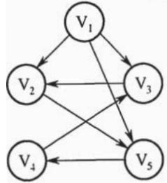
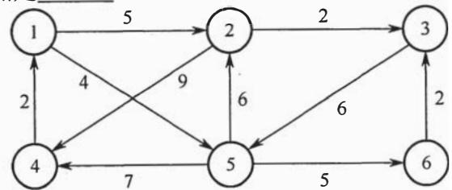
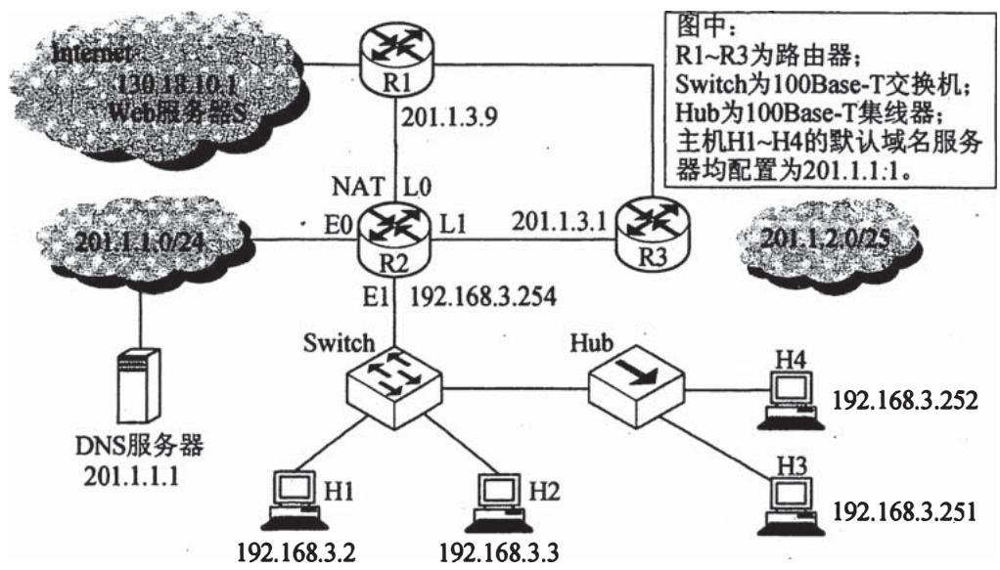
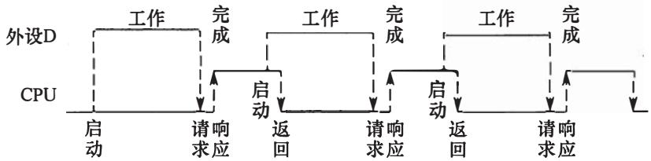

# 2016年全国硕士研究生入学统一考试

# 计算机科学与技术学科联考计算机学科专业基础综合试题

# 一、单项选择题（第 $1\sim 40$ 小题，每小题2分，共80分。下列每题给出的四个选项中，只有一个选项最符合试题要求）

1. 已知表头元素为 c 的单链表在内存中的存储状态如下表所示。

<table><tr><td>地址</td><td>元素</td><td>链接地址</td></tr><tr><td>1000H</td><td>a</td><td>1010H</td></tr><tr><td>1004H</td><td>b</td><td>100CH</td></tr><tr><td>1008H</td><td>c</td><td>1000H</td></tr><tr><td>100CH</td><td>d</td><td>NULL</td></tr><tr><td>1010H</td><td>e</td><td>1004H</td></tr><tr><td>1014H</td><td></td><td></td></tr></table>

现将f存放于1014H处并插入到单链表中，若f在逻辑上位于a和e之间，则a,e,f的“链接地址”依次是

A. ${1010}\mathrm{H},{1014}\mathrm{H},{1004}\mathrm{H}$

B. $1010\mathrm{H}, 1004\mathrm{H}, 1014\mathrm{H}$

C. $1014\mathrm{H}, 1010\mathrm{H}, 1004\mathrm{H}$

D. $1014 \mathrm{H}, 1004 \mathrm{H}, 1010 \mathrm{H}$

2. 已知一个带有表头结点的双向循环链表 L，结点结构为 prev data next，其中，prev 和 next 分别是指向其直接前驱和直接后继结点的指针。现要删除指针 p 所指的结点，正确的语句序列是

A. $p->next->prev = p->prev; p->prev->next = p->prev; free(p);$   
B. p->next->prev = p->next; p->prev->next = p->next; free(p);   
C. p->next->prev = p->next; p->prev->next = p->prev; free(p);   
D. p->next->prev = p->prev; p->prev->next = p->next; free(p);

3. 设有下图所示的火车车轨，入口到出口之间有 $n$ 条轨道，列车的行进方向均为从左至右，列车可驶入任意一条轨道。现有编号为 $1 \sim 9$ 的9列列车，驶入的次序依次是8,4,2,5,3,9,1,6,7。若期望驶出的次序依次为 $1 \sim 9$ ，则 $n$ 至少是

A. 2

B. 3

C. 4

D. 5

4. 有一个100阶的三对角矩阵 $M$ ，其元素 $m_{i,j}$ （ $1 \leqslant i \leqslant 100, 1 \leqslant j \leqslant 100$ ）按行优先依次压缩

存入下标从0开始的一维数组 $N$ 中。元素 $m_{30,30}$ 在 $N$ 中的下标是

A. 86

B. 87

C. 88

D. 89

5. 若森林F有15条边、25个结点，则F包含树的个数是

A. 8

B. 9

C. 10

D. 11

6. 下列选项中, 不是下图深度优先搜索序列的是

A. $\mathrm{V}_{1}, \mathrm{~V}_{5}, \mathrm{~V}_{4}, \mathrm{~V}_{3}, \mathrm{~V}_{2}$

B. $\mathrm{V}_{1}, \mathrm{~V}_{3}, \mathrm{~V}_{2}, \mathrm{~V}_{5}, \mathrm{~V}_{4}$

C. $\mathrm{V}_{1}, \mathrm{~V}_{2}, \mathrm{~V}_{5}, \mathrm{~V}_{4}, \mathrm{~V}_{3}$

D. $\mathrm{V}_{1}, \mathrm{~V}_{2}, \mathrm{~V}_{3}, \mathrm{~V}_{4}, \mathrm{~V}_{5}$

7. 若将 $n$ 个顶点 $e$ 条弧的有向图采用邻接表存储, 则拓扑排序算法的时间复杂度是

A. $\mathrm{O}\left( n\right)$

B. $\mathrm{O}\left( {n + e}\right)$

C. $\mathrm{O}\left( {n}^{2}\right)$

D. $O(n e)$

8. 使用迪杰斯特拉（Dijkstra）算法求下图中从顶点 1 到其他各顶点的最短路径，依次得到的各最短路径的目标顶点是________。

A. 5,2,3,4,6

B. 5,2,3,6,4

C. 5,2,4,3,6

D. 5,2,6,3,4

9. 在有 $n$ ( $n > 1000$ ) 个元素的升序数组 A 中查找关键字 x。查找算法的伪代码如下所示。

k=0;

while $(k < n$ 且 $A[k] < x)$ $k = k + 3$ ;

if $(\mathbf{k} <   \mathbf{n}$ 且 $\mathrm{A}[k] == x)$ 查找成功；

else if $(k - 1 < n$ 且 $A[k - 1] == x)$ 查找成功；

else if $(k - 2 < n$ 且 $A[k - 2] == x$ ）查找成功；

else 查找失败;

本算法与折半查找算法相比，有可能具有更少比较次数的情形是

A. 当 $\mathbf{x}$ 不在数组中

B. 当 $\mathbf{x}$ 接近数组开头处

C. 当 $\mathrm{x}$ 接近数组结尾处

D. 当 $\mathrm{x}$ 位于数组中间位置

10. B+树不同于B树的特点之一是

A. 能支持顺序查找

B. 结点中含有关键字

C. 根结点至少有两个分支

D. 所有叶结点都在同一层上

11. 对 10TB 的数据文件进行排序，应使用的方法是____。

A. 希尔排序

B. 堆排序

C. 快速排序

D. 归并排序

12. 将高级语言源程序转换为机器级目标代码文件的程序是____。

A. 汇编程序

B. 链接程序

C. 编译程序

D. 解释程序

13. 有如下 C 语言程序段

short si = -32767;

unsigned short usi = si;

执行上述两条语句后，usi的值为

A. -32767

B. 32767

C. 32768

D. 32769

14. 某计算机字长为 32 位，按字节编址，采用小端（Little Endian）方式存放数据。假定有一个 double 型变量，其机器数表示为 1122334455667788H，存放在 00008040H 开始的连续存储单元中，则存储单元 00008046H 中存放的是________。

A. ${22}\mathrm{H}$

B. 33H

C. ${77}\mathrm{H}$

D. 66H

15. 有如下C语言程序段：

$$
\begin{array}{r l} \text {f o r (k = 0 ; k <   1 0 0 0 ; k + +)} \\ \mathrm {a [ k ] = a [ k ] + 3 2 ;} \end{array}
$$

若数组a及变量k均为int型，int型数据占4B，数据Cache采用直接映射方式，数据区大小为1KB、块大小为16B，该程序段执行前Cache为空，则该程序段执行过程中访问数组a的Cache缺失率约为

A. $1.25\%$

B. $2.5\%$

C. $12.5\%$

D. $25\%$

16. 某存储器容量为 64KB，按字节编址，地址 $4000\mathrm{H} \sim 5\mathrm{FFFH}$ 位 ROM 区，其余为 RAM 区。若采用 $8\mathrm{K} \times 4$ 位的 SRAM 芯片进行设计，则需要该芯片的数量是 ________。

A. 7

B. 8

C. 14

D. 16

17. 某指令格式如下所示。

<table><tr><td>OP</td><td>M</td><td>I</td><td>D</td></tr></table>

其中M为寻址方式，I为变址寄存器编号，D为形式地址。若采用先变址后间址的寻址方式，则操作数的有效地址是

A. $\mathrm{I} + \mathrm{D}$

B. (I) + D

C. $(\mathrm{I}) + \mathrm{D}$

D. $(\mathrm{(I)}) + \mathrm{D}$

18. 某计算机主存空间为 4GB，字长为 32 位，按字节编址，采用 32 位字长指令字格式。若指令按字边界对齐存放，则程序计数器（PC）和指令寄存器（IR）的位数至少分别是 ______。

A. 30、30

B. 30、32

C. 32、30

D. 32、32

19. 在无转发机制的五段基本流水线（取指、译码/读寄存器、运算、访写回寄存器）中，下列指令序列存在数据冒险的指令对是

I1: add

R1, R2, R3;

$(R2) + (R3)\rightarrow R1$

I2: add

R5,R2,R4;

R2) + (R4)→R5

I3: add

R4, R5, R3;

$(R5) + (R3)\rightarrow R4$

I4: add

R5,R2,R6;

$(R2) + (R6)\rightarrow R5$

A. I1 和 I2

B. I2 和 I3

C. I2 和 I4

D. I3 和 I4

20. 单周期处理器中所有指令的指令周期为一个时钟周期。下列关于单周期处理器的叙述中，错误的是________。

A. 可以采用单总线结构数据通路

B. 处理器时钟频率较低

C. 在指令执行过程中控制信号不变

D. 每条指令的CPI为1

21．下列关于总线设计的叙述中，错误的是

A. 并行总线传输比串行总线传输速度快  
B. 采用信号线复用技术可减少信号线数量  
C. 采用突发传输方式可提高总线数据传输率  
D. 采用分离事务通信方式可提高总线利用率  
22. 异常是指令执行过程中在处理器内部发生的特殊事件，中断是来自处理器外部的请求

事件。下列关于中断或异常情况的叙述中，错误的是

A. “访存时缺页”属于中断   
B. “整数除以 0 ” 属于异常   
C. “DMA 传送结束” 属于中断   
D. “存储保护错”属于异常

23. 下列关于批处理系统的叙述中，正确的是

I. 批处理系统允许多个用户与计算机直接交互  
II. 批处理系统分为单道批处理系统和多道批处理系统  
III. 中断技术使得多道批处理系统和 I/O 设备可与 CPU 并行工作

A. 仅 II、III

B. 仅 II

C. 仅 I、II

D. 仅 I、III

24. 某单CPU系统中有输入和输出设备各1台，现有3个并发执行的作业，每个作业的输入、计算和输出时间均分别为 $2\mathrm{ms}$ 、 $3\mathrm{ms}$ 和 $4\mathrm{ms}$ ，且都按输入、计算和输出的顺序执行，则执行完3个作业需要的时间最少是 ______。

A. 15ms

B. $17 \mathrm{~ms}$

C. $22 \mathrm{~ms}$

D. $27 \mathrm{~ms}$

25. 系统中有 3 个不同的临界资源 $\mathbf{R}_1, \mathbf{R}_2$ 和 $\mathbf{R}_3$ ，被 4 个进程 $\mathfrak{p}_1, \mathfrak{p}_2, \mathfrak{p}_3$ 及 $\mathfrak{p}_4$ 共享。各进程对资源的需求为： $\mathfrak{p}_1$ 申请 $\mathbf{R}_1$ 和 $\mathbf{R}_2$ ， $\mathfrak{p}_2$ 申请 $\mathbf{R}_2$ 和 $\mathbf{R}_3$ ， $\mathfrak{p}_3$ 申请 $\mathbf{R}_1$ 和 $\mathbf{R}_3$ ， $\mathfrak{p}_4$ 申请 $\mathbf{R}_2$ 。若系统出现死锁，则处于死锁状态的进程数至少是

A. 1

B. 2

C. 3

D. 4

26. 某系统采用改进型 CLOCK 置换算法, 页表项中字段 A 为访问位, M 为修改位。A = 0 表示页最近没有被访问, A = 1 表示页最近被访问过。M = 0 表示页没有被修改过, M = 1 表示页被修改过。按 (A, M) 所有可能的取值, 将页分为四类: $(0, 0), (1, 0), (0, 1)$ 和 $(1, 1)$ , 则该算法淘汰页的次序为

A. $(0,0),(0,1),(1,0),(1,1)$   
B. $(0, 0), (1, 0), (0, 1), (1, 1)$   
C. $(0,0),(0,1),(1,1),(1,0)$   
D. $(0,0),(1,1),(0,1),(1,0)$

27. 使用TSL（Test and Set Lock）指令实现进程互斥的伪代码如下所示。

do{ while(TSL(&lock)); critical section; lock $\equiv$ FALSE; }whileTRUE);

下列与该实现机制相关的叙述中，正确的是________。

A. 退出临界区的进程负责唤醒阻塞态进程  
B. 等待进入临界区的进程不会主动放弃 CPU   
C. 上述伪代码满足 “让权等待” 的同步准则  
D. while(TSL(&lock))语句应在关中断状态下执行

28. 某进程的段表内容如下所示。

<table><tr><td rowspan="4">段号012</td><td>段长</td><td>内存起始地址</td><td>权限</td><td>状态</td></tr><tr><td>100</td><td>6000</td><td>只读</td><td>在内存</td></tr><tr><td>200</td><td>...</td><td>读写</td><td>不在内存</td></tr><tr><td>300</td><td>4000</td><td>读写</td><td>在内存</td></tr></table>

当访问段号为2、段内地址为400的逻辑地址时，进行地址转换的结果是________。

A. 段缺失异常   
B. 得到内存地址 4400  
C. 越权异常  
D. 越界异常

29. 某进程访问页面的序列如下所示。

$$
\frac {\cdots , 1 , 3 , 4 , 5 , 6 , 0 , 3 , 2 , 3 , 2 , \uparrow 0 , 4 , 0 , 3 , 2 , 9 , 2 , 1 , \cdots}{t}
$$

若工作集的窗口大小为6，则在 $t$ 时刻的工作集为

A. $\{6,0,3,2\}$

B. $\{2,3,0,4\}$

C. $\{0, 4, 3, 2, 9\}$

D. $\{4, 5, 6, 0, 3, 2\}$

30. 进程 $\mathrm{P}_{1}$ 和 $\mathrm{P}_{2}$ 均包含并发执行的线程，部分伪代码描述如下所示。

<table><tr><td>//进程P1
int x=0;
Thread1()
{
    int a;
    a=1; x += 1;
} 
Thread2()
{
    int a;
    a=2; x += 2;
}</td><td>//进程P2
int x=0;
Thread3()
{
    int a;
    a=x; x += 3;
} 
Thread4()
{
    int b;
    b=x; x += 4;
}</td></tr></table>

下列选项中，需要互斥执行的操作是

A. $a = 1$ 与 $a = 2$

B. $a = x$ 与 $b = x$

C. $x += 1$ 与 $x += 2$

D. $x += 1$ 与 $x += 3$

31. 下列关于SPOOLing技术的叙述中，错误的是

A. 需要外存的支持  
B. 需要多道程序设计技术的支持  
C. 可以让多个作业共享一台独占设备  
D. 由用户作业控制设备与输入/输出井之间的数据传送

32. 下列关于管程的叙述中, 错误的是

A. 管程只能用于实现进程的互斥  
#   
B. 管程是由编程语言支持的进程同步机制  
C. 任何时候只能有一个进程在管程中执行  
D. 管程中定义的变量只能被管程内的过程访问

# 题 $33\sim 41$ 均依据题 $33\sim 41$ 图回答。

33. 在 OSI 参考模型中，R1、Switch、Hub 实现的最高功能层分别是

A. 2、2、1

B. 2、2、2

C. 3、2、1

D. 3、2、2

34. 若连接 R2 和 R3 链路的频率带宽为 $8\mathrm{kHz}$ , 信噪比为 $30\mathrm{dB}$ , 该链路实际数据传输速率约为理论最大数据传输速率的 $50\%$ , 则该链路的实际数据传输速率约是

A. 8kbps

B. 20kbps

C. 40kbps

D. 80kbps

  
题 $33\sim 41$ 图

35. 若主机 H2 向主机 H4 发送 1 个数据帧，主机 H4 向主机 H2 立即发送一个确认帧，则除 H4 外，从物理层上能够收到该确认帧的主机还有________。

A. 仅 H2

B. 仅 H3

C. 仅 H1、H2

D. 仅 H2、H3

36. 若 Hub 再生比特流过程中, 会产生 $1.535 \mu \mathrm{s}$ 延时, 信号传播速度为 $200 \mathrm{~m} / \mu \mathrm{s}$ , 不考虑以太网帧的前导码, 则 H3 与 H4 之间理论上可以相距的最远距离是

A. $200 \mathrm{~m}$

B. $205 \mathrm{~m}$

C. $359 \mathrm{~m}$

D. $512 \mathrm{~m}$

37. 假设 R1、R2、R3 采用 RIP 协议交换路由信息，且均已收敛。若 R3 检测到网络 201.1.2.0/25 不可达，并向 R2 通告一次新的距离向量，则 R2 更新后，其到达该网络的距离是____。

A. 2

B. 3

C. 16

D. 17

38. 假设连接 R1、R2 和 R3 之间的点对点链路使用 201.1.3.x/30 地址，当 H3 访问 Web 服务器 S 时，R2 转发出去的封装 HTTP 请求报文的 IP 分组的源 IP 地址和目的 IP 地址分别是____。

A. 192.168.3.251, 130.18.10.1

B. 192.168.3.251, 201.1.3.9

C. 201.1.3.8, 130.18.10.1

D. 201.1.3.10, 130.18.10.1

39. 若 H1 与 H2 的默认网关和子网掩码均分别配置为 192.168.3.1 和 255.255.255.128，H3 和 H4 的默认网关和子网掩码均分别配置为 192.168.3.254 和 255.255.255.128，则下列现象中可能发生的是

A. H1 不能与 H2 进行正常 IP 通信

B. H2 与 H4 均不能访问 Internet

C. H1 不能与 H3 进行正常 IP 通信

D. H3 不能与 H4 进行正常 IP 通信

40. 假设所有域名服务器均采用迭代查询方式进行域名解析。当 H4 访问规范域名为 www.abc.xyz.com 的网站时，域名服务器 201.1.1.1 在完成该域名解析过程中，可能发出 DNS 查询的最少和最多次数分别是 ______。

A. 0,3

B. 1,3

C. 0,4

D. 1,4

# 二、综合应用题（第 $41\sim 47$ 小题，共70分）

41. 假设题 $33 \sim 41$ 图中的 H3 访问 Web 服务器 S 时，S 为新建的 TCP 连接分配了 $20\mathrm{KB}$ （ $K = 1024$ ）的接收缓存，最大段长 $\mathrm{MSS} = 1\mathrm{KB}$ ，平均往返时间 $\mathrm{RTT} = 200\mathrm{ms}$ 。H3 建立连接时的初始序号为 100，且持续以 MSS 大小的段向 S 发送数据，拥塞窗口初始阈值为 $32\mathrm{KB}$ ；S 对收到的每个段进行确认，并通告新的接收窗口。假定 TCP 连接建立完成后，S 端的 TCP 接收缓存仅有数据存入而无数据取出。请回答下列问题。

（1）在TCP连接建立过程中，H3收到的S发送过来的第二次握手TCP段的SYN和ACK标志位的值分别是多少？确认序号是多少？  
(2) H3 收到的第 8 个确认段所通告的接收窗口是多少？此时 H3 的拥塞窗口变为多少？H3 的发送窗口变为多少？  
（3）当H3的发送窗口等于0时，下一个待发送的数据段序号是多少？H3从发送第1个数据段到发送窗口等于0时刻为止，平均数据传输速率是多少（忽略段的传输延时）？  
（4）若H3与S之间通信已经结束，在 $t$ 时刻H3请求断开该连接，则从 $t$ 时刻起，S释放该连接的最短时间是多少？

42. 如果一棵非空 $k (k \geqslant 2)$ 叉树 $T$ 中每个非叶结点都有 $k$ 个孩子，则称 $T$ 为正则 $k$ 叉树。请回答下列问题并给出推导过程。

(1) 若 $\mathrm{T}$ 有 $m$ 个非叶结点, 则 $\mathrm{T}$ 中的叶结点有多少个?  
(2) 若 $\mathrm{T}$ 的高度为 $h$ (单结点的树 $h = 1$ ), 则 $\mathrm{T}$ 的结点数最多为多少个? 最少为多少个?

43. 已知由 $n$ （ $n \geqslant 2$ ）个正整数构成的集合 $A = \{a_{k} | 0 \leqslant k < n\}$ ，将其划分为两个不相交的子集 $A_{1}$ 和 $A_{2}$ ，元素个数分别是 $n_{1}$ 和 $n_{2}$ ， $A_{1}$ 和 $A_{2}$ 中元素之和分别为 $S_{1}$ 和 $S_{2}$ 。设计一个尽可能高效的划分算法，满足 $|n_{1} - n_{2}|$ 最小且 $|S_{1} - S_{2}|$ 最大。要求：

(1) 给出算法的基本设计思想。  
(2) 根据设计思想, 采用 C 或 $\mathrm{C}++$ 语言描述算法, 关键之处给出注释。  
(3) 说明你所设计算法的平均时间复杂度和空间复杂度。

44. 假定CPU主频为 $50\mathrm{MHz}$ ，CPI为4。设备D采用异步串行通信方式向主机传送7位ASCII字符，通信规程中有1位奇校验位和1位停止位，从D接收启动命令到字符送入I/O端口需要 $0.5\mathrm{ms}$ 。请回答下列问题，要求说明理由。

（1）每传送一个字符，在异步串行通信线上共需传输多少位？在设备D持续工作过程中，每秒钟最多可向I/O端口送入多少个字符？  
(2) 设备 D 采用中断方式进行输入/输出, 示意图如下。

I/O端口每收到一个字符申请一次中断，中断响应需10个时钟周期，中断服务程序共有20条指令，其中第15条指令启动D工作。若CPU需从D读取1000个字符，则完成这一任务所需时间大约是多少个时钟周期？CPU用于完成这一任务的时间大约是多少个时钟周期？在中断响应阶段CPU进行了哪些操作？

45. 某计算机采用页式虚拟存储管理方式，按字节编址，虚拟地址为 32 位，物理地址为 24 位，页大小为 8KB；TLB 采用全相联映射；Cache 数据区大小为 64KB，按 2 路组相联方式

组织，主存块大小为64B。存储访问过程的示意图如下。

请回答下列问题。

（1）图中字段 $\mathrm{A}\sim \mathrm{G}$ 的位数各是多少？TLB标记字段B中存放的是什么信息？  
（2）将块号为4099的主存块装入到Cache中时，所映射的Cache组号是多少？对应的H字段内容是什么？  
(3) Cache 缺失处理的时间开销大还是缺页处理的时间开销大? 为什么?  
（4）为什么 Cache 可以采用直写（Write Through）策略，而修改页面内容时总是采用回写（Write Back）策略。  
46. 某进程调度程序采用基于优先数（priority）的调度策略，即选择优先数最小的进程运行，进程创建时由用户指定一个 nice 作为静态优先数。为了动态调整优先数，引入运行时间 cpuTime 和等待时间 waitTime，初值均为 0。进程处于执行态时，cpuTime 定时加 1，且 waitTime 置 0；进程处于就绪态时，cpuTime 置 0，waitTime 定时加 1。请回答下列问题。  
（1）若调度程序只将nice的值作为进程的优先数，即priority = nice，则可能会出现饥饿现象，为什么？  
（2）使用nice、cpuTime和waitTime设计一种动态优先数计算方法，以避免产生饥饿现象，并说明waitTime的作用。  
47. 某磁盘文件系统使用链接分配方式组织文件，簇大小为 4KB。目录文件的每个目录项包括文件名和文件的第一个簇号，其他簇号存放在文件分配表 FAT 中。  
（1）假定目录树如下图所示，各文件占用的簇号及顺序如下表所示，其中dir、dir1是目录，file1、file2是用户文件。请给出所有目录文件的内容。

<table><tr><td>文件名</td><td>簇号</td></tr><tr><td>dir</td><td>1</td></tr><tr><td>dir1</td><td>48</td></tr><tr><td>file1</td><td>100、106、108</td></tr><tr><td>file2</td><td>200、201、202</td></tr></table>

(2) 若 FAT 的每个表项仅存放簇号, 占 2 字节, 则 FAT 的最大长度为多少字节? 该文件系统支持的文件长度最大是多少?  
（3）系统通过目录文件和FAT实现对文件的按名存取，说明file1的106、108两个簇号分别存放在FAT的哪个表项中。  
（4）假设仅FAT和dir目录文件已读入内存，若需将文件dir/dir1/file的第5000个字节读入内存，则要访问哪几个簇？