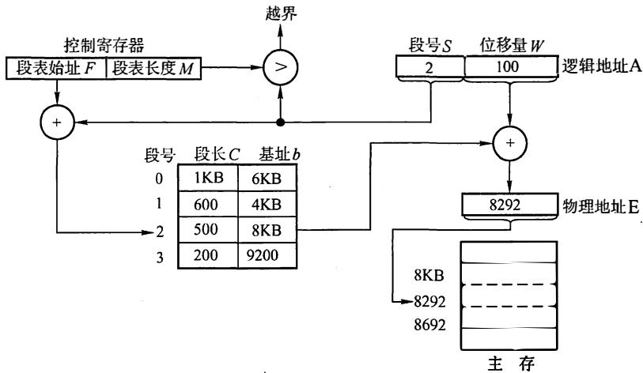

# 2016 年计算机学科专业基础综合试题参考答案

# 一、单项选择题

<table><tr><td>1.</td><td>D</td><td>2.</td><td>D</td><td>3.</td><td>C</td><td>4.</td><td>B</td><td>5.</td><td>C</td><td>6.</td><td>D</td><td>7.</td><td>B</td><td>8.</td><td>B</td></tr><tr><td>9.</td><td>B</td><td>10.</td><td>A</td><td>11.</td><td>D</td><td>12.</td><td>C</td><td>13.</td><td>D</td><td>14.</td><td>A</td><td>15.</td><td>C</td><td>16.</td><td>C</td></tr><tr><td>17.</td><td>C</td><td>18.</td><td>B</td><td>19.</td><td>B</td><td>20.</td><td>A</td><td>21.</td><td>A</td><td>22.</td><td>A</td><td>23.</td><td>A</td><td>24.</td><td>B</td></tr><tr><td>25.</td><td>C</td><td>26.</td><td>A</td><td>27.</td><td>B</td><td>28.</td><td>D</td><td>29.</td><td>A</td><td>30.</td><td>C</td><td>31.</td><td>D</td><td>32.</td><td>A</td></tr><tr><td>33.</td><td>C</td><td>34.</td><td>C</td><td>35.</td><td>D</td><td>36.</td><td>B</td><td>37.</td><td>B</td><td>38.</td><td>D</td><td>39.</td><td>C</td><td>40.</td><td>C</td></tr></table>

I. 解析：

根据存储状态，单链表的结构如下图所示。


其中“链接地址”是指结点 所指的内存地址。当结点 插入后， 指向 指向 指向。显然 的“链接地址”分别是 的内存地址，即

2. 解析：

此类题的解题思路万变不离其宗，无论是链表的插入还是删除都必须保证不断链。

3. 解析：

在确保队列先进先出原则的前提下。根据题意具体分析：入队顺序为 2, 5, 3, 9, 1, 6, 7,出队顺序为 。入口和出口之间有多个队列 条轨道），且每个队列（轨道）可容纳多个元 $1 { \sim } 9$ 素（多列列车）。如此分析：显然先入队的元素必须小千后入队的元素（如果 入同一队列，在前 在后，那么出队时只能是 在前 在后），这样 入队列 入队列 入队列 5入队列 (按照前面的原则“大的元素在小的元素后面”也可以将 入队列 但这时剩下的元就必须放到一个新的队列里面，无法确保”至少“，本应该是将 入队列 再将 入队列3, 不增加新队列的情况下，可以满足题意“至少”的要求）， 入队列 入队列 这时共占了 个队列，后面还有元素 直接再占用一个新的队列 从队列 出队后，剩下的元素或者入队到队列 或者入队到队列 3(为简单起见我们不妨设 个队列的序号分别为 2, …, $_ n$ n), 这样就可以满足题目的要求。综上，共占用了 个队列。当然还有其他的入队出队的情况，请考生们自己推演。但要确保满足： 队列中后面的元素大千前面的元素；＠确保占用最少（即 $\textcircled{1}$ $\textcircled{2}$ 满足题目中的“至少")的队列。

4. 解析：

三对角矩阵如下图所示。

$$
\left[ \begin{array}{c c c c c c} a _ {1, 1} & a _ {1, 2} & & & & \\ a _ {2, 1} & a _ {2, 2} & a _ {2, 3} & & 0 & \\ & a _ {3, 2} & a _ {3, 3} & a _ {3, 4} & & \\ & & \ddots & \ddots & \ddots & \\ & 0 & & a _ {n - 1, n - 2} & a _ {n - 1, n - 1} & a _ {n - 1, n} \\ & & & & a _ {n, n - 1} & a _ {n, n} \end{array} \right]
$$

采用压缩存储，将3条对角线上的元素按行优先方式存放在一维数组B中，且 $a _ { 1 , 1 }$ 存放于B[O]中，其存储形式如下所示：

<table><tr><td>a1,1</td><td>a1,2</td><td>a2,1</td><td>a2,2</td><td>a2,3</td><td>···</td><td>an-1,n</td><td>an,n-1</td><td>an,n</td></tr></table>

可以计算矩阵 $\pmb { A }$ 中3条对角线上的元素 $a _ { i , j }$ $( 1 \leqslant i , j \leqslant n , | i - j | \leqslant 1 )$ 在一维数组B中存放的下标为 $k = 2 i + j - 3$ 。

解法一：针对该题，仅需将数字逐一代入公式里面即可： $k = 2 { \times } 3 0 + 3 0 { - } 3 = 8 7$ , 结果为 87。

解法二：观察上图的三对角矩阵不难发现， 第一行有两个元素，剩下的在元素 ${ \bf \mathcal { m } } _ { 3 0 , 3 0 }$ 所在行之前的28行（注意下标 $1 \leqslant i \leqslant 1 0 0$ 、 $1 \leqslant j \leqslant 1 0 0 .$ ) 中每行都有3个元素，而 $m _ { 3 0 , 3 0 }$ 之前仅有一个元素 $m _ { 3 0 , 2 9 }$ , 那么不难发现元素 $m _ { 3 0 , 3 0 }$ 在数组 $N$ 中的下标是： $2 + 2 8 { \times } 3 + 2 { - } 1 = 8 7 .$ 。

【注意】矩阵和数组的下标是从 0或1 开始的（如矩阵可能从 $a _ { 0 , 0 }$ 或 $a _ { 1 , 1 }$ 开始，数组可能从B[O]或B[l]开始），这时就需要适时调整计算方法（这个方法无非是针对上面提到的公式 $k = 2 { \times } i +$ $j - 3$ 多计算1或少计算1的问题）。

# 5. 解析：

解法一：树有一个很重要的性质：在 $_ n$ 个结点的树中有 $n - 1$ 条边，“那么对千每棵树，其结点数比边数多1"。题中的森林中的结点数比边数多10 (即 $2 5 - 1 5 = 1 0 ,$ ), 显然共有10棵树。

解法二： 若考生再仔细分析可发现，此题也是考察图的某些方面的性质：生成树和生成森林。此时对于图的生成树有一个重要的性质：若图中顶点数为 $_ n$ ，则它的生成树含有 $n - 1$ 条边。对比解法一中树的性质，不难发现两种解法都利用到了“树中结点数比边数多1”的性质，接下来的分析如解法一。

# 6. 解析：

对于本题，只需按深度优先遍历的策略进行遍历即可。对千选项A: 先访问 $\mathbf { V } _ { 1 }$ , 然后访问与 $\mathrm { v } _ { 1 }$ 邻接且未被访问的任一顶点（满足的有 $\mathrm { V } _ { 2 }$ 、 $\mathrm { V } _ { 3 }$ 和 $\mathrm { v } _ { s }$ ), 此时访问 $\mathrm { v } _ { s }$ , 然后从 $\mathrm { v } _ { s }$ 出发，访问与 ${ \bf V } _ { 5 }$ 邻接且未被访问的任一顶点（满足的只有 $\mathrm { V } _ { 4 }$ )，然后从 $\mathrm { V } _ { 4 }$ 出发，访问与 $\mathrm { V } _ { 4 }$ 邻接且未被访问的任一顶点（满足的只有 $\mathrm { V } _ { 3 }$ 立然后从 $\mathrm { V } _ { 3 }$ 出发，访问与 $\mathrm { V } _ { 3 }$ 邻接且未被访问的任一顶点（满足的只有 $\mathrm { V } _ { 2 }$ ), 结束遍历。选项B和C的分析方法与选项A相同，不再赘述。对千选项D, 首先访问 $\mathbf { V } _ { 1 }$ , 然后从 $\mathbf { V } _ { 1 }$ 出发，访问与 $\mathrm { V } _ { 1 }$ 邻接且未被访问的任一顶点（满足的有 $\mathrm { V } _ { 2 }$ 、 $\mathrm { V } _ { 3 }$ 和 $\mathrm { v } _ { s }$ ),然后从 $\mathrm { V } _ { 2 }$ 出发，访问与 $\mathbf { V } _ { 2 }$ 邻接且未被访问的任一顶点（满足的只有 $\mathrm { v } _ { s }$ ), 按规则本应该访问$\mathrm { v } _ { s }$ , 但选项D却访问 $\mathrm { V } _ { 3 }$ , 因此D错误。

# 7. 解析：

根据拓扑排序的规则，输出每个顶点的同时还要删除以它为起点的边，这样对各顶点和边都要进行遍历，故拓扑排序的时间复杂度为 ${ \mathrm { O } } ( n + e )$ 。

# 8. 解析：

根据Dijkstra算法， 从顶点1到其余各顶点的最短路径如下表所示。

<table><tr><td>顶点</td><td>第1趟</td><td>第2趟</td><td>第3趟</td><td>第4趟</td><td>第5趟</td></tr><tr><td>2</td><td>5v1→v2</td><td>5v1→v2</td><td></td><td></td><td></td></tr><tr><td>3</td><td>∞</td><td>∞</td><td>7v1→v2→v3</td><td></td><td></td></tr><tr><td>4</td><td>∞</td><td>11v1→v5→v4</td><td>11v1→v5→v4</td><td>11v1→v5→v4</td><td>11v1→v5→v4</td></tr><tr><td>5</td><td>4v1→v5</td><td></td><td></td><td></td><td></td></tr><tr><td>6</td><td>∞</td><td>9v1→v5→v6</td><td>9v1→v5→v6</td><td>9v1→v5→v6</td><td></td></tr><tr><td>集合S</td><td>{1,5}</td><td>{1,5,2}</td><td>{1,5,2,3}</td><td>{1,5,2,3,6}</td><td>{1,5,2,3,6,4}</td></tr></table>

# 9. 解析：

此题为送分题。该程序采用跳跃式的顺利查找法查找升序数组中的 $\mathbf { x }$ , 显然是 $\mathbf { x }$ 越靠前，比较次数才会越少。

# 10. 解析：

由于 $\mathbf { B } +$ 树的所有叶结点中包含了全部的关键字信息，且叶结点本身依关键字从小到大顺序链接， 可以进行顺序查找， 而B树不支持顺序查找（只支持多路查找）。

# 11. 解析：

外部排序指待排序文件较大， 内存一次性放不下， 需存放在外部介质中。外部排序通常采用归并排序法。选项A、 B、C都是内部排序的方法。

# 12. 解析：

翻译程序是指把高级语言源程序转换成机器语言程序（目标代码）的软件。翻译程序有两种： 一种是编译程序，它将高级语言源程序一次全部翻译成目标程序， 每次执行程序时， 只要执行目标程序， 因此， 只要源程序不变， 就无须重新编译。 另一种是解释程序，它将源程序的一条语旬翻译成对应的机器目标代码， 并立即执行， 然后翻译下一条源程序语句并执行， 直至所有源程序语句全部被翻译并执行完。所以解释程序的执行过程是翻译一句执行一句， 并 且不会生成目标程序。汇编程序也是一种语言翻译程序，它把汇编语言源程序翻译为机器语言程序。汇编语言是一种面向机器的低级语言， 是机器语言的符号表示，与机器语言一一对应。

# 13. 解析：

结合题干及选项可知，short为16位。 因C语言中的数据在内存中为补码表示形式，si对应的补码二进制表示为： 1000 0000 0000 0001B, 最前面的一位 "1" 为符号位， 表示负数， 即-32767。 由signed型转化为等长unsigned型数据时， 符号位成为数据的一部分， 也就是说，负数转化为无符号数（即正数），其数值将发生变化。Usi对应的补码二进制表示与si的表示相同，但表示正数， 为32769。

# 14. 解析：

大端方式： 一个字中的高位字节(Byte)存放在内存中这个字区域的低地址处。小端方式：一个字中的低位字节(Byte)存放在内存中这个字区域的低地址处。依此分析， 各字节的存储分配如下表所示。

<table><tr><td>地址</td><td>0000 8040H</td><td>0000 8041H</td><td>0000 8042H</td><td>0000 8043H</td></tr><tr><td>内容</td><td>88H</td><td>77H</td><td>66H</td><td>55H</td></tr><tr><td>地址</td><td>0000 8044H</td><td>0000 8045H</td><td>0000 8046H</td><td>0000 8047H</td></tr><tr><td>内容</td><td>44H</td><td>33H</td><td>22H</td><td>11H</td></tr></table>

从而存储单元0000 8 04 6H 中存放的是22H。

# 15. 解析：

分析语旬 ${ } ^ { \left\{ \epsilon \right\} } \mathbf { a } [ \mathbf { k } ] = \mathbf { a } [ \mathbf { k } ] + 3 2 ^ { \prime \prime }$ : 首先读取a[k]需要访问一次 a[k], 之后将结果赋值给a[k]需要访问一次，共访问两次。第一次访问a[k]未命中，并将该字所在的主存块调入Cache对应的块中，对于该主存块中的4个整数的两次访问中只在访问第一次的第一个元素时发生缺失，其他的 7次访问中全部命中，故该程序段执行过程中访问数组a的Cache缺失率约为1/8(即 $1 2 . 5 \%$ )。

# 16. 解析：

SFFF- $4 0 0 0 + 1 = 2 0 0 0 \mathrm { H }$ 即ROM区容量为 $2 ^ { 1 3 } \mathrm { { B } = 8 \ K B \left( 2 0 0 0 \mathrm { { H } = 2 } { \times } 1 6 ^ { 3 } = 2 ^ { 1 3 } \right) }$ , RAM区容量为56KB(64KB-8KB = 56KB), 则需要 $8 ~ \mathrm { \bf K } \times \mathrm { \bf \Omega }$ 4位的SRAM芯片的数量为14(56KB/8Kx4位 $= 1 4$ )。

# 17. 解析：

变址寻址中，有效地址EA等于指令字中的形式地址 $\mathbf { D }$ 与变址寄存器I的内容相加之和，即 $\mathbf { E A } = ( \mathbf { I } \mathbf { \partial } ) + \mathbf { D }$ 。间接寻址是相对于直接寻址而言的，指令的地址字段给出的形式地址不是操作数的真正地址，而是操作数地址的地址，即 $\mathbf { E A } = ( \mathbf { D } )$ 。从而该 操作数的有效地址是 $( ( \mathrm { I } ) \mathrm { + } \mathrm { D } )$ 。

# 18. 解析：

程序计数器(PC)给出下一条指令字的访存地址（指令在内存中的地址），取决于存储器的字数( $( 4 { \mathrm { ~ G B } } / 3 2 { \mathrm { b i t } } = 2 ^ { 3 0 } . { \mathrm { \Omega } }$ ), 故程序计数器(PC) 的位数至少是30位；指令寄存器CIR)用于接收取得的指令，取决于指令字长( 32位），故指令寄存器CIR) 的位数至少为 32位。

# 19. 解析：

数据冒险，即数据相关， 指在一个程序中存在必须等前一条指令执行完才能执行后一令的情况，则这两条指令即为数据相关。当多条指令重叠处理时就会发生冲突。首先这两条指令发生写后读 相关，并且两条指令在流水线中执行情况（发生数据冒险）如下表所示。

<table><tr><td>时钟指令</td><td>1</td><td>2</td><td>3</td><td>4</td><td>5</td><td>6</td><td>7</td></tr><tr><td>I2</td><td>取指</td><td>译码/读寄存器</td><td>运算</td><td>访存</td><td>写回</td><td></td><td></td></tr><tr><td>I3</td><td></td><td>取指</td><td>译码/读寄存器</td><td>运算</td><td>访存</td><td>写回</td><td></td></tr></table>

指令12在时钟5 时将结果写入寄存器(R5), 但指令13在时钟 3时读寄存器(R5)。本来指令 12应先写入R5, 指令13后读 R5, 结果变成指令13先读R5, 指令12后写入R5, 因而发生数据冲突。

# 20. 解析：

单周期处理器即指所有指令的指令周期为一个时钟周期，D正确。因为每条指令的CPI为I,要考虑比较慢的指令，所以处理器的时钟频率较低，B正确。单总线结构将 CPU、主存、1/0设备都挂在一组总线上，允许1/0设备之间、1 /0设备与主存之间直接交换信息，但多个部件只能争用唯一的总线，且不支持并发传送操作。单周期处理器并不是可以采用单总线结构数据通路，故 A错误。控制信号即指PC 中的内容，PC用来存放当前欲执行指令的地址， 可以自动

$+ 1$ 以形成下一条指令的地址。在指令执行过程中控制信号不变化。

# 21. 解析：

初看可能会觉得A正确，并行总线传输通常比串行总线传输速度快，但这不是绝对的。在频率比较低的情况下，并行总线因为可以同时传输若干比特，速率确实比串行总线快。并行导线之间的相互干扰越来越严重，当时钟频率提高到一定程度时，传输的数据已经无法恢复。而串行总线因为导线少，线间干扰容易控制，反而可以通过不断提高时钟频率来提高传输速率，A错误。总线复用是指一种信号线在不同的时间传输不同的信息。可以使用较少的线路传输更多的信息，从而节省了空间和成本。故B正确。 突发（猝发）传输是在一个总线周期中，可以传输多个存储地址连续的数据，即一次传输一个地址和一批地址连续的数据，C正确。分离事务通信即总线复用的一种，相比单一的传输线路可以提高总线的利用率，D正确。

# 22. 解析：

中断是指来自CPU执行指令以外事件的发生，如设备发出的1/0结束中断，表示设备输入／输出处理已经完成，希望处理机能够向设备发出下一个输入/输出请求，同时让完成输入/输出后的程序继续运行。时钟中断，表示一个固定的时间片已到，让处理机处理计时、启动定时运行的任务等。这一类中断通常是与当前程序运行无关的事件，即它们与当前处理机运行的程序无关。 异常也称内中断、例外或陷入(Trap), 指源自CPU执行指令内部的事件，如程序的非法操作码、地址越界、算术溢出、虚存系统的缺页以及专门的陷入指令等引起的事件。A错误。

# 23. 解析：

批处理系统中，作业执行时用户无法干预其运行，只能通过事先编制作业控制说明书来间接干预，缺少交互能力，也因此才发展出分时系统，I错误。批处理系统按发展历程又分为单道批处理系统、多道批处理系统，II正确。多道程序设计技术允许同时把多个程序放入内存，并允许它们交替在CPU中运行，它们共享系统中的各种硬、软件资源，当一道程序因1/0请求而暂停运行时，CPU便立即转去运行另一道程序，即多道批处理系统的1/0设备可与CPU并行工作，这都是借助于中断技术实现的，III正确。

# 24. 解析：

这类调度题目最好画图。因CPU、输入设备、输出设备都只有一个，因此各操作步骤不能重叠，画出运行时的甘特图后就能清楚地看到不同作业间的时序关系，如下表所示。

<table><tr><td>作业\时间</td><td>1</td><td>2</td><td>3</td><td>4</td><td>5</td><td>6</td><td>7</td><td>8</td><td>9</td><td>10</td><td>11</td><td>12</td><td>13</td><td>14</td><td>15</td><td>16</td><td>17</td></tr><tr><td>1</td><td colspan="2">输入</td><td colspan="3">计算</td><td colspan="4">输出</td><td></td><td></td><td></td><td></td><td></td><td></td><td></td><td></td></tr><tr><td>2</td><td></td><td></td><td colspan="2">输入</td><td></td><td colspan="3">计算</td><td></td><td colspan="4">输出</td><td></td><td></td><td></td><td></td></tr><tr><td>3</td><td></td><td></td><td></td><td></td><td>输入</td><td></td><td></td><td></td><td colspan="3">计算</td><td></td><td></td><td colspan="4">输出</td></tr></table>

# 25. 解析：

对于本题，先满足一个进程的资源需求，再看其他进程是否能出现死锁状态。因为 ${ \tt p } _ { 4 }$ 只申请一个资源，当将 ${ \bf R } _ { 2 }$ 分配给 ${ \tt p } _ { 4 }$ 后， ${ \tt p } _ { 4 }$ 执行完后将 ${ \tt R } _ { 2 }$ 释放，这时使得系统满足死锁的条件是 $\mathtt { R } _ { 1 }$ 分配给 ${ \mathfrak { p } } _ { 1 }$ • ${ \tt R } _ { 2 }$ 分配给 ${ \tt p } _ { 2 }$ • ${ \tt R } _ { 3 }$ 分配给 ${ \tt p } _ { 3 }$ (或者 ${ \bf R } _ { 2 }$ 分配给 ${ \mathfrak { p } } _ { 1 }$ • ${ \tt R } _ { 3 }$ 分配给 ${ \tt p } _ { 2 }$ • $\mathtt { R } _ { 1 }$ 分配给 $\mathsf { p } _ { 3 }$ )。穷举其他情况如 ${ \mathfrak { p } } _ { 1 }$ 申请的资源 $\mathtt { R } _ { 1 }$ 和 ${ \tt R } _ { 2 }$ , 先都分配给pl, 运行完并释放占有的资源后，可以分别将$\mathtt { R } _ { 1 }$ 、 ${ \tt R } _ { 2 }$ 和 ${ \tt R } _ { 3 }$ 分配给 $p _ { 3 } , \ p _ { 4 }$ 和 ${ \tt p } _ { 2 }$ • 也满足系统死锁的条件。各种情况需要使得处于死锁状态的进程数至少为3。

# 26. 解析：

改进型的CLOCK置换算法执行的步骤如下：

1)从指针的当前位置开始， 扫描帧缓冲区。在这次扫描过程中， 对使用位不做任何修改。选择遇到的第一个帧 $\mathbf { A } = 0$ ${ \bf M } = 0$ 用于替换。  
如果第 步失败， 则重新扫描， 查找 $\mathbf { A } = 0$ ， $\mathbf { M } = 1 \mathbf { \Psi } .$ )的帧。选择遇到的第一个这样的帧用于替换。在这个扫描过程中， 对每个跳过的帧， 把它的使用位设置成0。  
如果第 步失败， 指针将回到它的最初位置，并且集合中所有帧的使用位均为 。 重复第 步，并且如果有必要， 重复第 步。这样将可以找到供替换的帧。

从而， 该算法淘汰页的次序为 $( 0 , 0 ) , ( 0 , 1 ) , ( 1 , 0 ) , ( 1 , 1 )$ , 即 A 正确。

# 27. 解析：

当进程退出临界区时置lock FALSE, 会负责唤醒处于就绪状态的进程，A错误。若等待进入临界区的进程会一直停留在执行while(TSL(&lock))的循环中，不会主动放弃 正确。让权等待， 即当进程不能进入临界区时， 应立即释放处理器， 防止进程忙等待。通过B选项的分析中发现上述伪代码并不满足 “让权等待” 的同步准则，C错误。 若while(TSL(&lock))在关中断状态下执行，当TSL(&lock)一直为true时，不再开中断，则系统可能会因此终止，D错误。

# 28. 解析：

分段系统的逻辑地址A到物理地址E之间的地址变换过程如下。



$\textcircled{1}$ 从逻辑地址A中取出前儿位为段号 s, 后几位为段内偏移量 w, 注意段式存储管理的题目中， 逻辑地址一般以二进制给出， 而在页式存储管理中， 逻辑地址一般以十进制给出， 各位读者要具体问题具体分析。  
$\textcircled{2}$ 比较段号S和段表长度 $M ,$ 若 $s { \geqslant } M ,$ 则产生越界异常， 否则继续执行。  
$\textcircled{3}$ 段表中段号S对应的段表项地址 $=$ 段表起始地址 $F +$ 段号 $s \times$ 段表项长度，取出该段表项的前儿位得到段长C。若段内偏移量 $\geqslant C$ , 则产生越界异常，否则继续执行。从这句话我们可以看出， 段表项实际上只有两部分， 前几位是段长， 后几位是起始地址。  
$\textcircled{4}$ 取出段表项中该段的起始地址 $^ { b }$ 计算 $E = b + \mathcal { W }$ 用得到的物理地址 $E$ 去访问内存。

题目中段号为 的段长为 小于段内地址为 故发生越界异常，D正确。

# 29. 解析：

在任一时刻t, 都存在一个集合， 它包含所有最近 $k$ 次（该题窗口大小为 内存访问所访问过的页面。这个集合 $w ( k , t )$ 就是工作集。该题中最近6次访问的页面分别为6,0, 3, 2, 3, 2, 再去除重复的页面， 形成的工作集为{6,0, 3, 2}。

# 解析：

${ \bf P } _ { 1 }$ 中对 进行赋值，并不影响最终的结果，故 $\mathsf { a } = 1$ 与 $\mathtt { a } = 2$ 不需要互斥执行； ${ \bf { a } } = { \bf { x } }$ 与 $\boldsymbol { \mathsf { b } } = \boldsymbol { \mathsf { x } }$

执行先后不影响a与b的结果，无须互斥执行； $\mathbf { x } + = 1$ 与 $\mathbf { x } + = 2$ 执行先后会影响 $\mathbf { x }$ 的结果,需要互斥执行； $\mathbf { P } _ { 1 }$ 中的 $\mathbf { x }$ 和 ${ \bf P } _ { 2 }$ 中的 $\mathbf { x }$ 是不同范围中的 $\mathbf { x }$ ，互不影响，不需要互斥执行。

# 解析：

SPOOLing是利用专门的外围控制机，将低速I/O设备上的数据传送到高速磁盘上，或者相反。SPOOLing 的意思是外部设备同时联机操作，又称为假脱机输入/输出操作，是操作系统中采用的一项将独占设备改造成共享设备的技术。高速磁盘即外存，A正确。SPOOLing技术需要进行输入/输出操作，单道批处理系统无法满足，B 正确。SPOOLing 技术实现了将独占设备改造成共享设备的技术，C正确。设备与输入/输出井之间数据的传送是由系统实现的，D错误。

# 解析：

管程是由一组数据以及定义在这组数据之上的对这组数据的操作组成的软件模块，这组操作能初始化并改变管程中的数据和同步进程。管程不仅能实现进程间的互斥，而且能实现进程间的同步，故A错误、B正确。管程具有特性： $\textcircled{1}$ 局部于管程的数据只能被局部于管程内的过程所访问； $\textcircled{2}$ 一个进程只有通过调用管程内的过程才能进入管程访问共享数据； $\textcircled{3}$ 每次仅允许一个进程在管程内执行某个内部过程，故C和D正确。

# 解析：

OSI参考模型中各层如下图所示。

<table><tr><td>应用层</td></tr><tr><td>表示层</td></tr><tr><td>会话层</td></tr><tr><td>传输层</td></tr><tr><td>网络层</td></tr><tr><td>数据链路层</td></tr><tr><td>物理层</td></tr></table>

集线器是一个多端口的中继器，工作在物理层。以太网交换机是一个多端口的网桥，工作在数据链路层。路由器是网络层设备，它实现了网络模型的下三层，即物理层、数据链路层和网络层。题中R1、Switch 和 Hub 分别是路由器、交换机和集线器，实现的最高层功能分别是网络层（即3）、数据链路层（即2）和物理层（即1)。

# 解析：

香农定理给出了带宽受限且有高斯白噪声干扰的信道的极限数据传输速率，香农定理定义为：信道的极限数据传输速率 $= W \mathrm { l o g } _ { 2 } ( 1 + S / N )$ ，单位bps。其中，S/N为信噪比，即信号的平均功率和噪声的平均功率之比，信噪比 $= 1 0 \mathrm { l o g } _ { 1 0 } ( S / N )$ ，单位dB，当 $S / N = 1 0 0 0$ 时，信噪比为30dB,则该链路的实际数据传输速率约为 $5 0 \% \times W \mathrm { l o g } _ { 2 } ( 1 + { \cal S } / N ) = 5 0 \% \times 8 { \bf k } \times \mathrm { l o g } _ { 2 } ( 1 + 1 0 0 0 ) = 4 0 { \bf k } \mathrm { b p s } \phi$ 。

# 解析：

关于物理层、数据链路层、网络层设备对于隔离冲突域的总结如下表所示。

<table><tr><td>设别名称</td><td>能否隔离冲突域</td></tr><tr><td>集线器</td><td>不能</td></tr><tr><td>中继器</td><td>不能</td></tr><tr><td>交换机</td><td>能</td></tr><tr><td>网桥</td><td>能</td></tr><tr><td>路由器</td><td>能</td></tr></table>

交换 机(Switch) 可以隔离冲突域，但集线器(Hub)无法 隔离冲突域，因此从物理层上能够收到该确认帧的主机仅H2、H3, 选项D正确。

# 36. 解析：

因为 解决 “理论上可以相距的最远距离 ”，所以最远肯定要保证能检测到碰撞，而以太网规定 最短帧长为64B, 其中Hub为lOOBase-T集线器，可知线 路的传输速率为lOOMbps, 则单程 传输时延为 $6 4 \mathrm { B } / 1 0 0 \mathrm { M b p s } / 2 = 2 . 5 6 \mu \mathrm { s }$ , 又Hub再产生比特流的过程中会导致延时 $1 . 5 3 5 \mu \mathrm { s }$ ,则单程的传播时延为 $2 . 5 6 \mu \mathrm { s } - 1 . 5 3 5 \mu \mathrm { s } = 1 . 0 2 5 \mu \mathrm { s }$ , 从而H3与H4之间理论上可以相距的最远距离为 $2 0 0 \mathrm { m } / \mu \mathrm { s } \times 1 . 0 2 5 \mu \mathrm { s } = 2 0 5 \mathrm { m }$ 。

# 37. 解析：

201.1.2.0/25不可达，故将到该网络的距离设置为16 ( 距离为16表示不可达） 。 当 R2从R3 收到路由信息时，因为R3到该网络的距离为16, 则R2到该网络 也不可达，但此时记录Rl可达 （由千RIP的特点“ 坏消息传得慢", Rl并没有收到R3发来的路由信息），Rl到该网络的距离为2, 再加上从R2到Rl的l就是R2到该网络的距离 3。

# 38. 解析：

由 题意知连接Rl、 R2 和 R3 之间的点对点链路使用 $2 0 1 . 1 . 3 . \mathbf { x } / 3 0$ 地址，其子网掩码为255.255.255.252, Rl的一个接口的IP地址为201.1.3.9, 转换为对应的二进制的后 8位为00001001 C由 $2 0 1 . 1 . 3 . \mathbf { x } / 3 0$ 知，IP地址 对应的二进制的后两位为主机号，而 主机号全为0表示本网络本身， 主机号全为1表示本网络的广播地址，不用于源IP地址或者目的IP地址），那么除201.l.3.9外，只有IP地址为201.1.3.10才可以作为源IP地址使用（本题为201.1.3.10)。Web服务器的IP地址为130.18.10.1, 作为IP分组的目的IP地址 。 综上可知，选项D正确。

# 39. 解析：

从子网掩码可知Hl和H2处于同 一 网段，H3和H4处于 同 一 网段，分别可以进行正常的IP通信，A和 D错误。 因为R2的El接口的IP地址为192.168.3.254, 而H2的默认网关为192.168.3.1, 所以H2不能访问Internet, 而H4的默认网关为192.168.3.254, 所以H4可以正常访问Internet, B错误。 由H1、H2、H3和H4的子网掩码可知H1、H2和H3、H4处于不 同的网段，需通 过路由器才能进行正常的IP通信，而这时H1和H2的默认网关为192.168.3.l, 但R2的El接口的IP地址为192.168.3.254,无法进行通信，从而Hl不能与H3进行正常的IP通信 。 C正确。

# 40. 解析：

最少情况下： 当本机 DNS高速缓存中存有该域名的DNS信息时，则不 需要查询任何域名服务器，这样最少发出0次DNS查询。最多情况下：因为均采用迭代查询的方式，在最坏的情况下，需要依次迭代地向本地域名服务器 、根域名服务器(.com)、顶级域名服务器(xyz.com)、权限域名服务器(abc.xyz.com) 发出DNS查询 请求，因此 最多发出4次DNS查询。

# 二、 综合应用题

# 41. 解答：

(1) TCP 连接的建立分以下三个阶段 。 首先，H3向Web服务器S发出连接请求报文段，这时首部中的同步位 $\mathbf { S Y N } = 1$ , $\mathbf { A C K } = 0$ , 同时选择一 个初始序号 $\mathsf { s e q } = 1 0 0$ 。 TCP规定，SYN报文段（即 $\mathbf { S Y N } = 1$ 的报文段）不能携带数据，但是要消耗一个序号。接着，S收到连接请求报文段，为自己选择一 个初始序号 $\mathsf { s e q } = \mathbf { y }$ , 向A发送确认 。 这个报文段 $\mathbf { S Y N } = 1$ , $\mathbf { A C K } = 1$ ,$\mathsf { s e q } = \mathsf { y }$ , 确认号 a ck是 $1 0 0 + 1 = 1 0 1$ 。 它不能携带数据，但是也要消耗一 个序号。 最后，H3

收到 S的确认报文段后，还要向S给出确认。 这份确认报文段 $\dot { \mathbf { S } } \mathbf { Y N } = 0$ , $\mathbf { A C K } = 1$ 1, 确认号ack =$\mathbf { y } + 1$ , 自己的序号 $\mathsf { s e q } = 1 0 1$ 。 因此，第二次握手TCP段的 $\mathbf { S Y N } = 1$ , (I分） $\mathbf { A C K } = 1$ ; (I分）确认 序号 是101。(I分）

(2)题目规定S对收到的每个段(MSS大小的段）进行确认，并通告新的接收窗口，而且TCP接收缓存仅有数据存入而无数据取出。 $_ { \textrm { H 3 } }$ 收到的第8个确认段所通告的接收窗口 是 $2 0 - 8 =$ 12KB; (I分）在慢开始算法里，发送方H3先设置拥塞窗口cwnd $=$ 1KB, 接下来每收到一个对新报文段的确认就使发送方的拥塞窗口加1KB。H3共收到 8个确认段，所以此时H3的拥塞窗口变为 $1 + 8 = 9 \mathrm { K B }$ ; (I分）发送窗口 $\mathbf { \omega } = \mathbf { m i n } \left\{ \begin{array} { r l } \end{array} \right.$ 拥塞窗口，接收窗口｝，所以H3的发送窗口变为 $\operatorname* { m i n } \{ 9 , 1 2 \} = 9 \bf { K } \bf { B }$ 。(1分）  
(3) TCP 是用字节作为窗口和序号的单位。 当H3的发送窗口等于0KB时，也就是接收窗口等于0KB时，下一个待发送段的 序号是 $2 0 \mathrm { K } + 1 0 1 = 2 0 { \times } 1 0 2 4 + 1 0 1 = 2 0 5 8 1$ 1; Cl分）H3从发送第1个段到发送窗口等于0KB时刻为止，经过五个传输轮次，每个传输轮次的时间就 是往返RTT, 因此平均数据传输速率是 $2 0 \mathrm { K B } / ( 5 \times 2 0 0 \mathrm { m s } ) = 2 0 \mathrm { K B } /  \mathsf { s } = 2 0 . 4 8 \mathrm { k b p s } \mathsf { d }$ 。(1分）  
(4) 通信结束后，H3向S发送连接释放报文段。 S收到H3的连接释放报文段后，马上发出确认报文段。此时S已经没有数据需要传输，于是它也马上发出连接释放报文段。H3在收到S的连接释放报文段后，发出确认报文段。 S在收到这份确认后就释放TCP连接。 因此从t时刻起， S释放该连接的最短时间是：H3的连接释放报文段传送到 S的时间 ${ } + { \bf S }$ 的连接释放报文段传送到H3的时间 $+ \mathrm { H } 3$ 的确认报文段传送到 S的时间 $\phantom { + } = 1 . 5 { \times } 2 0 0 0 \mathrm { s } = 3 0 0 \mathrm { m s }$ 。(1分）

# 42. 解答：

(1)根据定义，正则 $k$ 叉树中仅含有两类结点；叶结点（个数记为 $n _ { 0 }$ ）和 度为 $k$ 的分支结点（个数记为 $\pmb { n } _ { 1 }$ )。 树 $\mathrm { T }$ 中的结点总数 $n = n _ { 0 } + n _ { k } = n _ { 0 } + m .$ 。 树中所含的边数 $e = n - 1$ , 这些边均为 $\pmb { m }$ 个 度为 $k$ 的结点发出的， 即 $e = m k$ 。 整理得 $n _ { 0 } + m = m k + 1$ , 故 $n _ { 0 } = ( k - 1 ) m + 1$ 。(3分）  
(2)高度为 $h$ 的正则 $k$ 叉树T中，含最多结点的树形为 ：除第 $h$ 层外，第1层到第 $h { - } 1$ 层的结点都是度为 $k$ 的分支结点；而第 $h$ 层均为叶结点， 即树 是“ 满“ 树。此时第 $j$ $j ( \cdot 1 { \leqslant } j { \leqslant } h )$ 层结点数为 $k ^ { j - 1 }$ ，结点总数 $M _ { 1 }$ 戊

$$
M _ {1} = \sum_ {j = 1} ^ {h} k ^ {j - 1} = \frac {k ^ {h} - 1}{k - 1} \tag {3分}
$$

含最少结点的正则 $k$ 叉树的树形为：第1层只有根结点，第2层到第h-I层仅含 1个分支结点和 $k ^ { - 1 }$ 个叶结点，第 $h$ 层有 $k$ 个叶结点。 即除根外第2层到第 $h$ 层中每层的结点数均为k, 故T中所含结点总数 $M _ { 2 }$ 改

$$
M _ {2} = 1 + (h - 1) k \quad (2 \text {分})
$$

# 【评分说明】

$\textcircled{1}$ 参考答案仅给出一种推导过程，若考生采用其他推导方法且正确， 同样给分。 $\textcircled{2}$ 若考生仅给出结果，但没有推导过程，则(1)、(2) 的最高得分分别 是2分和 3分。 若推导过程或答案不完全正确，酌情给分。

# 43. 解答：

# (1)算法的基本设计思想

由题意知，将最小的L $\mathbf { \nabla } _ { n / 2 ) }$ 订个元素放在 $A _ { 1 }$ 中，其余的元素放在 $\ b { A _ { 2 } }$ 中，分组结果即可满足题目要求。仿照快速排序的思想，基于枢轴将 $_ n$ 个整数划分为两个子集。根据划分后枢轴所处的位置 $_ i$ 分别处理

$\textcircled{1}$ 若 $\scriptstyle { i = \lfloor n / 2 \rangle }$ 」，则分组完成，算法结束；

$\textcircled{2}$ 若 $\scriptstyle i < \lfloor n / 2 ) .$ 」， 则枢轴及之前的所有元素均属于 $A _ { 1 }$ , 继续对 $i$ 之后的元素进行划分；  
$\textcircled{3}$ 若 $i > \lfloor n / 2 ) .$ 」， 则枢轴及之后的所有元素均属千 $A _ { 2 }$ , 继续对 $_ i$ 之前的元素进行划分；

基于该设计思想实现的算法， 无须对全部元素进行全排序， 其平均时间复杂度是O(n), 空间复杂度是0(1)。

# (2)算法实现(9分）

```txt
int setPartition(int a[], int n) {
    int pivotkey, low=0, low0=0, high=n-1, high0=n-1, flag=1, k=n/2, i;
    int s1=0, s2=0;
    while (flag) {
        pivvtkey=a[low]; //选择枢轴
        while (low<high) { //基于枢轴对数据进行划分
            while (low<high && a[high] >= pivotkey) - high;
                if (low!=high) a[low]=a[high];
                while (low<high && a[low] <= pivotkey) ++low;
                if (low!=high) a[high]=a[low];
        }
    } //end of while (low<high)
    a[low]=pivotkey;
    if (low==k-1) //如果枢轴是第 n/2 小元素，划分成功
        flag=0;
    else {
        if (low<k-1) {
            low0=++low;
            high=high0;
        }
    } else {
        high0=--high;
        low=low0;
    }
} 
```

# 【(1)(2)的评分说明】

$\textcircled{1}$ 本题目只需将最大的一半元素与最小的一半元素分组， 不需要对所有元素进行全部排序。 参考答案基于快速排序思想， 采用非递归的方式实现。 若考生设计的算法满足题目的功能要求且正确， 则(1)、(2)根据所实现算法的平均时间复杂度给分， 细则见下表。

<table><tr><td>时间复杂度</td><td>分 数</td><td>说 明</td></tr><tr><td>O(n)</td><td>13</td><td>采用类似快速排序思想，没有对元素进行全排序</td></tr><tr><td>O(nlog2n)</td><td>11</td><td></td></tr><tr><td>O(n2)</td><td>9</td><td></td></tr><tr><td>其他</td><td>7</td><td>时间复杂度高于 O(n2) 的算法</td></tr></table>

$\textcircled{2}$ 若在算法的基本设计思想描述中因文字表达没有清晰反映出算法思路，但在算法实现中能够表达出算法思想且正确的， 可参照 $\textcircled{1}$ 的标准给分。  
$\textcircled{3}$ 若算法的基本设计思想描述或算法实现中部分正确， 可参照 $\textcircled{1}$ 中各种情况的相应给分

标准酌情给分。

$\textcircled{4}$ 参考答案中只给出了使用C语言的版本， 使用 ${ \mathsf { C } } { + } { + }$ 语言的答案视同使用C语言。

(3)算法的平均时间复杂度 和空间复杂度

本参考答案给出的算法平均时间复杂度是 ${ \mathrm { O } } ( n )$ , 空间复杂度是0(1)。

# 【评分说明】

# 44. 解答：

(1)每传送一个 ASCII字符， 需要传输的位数有1位起始位、7位数据位(ASCII字符占7位）、1位奇校验位和1位停止位，故总位数为 $1 + 7 + 1 + 1 = 1 0$ 。(2分）

1/0端口每秒钟最多可接收 $1 0 0 0 / 0 . 5 = 2 0 0 0$ 个字符。(1分）

【评分说明】对于第一问，若考生回答总位数为9, 则给 1分。

(2) 一个字符传送时间包括：设备D将字符送1/0端口的时间、中断响应时间和中断服务程序前15条指令的执行时间。时钟周期为 $1 / ( 5 0 \mathrm { M H z } ) = 2 0 \mathrm { n s }$ , 设备D将字符送1/0端口的时间为 $0 . 5 \mathrm { m s } / 2 0 \mathrm { n s } = 2 . 5 { \times } 1 0 ^ { 4 }$ 个时钟周期。 一个字符的传送时间大约为 $2 . 5 { \times } 1 0 ^ { 4 } + 1 0 + 1 5 { \times } 4 = 2 5 0 7 0$ 个时钟周期。完成1000个字符传送所需时间大约为 $1 0 0 0 { \times } 2 5 0 7 0 = 2 5 0 7 0 0 0 0$ 个时钟周期。(3分）

CPU用 千该任务的时间大约为 $1 0 0 0 { \times } ( 1 0 + 2 0 { \times } 4 ) = 9 { \times } 1 0 ^ { 4 }$ 个时钟周期。(1分）

在中断响应阶段，CPU主要进行以下操作： 关中断、保护断点和程序状态、识别中断源。(2分）

# 【评分说明】

$\textcircled{1}$ 位千第一问， 若答案是25070020, 则同样给分；若答案是25000000或25000020, 则给 2分。 如果没有给出分布计算步骤， 但算式和结果正确，同样给分。  
$\textcircled{2}$ 对于第三问， 只要回答关中断和保护断点，就给 2分， 其他答案酌情给分。

# 45. 解答：

(1)页大小为8KB, 页 内偏移地址为13位，故 $\mathbf { A } = \mathbf { B } = 3 2 ^ { - 1 3 } = 1 9$ ; $\mathbf { D } = 1 3$ ; ${ \mathrm { C } } = 2 4 { - } 1 3 =$ 11; 主存块大小为 64B, 故 $\mathrm { ~ G ~ } = \mathrm { ~ 6 ~ . ~ } 2$ 路组相联，每组数据区容量有 $6 4 \mathrm { B } \times 2 \ = \ 1 2 8 \mathrm { B }$ , 共$6 4 \mathrm { K B } / 1 2 8 \mathrm { B } = 5 1 2$ 组， 故 $\boldsymbol { \mathrm { F } } = \boldsymbol { \mathrm { 9 } }$ ; $\begin{array} { r } { \mathrm { E } = 2 4 – \mathrm { G – F } = 2 4 – 6 – 9 = 9 } \end{array}$ 。

因而 $\mathbf { A } = 1 9$ , $\mathbf { B } = 1 9$ , ${ \bf C } = 1 1$ , $\mathbf { D } = 1 3$ , $\mathbf { E } = \mathbf { 9 }$ , $\mathrm { F } = 9$ , $\mathbf { G } = 6$ 。（各1分， 共 7分）

TLB中标记字段B的 内容是虚页 号， 表示该TLB项对应哪个 虚页的页表项 。(1分）

(2)块 号 $4 0 9 9 = 0 0 0 0 0 1 0 0 0 0 0 0 0 0 0 1 1 \mathbf { B }$ , 因此，所映射的Cache组号为 $0 0 0 0 0 0 0 0 1 1 \mathbf { B } = 3$ ,(1分）对应的H字段内容 为0 0000 1000B。(1分）  
(3) (1 ） 因为缺页处理需要访问磁盘，而Cache缺失只要访问主存。(1分）

【评分说明】对于（3）中第2问，若考生回答因为缺页需要软件实现而Cache缺失用硬件实现， 则同样给分。  
(4)因为采用直写策略时需要同时写快速存储器和慢速存储器，而写磁盘比写主存慢很多，所以， 在Cache-主存层次，Cache可以采用直写策略，而在主存－外存（磁盘） 层次，修改页面内 时总是采用回写策略。(2分）

# 46. 解答：

(1)由 中总有优先数较小的进程时， 优先数较大的进程一直没有机会运行， 因而会出现饥饿现象。(2分）  
(2) 优先数priority的计算公式为

priority $=$ nice + klxcpuTime - k2xwaitTime, 其中 $\mathbf { k } 1 > 0$ , ${ \bf k } 2 > 0$ , 用来分别调整cpuTime

和waitTime在priority中所占的比例。(3分）waitTime可使长时间等待的进程优先数减少，从而避免出现饥饿现象。(1分）

# 【评分说明】

$\textcircled{1}$ 公式中包含nice 给1分，利用cpuTime增大优先数给l分，利用waitTime减少优先数给1分；部分正确，酌情给分。  
$\textcircled{2}$ 若考生给出包含nice、cpuTime和waitTime 的其他合理的优先数计算方法，同样给分。

# 47. 解答：

(1)两个目录文件dir和dirl的内容如下表所示。(3分）

dir目录文件  

<table><tr><td>文件名</td><td>簇号</td></tr><tr><td>dir1</td><td>48</td></tr></table>

dirl目录文件  

<table><tr><td>文件名</td><td>簇号</td></tr><tr><td>file1</td><td>100</td></tr><tr><td>file2</td><td>200</td></tr></table>

【评分说明】每个目录项的内容正确给l分，共3分。

( 2 )由于FAT的簇号为2个字节，即16 比特，因此在FAT表中最多允许 $2 ^ { 1 6 }$ (65536)个表项，一个FAT文件最多包含 $2 ^ { 1 6 }$ ( 65536)个簇。FAT的最大长度为 $2 ^ { 1 6 } \times 2 \mathrm { B } = 1 2 8 \mathrm { K B }$ 。(1分）文件的最大长度是 $2 ^ { 1 6 } \times 4 \mathrm { B } = 2 5 6 \mathrm { M B }$ 。(1分）

【评分说明】若考生考虑到文件结束标志、坏块标志等，且答案正确，同样给分。

(3)在FAT的每个表项中存放下一个簇号。file I的簇号106存放在FAT的100号表项中，(1分）簇号108存放在FAT的106号表项中。(1分）  
(4)先在dir目录文件里找到dirl的簇号，然后读取48号簇，得到dirl目录文件，接着找到filel的第一个簇号，据此在FAT里查找file I的第5 000个字节所在的簇号，最后访问磁盘中的该簇。因此 ，需要访问目录文件dirl所在的48号簇，(1分）及文件filel的106号簇。(1分）