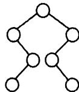
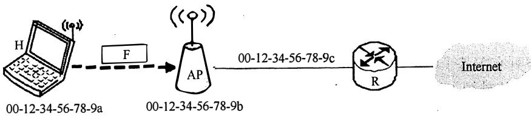

# 2017 年全国硕士研究生人学统一考试

# 计算机科学与技术学科联考计算机学科专业基础综合试题

# 一、单项选择题（第 $1 { \sim } 4 0$ 小题，每小题 分，共 80 分。下列每题给出的四个选项中，只有一个选项最符合试题要求）

1. 下列函数的时间复杂度是

int func(int n){ int $\mathrm{i} = 0$ sum $= 0$ while $(\mathrm{sum} <   \mathrm{n})$ sum $+ = + + i$ return i;   
1

A. O(logn)

B. O(n112)

C. O(n)

D. O(nlogn)

2. 下列关千栈的叙述中，错误的是 。

I. 采用非递归方式重写递归程序时必须使用栈  
II. 函数调用时，系统要用栈保存必要的信息  
III. 只要确定了入栈次序，就可确定出栈次序   
IV. 栈是一种受限的线性表，允许在其两端进行操作

A.

B. II III

C. III IV

D. II III IV

3. 适用于压缩存储稀疏矩阵的两种存储结构是 。

A. 三元组表和十字链表

B. 三元组表和邻接矩阵

C. 十字链表和二叉链表

D. 邻接矩阵和十字链表

4. 要使一棵非空二叉树的先序序列与中序序列相同，其所有非叶结点须满足的条件是

A．只有左子树

B．只有右子树

C．结点的度均为1

D．结点的度均为2

5．已知一棵二叉树的树形如右图所示，其后序序列为e,a,c,b,d,g,f，树中与结点a同层的结点是 。

A.c

B.d

c.f

D.g

6．已知字符集 $\{ { \mathsf { a } } , { \mathsf { b } } , { \mathsf { c } } , { \mathsf { d } } , { \mathsf { e } } , { \mathsf { f } } , { \mathsf { g } } , { \mathsf { h } } \}$ ，若各字符的哈夫曼编码依次是0100,10, 0000,0101,001,011,11,0001，则编码序列0100011001001011110101的译码结果是 。



A.acgabfh

B.adbagbb

C. afbeagd

D. afeefgd

7．已知无向图G含有16条边，其中度为4的顶点个数为3，度为3的顶点个数为4，其他顶点的度均小于3。图G所含的顶点个数至少是 。

A.10

B.11

C. 13

D.15

8．下列二叉树中，可能成为折半查找判定树（不含外部结点）的是 9


9. 下列应用中， 适合使用 $\mathtt { B } +$ 树的是

A. 编译器中的词法分析

B. 关系数据库系统中的索引

C. 网络中的路由表快速查找

D. 操作系统的磁盘空闲块

10. 在内部排序时， 若选择了归并排序而没有选择插入排序， 则可能的理由是 _

I. 归并排序的程序代码更短 II. 归并排序的占用空间更少

III. 的运行效率更高

A. 仅II

B. 仅III

C. 仅I、II

D. 仅I、III

11. 下列排序方法中，若将顺序存储更换为链式存储，则算法的时间效率会降低的是 _0

I. I. III. IV. V.

A. 仅I、II

B. 仅II、III

C. 仅III、IV

D. 仅IV、V

12. 假定计算机Ml和M2具有相同的指令集体系结构CISA), 主频分别为 1.5GHz和1.2GHz。 在Ml和M2上运行某基准程序P, 若平均CPI分别为2和1, 则程序P在Ml和M2上运行时间的比值是 。

A. 0.4

B. 0.625

C. 1.6

D. 2.5

13. 机 4个 $6 4 \mathbf { M } \times 8$ 位的DRAM芯片采用交叉编址方式构成，并与宽度为32位的存储器总线相连， 主存每次最多读写32位数据。 若double型变量 $\mathbf { x }$ 的主存地址为804 OOlAH, 则读取 $\mathbf { x }$ 需要的存储周期数是

A. 1

B. 2

C. 3

D. 4

14. 某C语言程序段如下：

for $(\mathrm{i} = 0;\mathrm{i} <   = 9;\mathrm{i} + + )$ { temp $= 1$ . for $(j = 0;j <   = i;j + + )$ temp $\ast = a[j]$ sum $+ =$ temp;

下列关于数组a的访问局部性的描述中， 正确的是 。

A. 时间局部性和空间局部性皆有

B. 无时间局部性， 有空间局部性

C. 有时间局部性， 无空间局部性

D. 时间局部性和空间局部性皆无

15. 下列寻址方式中， 最适合按下标顺序访问一维数组元素的是

A. 相对寻址

B. 寄存器寻址

C. 直接寻址

D. 变址寻址

16. 某计算机按字节编址， 指令字长固定且只有两种指令格式， 其中三地址指令29条，二地址指令107条， 每个地址字段为6位， 则指令字长至少应该是

A. 24位

B. 26位

C. 28位

D. 32位

17. 下列关千超标量流水线特性的叙述中， 正确的是

I. 能缩短流水线功能段的处理时间  
II. 能在一个时钟周期内同时发射多条指令

# III. 能结合动态调度技术提高指令执行并行性

A. 仅II

B. 仅I、III

C. 仅II、III

D. I、II和III

18. 下列关于主存储器(MM)和控制存储器(CS)的叙述中，错误的是 。

A. MM在CPU外，cs 在CPU内  
B. MM按地址访问，cs按内容访问  
C. MM存储指令和数据，cs存储微指令  
D. MM用RAM和ROM实现，cs用 ROM实现

19. 下列关于指令流水线数据通路的叙述中，错误的是 。

A. 包含生成控制信号的控制部件  
B. 包含算术逻辑运算部件(ALU)  
C. 包含通用寄存器组和取指部件  
D. 由组合逻辑电路和时序逻辑电路组合而成

20. 下列关千多总线结构的叙述中，错误的是 。

A. 靠近CPU的总线速度较快  
B. 存储器总线可支持突发传送方式  
C. 总线之间须通过桥接器 相连  
D. PC I-Express $\times 1 6$ 采用并行传输方式

21. 1/0指令实现的数据传送通常发生在 。

A. 1/0设备和1/0端口之间  
B. 通用寄存器和1/0设备之间  
C. 1/0端口和1/0端口之间   
D. 通用寄存器和1/0端口之间

22. 下列关于多重中断系统的叙述中，错误的是 。

A. 在一条指令执行结束时响应中断  
B. 中断处理期间CPU处于关中断状态  
C. 中断请求的产生与当前指令的执行无关  
D. CPU通过采样中断请求信号检测中断请求

23. 假设4个作业到达系统的 时刻和运行时间如下表所示。

<table><tr><td>作业</td><td>到达时刻t</td><td>运行时间</td></tr><tr><td>J1</td><td>0,</td><td>3</td></tr><tr><td>J2</td><td>1</td><td>3</td></tr><tr><td>J3</td><td>1</td><td>2</td></tr><tr><td>J4</td><td>3</td><td>1</td></tr></table>

系统在 $t = 2$ 时开始作业调度。若分别采用先来先服务和短作业优先调度算法，则选中的作业分别是

A. h、J3

B. J1 、J4

C. J2 、J4

D. J1 、]3

24. 执行系统调用的过程包括如下主要操作：

$\textcircled{1}$ 返回用户态

$\textcircled{2}$ 执行陷入(trap)指令

$\textcircled{3}$ 传递系统调用参数

$\textcircled{4}$ 执行相应的服务程序

正确的执行顺序是 。

A. $\textcircled { 2 }  \textcircled { 3 }  \textcircled { 1 }  \textcircled { 4 }$

B. $\textcircled { 2 }  \textcircled { 4 }  \textcircled { 3 }  \textcircled { 1 }$

C. $\textcircled { 3 }  \textcircled { 2 }  \textcircled { 4 }  \textcircled { 1 }$

D. $\textcircled { 3 }  \textcircled { 4 }  \textcircled { 2 }  \textcircled { 1 }$

25. 某计算机按字节编址，其动态分区内存管理采用最佳适应算法，每次分配和回收内存后都对空闲分区链重新排序。 当前空闲分区信息如下表所示。

<table><tr><td>分区起始地址</td><td>20K</td><td>500K</td><td>1000K</td><td>200K</td></tr><tr><td>分区大小</td><td>40KB</td><td>80KB</td><td>100KB</td><td>200KB</td></tr></table>

回收起始地址为60K、大小为140KB的分区后，系统中 空闲分区的数量、空闲分区链第一个分区的起始地址和大小分别是 。

A. 3、 20K、 380KB

B. 3、SOOK、80KB

C. 4、20K、180KB

D. 4、500K、80KB

26. 某文件系统的簇和磁盘扇区大小分别为1KB和512B。若一个文件的大小为1026B,则系统分配给该文件的磁盘空间大小是 。

A. 1026B

B. 1536B

C. 1538B

D. 2048B

27. 下列有关基于时间片的进程调度的叙述中，错误的是 。

A. 时间片越短， 进程切换的次数越多，系统开销也越大  
B. 当前进程的时间片用完后，该进程状态由执行态变为阻塞态  
C. 时钟中断发生后，系统会修改当前进程在时间片内的剩余时间  
D. 影响时间片 大小的主要因素包括响应时间、系统开销和进程数量等

28. 与单道程序系统相比， 多道程序系统的优点是 。

I. CPU利用率高

II. 系统开销小

III. 系统吞吐量大

IV. VO设备利用率高

A. 仅I、III

B. 仅I、IV

C. 仅II、III

D. 仅I、III、IV

29. 下列选项中， 磁盘逻辑格式化程序所做的工作是 。

I. 对磁盘进行分区  
II. 建立文件系统的根目录  
III. 确定磁盘扇区校验码所占位数  
IV. 对保存空闲磁盘块信息的数据结构进行初始化

A. 仅II

B. 仅II、IV

C. 仅III、IV

D. 仅I、II、IV

30. 某文件系统 中，针对每个文件， 用户类别分为4类：安全管理员、 文件主、 文件主的伙伴、其他用户；访问权限分为5种：完全控制、 执行、修改、读取、写入。若文件控制块中用二进制位串表示文件权限，为表示不同类别用户对一个文件的访问权限，则描述文件权限的位数至少应为 。

A. 5

B. 9

C. 12

D. 20

31. 若文件fl的硬链接为位，两个进程分别打开fl和位，获得对应的文件描述符为fdl和fd2, 则下列叙述中， 正确的是

I. fl和位 的读写指针位置保持相同  
II. fl和位共享同一个内存索引结点  
III. fdl和fd2分别指向各自的用户打开文件表中的 一项

A. 仅III

B. 仅II 、 III

C. 仅I 、 II

D. I 、 II和III

32. 系统将数据从磁盘读到内存的过程包括以下操作：

$\textcircled{1}$ (DMA控制器发出中断请求

$\textcircled{2}$ 初始化OMA控制器并启动磁盘

$\textcircled{3}$ 从磁盘传输一块数据到内存缓冲区

$\textcircled{4}$ 执行"OMA结束 ” 中断服务程序

正确的执行顺序 是 a

A. $\textcircled { 3 }  \textcircled { 1 }  \textcircled { 2 }  \textcircled { 4 }$

$\textcircled { 2 }  \textcircled { 3 }  \textcircled { 1 }  \textcircled { 4 }$

C. $\textcircled { 2 }  \textcircled { 1 }  \textcircled { 3 }  \textcircled { 4 }$

D. $\textcircled { 1 }  \textcircled { 2 }  \textcircled { 4 }  \textcircled { 3 }$

33. 假设OSI参考模型的应用层欲发送400B的数据（无拆分）， 除物理层和应用层之外，其他各层在封装POU时均引入20B的额外开销， 则应用层数据传输效率约为 。

A. $80 \%$

B. $8 3 \%$

C. $8 7 \%$

D. $9 1 \%$

34. 若信道在无噪声情况下的极限数据传输速率不小于信噪比为30dB条件下的极限数据传输速率，则信号状态数至少是 °

A. 4

B. 8

C. 16

D. 32

35. 在下图所示的网络中， 若主机 H 发送一个封装访问 Internet 的 IP分组的 IEEE 802.11数据帧 F, 则帧 F 的地址 l、 地址2 3 分别是 。



A. 00-12-34-56-78-9a, 00-12-34-56-78-9b, 00-12-34-56-78-9c   
B. 00-12-34-56-78-9b, 00-12-34-56-78-9a, 00-12-34-56-78-9c   
C. 00-12-34-56-78-%, 00-12-34-56-78-9c, 00-12-34-56-78-9a   
D. 00-12-34-56-78-9a, 00-12-34-56-78-9c, 00-12-34-56-78-9b

36. 下列 IP地址中， 只能作为 IP分组的源 IP地址但不能作为目的 IP地址的是 。

A. 0.0.0.0

B. 127.0.0.1

C. 200.10.10.3

D. 255.255.255.255

37. 直接封装 RIP、 OSPF、 BGP报文的协议分别是

A. TCP、 UDP、 IP

B. TCP、 IP、 UDP

C. UDP、 TCP、 IP

D. UDP、 IP、 TCP

38. 若将网络 21.3.0.0/16 划分为128个规模相同的子网，则每个子网可分配的最大 IP地址个数是 。

A. 2�4

B. 256

C. 510

D. 512

39. 若甲向乙发起一个TCP连接， 最大段长 $\mathbf { M S S } = 1 \mathbf { K B }$ , $\mathrm { R T T } = 5 \mathrm { m s }$ , 乙开辟的接收缓存为 64KB, 则甲从连接建立成功至发送窗口达到 32KB, 需经过的时间至少是 。

A. 25ms

B. 30ms

C. 160ms

D. 165ms

40. 下列关于 FTP协议的叙述中， 错误的是 。

A. 数据连接在每次数据传输完毕后就关闭  
B. 控制连接在整个会话期间保持打开状态  
C. 服务器与客户端的TCP20端口建立数据连接  
D. 客户端与服务器的 TCP21端口建立控制连接

# 二、 综合应用题（第 $4 1 { \sim } 4 7$ 小题， 共 70 分）

41. (15分）请设计一个算法，将给定的表达式树（二叉树）转换为等价的中缀表达式（通过括号反映操作符的计算次序）并输出。 例如， 当下列两棵表达式树作为算法的输入时， 输出的等价中缀表达式分别为 $( { \mathsf { a } } + { \mathsf { b } } ) ^ { * } ( { \mathsf { c } } ^ { * } ( - { \mathsf { d } } ) )$ 和 $( { \mathsf { a } } ^ { * } { \mathsf { b } } ) { \mathsf { + } } ( - ( { \mathsf { c } } { \mathsf { - } } { \mathsf { d } } ) ) .$ 。


二叉树结点定义如下：

七ypedef struct node{ char data[lO]; S七rue七 node·*left, *right;

II存储操作数或操作符

)BTree;

要求：

(1)给出算法的基本设计思想。  
(2) 根据设计思想， 采用 C 或 ${ \mathsf { C } } { + } { + }$ 语言描述算法 ， 关键之处给出注释。

42. (8分）使用 Prim (普里姆）算法求带权连通图的最小（代价）生成树 (MST) 。答下列问题。

(1)对下列图 G, 从顶点 A 开始求 G的 MST, 依次给出按算法选出的边。


(2) 图 G的 MST是唯一的吗？  
(3)对任意的带权连通图 ， 满足什么条件时， 其 MST是唯一的？

43. C 13 分）已知 $f ( n ) = \sum _ { i = 0 } ^ { n } 2 ^ { i } = 2 ^ { n + 1 } - 1 = { \overset { n + 1 \llap { / } } { 1 1 \cdots 1 8 } }$ ＿n+l位 ' 计算 $f ( n )$ 的 C 语言函数 fl如下：

int f1(unsigned n){ int sum $= 1$ power $= 1$ for(unsigned $\mathrm{i} = 0;\mathrm{i} <   = \mathrm{n} - 1;\mathrm{i} + + )$ { power $\star = 2$ sum $+ =$ power; } return sum;

将 fl 中的 int 都改为 float, 可得到计算 $f ( n )$ 的另一个函数仅。 假设 unsigned 和 int 型数据都占 32 位， float 采用IEEE 754 单精度标准。 请回答下列问题

(1)当 $\mathbf { n } = 0$ 时， fl 会出现死循环， 为什么？若将 fl 中的变量 i 和 n 都定义为 int 型，则 fl是否还会出现死循环？为什么？  
(2) fl(23)和 :f2(23)的返回值是否相等？机器数各是什么（用十六进制表示）？  
(3) fl(24)和 :f2(24)的返回值分别为 33 554 431 和 33 554 432.0, 为什么不相等？  
(4) ${ \bf f } ( 3 1 ) = 2 ^ { 3 2 } - 1$ , 而 fl(31)的返回值却为-1, 为什么？若使 fl(n)的返回值与 f(n)相等 ， 则最大的 $\mathbf { n }$ 是多少？  
(5) :f2(127)的机器数为 7F80 OOOOH, 对应的值是什么？若使 :f2(n)的结果不溢出 ，则最大的 $\mathbf { n }$ 是多少？若使 ${ \mathfrak { f } } 2 ( { \mathfrak { n } } )$ 的结果精确（无舍入）， 则最大的 n是多少？

44. oo 分）在按字节编址的计算机M 上， 题43 中 fl的部分源程序（阴影部分）与对应的机器级代码（包括指令的虚拟地址）如下图所示

```matlab
int f1(unsigned n)  
1 00401020 55 push ebp  
... ... ...  
for(unsigned i = 0; i <= n - 1; i++)  
... ... ...  
20 0040105E 394D F4 cmp dword ptr [ebp-0Ch],ecx 
```

power $\ast = 2$ .   
23 00401066 D1 E2 shl edx,1   
return sum;   
35 0040107F C3 ret

其中， 机器级代码行包括行号、虚拟地址、 机器指令和汇编指令。请回答下列问题。

(1)计算机M是RISC还是CISC? 为什么？  
(2) fl的机器指令代码共占多少字节？要求给出计算过程。  
(3)第20条指令cmp通过i减 $\mathbf { n } { - } 1$ 实现对i和 $\mathbf { n } { - } 1$ 的比较。执行fl(O)过程中， 当 $\mathrm { i } = 0$ 时，cmp指令执行后， 进／借位标志CF的内容是什么？要求给出计算过程。  
(4)第23条指令shl通过左移操作实现了power*2运算， 在f2中能否也用shl指令实现power $^ { * } 2 \cdot 2$ 为什么？

45. (7分）假定题44给出的计算机M采用二级分页虚拟存储管理方式， 虚拟地址格式如下：

<table><tr><td>页目录号（10位）</td><td>页表索引（10位）</td><td>页内偏移量（12位）</td></tr></table>

请针对题43的函数fl和题44中的机器指令代码， 回答下列问题。

(1)函数fl的机器指令代码占多少页？  
(2)取第1条指令(push ebp)时， 若在进行地址变换的过程中需要访问内存中的页目录和页表，则会分别访问它们各自的第几个表项（编号从0开始）？  
(3) M的I/0采用中断控制方式。若进程P在调用fl之前通过scanf()获取n的值，则在执行scanf()的过程中， 进程P的状态会如何变化? CPU是否会进入内核态？

46. (8分）某进程中有3个并发执行的线程threadl、thread2和thread3, 其伪代码如下所示。

<table><tr><td rowspan="8">//复数的结构类型定义
typedef struct
{
    float a;
    float b;
} cnum;
cnum x, y, z; //全局变量</td><td>thread1</td><td>thread3</td></tr><tr><td>{</td><td>{</td></tr><tr><td>cnum w;</td><td>cnum w;</td></tr><tr><td>w = add(x, y);</td><td>w.a = 1;</td></tr><tr><td>...</td><td>w.b = 1;</td></tr><tr><td>{</td><td>z = add(z, w);</td></tr><tr><td>y = add(y, w);</td><td>y = add(y, w);</td></tr><tr><td>thread2</td><td>...</td></tr><tr><td>//计算两个复数之和
cnum add(cnum p, cnum q)
{
    cnum s;
    s.a = p.a + q.a;
    s.b = p.b + q.b;
    return s;</td><td></td><td></td></tr></table>

请添加必要的信号量和P、V(或wait()、signal())操作，要求确保线程互斥访问临界资源，并且最大限度地并发执行。

47. (9分）甲乙双方均采用后退 $N$ 帧协议(GBN)进行持续的双向数据传输， 且双方始终采用捎带确认，帧长均为 $1 0 0 0 \mathrm { B }$ 。 $\mathrm { S } _ { x , y }$ 和 $\mathrm { R } _ { x , y }$ 分别表示甲方和乙方发送的数据帧，其中 $x$ 是发送序号， $y$ 是确认序号（表示希望接收对方的下一帧序号）；数据帧的发送序号和确认序号字段均为3比特。 信道传输速率为lOOMbps , $ { \mathrm { R T T } } = 0 . 9 6  { \mathrm { m s } }$ 。 下图给出了甲方发送数据帧和接收数据帧的两种场景，其中 $t _ { 0 }$ 为初始时刻，此时甲方的发送和确认序号均为O, $t _ { 1 }$ 1时刻甲方有足够多的数据待发送。

  
(a)

  
(b)

请回答下列问题。

(1)对于图(a) $t _ { 0 }$ 时刻到 $t _ { 1 }$ 时刻期间，甲方可以断定乙方已正确接收的数据帧数是多少？正确接收的是哪几个帧？（请用 $\mathrm { S } _ { x , y }$ 形式给出。）  
(2)对于图(a),从 $t _ { 1 }$ 时刻起，甲方在不出现超时且未收到乙方新的数据帧之前，最多还可以发送多少个数据帧？其中第一个帧和最后一个帧分别是哪个？（请用 $\mathrm { S } _ { x , y }$ 形式给出。）  
(3)对于图(b), 从 $t _ { 1 }$ 时刻起，甲方在不出现新的超时且未收到乙方新的数据帧之前， 需要重发多少个数据帧？重发的第一个帧是哪个？（请用 $\mathrm { \bf S } _ { x , y }$ 形式给出。）  
(4)甲方可以达到的最大信道利用率是多少？