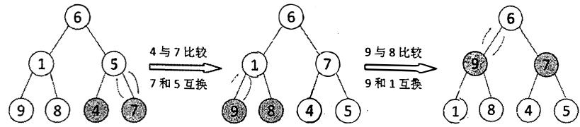
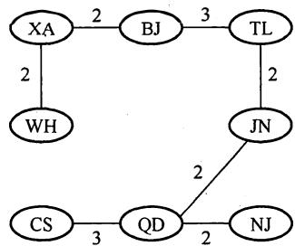

# 2018 年计算机学科专业基础综合试题参考答案

# 一、单项选择题

1.  2.  3.  4.  6.  7.  8.   
9.  10.  11.  12.  14.  15.  16.   
17.  18.  19.  20.  22.  23.  24.   
25.  26.  27.  28.  30.  31.  32.   
33.  34.  35.  36.  38.  39.  40.

# 1. 解析：

第一次调用：＠从 S1 中弹出 3; ® S2 中弹出＋；＠执行 3+2=5;@ 压入 S1 中， $\textcircled{1}$ $\mathsf { S } _ { 1 }$ $\textcircled{2}$ $\mathsf { S } _ { 2 }$ $^ { + }$ $\textcircled{3}$ $3 + 2 = 5$ $\textcircled{4}$ $\mathsf { S } _ { \mathsf { I } }$ 第一次调用结束后 S1 中剩余 8, 5 (5 在栈顶）， S2 中剩余＊，－（－在栈顶）。第二次调用： S1 $\mathsf { S } _ { \mathsf { l } }$ $\mathsf { S } _ { 2 }$ $\textcircled{1}$ $\mathsf { S } _ { \mathsf { l } }$ 中弹出 8; ® S2 中弹出－；＠执行 8-5=3;@ 压入 SI 中，第二次调用结束后 S1 中剩 $\textcircled{2}$ $\mathsf { S } _ { 2 }$ $\textcircled{3}$ $8 - 5 = 3$ $\textcircled{4}$ $\mathsf { S } _ { 1 }$ 5, 3 (3 在栈顶）， S2 中剩余＊。第三次调用：＠从 S1 中弹出 5; ® S2 中弹出＊；＠执行 $\mathbf { S } _ { 2 }$ $\textcircled{1}$ $\mathsf { S } _ { 1 }$ $\textcircled{2}$ $\mathsf { S } _ { 2 }$ $\textcircled{3}$ 5x3 = 15; @将 15 压入 S1 中，第三次调用结束后 S1 中仅剩余 15 (栈顶）， S2 为空。故选 $5 { \times } 3 = 1 5$ $\textcircled{4}$ ${ \sf S } _ { 1 }$ $\mathbf { S } _ { 1 }$ $\mathsf { S } _ { 2 }$

# 2. 解析：

的操作顺序：＠＠＠＠＠＠＠＠。 的操作顺序： ®CDCDCDCDCD@ 的操作顺序： $\textcircled { 1 } \textcircled { 1 } \textcircled { 2 } \textcircled { 2 } \textcircled { 1 } \textcircled { 1 } \textcircled { 3 } \textcircled { 3 }$ $\textcircled { 2 } \textcircled { 1 } \textcircled { 1 } \textcircled { 1 } \textcircled { 1 } \textcircled { 1 } \textcircled { 3 }$ ＠＠＠＠＠＠＠＠＠＠＠。对千 C: 首先输出 3, 说明 必须先依次入栈，而此后 肯定 $\textcircled { 2 } \textcircled { 2 } \textcircled { 2 } \textcircled { 2 } \textcircled { 2 } \textcircled { 1 } \textcircled { 3 } \textcircled { 3 } \textcircled { 3 } \textcircled { 3 }$ 先输出，因此无法得到 1, 的输出顺序。

# 3. 解析：

数组 的下标从 开始，第一个元素 m1,1 对应存入 。，矩阵 的第一行有 12 个元素，第 $m _ { 1 , 1 }$ $n _ { 0 }$ $M$ 二行有 11 个，第三行有 10 个，第四行有 个，第五行有 个，所以 m6,6 是第 12 + 11 + 10 + 9 + $m _ { 6 , 6 }$ $1 2 + 1 1 + 1 0 + 9 +$ $8 + 1 = 5 1$ 个元素，下标应为 50, 故选

# 4. 解析：

非叶结点的度均为 2, 且所有叶结点都位于同一层的完全二叉树就是满二叉树。对千一棵高度为 的满二叉树（空树 h=O), 其最后一层全部是叶结点，数量为 2h-1; 总结点数为 2h - $h$ $h = 0$ $2 ^ { h - 1 }$ $2 ^ { h } - 1$ 因此当 $2 ^ { h - 1 } = k$ 时，可以得到 $2 ^ { h } - 1 = 2 k - 1$

# 5. 解析：

构造一棵符合题意的哈夫曼树，如下图所示。


由此可知， 左子树为o, 右子树为1, 故答案为A。

# 6. 解析：

根据二叉排序树的特性：中序遍历(LNR)得到的是一个递增序列 。图中二叉排序树的中序遍历序列为 $x _ { 1 } , x _ { 3 } , x _ { 5 } , x _ { 4 } , x _ { 2 }$ , 可知 $x _ { 3 } < x _ { 5 } < x _ { 4 }$ 0

# 7. 解析：

拓扑 排序每次选取入度为0的结点输出， 经观察不难发现拓扑序列前两位一定是1,5或5, 1 (因为只有1和5的入度均为o, 且其他结点都不满足仅有1或仅有5作为前驱）。因此D显然错误。

# 8. 解析：

$m$ 阶B树的基本性质：根结点以外的非叶结点最少 含有 $\left\lceil m / 2 \right\rceil { - } 1$ 个关键字，代入 $m = 3$ 得到 每个 非叶结点中 最少包含1个关键字， 而根结点含有1个关键字， 因此所有非叶结点都有两个孩子。此时其树形与 $h = 5$ 的满二叉树相同， 可求得关键字最少为31个。

# 9. 解析：

根据题意， 得到的HT如下：

<table><tr><td>0</td><td>1</td><td>2</td><td>3</td><td>4</td><td>5</td><td>6</td></tr><tr><td></td><td>22</td><td>43</td><td>15</td><td></td><td></td><td></td></tr></table>

$$
\mathrm {A S L} _ {\text {成 功}} = (1 + 2 + 3) / 3 = 2 。
$$

10. 解析：

初始序列： 8, 3, 9, 11, 2, 1, 4, 7, 5, 10, 6


第一趟分组：8, 1, 6; 3, 4; 9, 7; 11, 5; 2,.10; 间隔为5, 排序后组内递增。

第二趟分组：1,5,4,10; 3,2,9,8; 7,6,11; 间隔为3, 排序后组内递增。

故答案选D。

# 11. 解析：

要熟练掌握建堆、 堆的调整方法， 从序列末尾开始向前遍历， 变换过程如下图所示。




# 12. 解析：

对于I, 二进制由千只有0,1 两种数值，运算规则较简单，都是通过ALU部件转换成加法运算。 对于II, 二进制只需要高电平和低电平两个状态就可以表示， 这样的物理器件很容易制

造。对于III, 二进制与逻辑量相吻合。二进制的 0 和1正好与逻辑量的 “真” 和“假” 相对应，因此用二进制数表示二值逻辑显得十分自然，采用逻辑门电路很容易实现运算。

# 13. 解析：

利用补码转换成原码的规则：负数符号位不变数值位取反加1; 正数补码等于原码。两个机器数对应的原码是 $[ \mathbf { x } ] _ { i \mathrm { s } i } = 8 0 0 0 0 0 2 1 \mathrm { H }$ , 对应的数值是-33, $[ \mathbf { y } ] _ { \ast } = [ \mathbf { y } ] _ { \ast } { = } 0 0 0 0 0 4 1 \mathrm { H } = 6 5$ 。排除A、D 选项。 $\mathbf { x } - \mathbf { y }$ 直接利用补码减法准则， $[ { \bf x } ] _ { 4 \mathrm { i } } - [ { \bf y } ] _ { 4 \mathrm { i } } = [ { \bf x } ] _ { 4 \mathrm { i } } + [ - { \bf y } ] _ { 4 \mathrm { i } }$ ， -y的补码是连同符号位取反加1, 最终减法变成加法， 得出结果为FFFFFF9EH。

# 14. 解析：

IEEE754 单精度浮点数的符号位、阶码位、尾数位（省去正数位 1) 所占的位数分别是1、8、23位。最 小正数， 数符位取O, 移码的取值范围是 $1 { \sim } 2 5 . 4$ , 取1, 得阶码值 $1 ~ - ~ 1 2 7 = - 1 2 6$ Cl27为我们规定的偏置值）， 尾数取全 最终推出最小规格化正数为 选项。

# 15. 解析：

按字节编址， 采用小端方式， 低位的数据存储在低地址位、高位的数据存储在高地址位，并且按照一个字节相对不变的顺序存储。由题意知机器代码的地址是递减的， 存储 0 的位数是后32位，那么我们只需要把-64 的补码按字节存储在其中即可，而-64 表示成32 位的十六进制是FFFFFF CO, FF FF F 故

# 16. 解析：

逻辑移位：左移和右移空位都补 o, 并且所有数字参与移动。算术移位：符号位不参与移动， 右移空位补符号位， 左移空位补0。 根据该规则， 轻松选出B 选项。

# 17. 解析：

由题意， 首先根据 DRAM采用的是行列地址线复用技术， 我们尽量选用行列差值不要太大的。对于B、C选项， 地址线只需 6 根（取行或列所需地址线的最大值）， 轻松排除A、D 选项。其次，为了减小刷新开销，而 DRAM 一般是按行刷新的，所以应选行数值较少的，答案为C。

# 18. 解析：

根据变址寻址的公式 $\mathbf { E A } = ( \mathbf { I X } ) + \mathbf { A }$ , 则 $\mathrm { ( I X ) } = 2 1 0 0 \mathrm { H } - 2 0 0 0 \mathrm { H } = 1 0 0 \mathrm { H } = 2 5 6$ , sizeof(double) $= 8$ （双精度浮点数用8 位字节表示）， 因此数组的下标为 $2 5 6 / 8 = 3 2$ , 答案选B。

# 19. 解析：

$[ \mathbf { x } ] _ { \mathfrak { H } } - [ \mathbf { y } ] _ { \mathfrak { H } } = [ \dot { \mathbf { x } } ] _ { \mathfrak { H } } + [ - \mathbf { y } ] _ { \mathfrak { H } } , [ - \mathbf { R } 2 ] _ { \mathfrak { H } } = 0 0 0 0 0 0 1 0 \mathrm { H }$ $[ - \mathrm { R } 2 ] _ { * * } = 0 0 0 0 0 0 1 0 \mathrm { H }$ , 很明显 $[ \mathbf { R } 1 ] _ { * \mathrm { i } } + [ - \mathbf { R } 2 ] _ { * \mathrm { i } }$ 的最高位进位和符号位进位都是1 (当最高位进位和符号位进位的值不相同时才产生溢出）， 可以判断溢出标志OF为0。同时， 减 法操作只需判断借位标志， Rl大于R2, 所以借位标志为O, 综上选A。

# 20. 解析：

指令流水线的每个流水段时间单位为时钟周期， 题中指令流水线的指令需要用到 $\mathbf { A } { \sim } \mathbf { E }$ 五个部件，所以每个流水段时间应取：最大部件时间80ps, 此外还有寄存器延时为20ps, 则CPU时钟周期至少是lOOps。答案选D。

# 21. 解析：

总线数据传输率 $=$ 总线工作频率 $\mathbf { \nabla } \times$ 总线带宽（ $\overset { \cdot } { \underset { \cdot } { = } }$ 总线宽度/8), 所以 I 和II会影响总线数据传输率。采用突发传输方式（也称猝发传输），在一个总线周期内传输存储地址 连续的多个数据字，从而提高了传输效率。采用地址I数据线复用只是减少了线的数量， 节省了成本， 并不能提高传输率。

# 22. 解析：

中断优先级由屏蔽字决定，而不是根据请求的先后次序， 因此A错误。中断隐指令完成的

淘宝店铺：光速考研工作室

点；＠引出中断服务程序，通用寄存器的保护由中断服务程序完 $\textcircled{1}$ $\textcircled{2}$ $\textcircled{3}$ 中断后，才能响应中断请求，C正确。 有中断请求时， 先要由完成中断前程序的状态保存，D错误。

# 23. 解析：

多任务操作系统可以在同一时间内运行 多个应用程序，故I正确。 多个任务必须互斥地访问共享资源，为达到这一 目标必须对共享资源进行必要的保护， 故II正确。现代操作系统都是多任务的（主要特点是并发和并行），并不一定需要运行在多CPU的硬件上，单个CPU也可以满足要求，III错误。 综上所述，I、II正确，III错误，故选C。

# 24. 解析：

由优先权可知，进程的执行顺序为 ${ \bf P } _ { 2 } {  } { \bf P } _ { 3 } {  } { \bf P } _ { 1 }$ o

${ \tt P } _ { 2 }$ 的周转时间： $1 + 1 5 + 2 4 = 4 0 upmu \mathrm { \ s }$

${ \bf P } _ { 3 }$ 的周转时间： $1 8 + 1 + 2 4 + 1 + 3 6 = 8 0 upmu \mathrm { s }$

$\mathbf { P } _ { 1 }$ 的周转时间： $3 0 + 1 + 2 4 + 1 + 3 6 + 1 + 1 2 = 1 0 5 { \mu } s$

平均周转时间： $( 4 0 + 8 0 + 1 0 5 ) / 3 = 2 2 5 / 3 = 7 5 \mu \mathrm { s }$ , 故选 $\mathbf { D }$ 。

# 25. 解析：

仔细阅读两个线程代码可知，threadl和thread2均是对 $\mathbf { x }$ 进行加1操作， $\mathbf { x }$ 初始值为 o, 若要使得最终 $\mathbf { x } = 2$ 2, 只有先执行threadl 再执行thread2,或先执行thread2再执行threadl, 故只有2种可能，选B。

# 26. 解析：

由题中数据可知，仅剩最后一个同类资源，若将其分给 ${ \bf P } _ { 1 }$ 或 ${ \bf P } _ { 2 }$ , 则均无法正常执行；若分给 ${ \bf P } _ { 3 }$ , 则 ${ \bf P } _ { 3 }$ 正常执行完成后，释放的这个资源仍无法使 $\mathrm { { \cal P } } _ { 1 }$ 、 ${ \bf P } _ { 2 }$ 正常执行，故不存在安全序列，选A。

# 27. 解析：

进程 等待某资源为可用（不包括处理 机）或等待输入／输出完成均会进入阻塞状态， 故I、II 正确； III中情况发生时，进程进入就绪状态，故III错误，答案选C。

# 28. 解析：

“ 条件变量” 是管程内部说明和使用的一种特殊变量，其作用类似于信号量机制中的 “信号量”，都是用于实现进程同步的。需要注意的是，在同一时刻，管程中只能有一个进程在执行。如果进程A 执行了x.wa识）操作，那么该进程会阻塞，并挂到条件变量 $\mathbf { x }$ 对应的阻塞队列上。这样，管程的使用权被释放， 就可以有另 一个进程进入管程。 如果进程B执行了x.signal()操作，那么会唤醒x对应的阻塞队列队头进程。在Pascal语言的 管程中，规定只有一个进程要离开管程时才能调用si al()操作。

# 29. 解析：

时钟中断的主要工作是处理和时间有关的信息以及决定是否执行调度程序，和时间有关的所有信息，包括系统时间、进程的时间片、延时、使用CPU的时间、各种定时器，故I、II、III均正确，选D。

# 30. 解析：

当系统总是持续出现某个磁道的访问请求时，均持续满足最短寻道时间优先、扫描算法和循环扫描算法 的访问条件，会一直服务该访问请求。因此，先来先服务按照请求次序进行调度，比较公平， 故选A。

# 31. 解析：

II和IV显然均能提高文件访问速度。对于I, 提前读是指在读当前盘块时， 将下一个可能要访问的盘块数据读入缓冲区， 以便需要时直接从缓冲区中读取， 提高了文件的访问速度。对于III, 延迟写是先将写数据写入缓冲区， 并置上 “延迟写” 标志， 以备不久之后访问， 当缓冲区需要再次被分配出去时才将缓冲区数据写入磁盘， 减少了访问磁盘的次数， 提高了文件的访问速度，III 也正确， 答案选D。

# 32. 解析：

硬件方法实现进程同步不能实现让权等待（见王道单科书）， 故B、D错误； Pet erson算法满足有限等待但不满足让权等待，故 A错误；记录型信号量由千引入阻塞机制， 消除了不让权等待的情况， 故C正确。

# 33. 解析：

FTP用来传输文件， SMTP用来发送电子邮件，HTTP用来传输网页文件， 都 对可靠性的要求较高， 因此都用传输层有连接的 TCP服务。无连接UDP服务效率更高、 开销小，DNS在传输层采用无连接的UDP服务。

# 34. 解析：

物理层的接口规范主要分为4种：机械特性、 电气特性、 功能特性、 规程特性。机械特性规定连接所用设备的规格，即A 所说的接口形状。电气特性规定信号的电压高低、阻抗匹配等，如D所说的信号电平。功能特性规定线路上出现的电平代表什么意义、 接口部件的信号线（数据线、 控制线、 定时线等） 的用途， 如B 所说的引脚功能。选项C中的物理地址就是 MAC地址， 它属于数据链路层的范畴。

# 35. 解析：

CSMA/CA协议进行信道预约主要使用的是请求发送帧RTS(R equest to Send) 和允许发送帧CTS (Clear to Send)。当一台主机想要发送信息时，先向无线站点发送一个RTS帧， 说明要传输的数据及相应的时间。当无线站点收到RTS帧之后， 会广播一个CTS帧作为对此的响应，既给发送端发送许可，又指示其他主机不要在这个时间内发送数据，从而预约信道，避免碰撞。发送确认帧， 主要是保证信息的可靠传输；二进制指数退避法是在CSMA/CD中的一种冲突处理 方法；C选项则与预约信道无关。

# 36. 解析：

信道利用率 $=$ 传输帧的有效时间／传输帧的周期。假设帧的长度为 $x$ 比特。对于有效时间，应该用帧的大小除以数据传输速率，即 $x / 3 \mathrm { k b p s }$ 。对于帧的传输周期，应包含4个部分：帧在发送端的发送时延、 帧从发送端到接收端的单程传播时延、 确认帧在接收端的发送时延、 确认帧从接收端到发送端的单程传播时延。这 4个时延中， 由于题目中说 “ 忽略确认帧的传输延时,,'因此不计算确认帧的发送时延（注意传输时延和传播时延的区别， 传输时延也称发送时延，和传播时延只有一字之差）。所以帧的传输周期由三部分组成：首先是帧在发送端的发送时延$x / 3 \mathrm { k b p s }$ , 其次是帧从发送端到接收端的单程传播时延 $2 0 0 \mathrm { m s }$ , 最后是确认帧从接收端到发送端的单程传播时延 ${ 2 0 0 } \mathrm { m s }$ , 三者相加可得其周期应为 $x / 3 \mathrm { k b p s } + 4 0 0 \mathrm { m s }$ 。代入信道利用率的公式，求出 $\mathbf { x } = 8 0 0 \mathbf { b i t }$ 。答案选D。

# 37. 解析：

在网络的信息传递中，会经常用到两个地址：MAC地址和I P地址。其中， MAC地址会随着信息被发往不同的网络而改变，但IP地址当且仅当信息在私人网络中传递时才会改变。分组P在如题图所示的网络中传递时， 首先由主机Hl将分组发往路由器R, 此时源MAC地址为

H1 主机本身的MAC地址， 即00-1a-2b-3c-4d-52, 目的MAC地址 为路由器R的MAC地址，即 OO-la-2b-3c-4d-51。当路由器R收到分组P后，根据分组P的目的IP地址，得知应 将分组从另一个端口转发出去，于是会给分组P更换新的MAC地址， 此时由于从另外的端口转发出去，因此P的新源MAC地址变为负责转发的端口MAC地址， 即OO-al-b2-c3-d4-61, 目的MAC地址应为主机H2的MAC地址， 即OO-al-b2-c3-d4-62。根据分析过程，题 目 所问的MAC地址应为路由器R两个端口的MAC地址，故选D。

# 38. 解析：

对于此类题目，先分析需要聚合的IP地址 。观察发现，题中的4个路由地址，前16位完全相同，不同之处在于第3段的8位中， 将这8位展开写成二进制，分别如下：

<table><tr><td></td><td>7</td><td>6</td><td>5</td><td>4</td><td>3</td><td>2</td><td>1</td><td>0</td></tr><tr><td>32</td><td>0</td><td>0</td><td>1</td><td>0</td><td>0</td><td>0</td><td>0</td><td>0</td></tr><tr><td>40</td><td>0</td><td>0</td><td>1</td><td>0</td><td>1</td><td>0</td><td>0</td><td>0</td></tr><tr><td>48</td><td>0</td><td>0</td><td>1</td><td>1</td><td>0</td><td>0</td><td>0</td><td>0</td></tr><tr><td>56</td><td>0</td><td>0</td><td>1</td><td>1</td><td>1</td><td>0</td><td>0</td><td>0</td></tr></table>

观察发现，4个地址的第3段中，从前向后最多有3位相同，因此这3位是能聚合的最大位 数。将这些相同的位都保留，将第3段 第3位之后的所有位都置 o, 就得到了聚合后的IP地址 35:230.32.0, 其网络前缀为 $1 6 + 3$ , 也即前19 位，故聚合后的网络地址为35.230.32.0/19, 答案为C。

# 39. 解析：

传输层分用的定义是：接收方的传输层剥去报文首部后， 能把这些数 据正确交付到目的进程。C和D选项显然不符。端口号是传输层服务访问点TSAP, 用来标识主机中的应 用进程。对于A和B选项，源端口号是在 需要对方回信时选用，不需要时可用全0。 目的端口号是在终点交付报文 时使用到， 符合题意，故选B。

# 40. 解析：

电子邮件出现得较早，当时的数据 传输 能力较弱，使用者们往往也不需要传输较大的图片、视频等，因此SMTP具有 一 些目前来看较为老旧的性质，例如限制 所有邮件报文的体部分，只能采用7位 ASCII来表示。 在如今的传输 过程中，如果 传输了非文本文件， 往往需要将这些多媒体文件重新编码为 ASCII再传输。因此无须转换即可传输的是ASCII文本，答案为D。

# 二、 综合应用题

# 41. 解答：

1）题目要求算法时间上尽可能高效，因此采用空间换时间的办法。分配一个用于标记的数组 $\mathbb { B } [ n ]$ , 用来记录A中 是否出现了 $1 { \sim } n$ 中的正整数，B[O]对应正整数 1, B[n -1]对应正整数$_ n$ , 初始化B中 全部为0。由千A中含有 $_ n$ 个整数，因此可能返回的值是 $1 \sim n + 1$ , 当A中 $_ n$ 个数恰好为 $1 { \sim } n$ 时返回 $n + 1$ 。当数组A中出现了小于等于0或大于 $_ n$ 的值时， 会导致 $1 { \sim } n$ 中出现空余位置，返回结果必然在 $1 { \sim } n$ 中，因此对于A中出现了小于等于0或大于 $_ n$ 的值 可以不采取任何操作。

经过以上分析可以得出算法流程：从A[O]开始遍历A, 若 $0 < \mathbf { A } [ i ] < = n$ , 则令 $\mathbf { B } [ \mathbf { A } [ i ] - 1 ] = 1$ ;否则不进行操作。对 A遍历结束后，开始遍历数组B, 若能查找到 第一个满足 $\mathbf { B } [ i ] = = 0$ 的下标i' 返回 $i + 1$ 即为结果， 此时说明A中未出现的最小正整数 在 $1 { \sim } \dot { n }$ 之间。若B[i]全部不为o,返回 $i + 1$ (跳出循环时 $i = n$ , $i + 1$ 等于 $n + 1 )$ ), 此时说明A中未出现的最小正整数是 $n + 1$ 。

```c
int findMissMin(int A[], int n)  
{  
    int i, *B; //标记数组  
    B = (int *)malloc(sizeof(int) *n); //分配空间  
    memset(B, 0, sizeof(int) *n); //赋初值为 0  
    for (i = 0; i < n; i++)  
        if (A[i] > 0 && A[i] <= n) //若 A[i] 的值介于 1~n，则标记数组 B  
            B[A[i] - 1] = 1;  
    for (i = 0; i < n; i++) //扫描数组 B，找到目标值  
        if (B[i] == 0) break;  
    return i + 1; //返回结果  
} 
```

2)时间复杂度：遍历A一次，遍历B一次，两次循环内操作步骤为0(1)量级， 因此时间复杂度为 ${ \mathrm { O } } ( n )$ 。空间复杂度：额外分配了B[n], 空间复杂度为 ${ \bf O } ( n )$ 。

# 42. 解答：

1)为了求解最经济的方案，可以把问题抽象为求无向带权图的最小生成树。可以采用手动Prim算法或Kruskal算法作图。注意本题最小生成树有两种构造，如下图所示。

  
方案l

  
方案2

方案的总费用为16。

2)存储题中的图可以采用邻接矩阵（或邻接表）。构造最小生成树采用 $\operatorname { P r i m }$ 算法（或Kruskal算法）。  
3) $\mathrm { T T L } = 5$ , 即IP分组的生存时间（最大传递距离） 为5, 方案1 中TL和BJ的距离过远，$\mathrm { T T L } = 5$ 不足以让IP分组从Hl传送到H2, 因此H2不能收到IP分组。而方案2 中TL和BJ邻近，H2可以收到IP分组。

# 43. 解答：

1)程序定时向缓存端口查询数据， 由于缓存端口大小有限，必须在传输完端口大小的数据时访问端口， 以防止部分数据未被及时读取而丢失。 设备 A准备 32 位数据所用的时间为$4 \mathbf { B } / 2 \mathbf { M } \mathbf { B } = 2 \mu \mathbf { s }$ , 所以最多每隔 $2 \mu \ s$ 必须查询一次，每秒的查询次数至少是 $1 \mathsf { s } / 2 \mu \mathsf { s } = 5 \times 1 0 ^ { 5 }$ , 每秒CPU用于设备A输入／输出的时间至少为 $5 \times 1 0 ^ { 5 } \times 1 0 \times 4 = 2 \times 1 0 ^ { 7 }$ 个时钟周期， 占整个CPU时间的百分比至少是 $2 { \times } 1 0 ^ { 7 } / 5 0 0 \mathbf { M } = 4 \%$ 。  
2)中断响应和中断处理的时间为 $4 0 0 { \times } ( 1 / 5 0 0 \mathrm { M } ) = 0 . 8 \mu \mathrm { s }$ , 这时只需判断设备B准备32位多久，如果准备数据的时间小于中 和中断处理的时间，那么数据就会被刷新，造成丢失。经过计算，设备B准备32位数据所用的时间为 $4 \mathrm { B } / 4 0 \mathrm { M } \mathrm { B } = 0 . 1 \mu \mathrm { s }$ , 因此设备B不适合采用中断1/0方式。  
3）在DMA方式中，只有预处理和后处理需要CPU 处理，数据的传送过程是由DMA 控制的。 设备B 每秒的DMA次数最多为 $4 0 \mathbf { M } \mathbf { B } / 1 0 0 0 \mathbf { B } = 4 0 0 0 0$ , CPU用于设备B输入／输出的时间最多为 $4 0 0 0 0 \times 5 0 0 = 2 \times 1 0 ^ { 7 }$ 个时钟周期， 占CPU总时间的百分比最多为 $2 \times 1 0 ^ { 7 } / 5 0 0 \mathrm { M } = 4 \%$ 。

# 44. 解答：

1) 物理地址由实页号和页内地址拼接， 因此其位数为 $1 6 + 1 2 = 2 8$ 或直接可得 $2 0 + 3 +$ $5 = 2 8$ 。  
2) TLB采用全相联映射，可以把页表内容调入任一块空TLB 项中， TLB 中每项都有一个比较器，没有映射规则，只要空闲就行。TLB 采用静态存储器 SRAM, 读写速度快，但成本高，多用于容量较小的高速缓冲存储器。  
3) 从图 中可以看到， Cache 中每组有两行，故采用2 路组相联映射方式。

因为是 2 路组相联并采用LRU 替换算法 ，所以每行（或每组）需要 1 位LRU 位；因为采用回写策略，所以每行有1位修改位（脏位）， 根据脏位判断数据是否被更新，若脏位为1则需要写回内存。

28 位物理地址中 Tag 字段占 20 位， 组索引字段占 3 位，块内偏移地址占 5 位，故 Cache共有 $2 ^ { 3 } = 8$ 组， 每组 2行， 每行有 $2 ^ { 5 } = 3 2 \mathrm { B }$ , 故 Cache 总容量为 ${ 8 \times 2 \times ( 2 0 + 1 + 1 + 1 3 2 \times 8 ) = 4 4 6 4 }$ 位 $= 5 5 8$ 字节。

Cache 中有效位用来指出所在 Cache 行中的信息是否有效。

4)虚拟地址分为两部分：虚页号、页内地址；物理地址分为两部分：实页号、页内地址。利用虚拟地址的虚页号部分去查找 TLB 表（缺失时从页表调入），将实页号取出后和虚拟地址的页内地址拼接，就形成了物理地址。虚页号 008CH 恰好在 TLB 表中对应实页号 0040H (有效位为 1, 说明存在）， 虚拟地址的后 3 位为页内地址040H, 则对应的物理地址是 0040040H。

物理地址为 0040040H, 其中高 20 位 00400H 为标志字段，低5 位 OOOOOB 为块内偏移量，中间3 位010B 为组号2, 因此将 00400H 与 Cache 中的第 2 组两行中的标志字段同时比较，可以看出，虽然有一个 Cache 行中的标志字段与 00400H 相等，但对应的有效位为 o, 而另一 Cache行的标志字段与 00400H 不相等，故访问 Cache 不命中。

因为物理地址的低 12 位与虚拟地址低 12 位相同，即为 001001100000B。根据物理地址的结构，物理地址的后八位01100000B的前三位011B是组号，因此该地址所在的主存映射到Cache的组号为3。

# 45. 解答：

1)由图可知， 地址总长度为 32 位， 高20 位为虚页号，低 12 位为页内地址， 且虚页号高10位为页目录号，低10位为页号。展开成二进制表示为


故十六进制表示为 0180 6008H。

2) PDBR 为页目录基址地址寄存器 (Page-Directory Base Register), 其存储页目录表物理内存基地址。进程切换时， PDBR 的内容会变化；同一进程的线程切换时， PDBR 的内容不会变化。每个进程的地址空间、页目录和PDBR的内容存在一一对应的关系。进程切换时， 地址空间发生了变化， 对应的页目录及其起始地址也相应变化， 因此需要用进程切换后当前进程的页目录起始地址刷新 PDBR。同一进程中的线程共享该进程的地址空间，其线程发生切换时，地址空间不变，线程使用的页目录不变， 因此PDBR的内容也不变。  
3)改进型 CLOCK 置换算法需要用到使用位和修改位，故需要设置访问字段（使用位） 和修改字段（脏位）。

# 46. 解答：

1)簇大小为 4KB, 每个地址项长度为 4B, 故每簇有 $4 \mathrm { K B } / 4 \mathrm { B } = 1 0 2 4$ 个地址项。最大文件

的物理块 数可达 $8 + 1 { \times } 1 0 2 4 + 1 { \times } 1 { 0 } 2 4 ^ { 2 } + 1 { \times } 1 0 2 4 ^ { 3 }$ , 每个物理块（簇） 大小为4KB, 故最大文件长度为 $( 8 + 1 \times 1 0 2 4 + 1 \times 1 0 2 4 ^ { 2 } + 1 \times 1 0 2 4 ^ { 3 } ) \times 4 \mathrm { K B } = 3 2 \mathrm { K B } + 4 \mathrm { M B } + 4 \mathrm { G B } + 4 \mathrm { T B } ^ { \cdot }$

(2)文件索引节点总个数为 $1 \mathrm { M } { \times } 4 \mathrm { K B } / 6 4 \mathrm { B } = 6 4 \mathrm { M }$ , 5600B的文件占2个簇， 512M个簇可存放的文件总个数为 $5 1 2 \mathbf { M } / 2 = 2 5 6 \mathbf { M }$ 。可表示的文件总个数受限于文件索引节点总个数， 故能存储64M个大小为5600B的图像文件。  
(3)文件Fl的大小为 $6 \mathrm { K B } < 4 \mathrm { K B } \times 8 = 3 2 \mathrm { K B }$ , 故获取文件Fl的最后一个簇的簇 号只需要访问索引节点的直接地址项。 文件F2的大小为40KB, $4 \mathrm { K B } \times 8 < 4 0 \mathrm { K B } < 4 \mathrm { K B } \times 8 + 4 \mathrm { K B } \times 1 0 2 4$ ,故获取F2的最后一个簇的簇号还需要读一级索引表。 综上，需要的时间不相同。

# 47. 解答：

1) l的地址（主机号全0的地址代表 网络本身）。和技术部均分配了192.168.1.0/24的IP地址空间，IP地址的前24位为子网的网络号。于是在 后8位中划分部门的子网，选择前1位作为部门 子网的网络号。令销售部子网的网络号为o, 技术部子网的网络号为I, 则技术部子网的完整地址为192.168.1.128; 令销售部子网的主机号全I,可以得到该部门的广播地址为192.168.1.127。

每个主机仅分配 一个IP地址，计算目前还可以分配的主机数，用技术部可以分配的主机数减去已分配的主机数，技术部总共可以分配给计算机的主机数为 $2 ^ { 7 } - 2 = 1 2 6$ （减去全0和全1的主机号）。已经分配了 $2 0 8 - 1 2 9 + 1 = 8 0$ 个，此外还有1个IP地址 分配给了路由器的端口(192.168.1.254),因此还可以分配 $1 2 6 - 8 0 - 1 = 4 5$ 台。  
2)判断分片的大小，需要考虑各个网段的MTU, 而且注意分片的数据长度必须是8B整数倍。 由题可知， 在技术部子网内， $\mathbf { M T U } = 8 0 0 \mathbf { B }$ , IP分组头部长20B, 最大1P分片封装数据的字节数为 $( 8 0 0 - 2 0 ) / 8 { \big \vert } \times 8 = 7 7 6$ 。 至少需要的分片 数为 $\overline { { ( 1 5 0 0 - 2 0 ) / 7 7 6 } } \overline { { ] } } = 2$ 。 第1个分片的偏移量为0; 第2个分片的偏移量为 $7 7 6 / 8 = 9 7$ 。