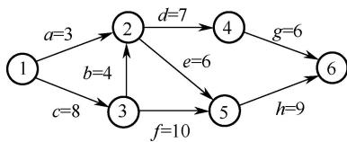

# 2019 年全国硕士研究生入学统一考试

# 计算机科学与技术学科联考计算机学科专业基础综合试题

# 一、单项选择题（第 $1 \sim 4 0$ 小题，每小题 2 分，共 80 分。下列每题给出的四个选项中，只有一个选项最符合试题要求）

1．设 $n$ 是描述问题规模的非负整数，下列程序段的时间复杂度是 。

$$
\begin{array}{l} \mathrm {x = 0 ;} \\ \text {w h i l e (n > = (x + 1) * (x + 1))} \\ \mathrm {x = x + 1 ;} \end{array}
$$

A． $O ( \log n )$

B． $O ( n ^ { 1 / 2 } )$

C．O(n)

D． $O ( n ^ { 2 } )$

2．若将一棵树 T转化为对应的二叉树 BT，则下列对 BT 的遍历中，其遍历序列与 T 的后根遍历序列相同的是 。

A．先序遍历

B．中序遍历

C．后序遍历

D．按层遍历

3．对 $n$ 个互不相同的符号进行哈夫曼编码。若生成的哈夫曼树共有 115个结点，则 $n$ 的值是 。

A．56

B．57

C．58

4．在任意一棵非空平衡二叉树（AVL 树） $\mathrm { T } _ { 1 }$ 中，删除某结点 v之后形成平衡二叉树 $\mathrm { T } _ { 2 }$ ，再将 v插入 $\mathrm { T } _ { 2 }$ 形成平衡二叉树 $\mathrm { T } _ { 3 }$ 。下列关于 $\mathrm { T } _ { 1 }$ 与 $\mathrm { T } _ { 3 }$ 的叙述中，正确的是 。

I．若 $\mathbf { V }$ 是 $\mathrm { T } _ { 1 }$ 的叶结点，则 $\mathrm { T } _ { 1 }$ 与 $\mathrm { T } _ { 3 }$ 可能不相同  
II．若 v 不是 $\mathrm { T } _ { 1 }$ 的叶结点，则 $\mathrm { T } _ { 1 }$ 与 $\mathrm { T } _ { 3 }$ 一定不相同  
III．若 $\mathbf { V }$ 不是 $\mathrm { T } _ { 1 }$ 的叶结点，则 $\mathrm { T } _ { 1 }$ 与 $\mathrm { T } _ { 3 }$ 一定相同

A．仅 I

B．仅 II

C．仅 I、II

D．仅 I、III

5．下图所示的 AOE 网表示一项包含 8个活动的工程。活动 d 的最早开始时间和最迟开始时间分别是 。



A．3 和 7

B．12 和 12

C．12 和 14

D．15 和 15

6．用有向无环图描述表达式 $( x + y ) ( ( x + y ) / x )$ ，需要的顶点个数至少是 。

A．5

B．6

7．选择一个排序算法时，除算法的时空效率，下列因素中，还需要考虑的是 。

I．数据的规模

II．数据的存储方式

III．算法的稳定性

IV．数据的初始状态

A．仅 III

B．仅 I、II

C．仅 II、III、IV

D．I、II、III、IV

8．现有长度为 11且初始为空的散列表HT，散列函数是 $H ( \mathrm { k e y } ) = \mathrm { k e y } \ \% \ 7$ ，采用线性探查（线性探测再散列）法解决冲突。将关键字序列 87,40,30,6,11,22,98,20依次插入 HT后，HT查找失败的平均查找长度是 。

A．4

B．5.25

C．6

D．6.29

9．设主串 $\mathrm { T } =$ "abaabaabcabaabc"，模式串 $\mathrm { S } =$ "abaabc"，采用 KMP 算法进行模式匹配，到匹配成功时为止，在匹配过程中进行的单个字符间的比较次数是 。

A．9

B．10

C．12

D．15

10．排序过程中，对尚未确定最终位置的所有元素进行一遍处理称为一“趟”。下列序列中，不可能是快速排序第二趟结果的是 。

A．5, 2, 16, 12, 28, 60, 32, 72

B．2, 16, 5, 28, 12, 60, 32, 72

C．2, 12, 16, 5, 28, 32, 72, 60

D．5, 2, 12, 28, 16, 32, 72, 60

11．设外存上有 120个初始归并段，进行 12路归并时，为实现最佳归并，需要补充的虚段个数是

A．1

B．2

C．3

D．4

12．下列关于冯·诺依曼结构计算机基本思想的叙述中，错误的是 。

A．程序的功能都通过中央处理器执行指令实现  
B．指令和数据都用二进制数表示，形式上无差别  
C．指令按地址访问，数据都在指令中直接给出  
D．程序执行前，指令和数据需预先存放在存储器中

13．考虑以下 C 语言代码：

```txt
unsigned short usi = 65535;  
short si = usi; 
```

执行上述程序段后，si 的值是 。

A．-1

B．-32767

C．-32768

D．-65535

14．下列关于缺页处理的叙述中，错误的是

A．缺页是在地址转换时 CPU检测到的一种异常  
B．缺页处理由操作系统提供的缺页处理程序来完成  
C．缺页处理程序根据页故障地址从外存读入所缺失的页  
D．缺页处理完成后回到发生缺页的指令的下一条指令执行

15．某计算机采用大端方式，按字节编址。某指令中操作数的机器数为 1234FF00H，该操作数采用基址寻址方式，形式地址（用补码表示）为 FF12H，基址寄存器的内容为 $\mathrm { F 0 0 0 0 0 0 0 0 0 0 H }$ ，则该操作数的 LSB（最低有效字节）所在的地址是 。

A．F000 FF12H

B．F000 FF15H

C．EFFF FF12H

D．EFFF FF15H

16．下列有关处理器时钟脉冲信号的叙述中，错误的是 。

A．时钟脉冲信号由机器脉冲源发出的脉冲信号经整形和分频后形成  
B．时钟脉冲信号的宽度称为时钟周期，时钟周期的倒数为机器主频   
C．时钟周期以相邻状态单元间组合逻辑电路的最大延迟为基准确定  
D．处理器总是在每来一个时钟脉冲信号时就开始执行一条新的指令

17．某指令功能为 $\mathrm { R } [ \mathrm { r } 2 ] { \longleftarrow } \mathrm { R } [ \mathrm { r } 1 ] + \mathrm { M } [ \mathrm { R } [ \mathrm { r } 0 ] ]$ ，其两个源操作数分别采用寄存器、寄存器间接寻址方式。对于下列给定部件，该指令在取数及执行过程中需要用到的是 。

I．通用寄存器组（GPRs）

II．算术逻辑单元（ALU）

III．存储器（Memory） IV．指令译码器（ID）

A．仅 I、II

B．仅 I、

II、III

C．仅 II、III、IV

D．仅 I、III、IV

18．在采用“取指、译码/取数、执行、访存、写回”5 段流水线的处理器中，执行如下指令序列，其中 s0、s1、s2、s3 和 t2 表示寄存器编号。

```txt
I1: add s2,s1,s0 //R[s2]←R[s1]+R[s0]  
I2: load s3,0(t2) //R[s3]←M[R[t2]+0]  
I3: add s2,s2,s3 //R[s2]←R[s2]+R[s3]  
I4: store s2,0(t2) //M[R[t2]+0]←R[s2] 
```

下列指令对中，不存在数据冒险的是 。

A．I1 和 I3

B．I2 和 I3

C．I2 和 I4

D．I3 和 I4

19．假定一台计算机采用 3 通道存储器总线，配套的内存条型号为 DDR3-1333，即内存条所接插的存储器总线的工作频率为 $1 3 3 3 \mathrm { M H z }$ ，总线宽度为 64 位，则存储器总线的总带宽大约是 。

A．10.66GB/s

B．32GB/s

C．64GB/s

D．96GB/s

20．下列关于磁盘存储器的叙述中，错误的是 C

A．磁盘的格式化容量比非格式化容量小   
B．扇区中包含数据、地址和校验等信息  
C．磁盘存储器的最小读写单位为一字节  
D．磁盘存储器由磁盘控制器、磁盘驱动器和盘片组成

21．某设备以中断方式与 CPU 进行数据交换，CPU 主频为 1GHz，设备接口中的数据缓冲寄存器为 32 位，设备的数据传输率为 $5 0 \mathrm { k B / s }$ 。若每次中断开销（包括中断响应和中断处理）为1000个时钟周期，则CPU用于该设备输入/输出的时间占整个CPU时间的百分比最多是 。

A． $1 . 2 5 \%$

B． $2 . 5 \%$

C． $5 \%$

D． $1 2 . 5 \%$

22．下列关于 DMA 方式的叙述中，正确的是 。

I．DMA 传送前由设备驱动程序设置传送参数  
II．数据传送前由 DMA 控制器请求总线使用权  
III．数据传送由 DMA 控制器直接控制总线完成  
IV．DMA 传送结束后的处理由中断服务程序完成

A．仅 I、II

B．仅 I、III、IV

C．仅 II、III、IV

D．I、II、III、IV

23．下列关于线程的描述中，错误的是 。

A．内核级线程的调度由操作系统完成  
B．操作系统为每个用户级线程建立一个线程控制块  
C．用户级线程间的切换比内核级线程间的切换效率高  
D．用户级线程可以在不支持内核级线程的操作系统上实现

24．下列选项中，可能会将进程唤醒的事件是 。

I．I/O 结束

II．某进程退出临界区

III．当前进程的时间片用完

A．仅 I

B．仅 III

C．仅 I、II

D．I、II、III

25．下列关于系统调用的叙述中，正确的是 。

I．在执行系统调用服务程序的过程中，CPU处于内核态  
II．操作系统通过提供系统调用避免用户程序直接访问外设

III．不同的操作系统为应用程序提供了统一的系统调用接口

IV．系统调用是操作系统内核为应用程序提供服务的接口

A．仅 I、IV

B．仅 II、III

C．仅 I、II、IV

D．仅 I、III、IV

26. 下列选项中，可用于文件系统管理空闲磁盘块的数据结构是 。

I．位图

II．索引结点

III．空闲磁盘块链

IV．文件分配表（FAT）

A．仅 I、II

B．仅 I、III、IV

C．仅 I、III

D．仅 II、III、IV

27．系统采用二级反馈队列调度算法进行进程调度。就绪队列 $\mathrm { Q } _ { \mathrm { l } }$ 采用时间片轮转调度算法，时间片为 $1 0 \mathrm { m s }$ ；就绪队列 $\mathrm { Q } _ { 2 }$ 采用短进程优先调度算法；系统优先调度 $\mathrm { Q } _ { \mathrm { l } }$ 队列中的进程，当$\mathrm { Q } _ { \mathrm { l } }$ 为空时系统才会调度 $\mathrm { Q } _ { 2 }$ 中的进程；新创建的进程首先进入 $\mathrm { Q } _ { \mathrm { l } }$ ； $\mathrm { Q } _ { \mathrm { l } }$ 中的进程执行一个时间片后，若未结束，则转入 $\mathrm { Q } _ { 2 }$ 。若当前 $\mathrm { Q } _ { \mathrm { l } }$ 、 $\mathrm { Q } _ { 2 }$ 为空，系统依次创建进程 $\mathrm { P } _ { 1 }$ 、 $\mathrm { P } _ { 2 }$ 后即开始进程调度，$\mathrm { P } _ { 1 \setminus } \mathrm { P } _ { 2 }$ 需要的 CPU 时间分别为 $3 0 \mathrm { m s }$ 和 $2 0 \mathrm { m s }$ ，则进程 P 、 $\mathrm { P } _ { 2 }$ 在系统中的平均等待时间为 。

A．25ms

B．20ms

C．15ms

D．10ms

28．在分段存储管理系统中，用共享段表描述所有被共享的段。若进程 $\mathrm { P } _ { 1 }$ 和 $\mathrm { P } _ { 2 }$ 共享段 S，下列叙述中，错误的是 。

A．在物理内存中仅保存一份段 S 的内容  
B．段 S 在 $\mathrm { P } _ { 1 }$ 和 $\mathrm { P } _ { 2 }$ 中应该具有相同的段号  
C． $\mathrm { P } _ { 1 }$ 和 $\mathrm { P } _ { 2 }$ 共享段S 在共享段表中的段表项  
D． $\mathrm { P } _ { 1 }$ 和 $\mathrm { P } _ { 2 }$ 都不再使用段 S 时才回收段 S 所占的内存空间

29．某系统釆用 LRU 页置换算法和局部置换策略，若系统为进程 P 预分配了 4 个页框，进程 P 访问页号的序列为 0, 1, 2, 7, 0, 5, 3, 5, 0, 2, 7, 6，则进程访问上述页的过程中，产生页置换的总次数是 。

A．3

B．4

D．6

30．下列关于死锁的叙述中，正确的是 。

I ．可以通过剥夺进程资源解除死锁  
II．死锁的预防方法能确保系统不发生死锁  
III．银行家算法可以判断系统是否处于死锁状态  
IV．当系统出现死锁时，必然有两个或两个以上的进程处于阻塞态

A．仅 II、III

B．仅 I、II、IV

C．仅 I、II、III

D．仅 I、III、IV

31．某计算机主存按字节编址，采用二级分页存储管理，地址结构如下所示：

<table><tr><td>页目录号（10位）</td><td>页号（10位）</td><td>页内偏移（12位）</td></tr></table>

虚拟地址 20501225H 对应的页目录号、页号分别是 。

A．081H、101H

B．081H、401H

C．201H、101H

D．201H、401H

32．在下列动态分区分配算法中，最容易产生内存碎片的是 。

A．首次适应算法

B．最坏适应算法

C．最佳适应算法

D．循环首次适应算法

33．OSI 参考模型的第 5层（自下而上）完成的主要功能是 。

A．差错控制

B．路由选择

C．会话管理

D．数据表示转换

34．100BaseT快速以太网使用的导向传输介质是 。

A．双绞线

B．单模光纤

C．多模光纤

D．同轴电缆

35．对于滑动窗口协议，若分组序号采用 3 比特编号，发送窗口大小为 5，则接收窗口最大是 。

A．2

B．3

C．4

D．5

36．假设一个采用 CSMA/CD 协议的 10Mb/s 局域网，最小帧长是 128B，则在一个冲突域内两个站点之间的单向传播延时最多是 。

A． $2 . 5 6 \mu \mathrm { s }$

B． $5 . 1 2 \mu \mathrm { s }$

C． $1 0 . 2 4 \mu \mathrm { s }$

D．20.48µs

37．若将 101.200.16.0/20划分为 5 个子网，则可能的最小子网的可分配 IP 地址数是 。

A．126

B．254

C．510

D．1022

38．某客户通过一个 TCP 连接向服务器发送数据的部分过程如题 38图所示。客户在 $t _ { 0 }$ 时刻第一次收到确认序列号 ack_seq $= 1 0 0$ 的段，并发送序列号 $\mathsf { s e q } = 1 0 0$ 的段，但发生丢失。若TCP 支持快速重传，则客户重新发送 $\mathsf { s e q } = 1 0 0$ 段的时刻是 。

A．t1

B．t2

C．t3

D．t4

  
题 38 图

39．若主机甲主动发起一个与主机乙的 TCP 连接，甲、乙选择的初始序列号分别为 2018和 2046，则第三次握手 TCP 段的确认序列号是 。

A．2018

B．2019

C．2046

D．2047

40．下列关于网络应用模型的叙述中，错误的是 。

A．在 P2P 模型中，结点之间具有对等关系  
B．在客户/服务器（C/S）模型中，客户与客户之间可以直接通信  
C．在 C/S 模型中，主动发起通信的是客户，被动通信的是服务器  
D．在向多用户分发一个文件时，P2P模型通常比 C/S 模型所需的时间短

# 二、综合应用题（第 $4 1 { \sim } 4 7$ 小题，共 70分）

41．（13分）设线性表 $L = ( a _ { 1 } , a _ { 2 } , a _ { 3 } , \cdots , a _ { n - 2 } , a _ { n - 1 } , a _ { n } )$ 采用带头结点的单链表保存，链表中的结点定义如下：

```c
typedef struct node   
{ int data; struct node\*next; }NODE; 
```

请设计一个空间复杂度为 $O ( 1 )$ 且时间上尽可能高效的算法，重新排列 $L$ 中的各结点，得到线性表 $L ^ { \prime } = ( a _ { 1 } , a _ { n } , a _ { 2 } , a _ { n - 1 } , a _ { 3 } , a _ { n - 2 } , \cdots )$ 。要求：

（1）给出算法的基本设计思想。  
（2）根据设计思想，采用 C 或 $\mathrm { C } { + + }$ 语言描述算法，关键之处给出注释。  
（3）说明你所设计的算法的时间复杂度。

42．（10 分）请设计一个队列，要求满足： $\textcircled{1}$ 初始时队列为空； $\textcircled{2}$ 入队时，允许增加队列占用空间； $\textcircled{3}$ 出队后，出队元素所占用的空间可重复使用，即整个队列所占用的空间只增不减；$\textcircled{4}$ 入队操作和出队操作的时间复杂度始终保持为 $O ( 1 )$ 。请回答下列问题：

（1）该队列是应选择链式存储结构，还是应选择顺序存储结构？  
（2）画出队列的初始状态，并给出判断队空和队满的条件。  
（3）画出第一个元素入队后的队列状态。  
（4）给出入队操作和出队操作的基本过程。

43．（8 分）有 $n$ （ $n { \geq } 3 .$ ）位哲学家围坐在一张圆桌边，每位哲学家交替地就餐和思考。在圆桌中心有 $m$ （ $m \geqslant 1 \ ,$ ）个碗，每两位哲学家之间有一根筷子。每位哲学家必须取到一个碗和两侧的筷子后，才能就餐，进餐完毕，将碗和筷子放回原位，并继续思考。为使尽可能多的哲学家同时就餐，且防止出现死锁现象，请使用信号量的 P、V 操作［wait()、signal()操作］描述上述过程中的互斥与同步，并说明所用信号量及初值的含义。  
44．（7分）某计算机系统中的磁盘有 300个柱面，每个柱面有 10个磁道，每个磁道有 200个扇区，扇区大小为 512B。文件系统的每个簇包含 2 个扇区。请回答下列问题：

（1）磁盘的容量是多少？  
（2）假设磁头在 85号柱面上，此时有 4个磁盘访问请求，簇号分别为 100260、60005、101660和 110560。若采用最短寻道时间优先（SSTF）调度算法，则系统访问簇的先后次序是什么？  
（3）第 100530簇在磁盘上的物理地址是什么？将簇号转换成磁盘物理地址的过程是由 I/O系统的什么程序完成的？

45．（16分）已知 $f ( n ) = n ! = n \times ( n - 1 ) \times ( n - 2 ) \times \cdots \times 2 \times 1$ ，计算 $f ( n )$ 的 C 语言函数 f1 的源程序（阴影部分）及其在 32 位计算机 M上的部分机器级代码如下：

```asm
int f1(int n){ 100401000 55 push ebp ... ... if(n>1) 1100401018 83 7D 08 01 cmp dword ptr [ebp+8],1 120040101C 7E 17 jle f1+35h (00401035) return n*f1(n-1); 130040101E 8B 45 08 mov eax, dword ptr [ebp+8] 1400401021 83 E8 01 sub eax, 1 1500401024 50 push eax 1600401025 E8 D6 FF FF FF call f1 (00401000) ... ... 1900401030 OF AF C1 imul eax, ecx 2000401033 EB 05 jmp f1+3Ah (0040103a) else return 1; 2100401035 B8 01 00 00 00 mov eax,1 } ... ... ... ... ... ... ... ... ... ... ... ... ... ... ... ... ... ... ... ... ... ... ... ... ... ... ... ... ... ... ... ... ... ... ... ... ... ... ... ... ... ... ... ... ... ... ... ... ... ... ... ... ... ... ... ... ... ... ... 
```

其中，机器级代码行包括行号、虚拟地址、机器指令和汇编指令，计算机 M 按字节编址，int型数据占 32 位。请回答下列问题：

（1）计算 $f ( 1 0 )$ 需要调用函数 f1 多少次？执行哪条指令会递归调用 f1？  
（2）上述代码中，哪条指令是条件转移指令？哪几条指令一定会使程序跳转执行？

（3）根据第16 行的 call 指令，第 17行指令的虚拟地址应是多少？已知第 16行的 call 指令采用相对寻址方式，该指令中的偏移量应是多少（给出计算过程）？已知第 16行的 call 指令的后 4 字节为偏移量，M 是采用大端方式还是采用小端方式？  
（4） $f ( 1 3 ) = 6 2 2 7 0 2 0 8 0 0$ ，但 f1(13)的返回值为 1932053504，为什么两者不相等？要使f1(13)能返回正确的结果，应如何修改 f1 的源程序？  
（5）第 19 行的 imul 指令（带符号整数乘）的功能是 R[eax] R[eax]×R[ecx]，当乘法器输出的高、低 32位乘积之间满足什么条件时，溢出标志 $\mathrm { O F } = 1 \mathrm { ? }$ 要使 CPU 在发生溢出时转异常处理，编译器应在 imul 指令后应加一条什么指令？  
46．（7 分）对于题45，若计算机 M 的主存地址为 32位，釆用分页存储管理方式，页大小为 4KB，则第 1 行的 push 指令和第 30 行的 ret 指令是否在同一页中（说明理由）？若指令 Cache有 64行，采用 4 路组相联映射方式，主存块大小为 64B，则 32 位主存地址中，哪几位表示块内地址？哪几位表示 Cache 组号？哪几位表示标记（tag）信息？读取第 16 行的 call 指令时，只可能在指令 Cache 的哪一组中命中（说明理由）？  
47．（9 分）某网络拓扑如题 47图所示，其中 R 为路由器，主机 $\mathrm { H } 1 { \sim } \mathrm { H } 4$ 的 IP 地址配置以及 R 的各接口 IP 地址配置如图中所示。现有若干以太网交换机（无 VLAN 功能）和路由器两类网络互连设备可供选择。

  
题 47 图

请回答下列问题：

（1）设备 1、设备 2 和设备3 分别应选择什么类型的网络设备？  
（2）设备 1、设备 2和设备 3 中，哪几个设备的接口需要配置 IP 地址？为对应的接口配置正确的 IP 地址。  
（3）为确保主机 $\mathrm { H } 1 { \sim } \mathrm { H } 4$ 能够访问 Internet，R 需要提供什么服务？  
（4）若主机 H3发送一个目的地址为 192.168.1.127的 IP 数据报，网络中哪几个主机会接收该数据报？