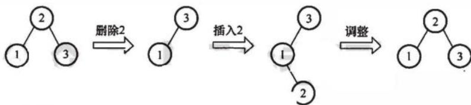

# 2019年计算机学科专业基础综合试题参考答案

# 一、单项选择题

<table><tr><td>1.</td><td>B</td><td>2.</td><td>B</td><td>3.</td><td>C</td><td>4.</td><td>A</td><td>5.</td><td>C</td><td>6.</td><td>A</td><td>7.</td><td>D</td><td>8.</td><td>C</td></tr><tr><td>9.</td><td>B</td><td>10.</td><td>D</td><td>11.</td><td>B</td><td>12.</td><td>C</td><td>13.</td><td>A</td><td>14.</td><td>D</td><td>15.</td><td>D</td><td>16.</td><td>D</td></tr><tr><td>17.</td><td>B</td><td>18.</td><td>C</td><td>19.</td><td>B</td><td>20.</td><td>C</td><td>21.</td><td>A</td><td>22.</td><td>D</td><td>23.</td><td>B</td><td>24.</td><td>C</td></tr><tr><td>25.</td><td>C</td><td>26.</td><td>B</td><td>27.</td><td>C</td><td>28.</td><td>B</td><td>29.</td><td>C</td><td>30.</td><td>B</td><td>31.</td><td>A</td><td>32.</td><td>C</td></tr><tr><td>33.</td><td>C</td><td>34.</td><td>A</td><td>35.</td><td>B</td><td>36.</td><td>B</td><td>37.</td><td>B</td><td>38.</td><td>C</td><td>39.</td><td>D</td><td>40.</td><td>B</td></tr></table>

1. 解析：

假设第 $k$ 次循环终止，则第 $k$ 次执行时， $(x + 1)^2 > n$ ， $x$ 的初始值为0，第 $k$ 次判断时， $x = k - 1$ ，即 $k^2 > n$ ， $k > \sqrt{n}$ ，因此该程序段的时间复杂度为 $O(\sqrt{n})$ 。因此选B。

2. 解析：

后根遍历树可分为两步：① 从左到右访问双亲结点的每个孩子（转化为一叉树后就是先访问根结点再访问右子树）；② 访问完所有孩子后再访问它们的双亲结点（转化为二叉树后就是先访问左子树再访问根结点），因此树T的后根遍历序列与其相应二叉树BT的中序遍历序列相同。对于此类题，采用特殊值法求解通常会更便捷，左下图树T转换为二叉树BT的过程如下图所示，树T的后序遍历序列显然和其相应二叉树BT的中序遍历序列相同，均为5,6,7,2,3,4,1。因此选B。


3. 解析：

$n$ 个符号构造成哈夫曼树的过程中，共新建了 $n - 1$ 个结点（双分支结点），因此哈夫曼树的结点总数为 $2n - 1 = 115$ ， $n$ 的值为58，答案选C。

4. 解析：

在非空平衡二叉树中插入结点，在失去平衡调整前，一定插入在叶结点的位置。

若删除的是 $\mathsf{T}_{1}$ 的叶结点，则删除后平衡二叉树不会失去平衡，即不会发生调整，再插入此结点得到的二叉平衡树 $\mathsf{T}_{1}$ 与 $\mathsf{T}_{3}$ 相同；若删除后平衡二叉树失去平衡而发生调整，再插入结点得到的二叉平衡树 $\mathsf{T}_{3}$ 与 $\mathsf{T}_{1}$ 可能不同。I正确。例如，如下图所示，删除结点0，平衡二叉树失衡调整，再插入结点0后，平衡二叉树和以前不同。

对于比较绝对的说法Ⅱ和Ⅲ，通常只需举出反例即可。


若删除的是 $\mathrm{T}_{1}$ 的非叶结点，且删除和插入操作均没有导致平衡二叉树的调整（这时可以首先想到删除的结点只有一个孩子的情况），则该结点从非叶结点变成了叶结点， $\mathrm{T}_{1}$ 与 $\mathrm{T}_{3}$ 显然不同。例如，如下图所示，删除结点2，用右孩子结点3填补，再插入结点2，平衡二叉树和以前不同。


若删除的是 $\mathrm{T}_{1}$ 的非叶结点，且删除和插入操作后导致了平衡二叉树的调整，则该结点有可能通过旋转后继续变成非叶结点， $\mathrm{T}_{1}$ 与 $\mathrm{T}_{3}$ 相同。例如，如下图所示，删除结点2，用右孩子结点3填补，再插入结点2，平衡二叉树失衡调整，调整后的平衡二叉树和以前相同。



# 5. 解析：

活动 $d$ 的最早开始时间等于该活动弧的起点所表示的事件的最早发生时间，活动 $d$ 的最早开始时间等于事件2的最早发生时间 $\max \{a,b + c\} = \max \{3,12\} = 12$ 。活动 $d$ 的最迟开始时间等于该活动弧的终点所表示的事件的最迟发生时间与该活动所需时间之差，先算出图中关键路径长度为27（对于不复杂的选择题，找出所有路径计算长度），那么事件4的最迟发生时间为 $\min \{27 - g\} = \min \{27 - 6\} = 21$ ，活动 $d$ 的最迟开始时间为 $21 - d = 21 - 7 = 14$ 。

常规方法：按照关键路径算法得到下表。

<table><tr><td></td><td>\( v_1 \)</td><td>\( v_2 \)</td><td>\( v_3 \)</td><td>\( v_4 \)</td><td>\( v_5 \)</td><td>\( v_6 \)</td></tr><tr><td>\( v_{e(i)} \)</td><td>0</td><td>12</td><td>8</td><td>19</td><td>18</td><td>27</td></tr><tr><td>\( v_{t(i)} \)</td><td>0</td><td>12</td><td>8</td><td>21</td><td>18</td><td>27</td></tr></table>

<table><tr><td></td><td>a</td><td>b</td><td>c</td><td>d</td><td>e</td><td>f</td><td>g</td><td>h</td></tr><tr><td>e(i)</td><td>0</td><td>8</td><td>0</td><td>12</td><td>12</td><td>8</td><td>19</td><td>18</td></tr><tr><td>l(i)</td><td>9</td><td>8</td><td>0</td><td>14</td><td>12</td><td>8</td><td>21</td><td>18</td></tr><tr><td>l(i)-e(i)</td><td>9</td><td>0</td><td>0</td><td>2</td><td>0</td><td>0</td><td>3</td><td>0</td></tr></table>

从表中可知，活动 $d$ 的最早开始时间和最迟开始时间分别为12和14，故选C。

# 6. 解析：

先将该表达式转换成有向二叉树，注意到该二叉树中有些顶点是重复的，为了节省存储空间，可以去除重复的顶点（使顶点个数达到最少），将有向二叉树去重转换成有向无环图，如下

图所示。答案选A。


7. 解析：

当数据规模较小时可选择复杂度为 $O(n^{2})$ 的简单排序方法，当数据规模较大时应选择复杂度为 $O(n\log_2n)$ 的排序方法，当数据规模大到内存无法放下时需选择外部排序方法，I正确。数据的存储方式主要分为顺序存储和链式存储，有些排序方法（如堆排序）只能用于顺序存储方式，Ⅱ正确。若对数据稳定性有要求，则不能选择不稳定的排序方法，Ⅲ显然正确。当数据初始基本有序时，直接插入排序的效率最高，冒泡排序和直接插入排序的时间复杂度都是 $O(n)$ 而归并排序的时间复杂度依旧是 $O(n\log_2n)$ ，Ⅳ正确。所以选D。

8. 解析：

采用线性探查法计算每个关键字的存放情况，如下表所示。

<table><tr><td>散列地址</td><td>0</td><td>1</td><td>2</td><td>3</td><td>4</td><td>5</td><td>6</td><td>7</td><td>8</td><td>9</td><td>10</td></tr><tr><td>关键字</td><td>98</td><td>22</td><td>30</td><td>87</td><td>11</td><td>40</td><td>6</td><td>20</td><td></td><td></td><td></td></tr></table>

由于 $H(\mathrm{key}) = 0\sim 6$ ，查找失败时可能对应的地址有7个，对于计算出地址为0的关键字key0，只有比较完 $0\sim 8$ 号地址后才能确定该关键字不在表中，比较次数为9；对于计算出地址为1的关键字key1，只有比较完 $1\sim 8$ 号地址后才能确定该关键字不在表中，比较次数为8；以此类推。需要特别注意的是，散列函数不可能计算出地址7，因此有

$$
\mathrm {A S L} _ {\text {失 救}} = (9 + 8 + 7 + 6 + 5 + 4 + 3) / 7 = 6
$$

因此选C。

9. 解析：

假设位序都是从0开始的，按照next数组生成算法，对于 $S$ 有

<table><tr><td>编号</td><td>0</td><td>1</td><td>2</td><td>3</td><td>4</td><td>5</td></tr><tr><td>S</td><td>a</td><td>b</td><td>a</td><td>a</td><td>b</td><td>c</td></tr><tr><td>next</td><td>-1</td><td>0</td><td>0</td><td>1</td><td>1</td><td>2</td></tr></table>

根据KMP算法，第一趟连续比较6次，在模式串的5号位和主串的5号位匹配失败，模式串的下一个比较位置为next[5]，即下一次比较从模式串的2号位和主串的5号位开始，然后直到模式串5号位和主串8号位匹配，第二趟比较4次，模式串匹配成功。单个字符的比较次数为10次，所以选B。

10. 解析：

要理解清楚排序过程中一“趟”的含义，题干也进行了解释。一个初始无序序列，所有元素都没有确定最终位置，对所有元素做一次（称为趟）快速排序后一个元素确定最终位置，且将原序列划分成了前后两块，此时前后两块子表是无序的。按“趟”的解释——对尚未确定最终位置的所有元素都处理一遍才是一趟，所以此时要对前后两块子表各做一次快速排序才是一

“趟”快速排序，如果只对一块子表进行了排序，而未处理另一块子表，就不能算是完整的一趟。

选项A，第一趟匹配72，只余一块无序序列，第二趟匹配28，选项A可能。选项B，第一趟匹配2，第二趟匹配72，选项B可能。选项C，第一趟匹配2，第二趟匹配28或32，选项C可能。选项D，无论先匹配12还是先匹配32，都会将序列分成两块，那么第二趟必须有两个元素匹配，所以选项D不可能。故选D。

# 11. 解析：

在12路归并树中只存在度为0和度为12的结点，设度为0的结点数、度为12的结点娄和要补充的结点数分别为 $n_0, n_{12}, n_{\text{补}}$ ，则有 $n_0 = 120 + n_{\text{补}}$ ， $n_0 = (12 - 1)n_{12} + 1$ ，可得 $n_{12} = (120 - 1 + n_{\text{补}}) / (12 - 1)$ 。

由于结点数 $n_{12}$ 为整数，所以 $n _ { \text{补} }$ 是使上式整除的最小整数，求得 $n _ { \text{补} } = 2$ ，所以答案选B。

# 12. 解析：

冯·诺依曼结构计算机的功能部件包括输入设备、输出设备、存储器、运算器和控制器，程序的功能都通过中央处理器（运算器和控制器）执行指令，选项A正确。指令和数据以同等地位存于存储器内，形式上无差别，只在程序执行时具有不同的含义，选项B正确。指令按地址访问，数据由指令的地址码指出，除立即寻址，数据均存放在存储器内，选项C错误。在程序执行前，指令和数据需预先存放在存储器中，中央处理器可以从存储器存取代码，选项D正确。

# 13. 解析：

unsigned short 类型为无符号短整型，长度为 2 字节，因此 unsigned short usi 转换为二进制代码即 1111 1111 1111 1111。short 类型为短整型，长度为 2 字节，在采用补码的机器上，short si 的二进制代码为 1111 1111 1111 1111，因此 si 的值为 -1，所以选 A。

# 14. 解析：

在请求分页系统中，每当要访问的页面不在内存中时，CPU检测到异常，便会产生缺页中断，请求操作系统将所缺的页调入内存。缺页处理由缺页中断处理程序完成，根据发生缺页故障的地址从外存读入所缺失的页，缺页处理完成后回到发生缺页的指令继续执行。选项D中描述回到发生缺页的指令的下一条指令执行，明显错误，所以选D。

# 15. 解析：

注意，内存地址是无符号数。

操作数采用基址寻址方式， $\mathrm{EA} = (\mathrm{BR}) + \mathrm{A}$ ，基址寄存器BR的内容为F0000000H，形式地址用补码表示为FF12H即111111100010010B，因此有效地址为F0000000H+(-00EEH)=EFFFF12H。计算机采用大端方式编址，故低位字节存放在字的高地址处，机器数一共占4字节，该操作数的LSB所在的地址是EFFFFF12H+3=EFFFFF15H，所以选D。

# 16. 解析：

时钟脉冲信号的宽度称为时钟周期，时钟周期是CPU工作的最小时间单位，时钟周期的倒数为机器主频。时钟脉冲信号是由机器脉冲源发出的脉冲信号经整形和分频后形成的，时钟周期以相邻状态单元间组合逻辑电路的最大延迟为基准确定。CPU从内存中取出并执行一条指令所需的全部时间称为指令周期，指令周期又由若干机器周期来表示，一个机器周期又包含若干时钟周期，选项D显然错误。

# 17. 解析：

该指令的两个源操作数分别采用寄存器、寄存器间接寻址方式，因此在取数阶段需要

用到通用寄存器组（GPRs）和存储器（Memory）；在执行阶段，两个源操作数相加需要用到算术逻辑单元（ALU）。而指令译码器（ID）用于对操作码字段进行译码，向控制器提供特定的操作信号，在取数及执行阶段用不到，所以答案选B。

# 18. 解析：

画出这四条指令在流水线中执行的过程如下图所示。

<table><tr><td>指令</td><td>1</td><td>2</td><td>3</td><td>4</td><td>5</td><td>6</td><td>7</td><td>8</td><td>9</td><td>10</td><td>11</td><td>12</td><td>13</td><td>14</td></tr><tr><td>add s2, s1, s0</td><td>取指</td><td>译码/取数</td><td>执行</td><td>访存</td><td>写回</td><td></td><td></td><td></td><td></td><td></td><td></td><td></td><td></td><td></td></tr><tr><td>load s3, 0(t2)</td><td></td><td>取措</td><td>译码/取数</td><td>执行</td><td>访存</td><td>写回</td><td></td><td></td><td></td><td></td><td></td><td></td><td></td><td></td></tr><tr><td>add s2, s2, s3</td><td></td><td></td><td>取指</td><td></td><td></td><td></td><td>译码/取数</td><td>执行</td><td>访存</td><td>写回</td><td></td><td></td><td></td><td></td></tr><tr><td>store s2, 0(t2)</td><td></td><td></td><td></td><td></td><td></td><td></td><td>取指</td><td></td><td></td><td></td><td>译码/取数</td><td>执行</td><td>访存</td><td>写回</td></tr></table>

数据冒险即数据相关，指在程序中存在必须等前一条指令执行完才能执行后一条指令的情况，此时这两条指令即为数据相关。其中I1和I3、I2和I3、I3和I4均发生了写后读相关，因此必须等相关的前一条指令执行完才能执行后一条指令。只有I2和I4不存在数据冒险，所以答案选C。

# 19. 解析：

由题目可知，计算机采用3通道存储器总线，存储器总线的工作频率为 $1333\mathrm{MHz}$ 即1秒内传送1333M次数据，总线宽度为64位，即单条总线工作一次可传输8字节（B)，因此存储器总线的总带宽为 $3\times 8\times 1333\mathrm{MB / s}$ ，约为 $32\mathrm{GB / s}$ ，故答案选B。

# 20. 解析：

磁盘存储器的最小读写单位为一个扇区，即磁盘按块存取，选项C错误。磁盘存储数据之前需进行格式化，将磁盘分成扇区，并写入信息，因此磁盘的格式化容量比非格式化容量小，选项A正确。磁盘扇区中包含数据、地址和校验等信息，选项B正确。磁盘存储器由磁盘控制器、磁盘驱动器和盘片组成，选项D正确。

# 21. 解析：

设备接口中的数据缓冲寄存器为32位，即一次中断可以传输4B数据，设备数据传输率为50kBps，共需要12.5k次中断，每次中断开销为1000个时钟周期，CPU主频为1GHz，则CPU用于该设备输入/输出的时间占整个CPU时间的百分比最多是 $(12.5\times 1000) / 1\mathrm{G} =$ $1.25\%$

# 22. 解析：

每类设备都配置一个设备驱动程序，设备驱动程序向上层用户程序提供一组标准接口，负责实现对设备发出各种具体操作指令，用户程序不能直接和DMA打交道。DMA的数据传送过程分为预处理、数据传送和后处理3个阶段。预处理阶段由CPU完成必要的准备工作，数据传送前由DMA控制器请求总线使用权；数据传送由DMA控制器直接控制总线完成；传送结束后，DMA控制器向CPU发送中断请求，CPU执行中断服务程序做DMA结束处理。

# 23. 解析：

应用程序没有进行线程管理的代码，只有一个到内核级线程的编程接口，内核为进程及其内部的每个线程维护上下文信息，调度也是在内核中由操作系统完成的，选项A正确。在多线程模型中，用户级线程和内核级线程的连接方式分为多对一、一对一、多对多，“操作系统为每个用户线程建立一个线程控制块”属于一对一模型，选项B错误。用户级线程

的切换可以在用户空间完成，内核级线程的切换需要操作系统帮助进行调度，故用户级线程的切换效率更高，选项C正确。用户级线程的管理工作可以只在用户空间中进行，故可以在不支持内核级线程的操作系统上实现，选项D正确。

# 24. 解析：

当被阻塞进程等待的某资源（不包括处理机）为可用时，进程将会被唤醒。I/O结束后，等待该I/O结束而被阻塞的有关进程就会被唤醒，I正确；某进程退出临界区后，之前因需要进入该临界区而被阻塞的有关进程就会被唤醒，II正确；当前进程的时间片用完后进入就绪队列等待重新调度，优先级最高的进程将获得处理机资源从就绪态变成执行态，III错误。

# 25. 解析：

用户可以在用户态调用操作系统的服务，但执行具体的系统调用服务程序是处于内核态的，I正确；设备管理属于操作系统的职能之一，包括对输入/输出设备的分配、初始化、维护等，用户程序需要通过系统调用使用操作系统的设备管理服务，II正确；操作系统不同，底层逻辑、实现方式均不相同，为应用程序提供的系统调用接口也不同，III错误；系统调用是用户在程序中调用操作系统提供的子功能，IV正确。

# 26. 解析：

传统的文件系统管理空闲磁盘的方法包括空闲表法、空闲链表法、位图法和成组链接法，I、III正确。文件分配表（FAT）的表项与物理磁盘块一一对应，并且可以用一个特殊的数字-1表示文件的最后一块，用-2表示这个磁盘块是空闲的（当然，规定用-3、-4来表示也是可行的）。因此FAT不仅记录了文件中各个块的先后链接关系，同时还标记了空闲的磁盘块，操作系统可以通过FAT对文件存储空间进行管理，IV正确。索引结点是操作系统为了实现文件名与文件信息分开而设计的数据结构，存储了文件描述信息，索引结点属于文件目录管理部分的内容，II错误。

# 27.解析：

进程 $\mathrm{P_1}$ 、 $\mathbb{P}_2$ 依次创建后进入队列 $Q_{1}$ ，根据时间片调度算法的规则，进程 $\mathrm{P_1}$ 、 $\mathbb{P}_2$ 将依次被分配 $10\mathrm{ms}$ 的CPU时间，两个进程分别执行完一个时间片后都会被转入队列 $\mathbb{Q}_2$ ，就绪队列 $\mathbb{Q}_2$ 采用短进程优先调度算法，此时 $\mathbb{P}_1$ 还需要 $20\mathrm{ms}$ 的CPU时间， $\mathbb{P}_2$ 还需要 $10\mathrm{ms}$ 的CPU时间，所以 $\mathbb{P}_2$ 会被优先调度执行， $10\mathrm{ms}$ 后进程 $\mathbb{P}_2$ 执行完成，之后 $\mathbb{P}_1$ 再调度执行，再过 $20\mathrm{ms}$ 后 $\mathbb{P}_1$ 也执行完成。运行图表述如下。


进程 $\mathrm{P_1}$ 、 $\mathbb{P}_2$ 的等待时间分别为图中的虚横线部分，平均等待时间 $= (\mathrm{P}_{1}$ 等待时间 $+\mathrm{P}_2$ 等待时间）/2 $= (20 + 10) / 2 = 15$ ，故答案选C。

# 28. 解析：

段的共享是通过两个作业的段表中相应表项指向被共享的段的同一个物理副本来实现的，

因此在内存中仅保存一份段S的内容，选项A正确。段S对于进程 $\mathrm{P_1}$ 、 $\mathbb{P}_2$ 来说，使用位置可能不同，所以在不同进程中的逻辑段号可能不同，选项B错误。段表项存放的是段的物理地址（包括段始址和段长度），对于共享段S来说物理地址唯一，选项C正确。为了保证进程可以顺利使用段S，段S必须确保在没有任何进程使用它（可在段表项中设置共享进程计数）后才能被删除，选项D正确。

# 29. 解析：

最近最久未使用（LRU）算法每次执行页面置换时会换出最近最久没有使用过的页面。第一次访问5页面时，会把最久未被使用的1页面换出，第一次访问3页面时，会把最久未访问的2页面换出。具体的页面置换情况如下图所示。

<table><tr><td>访问页面</td><td>0</td><td>1</td><td>2</td><td>7</td><td>0</td><td>5</td><td>3</td><td>5</td><td>0</td><td>2</td><td>7</td><td>6</td></tr><tr><td>物理块 1</td><td>0</td><td>0</td><td>0</td><td>0</td><td>0</td><td>0</td><td>0</td><td>0</td><td>0</td><td>0</td><td>0</td><td>0</td></tr><tr><td>物理块 2</td><td></td><td>1</td><td>1</td><td>1</td><td>1</td><td>5</td><td>5</td><td>5</td><td>5</td><td>5</td><td>5</td><td>6</td></tr><tr><td>物理块 3</td><td></td><td></td><td>2</td><td>2</td><td>2</td><td>2</td><td>3</td><td>3</td><td>3</td><td>3</td><td>7</td><td>7</td></tr><tr><td>物理块 4</td><td></td><td></td><td></td><td>7</td><td>7</td><td>7</td><td>7</td><td>7</td><td>7</td><td>2</td><td>2</td><td>2</td></tr><tr><td>缺页否</td><td>✓</td><td>✓</td><td>✓</td><td>✓</td><td></td><td>✓</td><td>✓</td><td></td><td></td><td>✓</td><td>✓</td><td>✓</td></tr></table>

需要注意的是，题中问的是页置换次数，而不是缺页次数，所以前4次缺页未换页的情况不考虑在内，答案为5次，故选C。

# 30. 解析：

剥夺进程资源，将其分配给其他死锁进程，可以解除死锁，I正确。死锁预防是死锁处理策略（死锁预防、死锁避免、死锁检测）中最为严苛的一种策略，破坏死锁产生的4个必要条件之一，可以确保系统不发生死锁，II正确。银行家算法是一种死锁避免算法，用于计算动态资源分配的完全性以避免系统进入死锁状态，不能用于判断系统是否处于死锁，III错误。通过简化资源分配图可以检测系统是否为死锁状态，当系统出现死锁时，资源分配图不可完全简化，只有两个或两个以上的进程才会出现“环”而不能被简化，IV正确。

# 31. 解析：

题中给出的是十六进制数地址，首先将它转化为二进制数地址，然后用二进制数地址去匹配题中对应的地址结构。转换为二进制数地址和地址结构的对应关系如下图所示。


前10位、 $11\sim 20$ 位、 $21\sim 32$ 位分别对应页目录号、页号和页内偏移。把页目录号、页号单独拿出，转换为十六进制数时缺少的位数在高位补零，000010000001、000100000001分别对应081H、101H，选项A正确。

# 32. 解析：

最佳适应算法总是匹配与当前大小要求最接近的空闲分区，但是大多数情况下空闲分区的大小不可能完全和当前要求的大小相等，几乎每次分配内存都会产生很小的难以利用的内存块，所以最佳适应算法最容易产生最多的内存碎片，选项C正确。

# 33. 解析：

OSI参考模型自下而上分别为物理层、数据链路层、网络层、传输层、会话层、表示层和应用层。第5层为会话层，它的主要功能是管理和协调不同主机上各种进程之间的通信（对话），即负责建立、管理和终止应用程序之间的会话，这也是会话层得名的原因。

34. 解析：

100BaseT是一种以速率100Mbps工作的局域网（LAN）标准，它通常被称为快速以太网标准，并使用两对UTP(非屏蔽双绞线)铜质电缆。100BaseT:100表示数据传输速率为100Mbps; Base表示采用基带传输；T表示传输介质为双绞线（包括5类UTP或1类STP)，T为F时表示光纤。

35. 解析：

从滑动窗口的概念来看，停止等待协议：发送窗口大小 $= 1$ ，接收窗口大小 $= 1$ ；后退 $N$ 协议：发送窗口大小 $>1$ ，接收窗口大小 $= 1$ ；选择重传协议：发送窗口大小 $>1$ ，接收窗口大小 $>1$ 。在选择重传协议中，需要满足：发送窗口大小 $+$ 接收窗口大小 $\leqslant 2^{n}$ ；接收窗口大小不应超过发送窗口大小，因此接收窗口大小不应超过序号范围的一半即 $\leqslant 2^{(n - 1)}$ 。根据以上规则，采用3比特编号，发送窗口大小为5，接收窗口大小应 $\leqslant 3$ 。

36. 解析：

为了确保发送站在发送数据的同时能检测到可能存在的冲突，需要在发送完帧之前就能收到自己发送出去的数据，帧的传输时延至少要两倍于信号在总线中的传播时延，所以CSMA/CD总线网中的所有数据帧都必须要大于一个最小帧长，这个最小帧长 $=$ 总线传播时延 $\times$ 数据传输速率 $\times 2$ 。已知最小帧长为128B，数据传输速率为 $100\mathrm{Mbps} = 12.5\mathrm{MB / s}$ ，计算得单向传播延时为 $128\mathrm{B} / (12.5\mathrm{MB / s}\times 2) = 5.12\times 10^{-6}\mathrm{s}$ ，即 $5.12\mu \mathrm{s}_{\circ}$

37. 解析：

网络前缀为20位，将101.200.16.0/20划分为5个子网，为了保证有子网的可分配IP地址数尽可能小，即要让其他子网的可分配IP地址数尽可能大，不能采用平均划分的方法，而要采用变长的子网划分方法，也就是最大子网用1位子网号，第二大子网用2位子网号，以此类推。

子网1:101.200.00010000.00000001～101.200.00010111.11111110；地址范围为 $101.200.16.1 / 21\sim$ 101.200.23.254/21；可分配的IP地址数为2046个。

子网2:101.200.00011000.00000001～101.200.00011011.1111110;地址范围为 $101.200.24.1 / 22\sim$ 101.200.27.254/22；可分配的IP地址数为1022个。

子网3:101.200.00011100.00000001～101.200.00011101.11111110；地址范围为 $101.200.28.1 / 23\sim$ 101.200.29.254/23；可分配的IP地址数为510个。

子网4:101.200.0001110.00000001～101.200.0001110.11111110；地址范围为 $101.200.30.1 / 24\sim$ 101.200.30.254/24；可分配的IP地址数为254个。

子网5:101.200.0001111.00000001～101.200.0001111.11111110；地址范围为 $101.200.31.1 / 24\sim$ 101.200.31.254/24；可分配的IP地址数为254个。

综上所述，可能的最小子网的可分配IP地址数是254个。

38.解析：

TCP规定当发送方收到对同一个报文段的3个重复的确认时，就可以认为跟在这个被确认报文段之后的报文已经丢失，立即执行快速重传算法。 $t_3$ 时刻连续收到了来自服务器的三个确认序列号ack_seq $= 100$ 的段，发送方认为 $\mathrm{seq} = 100$ 的段已经丢失，执行快速重传算法，重新发送 $\mathrm{seq} = 100$ 段。

39. 解析：

根据TCP连接建立的“三次握手”原理，第三次握手时甲发出的确认序列号应为第二次握手时乙发出的序列号+1，即2047。

40. 解析：

在P2P模型中，每个结点的权利和义务是对等的。在C/S模型中，客户是服务发起方，服务器被动接受各地客户的请求，但客户之间不能直接通信，例如Web应用中两个浏览器之间并不直接通信。P2P模型减轻了对某个服务器的计算压力，可以将任务分配到各个结点上，极大提高了系统效率和资源利用率。

# 二、综合应用题

# 41. 解答：

# （1）算法的基本设计思想：

先观察 $L = (a_{1}, a_{2}, a_{3}, \dots, a_{n - 2}, a_{n - 1}, a_{n})$ 和 $L' = (a_{1}, a_{n}, a_{2}, a_{n - 1}, a_{3}, a_{n - 2}, \dots)$ ，发现 $L'$ 是由 $L$ 摘取第一个结点，再摘取倒数第一个结点……依次合并而成的。为了方便链表后半段取结点，需要先将 $L$ 后半段原地逆置[题目要求空间复杂度为 $O(1)$ ，不能借助栈]，否则每取最后一个结点都需要遍历一次链表。①先找出链表 $L$ 的中间结点，为此设置两个指针 p 和 q，指针 p 每次走一步，指针 q 每次走两步，当指针 q 到达链尾时，指针 p 正好在链表的中间结点；②然后将 $L$ 的后半段结点原地逆置。③从单链表前后两段中依次各取一个结点，按要求重排。

# （2）算法实现：

void change_list(NODE\*h)  
{ NODE $*p, *q, *r, *s;$ $p = q = h$ ；  
while (q->next != NULL) //寻找中间结点  
{ p=p->next; //p走一步  
q=q->next;  
if (q->next != NULL) q=q->next; //q走两步  
q=p->next; //p所指结点为中间结点，q为后半段链表的首结点  
p=next=NULL;  
while (q!=NULL) //将链表后半段逆置  
{ r=q->next;  
q->next=p->next;  
p->next=q;  
q=r;  
s=h->next; //s指向前半段的第一个结点，即插入点  
q=p->next; //q指向后半段的第一个结点  
p->next=NULL;  
while (q!=NULL) //将链表后半段的结点插入指定位置  
{ r=q->next; //r指向后半段的下一个结点  
q->next=s->next; //将q所指结点插入s所指结点之后  
s->next=q;  
s=q->next; //s指向前半段的下一个插入点  
q=r;

（3）第1步找中间结点的时间复杂度为 $O(n)$ ，第2步逆置的时间复杂度为 $O(n)$ ，第3步合并链表的时间复杂度为 $O(n)$ ，所以该算法的时间复杂度为 $O(n)$ 。

# 42. 解答：

（1）顺序存储无法满足要求②的队列占用空间随着入队操作而增加。根据要求来分析：要求①容易满足；链式存储方便开辟新空间，要求②容易满足；对于要求③，出队后的结点并不真正释放，用队头指针指向新的队头结点，新结点入队时，有空闲结点则无须开辟新空间，赋

值到队尾后的第一个空闲结点即可，然后用队尾指针指向新的队尾结点，这就需要设计成一个首尾相接的循环单链表，类似于循环队列的思想。设置队头、队尾指针后，链式队列的入队操作和出队操作的时间复杂度均为 $O(1)$ ，要求④可以满足。

因此，采用链式存储结构（两段式单向循环链表），队头指针为front，队尾指针为rear。

（2）该循环链式队列的实现，可以参考循环队列，不同之处在于循环链式队列可以方便增加空间，出队的结点可以循环利用，入队时空间不够也可以动态增加。同样，循环链式队列也要区分队满和队空的情况，这里参考循环队列牺牲一个单元来判断。初始时，创建只有一个空闲结点的循环单链表，头指针 front 和尾指针 rear 均指向空闲结点，如下图所示。


队空的判定条件：front $=$ rear。

队满的判定条件：front $=$ rear->next。

（3）插入第一个结点后的状态如下图所示。


（4）操作的基本过程如下：

<table><tr><td>入队操作:</td></tr><tr><td>若(front == rear-&gt;next) //队满则在rear后面插入一个新的空闲结点;入队元素保存到rear所指结点中; rear=rear-&gt;next; 返回。</td></tr><tr><td>出队操作:</td></tr><tr><td>若(front == rear) //队空则出队失败,返回;取front所指结点中的元素e; front = front-&gt;next; 返回e。</td></tr></table>

# 43. 解答：

回顾传统的哲学家问题，假设餐桌上有 $n$ 个哲学家、 $n$ 根筷子，那么可以用这种方法避免死锁（王道单科书上提供了这一思路）：限制至多允许 $n - 1$ 个哲学家同时“抢”筷子，那么至少会有1个哲学家可以获得两根筷子并顺利进餐，于是不可能发生死锁的情况。

本题可以用碗这个限制资源来避免死锁：当碗的数量 $m$ 小于哲学家的数量 $n$ 时，可以直接让碗的资源量等于 $m$ ，确保不会出现所有哲学家都拿一侧筷子而无限等待另一侧筷子进而造成死锁的情况；当碗的数量 $m$ 大于等于哲学家的数量 $n$ 时，为了让碗起到同样的限制效果，我们让碗的资源量等于 $n - 1$ ，这样就能保证最多只有 $n - 1$ 个哲学家同时进餐，所以得到碗的资源量为 $\min \{n - 1, m\}$ 。在进行PV操作时，碗的资源量起限制哲学家取筷子的作用，所以需要先对碗的资源量进行P操作。具体过程如下：

//信号量

semaphore bowl;

//用于协调哲学家对碗的使用

```lisp
semaphore chopsticks[n]; //用于协调哲学家对筷子的使用  
for(int i=0;i<n;i++)  
    chopsticks[i]=1; //设置两个哲学家之间筷子的数量  
bowl=min(n-1,m); //bowl≤n-1，确保不死锁  
CoBegin  
while (TRUE){ //哲学家i的程序  
    思考;  
    P(bowl); //取碗  
    P(chopsticks[i]); //取左边筷子  
    P(chopsticks[(i+1)%n]); //取右边筷子  
    就餐;  
    V(chopsticks[i]);  
    V(chopsticks[(i+1)%n]);  
    V(bowl);  
}
```

44. 解答：

（1）磁盘容量 $=$ 磁盘的柱面数 $\times$ 每个柱面的磁道数 $\times$ 每个磁道的扇区数 $\times$ 每个扇区的大小 $= (300 \times 10 \times 200 \times 512 / 1024)\mathrm{KB} = 3 \times 10^{5}\mathrm{KB}$ 。  
（2）磁头在85号柱面上，对SSTF算法而言，总是访问当前柱面距离最近的地址。注意每个簇包含2个扇区，通过计算得到，85号柱面对应的簇号为 $85000\sim 85999$ 。通过比较得出，系统最先访问离 $85000\sim 85999$ 最近的100260，随后访问离100260最近的101660，然后访问110560，最后访问60005。顺序为100260、101660、110560、60005。  
（3）第100530簇在磁盘上的物理地址由其所在的柱面号、磁头号、扇区号构成。

柱面号 $= \lfloor$ 簇号/每个柱面的簇数 $\rfloor = \lfloor 100530 / (10\times 200 / 2)\rfloor = 100_{\circ}$

磁头号 $= \lfloor$ （簇号%每个柱面的簇数)/每个磁道的簇数 $\rfloor = \lfloor 530 / (200 / 2)\rfloor = 5$

扇区号 = 扇区地址%每个磁道的扇区数 $= (530 \times 2) \% 200 = 60$ 。

将簇号转换成磁盘物理地址的过程由磁盘驱动程序完成。

45. 解答：

（1）计算 $f(10)$ 需要调用函数 $f_1$ 共 10 次，执行第 16 行的 call 指令会递归调用 $f_1$ 。  
（2）第12行的jle指令是条件转移指令，其含义为小于等于时转移，本行代码的意义为：当 $n \leqslant 1$ 时，跳转至地址00401035H。第16行的call指令为函数调用指令，第20行的jmp指令为无条件转移指令，第30行的ret指令为子程序的返回指令，这三条指令一定会使程序跳转执行。  
（3）其长度计算机M上按字节编址，第16行的call指令的虚拟地址为00401025H，长度为5字节，故第17行的指令的虚拟地址为 $00401025\mathrm{H} + 5 = 0040102\mathrm{AH}$ 。第16行的call指令采用相对寻址方式，即目标地址 $= (\mathrm{PC})+$ 偏移量，call指令的目标地址为 $00401000\mathrm{H}$ ，所以偏移量 $=$ 目标地址 $-(\mathrm{PC}) = 00401000\mathrm{H} - 0040102\mathrm{AH} = FFFF$ FFD6H。根据第16行的call指令的偏移量为D6FFFFFF，可以确定M采用小端方式。  
4）因为 $f(13) = 6227020800$ ，其结果超出了32位int型数据可表示的最大范围，因此 $f(13)$ 的返回值是一个发生了溢出的错误结果。为使f1(13)能返回正确结果，可将函数f1的返回值类型改为double（或long long，或long double，或float）型。  
5）若乘积的高33位为非全0或非全1，则 $\mathrm{OF} = 1$ 。编译器应在imul指令后加一条“溢出自陷指令”，使得CPU自动查询溢出标志OF，当 $\mathrm{OF} = 1$ 时调出“溢出异常处理程序”。

# 46. 解答：

因为页大小为4KB，所以虚拟地址的高20位为虚拟页号。第1行的push指令和第30行的ret指令的虚拟地址的高20位都是00401H，因此两条指令在同一页中。

指令 Cache 有 64 块，采用 4 路组相联映射方式，故指令 Cache 共有 $64/4 = 16$ 组，Cache 组号共 4 位。主存块大小为 64B，所以块内地址为低 6 位。综上所述，在 32 位主存地址中，低 6 位为块内地址，中间 4 位为组号，高 22 位为标记。

因为页大小为4KB，所以虚拟地址和物理地址的最低12位完全相同，因而call指令虚拟地址00401025H中的 $025\mathrm{H} = 000000100101\mathrm{B}$ 为物理地址的低12位，对应的 $7\sim 10$ 位为组号，故对应的Cache组号为0。

# 47. 解答：

（1）以太网交换机（无VLAN功能）连接的若干LAN仍然是一个网络（同一个广播域），路由器可以连接不同的LAN、不同的WAN或把WAN和LAN互连起来，隔离了广播域。IP地址192.168.1.2/26与192.168.1.3/26的网络前缀均为192.168.1.0，视为LAN1。IP地址192.168.1.66/26与192.168.1.67/26的网络前缀均为192.168.1.64，视为LAN2。所以设备1为路由器，设备2、3为以太网交换机。  
（2）设备1为路由器，其接口应配置IP地址。IF1接口与路由器R相连，其相连接口的IP地址为192.168.1.253/30，253的二进制数表示形式为1111101，故IF1接口的网络前缀也应为192.168.1.11111，已分配192.168.1.253，去除全0全1，IF1接口的IP地址应为192.168.1.254。LAN1的默认网关为192.168.1.1，LAN2的默认网关为192.168.1.65，网关的IP地址是具有路由功能的设备的IP地址，通常默认网关地址就是路由器中的LAN端口地址，设备1的IF2、IF3接口的IP地址分别设置为192.168.1.1和192.168.1.65。  
（3）私有地址段：C类192.168.0.0~192.168.255.255，即 $\mathrm{H}1\sim \mathrm{H}4$ 均为私有IP地址，若要能够访问Internet，R需要提供NAT服务，即网络地址转换服务。  
（4）主机H3发送一个目的地址为192.168.1.127的IP数据报，主机号全为1，为本网络的广播地址，由于路由器可以隔离广播域，只有主机H4会接收到数据报。