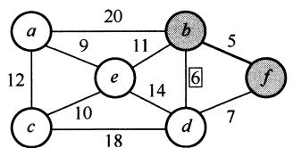
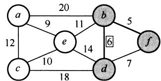
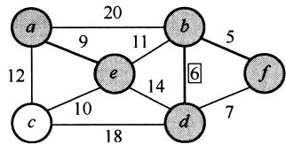
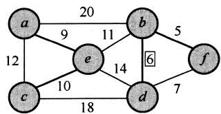
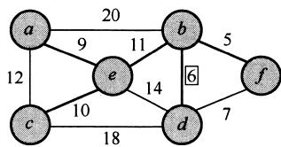
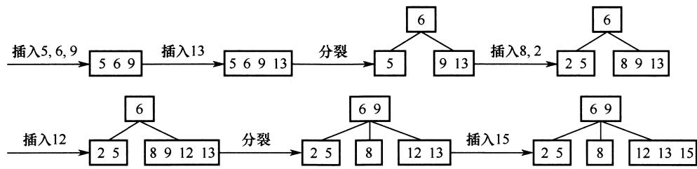
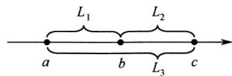
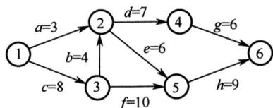

# 2020全国硕士研究生招生考试计算机学科专业基础试题参考答案

# 一、单项选择题

01. C 02. D 03. A 04. C 05. B 06. B 07. A 08. B   
09. C 10. B 11. A 12. B 13. A 14. D 15. D 16. A   
17. B 18. A 19. C 20. C 21. B 22. C 23. B 24. A   
25. D 26. D 27. B 28. D 29. B 30. D 31. B 32. C   
33. C 34. B 35. C 36. D 37. A 38. D 39. C 40. D

# 01.【解析】

上三角矩阵按列优先存储，先存储仅1个元素的第一列，再存储有2个元素的第二列，以此类推。 $m_{7,2}$ 位于左下角，对应右上角的元素为 $m_{2,7}$ ，在 $m_{2,7}$ 之前存有

第1列：1

第2列：2

··

第6列：6

第7列：1

前面共存有 $1 + 2 + 3 + 4 + 5 + 6 + 1 = 22$ 个元素（数组下标范围为 $0 \sim 21$ ），注意数组下标从0开始，故 $m_{2,7}$ 在数组N中的下标为22，即 $m_{7,2}$ 在数组N中的下标为22。

# 02.【解析】

按题意，出入栈操作的过程如下：

<table><tr><td>操作</td><td>栈内元素</td><td>出栈元素</td></tr><tr><td>Push</td><td>a</td><td></td></tr><tr><td>Push</td><td>a b</td><td></td></tr><tr><td>Pop</td><td>a</td><td>b</td></tr><tr><td>Push</td><td>a c</td><td></td></tr><tr><td>Pop</td><td>a</td><td>c</td></tr><tr><td>Push</td><td>a d</td><td></td></tr><tr><td>Push</td><td>a d e</td><td></td></tr><tr><td>Pop</td><td>a d</td><td>e</td></tr></table>

故出栈序列为 $b, c, e$ 。

# 03.【解析】

二叉树采用顺序存储时，用数组下标来表示结点之间的父子关系。对于一棵高度为5的二

叉树，为了满足任意性，其 $1\sim 5$ 层的所有结点都要被存储起来，即考虑为一棵高度为5的满二叉树，总共需要存储单元的数量为 $1 + 2 + 4 + 8 + 16 = 31$

04.【解析】

森林 $F$ 的先根遍历序列对应其二叉树 $T$ 的先序遍历序列，森林 $F$ 的中根遍历序列对应其二叉树 $T$ 的中序遍历序列。即 $T$ 的先序遍历序列为 $a, b, c, d, e, f$ ，中序遍历序列为 $b, a, d, f, e, c$ 。根据二叉树 $T$ 的先序序列和中序序列可以唯一确定它的结构，构造过程如下：


可以得到二叉树 $T$ 的后序序列为 $b, f, e, d, c, a$ 。

05.【解析】

每个选项都逐一验证，选项B生成二叉排序树的过程如下：


显然选项B错误。

06.【解析】

DFS 是一个递归算法，在遍历过程中，先访问的顶点被压入栈底。设在图中有顶点 $v_{i}$ ，它有后继顶点 $v_{j}$ ，即存在边 $\langle v_{i}, v_{j} \rangle$ 。根据 DFS 的规则， $v_{i}$ 入栈后，必先遍历完其后继顶点后 $v_{i}$ 才会出栈，也就是说 $v_{i}$ 会在 $v_{j}$ 之后出栈，在如题所指的过程中， $v_{i}$ 在 $v_{j}$ 后打印。由于 $v_{i}$ 和 $v_{j}$ 具有任意性，从上面的规律可以看出，输出顶点的序列是逆拓扑有序序列。

07.【解析】

Kruskal 算法：按权值递增顺序依次选取 $n - 1$ 条边，并保证这 $n - 1$ 条边不构成回路。初始构造一个仅含 $n$ 个顶点的森林；第一步，选取权值最小的边 $(b, f)$ 加入最小生成树；第二步，剩余边中权值最小的边为 $(b, d)$ ，加入最小生成树，第二步操作后权值最小的边 $(d, f)$ 不能选，因为会与之前已选取的边形成回路；接下来依次选取权值 9, 10, 11 对应的边加入最小生成树，此时 6 个顶点形成了一棵树，最小生成树构造完成。按照上述过程，加到最小生成树的边依次为 $(b, f), (b, d), (a, e), (c, e), (b, e)$ 。其生成过程如下所示。

  
第一步选取边 $< b,f>$

  
第二步选取边 $< b,d>$

  
第三步选取边 $<  a,e>$

  
第四步选取边 $<  c,e>$

  
第五步选取边 $<  b,e>$

# 08.【解析】

关键路径是指权值之和最大而非边数最多的路径，故选项A错误。选项B正确，是关键路径的概念。无论是存在一条还是存在多条关键路径，增加任一关键活动的时间都会延长工程的工期，因为关键路径始终是权值之和最大的那条路径，选项C错误。仅有一条关键路径时，减少关键活动的时间会缩短工程的工期；存在多条关键路径时，缩短一条关键活动的时间不一定会缩短工程的工期，缩短了路径长度的那条关键路径不一定还是关键路径，选项D错误。

# 09.【解析】

这是一道简单的概念题。堆是一棵完全树，采用一维数组存储，故 I 正确，II 正确。大根堆只要求根结点值大于左右孩子值，并不要求左右孩子值有序，III 错误。堆的定义是递归的，所以其左右子树也是大根堆，所以堆的次大值一定是其左孩子或右孩子，IV 正确。

# 10.【解析】

一个4阶B树的任意非叶结点至多含有 $m - 1 = 3$ 个关键字，在关键字依次插入的过程中，会导致结点的不断分裂，插入过程如下所示。



得到根结点包含的关键字为6，9。

# 11.【解析】

考虑较极端的情况，对于有序数组，直接插入排序的比较次数为 $n - 1$ ，简单选择排序的比较次数始终为 $1 + 2 + \dots + n - 1 = n(n - 1) / 2$ ，I 正确。两种排序方法的辅助空间都是 $O(1)$ ，无差别，II 错误。初始有序时，移动次数均为 0；对于通常情况，直接插入排序每趟插入都

需要依次向后挪位，而简单选择排序只需与找到的最小元素交换位置，后者的移动次数少很多，III错误。

# 12.【解析】

机器字长是指CPU内部用于整数运算的数据通路的宽度。CPU内部数据通路是指CPU内部的数据流经的路径及路径上的部件，主要是CPU内部进行数据运算、存储和传送的部件，这些部件的宽度基本上要一致才能相互匹配。因此，机器字长等于CPU内部用于整数运算的运算器位数和通用寄存器宽度。

# 13.【解析】

$$
\mathrm {C 8 0 0 0 0 0 0 H = 1 1 0 0 1 0 0 0 0 0 0 0 0 0 0 0 0 0 0 0 0 0 0 0 0 0}
$$

将其转换为对应的float型或int型：

1）为float型时，尾数隐藏最高位1，数符为1表示负数，阶码 $10010000 = 2^{7} + 2^{4} = 128 + 16$ ，再减去偏置值127得到17，算出 $x$ 值为 $-2^{17}$ 。  
2）为int型时，带符号补码，为负数，数值部分取反加1，得0111000000000000000000000000，算出 $x$ 值为 $-7\times 2^{27}$ 。

# 14.【解析】

在32位计算机中，按字节编址，根据小端方式和按边界对齐的定义，给出变量a的存放方式如下：

<table><tr><td>地址</td><td>2020 FE00H</td><td>2020 FE01H</td><td>2020 FE02H</td><td>2020 FE03H</td></tr><tr><td></td><td>未知</td><td>未知</td><td></td><td></td></tr><tr><td rowspan="2">说明地址</td><td>x1(LSB)</td><td colspan="3">x1(MSB)</td></tr><tr><td>2020 FE04H</td><td>2020 FE05H</td><td>2020 FE06H</td><td>2020 FE07H</td></tr><tr><td></td><td>00H</td><td>00H</td><td>34H</td><td>12H</td></tr><tr><td>说明</td><td colspan="3">x2(LSB)</td><td>x2(MSB)</td></tr></table>

于是，34H所在存储单元的地址为2020FE06H。

# 15.【解析】

Cache 由 SRAM 组成；TLB 通常由相联存储器组成，也可由 SRAM 组成。DRAM 需要不断刷新，性能偏低，不适合组成 TLB 和 Cache。选项 A、B 和 C 都是 TLB 和 Cache 的特点。

# 16.【解析】

48条指令需要6位操作码字段 $(2^{5} < 48 < 2^{6})$ ，4种寻址方式需要2位寻址特征位 $(4 = 2^{2})$ 还剩 $16 - 6 - 2 = 8$ 位作为地址码，故直接寻址范围为 $0\sim 255$ 。注意，主存地址不能为负。

# 17.【解析】

CPI表示执行指令所需的时钟周期数。对于一个程序或一台机器来说，其CPI指执行该程序或机器指令集中的所有指令所需的平均时钟周期数。对于单周期CPU，令指令周期 $=$ 时钟周期， $\mathrm{CPI} = 1$ ，I正确。对于多周期CPU，CPU的执行过程分成几个阶段，每个阶段用一个时钟去完成，每种指令所用的时钟数可以不同， $\mathrm{CPI} > 1$ ，II错误。对于基本流水线CPU，让每个时钟周期流出一条指令， $\mathrm{CPI} = 1$ ，III正确。超标量流水线CPU在每个时钟周期内

并发执行多条独立的指令，每个时钟周期流出多条指令， $\mathrm{CPI} < 1$ ，IV 错误。

# 18.【解析】

自陷是一种内部异常，A 错误。在 $80 \times 86$ 中，用于程序调试的“断点设置”功能是通过“自陷”方式实现的，选项 B 正确。执行到自陷指令时，无条件或有条件地自动调出操作系统内核程序进行执行，选项 C 正确。CPU 执行“陷阱指令”后，会自动地根据不同“陷阱”类型进行相应的处理，然后返回到“陷阱指令”的下一条指令执行，选项 D 正确。

# 19.【解析】

每个时钟周期传送2次，故每秒传送的次数 $=$ 时钟频率 $\times 2 = 2.4\mathrm{G}\times 2 / \mathrm{s}$

总线带宽 $=$ 每秒传送次数 $\times 2\mathrm{B}\times 2 = 2.4\mathrm{G}\times 2\times 2\mathrm{B}\times 2 / \mathrm{s} = 19.2\mathrm{GB / s}$

题中已给出总线带宽公式，降低了难度。公式中的“ $\times 2B$ ”是因为每次传输16位数据，“ $\times 2$ ”是因为采用点对点全双工总线，两个方向可同时传输信息。

# 20.【解析】

访存时缺页属于内部异常，I错误；定时器到时描述的是时钟中断，属于外部中断，II正确；网络数据包到达描述的是CPU执行指令以外的事件，属于外部中断，III正确。

# 21.【解析】

由CPU内部产生的异常称为内中断，内中断都是不可屏蔽中断。通过中断请求线INTR和NMI，从CPU外部发出的中断请求为外中断，通过INTR信号线发出的外中断是可屏蔽中断，而通过NMI信号线发出的是不可屏蔽中断。不可屏蔽中断不受中断标志位的影响，即使在关中断的情况下也会被响应，选项A正确。不可屏蔽中断的处理优先级最高，任何时候只要发生不可屏蔽中断，都要中止现行程序的执行，转到不可屏蔽中断处理程序执行，选项C正确。CPU响应中断需要满足3个条件：① 中断源有中断请求；② CPU允许中断及开中断；③ 一条指令执行完毕，且没有更紧迫的任务。故选项B错误。

# 22.【解析】

周期挪用法由 DMA 控制器挪用一个或几个主存周期来访问主存，传送完一个数据字后立即释放总线，是一种单字传送方式，每个字传送完后 CPU 可以访问主存，选项 C 错误。停止 CPU 访存法则是指在整个数据块的传送过程中，使 CPU 脱离总线，停止访问主存。

# 23.【解析】

多个进程可同时以“读”或“写”方式打开文件，操作系统并不保证写操作的互斥性，进程可通过系统调用对文件加锁，保证互斥写（读者- 写者问题），选项A错误。整个系统只有一个系统打开文件表，同一个文件打开多次只需改变引用计数，选项B正确。用户进程的打开文件表关于同一个文件不一定相同，例如读写指针位置不一定相同，选项C错误。进程关闭文件时，文件的引用计数减1，引用计数变为0时才删除系统打开文件表中的表项，选项D错误。

# 24.【解析】

索引分配支持变长的文件, 同时可以随机访问文件的指定数据块, 选项 A 正确。链接分配不支持随机访问, 需要依靠指针依次访问, 选项 B 错误。连续分配的文件长度固定, 不支持

可变文件长度（连续分配的文件长度虽然也可变，但是需大量移动数据，代价较大，相比之下不太合适），选项C错误。动态分区分配是内存管理方式，不是磁盘空间的管理方式，选项D错误。

# 25.【解析】

当CPU检测到中断信号后，由硬件自动保存被中断程序的断点（即程序计数器PC），I错误。之后，硬件找到该中断信号对应的中断向量，中断向量指明中断服务程序入口地址（各中断向量统一存放在中断向量表中，该表由操作系统初始化，III正确）。接下来开始执行中断服务程序，保存PSW、保存中断屏蔽字、保存各通用寄存器的值，并提供与中断信号对应的中断服务，中断服务程序属于操作系统内核，II和IV正确。

# 26.【解析】

多级反馈队列调度算法需要综合考虑优先级数量、优先级之间的转换规则等，就绪队列的数量会影响长进程的最终完成时间，I 正确；就绪队列的优先级会影响进程执行的顺序，II 正确；各就绪队列的调度算法会影响各队列中进程的调度顺序，III 正确；进程在就绪队列中的迁移条件会影响各进程在各队列中的执行时间，IV 正确。

# 27.【解析】

首先求出需求矩阵：

$$
\text {N e e d} = \text {M a x} - \text {A l l o c a t i o n} = \left[ \begin{array}{l l} 4 & 4 \\ 3 & 1 \\ 3 & 4 \end{array} \right] - \left[ \begin{array}{l l} 2 & 3 \\ 2 & 1 \\ 1 & 2 \end{array} \right] = \left[ \begin{array}{l l} 2 & 1 \\ 1 & 0 \\ 2 & 2 \end{array} \right]
$$

由Allocation得知当前Available为(1,0)。由需求矩阵可知，初始只能满足P2的需求，选项A错误。P2释放资源后Available变为(3,1)，此时仅能满足P1的需求，选项C错误。P1释放资源后Available变为(5,4)，可以满足P3的需求，得到的安全序列为P2,P1,P3，选项B正确，选项D错误。

# 28.【解析】

I 影响缺页中断的频率，缺页率越高，平均访存时间越长；II 和 IV 影响缺页中断的处理时间，中断处理时间越长，平均访存时间越长；III 影响访问页表和访问目标物理地址的时间，故 I、II、III 和 IV 均正确。

# 29.【解析】

父进程与子进程当然可以并发执行，选项A正确。父进程可与子进程共享一部分资源，但不能共享虚拟地址空间，在创建子进程时，会为子进程分配资源，如虚拟地址空间等，选项B错误。临界资源一次只能为一个进程所用，选项D正确。进程控制块PCB是进程存在的唯一标志，每个进程都有自己的PCB，选项C正确。

# 30.【解析】

设备可视为特殊文件，选项A正确。用户使用逻辑设备名来访问物理文件，有利于设备独立性，选项B正确。通过逻辑设备名访问物理设备时，需要建立逻辑设备和物理设备之间的映射关系，选项C正确。应用程序按逻辑设备名访问设备，再经驱动程序的处理来控制

物理设备，若更换物理设备，则只需更换驱动程序，而无须修改应用程序，选项D错误。

# 31.【解析】

在总长为64字节的目录项中，索引结点占4字节，即32位。不同目录下的文件的文件名可以相同，所以在考虑系统创建最多文件数量时，只需考虑索引结点的个数，即创建文件数量上限 $=$ 索引结点数量上限。整个系统中最多存储 $2^{32}$ 个索引结点，因此整个系统最多可以表示 $2^{32}$ 个文件，选项B正确。

# 32.【解析】

实现临界区互斥需满足多个准则。“忙则等待”准则，即两个进程不能同时访问临界区，I正确。“空闲让进”准则，若临界区空闲，则允许其他进程访问，II正确。“有限等待”准则，即进程应该在有限时间内访问临界区，III正确。I、II和III是互斥机制必须遵循的原则。IV是“让权等待”准则，不一定非得实现，如皮特森算法。

# 33.【解析】

协议由语法、语义和时序（又称同步）三部分组成。语法规定了通信双方彼此“如何讲”，即规定了传输数据的格式。语义规定了通信双方彼此“讲什么”，规定了所要完成的功能，如通信双方要发出什么控制信息、执行的动作和返回的应答。时序规定了信息交流的次序。由图可知发送方与接收方依次交换信息，体现了协议三要素中的时序要素。

# 34.【解析】

虚电路服务需要有建立连接过程，每个分组使用短的虚电路号，属于同一条虚电路的分组按照同一路由进行转发，分组到达终点的顺序与发送顺序相同，可以保证有序传输，不需要为每条虚电路预分配带宽。

# 35.【解析】

网络层设备路由器可以隔离广播域和冲突域；链路层设备普通交换机只能隔离冲突域；物理层设备集线器、中继器既不能隔离冲突域又不能隔离广播域。因此，题中共有2个广播域、4个冲突域。


# 36.【解析】

发送数据帧和确认帧的时间均为 $t = 1000 \times 8\mathrm{b} / 10\mathrm{kbps} = 800\mathrm{ms}$ 。

发送周期 $T = 800\mathrm{ms} + 200\mathrm{ms} + 800\mathrm{ms} + 200\mathrm{ms} = 2000\mathrm{ms}$ 。

信道利用率 $= t / T \times 100\% = 800 / 2000 \times 100\% = 40\%$

# 37.【解析】

为了尽量避免碰撞，802.11规定，所有站在完成发送后，必须等待一段很短的时间（继续监听）才能发送下一帧。这段时间称为帧间间隔（InterFrame Space，IFS）。帧间间隔的长短取决于该站要发送的帧的类型。IEEE 802.11使用3种帧间间隔：

DIFS（分布式协调IFS）：最长的IFS，优先级最低，用于异步帧竞争访问的时延。

PIFS（点协调IFS）：中等长度的IFS，优先级居中，在PCF操作中使用。

SIFS（短IFS）：最短的IFS，优先级最高，用于需要立即响应的操作。

网络中的控制帧及所接收数据的确认帧都采用SIFS作为发送之前的等待时延。当结点要发送数据帧时，载波监听到信道空闲时，需等待DIFS后发送RTS预约信道，图中IFS1对应的是帧间间隔DIFS，时间最长，图中IFS2、IFS3、IFS4对应SIFS。

# 38.【解析】

由于慢开始门限ssthresh可以根据需求设置，为了求拥塞窗口从8KB增长到32KB所需的最长时间，可以假定慢开始门限小于等于8KB，只要不出现拥塞，拥塞窗口就都是加法增大，每经历一个传输轮次(RTT)，拥塞窗口逐次加1，所需最长时间为 $(32 - 8)\times 2\mathrm{ms} = 48\mathrm{ms}$ 。

# 39.【解析】

甲与乙建立TCP连接时发送的SYN段中的序号为1000，则在数据传输阶段所用的起始序号为1001；断开连接时，甲发送给乙的FIN段中的序号为5001，在无任何重传的情况下，甲向乙已经发送的应用层数据的字节数为 $5001 - 1001 = 4000$ 。

# 40.【解析】

题中 RTT 均为局域网内主机（主机 H、本地域名服务器）访问 Internet 上各服务器的往返时间，且忽略其他时延，因此主机 H 向本地域名服务器的查询时延忽略不计。最短时间：本地主机中有该域名到 IP 地址对应的记录，因此不需要 DNS 查询时延，直接和 www.abc.com 服务器建立 TCP 连接再进行资源访问，TCP 连接建立需要 1 个 RTT，接着发送访问请求并收到服务器资源响应需要 1 个 RTT，共计 2 个 RTT，即 $20\mathrm{ms}$ ；最长时间：本地主机递归查询本地域名服务器（延时忽略），本地服务器依次迭代查询根域名服务器、com 顶级域名服务器、abc.com 域名服务器，共 3 个 RTT，查询到 IP 地址后，将该映射返回给主机 H，主机 H 和 www.abc.com 服务器建立 TCP 连接再进行资源访问，共 2 个 RTT，因此最长时间需要 $3 + 2 = 5$ 个 RTT，即 $50\mathrm{ms}$ 。

# 二、综合应用题

# 41.【解析】

分析。由 $D = |a - b| + |b - c| + |c - a|\geqslant 0$ 得：

① 当 $a = b = c$ 时，距离最小。  
(2) 其余情况。不失一般性, 假设 $a \leqslant b \leqslant c$ , 观察下面的数轴:



$$
L _ {1} = | a - b |, L _ {2} = | b - c |, L _ {3} = | c - a |, D = | a - b | + | b - c | + | c - a | = L _ {1} + L _ {2} + L _ {3} = 2 L _ {3}
$$

由 $D$ 的表达式可知，事实上决定 $D$ 大小的关键是 $a$ 和 $c$ 之间的距离，于是问题就可以简化为每次固定 $c$ 找一个 $a$ 使得 $L_{3} = |c - a|$ 最小。

1）算法的基本设计思想

① 使用 $D_{\min}$ 记录所有已处理过的三元组的最小距离，初值为一个足够大的整数。  
② 集合 $S_{1}, S_{2}$ 和 $S_{3}$ 分别保存在数组 A、B、C 中。数组的下标变量 $i = j = k = 0$ ，当 $i < |S_{1}|$ 时， $j < |S_{2}|$ 且 $k < |S_{3}|$ 时（ $|S|$ 表示集合 $S$ 中的元素个数），循环执行 a)~c)。

a) 计算 $(\mathbf{A}[i], \mathbf{B}[j], \mathbf{C}[k])$ 的距离 $D$ ；（计算 $D$ ）  
b) 若 $D < D_{\min}$ , 则 $D_{\min} = D$ ; （更新 $D$ ）  
c) 将 $\mathrm{A}[i], \mathrm{B}[j], \mathrm{C}[k]$ 中的最小值的下标 $+1$ ；（对照分析：最小值为 $a$ ，最大值为 $c$ ，这里 $c$ 不变而更新 $a$ ，试图寻找更小距离 $D$ ）

③ 输出 $D_{\mathrm{min}}$ ，结束。

2）算法实现：

```c
define INT_MAX 0x7FFFFFF  
int abs_(int a){//计算绝对值  
if(a<0) return -a;  
else return a;  
}  
bool xls_min(int a,int b,int c){//a是否是三个数中的最小值  
if(a<=b&&a<=c) return true;  
return false;  
}  
int findMinofTrip(int A[],int n,int B[],int m,int C[],int p){  
//D_min用于记录三元组的最小距离，初值赋为INT_MAX  
int i=0,j=0,k=0,D_min=INT_MAX,D;  
while(i<n&&j<m&&k<p&&D_min>0){  
D=abs_(A[i]-B[j])+abs_(B[j]-C[k])+abs_(C[k]-A[i]); //计算D  
if(D<D_min) D_min=D; //更新D  
if(xls_min(A[i],B[j],C[k])) i++; //更新a  
else if(xls_min(B[j],C[k],A[i])) j++;  
else k++;  
}  
return D_min;
```

3）设 $n = \left|S_1\right| + \left|S_2\right| + \left|S_3\right|$ ，时间复杂度为 $O(n)$ ，空间复杂度为 $O(1)$ 。

# 42.【解析】

1) 使用一棵二叉树保存字符集中各字符的编码, 每个编码对应于从根开始到达某叶结点的一条路径, 路径长度等于编码位数, 路径到达的叶结点中保存该编码对应的字符。  
2）从左至右依次扫描0/1串中的各位。从根开始，根据串中当前位沿当前结点的左子指针或右子指针下移，直到移动到叶结点时为止。输出叶结点中保存的字符。然后从根开始重复这个过程，直到扫描到0/1串结束，译码完成。

3) 二叉树既可用于保存各字符的编码, 又可用于检测编码是否具有前缀特性。判定编码是否具有前缀特性的过程, 也是构建二叉树的过程。初始时, 二叉树中仅含有根结点, 其左子指针和右子指针均为空。

依次读入每个编码C，建立/寻找从根开始对应于该编码的一条路径，过程如下：

对每个编码，从左至右扫描 C 的各位，根据 C 的当前位（0 或 1）沿结点的指针（左子指针或右子指针）向下移动。当遇到空指针时，创建新结点，让空指针指向该新结点并继续移动。沿指针移动的过程中，可能遇到三种情况：

(1) 若遇到了叶结点 (非根), 则表明不具有前缀特性, 返回。

(2) 若在处理 C 的所有位的过程中, 均没有创建新结点, 则表明不具有前缀特性, 返回。

(3) 若在处理 C 的最后一个编码位时创建了新结点, 则继续验证下一个编码。

若所有编码均通过验证，则编码具有前缀特性。

# 43.【解析】

1）乘法运算可以通过加法和移位来实现。编译器可以将乘法运算转换为一个循环代码段，在循环代码段中通过比较、加法和移位等指令实现乘法运算。

2）控制逻辑的作用是控制循环次数，控制加法和移位操作。

3) ①最长, ③最短。对于①, 需要用循环代码段（即软件）实现乘法操作, 因而需要反复执行很多条指令, 而每条指令都需要取指令、译码、取数、执行并保存结果, 所以执行时间很长; 对于②和③, 都只需用一条乘法指令实现乘法操作, 不过②中的乘法指令需要多个时钟周期才能完成, 而③中的乘法指令可以在一个时钟周期内完成, 所以③的执行时间最短。

4）当 $n = 32, x = 2^{31} - 1, y = 2$ 时，带符号整数和无符号整数乘法指令得到的64位乘积都是00000000FFFF FFFEH。int型的表示范围为 $[-2^{31}, 2^{31} - 1]$ ，故函数imul()的结果溢出；unsigned int型的表示范围为 $[0, 2^{32} - 1]$ ，故函数umul()的结果不溢出。对于无符号整数乘法，若乘积高 $n$ 位全为0，即使低 $n$ 位全为1也正好是 $2^{32} - 1$ ，不溢出，否则溢出。

# 44.【解析】

1) 主存块大小为 $64 \mathrm{~B} = 2^{6}$ 字节, 所以主存地址低 6 位为块内地址, Cache 组数为 $32 \mathrm{KB} / (64 \mathrm{~B} \times 8) = 64 = 2^{6}$ , 故主存地址中间 6 位为 Cache 组号, 主存地址中高 $32 - 6 - 6 = 20$ 位为标记, 采用 8 路组相联映射, 故每行中的 LRU 位占 3 位, 采用直写方式, 故没有修改位。

(2) $008000\mathrm{C} 0 \mathrm{H} = 0000000010000000000011000000 \mathrm{~B}$ , 主存地址的低 6 位为块内地址, 为全 0 , 故 s 位于一个主存块的开始处, 占 $1024 \times 4 \mathrm{~B} / 64 \mathrm{~B} = 64$ 个主存块; 在执行程序段的过程中, 每个主存块中的 $64 \mathrm{~B} / 4 \mathrm{~B} = 16$ 个数组元素依次读、写 1 次, 因而对每个主存块, 总是第一次访问缺失, 此时会将整个主存块调入 Cache , 之后每次都命中。综上, 数组 s 的数据 Cache 访问缺失次数为 64 次。

3) $00010003 \mathrm{H} = 000000000000001000000000011 \mathrm{~B}$ , 根据主存地址划分可知, 组索引为 0 , 故该地址所在主存块被映射到指令 Cache 的第 0 组; 因为 Cache 初始为空,所有 Cache 行的有效位均为 0 , 所以 Cache 访问缺失。此时, 将该主存块取出后存入指令 Cache 的第 0 组的任意一行, 并将主存地址高 20 位 (00010H) 填入该行标记字段,设置有效位, 修改 LRU 位, 最后根据块内地址 000011B 从该行中取出相应的内容。

# 45.【解析】

本题要求实现操作的先后顺序，没有互斥关系，是一个简单的同步问题。

本题虽然有5个操作，但是只有4个同步关系，因此分别设置信号量SAC、SBC、SCE和SDE对应4个同步关系。

```txt
Semaphore SAC = 0; //控制A和C的执行顺序  
Semaphore SBC = 0; //控制B和C的执行顺序  
Semaphore SCE = 0; //控制C和E的执行顺序  
Semaphore SDE = 0; //控制D和E的执行顺序 
```

# 5个操作可描述为如下。

CoBegin  
A（）{完成动作A； $\mathrm{V}(\mathrm{S}_{\mathrm{AC}})$ //实现A、C之间的同步关系  
1  
B（）{完成动作B； $\mathrm{V}(\mathrm{S}_{\mathrm{BC}})$ //实现B、C之间的同步关系  
1  
C（）{//C必须在A、B都完成后才能完成 $\mathrm{P}(\mathrm{S}_{\mathrm{AC}})$ ： $\mathrm{P}(\mathrm{S}_{\mathrm{BC}})$ ：完成动作C； $\mathrm{V}(\mathrm{S}_{\mathrm{CE}})$ //实现C、E之间的同步关系  
1  
D（）{完成动作D； $\mathrm{V}(\mathrm{S}_{\mathrm{DE}})$ //实现D、E之间的同步关系  
1  
E（）{//E必须在完成C、D之后执行 $\mathrm{P}(\mathrm{S}_{\mathrm{CE}})$ ： $\mathrm{P}(\mathrm{S}_{\mathrm{DE}})$ 完成动作E；  
1  
CoEnd

# 46.【解析】

1）① 页面大小 $= 2^{12}\mathrm{B} = 4096\mathrm{B} = 4\mathrm{KB}$ 。每个数组元素4B，每个页面可以存放 $4\mathrm{KB} / 4\mathrm{B} =$ 1024个数组元素，正好是数组的一行，数组a按行优先方式存放。10800000H的虚页号为10800H，因此a[0]行存放在虚页号为10800H的页面中，a[1]行存放在页号为10801H的页面中。a[1][2]的虚拟地址为 $10801000\mathrm{H} + 4\times 2 = 10801008\mathrm{H}$

(2) 转换为二进制 00010000100000000001000000001000, 根据虚拟地址结构可知, 对应的页目录号为 $042 \mathrm{H}$ , 页号为 $001 \mathrm{H}$ 。  
③ 进程的页目录表起始地址为 $00201000\mathrm{H}$ ，每个页目录项长4B，因此042H号页目录项的物理地址是 $00201000\mathrm{H} + 4\times 42\mathrm{H} = 00201108\mathrm{H}$ 。  
(4) 页目录项存放的页框号为 $00301 \mathrm{H}$ , 二级页表的起始地址为 $00301000 \mathrm{H}$ , 因此 a[1][2]所在页的页号为 $001 \mathrm{H}$ , 每个页表项 4B, 因此对应的页表项物理地址是 $00301000 \mathrm{H} + 001 \mathrm{H} \times 4 = 00301004 \mathrm{H}$ 。

2）根据数组的随机存取特点，数组a在虚拟地址空间中所占的区域必须连续，由于数组a不止占用一页，相邻逻辑页在物理上不一定相邻，因此数组a在物理地址空间中所占的区域可以不连续。  
3）由1）可知每个页面正好可以存放一整行的数组元素，“按行优先方式存放”意味着数组的同一行的所有元素都存放在同一个页面中，同一列的各个元素都存放在不同的页面中，因此数组a按行遍历的局部性较好。

# 47.【解析】

1）两个子网使用了相同的网段，且路由器开启了NAT功能，加上题干给出了NAT表的结构，因此需要配置NAT表。路由器R2开启NAT服务，当路由器R2从WAN口收到H2或H3发来的数据时，根据NAT表发送给Web服务器的对应端口。外网IP地址应该为路由器的外端IP地址，内网IP地址应该为Web服务器的地址，Web服务器的默认端口为80，因此内网端口号固定为80，当其他网络的主机访问Web服务器时，默认访问的端口应该也是80，但是访问的目的IP是路由器的IP地址，因此NAT表中的外部端口最好也统一为80。题目中并未要求对H1进行访问，因此H1的NAT表项可以不写。R2的NAT表配置如下：

<table><tr><td colspan="2">外网</td><td colspan="2">内网</td></tr><tr><td>IP地址</td><td>端口号</td><td>IP地址</td><td>端口号</td></tr><tr><td>203.10.2.2</td><td>80</td><td>192.168.1.2</td><td>80</td></tr></table>

2）由于启用了NAT服务，H2发送的P的源IP地址应该是H2的内网地址，目的地址应该是R2的外网IP地址，源IP地址是192.168.1.2，目的IP地址是203.10.2.2。R3转发后，将P的源IP地址改为R3的外网IP地址，目的IP地址仍然不变，源IP地址是203.10.2.6，目的IP地址是203.10.2.2。R2转发后，将P的目的IP地址改为Web服务器的内网地址，源地址仍然不变，源IP地址是203.10.2.6，目的IP地址是192.168.1.2。

# 2019全国硕士研究生招生考试计算机学科专业基础试题

# 一、单项选择题

第 $01\sim 40$ 小题，每小题2分，共80分。下列每题给出的四个选项中，只有一个选项最符合试题要求。

01. 设 $n$ 是描述问题规模的非负整数，下列程序段的时间复杂度是（ ）。

$$
\begin{array}{l} \mathrm {x = 0 ;} \\ \text {w h i l e (n > = (x + 1) * (x + 1))} \\ \mathrm {x = x + 1 ;} \end{array}
$$

A. $O(\log n)$

B. $O\left(n^{1 / 2}\right)$

C. $O(n)$

D. $O(n^{2})$

02. 若将一棵树 $T$ 转化为对应的二叉树 BT，则下列对 BT 的遍历中，其遍历序列与 $T$ 的后根遍历序列相同的是（）。

A. 先序遍历

B. 中序遍历

C. 后序遍历

D. 按层遍历

03. 对 $n$ 个互不相同的符号进行哈夫曼编码。若生成的哈夫曼树共有 115 个结点, 则 $n$ 的值是 ( )。

A. 56

B. 57

C. 58

D. 60

04. 在任意一棵非空平衡二叉树（AVL 树） $T_{1}$ 中，删除某结点 $\nu$ 之后形成平衡二叉树 $T_{2}$ ，再将 $\nu$ 插入 $T_{2}$ 形成平衡二叉树 $T_{3}$ 。下列关于 $T_{1}$ 与 $T_{3}$ 的叙述中，正确的是（）。

I. 若 $\nu$ 是 $T_{1}$ 的叶结点，则 $T_{1}$ 与 $T_{3}$ 可能不相同

II. 若 $\nu$ 不是 $T_{1}$ 的叶结点，则 $T_{1}$ 与 $T_{3}$ 一定不相同

III. 若 $\nu$ 不是 $T_{1}$ 的叶结点，则 $T_{1}$ 与 $T_{3}$ 一定相同

A. 仅 I

B. 仅 II

C. 仅 I、II

D. 仅 I、III

05. 下图所示的 AOE 网表示一项包含 8 个活动的工程。活动 $d$ 的最早开始时间和最迟开始时间分别是（）。



A. 3 和 7

B. 12 和 12

C. 12 和 14

D. 15 和 15

06. 用有向无环图描述表达式 $(x + y)((x + y) / x)$ ，需要的顶点个数至少是（）。