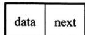
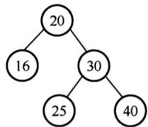
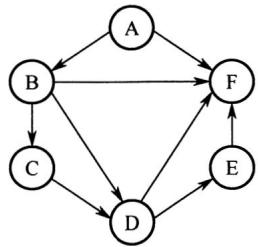
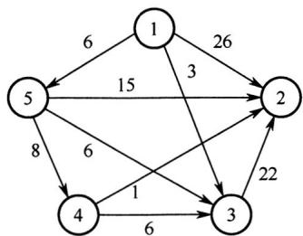
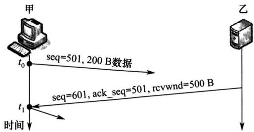
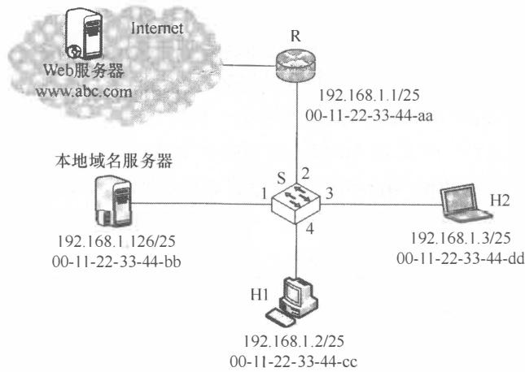

# 2021全国硕士研究生招生考试计算机学科专业基础试题

# 一、单项选择题

第 $01\sim 40$ 小题，每小题2分，共80分。下列每题给出的四个选项中，只有一个选项最符合试题要求。

01. 已知头指针 h 指向一个带头结点的非空单循环链表, 结点结构为



其中 next 是指向直接后继结点的指针，p 是尾指针，q 是临时指针。现要删除该链表的第一个元素，正确的语句序列是（）。

A. $h->next=h->next->next; q=h->next; free(q)$ ;   
B. $q = h \rightarrow$ next; $h \rightarrow$ next $= h \rightarrow$ next $\rightarrow$ next; free(q);   
C. $q = h\rightarrow$ next; $\mathbf{h}\rightarrow$ next $= q\rightarrow$ next; if $(p! = q)p = h$ free(q);   
D. $q = h\rightarrow$ next; $\mathbf{h}\rightarrow$ next $= q\rightarrow$ next; if $(p == q)p = h$ free(q);

02. 已知初始为空的队列 Q 的一端仅能进行入队操作, 另外一端既能进行入队操作又能进行出队操作。若 Q 的入队序列是 $1, 2, 3, 4, 5$ , 则不能得到的出队序列是 ( )。

A. 5,4,3,1,2

B. 5,3,1,2,4

C. $4,2,1,3,5$

D. 4,1,3,2,5

03. 已知二维数组 A 按行优先方式存储, 每个元素占用 1 个存储单元。若元素 A[0][0]的存储地址是 100, A[3][3]的存储地址是 220, 则元素 A[5][5]的存储地址是 ( )。

A. 295

B. 300

C. 301

D. 306

04. 某森林 $F$ 对应的二叉树为 $T$ , 若 $T$ 的先序遍历序列是 $\mathbf{a}, \mathbf{b}, \mathbf{d}, \mathbf{c}, \mathbf{e}, \mathbf{g}, \mathbf{f}$ , 中序遍历序列是 $\mathbf{b}, \mathbf{d}, \mathbf{a}, \mathbf{e}, \mathbf{g}, \mathbf{c}, \mathbf{f}$ , 则 $F$ 中树的棵数是（ ）。

A. 1

B. 2

C. 3

D. 4

05. 若某二叉树有 5 个叶结点, 其权值分别为 10, 12, 16, 21, 30 , 则其最小的带权路径长度 (WPL) 是 ( )。

A. 89

B. 200

C. 208

D. 289

06. 给定平衡二叉树如下图所示，插入关键字 23 后，根中的关键字是（）。



A. 16

B. 20

C. 23

D. 25

07. 给定如下有向图，该图的拓扑有序序列的个数是（ ）。



A. 1

B. 2

C. 3

D. 4

08. 使用 Dijkstra 算法求下图中从顶点 1 到其余各顶点的最短路径, 将当前找到的从顶点 1 到顶点 2,3,4,5 的最短路径长度保存在数组 dist 中, 求出第二条最短路径后, dist 中的内容更新为 ( )。



A. 26,3,14,6

B. 25, 3, 14, 6

C. 21,3,14,6

D. 15,3,14,6

09. 在一棵高度为3的3阶B树中，根为第1层，若第2层中有4个关键字，则该树的结点个数最多是（）。

A. 11

B. 10

C. 9

D. 8

10. 设数组 $\mathbf{S}[] = \{93, 946, 372, 9, 146, 151, 301, 485, 236, 327, 43, 892\}$ ，采用最低位优先（LSD）基数排序将 S 排列成升序序列。第 1 趟分配、收集后，元素 372 之前、之后紧邻的元素分别是（）。

A. 43,892

B. 236, 301

C. 301, 892

D. 485, 301

11. 将关键字 6,9,1,5,8,4,7 依次插入到初始为空的大根堆 H 中，得到的 H 是（）。

A. 9,8,7,6,5,4,1

B. 9, 8, 7, 5, 6, 1, 4

C. 9, 8, 7, 5, 6, 4, 1

D. 9, 6, 7, 5, 8, 4, 1

12. 2017年公布的全球超级计算机TOP500排名中，我国“神威·太湖之光”超级计算机蝉联第一，其浮点运算速度为93.0146PFLOPS，说明该计算机每秒钟内完成的浮点操作次数约为（）。

A. $9.3 \times 10^{13}$ 次

B. $9.3 \times 10^{15}$ 次

C. 9.3 千万亿次

D. 9.3亿亿次

13. 已知带符号整数用补码表示，变量 $x, y, z$ 的机器数分别为 FFFDH, FFDFH, 7FFCH，下列结论中，正确的是（）。

A. 若 $x, y$ 和 $z$ 为无符号整数，则 $z < x < y$   
B. 若 $x, y$ 和 $z$ 为无符号整数，则 $x < y < z$   
C. 若 $x, y$ 和 $z$ 为带符号整数，则 $x < y < z$   
D. 若 $x, y$ 和 $z$ 为带符号整数，则 $y < x < z$

14. 下列数值中，不能用 IEEE 754 浮点格式精确表示的是（）。

A. 1.2

B. 1.25

C. 2.0

D. 2.5

15. 某计算机的存储器总线中有 24 位地址线和 32 位数据线, 按字编址, 字长为 32 位。如果 $00000\mathrm{H} \sim 3\mathrm{F}$ FFFFH 为 RAM 区, 那么需要 $512\mathrm{K} \times 8$ 位的 RAM 芯片数为 ( )。

A. 8

B. 16

C. 32

D. 64

16. 若计算机主存地址为 32 位, 按字节编址, Cache 数据区大小为 $32 \mathrm{KB}$ , 主存块大小为 $32 \mathrm{~B}$ , 采用直接映射方式和回写 (Write Back) 策略, 则 Cache 行的位数至少是 ( )。

A. 275

B. 274

C. 258

D. 257

17. 下列寄存器中，汇编语言程序员可见的是（ ）。

I. 指令寄存器

II. 微指令寄存器

III. 基址寄存器

IV. 标志/状态寄存器

A. 仅 I、II

B. 仅 I、IV

C. 仅 II、IV

D. 仅 III、IV

18. 下列关于数据通路的叙述中，错误的是（ ）。

A. 数据通路包含 ALU 等组合逻辑（操作）元件  
B. 数据通路包含寄存器等时序逻辑（状态）元件  
C. 数据通路不包含用于异常事件检测及响应的电路  
D. 数据通路中的数据流动路径由控制信号进行控制

19. 下列关于总线的叙述中，错误的是（ ）。

A. 总线是在两个或多个部件之间进行数据交换的传输介质  
B. 同步总线由时钟信号定时, 时钟频率不一定等于工作频率  
C. 异步总线由握手信号定时, 一次握手过程完成一位数据交换  
D. 突发（Burst）传送总线事务可以在总线上连续传送多个数据

20. 下列选项中，不属于 I/O 接口的是（ ）。

A. 磁盘驱动器

B. 打印机适配器

C. 网络控制器

D. 可编程中断控制器

21. 异常事件在当前指令执行过程中进行检测，中断请求则在当前指令执行后进行检测。下列事件中，相应处理程序执行后，必须回到当前指令重新执行的是（）。

A. 系统调用

B. 页缺失

C. DMA 传送结束

D. 打印机缺纸

22. 下列是关于多重中断系统中 CPU 响应中断的叙述，其中错误的是（）。

A. 仅在用户态（执行用户程序）下，CPU 才能检测和响应中断  
B. CPU 只有在检测到中断请求信号后, 才会进入中断响应周期  
C. 进入中断响应周期时, CPU 一定处于中断允许 (开中断) 状态  
D. 若 CPU 检测到中断请求信号, 则一定存在未被屏蔽的中断源请求信号

23. 下列指令中，只能在内核态执行的是（ ）。

A. trap指令

B. I/O 指令

C. 数据传送指令

D. 设置断点指令

24. 下列操作中，操作系统在创建新进程时，必须完成的是（）。

I. 申请空白的进程控制块

II. 初始化进程控制块

III. 设置进程状态为执行态

A. 仅 I

B. 仅 I、II

C. 仅 I、III

D. 仅 II、III

25. 下列内核的数据结构或程序中，分时系统实现时间片轮转调度需要使用的是（）。

I. 进程控制块

II. 时钟中断处理程序

III. 进程就绪队列

IV. 进程阻塞队列

A. 仅 II、III

B. 仅 I、IV

C. 仅 I、II、III

D. 仅 I、II、IV

26. 某系统中磁盘的磁道数为 200 (0~199), 磁头当前在 184 号磁道上。用户进程提出的磁盘访问请求对应的磁道号依次为 184, 187, 176, 182, 199。若采用最短寻道时间优先调度算法 (SSTF) 完成磁盘访问, 则磁头移动的距离 (磁道数) 是 ( )。

A. 37

B. 38

C. 41

D. 42

27. 下列事件中，可能引起进程调度程序执行的是（ ）。

I. 中断处理结束

II. 进程阻塞

III. 进程执行结束

IV. 进程的时间片用完

A. 仅 I、III

B. 仅 II、IV

C. 仅 III、IV

D. I、II、III和IV

28. 某请求分页存储系统的页大小为 4KB，按字节编址。系统给进程 P 分配 2 个固定的页框，并采用改进型 Clock 置换算法，进程 P 页表的部分内容如下表所示。

页号

<table><tr><td>页框号</td><td>存在位
1: 存在, 0: 不存在</td><td>访问位
1: 访问, 0: 未访问</td><td>修改位
1: 修改, 0: 未修改</td></tr><tr><td>...</td><td>...</td><td>...</td><td>...</td></tr><tr><td>20 H</td><td>0</td><td>0</td><td>0</td></tr><tr><td>60 H</td><td>1</td><td>1</td><td>0</td></tr><tr><td>80 H</td><td>1</td><td>1</td><td>1</td></tr><tr><td>...</td><td>...</td><td>...</td><td>...</td></tr></table>

若 $\mathbf{P}$ 访问虚拟地址为02A01H的存储单元，

则经地址变换后得到的物理地址是（ ）。

A. 00A01H

B. 20A01H

C. 60A01H

D. 80A01H

29. 在采用二级页表的分页系统中，CPU 页表基址寄存器中的内容是（）。

A. 当前进程的一级页表的起始虚拟地址

B. 当前进程的一级页表的起始物理地址  
C. 当前进程的二级页表的起始虚拟地址  
D. 当前进程的二级页表的起始物理地址

30. 若目录 dir 下有文件 file1，则为删除该文件内核不必完成的工作是（）。

A. 删除 file1 的快捷方式

B. 释放 file1 的文件控制块

C. 释放 file1 占用的磁盘空间

D. 删除目录 dir 中与 file1 对应的目录项

31. 若系统中有 $n$ （ $n \geq 2$ ）个进程，每个进程均需要使用某类临界资源2个，则系统不会发生死锁所需的该类资源总数至少是（）。

A. 2

B. $n$

C. $n + 1$

D. ${2n}$

32. 下列选项中，通过系统调用完成的操作是（ ）。

A. 页置换

B. 进程调度

C. 创建新进程

D. 生成随机整数

33. 在TCP/IP参考模型中，由传输层相邻的下一层实现的主要功能是（）。

A. 对话管理

B. 路由选择

C. 端到端报文段传输

D. 结点到结点流量控制

34. 若下图为一段差分曼彻斯特编码信号波形，则其编码的二进制位串是（ ）。


A. 1011 1001

B. 11010001

C. 0010 1110

D. 10110110

35. 现将一个 IP 网络划分为 3 个子网，若其中一个子网是 192.168.9.128/26，则下列网络中，不可能是另外两个子网之一的是（）。

A. 192.168.9.0/25

B. 192.168.9.0/26

C. 192.168.9.192/26

D. 192.168.9.192/27

36. 若路由器向 $\mathrm{MTU} = 800 \mathrm{~B}$ 的链路转发一个总长度为 $1580 \mathrm{~B}$ 的 IP 数据报（首部长度为 $20 \mathrm{~B}$ ）时，进行了分片，且每个分片尽可能大，则第 2 个分片的总长度字段和 MF 标志位的值分别是（）。

A. 796,0

B. 796, 1

C. 800, 0

D. 800, 1

37. 某网络中的所有路由器均采用距离向量路由算法计算路由。若路由器E与邻居路由器A,B,C和D之间的直接链路距离分别是8,10,12和6，且E收到邻居路由器的距离向量如下表所示，则路由器E更新后的到达目的网络Net1～Net4的距离分别是（）。

<table><tr><td>目的网络</td><td>A的距离向量</td><td>B的距离向量</td><td>C的距离向量</td><td>D的距离向量</td></tr><tr><td>1</td><td>23</td><td>20</td><td>22</td><td></td></tr><tr><td>12</td><td>35</td><td>30</td><td>28</td><td></td></tr><tr><td>24</td><td>18</td><td>16</td><td>36</td><td></td></tr><tr><td>36</td><td>30</td><td>8</td><td>24</td><td></td></tr></table>

A. 9, 10, 12, 6

B. 9, 10, 28, 20

C. 9, 20, 12, 20

D. 9, 20, 28, 20

38. 若客户首先向服务器发送 FIN 段请求断开 TCP 连接，则当客户收到服务器发送的 FIN 段并向服务器发送了 ACK 段后，客户的 TCP 状态转换为（）。

A. CLOSE_WAIT

B. TIME_WAIT

C. FIN_WAIT_1

D. FIN_WAIT_2

39. 若大小为 12B 的应用层数据分别通过 1 个 UDP 数据报和 1 个 TCP 段传输, 则该 UDP 数据报和 TCP 段实现的有效载荷 (应用层数据) 最大传输效率分别是 ( )。

A. $37.5\%$ , $16.7\%$

B. $37.5\%$ , $37.5\%$

C. $60.0\%$ , $16.7\%$

D. $60.0\%$ , $37.5\%$

40. 设主机甲通过 TCP 向主机乙发送数据, 部分过程如下图所示。甲在 $t_{0}$ 时刻发送一个序号 seq = 501、封装 200B 数据的段, 在 $t_{1}$ 时刻收到乙发送的序号 seq = 601、确认序号 ack_seq = 501、接收窗口 rcvwnd = 500B 的段, 则甲在未收到新的确认段之前, 可以继续向乙发送的数据序号范围是 ( )。



A. $501\sim 1000$

B. $601 \sim 1100$

C. $701 \sim 1000$

D. $801 \sim 1100$

# 二、综合应用题

第 $41\sim 47$ 小题，共70分。

41.（15分）已知无向连通图 $G$ 由顶点集 $V$ 和边集 $E$ 组成， $|E| > 0$ ，当 $G$ 中度为奇数的顶点个数为不大于2的偶数时， $G$ 存在包含所有边且长度为 $|E|$ 的路径（称为EL路径）。设图 $G$ 采用邻接矩阵存储，类型定义如下：

```txt
typedef struct{ //图的定义  
int numVertices, numEdges; //图中实际的顶点数和边数  
char VerticesList[MAXV]; //顶点表。MAXV为已定义常量  
int Edge[MAXV][MAXV];
```

# //邻接矩阵

}MGraph;

请设计算法 int ExistEL(MGraph G)，判断 $G$ 是否存在 EL 路径，若存在，则返回

1，否则返回0。要求：

1）给出算法的基本设计思想。  
2）根据设计思想，采用C或 $\mathbf{C} + +$ 语言描述算法，关键之处给出注释。  
3）说明你所设计算法的时间复杂度和空间复杂度。

42.（8分）已知某排序算法如下：

```txt
void cmpCountSort(int a[],int b[],int n)  
{ int i,j,*count; count=(int *)malloc(sizeof(int)*n); //C++语言：count=new int[n]; for(i=0;i<n;i++) count[i]=0; for(i=0;i<n-1;i++) for(j=i+1;j<n;j++) if(a[i]<a[j]) count[j]++; else count[i]++; for(i=0;i<n;i++) b[count[i]]=a[i]; free(count); //C++语言：delete count; } 
```

请回答下列问题。

1）若有int a[] = {25, -10, 25, 10, 11, 19}, b[6];，则调用cmpCountSort(a, b, 6)后数组b中的内容是什么？  
(2) 若 $a$ 中含有 $n$ 个元素, 则算法执行过程中, 元素之间的比较次数是多少?   
3）该算法是稳定的吗？若是，则阐述理由；否则，修改为稳定排序算法。

43.（15分）假定计算机M字长为16位，按字节编址，连接CPU和主存的系统总线中地址线为20位、数据线为8位，采用16位定长指令字，指令格式及其说明如下：

<table><tr><td>格式</td><td>6位</td><td>2位</td><td>2位</td><td>2位</td><td>4位</td><td>指令功能或指令类型说明</td></tr><tr><td>R型</td><td>000000</td><td>rs</td><td>rt</td><td>rd</td><td>op1</td><td>R[rd]←R[rs] op1 R[rt]</td></tr><tr><td>I型</td><td>op2</td><td>rs</td><td>rt</td><td colspan="2">imm</td><td>含ALU运算、条件转移和访存操作3类指令</td></tr><tr><td>J型</td><td>op3</td><td colspan="4">target</td><td>PC的低10位←target</td></tr></table>

其中，op1～op3为操作码，rs, rt和rd为通用寄存器编号，R[r]表示寄存器r的内容，imm为立即数，target为转移目标的形式地址。请回答下列问题。

(1) ALU 的宽度是多少位? 可寻址主存空间大小为多少字节? 指令寄存器、主存地址寄存器 (MAR) 和主存数据寄存器 (MDR) 分别应有多少位?  
（2）R型格式最多可定义多少种操作？I型和J型格式总共最多可定义多少种操作？通用寄存器

存器最多有多少个？

3）假定op1为0010和0011时，分别表示带符号整数减法和带符号整数乘法指令，则指令01B2H的功能是什么（参考上述指令功能说明的格式进行描述）？若1,2,3号通用寄存器当前内容分别为B052H,0008H,0020H，则分别执行指令01B2H和01B3H后，3号通用寄存器内容各是什么？各自结果是否溢出？

4）若采用I型格式的访存指令中imm（偏移量）为带符号整数，则地址计算时应对imm进行零扩展还是符号扩展？  
5）无条件转移指令可以采用上述哪种指令格式？

44.（8分）假设计算机M的主存地址为24位，按字节编址；采用分页存储管理方式，虚拟地址为30位，页大小为 $4\mathrm{KB}$ ；TLB采用2路组相联方式和LRU替换策略，共8组。请回答下列问题。

1）虚拟地址中哪几位表示虚页号？哪几位表示页内地址？  
2）已知访问 TLB 时虚页号高位部分用作 TLB 标记，低位部分用作 TLB 组号，M 的虚拟地址中哪几位是 TLB 标记？哪几位是 TLB 组号？  
3）假设TLB初始时为空，访问的虚页号依次为10,12,16,7,26,4,12和20，在此过程中，哪一个虚页号对应的TLB表项被替换？说明理由。  
4）若将M中的虚拟地址位数增加到32位，则TLB表项的位数增加几位？

45. (7 分) 下表给出了整型信号量 S 的 wait() 和 signal() 操作的功能描述, 以及采用开/关中断指令实现信号量操作互斥的两种方法。

<table><tr><td>功能描述</td><td>方法1</td><td>方法2</td></tr><tr><td>Semaphore S; wait(S){ while(S&lt;=0); S=S-1; } signal(S) { S=S+1; }</td><td>Semaphore S; wait(S){ 关中断; while(S&lt;=0); S=S-1; 开中断; } signal(S) { 关中断; S=S+1; 开中断; }</td><td>Semaphore S; wait(S){ 关中断; while(S&lt;=0); 开中断; 关中断; } signal(S) { 关中断; S=S+1; 开中断; }</td></tr></table>

请回答下列问题。

（1）为什么在wait()和signal()操作中对信号量S的访问必须互斥执行？  
2）分别说明方法1和方法2是否正确。若不正确，请说明理由。  
(3) 用户程序能否使用开/关中断指令实现临界区互斥？为什么？

46.（8分）某计算机用硬盘作为启动盘，硬盘第一个扇区存放主引导记录，其中包含磁盘引导程序和分区表。磁盘引导程序用于选择要引导哪个分区的操作系统，分区表记录硬盘上各分区的位置等描述信息。硬盘被划分成若干个分区，每个分区的第一个扇区存放分区引导程序，用于引导该分区中的操作系统。系统采用多阶段引导方式，除了执行磁盘引导程序和分区引导程序外，还需要执行ROM中的引导程序。请回答下列问题。

1）系统启动过程中操作系统的初始化程序、分区引导程序、ROM中的引导程序、磁盘引导程序的执行顺序是什么？  
2）把硬盘制作为启动盘时，需要完成操作系统的安装、磁盘的物理格式化、逻辑格式化、对磁盘进行分区，执行这4个操作的正确顺序是什么？  
3）磁盘扇区的划分和文件系统根目录的建立分别是在第2）问的哪个操作中完成的？

47.（9分）某网络拓扑如题47图所示，以太网交换机S通过路由器R与Internet互联。路由器部分接口、本地域名服务器、H1、H2的IP地址和MAC地址如图中所示。在 $t_0$ 时刻H1的ARP表和S的交换表均为空，H1在此刻利用浏览器通过域名www.abc.com请求访问Web服务器，在 $t_1$ 时刻 $(t_{1} > t_{0})$ S第一次收到了封装HTTP请求报文的以太网帧，假设从 $t_0$ 到 $t_1$ 期间网络未发生任何与此次Web访问无关的网络通信。

  
题47图

请回答下列问题。

1）从 $t_0$ 到 $t_1$ 期间，H1除了HTTP之外还运行了哪个应用层协议？从应用层到数据链路层，该应用层协议报文是通过哪些协议进行逐层封装的？  
2）若S的交换表结构为<MAC地址，端口 $>$ ，则 $t_1$ 时刻S交换表的内容是什么？  
3）从 $t_0$ 到 $t_1$ 期间，H2至少会接收到几个与此次Web访问相关的帧？接收到的是什么帧？帧的目的MAC地址是什么？