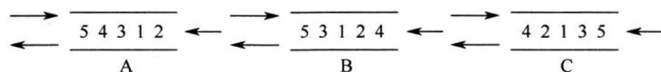

# 2021全国硕士研究生招生考试计算机学科专业基础试题参考答案

# 一、单项选择题

01. D 02. D 03. B 04. C 05. B 06. D 07. A 08. C   
09. A 10. C 11. B 12. D 13. D 14. A 15. C 16. A   
17. D 18. C 19. C 20. A 21. B 22. A 23. B 24. B   
25. C 26. C 27. D 28. C 29. B 30. A 31. C 32. C   
33. B 34. A 35. B 36. B 37. D 38. B 39. D 40. C

01.【解析】

如图1所示，要删除带头结点的非空单循环链表中的第一个元素，就要先用临时指针q指向待删结点， $\mathbf{q} = \mathbf{h} \rightarrow \mathbf{next}$ ；然后将 $\mathbf{q}$ 从链表中断开， $\mathrm{h} \rightarrow \mathrm{next} = \mathrm{q} \rightarrow \mathrm{next}$ （这一步也可写成 $\mathrm{h} \rightarrow \mathrm{next} = \mathrm{h} \rightarrow \mathrm{next} \rightarrow \mathrm{next}$ ）；此时要考虑一种特殊情况，若待删结点是链表的尾结点，即循环单链表中只有一个元素（ $\mathfrak{p}$ 和 $\mathbf{q}$ 指向同一个结点），如图2所示，则在删除后要将尾指针指向头结点，即 $\mathrm{if(p == q)p = h}$ ；最后释放 $\mathbf{q}$ 结点即可，答案选D。

  
图1

  
图2

02.【解析】

假设队列左端允许入队和出队，右端只能入队。对于A，依次从右端入队1,2，再从左端入队3,4,5。对于B，从右端入队1,2，然后从左端入队3，再从右端入队4，最后从左端入队5。对于C，从左端入队1,2，然后从右端入队3，再从左端入队4，最后从右端入队5。无法验证D的出队序列，故选D。



【另解】队列两端都可以入队，入队结束后，队列中的序列（或逆序）可视为出队序列。由于入队序列是从小到大的顺序，因此左端入队的子序列满足从大到小的顺序，右端入队的子序列满足从小到大的顺序。A、B和C都满足这样特点，只有D不满足，故选D。

03.【解析】

二维数组A按行优先存储，每个元素占用1个存储单元，由A[0][0]和A[3][3]的存储地址可知

A[3][3]是二维数组A中的第121个元素，假设二维数组A的每行有 $n$ 个元素，则 $n \times 3 + 4 = 121$ 求得 $n = 39$ ，故元素A[5][5]的存储地址为 $100 + 39 \times 5 + 6 - 1 = 300$ ，故选B。

# 04.【解析】

由二叉树 $T$ 的先序序列和中序序列可以构造出 $T$ ，如下图所示。由森林转化成二叉树的规则可知，森林中每棵树的根结点以右子树的方式相连，所以 $T$ 中的结点a、c、f为 $F$ 中树的根结点，森林 $F$ 中有3棵树，故选C。


# 05.【解析】

对于带权值的结点，构造出哈夫曼树的带权路径长度（WPL）最小，哈夫曼树的构造过程如下图所示。求得其 $\mathrm{WPL} = (10 + 12)\times 3 + (30 + 16 + 21)\times 2 = 200$ ，故选B。


# 06.【解析】

关键字23的插入位置为25的左孩子，此时破坏了平衡的性质，需要对平衡二叉树进行调整。最小不平衡子树就是该树本身，插入位置在根结点的右子树的左子树上，因此需要进行RL旋转，RL旋转过程如下图所示，旋转完成后根结点的关键字为25，故选D。


# 07.【解析】

求拓扑序列的过程如下：从图中选择无入边的结点，输出该结点并删除该结点的所有出边，重复上述过程，直至全部结点都已输出，求得拓扑序列ABCDEF。每次输出一个结点并删除该结点的所有出边后，都发现仅有一个结点无入边，因此该拓扑序列唯一，故选A。

# 08.【解析】

在执行Dijkstra算法时，首先初始化dist[]，若顶点1到顶点 $i$ （ $i = 2,3,4,5$ ）有边，就初始化为边的权值；若无边，就初始化为 $\infty$ ；初始化顶点集S只含顶点1。Dijkstra算法每次选

择一个到顶点1距离最近的顶点 $j$ 加入顶点集S，并判断由顶点1绕行顶点 $j$ 后到任一顶点 $k$ 是否距离更短，若距离更短（即 $\mathrm{dist}[j] + \mathrm{arcs}[j][k] <   \mathrm{dist}[k])$ ，则将 $\mathrm{dist}[x]$ 更新为 $\mathrm{dist}[j] +$ $\operatorname {arc}s[j][k]$ ；重复该过程，直至所有顶点都加入顶点集S。数组dist的变化过程如下图所示，可知将第二个顶点5加入顶点集S后，数组dist更新为21,3,14,6，故选C。

$$
\mathrm {d i s t} \{2 6, 3, \infty , 6 \} \xrightarrow {\text {顶 点} 3 \lambda \mathrm {入} \mathrm {S}} \{2 5, 3, \infty , 6 \} \xrightarrow {\text {顶 点} 5 \lambda \mathrm {入} \mathrm {S}} \{2 1, 3, 1 4, 6 \}
$$

09.【解析】

在阶为3的B树中，每个结点至多含有2个关键字（至少1个)，至多有3棵子树。本题规定第二层有4个关键字，欲使B树的结点个数达到最多，则这4个关键字包含在3个结点中，B树树形如下图所示，其中A,B,C,,M表示关键字，最多有11个结点，故选A。


10.【解析】

基数排序是一种稳定的排序方法。由于采用最低位优先（LSD）的基数排序，即第1趟对个位进行分配和收集的操作，因此第一趟分配和收集后的结果是{151,301,372,892,93,43,485,946,146,236,327,9}，元素372之前、之后紧邻的元素分别是301和892，故选C。

11.【解析】

要熟练掌握调整堆的方法，建堆的过程如下图所示，故答案选B。


12.【解析】

PFLOPS = 每秒一千万亿（ $10^{15}$ ）次浮点运算。故 93.0146 PFLOPS ≈ 每秒 $9.3 \times 10^{16}$ 次浮点运算，即每秒 9.3 亿亿次浮点运算，故选 D。

13.【解析】

若 $x, y$ 和 $z$ 均为无符号整数，则 $x > y > z$ ，A和B错误。若 $x, y$ 和 $z$ 均为带符号整数，补码的最高位是符号位，0表示正数，1表示负数，因此 $z$ 为正数，而 $x$ 和 $y$ 为负数。对于 $x$ 和

$y$ 的比较，数值位取反加1，可知 $x = -3\mathrm{H}$ ， $y = -21\mathrm{H}$ ，故 $x > y$ 。D选项正确。

# 14.【解析】

本题使用排除法。

选项B： $1.25 = 1.01\mathrm{B}\times 2^{0}$ ；选项C： $2.0 = 1.0\mathrm{B}\times 2^{1}$ ；选项D： $2.5 = 1.01\mathrm{B}\times 2^{1}$ 。

因此，选项B、C和D均可以用IEEE754浮点格式精确表示。

选项A的十进制小数1.2转换成二进制的结果是无限循环小数 $1.001100110011\dots$ ，无法用精度有限的IEEE754格式精确表示。

# 15.【解析】

000000～3FFFF，共有 $3FFFFFFH - 000000H + 1H = 400000H = 2^{22}$ 个地址，按字编址，字长为32位（4B），因此RAM区大小为 $2^{22} \times 4B = 2^{22} \times 32$ bit。每个RAM芯片的容量为 $512K \times 8bit = 2^{19} \times 8bit$ ，所以需要RAM芯片的数量为 $(2^{22} \times 32\mathrm{bit}) / (2^{19} \times 8\mathrm{bit}) = 32$ 。

# 16.【解析】

Cache 数据区大小为 32KB，主存块的大小为 32B，那么 Cache 中共有 1K 个 Cache 行，物理地址中偏移量部分的长度为 5bit。因为采用直接映射方式，所以 1K 个 Cache 行映射到 1K 个分组，物理地址中组号部分的长度为 10bit。32bit 的主存地址除去 5bit 的偏移量和 10bit 的组号后，还剩 17bit 的 tag 部分。又因为 Cache 采用回写法，所以 Cahce 行的总位数应为 32B（数据位）+17bit（tag 位）+1bit（脏位）+1bit（有效位）=275bit。

# 17.【解析】

汇编程序员可见的寄存器有基址寄存器（用于实现多道程序设计，或者编制浮动程序）和状态/标志寄存器、程序计数器PC及通用寄存器组；而MAR、MDR、IR是CPU的内部工作寄存器，对汇编程序员不可见。微指令寄存器属于微程序控制器的组成部分，它是硬件设计者的任务，对汇编程序员是透明的（即不可见的）。

# 18.【解析】

指令执行过程中数据所经过的路径，包括路径上的部件，称为数据通路。ALU、通用寄存器、状态寄存器、Cache、MMU、浮点运算逻辑、异常和中断处理逻辑等，都是指令执行过程中数据流经的部件，都属于数据通路的一部分。数据通路中的数据流动路径由控制部件控制，控制部件根据每条指令功能的不同，生成对数据通路的控制信号。C错误。

# 19.【解析】

总线是在两个或多个设备之间进行通信的传输介质，A 正确。同步总线是指总线通信的双方采用同一个时钟信号，但是一次总线事务不一定在一个时钟周期内完成，即时钟频率不一定等于工作频率，B 正确。异步总线采用握手的方式进行通信，每次握手的过程完成一次通信，但一次通信往往会交换多位而非一位数据，C 错误。突发传送总线事务是指发送方在传输完地址后，连续进行若干次数据的发送，D 正确。

# 20.【解析】

I/O接口即I/O控制器，其功能是接收主机发送的I/O控制信号，并实现主机和外部设备之

间的信息交换。磁盘驱动器是由磁头、磁盘和读写电路等组成的，也就是我们平常所说的磁盘本身，A错误。B、C和D均为I/O控制器。

# 21.【解析】

大部分中断都是在一条指令执行完成后(中断周期)才被检测并处理,除了缺页中断和DMA请求。DMA请求只请求总线的使用权,不影响当前指令的执行,不会导致被中断指令的重新执行;而缺页中断发生在取指或间址等指令执行过程之中,并且会阻塞整个指令。当缺页中断发生后,必须回到这条指令重新执行,以便重新访存。选B。

# 22.【解析】

中断服务程序在内核态下执行，若只能在用户态下检测和响应中断，显然无法实现多重中断（中断嵌套），A错误。在多重中断中，CPU只有在检测到中断请求信号后（中断处理优先级更低的中断请求信号是检测不到的），才会进入中断响应周期。进入中断响应周期时，说明此时CPU一定处于中断允许状态，否则无法响应该中断。如果所有中断源都被屏蔽（说明该中断处理优先级最高），则CPU不会检测到任何中断请求信号。

# 23.【解析】

在内核态下，CPU 可执行任何指令，在用户态下 CPU 只能执行非特权指令，而特权指令只能在内核态下执行。常见的特权指令有：①有关对 I/O 设备操作的指令；②有关访问程序状态的指令；③存取特殊寄存器指令；④其他指令。A、C 和 D 都是提供给用户使用的指令，可以在用户态执行，只是可能会使 CPU 从用户态切换到内核态。故选 B。

# 24.【解析】

操作系统感知进程的唯一方式是通过进程控制块PCB，所以创建一个新进程时就是为其申请一个空白的进程控制块，并初始化一些必要的进程信息，如初始化进程标志信息、初始化处理机状态信息、设置进程优先级等。I、II正确。创建一个进程时，一般会为其分配除CPU外的大多数资源，所以一般是将其设置为就绪态，让其等待调度程序的调度。

# 25.【解析】

在分时系统的时间片轮转调度中，当系统检测到时钟中断时，会引出时钟中断处理程序，调度程序从就绪队列中选择一个进程为其分配时间片，并修改该进程的进程控制块中的进程状态等信息，同时将时间片用完的进程放入就绪队列或让其结束运行。I、II、III正确。阻塞队列中的进程只有被唤醒进入就绪队列后，才能参与调度，所以该调度过程不使用阻塞队列。

# 26.【解析】

最短寻道时间优先算法总是选择调度与当前磁头所在磁道距离最近的磁道。可以得出访问序列184, 182, 187, 176, 199，从而求出移动距离之和是 $0 + 2 + 5 + 11 + 23 = 41$ 。

# 27.【解析】

在时间片调度算法中，中断处理结束后，系统检测当前进程的时间片是否用完，如果用完，

则将其设为就绪态或让其结束运行，若就绪队列不空，则调度就绪队列的队首进程执行，I可能。当前进程阻塞时，将其放入阻塞队列，若就绪队列不空，则调度新进程执行，II可能。进程执行结束会导致当前进程释放CPU，并从就绪队列中选择一个进程获得CPU，III可能。进程时间片用完，会导致当前进程让出CPU，同时选择就绪队列的队首进程获得CPU，IV可能。

# 28.【解析】

页面大小为4KB，低12位是页内偏移。虚拟地址为02A01II，页号为02H，02H页对应的页表项中存在位为0，进程P分配的页框固定为2，且内存中已有两个页面存在。根据CLOCK算法，选择将3号页换出，将2号页放入60H页框，经过地址变换后得到的物理地址是60A01H。

# 29.【解析】

在多级页表中，页表基址寄存器存放的是顶级页表的起始物理地址，故存放的是一级页表的起始物理地址。

# 30.【解析】

删除一个文件时，会根据文件控制块回收相应的磁盘空间，将文件控制块回收，并删除目录中对应的目录项。B、C、D 正确。快捷方式属于文件共享中的软连接，本质上是创建了一个链接文件，其中存放的是访问该文件的路径，删除文件并不会导致文件的快捷方式被删除，正如在 Windows 上删除一个程序后，其快捷方式可能仍存在于桌面，但已无法打开。

# 31.【解析】

考虑极端情况，当临界资源数为 $n$ 时，每个进程都拥有 1 个临界资源并等待另一个资源，会发生死锁。当临界资源数为 $n + 1$ 时，则 $n$ 个进程中至少有一个进程可以获得 2 个临界资源，顺利运行完后释放自己的临界资源，使得其他进程也能顺利运行，不会产生死锁。

# 32.【解析】

系统调用是由用户进程发起的，请求操作系统的服务。对于A，当内存中的空闲页框不够时，操作系统会将某些页面调出，并将要访问的页面调入，这个过程完全由操作系统完成，不涉及系统调用。对于B，进程调度完全由操作系统完成，无法通过系统调用完成。对于C，创建新进程可以通过系统调用来完成，如Linux中通过fork系统调用来创建子进程。对于D，生成随机数只需要普通的函数调用，不涉及请求操作系统的服务，如C语言中random()函数。

# 33.【解析】

TCP/IP 参考模型中传输层相邻的下一层是网际层。TCP/IP 的网际层使用一种尽力而为的服务，它将分组发往任何网络，并为之独立选择合适的路由，但不保证各个分组有序到达，B 正确。TCP/IP 认为可靠性是端到端的问题（传输层的功能），因此它在网际层仅有无连接、不可靠的通信模式，无法完成结点到结点的流量控制（OSI 参考模型的网络层具有该功能）。对话管理和端到端的报文段传输均为传输层的功能。A、C 和 D 错误。

# 34.【解析】

差分曼彻斯特编码常用于局域网传输，其规则是：若码元为1，则前半个码元的电平与上一码元的后半个码元的电平相同；若码元为0，则情形相反。差分曼彻斯特编码的特点在于，在每个时钟周期的起始处，跳变则说明该比特是0，不跳变则说明该比特是1。

根据题34图，第1个码元的信号波形因缺乏上一码元的信号波形，无法判断是0还是1，但根据后面的信号波形，可以求出第 $2\sim 8$ 个码元为0111001，因此选A。

# 35.【解析】

根据题意，将IP网络划分为3个子网。其中一个是192.168.9.128/26。可以简写成x.x.x.10/26（其中10是128的二进制10000000的前两位，因为 $26 - 24 = 2$ ）。

A 选项可以简写成 x.x.x.0/25;  
B 选项可以简写成 x.x.x.00/26;  
C 选项可以简写成 x.x.x.11/26;  
D 选项可以简写成 x.x.x.110/27。

对于A和C，可以组成x.x.x.0/25、x.x.x.10/26、x.x.x.11/26这样3个互不重叠的子网。

对于D，可以组成x.x.x.10/26、x.x.x.110/27、x.x.x.111/27这样3个互不重叠的子网。

但对于B，要想将一个IP网络划分为几个互不重叠的子网，3个是不够的，至少需要划分为4个子网：x.x.x.00/26、x.x.x.01/26、x.x.x.10/26、x.x.x.11/26。

# 36.【解析】

链路层 $\mathrm{MTU} = 800\mathrm{B}$ 。IP分组首部长20B。片偏移以8个字节为偏移单位，因此除最后一个分片，其他每个分片的数据部分长度都是8B的整数倍。所以，最大IP分片的数据部分长度为776B。总长度1580B的IP数据报中，数据部分占1560B， $1560\mathrm{B} / 776\mathrm{B} = 2.01\dots$ ，需要分成3片。故第2个分片的总长度字段为796，MF为1（表示还有后续的分片）。

# 37.【解析】

根据距离向量路由算法，E收到相邻路由器的距离向量后，更新它的路由表：

(1) 当原路由表中没有目的网络时, 把该项目添加到路由表中。  
② 发来的路由信息中有一条到达某个目的网络的路由，该路由与当前使用的路由相比，有较短的距离，就用经过发送路由信息的结点的新路由替换。

分析题意可知，E与邻居路由器A、B、C和D之间的直接链路距离分别是8,10,12和6。到达Net1～Net4没有直接链路，需要通过邻居路由器。从上述算法可知，E到达目的网络一定是经过A,B,C和D中距离最小的。根据题中所给的距离信息，计算E经邻居路由器到达目的网络Net1～Net4的距离，如下表所示，选择到达每个目的网络距离的最短值。

<table><tr><td>目的网络</td><td>经过A需要的距离</td><td>经过B需要的距离</td><td>经过C需要的距离</td><td>经过D需要的距离</td></tr><tr><td>Net1</td><td>9</td><td>33</td><td>32</td><td>28</td></tr><tr><td>Net2</td><td>20</td><td>45</td><td>42</td><td>34</td></tr><tr><td>Net3</td><td>32</td><td>28</td><td>28</td><td>42</td></tr><tr><td>Net4</td><td>44</td><td>40</td><td>20</td><td>30</td></tr></table>

所以距离分别是9,20,28,20。

# 38.【解析】

TCP 连接释放的过程如下图所示。当客户机收到服务器发送的 FIN 段并向服务器发送 ACK 段后，客户机的 TCP 状态变为 TIME_WAIT，此时 TCP 连接还未释放，必须经过时间等待计时器设置的时间 2MSL（最长报文段寿命）后，客户机才进入 CLOSED（连接关闭）状态。


# 39.【解析】

应用层数据交给传输层时，放在报文段的数据部分。UDP首部有8B，TCP首部最短有20B。为了达到最大传输效率，通过UDP传输时，总长度为20B，最大传输效率是 $12\mathrm{B} / 20\mathrm{B} = 60\%$ 。通过TCP传输时，总长度为32B，最大传输效率是 $12\mathrm{B} / 32\mathrm{B} = 37.5\%$ 。

# 40.【解析】

依题意，甲发送完200B报文后，继续发送的报文段中序号字段 $\mathrm{seq} = 701$ 。由于乙告知接收窗口为500，且甲未收到乙对 $\mathrm{seq} = 501$ 报文段的确认，那么甲还能发送的报文段字节数为 $500 - 200 = 300\mathrm{B}$ ，因此甲在未收到新的确认段之前，还能发送的数据序号范围是 $701\sim 1000$

# 二、综合应用题

# 41.【解析】

1）算法的基本设计思想

本算法题属于送分题，题干已经告诉我们算法的思想。对于采用邻接矩阵存储的无向图，在邻接矩阵的每一行（列）中，非零元素的个数为本行（列）对应顶点的度。可以依次计算连通图 $G$ 中各顶点的度，并记录度为奇数的顶点个数，若个数为0或2，则返回1，否则返回0。

2）算法实现

```javascript
int IsExistEL(MGraph G) { //采用邻接矩阵存储，判断图是否存在EL路径 int degree,i,j,count=0; for(i=0;i<G.numVertices;i++) {
```

degree $= 0$ for $(j = 0;j <   G$ .numVertices; $j + + )$ degree $+ = G$ .Edge[i][j]； //依次计算各个顶点的度 if（degree%2！ $= 0$ ） count++; //对度为奇数的顶点计数   
}   
if(count $= = 0$ |count $= = 2$ 1 return1; //存在EL路径，返回1   
else return0; //不存在EL路径，返回0

3）时间复杂度和空间复杂度

算法需要遍历整个邻接矩阵，所以时间复杂度是 $O(n^{2})$ ，空间复杂度是 $O(1)$ 。

# 42.【解析】

cmpCountSort 算法基于计数排序的思想，对序列进行排序。cmpCountSort 算法遍历数组中的元素，count 数组记录比对应待排序数组元素下标大的元素个数，例如，count[1] = 3 的意思是数组 a 中有 3 个元素比 a[1] 大，即 a[1] 是第 4 大元素，a[1] 的正确位置应是 b[3]。

1）排序结果为 $b[6] = \{-10, 10, 11, 19, 25, 25\}$ 。  
(2) 由代码 for(i=0;i<n-1;i++) 和 for(j=i+1;j<n;j++) 可知，在循环过程中，每个元素都与它后面的所有元素比较一次（即所有元素都两两比较一次），比较次数之和为 $(n - 1) + (n - 2) + \dots + 1$ ，故总的比较次数是 $n(n - 1)/2$ 。  
3）不是。需要将程序中的if语句修改如下：

if(a[i] $<  =$ a[j])count[j]++; else count[i]++;

如果不加等号，两个相等的元素比较时，前面元素的 count 值会加 1，导致原序列中靠前的元素在排序后的序列中处于靠后的位置。

# 43.【解析】

1）ALU的宽度为16位，ALU的宽度即ALU运算对象的宽度，通常与字长相同。地址线为20位，按字节编址，可寻址主存空间大小为 $2^{20}$ 字节（或1MB）。指令寄存器有16位，和单条指令长度相同。MAR有20位，和地址线位数相同。MDR有8位，和数据线宽度相同。  
2）R型格式的操作码有4位，最多有 $2^{4}$ （或16）种操作。I型和J型格式的操作码有6位，因为它们的操作码部分重叠，所以共享这6位的操作码空间，且前6位全0的编码已被R型格式占用，因此I和J型格式最多有 $2^{8} - 1 = 63$ 种操作。从R型和I型格式的寄存器编号部分可知，只用2位对寄存器编码，因此通用寄存器最多有4个。  
3) 指令 $01 \mathrm{~B} 2 \mathrm{H} = 0000000110110010 \mathrm{~B}$ 为一条 R 型指令, 操作码 0010 表示带符号整数减法指令, 其功能为 $\mathrm{R}[3] \leftarrow \mathrm{R}[1] - \mathrm{R}[2]$ 。执行指令 01B2H 后, $\mathrm{R}[3] = \mathrm{B} 052 \mathrm{H} - 0008 \mathrm{H} = \mathrm{B} 04 \mathrm{AH}$ ,结果未溢出。指令 $01 \mathrm{~B} 3 \mathrm{H} = 0000000110110011 \mathrm{~B}$ , 操作码 0011 表示带符号整数乘法指令,执行指令 01B3H 后, $\mathrm{R}[3] = \mathrm{R}[1] \times \mathrm{R}[2] = \mathrm{B} 052 \mathrm{H} \times 0008 \mathrm{H} = 8290 \mathrm{H}$ , 结果溢出。  
4) 在进行指令的跳转时, 可能向前跳转, 也可能向后跳转, 偏移量是一个带符号整数,因此在地址计算时, 应对 $\mathrm{imm}$ 进行符号扩展。  
5）无条件转移指令可以采用J型格式，将target部分写入PC的低10位，完成跳转。

# 44.【解析】

注意：对于本题的TLB，需要采用处理Cache的方式求解。

1）按字节编址，页面大小为 $4\mathrm{KB} = 2^{12}\mathrm{B}$ ，页内地址为12位。虚拟地址中高 $30 - 12 = 18$ 位表示虚页号，虚拟地址中低12位表示页内地址。  
2）TLB采用2路组相联方式，共 $8 = 2^{3}$ 组，用3位来标记组号。虚拟地址（或虚页号）中高 $18 - 3 = 15$ 位为TLB标记，虚拟地址中随后3位（或虚页号中低3位）为TLB组号。  
3）虚页号4对应的TLB表项被替换。因为虚页号与TLB组号的映射关系为TLB组号 $=$ 虚页号modTLB组数 $=$ 虚页号mod8，因此，虚页号10,12,16,7,26,4,12,20映射到的TLB组号依次为2,4,0,7,2,4,4,4。TLB采用2路组相联方式，从上述映射到的TLB组号序列可以看出，只有映射到4号组的虚页号数量大于2，相应虚页号依次是12,4,12和20。根据LRU替换策略，当访问第20页时，虚页号4对应的TLB表项被替换出来。  
4）虚拟地址位数增加到32位时，虚页号增加了 $32 - 30 = 2$ 位，使得每个TLB表项中的标记字段增加2位，因此，每个TLB表项的位数增加2位。

# 45.【解析】

1）信号量S是能被多个进程共享的变量，多个进程都可通过wait()和signal()对S进行读、写操作。所以，wait()和signal()操作中对S的访问必须是互斥的。  
2) 方法 1 错误。在 wait() 中, 当 $S <= 0$ 时, 关中断后, 其他进程无法修改 S 的值, while 语句陷入死循环。方法 2 正确。方法 2 在循环体中有一个开中断操作, 这样就可以使其他进程修改 S 的值, 从而避免 while 语句陷入死循环。  
3）用户程序不能使用开/关中断指令实现临界区互斥。因为开中断和关中断指令都是特权指令，不能在用户态下执行，只能在内核态下执行。

# 46.【解析】

1）执行顺序依次是ROM中的引导程序、磁盘引导程序、分区引导程序、操作系统的初始化程序。启动系统时，首先运行ROM中的引导代码（bootstrap）。为执行某个分区的操作系统的初始化程序，需要先执行磁盘引导程序以指示引导到哪个分区，然后执行该分区的引导程序，用于引导该分区的操作系统。  
2）4个操作的执行顺序依次是磁盘的物理格式化、对磁盘进行分区、逻辑格式化、操作系统的安装。磁盘只有通过分区和逻辑格式化后才能安装系统和存储信息。物理格式化（又称低级格式化，通常出厂时就已完成）的作用是为每个磁道划分扇区，安排扇区在磁道中的排列顺序，并对已损坏的磁道和扇区做“坏”标记等。随后将磁盘的整体存储空间划分为相互独立的多个分区（如Windows中划分C盘、D盘等），这些分区可以用作多种用途，如安装不同的操作系统和应用程序、存储文件等。然后进行逻辑格式化（又称高级格式化），其作用是对扇区进行逻辑编号、建立逻辑盘的引导记录、文件分配表、文件目录表和数据区等。最后才是操作系统的安装。  
3）由上述解析知，磁盘扇区的划分是在磁盘的物理格式化操作中完成的，文件系统根目录的建立是在逻辑格式化操作中完成的。

# 47.【解析】

1）从 $t_0$ 到 $t_1$ 期间，除了HTTP，H1还运行了DNS应用层协议，以将域名转换为IP地址。

DNS 运行在 UDP 之上，UDP 将应用层交下来的 DNS 报文添加首部后，向下交付给 IP 层，IP 层使用 IP 数据报进行封装，封装好后，向下交付给数据链路层，数据链路层使用 CSMA/CD 帧进行封装。因此，逐层封装关系如下：DNS 报文 $\rightarrow$ UDP 数据报 $\rightarrow$ IP 数据报 $\rightarrow$ CSMA/CD 帧。

2） $t_0$ 时刻，H1 的 ARP 表和 S 的交换表为空。H1 利用浏览器通过域名请求访问 Web 服务器。由于要先解析域名，所以会发送 DNS 报文到本地域名服务器，查询该域名对应的 IP 地址，所以要先向本地域名服务器发送请求。ARP 表为空，所以需要先发送 ARP 请求分组，查询本地域名服务器对应的 MAC 地址。这些帧的目的 MAC 地址均是 FF-FF-FF-FF-FF。S 接收到这个帧，在交换表中记录下 MAC 地址为 00-11-22-33-44-cc，位于端口 4，然后广播该帧。当本地域名服务器接收到 ARP 请求后，向 H1 发送响应 ARP 分组。S 接收到这个帧，在交换表中记录下 MAC 地址为 00-11-22-33-44-bb，位于端口 1，然后把该帧从端口 4 发送出去。

得到了域名对应的IP地址，发现不在本局域网中，需要通过路由表转发。

H1 的 ARP 表中并没有路由器对应的 MAC 地址，因此需要先发送 ARP 请求分组，查询路由器对应的 MAC 地址。这些帧的目的 MAC 地址均是 FF-FF-FF-FF-FF。S 接收到这个帧，广播该帧。当路由器收到 ARP 请求后，向 H1 发送响应 ARP 分组。S 接收到这个帧，在交换表中记录下 MAC 地址为 00-11-22-33-44-AA，位于端口 2，然后把该帧从端口 4 发送出去。现在，H1 能把数据发送给路由器了。在整个过程中，并没有涉及 H2，H2 没有主动发送数据。所以 S 并不会记录下 H2 的 MAC 地址和端口，所以 S 在 $t_1$ 时刻的交换表如下表所示。

<table><tr><td>MAC 地址</td><td>端 口</td></tr><tr><td>00-11-22-33-44-cc</td><td>4</td></tr><tr><td>00-11-22-33-44-bb</td><td>1</td></tr><tr><td>00-11-22-33-44-AA</td><td>2</td></tr></table>

3）由2）的分析可知，H2至少会接收到2个和此次Web访问相关的帧。接收到的均是封装ARP查询报文的以太网帧；这些帧的目的MAC地址均是FF-FF-FF-FF-FF。