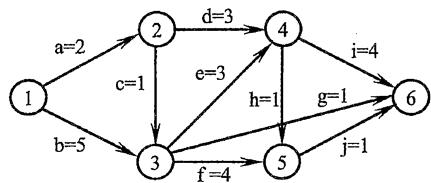
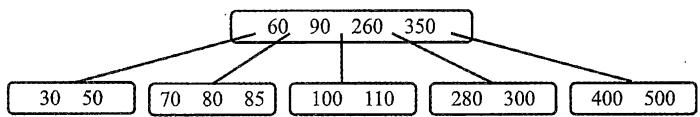
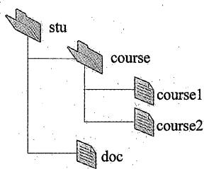
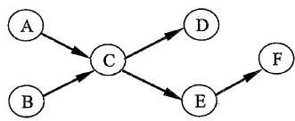
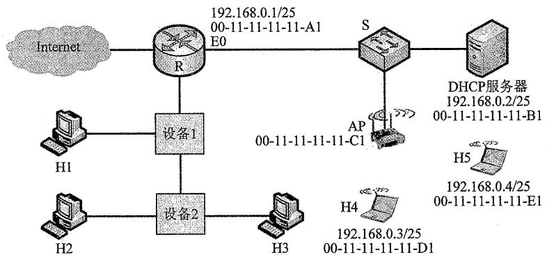

# 全国硕士研究生入学统一考试

# 计算机科学与技术学科联考

# 2022年全国硕士研究生招生考试

# 计算机学科专业基础试题

（科目代码：408）

# 考生注意事项

1. 答题前，考生在试题册指定位置上填写考生编号和考生姓名；在答题卡指定位置上填写报考单位、考生姓名和考生编号，并涂写考生编号信息点。  
2. 考生须把试题册上的“试卷条形码”黏贴条取下，黏贴在答题卡的“试卷条形码黏贴位置”框中，不按规定黏贴条形码而影响评卷结果的，责任由考生自负。  
3. 选择题的答案必须涂写在答题卡和相应题号的选项上，非选择题的答案必须书写在答题卡指定位置的边框区城内，超出答题区域书写的答案无效；在草稿纸、试题册上答题无效。  
4. 填（书）写部分必须使用黑色字迹签字笔书写，字迹工整、笔迹清楚；涂写部分必须使用2B铅笔涂写。  
5. 考试结束，将答题卡和试题册按规定交回。

（以下信息考生必须认真填写）  

<table><tr><td>考生编号</td><td></td><td></td><td></td><td></td><td></td><td></td><td></td><td></td><td></td><td></td><td></td><td></td><td></td><td></td><td></td></tr><tr><td>考生姓名</td><td colspan="15"></td></tr></table>

# 一、单项选择题： $01\sim 40$ 小题，每小题2分，共80分。下列每题给出的四个选项中，只有一个选项是最符合题目要求的。

01. 下列程序段的时间复杂度是（ ）。

int sum = 0;  
for (int i = 1; i < n; i *= 2)  
    for (int j = 0; j < i; j++)  
        sum++;

A. $O(\log n)$

B. $O(n)$

C. $O(n \log n)$

D. $O\left(n^{2}\right)$

02. 给定有限符号集 S, in 和 out 均为 S 中所有元素的任意排列。对于初始为空的栈 ST, 下列叙述中, 正确的是 ( )。

A. 若 in 是 ST 的入栈序列, 则不能判断 out 是否为其可能的出栈序列  
B. 若 out 是 ST 的出栈序列, 则不能判断 in 是否为其可能的入栈序列  
C. 若 in 是 ST 的入栈序列, out 是对应 in 的出栈序列, 则 in 与 out 一定不同  
D. 若 in 是 ST 的入栈序列, out 是对应 in 的出栈序列, 则 in 与 out 可能互为倒序

03. 若结点 $\mathfrak{p}$ 与 $\mathbf{q}$ 在二叉树 $\mathrm{T}$ 的中序遍历序列中相邻，且 $\mathfrak{p}$ 在 $\mathbf{q}$ 之前，则下列 $\mathfrak{p}$ 与 $\mathbf{q}$ 的关系中，不可能的是（）。

I. q是p的双亲

II. q是p的右孩子

III. q是p的右兄弟

IV. q是p的双亲的双亲

A. 仅 I

B. 仅 III

C. 仅 II、III

D. 仅 II、IV

04. 若三叉树 T 中有 244 个结点（叶结点的高度为 1），则 T 的高度至少是（）。

A. 8

B. 7

C. 6

D. 5

05. 对任意给定的含 $n$ （ $n > 2$ ）个字符的有限集 S，用二叉树表示 S 的哈夫曼编码集和定长编码集，分别得到二叉树 T1 和 T2。下列叙述中，正确的是（）。

A. T1 与 T2 的结点数相同  
B. T1 的高度大于 T2 的高度  
C. 出现频次不同的字符在 T1 中处于不同的层  
D. 出现频次不同的字符在 T2 中处于相同的层

06. 对于无向图 $\mathbf{G} = (\mathrm{V},\mathrm{E})$ ，下列选项中，正确的是（ ）。

A. 当 $|\mathrm{V}| > |\mathrm{E}|$ 时， $\mathbf{G}$ 一定是连通的  
B. 当 $|\mathrm{V}| < |\mathrm{E}|$ 时, $\mathrm{G}$ 一定是连通的  
C. 当 $|\mathrm{V}| = |\mathrm{E}| - 1$ 时, $\mathrm{G}$ 一定是不连通的  
D. 当 $|\mathrm{V}| > |\mathrm{E}| + 1$ 时, $\mathrm{G}$ 一定是不连通的

07. 下图是一个有 10 个活动的 AOE 网，时间余量最大的活动是（）。



A. c

B. g

C.h

D. j

08. 在下图所示的 5 阶 B 树 T 中，删除关键字 260 之后需要进行必要的调整，得到新的 B 树 T1。下列选项中，不可能是 T1 根结点中关键字序列的是（）。



A. 60, 90, 280

B. 60, 90, 350

C. 60, 85, 110, 350

D. 60, 90, 110, 350

09. 下列因素中，影响散列（哈希）方法平均查找长度的是（ ）。

I. 装填因子

II. 散列函数

III. 冲突解决策略

A. 仅 I、II

B. 仅 I、III

C. 仅 II、III

D. I、II、III

10. 使用二路归并排序对含 $n$ 个元素的数组 M 进行排序时，二路归并操作的功能是（）。

A. 将两个有序表合并为一个新的有序表  
B. 将 M 划分为两部分, 两部分的元素个数大致相等  
C. 将 $\mathrm{M}$ 划分为 $n$ 个部分, 每个部分中仅含有一个元素  
D. 将 M 划分为两部分, 一部分元素的值均小于另一部分元素的值

11. 对数据进行排序时，若采用直接插入排序而不采用快速排序，则可能的原因是（）。

I. 大部分元素已有序

II. 待排序元素数量很少

III. 要求空间复杂度为 $O(1)$

IV. 要求排序算法是稳定的

A. 仅 I、II

B. 仅 III、IV

C. 仅 I、II、IV

D. I、II、III、IV

12. 某计算机主频为 $1\mathrm{GHz}$ ，程序 P 运行过程中，共执行了 10000 条指令，其中， $80\%$ 的指令执行平均需 1 个时钟周期， $20\%$ 的指令执行平均需 10 个时钟周期。程序 P 的平均 CPI 和 CPU 执行时间分别是（）。

A. $2.8, 28 \mu \mathrm{s}$

B. $28, 28 \mu \mathrm{s}$

C. $2.8, 28 \mathrm{~ms}$

D. $28, 28 \mathrm{~ms}$

13. 32 位补码所能表示的整数范围是（ ）。

A. $-2^{32} \sim 2^{31} - 1$

B. $-2^{31} \sim 2^{31} - 1$

C. $-2^{32} \sim 2^{32} - 1$

D. $-2^{31} \sim 2^{32} - 1$

14. -0.4375 的 IEEE 754 单精度浮点数表示为（ ）。

A. BEE0 0000H

B. BF60 0000H

C. BF70 0000H

D. C0E0 0000H

15. 某计算机主存地址为 24 位，采用分页虚拟存储管理方式，虚拟地址空间大小为 4GB，页大小为 4KB，按字节编址。某进程的页表部分内容如下表所示。

<table><tr><td>虚页号</td><td>实页号（页框号）</td><td>存在位</td></tr><tr><td>82</td><td>024H</td><td>0</td></tr><tr><td>...</td><td>...</td><td>...</td></tr><tr><td>129</td><td>180H</td><td>1</td></tr><tr><td>130</td><td>018H</td><td>1</td></tr></table>

当CPU访问虚拟地址00082840H时，虚-实地址转换的结果是（）。

A. 得到主存地址 024840H

B. 得到主存地址 $180840\mathrm{H}$

C. 得到主存地址 018840H

D. 检测到缺页异常

16. 若计算机主存地址为 32 位，按字节编址，某 Cache 的数据区容量为 $32 \mathrm{KB}$ ，主存块大小为 64 B，采用 8 路组相联映射方式，该 Cache 中比较器的个数和位数分别为（）。

A. 8,20

B. 8,23

C. 64, 20

D. 64, 23

17. 某内存条包含 8 个 $8192 \times 8192 \times 8$ 位的 DRAM 芯片，按字节编址，支持突发（burst）传送方式，对应存储器总线宽度为 64 位，每个 DRAM 芯片内有一个行缓冲区（row buffer）。下列关于该内存条的叙述中，不正确的是（）。

A. 内存条的容量为 $512 \mathrm{MB}$

B. 采用多模块交叉编址方式

C. 芯片的地址引脚为 26 位

D. 芯片内行缓冲有 $8192 \times 8$ 位

18. 下列选项中，属于指令集体系结构（ISA）规定的内容是（）。

I. 指令字格式和指令类型

II. CPU的时钟周期

III. 通用寄存器个数和位数

IV. 加法器的进位方式

A. 仅 I、II

B. 仅 I、III

C. 仅 II、IV

D. 仅 I、III、IV

19. 设计某指令系统时，假设采用 16 位定长指令字格式，操作码使用扩展编码方式，地址码为 6 位，包含零地址、一地址和二地址 3 种格式的指令。若二地址指令有 12 条，一地址指令有 254 条，则零地址指令的条数最多为（）。

A. 0

B. 2

C. 64

D. 128

20. 将高级语言源程序转换为可执行目标文件的主要过程是（ ）。

A. 预处理 $\rightarrow$ 编译 $\rightarrow$ 汇编 $\rightarrow$ 链接

B. 预处理 $\rightarrow$ 汇编 $\rightarrow$ 编译 $\rightarrow$ 链接

C. 预处理 $\rightarrow$ 编译 $\rightarrow$ 链接 $\rightarrow$ 汇编

D. 预处理 $\rightarrow$ 汇编 $\rightarrow$ 链接 $\rightarrow$ 编译

21. 下列关于中断I/O方式的叙述中，不正确的是（ ）。

A. 适用于键盘、针式打印机等字符型设备  
B. 外设和主机之间的数据传送通过软件完成  
C. 外设准备数据的时间应小于中断处理时间  
D. 外设为某进程准备数据时 CPU 可运行其他进程

22. 下列关于并行处理技术的叙述中，不正确的是（ ）。

A. 多核处理器属于MIMD结构  
B. 向量处理器属于 SIMD 结构  
C. 硬件多线程技术只可用于多核处理器  
D. SMP 中所有处理器共享单一物理地址空间

23. 下列关于多道程序系统的叙述中，不正确的是（ ）。

A. 支持进程的并发执行

B. 不必支持虚拟存储管理

C. 需要实现对共享资源的管理

D. 进程数越多 CPU 利用率越高

24. 下列选项中，需要在操作系统进行初始化过程中创建的是（）。

A. 中断向量表

B. 文件系统的根目录

C. 硬盘分区表

D. 文件系统的索引结点表

25. 进程 P0、P1、P2 和 P3 进入就绪队列的时刻、优先级（值越小优先权越高）及 CPU 执行时间如下表所示。

<table><tr><td>进程</td><td>进入就绪队列的时刻</td><td>优先级</td><td>CPU 执行时间</td></tr><tr><td>P0</td><td>0 ms</td><td>15</td><td>100 ms</td></tr><tr><td>P1</td><td>10 ms</td><td>20</td><td>60 ms</td></tr><tr><td>P2</td><td>10 ms</td><td>10</td><td>20 ms</td></tr><tr><td>P3</td><td>15 ms</td><td>6</td><td>10 ms</td></tr></table>

若系统采用基于优先权的抢占式进程调度算法，则从 $0\mathrm{ms}$ 时刻开始调度，到4个进程都运行结束为止，发生进程调度的总次数为（）。

A. 4

B. 5

C. 6

D. 7

26. 系统中有三个进程 P0、P1、P2 及三类资源 A、B、C。若某时刻系统分配资源的情况如下表所示，则此时系统中存在的安全序列的个数为（）。

<table><tr><td rowspan="2">进程</td><td colspan="3">已分配资源数</td><td colspan="3">尚需资源数</td><td colspan="3">可用资源数</td></tr><tr><td>A</td><td>B</td><td>C</td><td>A</td><td>B</td><td>C</td><td>A</td><td>B</td><td>C</td></tr><tr><td>P0</td><td>2</td><td>0</td><td>1</td><td>0</td><td>2</td><td>1</td><td rowspan="3">1</td><td rowspan="3">3</td><td rowspan="3">2</td></tr><tr><td>P1</td><td>0</td><td>2</td><td>0</td><td>1</td><td>2</td><td>3</td></tr><tr><td>P2</td><td>1</td><td>0</td><td>1</td><td>0</td><td>1</td><td>3</td></tr></table>

A. 1

B. 2

C. 3

D. 4

27. 下列关于 CPU 模式的叙述中，正确的是（ ）。

A. CPU 处于用户态时只能执行特权指令  
B. CPU 处于内核态时只能执行特权指令  
C. CPU 处于用户态时只能执行非特权指令  
D. CPU 处于内核态时只能执行非特权指令

28. 下列事件或操作中，可能导致进程P由执行态变为阻塞态的是（）。

I. 进程P读文件

II. 进程P的时间片用完

III. 进程P申请外设

IV. 进程P执行信号量的wait()操作

A. 仅 I、IV

B. 仅 II、III

C. 仅 III、IV

D. 仅 I、III、IV

29. 某进程访问的页 b 不在内存中，导致产生缺页异常，该缺页异常处理过程中不一定包含的操作是（）。

A.淘汰内存中的页 B.建立页号与页框号的对应关系  
C. 将页 b 从外存读入内存 D. 修改页表中页 b 对应的存在位

30. 下列选项中，不会影响系统缺页率的是（ ）。

A. 页置换算法 B. 工作集的大小  
C．进程的数量 D.页缓冲队列的长度

31. 执行系统调用的过程涉及下列操作，其中由操作系统完成的是（）。

I. 保存断点和程序状态字 II. 保存通用寄存器的内容  
III. 执行系统调用服务例程 IV. 将 CPU 模式改为内核态

A. 仅 I、III B. 仅 II、III C. 仅 II、IV D. 仅 II、III、IV

32. 下列关于驱动程序的叙述中，不正确的是（ ）。

A. 驱动程序与 I/O 控制方式无关  
B. 初始化设备是由驱动程序控制完成的  
C. 进程在执行驱动程序时可能进入阻塞态  
D. 读/写设备的操作是由驱动程序控制完成的

33. 在 ISO/OSI 参考模型中，实现两个相邻结点间流量控制功能的是（）。

A.物理层 B．数据链路层 C．网络层 D．传输层

34. 在一条带宽为 $200 \mathrm{kHz}$ 的无噪声信道上，若采用 4 个幅值的 ASK 调制，则该信道的最大数据传输速率是（）。

A. 200 kbps B. 400 kbps C. 800 kbps D. 1600 kbps

35. 若某主机的 IP 地址是 183.80.72.48，子网掩码是 255.255.192.0，则该主机所在网络的网络地址是（）。

A. 183.80.0.0 B. 183.80.64.0 C. 183.80.72.0 D. 183.80.192.0

36. 下图所示网络中的主机 H 的子网掩码与默认网关分别是（）。


A. 255.255.255.192, 192.168.1.1 B. 255.255.255.192, 192.168.1.62   
C. 255.255.255.224, 192.168.1.1 D. 255.255.255.224, 192.168.1.62

37. 在 SDN 网络体系结构中，SDN 控制器向数据平面的 SDN 交换机下发流表时所使用的接口是（）。

A.东向接口 B.南向接口 C.西向接口 D.北向接口

38. 假设主机甲和主机乙已建立一个TCP连接，最大段长 $\mathrm{MSS} = 1\mathrm{KB}$ ，甲一直有数据向乙发送，当甲的拥塞窗口为 $16\mathrm{KB}$ 时，计时器发生了超时，则甲的拥塞窗口再次增长到 $16\mathrm{KB}$ 所需要的时间至少是（）。

A. 4 RTB. 5 RTTC. 11 RTTD. 16 RTT

39. 假设客户 C 和服务器 S 已建立一个 TCP 连接，通信往返时间 $\mathrm{RTT} = 50 \mathrm{~ms}$ ，最长报文段寿命 $\mathrm{MSL} = 800 \mathrm{~ms}$ ，数据传输结束后，C 主动请求断开连接。若从 C 主动向 S 发出 FIN 段时刻算起，则 C 和 S 进入 CLOSED 状态所需的时间至少分别是（）。

A. $850\mathrm{ms},50\mathrm{ms}$ B. $1650\mathrm{ms},50\mathrm{ms}$   
C. $850\mathrm{ms},75\mathrm{ms}$ D. $1650\mathrm{ms},75\mathrm{ms}$

40. 假设主机 H 通过 HTTP/1.1 请求浏览某 Web 服务器 S 上的 Web 页 news408.html, news408.html

引用了同目录下的1幅图像，news408.html文件大小为1MSS（最大段长)，图像文件大小为3MSS，H访问S的往返时间 $\mathrm{RTT} = 10\mathrm{ms}$ ，忽略HTTP响应报文的首部开销和TCP段传输时延。若H已完成域名解析，则从H请求与S建立TCP连接时刻起，到接收到全部内容止，所需的时间至少是（）。

A. $30 \mathrm{~ms}$

B. $40 \mathrm{~ms}$

C. $50 \mathrm{~ms}$

D. $60 \mathrm{~ms}$

# 二、综合应用题： $41\sim 47$ 小题，共70分。

41.（13分）已知非空二叉树T的结点值均为正整数，采用顺序存储方式保存，数据结构定义如下：

```c
typedef struct { // MAX_SIZE为已定义常量  
int SqBiTreeNode[MAX_SIZE]; //保存二叉树结点值的数组  
int ElemNum; //实际占用的数组元素个数  
} SqBiTree;
```

T中不存在的结点在数组SqBiTreeNode中用-1表示。例如，对于下图所示的两棵非空二叉树T1和T2，

  
二叉树T1

  
二叉树T2

T1的存储结果如下：

T1.SqBiTNode

<table><tr><td>40</td><td>25</td><td>60</td><td>-1</td><td>30</td><td>-1</td><td>80</td><td>-1</td><td>-1</td><td>27</td><td></td><td></td></tr></table>

T1.ElemNum = 10

T2的存储结果如下：

T2.SqBiTreeNode

<table><tr><td>40</td><td>50</td><td>60</td><td>-1</td><td>30</td><td>-1</td><td>-1</td><td>-1</td><td>-1</td><td>-1</td><td>35</td><td></td></tr></table>

T2.ElemNum $= 11$

请设计一个尽可能高效的算法，判定一棵采用这种方式存储的二叉树是否为二叉搜索树，若是，则返回 true，否则，返回 false。要求：

1）给出算法的基本设计思想。  
2）根据设计思想，采用C或 $\mathbf{C} + +$ 语言描述算法，关键之处给出注释。

42.（10分）现有 $n(n > 100000)$ 个数保存在一维数组M中，需要查找M中最小的10个数。请回答下列问题。

1）设计一个完成上述查找任务的算法，要求平均情况下的比较次数尽可能少，简述其算法思想（不需要程序实现）。  
2）说明你所设计的算法平均情况下的时间复杂度和空间复杂度。

43.（15分）某CPU中部分数据通路如题43图所示，其中，GPRs为通用寄存器组；FR为标志寄存器，用于存放ALU产生的标志信息；带箭头虚线表示控制信号，如控制信号Read、Write分别表示主存读、主存写，MDRin表示内部总线上数据写入MDR，MDRout表示MDR的内容送内部总线。

  
题43图

请回答下列问题。

1）设ALU的输入端A、B及输出端F的最高位分别为 $\mathbf{A}_{15}$ 、 $\mathbf{B}_{15}$ 及 $\mathbf{F}_{15}$ ，FR中的符号标志和溢出标志分别为SF和OF，则SF的逻辑表达式是什么？A加B、A减B时OF的逻辑表达式分别是什么？要求逻辑表达式的输入变量为 $\mathbf{A}_{15}$ 、 $\mathbf{B}_{15}$ 及 $\mathbf{F}_{15}$ 。  
2）为什么要设置暂存器Y和Z？  
3）若GPRs的输入端rs、rd分别为所读、写的通用寄存器的编号，则GPRs中最多有多少个通用寄存器？rs和rd来自图中的哪个寄存器？已知GPRs内部有一个地址译码器和一个多路选择器，rd应连接地址译码器还是多路选择器？   
4）取指令阶段（不考虑PC增量操作）的控制信号序列是什么？若从发出主存读命令到主存读出数据并传送到MDR共需5个时钟周期，则取指令阶段至少需要几个时钟周期？  
5）图中控制信号由什么部件产生？图中哪些寄存器的输出信号会连到该部件的输入端？

44.（8分）假设某磁盘驱动器中有4个双面盘片，每个盘面有20000个磁道，每个磁道有500个扇区，每个扇区可记录512字节的数据，盘片转速为7200 RPM(转/分)，平均寻道时间为 $5\mathrm{ms}$ 。请回答下列问题。

1）每个扇区包含数据及其地址信息，地址信息分为3个字段。这3个字段的名称各是什么？对于该磁盘，各字段至少占多少位？  
2）一个扇区的平均访问时间约为多少？  
3）若采用周期挪用DMA方式进行磁盘与主机之间的数据传送，磁盘控制器中的数据缓冲区大小为64位，则在一个扇区读写过程中，DMA控制器向CPU发送了多少次总线请求？若CPU检测到DMA控制器的总线请求信号时也需要访问主存，则DMA控制器是否可以获得总线使用权？为什么？

45.（7分）某文件系统的磁盘块大小为 $4\mathrm{KB}$ ，目录项由文件名和索引结点号构成，每个索引结点占256字节，其中包含直接地址项10个，一级、二级和三级间接地址项各1个，每个地址项占4字节。该文件系统中子目录stu的结构如题45(a)图所示，stu包含子目录course和文件doc，course子目录包含文件course1和course2。各文件的文件名、索引结点号、占用磁盘块的块号如题45(b)图所示。

请回答下列问题。

  
题45(a)图

1）目录文件stu中每个目录项的内容是什么？  
2）文件doc占用的磁盘块的块号 $x$ 的值是多少？  
3）若目录文件course的内容已在内存，则打开文件course1并将其读入内存，需要读几个磁盘块？说明理由。  
4）若文件course2的大小增长到6MB，则为了存取course2需要使用该文件索引结点的哪几级间接地址项？说明理由。

题45(b)图  

<table><tr><td>文件名</td><td>索引结点号</td><td>磁盘块号</td></tr><tr><td>stu</td><td>1</td><td>10</td></tr><tr><td>course</td><td>2</td><td>20</td></tr><tr><td>course1</td><td>10</td><td>30</td></tr><tr><td>course2</td><td>100</td><td>40</td></tr><tr><td>doc</td><td>10</td><td>x</td></tr></table>

46.（8分）某进程的两个线程T1和T2并发执行A、B、C、D、E和F共6个操作，其中T1执行A、E和F，T2执行B、C和D。题46图表示上述6个操作的执行顺序所必须满足的约束：C在A和B完成后执行，D和E在C完成后执行，F在E完成后执行。请使用信号量的wait()、signal()操作描述T1和T2之间的同步关系，并说明所用信号量的作用及其初值。

  
题46图

47.（9分）某网络拓扑如题47图所示，R为路由器，S为以太网交换机，AP是802.11接入点，路由器的E0接口和DHCP服务器的IP地址配置如图中所示；H1与H2属于同一个广播域，但不属于同一个冲突域；H2和H3属于同一个冲突域；H4和H5已经接入网络，并通过DHCP动态获取了IP地址。现有路由器、100BaseT以太网交换机和100BaseT集线器（Hub）三类设备各若干台。

  
题47图

请回答下列问题。

1）设备1和设备2应该分别选择哪类设备？  
2）若信号传播速度为 $2 \times 10^{8} \mathrm{~m/s}$ ，以太网最小帧长为64B，信号通过设备2时会产生额外的 $1.51 \mu \mathrm{s}$ 的时间延迟，则H2与H3之间可以相距的最远距离是多少？  
3）在H4通过DHCP动态获取IP地址过程中，H4首先发送了DHCP报文M，M是哪种DHCP报文？路由器E0接口能否收到封装M的以太网帧？S向DHCP服务器转发的封装M的以太网帧的目的MAC地址是什么？  
4）若H4向H5发送一个IP分组P，则H5收到的封装P的802.11帧的地址1、地址2和地址3分别是什么？