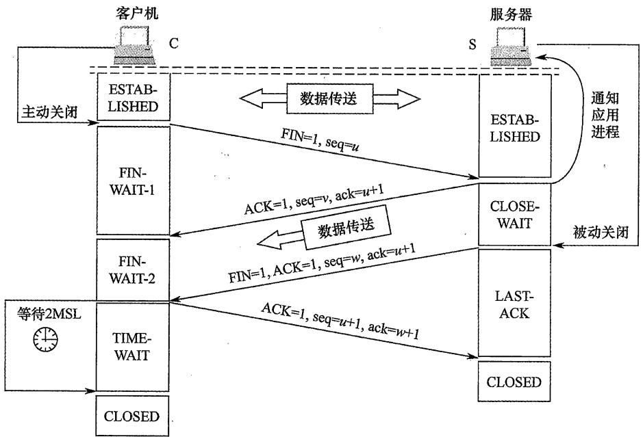

# 全国硕士研究生入学统一考试

# 计算机科学与技术学科联考

# 2022全国硕士研究生招生考试计算机学科专业基础试题参考答案

# 一、单项选择题

01. B 02. D 03. B 04. C 05. D 06. D 07. B 08. D  
09. D 10. A 11. D 12. A 13. B 14. A 15. C 16. A  
17. C 18. B 19. D 20. A 21. C 22. C 23. D 24. A  
25. C 26. B 27. C 28. D 29. A 30. D 31. B 32. A  
33. B 34. C 35. B 36. D 37. B 38. C 39. D 40. B

01. B。【解析】当外层循环的变量 $i$ 取不同值时，内层循环就执行多少次，因此总循环次数为 $i$ 的所有取值之和。假设外层循环共执行 $k$ 次，当 $i = 1,2,4,8,\dots,2^{k - 1}(2^{k - 1} < n \leq 2^k)$ 时，内层循环执行 $i$ 次，因此总循环次数 $T = 1 + 2 + 4 + 8 + \dots + 2^{k - 1} = 2^k - 1$ ，即 $n < T < 2n$ ，时间复杂度为 $O(n)$ 。  
02. D。【解析】通过模拟出入栈操作，可以判断入栈序列 in 和出栈序列 out 是否合法。因此，已知 in 序列可以判断 out 序列是否为可能的出栈序列；已知 out 序列也可以判断 in 序列是否为可能的入栈序列，A 和 B 错误。如果每个元素入栈后立即出栈，则 in 序列和 out 序列相同，C 错误。如果所有元素都入栈后才依次出栈，则 in 序列和 out 序列互为倒序，D 正确。  
03. B。【解析】对于此类题，每种情况只需举出一个反例即可。如图1所示，q是p的双亲，中序遍历序列为{p,q}，I可能。如图2所示，q是p的右孩子，中序遍历序列为{p,q}，II可能。如图4所示，q是p的双亲的双亲，中序遍历序列为{x,p,q}，IV可能。如图3所示，q是p的右兄弟，F是q和p的父结点，中序遍历要求先遍历左子树，再访问根结点，最后遍历右子树，因此一定先访问p，再访问F，最后访问q，p和q不可能相邻出现，III不可能。

  
图1

  
图2

  
图3

  
图4

04. C。【解析】高度一定的三叉树中结点数最多的情况是满三叉树。高度为 5 的满三叉树的结点数 $= 3^{0} + 3^{1} + 3^{2} + 3^{3} + 3^{4} = 121$ ，高度为 6 的满三叉树的结点数 $= 3^{0} + 3^{1} + 3^{2} + 3^{3} + 3^{4} + 3^{5} = 364$ 。由于三叉树 T 的结点数为 244， $121 < 244 < 364$ ，因此 T 的高度至少为 6。  
05. D。【解析】可以画一个简单的特例来证明。图1是满足条件的二叉树T1，图2是满足条件的二叉树T2，结点中有值表示这个结点是编码字符。T1和T2的结点数不同，A错误。T1的高度等于T2的高度，B错误。出现频次不同的字符在T1中也可能处于相同的层，C错误。对于定长编码集，所有字符一定都在T2中处于相同的层，而且都是叶子结点。

  
图1

  
图2

06. D。【解析】注意，V是图的边数，E是图的顶点数。A和B明显错误，如图1所示，|V|<|E|，但图G不连通；如图2所示，|V|>|E|，但图G不连通。如图3所示，在无向图中至少要有|V|-1个顶点才可能连通，顶点数小于|V|-1一定不可能连通，C错误，D正确。

  
图1

  
图2

  
图3

07. B。【解析】在AOE网中，活动的时间余量 $=$ 结束顶点的最迟开始时间-开始顶点的最早开始时间-该活动的持续时间。根据关键路径算法得到下表。

<table><tr><td>结点编号</td><td>1</td><td>2</td><td>3</td><td>4</td><td>5</td><td>6</td></tr><tr><td>最早开始时间 ve(i)</td><td>0</td><td>2</td><td>5</td><td>8</td><td>9</td><td>12</td></tr><tr><td>最迟开始时间 vl(i)</td><td>0</td><td>4</td><td>5</td><td>8</td><td>11</td><td>12</td></tr></table>

c 的时间余量 $= \mathrm{vl}(3) - \mathrm{ve}(2) - 1 = 5 - 2 - 1 = 2, \mathrm{g}$ 的时间余量 $= \mathrm{vl}(6) - \mathrm{ve}(3) - 1 = 12 - 5 - 1 = 6,$ h 的时间余量 $= \mathrm{vl}(5) - \mathrm{ve}(4) - 1 = 11 - 8 - 1 = 2, \mathrm{j}$ 的时间余量 $= \mathrm{vl}(6) - \mathrm{ve}(5) - 1 = 12 - 9 - 1 = 2,$ 时间余量最大的活动是 $\mathbf{g}$ 。

08. D。【解析】在5阶B树中，除根结点外的非叶结点的关键字数 $k$ 需要满足 $2 \leq k \leq 4$ 。当被删关键字 $\mathbf{x}$ 不在终端结点（最低层非叶结点）时，可以用 $\mathbf{x}$ 的前驱（或后继）关键字 $\mathbf{y}$ 来替代 $\mathbf{x}$ ，然后在相应结点中删除 $\mathbf{y}$ 。情况①：删除260，将其前驱110放入260处，删除110后的结点 $< 100>$ 不满足5阶B树定义，从左兄弟中借85，将85放入根中，将根中的90移入结点 $< 100>$ 变为 $< 90, 100>$ 。情况②：删除260，将其后继280放入260处，结点 $< 300>$ 不满足5阶B树定义且左右兄弟都不够借，结点 $< 300>$ 可以和左兄弟 $< 100, 110>$ 以及关键字280合并成一个新的结点 $< 100, 110, 280, 300>$ 。情况③：在情况②中，结点 $< 300>$ 也可以和右兄弟 $< 400, 500>$ 以及关键字350合并成一个新的结点 $< 300, 350, 400, 500>$ 。综上，T1根结点中的关键字序列可能是 $< 60, 85, 110, 350>$ 或 $< 60, 90, 350>$ 或 $< 60, 90, 280>$ ，仅D不可能。  
09. D。【解析】填装因子越大，说明哈希表中存储的元素越满，发生冲突的可能性就越高，导致平均查找长度越大。散列函数、冲突解决策略也会影响发生冲突的可能性。I、II、III都正确。  
10. A。【解析】送分概念题。王道书对归并的定义原话是“归并的含义是将两个或两个以上的有序表合并成一个新的有序表”，而二路归并是将两个有序表合并为一个新的有序表。  
11. D。【解析】直接插入排序和快速排序的特点如下表所示。

<table><tr><td></td><td>适合初始序列情况</td><td>适合元素数量</td><td>空间复杂度</td><td>稳定性</td></tr><tr><td>直接插入排序</td><td>大部分元素有序</td><td>较少</td><td>O(1)</td><td>稳定</td></tr><tr><td>快速排序</td><td>基本无序</td><td>较多</td><td>O(log2n)</td><td>不稳定</td></tr></table>

可见，I、II、III、IV都是采用直接插入排序而不采用快速排序的可能原因。

12. A。【解析】CPI 指平均每条指令的执行需要多少个时钟周期。由于 $80\%$ 的指令执行平均需要 1 个时钟周期， $20\%$ 的指令执行平均需要 10 个时钟周期，因此 $\mathrm{CPI} = 80\% \times 1 + 20\% \times 10 = 2.8$ 。计算机主频为 $1\mathrm{GHz}$ ，程序 P 共执行 10000 条指令，平均每条指令需要 2.8 个时钟周期，因此，CPU 执行时间 $= (10000 \times 2.8) / 10^{9} = 2.8 \times 10^{-5} \mathrm{s} = 28\mu \mathrm{s}$ 。

13. B。【解析】 $n$ 位补码整数的最小值是 $1,00\dots 0$ （即 $-2^{n - 1}$ ）；最大值是 $0,11\dots 1$ （即 $2^{n - 1} - 1$ ）。 $n$ 位补码整数所能表示的范围是 $-2^{n - 1} \sim 2^{n - 1} - 1$ ，32位补码整数所能表示的范围是 $-2^{31} \sim 2^{31} - 1$ 。

14. A。【解析】IEEE 754 单精度浮点数格式中依次为数符 1 位、阶码 8 位（偏置值 127）、尾数 23 位（隐藏 1 位）。 $-0.4375 = -1.75 \times 2^{-2}$ ，保证小数点前是 1。根据单精度浮点数格式，数符为 1；阶码为移码表示， $-2 + 127 = 125$ ，写成 8 位二进制数为 01111101；尾数隐藏小数点前的 1，剩下的 0.75 写成二进制数为 0.11，所以尾数部分是 1100...0。该浮点数的二进制格式为 1011 1110 111000000000000000000，对应的十六进制格式为 BEE0000H。

15. C。【解析】页大小为 $4\mathrm{KB} = 2^{12}\mathrm{B}$ ，按字节编址，故页内地址为12位。虚拟地址空间大小为 $4\mathrm{GB} = 2^{32}\mathrm{B}$ ，故虚拟地址共32位，其中低12位为页内地址，高20位为虚页号。题中给出的虚拟地址为00082840H，虚页号为高20位即00082H（页内地址为低12位即840H），82H对应的十进制数为130（注意题中页表的虚页号部分末尾未写H，所以是十进制数，故查找时要先将虚页号转换为十进制数），查页表命中，且存在位为1，对应页框号为018H。将查找到的页框号018H和页内地址840H拼接，得到主存地址为018840H。

16. A。【解析】Cache 采用组相联映射，主存地址结构应分为 Tag 标记、组号、块内地址三部分。主存块大小 = Cache 块大小 = 64B = 2^6B，因此块内地址占 6 位。Cache 数据区容量为 32KB，每个 Cache 块大小为 64B，则 Cache 总块数 = 32KB/64B = 2^9，由于采用 8 路组相联映射，即每 8 个 Cache 块为一个分组，因此总共被分为 $2^9 / 8 = 2^6$ 组，因此，组号占 6 位。除了块内地址和组号，剩余的位为 Tag 标记，占 $32 - 6 - 6 = 20$ 位。地址结构如下所示。

<table><tr><td>Tag 标记</td><td>组号</td><td>块内地址</td></tr><tr><td>20 位</td><td>6 位</td><td>6 位</td></tr></table>

Cache采用8路组相联映射，因此在访问一个物理地址时，要先根据组号定位到某一分组，然后用物理地址的高20位（Tag标记）与分组中8个Cache行的Tag标记做并行比较（用8个20位“比较器”实现），若某个Cache行的Tag标记与物理地址的高20位完全一致，则选中该Cache行。综上所述，在组相联映射的Cache中，“比较器”用于并行地比较分组中所有Cache行的Tag标记位与欲访问物理地址的Tag标记位，因此比较器的个数就是分组中的Cache行数8，比较器的位数就是Tag标记位数20。

17. C。【解析】 $8 \times 8192 \times 8192 \times 8\mathrm{bit} = 512\mathrm{MB}$ ，内存条的容量为512MB，A正确。存储器总线宽度 $64 = 8 \times 8\mathrm{bit}$ ，而每个芯片一次只能传输8bit，需要8体多模块交叉编址才能实现，B正确。 $512\mathrm{MB} = 2^{29}\mathrm{B}$ ，按字节编址，因此芯片的地址引脚为29位，C错误。芯片内行数是8192，一行的大小是 $8192 \times 8\mathrm{bit}$ ，行缓冲长度就是一行的大小，D正确。

18. B。【解析】指令集处于软硬件的交界面上。指令字和指令格式、通用寄存器个数和位数都与机器指令有关，由 ISA 规定。两个 CPU 可以有不同的时钟周期，但指令集可以相同，CPU 的时钟周期不由 ISA 规定。加法器的进位方式涉及电路设计，也不由指令集规定。

19. D。【解析】地址码为 6 位，一条二地址指令会占用 $2^{6}$ 条一地址指令的空间，一条一地址指令

会占用 $2^{6}$ 条零地址指令的空间。如果全都是零地址指令，则最多有 $2^{16}$ 条，减去一地址指令和二地址指令所占用的零地址指令空间，即 $2^{16} - 254 \times 2^{6} - 12 \times 2^{6} \times 2^{6} = (2^{10} - 254 - 12 \times 2^{6}) \times 2^{6} = (4 \times 2^{6} - 254) \times 2^{6} = 2 \times 2^{6} = 128$ 。

20. A。【解析】将源程序转换为可执行目标文件的过程分为预处理、编译、汇编、链接四个阶段。  
21. C。【解析】中断 I/O 方式适用于字符型设备，此类设备的特点是数据传输速率慢，以字符或字为单位进行传输，A 正确。若采用中断 I/O 方式，当外设准备好数据后，向 CPU 发出中断请求，CPU 暂时中止现行程序，转去运行中断服务程序，由中断服务程序完成数据传送，B 正确。若外设准备数据的时间小于中断处理时间，则可能导致数据丢失，以输入设备为例，设备为进程准备的数据会先写入设备控制器的缓冲区（缓冲区大小有限，通常只能暂存几个字节），缓冲区每写满一次，就会向 CPU 发出一次中断请求，CPU 响应并处理中断的过程，就是将缓冲区中的数据“取走”的过程，因此若外设准备数据的时间小于中断处理时间，则可能导致外设往缓冲区写入数据的速度快于 CPU 从缓冲区取走数据的速度，从而导致缓冲区的数据被覆盖，进而导致数据丢失。C 错误。若采用中断 I/O 方式，则外设为某进程准备数据时，可令该进程阻塞，CPU 运行其他进程，D 正确。  
22. C。【解析】MIMD结构分为多计算机系统和多处理器系统，A正确。向量处理器是SIMD的变体，属于SIMD结构，B正确。硬件多线程技术是在一个核中处理多个线程，可用于单核处理器，C错误。共享内存多处理器（SMP）具有共享的单一物理地址空间，所有核都可通过存取指令来访问同一片主存地址空间，D正确。  
23. D。【解析】操作系统的基本特点：并发、共享、虚拟、异步，其中最基本、一定要实现的是并发和共享，A、C正确。早期的多道批处理操作系统会将所有进程的数据全部调入主存，再让多道程序并发执行，即使不支持虚拟存储管理，也能实现“多道程序并发”，B正确。进程多并不意味着CPU利用率高，进程数量越多，进程之间的资源竞争越激烈，甚至可能因为资源竞争而出现死锁现象，导致CPU利用率低，D错误。  
24. A。【解析】在操作系统初始化的过程中需要创建中断向量表，用于实现“中断处理”，CPU检测到中断信号后，根据中断号查询中断向量表，跳转到对应的中断处理程序，A正确。当硬盘被逻辑格式化时，需要对硬盘进行分区，即创建硬盘分区表。分区完成后，需要在每个分区初始化一个特定的文件系统，并创建文件系统的根目录。如果某个分区采用Unix文件系统（UFS），则还要在该分区中建立文件系统的索引结点表。综上，C是在硬盘逻辑格式化的过程中完成的，B、D是在初始化文件系统的过程中完成的。  
25. C。【解析】0时刻调度进程P0获得CPU；10ms时P2进入就绪队列，调度P2抢占获得CPU；15ms时P3进入就绪队列，调度P3抢占获得CPU；25ms时P3执行完毕，调度P2获得CPU；40ms时P2执行完毕，调度P0获得CPU；130ms时P2执行完毕，调度P1获得CPU；190ms时P2执行完毕，结束；总共调度6次。  
26. B。【解析】初始时系统中的可用资源数为 $<1,3,2>$ ，只能满足 P0 的需求 $<0,2,1>$ ，所以安全序列第一个只能是 P0，将资源分配给 P0 后，P0 执行完释放所占资源，可用资源数变为 $<1,3,2> + <2,0,1> = <3,3,3>$ ，此时可用资源数既能满足 P1，也能满足 P2，可以先分配给 P1，P1 执行完释放资源再分配给 P2；也可以先分配给 P2，P2 执行完释放资源再分配给 P1。所以安全序列可以是 ① P0、P1、P2 或 ② P0、P2、P1。  
27. C。【解析】CPU 在用户态时只能执行非特权指令，在内核态时可以执行特权指令和非特权指令。  
28. D。【解析】进程 P 读文件时，进程从执行态进入阻塞态，等待磁盘 I/O 完成，I 正确。进程 P

的时间片用完，导致进程从执行态进入就绪态，转入就绪队列等待下次被调度，II 错误。进程 P 申请外设，若外设是独占设备且正在被其他进程使用，则进程 P 从执行态进入阻塞态，等待系统分配外设，III 正确。进程 P 执行信号量的 wait() 操作，如果信号量的值小于等于 0，则进程进入阻塞态，等待其他进程用 signal() 操作唤醒，IV 正确。

29. A。【解析】缺页异常需要从磁盘调页到内存中，将新调入的页与页框建立对应关系，并修改该页的存在位，B、C、D正确；如果内存中有空闲页框，就不需要淘汰其他页，A错误。  
30. D。【解析】页置换算法会影响缺页率，例如，LRU 算法的缺页率通常要比 FIFO 算法的缺页率低，排除 A。工作集的大小决定了分配给进程的物理块数，分配给进程的物理块数越多，缺页率就越低，排除 B。进程的数量越多，对内存资源的竞争越激烈，每个进程被分配的物理块数越少，缺页率也就越高，排除 C。页缓冲队列是将被淘汰的页面缓存下来，暂时不写回磁盘，队列长度会影响页面置换的速度，但不会影响缺页率，答案选 D。  
31. B。【解析】发生系统调用时，CPU执行陷入（Trap）指令，检测到“内中断”后，由CPU负责保存断点（PC）和程序状态字，并将CPU模式改为内核态，然后执行操作系统内核的系统调用入口程序，该内核程序负责保存通用寄存器的内容，再调用某个特定的系统调用服务例程。综上，I、IV是由硬件完成的，II、III是由操作系统完成的。  
32. A。【解析】厂家在设计一个设备时，通常会为该设备编写驱动程序，主机需要先安装驱动程序，才能使用设备。当一个设备被连接到主机时，驱动程序负责初始化设备（如将设备控制器中的寄存器初始化），B 正确。当进程在执行驱动程序时，可能会因为设备忙碌而进入阻塞态，C 正确。设备的读/写操作本质就是在设备控制器和主机之间传送数据，而只有厂家知道设备控制器的内部实现，因此也只有厂家提供的驱动程序能控制设备的读/写操作，D 正确。厂家会根据设备特性，在驱动程序中实现一种合适的 I/O 控制方式，A 错误。  
33. B。【解析】在 OSI 参考模型中，数据链路层、网络层、传输层都具有流量控制功能，数据链路层是相邻结点之间的流量控制，网络层是整个网络中的流量控制，传输层是端到端的流量控制。  
34. C。【解析】根据奈奎斯特定理，最大数据传输速率 $= 2W\log_2V$ ，4个幅值的ASK调制说明有4个相位，将 $V = 4$ 代入，得800kbps。  
35. B。【解析】主机所在网络的网络地址可以通过主机的 IP 地址和子网掩码逐位相与得到。子网掩码 255.255.192.0 的二进制前 18 位为 1、后 14 位为 0，把主机 IP 地址的后 14 位变为 0，得到的结果为 183.80.64.0，即为主机所在网络的网络地址。  
36. D。【解析】默认网关可以理解为离当前主机最近的路由器的端口地址，所以是192.168.1.62，而该主机的子网掩码和网关的子网掩码也相同，/27即为255.255.255.224。  
37. B。【解析】SDN 对上层开发者提供的编程接口称为北向接口，而南向接口则负责控制平面和数据平面间的通信，所以 SDN 控制器向数据平面的 SDN 交换机下发流表时使用南向接口。  
38. C。【解析】时刻 0 发生了超时，门限值 ssthresh 变为拥塞窗口 cwnd 的一半即 8，同时 cwnd 置为 1，执行慢开始算法，cwnd 指数增长，经过 3 个 RTT，增长到 ssthresh 值；之后执行拥塞避免算法，cwnd 线性增长，再经过 8 个 RTT，增长到 16，共花费 11 个 RTT，如下表所示。

<table><tr><td>时刻</td><td>0</td><td>1</td><td>2</td><td>3</td><td>4</td><td>5</td><td>6</td><td>7</td><td>8</td><td>9</td><td>10</td><td>11</td></tr><tr><td>拥塞窗口</td><td>1</td><td>2</td><td>4</td><td>8</td><td>9</td><td>10</td><td>11</td><td>12</td><td>13</td><td>14</td><td>15</td><td>16</td></tr></table>

39. D。【解析】TCP 连接的释放过程如下图所示。题目问的是最少时间，所以当服务器 S 收到客户 C 发送的 FIN 请求后不再发送数据，而是立马发送 FIN 请求（即第②步和第③步同时发生，

忽略FIN-WAIT-2和CLOSE-WAIT状态)。C收到S发来的FIN报文段后，进入CLOSED状态还需等到TIME-WAIT结束，总用时至少为 $1\mathrm{RTT} + 2\mathrm{MSL} = 50 + 800\times 2 = 1650\mathrm{ms}$ 。S进入CLOSED状态需要经过3次报文段的传输时间，即 $1.5\mathrm{RTT} = 75\mathrm{ms}$



40. B。【解析】HTTP/1.1默认使用流水线的持久连接，所有请求都是连续发送的。题目要求最少时间，最理想的流程是TCP在第三次握手的报文段中捎带HTTP请求，以及TCP连接后慢开始阶段不考虑拥塞情况。假设接收方有足够大的缓存空间，即发送窗口等同于拥塞窗口，总共需要经过：第1个RTT，进行TCP连接，此时服务器S的发送窗口 $= 1\mathrm{MSS}$ ，并在第三次握手时捎带HTTP请求；第2个RTT，服务器S发送大小为1MSS的html文件，主机C确认后服务器S的发送窗口变为2MSS；第3个RTT，服务器S发送大小为2MSS的图像文件，主机C确认后服务器S的发送窗口变为4MSS；第4个RTT，服务器S发送剩下的1MSS图像文件，完成传输，总共需要4个RTT，即40ms。

# 二、综合应用题

# 41.【解析】

# 【答案1】

# 1）算法的基本设计思想

对于采用顺序存储方式保存的二叉树，根结点保存在 SqBiTreeNode[0]中；当某结点保存在 SqBiTreeNode[i]中时，若有左孩子，则其值保存在 SqBiTreeNode[2i+1]中；若有右孩子，则其值保存在 SqBiTreeNode[2i+2]中；若有双亲结点，则其值保存在 SqBiTreeNode[(i-1)/2]中。

二叉搜索树需要满足的条件是：任一结点值大于其左子树中的全部结点值，小于其右子树中的全部结点值。中序遍历二叉搜索树得到一个升序序列。

使用整型变量 val 记录中序遍历过程中已遍历结点的最大值，初值为一个负整数。若当前遍历的结点值小于等于 val，则算法返回 false，否则，将 val 的值更新为当前结点的值。

# 2）算法实现

```txt
define false 0
#define true 1
typedef int bool;
bool judgeInOrderBST(SqBiTree bt, int k, int *val) { //初始调用时k的值是0
if (k < bt.Num && bt.SqBiTreeNode[k] != -1)
{
if (!judgeInOrderBST(bt, 2*k + 1, val)) return false;
if (bt.SqBiTreeNode[k] <= *val) return false;
*val = bt.SqBiTreeNode[k];
if (!judgeInOrderBST(bt, 2*k + 2, val)) return false;
}
return true;
} 
```

# 【答案2】

# 1）算法的基本设计思想

对于采用顺序存储方式保存的二叉树，根结点保存在 SqBiTreeNode[0]中；当某结点保存在 SqBiTreeNode[i]中时，若有左孩子，则其值保存在 SqBiTreeNode[2i+1]中；若有右孩子，则其值保存在 SqBiTreeNode[2i+2]中；若有双亲结点，则其值保存在 SqBiTreeNode[(i-1)/2]中。

二叉搜索树需要满足的条件是：任一结点值大于其左子树中的全部结点值，小于其右子树中的全部结点值。设置两个数组 pmax 和 pmin。根据二叉搜索树的定义，SqBiTNode[i] 中的值应该大于以 SqBiTNode[2i+1]为根的子树中的最大值（保存在 pmax[2i+1] 中），小于以 SqBiTNode[2i+2]为根的子树中的最小值（保存在 pmin[2i+1]中）。初始时，用数组 SqBiTNode 中前 ElemNum 个元素的值对数组 pmax 和 pmin 初始化。

在数组 SqBiTreeNode 中从后向前扫描，扫描过程中逐一验证结点与子树之间是否满足上述的大小关系。

# 2）算法实现

```txt
define false 0
#define true 1
typedef int bool;
bool judgeBST(SqBiTree bt) {
    int k, m, *pmin, *pmax;
    pmin = (int *) malloc(sizeof(int) * (btElemNum);
    pmax = (int *) malloc(sizeof(int) * (btElemNum);
    for (k = 0; k < bt ElemNum; k++) //辅助数组初始化
        pmin[k] = pmax[k] = bt.SqBiTreeNode[k];
    for (k = bt ElemNum - 1; k > 0; k--) { //从最后一个叶结点向根遍历
        if (bt.SqBiTreeNode[k] != -1)
            m = (k - 1) / 2; //双亲
            if (k%2 == 1 && bt.SqBiTreeNode[m] > pmax[k]) //其为左孩子
                pmin[m] = pmin[k];
            else if (k%2 == 0 && bt.SqBiTreeNode[m] < pmin[k]) //其为右孩子
                pmax[m] = pmax[k];
            else return false;
        }
    } 
```

# 42.【解析】

# 1）算法思想

【答案1】

定义含10个元素的数组A，初始时元素值均为该数组类型能表示的最大数MAX。

for M中的每个元素s

if $(s < A[9])$ 丢弃A[9]并将s按升序插入到A中;

当数据全部扫描完毕，数组A[0]～A[9]保存的即是最小的10个数。

【答案2】

定义含10个元素的大根堆H，元素值均为该堆元素类型能表示的最大数MAX。

for M中的每个元素s

if $(s < H$ 的堆顶元素）删除堆顶元素并将s插入到H中;

当数据全部扫描完毕，堆H中保存的即是最小的10个数。

2）算法平均情况下的时间复杂度是 $O(n)$ ，空间复杂度是 $O(1)$ 。

# 43.【解析】

1）符号标志SF表示运算结果的正负性，因此 $\mathrm{SF} = \mathrm{F}_{15}$ 。

对于加法运算 $\mathrm{A} + \mathrm{B}\rightarrow \mathrm{F}$ ，若A、B为负，且F为正，则说明发生溢出；或者，若A、B为正，且F为负，也说明发生溢出。因此，加运算时，溢出标志 $\mathrm{OF} = \overline{\mathrm{A}_{15}}\cdot \overline{\mathrm{B}_{15}}\cdot \mathrm{F}_{15} + \mathrm{A}_{15}\cdot \mathrm{B}_{15}\cdot \overline{\mathrm{F}_{15}}$ 。

对于减法运算 $\mathrm{A} - \mathrm{B} \rightarrow \mathrm{F}$ ，若 $\mathbf{A}$ 为负、 $\mathbf{B}$ 为正，且 $\mathbf{F}$ 为正，则说明发生溢出；或者，若 $\mathbf{A}$ 为正、 $\mathbf{B}$ 为负，且 $\mathbf{F}$ 为负，也说明发生溢出。因此，减运算时，溢出标志 $\mathrm{OF} = \overline{\mathrm{A}_{15}} \cdot \mathrm{B}_{15} \cdot \mathrm{F}_{15} + \mathrm{A}_{15} \cdot \overline{\mathrm{B}_{15}} \cdot \overline{\mathrm{F}_{15}}$ 。

2）因为在单总线结构中，每一时刻总线上只有一个数据有效，而ALU有两个输入端和一个输出端。因此，当ALU运算时，需要先用暂存器Y缓存其中一个输入端的数据，再通过总线传送另一个输入端的数据。与此同时，ALU的输出端产生运算结果，但由于总线正被占用，因此需要暂存器Z，以缓存ALU的输出端数据。  
3）由图可知，rs和rd都是4bit，因此GPRs中最多有 $2^{4} = 16$ 个通用寄存器；rs和rd来自指令寄存器IR；rd表示寄存器编号，应连接地址译码器。  
4）取指阶段需要根据程序计数器PC取出主存中的指令，并将指令写入指令寄存器IR中。控制信号序列如下：

$①$ PCout, MARin //将指令的地址写入MAR  
(2)Read //读主存, 并将读出的数据写入 MDR  
③MDRout, IRin //将MDR的内容写入指令寄存器IR

步骤①需要1个时钟周期，步骤②需要5个时钟周期，步骤③需要1个时钟周期，因此取指令阶段至少需要7个时钟周期。

5）图中控制信号由控制部件（CU）产生。指令寄存器IR和标志寄存器FR的输出信号会连到控制部件的输入端。

# 44.【解析】

1）3个字段的名称为柱面号（或磁道号）、磁头号（或盘面号）、扇区号。由于每个盘面有20000个磁道，因此该磁盘共有20000个柱面，柱面号字段至少占 $\lceil \log_220000\rceil = 15$ 位；由于该磁盘共有4个盘片，每个盘片有2个盘面，因此磁头号字段至少占 $\log_2(4\times 2) = 3$ 位；由于每个磁道有500个扇区，因此扇区号字段至少占 $\lceil \log_2500\rceil = 9$ 位。  
2）一个扇区的访问时间由寻道时间、延迟时间、传输时间三部分组成。平均寻道时间为 $5 \mathrm{~ms}$ ,平均延迟时间等于磁盘转半圈所需要的时间, 平均传输时间等于一个扇区划过磁头下方所

需要的时间。而该磁盘转一圈的时间为 $60 \times 10^{3} / 7200 \approx 8.33 \mathrm{~ms}$ ，因此一个扇区的平均访问时间约为 $5 + 8.33 / 2 + 8.33 / 500 \approx 9.18 \mathrm{~ms}$ 。

3）磁盘控制器中的数据缓冲区每充满一次，DMA 控制器就需要发出一次总线请求，将这 64bit 数据通过总线传送到主存，因此，在一个扇区读写过程中，DMA 控制器向 CPU 发送了 $512 \mathrm{~B} / 64 \mathrm{bit} = 64$ 次总线请求。由于采用周期挪用 DMA 方式，因此当 CPU 和 DMA 控制器都需要访问主存时，DMA 控制器可以优先获得总线使用权。因为一旦磁盘开始读写，就必须按时完成数据传送，否则数据缓冲区中的数据会发生丢失。

# 45.【解析】

1）在该文件系统中，目录项由文件名和索引结点号构成。由图a可知，stu目录下有两个文件，分别是course和doc。由图b可知，这两个文件分别对应索引结点号2和10。因此，目录文件stu中两个目录项的内容是

<table><tr><td>文件名</td><td>索引结点号</td></tr><tr><td>course</td><td>2</td></tr><tr><td>doc</td><td>10</td></tr></table>

2）由图b可知，文件doc和文件course1对应的索引结点号都是10。说明doc和course1两个目录项共享同一个索引结点，本质上对应同一个文件。而文件course1存储在30号磁盘块，因此文件doc占用的磁盘块的块号 $\mathbf{x}$ 为30。  
3）需要读2个磁盘块。先读course1的索引结点所在的磁盘块，再读course1的内容所在的磁盘块。目录文件course的内容已在内存中，即course1、course2对应的目录项已在内存中，根据course1对应的目录项可以知道其索引结点号，即可读入course1的索引结点所在的磁盘块；根据course1的索引结点可知该文件存储在30号磁盘块，因此可再读入course1的内容所在的磁盘块。  
4）存取course2需要使用索引结点的一级和二级间接地址项。6MB大小的文件需要占用 $6\mathrm{MB} / 4\mathrm{KB} = 1536$ 个磁盘块。直接地址项可以记录10个磁盘块号，一级间接地址块可以记录 $4\mathrm{KB} / 4\mathrm{B} = 1024$ 个磁盘块号，二级间接地址块可以记录 $1024\times 1024$ 个磁盘块号，而 $10+$ $1024 < 1536 < 10 + 1024 + 1024\times 1024$ 。因此，6MB大小的文件，需要使用一级间接地址项和二级间接地址项（拓展：若文件的总大小超出 $10 + 1024 + 1024\times 1024$ 块，则还需使用三级间接地址项）。

# 46.【解析】

进程T1要依次执行A、E、F。进程T2要执行B、C、D。由图可知，T2执行C必须在T1执行完A之后；T1执行E必须在T2执行完C之后。因此，有两对同步关系。信号量的定义和同步关系的描述如下：

<table><tr><td colspan="2">Semaphore SAC=0; // 描述 A、C 之间的同步关系Semaphore SCE=0; // 描述 C、E 之间的同步关系</td></tr><tr><td>T1:</td><td>T2:</td></tr><tr><td>A;</td><td>B;</td></tr><tr><td>signal(SAC);</td><td>wait(SAC);</td></tr><tr><td>wait(SCE);</td><td>C;</td></tr><tr><td>E;</td><td>signal(SCE);</td></tr><tr><td>F;</td><td>D;</td></tr></table>

# 47.【解析】

1）设备1选择100BaseT以太网交换机，设备2选择100BaseT集线器。因为物理层设备既不能隔离冲突域也不能隔离广播域，链路层设备可以隔离冲突域但不能隔离广播域。  
2）假设H2与H3之间的最远距离是D，根据CSMA/CD协议的工作原理有

最短帧长 $=$ 总线传播时延 $\times$ 数据传输速率 $\times 2$

本题中由于使用100BaseT局域网标准，所以数据传输速率为100Mbps，总线传播时延由两部分组成，一部分是信号传播时延，另一部分是信号通过设备2时产生的额外 $1.51\mu \mathrm{s}$ 时间延迟。代入公式为 $64\mathrm{B} = (1.51\mu \mathrm{s} + D / (2\times 10^{8}\mathrm{m / s}))\times 100\mathrm{Mbps}$ ，注意单位换算，最终解得 $D = 210\mathrm{m}$ 。

3）M是DHCP发现报文（DISCOVER报文）。路由器E0接口能收到封装M的以太网帧，由于H4发送的DHCP发现报文是广播的形式，所以同一个广播域内的所有设备和接口都可以收到该以太网帧。由于是广播帧，所以目的MAC地址是全1，S向DHCP服务器转发的封装M的以太网帧的目的MAC地址是FF-FF-FF-FF-FF。  
4）在H5收到的帧中，地址1、地址2和地址3分别是00-11-11-11-11-E1、00-11-11-11-11-C1和00-11-11-11-11-D1。该帧来自AP，地址1代表接收端的地址，地址2代表AP的地址，地址3是发送端的地址。