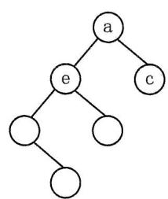
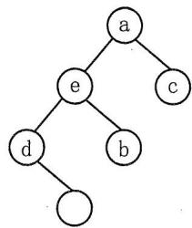
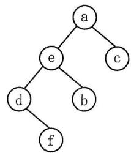

# 2023年全国硕士研究生招生考试

# 计算机学科专业基础试题参考答案及解析

# 一、单项选择题

<table><tr><td>01. D</td><td>02. C</td><td>03. A</td><td>04. B</td><td>05. A</td><td>06. B</td><td>07. B</td><td>08. B</td><td>09. C</td><td>10. C</td></tr><tr><td>11. D</td><td>12. C</td><td>13. A</td><td>14. A</td><td>15. C</td><td>16. B</td><td>17. A</td><td>18. B</td><td>19. C</td><td>20. D</td></tr><tr><td>21. D</td><td>22. C</td><td>23. D</td><td>24. A</td><td>25. C</td><td>26. D</td><td>27. C</td><td>28. D</td><td>29. B</td><td>30. C</td></tr><tr><td>31. B</td><td>32. D</td><td>33. D</td><td>34. C</td><td>35. B</td><td>36. C</td><td>37. D</td><td>38. A</td><td>39. B</td><td>40. D</td></tr></table>

01. D。【解析】A选项的操作涉及在有序表中搜索给定值元素。在顺序存储结构中，可以通过遍历数组来进行搜索，遍历的时间复杂度为 $O(n)$ ，也可以采用折半查找，遍历的时间复杂度为 $O(logn)$ 。B选项的操作涉及将给定值元素插入到有序表中的适当位置。在顺序存储结构中，插入一个元素可能需要移动其他元素，以便为新元素腾出空间。这个过程的时间复杂度取决于元素的插入位置，最坏情况下可能需要移动整个数组，时间复杂度为 $O(n)$ 。C选项涉及从有序表中删除指定位置的元素。在顺序存储结构中，删除一个元素后，后面的元素需要向前移动以填补空缺。这个过程的时间复杂度也取决于删除位置，最坏情况下可能需要移动整个数组，时间复杂度为 $O(n)$ 。D选项的操作涉及直接访问有序表中指定位置的元素值，在顺序存储结构中，可以通过索引来直接访问数组中的元素，因此这个操作的时间复杂度为 $O(1)$ 。所以本题的正确选项为 D。  
02. C。【解析】本题选项为C，主要考察双链表的插入操作，解决这类问题可在纸上画出具体的双链表进行模拟。因为s->next已经赋值为p的后一个结点，同时p->next指针已经赋值为s。所以只需要处理s->prev和s->next->prev的赋值，s->prev需要指向p，s->next->prev需要指向s，因为p->next和s指向同一个结点，所以可以用p->next代表s。故本题的正确选项为C。  
03. A。【解析】存储稀疏矩阵 M，我们只需要知道 M 的行数和列数，便可以算出该矩阵共有多少个元素，三元组存储每个非零元素的位置，当我们需要某个位置的元素，可以先根据 M 的行数和列数判断是否越界，如果没有越界，在三元组进行查找，如果三元组没有保存对应位置的值，代表矩阵中该位置的值为 0。所以正确选项为 A。  
04. B。【解析】计算字符集 S 构造的哈夫曼编码的加权平均长度，我们需要使用字符的频次来确定每个字符的编码长度，并计算加权平均值。给定字符集 S 中各字符出现的频次为 3, 4, 5, 6, 8, 10，我们可以按照哈夫曼编码算法构造哈夫曼树。构建的哈夫曼树如下图所示。加权平均长度 = (编码长度 $1 \times$ 频次 $1 +$ 编码长度 $2 \times$ 频次 $2 + \dots +$ 编码长度 $n \times$ 频次 $n$ ) / (频次 $1 +$ 频次 $2 + \dots +$ 频次 $n$ )，在本题中，加权平均长度 $= ((3 + 4 + 5 + 6) \times 3 + (8 + 10) \times 2) / (3 + 4 + 5 + 6 + 8 + 10) = 2.5$ 。


05. A。【解析】如下图所示。对于后序序列 fdbc a, a 为树的根节点, 因此在序号 1 中, a 首先进行绘制。同时, a 节点的左子树有 4 个节点, 右子树有 1 个节点, 因此 fdbc 属于左子树, c 节点属于右子树, 所以我们在序号 2 的树中, 填充 c。a 结点左子树的后序遍历序列为 fdbc, 代表 e 为左子树的根节点, 因此在序号 3 的树中, 填充 e。同理 e 节点的左子树有两个节点, 右子树有一个节点, 因此 fd 属于左子树, b 属于右子树, 在序号 4 的树中, 我们填写 b。e 的左子树的后序遍历序列为 fd, 则 d 为子树的根节点, 因此在序号 5 的树中, 我们填充 d, 最后在序号 6 的图中, 填充 f。




  
1   
4

  
5

  
6

06. B。【解析】普里姆算法（选项）和克鲁斯卡尔算法（选项）是用于解决最小生成树问题的算法，它们并不直接适用于求解最短路径问题。广度优先遍历（BFS）是一种图遍历算法，可以用于求解单源最短路径问题。在权值均为1的情况下，BFS算法从给定的起始顶点开始遍历，按照层级顺序逐步扩展，每次扩展一层。这样，当BFS遍历到目标顶点时，它所经过的边数就是从起始顶点到目标顶点的最短路径长度。因此，BFS算法可以用于求解图G中从某个顶点到其余各个顶点的最短路径。因此本题正确选项为B。  
07. B。【解析】B 树是一种平衡的多路搜索树，它的特点是可以容纳更多的关键字和子结点。当进行插入操作时，如果插入的关键字导致结点已满，树的高度可能会增加，因为需要进行结点的分裂操作来保持 B 树的平衡。选项 I 正确。删除的结点如果为叶节点，则叶结点肯定会发生改变，如果删除的结点为非叶子结点，最终也需要转换为删除叶子结点，所以也会引起叶子结点的变化。选项 II 正确。B 树查找操作并不一定会找到叶结点，它会根据关键字的大小选择合适的路径进行搜索，可能会在非叶结点上停止查找，选项 III 错误。关键字插入时的初始位置为叶子结点，但可以会因为结点的关键字超出容量而导致分裂，从而上升到父结点，所以最终的位置不在叶结点。选项 IV 错误。所以本题的正确选项为 B 选项。  
08. B。【解析】在含有 600 个元素的有序表进行折半查找时，其关键字比较次数最多的情况发生在目标元素不在表中的情况下。在这种情况下，折半查找会进行到最后一步，直到左边界和右边界相遇。因此，关键字比较次数最多的情况是在查找过程中遍历整个表的情况。在进行折半查找时，每次比较会将查找范围缩小一半，直到找到目标元素或确定目标元素不在表中。对于 600 个元素的有序表，因为 $\log_2(600) = 9.22$ ，采用 9 次遍历并不能查找完成，因此需要 10 次查找。

所以本题的正确选项为B选项。

09. C。【解析】线性探测再散列法中删除一个关键字会导致后面的关键字无法通过线性探测找到正确的位置。当删除一个关键字时，为了保持散列表的连续性，通常会将后续的关键字向前移动填充空缺，这样后续的查找操作才能继续正确地找到它们。然而，如果删除的是一个位于中间位置的关键字，后面的关键字需要依次向前移动，这会导致删除操作的时间复杂度较高，因为需要移动大量的关键字。为了解决删除操作中的位置依赖性问题，可以使用删除标记来表示一个位置上的关键字已被删除。如下表所示，查找失败的平均查找长度为 $(1 + 3 + 2 + 1 + 2) / 5 = 1.8$ 所以本题的正确答案选择C选项。

<table><tr><td>地址</td><td>0</td><td>1</td><td>2</td><td>3</td><td>4</td></tr><tr><td>key</td><td></td><td>2022</td><td>12</td><td></td><td>25 (Delete)</td></tr><tr><td>查找失败次数</td><td>1</td><td>3</td><td>2</td><td>1</td><td>2</td></tr></table>

10. C。【解析】快速排序在每一轮划分时，通常选择一个枢轴元素将序列分成两部分，并且在交换元素时可能改变相同关键字元素的相对顺序，因此不是稳定的排序算法。堆排序使用堆数据结构进行排序，其中在建堆和调整堆的过程中，元素的交换可能导致相同关键字元素的相对顺序发生改变，因此堆排序也不是稳定的排序算法。希尔排序是基于插入排序的一种改进算法，它通过将待排序的序列划分成若干个较小的子序列进行插入排序，然后逐步缩小子序列的间隔，最终完成整个序列的排序。由于希尔排序是通过跳跃式的插入排序进行排序的，相同关键字的元素可能会跨越较大的间隔进行比较和交换。这种跨越较大间隔的比较和交换可能导致相同关键字的元素的相对顺序发生改变，因此希尔排序是不稳定的排序算法。因此不稳定的排序算法有希尔排序、快速排序、堆排序。本题答案选C。

11. D。【解析】在快速排序算法中，划分过程通常选择一个枢轴元素来将待排序序列划分为两个子序列。因为是升序排序，所以枢纽元素的前半个子序列的值需要都小于枢轴值，后半个子序列的值需要都大于枢轴值。分别从每个选项来看，A 选项的枢轴值为 11，前半个子序列的值只有 68，大于枢轴值 11，不符合。B 选项的枢轴值为 70，前半个子序列都小于 70，但后半个子序列存在 23 和 48 小于 70，不符合。C 选项的枢轴值为 80，前半个子序列的值都小于 80，但是后半个子序列存在 48 小于 80，不符合。D 选项的枢轴值为 81，81 前面的元素都小于 81，81 后面的元素都大于 81，符合。因此本题的正确选项为 D。

12. C。【解析】P每条指令平均需要1.2个时钟周期，机器M的主频为 $1.5\mathrm{GHz}$ ，代表每秒共有1.5G个时钟周期，则每秒能执行 $1.5\mathrm{G} / 1.2 = 1.25\mathrm{G}$ 条指令。执行P程序共需要 $5\times 10^{5}\times 1.2 = 6\times 10^{5}$ 个时钟周期，每秒有1.5G个时钟周期，则 $6\times 10^{5}$ 个时钟周期共需要 $6\times 10^{5} / 1.5\mathrm{G} = 0.4\mathrm{ms}$ 。所以本题的正确答案为C。

13. A。【解析】机器数是计算机内部用来表示和存储数值的二进制形式。对于有符号的 short 型变量，通常采用补码表示法。对于给定的 short 型变量 $x = -8190$ ，我们需要将其转换为二进制的补码表示。因为 short 型变量为 2B，即 16 位，所以 $8190 = 000111111111110B$ ，然后取其二进制补码（负数取反后加 1），补码为 1110000000000010B，转化为 16 进制为 E002H。因此正确选项为 A。

14. A。【解析】给定的机器数为 $80200000\mathrm{H}$ ，表示一个32位的二进制数。我们需要将其转换为float型变量的值。 $80200000\mathrm{H} = 1000000001000000000000000000B$ 。根据IEEE754单精度浮点数格式，首位表示符号位，接下来的8位表示指数部分，剩下的23位表示尾数部分。拆分该

二进制表示，我们得到以下部分，符号位：1（表示负数），指数部分：0000000B（十进制值为0），尾数部分：010000000000000000000B。本题考查的点为IEEE754单精度浮点数的表示，因为指数部分为0，尾数部分不为0，所以为非规格化的表示，所以尾数部分的形式为 $0.M$ ，不是1.M，同时指数部分是-126，而不是-127，则真值为 $-0.01 \times 2^{-126} = -2^{-128}$ ，正确答案为A选项。

15. C。【解析】由于CPU有30根地址线，每根地址线可以表示2个不同的状态（0或1）。因此，CPU的地址线共有 $2^{30}$ 个不同的地址。根据RAM和ROM的分配比，RAM区占据整个地址空间的3/4，而ROM区占据剩下的1/4，我们可以选取高位的两根地址线，00、01、10分配给连续低地址的RAM，则高位只剩下11可以分配，所以可以分配的地址范围为 $110\dots 00(28$ 个0）\~11...1(30个1)，十六进制表示为 $30000000\mathrm{H}\sim 3\mathrm{FFF}\mathrm{FFFFH}$ 。故本题的正确选项为C。  
16. B。【解析】CF表示无符号整数运算时的进位/借位，因此计算CF的时候，需要把 $x$ 和 $y$ 当成无符号数进行计算， $x$ 的二进制表示为000000000000000000000001010B， $y$ 的二进制表示为11111111111111111111111101100，因为 $x$ 不够减 $y$ ，所以 $\mathrm{CF} = 1$ 。 $x - y = 30$ ，不超过int的最大值，不会产生溢出，所以 $\mathrm{OF} = 0$ 。所以本题的正确选项为B。  
17. A。【解析】指令中包含特定的寻址特征字段，指示该条指令的寻址方式，因此对于寄存器中取出的内容，可以根据不同的寻址方式解释为操作数或操作数的地址。所以本题的正确选项为 A。  
18. B。【解析】组合逻辑元件是那些仅由组合逻辑电路组成的元件，其输出仅取决于当前的输入，而不受存储器或时钟信号的影响。算术逻辑部件 ALU 和多路选择器 MUX 都属于组合逻辑元件，它们的输出仅由当前输入决定。程序计数器 PC 和通用寄存器是时序逻辑元件，也称为状态元件。它们的输出不仅取决于当前输入，还受存储器或时钟信号的影响，并且具有状态或存储功能。因此本题选 B。  
19. C。【解析】旁路技术通过在流水线中引入旁路（Forwarding）路径，将之前指令的结果直接传递给后续需要使用的指令，避免了流水线停顿。具体来说，当检测到数据相关时，旁路技术将结果从执行阶段的功能单元（如算术逻辑单元）直接转发给需要使用该结果的指令，绕过了中间的寄存器阶段。I1 和 I2 存在数据相关，可以通过旁路技术，获取到执行阶段 R[S2] 的值，解决数据相关。I2 和 I3 存在数据相关，但是是属于 Load-use 类型的数据相关，需要等 I2 的 Mem 阶段结束，I3 才能拿到 R[s3] 的值，所以 I3 需要阻塞，等待 I2 的 Mem 阶段结束。I4 与 I3 存在控制相关，需要等待 I3 执行结束才能判断 I4 是否能够执行，所以 I4 会发生流水线阻塞。选择 C 选项。  
20. D。【解析】存储总线的宽度为 64 位，代表每次数据传送可以传送 64bit 的数据。总线时钟频率位 1GHZ，代表 1s 可以传送 1G 次，即 $1 \times 10^{9}$ 次/s，所以每个时钟周期为 $10^{-9}\mathrm{s} = 1\mathrm{ns}$ 。具体步骤为：CPU 通过地址线传输地址花费 1ns，主存准备数据 6ns，主存传输数据到 CPU 花费 1ns，共 8ns，因为 32B 的数据在总线宽度为 64 位的总线上，需要传输 $(32 \times 8\mathrm{bit}) / 64\mathrm{bit} = 4$ 次，因此读取一个主存块的时间为 $4 \times 8\mathrm{ns} = 32\mathrm{ns}$ 。所以本题的正确选项为 D 选项。  
21. D。【解析】CPU 处于开中断时，在执行完指令时，会检测中断请求信息，如果检测到中断请求信号，会立即响应。C 选项正确。外设给 CPU 发送中断请求信号，CPU 响应对应的中断请求后，会执行对应的中断服务程序，执行完成后，会直接进行返回，不需要外设发送中断结束信号。D 选项错误。  
22. C。【解析】在 DMA（直接内存访问）方式下，CPU 并不直接执行 DMA 传送程序进行 I/O 操作。DMA 是一种特殊的 I/O 控制方式，它允许外设设备直接与主存进行数据传输，数据传输过程

程是由硬件（DMA控制器）完成的，而无需CPU的干预，所以C选项的描述错误。本题需要选择错误的选项，因此本题的答案为C。

23. D。【解析】选项 II. 较高的可靠性：微内核操作系统将核心功能模块化，将部分操作系统功能移出内核，以减少内核的复杂性和错误的影响范围，从而提高系统的可靠性，由于微内核中只包含最基本的功能，因此可以更容易地对其进行验证和测试，减少错误的概率。选项 III. 较高的安全性：微内核操作系统通过将一些非核心功能移出内核，以降低系统的攻击面，只有核心的、必要的功能位于内核中，而其他的服务和驱动程序则在用户空间运行，减少了恶意代码对内核的直接访问，这有助于提高系统的安全性，并减少潜在的漏洞。选项 IV. 较强的可扩展性：微内核操作系统的设计使得新增功能或服务更容易添加到系统中。由于非核心功能运行在用户空间，可以通过插件或模块的形式进行扩展，而无需对内核进行大规模的修改，这使得微内核操作系统更具有灵活性和可扩展性。微内核操作系统采用模块化设计，将一部分功能移至用户空间，这就需要通过进程间通信（IPC）机制来实现内核与用户空间的交互。这种通信会引入额外的开销，包括上下文切换、数据拷贝等，从而影响系统的性能。所以选项 I 不是微内核操作系统所具有的特点，正确的选项为 II，III，IV，选择 D 选项。  
24. A。【解析】在操作系统内核中，中断向量表适合采用的数据结构是数组（选项A）。中断向量表是一种用于存储中断处理程序入口地址的数据结构，它以中断号作为索引，将中断号映射到相应的中断处理程序入口地址。由于中断号是一个固定的范围（例如，0～255），采用数组可以实现快速的索引和访问，具有较高的效率。使用数组可以直接根据中断号计算出对应的数组索引，而不需要遍历链表或队列来查找对应的处理程序入口地址，从而提高中断处理的效率。所以本题的正确选项为A。  
25. C。【解析】物理内存大小为 $16\mathrm{GB}$ ，每页大小为 $4\mathrm{KB}$ ，因此物理内存总共包含的页框数为： $(16\mathrm{GB}) / (4\mathrm{KB}) = 2^{34} / 2^{12} = 2^{22}$ 。位图需要管理每个页框的空闲状态，因此位图的位数应该等于物理内存中页框的数量。每个位表示一个页框的空闲状态，所以位图所占空间大小应为（位图所占位数） $8 = (2^{22}) / 8 = 2^{19}$ bytes $= 512\mathrm{KB}$ ，因此，位图所占空间的大小为 $512\mathrm{KB}$ ，选项C为正确答案。  
26. D。【解析】当用户程序需要访问特权指令或执行需要操作系统提供的服务时，它会通过系统调用请求进入内核态。在系统调用期间，CPU 会切换到内核态执行相应的内核代码来满足用户程序的需求。一旦系统调用执行完毕，CPU 会从内核态返回到用户态继续执行用户程序。所以，执行系统调用是导致 CPU 从内核态转为用户态的关键操作。所以该题的正确选项为 D 选项。  
27. C。【解析】B. 缺页异常：当线程访问的页面不在内存中时，会触发缺页异常，处理缺页异常时，线程可能需要等待操作系统将所需页面加载到内存中，这会导致线程由执行态变为阻塞态。C. 主动让出 CPU：线程可以通过主动让出 CPU 的方式，将自身的执行权限交给其他就绪态的线程。这会导致线程由执行态变为就绪态。D. 执行信号量的 wait() 操作：在多线程编程中，信号量通常用于线程间的同步和互斥。当一个线程执行信号量的 wait() 操作时，如果信号量的计数值不满足条件，线程会进入阻塞状态，从执行态变为阻塞态。键盘输入（选项 A）通常不会直接导致线程状态变化，它可能触发其他事件或操作，进而影响线程的状态。所以本题的正确选项为 C 选项。  
28. D。【解析】主存和硬盘的大小不直接影响虚拟地址的实际大小，虚拟地址的大小由底层的虚拟内存管理机制和操作系统定义决定，通常在不同的系统中有所不同。虚拟地址空间的大小可以在操作系统中进行配置和限制，而主存和硬盘的大小影响的是实际可用的物理内存和存储容量，

而非虚拟地址的大小，虚拟内存管理机制通过将虚拟地址映射到物理内存或硬盘上的页面来提供更大的虚拟地址空间。因此，主存和硬盘的大小可以影响实际可用的虚拟内存空间的大小，但并不直接决定虚拟地址的大小。所以本题的答案为D选项。

29. B。【解析】具体的调度表如下图所示。周转时间 = (完成时间 - 到达时间)，进程 1 的周转时间为 $115\mathrm{ms} - 0\mathrm{ms} = 115\mathrm{ms}$ ，进程 2 的周转时间为 $75\mathrm{ms} - 20\mathrm{ms} = 55\mathrm{ms}$ ，进程 3 的周转时间为 $43\mathrm{ms} - 30\mathrm{ms} = 13\mathrm{ms}$ 。平均周转时间为 $(115 + 55 + 13) / 3 = 61\mathrm{ms}$ 。所以该题的答案为 B 选项。

<table><tr><td>P1</td><td colspan="3"></td><td>P1</td></tr><tr><td></td><td>P2</td><td></td><td>P2</td><td></td></tr><tr><td></td><td></td><td>P3</td><td></td><td></td></tr></table>

30. C。【解析】对于进程 R 和 S 共享数据 data 的情况，它们在各自的虚拟地址空间中有自己的页表，虚拟地址到物理地址的转换是通过页表完成的。因此，对于同一虚拟地址，R 和 S 的页号 p1 和 p2 可能不相等，因为它们对应于各自的页表中的不同页项。然而，当数据 data 在内存中时，它被映射到物理内存的同一页框中，即 f1 和 f2 是相等的，这是因为共享的数据页被映射到相同的物理页框中，不同进程的虚拟地址映射到相同的物理地址。所以本题的正确选项为 C 选项。

31. B。【解析】在操作系统中，每个打开的文件都有一个与之相关联的数据结构，称为文件描述符（即文件索引节点）。文件描述符是一个整数，用于标识打开文件的引用。它存储在进程的内存中，并维护与文件相关的信息，如文件的打开模式、当前的读写位置等。当一个进程打开一个文件时，操作系统会为该进程分配一个文件描述符，并在内存中创建相应的文件描述符数据结构。当进程关闭文件时，相关的文件描述符将被释放，并且与之关联的内存结构也会被回收。所以该题的正确答案为B选项。

32. D。【解析】I. 设备类型：不同类型的设备有不同的特性和接口，需要根据设备类型进行适当的分配和管理。II. 进程对设备的访问权限：不同的进程可能对设备的访问有不同的权限要求。设备分配时需要考虑进程的访问权限，确保只有具有适当权限的进程能够访问和使用设备。III. 设备的占用状态：需要考虑设备的当前使用状态，即设备是否已经被其他进程占用或者正在执行某个操作，设备分配时需要避免资源冲突。IV. 逻辑设备和物理设备的映射：在系统中，逻辑设备和物理设备之间存在映射关系。逻辑设备是用户程序或操作系统中对设备的抽象表示，而物理设备是实际的硬件设备。设备分配需要确保逻辑设备与物理设备之间的正确映射。因此，正确的选项是 I、II、III、IV。本题的正确选项为 D。

33. D。【解析】传输时延 $=$ （时延带宽积/数据传输率） $= 1000\mathrm{bit} / 100\mathrm{Mbps} = 0.01\mathrm{ms}$ ，传输文件为1MB，分组长度为1000B，所以需要传输 $1\mathrm{MB} / 1000\mathrm{B} = 1000$ 个分组。1000个分组从H1到H2，共需要传输1001次，因为第一个分组需要从H1到R，再从R到H2，当第一个分组到H2之后，后续的999个分组可以从R连续传输到H2，所以共1001次，分组的传输时间为 $100\mathrm{B} / 100\mathrm{Mbps} = 0.08\mathrm{ms}$ ，则传输1001个分组，共需要 $0.08\mathrm{ms} \times 1001 = 80.08\mathrm{ms}$ ，加上第一个分组的传输时延 $0.01\mathrm{ms} \times 2 = 0.02\mathrm{ms}$ ，总共需要 $80.08\mathrm{ms} + 0.02\mathrm{ms} = 80.10\mathrm{ms}$ ，所以该题的正确选项为D选项。

34. C。【解析】对于无噪声理想信道，信道的最大数据传输率可以通过奈奎斯特定理计算，最大数据传输的次数为 $2\mathrm{W} = 2 \times 4\mathrm{MHz} = 8\mathrm{MHz}$ ，代表每秒传输8M次，因为最大的数据传输率为48Mbps，所以每次需要传输的比特数量为 $48\mathrm{Mbps} / 8\mathrm{MHz} = 6$ 位，所以每次传输的数据量位6比特，那么采用的QAM调制方案为 $2^{6} = 64$ ，即采用QAM-64的方案，所以本题的正确选项为C。

35. B。【解析】停止-等待协议发送一个帧，需要接收到对应帧的确认帧才能发送，所以停止-等待协议是信道利用率最低的。对于帧序号位数为3bit，那么GBN的发送窗口最大为7，SR协议的发送窗口最大为4，所以在理想条件下，GBN的最大信道利用率比SR协议大。所以本题正确的选项为B。  
36. C。【解析】基于二进制指数退避算法，每次发生冲突后，网卡会随机选择一个等待时间，在0到 $2^{\mathrm{k}} - 1$ 个时间片之间等待，其中 $\mathbf{k}$ 是当前发生冲突的次数。根据问题描述，发生了连续4次冲突，即 $\mathrm{k} = 4$ 。那么根据二进制指数退避算法，等待时间将在0到 $2^{4} - 1$ 之间。最长的等待时间即为15个时间片。计算如下： $2^{4} - 1 = 16 - 1 = 15$ ，每个时间片的时长为51.2us，因此最长的等待时间为 $15\times 51.2\mathrm{us} = 768\mathrm{us}$ 。选择C选项。  
37. D。【解析】将接收到的比特串先补上生成多项式最高次数个 0，该题的 $G(x) = x^4 + x + 1$ 的最高次为 4 次，因此需要补 4 个 0，本题选取 D 选项进行讲解，101111100B 补上 4 个 0 之后的值为 101111100000B，与生成多项式 $G(x) = x^4 + x + 1$ （10011B）做异或除法，得到余数为 0，所以传输过程并没有发生错误。如果余数不为 0，则代表传输过程中出现了错误。所以本题的正确选项为 D。  
38. A。【解析】当 IP 分组经过网络地址转换（Network Address Translation，NAT）转发时，会发生源 IP 地址转换：NAT 会将源 IP 地址从私有 IP 地址（在局域网内使用的 IP 地址）转换为公共 IP 地址（在互联网上可路由的 IP 地址）。这是为了隐藏内部网络的真实 IP 地址，使其在公共网络上不可见。同时给定 IP 地址段为 195.123.0.34/30，它表示一个有 30 位网络前缀的子网。根据CIDR 表示法，/30 表示子网掩码为 255.255.255.252。在这个子网中，可用的 IP 地址如下，网络地址：195.123.0.32，第一个可用地址：195.123.0.33，最后一个可用地址：195.123.0.34，广播地址：195.123.0.35。所以可以分配的源地址为 195.123.0.33 和 195.123.0.34，因为 195.123.0.34 已经分配给路由器 R1，故 NAT 路由器 R2 只能使用 195.123.0.33，所以本题正确答案为选项 A。  
39. B。【解析】给定 IP 地址 168.16.84.24/20，它表示一个有 20 位网络前缀的子网。根据 CIDR 表示法，/20 表示子网掩码为 255.255.240.0。根据子网掩码，我们可以确定子网的范围。最小可分配地址是该子网的网络地址的后一位，最大可分配地址是广播地址的前一位。计算过程如下：

(1) 将 IP 地址转换为二进制形式: 10101000.00010000.01010100.00011000  
(2) 将子网掩码转换为二进制形式: 11111111.11111111.11110000.00000000  
(3) 对网络地址进行按位与运算，得到子网的网络地址：

$$
1 0 1 0 1 0 0 0. 0 0 0 1 0 0 0 0. 0 1 0 1 0 0 0 0. 0 0 0 0 0 0 0 0 (1 6 8. 1 6. 8 0. 0)
$$

同时得到该子网的广播地址为：

$$
1 0 1 0 1 0 0 0. 0 0 0 1 0 0 0 0. 0 1 0 1 1 1 1 1. 1 1 1 1 1 1 1 (1 6 8. 1 6. 9 5. 2 5 5)
$$

因此，主机 168.16.84.24/20 所在子网的最小可分配地址是：168.16.80.1，最大可分配地址是：168.16.95.254。所以本题的正确选项为 B。

40. D。【解析】IPv6的地址长度为128位，IPv4的地址长度位32位，因此IPv6的地址空间是IPv4地址空间的 $2^{96}$ 倍，选项I错误。IPv4的基本首部长度是固定的，为20字节（160位）。它包含了IPv4首部的固定部分，用于传输和路由数据包。IPv4首部长度固定，选项Ⅱ错误。双协议栈（DualStack）是指在同一设备上同时支持IPv4和IPv6协议栈。这意味着设备可以使用IPv4和IPv6两种协议进行通信，根据需要选择使用不同的协议。隧道技术（Tunneling）是一种将IPv6数据包封装在IPv4数据包中进行传输的方法。在IPv4网络中，通过在IPv4数据包的有效载荷

部分封装IPv6数据包，实现IPv6数据的传输。这样可以在IPv4网络上运行IPv6，使得IPv6数据可以通过IPv4网络进行传输，实现IPv4到IPv6的过渡。选项III正确。Hop-Limit字段和TTL字段的作用都是限制数据报在网络中的传输跳数（即经过的路由器数量）。每经过一个路由器，跳数值就会减少。当跳数值达到0时，数据报会被丢弃，并发送一个ICMP（Internet Control Message Protocol）时间超时报文。选项IV正确。所以本题的正确答案为D选项。

# 二、综合应用题

41.【解析】

(1) 算法设计思想：

(a) 初始化计数器 cnt 为 0，用于记录 K 顶点的个数。  
(b) 遍历图中的每个顶点 $\mathbf{v}$ :

I. 初始化 inDegree 和 outDegree 为 0，分别表示顶点 v 的入度和出度。  
II. 遍历图中的每个顶点 u: 如果边 (u, v) 存在, 即 G.Eddge[u][v] 为 1 , 则将 outDegree 增加 1 。如果边 (v, u) 存在, 即 G.Eddge[v][u] 为 1 , 则将 inDegree 增加 1 。  
III. 如果 outDegree 大于 inDegree，则顶点 v 是一个 K 顶点。输出顶点 v, 将 cnt 增加 1。

(c) 返回 cnt 作为 K 顶点的个数。

(2) 算法实现

```cpp
int printVertices(MGraph G) {  
int cnt = 0; // 计数器，记录K顶点的个数  
// 遍历每个顶点  
for (int v = 0; v < G.numVertices; v++) {  
    int inDegree = 0; // 入度  
    int outDegree = 0; // 出度  
// 遍历每个顶点  
for (int u = 0; u < G.numVertices; u++) {  
    if (G.Circle[u][v] == 1) // 边(u, v)存在，出度增加1  
        outDegree++;  
    if (G.Circle[v][u] == 1) // 边(v, u)存在，入度增加1  
        inDegree++;  
}  
if (outDegree > inDegree) { // 如果出度大于入度，则是K顶点  
printf("%c", G VertexList[v]); // 输出顶点v  
cnt++; // 计数器增加1  
}  
return cnt; // 返回K顶点的个数
```

42.【解析】

(1) 共有 3 个归并段分别为: ① 37, 51, 63, 92, 94, 99; ② 14, 15, 23, 31, 48, 56, 60, 90, 166; ③ 8, 17, 43, 100。

具体步骤如下：

① 读取51,94,37,92四个记录进入工作区，选择最小元素37进入归并段，同时MINIMAX更新为37。  
② 读取 14 进入工作区，从工作区 51，94，92，14 中选择大于 MINIMAX 的最小元素 51 进

入归并段，同时MINIMAX更新为51。

(3) 读取 63 进入工作区, 从工作区 94, 92, 14, 63 中选择大于 MINIMAX 的最小元素 63 进入归并段, 同时 MINIMAX 更新为 63。  
④ 读取15进入工作区，从工作区94，92，14，15中选择大于MINIMAX的最小元素92进入归并段，同时MINIMAX更新为92。  
⑤ 读取99进入工作区，从工作区94，14，15，99中选择大于MINIMAX的最小元素94进入归并段，同时MINIMAX更新为94。  
⑥ 读取48进入工作区，从工作区14，15，99，48中选择大于MINIMAX的最小元素99进入归并段，同时MINIMAX更新为99。  
⑦ 读取56进入工作区，从工作区14，15，48，56中选择大于MINIMAX的最小元素，工作区中不存在这样的元素，第一个归并段完成。  
(8) 从工作区四个元素 14, 15, 48, 56 选择最小元素 14, 并将 14 放入归并段, 同时更新 MINIMAX 的值为 14。  
⑨ 读取23进入工作区，从工作区15，48，56，23中选择大于MINIMAX的最小元素15进入归并段，同时MINIMAX更新为15。  
⑩ 读取60进入工作区，从工作区48，56，23，60中选择大于MINIMAX的最小元素23进入归并段，同时MINIMAX更新为23。  
⑪ 读取31进入工作区，从工作区48，56，60，31中选择大于MINIMAX的最小元素31进入归并段，同时MINIMAX更新为31。  
② 读取17进入工作区，从工作区48，56，60，17中选择大于MINIMAX的最小元素48进入归并段，同时MINIMAX更新为48。  
⑬ 读取43进入工作区，从工作区56，60，17，43中选择大于MINIMAX的最小元素56进入归并段，同时MINIMAX更新为56。  
④ 读取8进入工作区，从工作区60，17，43，8中选择大于MINIMAX的最小元素60进入归并段，同时MINIMAX更新为60。  
⑤ 读取90进入工作区，从工作区17，43，8，90中选择大于MINIMAX的最小元素90进入归并段，同时MINIMAX更新为90。  
⑥ 读取166进入工作区，从工作区17，43，8，166中选择大于MINIMAX的最小元素166进入归并段，同时MINIMAX更新为166。  
⑦ 读取 100 进入工作区, 从工作区 17, 43, 8, 100 中选择大于 MINIMAX 的最小元素, 工作区中不存在这样的元素, 第二个归并段完成。  
因为所有记录已经全在工作区，按升序序列可得到第三个归并段：8，17，43，100。

(2) 当有 $n$ 个记录按升序排序时，新归并段的长度可以达到 $n$ 。假设工作区大小为 $m$ ，同时初始归并段的元素都小于工作区最小的元素，那么新的归并段大小只能为 $m$ 。

# 43.【解析】

(1) 数组 a 的大小为 24 行 $\times 64$ 列, 每个元素的大小为 4 字节 (int 类型)。页面大小为 $4 \mathrm{KB}$ , 因此每个页面可以容纳 $(4 \mathrm{KB}) / (4 \mathrm{~B}) = 1024$ 个元素。所以数组 a 需要占用 $(24 \times 64) / 1024 = 1.5$ 个页面。由于页面是最小单位, 因此数组 a 需要占用 2 个页面。在访问数组 a 的过程中, 每次访问一个页面, 都需要将该页面加载到内存中, 因此会出现 2 次缺页。第一次缺页发生在第一个元素, 第二次缺页发生在访问第二页的第一个元素 (即第 1025 个元素), 第一个元素的虚

拟地址 $00422000\mathrm{H}$ ，第1025个元素的地址为 $00422000\mathrm{H} + 1024 \times 4 = 00422000\mathrm{H} + 1000\mathrm{H} = 00423000\mathrm{H}$ ，页故障的地址分别为 $00422000\mathrm{H}$ 和 $00423000\mathrm{H}$ 。

(2) 时间局部性是指在一段时间内，如果某个数据被访问，那么在不久的将来该数据很可能再次被访问。因为本题中对数组 a 的每个元素只访问一次，所以没有时间局部性。  
(3) 内存块大小为 32B，所以块内地址为 5 位。Cache 数据区一共有 $8\mathrm{KB} / 32\mathrm{B} = 2^{8}$ 块，采用 4 路组相联，每 4 块为一组，所以共有 $2^{8} / 2^{2} = 2^{6}$ 组，所以组号需要 6 位，剩下的 21 位为 Tag 位。所以块内的地址为 $A4 \sim A0$ ，Cache 的组号为 $A10 \sim A5$ ，a[1][0] 的虚拟地址为 $00422000\mathrm{H} + 64 \times 1 = 00422000\mathrm{H} + 100\mathrm{H} = 00422100\mathrm{H}$ 。对应 Cache 的组号为 $001000\mathrm{B} = 8$ 。  
(4) 数组 a 共占 $(24 \times 64 \times 4\mathrm{B}) / 32\mathrm{B} = 192$ 块，因为一个内存块为 32B，每个 int 类型占 4B，所以一个内存块包含 8 个 int，则每次访问该内存块的第一个元素会不命中，访问剩下的 7 个元素都会命中，所以命中率为 $7/8 = 87.5\%$ 。因为 Cache 的总块数大于 192 块，不管是按照行访问还是按照列访问，命中率都为 $87.5\%$ 。

# 44.【解析】

(1) 第 19 条指令的虚拟地址为 004010AEH，同时第 19 条指令占用 11 字节，所以第 20 条指令的虚拟地址为 $004010\mathrm{AE} + 0\mathrm{BH} = 004010\mathrm{B9H}$ 。  
(2) 这两条指令都采用的相对寻址方式, 执行jmp指令的时候, 程序计数器下一条指令的地址为 $0040107\mathrm{BH}$ , 加上偏移量为 $09\mathrm{H}$ , 则跳转地址为 $0040107\mathrm{BH} + 09\mathrm{H} = 00401084\mathrm{H}$ 。  
(3) 原操作数在指令中直接给出，所以是立即数寻址方式。因为数组 a 为 24 行 64 列，edx 存放 j，代表列数，则 ecx 存储的值和行数相关，每行有 64 个 int，则对应的值为 $64 \times 4 \times i = 256i$ 。对于立即数 00422000H 来说，在内存中的存储方式为 00204200，低字节存放在低地址，所以采用的是小端模式。  
(4) 第19条指令对应的虚拟地址为004010AEH，对应的页号为00401H，对应的页面在前面的指令已经进行调入，所以不会发生缺页。

# 45.【解析】

(1) 对于实现临界区互斥访问，应该使用循环来等待 lock 变量为 FALSE 的时候再进入临界区。因此，在上述伪代码中，需要将 if 语句改为 while 循环，以确保在 lock 为 TRUE 时一直等待，直到 lock 为 FALSE 才能进入临界区。同时在退出区，需要将 lock = TRUE 改为 lock = FALSE，因为 lock 为 TRUE 代表上锁了，退出区需要将 lock 解锁，所以应改为 lock = FALSE。  
(2) 不能使用 newSwap 指令替代 swap，因为 newSwap 的执行不具备原子性，在执行 newSwap 的过程中，如果进行线程的切换，无法正确实现临界区的互斥。

# 46.【解析】

(1) 正确的步骤为 ②, ⑥, ④, ③, ①, ⑤。当进程 P 通过系统调用请求从键盘读入一个字符, 进程 P 首先会被阻塞, 等待用户输入字符, 用户输入字符后, 键盘会发送中断请求给 CPU, CPU 调用相应的中断处理程序, 把字符从键盘控制器读入系统缓冲区, 字符读到系统缓冲区后, 进程 P 因为 IO 请求完成了, 会被调入就绪队列, 之后系统调用完成, 进行返回。所以 ① 的前一个步骤为 ③, ① 的后一个步骤为 ⑤, ⑥ 的后面是步骤 ④。  
(2) 步骤 2 一定会使 CPU 从 P 进程切换到其他进程，因为 P 进程阻塞了，这时候 CPU 会去执行就绪队列中的任务。步骤 1 之后可以调度进程 P，因为 P 在就绪队列中，可以进行调度了。  
(3) 磁盘驱动程序是由CPU执行的，负责把字符从键盘控制器读入系统缓冲区，所以步骤3是由键盘驱动程序完成的。

(4) 中断处理时候，进程 P 是阻塞状态，CPU 因为需要访问内存和硬件，所以处于内核态。

# 47.【解析】

(1) FTP 的控制连接是持久的, 而 FTP 的数据连接是非持久的。控制连接在 FTP 会话期间一直保持开放状态, 用于发送命令和控制信息, 如登录验证、文件操作指令等。控制连接的持久性允许客户端和服务器之间进行多个命令的交互, 直到会话结束或显式关闭控制连接。数据连接在 FTP 中用于传输文件内容。每当需要传输文件时, FTP 客户端和服务器之间会建立一个临时的数据连接, 用于传输文件的实际数据。这个数据连接在文件传输完成后会关闭,因此是非持久的。在登录服务器时, 建立的 TCP 连接是控制连接。登录操作涉及身份验证、发送命令等控制信息, 因此使用的是控制连接。数据连接仅在需要传输文件时才会建立。

(2) FTP 使用 TCP 连接进行数据的传输，在 TCP 三次握手的过程中，需要消耗 1 个序号，所以 F 的第一个字节序号为 101。在断开数据连接的数据过程中，共传输了 18000B 的数据，数据的第一个序号为 101，数据的最后一个序号为 18100。在完成数据传输后，客户端发送的 seq 等于已传送过的数据最后一个字节的序号加 1，所以 seq=18101，因为 TCP 规定，FIN 报文即使不携带数据，也消耗掉一个序号。所以服务器给客户端返回的 ack=18102，代表已经收到了 seq=18101 号数据，想要接收序号为 18102 的字节。所以 FTP 发送的第二次挥手的 ACK 序号为 18102。

(3) 3MSS。5MSS。主机 H 发送数据的第一个字节为 101，MSS 为 1000B，代表每次可以发送的报文大小为 1000B。第一个报文段的序号为 101-1100，第二个报文段的序号为 1101-2100，以此类推。慢开始的门限值为 4MSS，在执行满开始算法的时候，发送发每收到一个对新报文的确认 ACK，拥塞窗口值加 1。在本题中，接收到确认号为 2101，代表也接收到了确认号 1101，所以接收到了两个报文段的 ACK，这时候的窗口值因为还没有超过 4MSS，所以 H 的拥塞窗口值的大小为 3MSS。7101 代表的是对第 7 个报文段的确认，发送第一个报文段 (101-1100)，接收到第一个报文的确认，拥塞窗口调整为 2MSS，发送 2、3 报文段，接收到 2、3 报文段的确认，拥塞窗口调整为 4MSS，发送 4、5、6、7 报文段，并且接收到 4、5、6、7 报文段的确认，因为拥塞窗口值已经到达门限值 4MSS，采用拥塞避免，调整拥塞窗口值为 5MSS。

(4) $6\mathrm{RTT} = 60\mathrm{ms}$ 。 $18000\mathrm{B} / 60\mathrm{ms} = 2.4\mathrm{Mbps}$ 。第1个RTT：建立TCP连接。第2个RTT发送报文段1，第3个RTT发送报文段2-3，第4个RTT发送报文段4-7，第5个RTT发送报文段8-12，第六个RTT发送报文段13-18。18个报文段刚好为 $18000\mathrm{B}$ ，所以传输文件F需要6个RTT，平均传输速率为 $18000\mathrm{B} / 60\mathrm{ms} = 2.4\mathrm{Mbps}$ 。