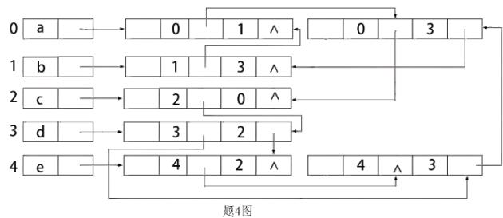
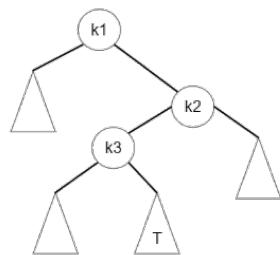
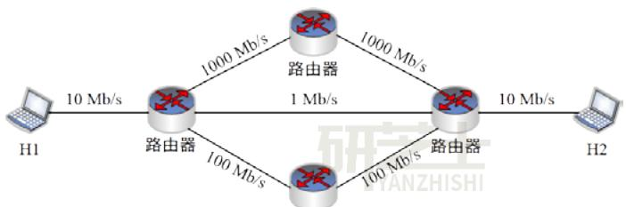
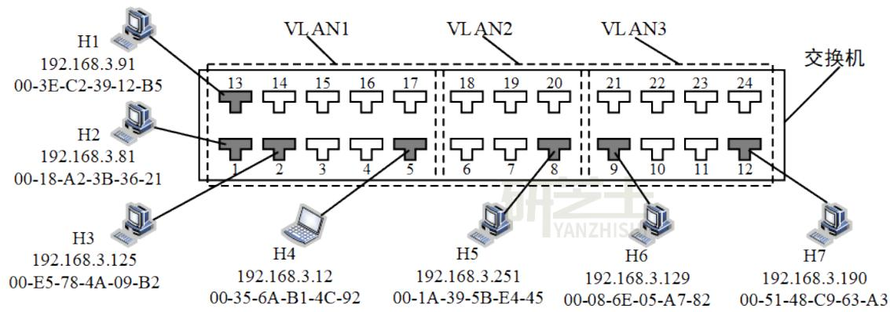
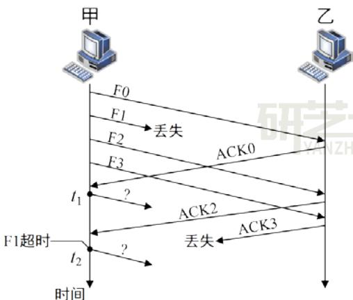
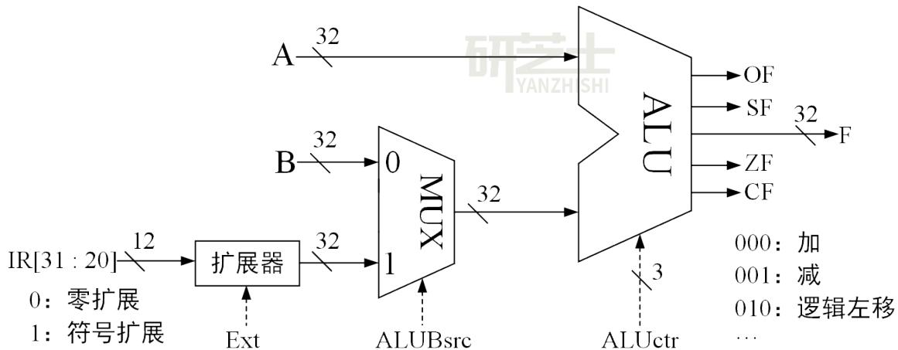
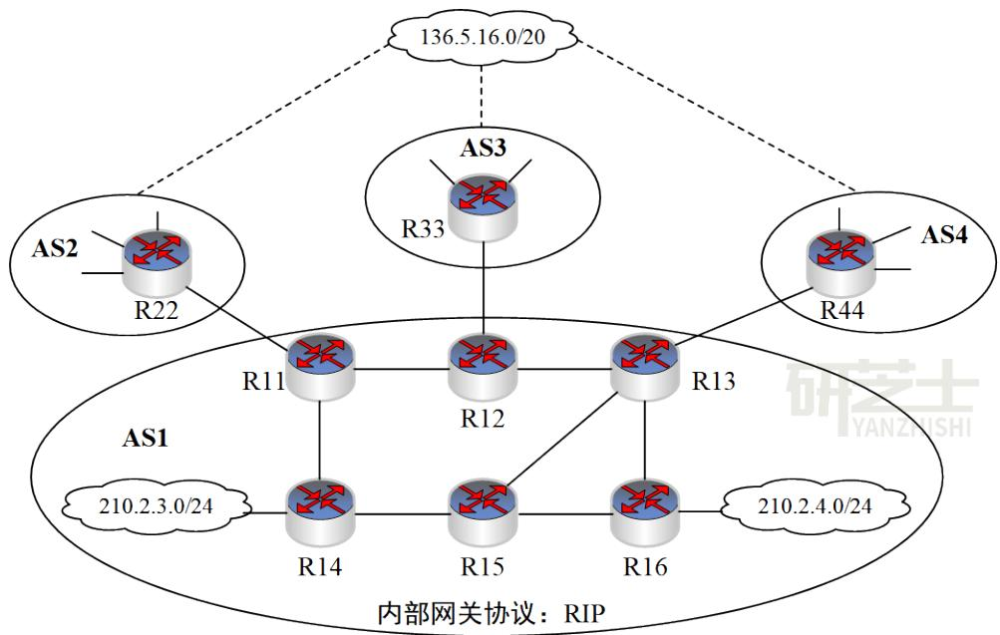

# 2024 考研 408 真题

# 一、单项选择题： $\mathbf { 1 } { \sim } \mathbf { 4 0 }$ 小题，每小题 2 分，共 80 分。下列每题给出的四个选项中，只有一个选项是符合题目要求的。

1.已知带头结点的非空单链表 L 的头指针为 h，结点结构为 data ，其中 next 是指向直next接后继结点的指针。现有指针 p 和 q， 若 p 指向 L 中非首且非尾的任意一个结点，则执行语句序列“q=p->next； p->next=q->next；q->next= h->next;；h->next=q；”的结果是（ ）。

A. 在p所指结点后插入q所指结点  
B. 在q所指结点后插入p所指结点  
C. 将p所指结点移动到L的头结点之后   
D. 将 q 所指结点移动到 L 的头结点之后

2.与表达式 $\mathbf { x } + \mathbf { y } ^ { * } ( \mathbf { z } - \mathbf { u } ) \mathbf { \Omega } / \mathbf { \Omega } \mathbf { v }$ 等价的后缀表达式是（ ）。

A. xyzu- $^ { * } \mathrm { v / + }$

B. xyzu-v/*+

C. +x / * y-zuv

D. +x* y /-zuv

3.若 $\mathrm { ~ { ~ \bf ~ p ~ } ~ } \cdot \mathrm { ~ { ~ \bf ~ q ~ } ~ }$ 和 $\mathbf { V }$ 均为二叉树 T 中的结点，v 有两个孩子结点，T 的中序遍历序列形如：“...，p，v，q，...”，则下列叙述中，正确的是（ ）。

A. p 没有右孩子，q没左孩子  
B. p没有右孩子，q有左孩子  
C. p有右孩子，q没有左孩子  
D. p 有右孩子， $\mathbf { q }$ 有左孩子

4.若无向图 $\mathbf { G } = ( \mathsf { V } , \mathsf { E } )$ 的邻接多重表如下图所示，则G中顶点b与d的度分别是（ ）。



A. 0，2

B. 2，4

C. 2，5

D. 3，4

5.下列数据结构中, 不适合直接使用折半查找的是（ ）。

I.有序链表 II.无序数组

III.有序静态链表 IV.无序静态链表

A.仅 I 、III B.仅 II、IV

C.仅 II、III、IV D.I、II、III、IV

6.KMP算法使用修正后的next数组进行模式匹配，模式串 ${ \bf S } =$ “aabaab”，当主串中某字符与S中某字符失配时， S将向右滑动的最长距离是（ ）。

A.5

B.4

C.3

D.2

7.一棵二叉搜索树如题7图所示，k1、k2、k3分别是对应结点保存的关键字，子树T的任一结点中保存的关键字 x 满足的是（ ）。

A. $\mathbf { x } { < } \mathbf { k } 1$

B. x > k2

C. k1 < x < k3

D. k3 < x < k2



8.使用快速排序算法对含 $\mathtt { n } ( \mathtt { n } \geqslant 3 )$ 个元素的数组 M 进行排序， 若第一趟排序将 M 中除枢轴外的 $_ { \mathrm { n - 1 } }$ 个元素划分为均不为空的 P和Q两块，则下列叙述中，正确的是（ ）。

A. P 与 Q 块间有序  
B. P 与 Q 均块内有序  
C. P和 Q 的元素个数大致相等  
D. P中和 Q中均不存在相等的元素

9.已知关键字序列 28，22，20，19，8，12，15，5 是大根堆 (最大堆)，对该堆进行两次删除操作后， 得到的新堆是（ ）。

A.20，19，15，12，8，5  
B.20，19，15，5，8，12  
C.20，19，12，15，8，5  
D.20，19，8，12，15，5

10.现有由关键字组成的 3个有序序列（3，5）、（7，9）和（6），若按从左至右的次序选择有序序列进行二路归并排序， 则关键字之间的总比较次数是（ ）。

A.3

B.4

C.5

D.6

在外排序中，利用败者树对初始为升序的归并段进行多路归并， 败者树中记录“冠军”的结点保存的是（ ）。

A.最大关键字

B.最小关键字

C.最大关键字所在的归并段号

D.最小关键字所在的归并段号

12. C语言代码如下。

int i=32777；

short si=i；

int j=si；

执行上述代码段后，j 的值是（ ）。

A. -32 777

B. -32 759

C. 32 759

D. 32 777

13.通常情况下，将汇编语言程序中实现特定功能的指令序列定义成一条伪指令(pseudoinstruction)。下列选项中，CPU 能理解并直接执行的是（ ）。

I.伪指令

II.微指令

III.机器指令

IV.汇编指令

A.仅 I、 IV

B.仅 II、III

C.仅 III、IV

D.仅 I、III、IV

14.某科学实验中，需要使用大量的整型参数，为了保证表数精度的基础上提高运算速度， 需要选择合理的数据表示方法。若整型参数 α 、β的取值范围分别为- $2 ^ { 2 0 } { \sim } 2 ^ { 2 0 }$ 、- $2 ^ { 4 0 } { \sim } 2 ^ { 4 0 }$ ，则下列选项中，α 、β最适宜采用的数据表示方法分别是（ ）。

A. 32 位整数、32 位整数  
B.单精度浮点数、单精度浮点数  
C. 32 位整数、双精度浮点数  
D.单精度浮点数、双精度浮点数

15.下列关于整数乘法运算的叙述中，错误的是（ ）。

A.用阵列乘法器实现乘运算可以在一个时钟周期内完成  
B.用ALU 和移位器实现的乘运算无法在一个时钟周期内完成  
C.变量与常数的乘运算可以编译优化为若干条移位及加/减运算指令  
D.两个变量的乘运算无法编译转换为移位及加法等指令的循环实现

16.对于页式虚拟存储管理系统，下列关于存储器层次结构的叙述中, 错误的是（ ）。

A. Cache-主存层次的交换单位为主存块，主存-外存层次的交换单位为页  
B. Cache-主存层次替换算法由硬件实现，主存-外存层次替换算法由软件实现

C. Cache-主存层次可采用回写法写策略，主存-外存层次通常采用回写法写策略  
D. Cache-主存层次可采用直接映射方式，主存-外存层次通常采用直接映射方式

17.某计算机按字节编址，采用页式虚拟存储管理方式，虚拟地址为32位，主存地址为30位，页大小为 1KB。若 TLB 共有 32 个表项，采用 4 路组相联映射方式，则 TLB 表项中标记字段的位数至少是（ ）。

A.17

B.18

C.19

D.20

18.下列事件中，不是在 MMU 地址转换过程中检测的是（ ）。

A.访问越权

B. Cache 缺失

C.页面缺失

D. TLB 缺失

19.对于采用“取指、译码/取数、执行、访存、写回” 5 段流水线的 RISC 数据通路， 下列关于指令流水线数据冒险处理的叙述中，错误的是（ ）。

A.相邻两条指令中的操作数相关可能引起数据冒险  
B.在数据相关的指令间插入 “气泡”能避免数据冒险  
C.所有数据冒险都可以通过加入转发（旁路）电路解决  
D.所有数据冒险都能通过调整指令顺序和插入 nop 指令解决

20.某存储器总线的时钟频率为 420MHz，总线宽度为 64 位，每个时钟周期传送 2 次数据；其总线事务支持突发传送方式, 最多传送8次数据，第1个时钟周期传送地址和读/写命令，从第4个至第7个时钟周期连续传送8次数据。该总线的总线带宽（最大数据传输率)为（ ）。

A 3.84 GB/s

B. 6.72 GB/s

C. 30.72 GB/s

D. 53.76 GB/s

21.下列关于中断 I/O 方式的叙述中，错误的是（ ）。

A.中断屏蔽字用于确定中断响应的优先级  
B.保存断点和程序状态字在中断响应阶段完成  
C.保存通用寄存器和设置新中断屏蔽字由软件实现  
D.单重中断方式下中断处理时CPU处于关中断状态

22.DMA 控制 I/O 方式下，设备的输入/输出由 DMA 控制器控制完成，此时，DMA 控制器控制的数据传输通路位于（ ）。

A. CPU 和主存之间  
B. CPU 和 DMA 控制器之间  
C.设备接口和主存之间  
D.设备接口和DMA控制器之间

23.下列关于中断、异常和系统调用的叙述中，错误的是（ ）。

A.中断或异常发生时，CPU 处于内核态  
B.每个系统调用都有对应的内核服务例程  
C.中断处理程序开始执行时，CPU处于内核态  
D.系统添加新类型设备时，需注册相应的中断服务例程

24.下列选项中，操作系统在终止进程时不一定执行的是（ ）。

A.终止子进程

B.回收进程占用的设备

C.释放进程控制块

D.回收为进程分配的内存

25.在支持页式存储管理的系统中，进程切换时操作系统需要执行的操作是（ ）。

I. 更新程序计数器的值

II.更新栈基址寄存器的值

Ⅲ.更新页表基地址寄存器的值

A. 仅Ⅲ

B.仅 I、Ⅱ

C. 仅 I、Ⅲ

D. I、Ⅱ、Ⅲ

26.文件系统需占用部分外存空间记录空闲块位置。下列方法中，占用外存空间的大小与当前空闲块数量无关的是（ ）。

A.位图法

B.空闲表法

C.成组链接法

D.空闲链表法

27.下列算法中，每次回收分区时仅合并大小相等的空闲分区的是（ ）。

A.伙伴算法

B.最佳适应算法

C.最坏适应算法

D.首次适应算法

28.若进程P中的线程 T先打开文件，得到文件描述符 fd，再创建两个线程 Ta 和 Tb，则下列资源中，Ta 与Tb可共享的是（ ）。

I.进程 P的地址空间

Ⅱ.线程T的栈

Ⅲ.文件描述符fd

A. 仅 I

B.仅 I、Ⅲ

C. 仅Ⅱ、Ⅲ

D. I、Ⅱ、Ⅲ

29.下列系统调用的实现中，包含文件按名查找功能的是（ ）。

A. open( )

B. read( )

C. write( )

D. close( )

30.假设某系统使用时间片轮转调度算法进行CPU调度，时间片大小为 5ms，系统共有10个进程，初始时均处于就绪队列，执行结束前仅处于执行态或就绪态。若队尾的进程 P 所需 CPU

时间最短，时间为 $2 5 \mathrm { m s }$ ，在不考虑系统开销的情况下，则进程 P的周转时间为（ ）。

A. 200ms

B. 205ms

C. 250ms

D. 295ms

31.键盘中断服务例程执行结束时，所输入数据的存放位置是（ ）。

A.用户缓冲区  
B.CPU中的通用寄存器  
C.内核缓冲区  
D.键盘控制器的数据寄存器

32.某磁盘的磁道数为400(磁道号为0~399)，采用循环扫描算法（CSCAN）进行磁盘调度，完成对200号磁道的请求后，磁头向磁道号减小的方向移动。若还有7个磁盘请求，对应的磁道号分别为300，120，110，0，160，210，399，则完成上述磁盘访问请求后磁头移动的距离是（ ）。

A.599

B.619

C. 788

D. 799

33.若某分组交换网络及每段链路的带宽如下图所示，则H1到H2的最大吞吐量约为（ ）。

  
路由器  
题33图

A. 1 Mb/s

B. 10 Mb/s

C. 100 Mb/s

D. 1000 Mb/s

34.在下列二进制数字调制方法中，需要 2 个不同频率载波的是（ ）。

A. ASK

B. PSK

C. FSK

D. DPSK

35.如题35图所示的支持VLAN 划分的交换机，已按端口划分了3个VLAN，部分端口连接主机的IP地址和MAC 地址如图中所示，ARP 表结构为<IP地址，MAC地址，TTL>。下列选项中，不会出现在 H4的ARP表中的是（ ）。

A. 192.168.3.81，00-18-A2-3B-36-21， 14: 32:00  
B. 192.168.3.91，00-3E-C2-39-12-B5， 14: 37:00  
C. 192.168.3.125，00-E5-78-4A-09-B2，14:45:00  
D. 192.168.3.129，00-08-6E-05-A7-82，14:52:00

  
题35图

36.在采用 CSMA/CA 的 802.11 无线局域网中， $\mathrm { D I F S } { = } 1 2 8 \mu \mathrm { s }$ ，SIFS=28μs，RTS、CTS 和 ACK帧的传输时延分别是 $3 \mu \mathrm { s }$ 、2μs 和 $2 \mu \mathrm { s }$ ，忽略信号传播时延。若主机 A 欲向 AP 发送一个总长度为1998 B 的数据帧，无线链路带宽为54Mb/s，则隐藏站B收到 AP发送的 CTS帧时，设置的网络分配向量NAV的值是（ ）。

A. 326μs

B. 354μs

C. 385μs

D. 513μs

37.主机甲通过选择重传(SR)滑动窗口协议向主机乙发送帧的部分过程如题 37 图所示，Fx 为数据帧，ACKx 为确认帧，x 是位数为 3 比特的序号。乙只对正确接收的数据帧进行独立确认，发送窗口与接收窗口大小相同且均为最大值。甲在t1时刻和t2时刻发送的数据帧分别是（ ）。

  
题37图

A. F1，F3

B. F1，F4

C. F3，F1

D. F4，F1

38. 假设主机 H 通过 TCP 向服务器发送长度为 3000B 的报文，往返时间 $\mathrm { R T T } { = } 1 0 \mathrm { m s }$ ，最长报文段寿命 $\mathbf { M S L } { = } 3 0 \mathbf { s }$ ，最大报文段长度 $\mathbf { M S S { = } 1 0 0 0 } \mathbf { B }$ ，忽略TCP 段的传输时延，报文传输结束后 H 首先请求断开连接，则从 H 请求建立 TCP 连接时刻起，到 H 进入 CLOSED 状态为止，所需的时间至少是（ ）。

A. 30.03 s

B. 30.04 s

C. 60.03 s

D. 60.04 s

39. 若UDP协议在计算校验和过程中，计算得到中间结果为 1011 1001 1011 0110时，还需要

加上最后一个 16 位数 0110 0101 1100 0101，则最终计算得到的校验和是（ ）。

A. 0001 1111 0111 1011   
B. 0001 1111 0111 1100   
C. 1110 0000 1000 0011   
D. 1110 0000 1000 0100

40. 若浏览器不支持并行 TCP 连接，使用非持久的 HTTP/1.0 协议请求浏览 1 个 Web 页，该页中引用同一网站上 7 个小图像文件，则从浏览器为传输 Web 页请求建立 TCP 连接开始，到接收完所有内容为止，所需要的往返时间RTT数至少是（ ）。

A. 4

B. 9

C. 14

D. 16

# 二、综合应用题： ${ 4 1 \sim 4 7 }$ 小题，共 70 分。

41.（13分）2023年10月26日，神州十七号载人飞船发射取得圆满成功，再次彰显了中国航天事业的辉煌成就。载人航天工程是包含众多子工程的复杂系统工程，为了保证工程的有序开展，需要明确各子工程的前导子工程，以协调各子工程的实施。该问题可以简化、抽象为有向图的拓扑序列问题。已知有向图G采用邻接矩阵存储，类型定义如下。

```c
typedef struct //图的类型定义  
{int numVertices, numEdges; //图的顶点数和有向边数char VerticesList[MAXV]; //顶点表，MAXV为已定义常量int Edge[MAXV][MAXV]; //邻接矩阵}MGraph; 
```

请设计算法: int uniquely(MGraph G)，判定 G 是否存在唯一的拓扑序列，若是，则返回 1，否则返回0。要求如下。

（1）给出算法的基本设计思想。（4分）  
（2）根据设计思想，采用C或 $\mathrm { C } { + + }$ 语言描述算法，关键之处给出注释。（9分）

42.（10 分）将关键字序列 20，3，11，18，9，14，7 依次存储到初始为空、长度为 11 的散列表 HT 中，散列函数 H（key）=（key $\times 3$ ） $\% 1 1$ 。 $_ \mathrm { H }$ （key）计算出的初始散列地址为 $H _ { 0 }$ ，发生冲突时探查地址序列是 $H _ { 1 }$ ， $H _ { 2 }$ ， $H _ { 3 }$ ，…，其中， $H _ { \mathrm { ~ k ~ } } = ( \mathbf { \nabla } H _ { 0 } + \mathbf { k } ^ { 2 } ) \mathbf { \nabla } \% 1 1$ ， ${ \sf k } { = } 1$ ，2，3，…。请回答下列问题。

（1）画出所构造的 HT，并计算 HT 的装填因子。（6 分）  
（2）给出在 HT 中查找关键字 14 的关键字比较序列。（2分）  
（3）在 HT中查找关键字 8，确认查找失败时的散列地址是多少？（2分）

43.（13 分）假定计算机 M 字长为 32 位，按字节编址，采用 32 位定长指令字，指令 add、slli和 1w 的格式、编码和功能说明如图 43（a）图所示。

<table><tr><td>指令</td><td colspan="7">31 25 24 20 19 15 14 12 11 7 6 0</td><td>指令功能说明</td></tr><tr><td>add</td><td>0000000</td><td>rs2</td><td>rs1</td><td>000</td><td>rd</td><td colspan="2">0110011</td><td>R[rd]←R[rs1]+R[rs2]</td></tr><tr><td>slli</td><td>0000000</td><td>shamt</td><td>rs1</td><td>010</td><td>rd</td><td colspan="2">0010011</td><td>R[rd]←R[rs1]&lt;&lt;shamt</td></tr><tr><td>lw</td><td colspan="2">imm</td><td>rs1</td><td>010</td><td>rd</td><td colspan="2">0000011</td><td>R[rd]←M[R[rs1]+imm]</td></tr></table>

题43图（a）

其中，R[x]表示通用寄存器x的内容，M[x]表示地址为x的存储单元内容，shamt 为移位位数，imm 为补码表示的偏移量。题 43图(b)给出了计算机 M 的部分数据通路及其控制信号(用带箭头虚线表示)，其中，A 和 B 分别表示从通用寄存器 rsl 和 rs2 中读出的内容;IR[31:20]表示指令寄存器中的高 12 位;控制信号 Ext 为 0、1 时扩展器分别实现零扩展、符号扩展，ALUctr 为000、001、010 时 ALU 分别实现加、减、逻辑左移运算。

  
题43图（b)

请回答下列问题。

（1）计算机M 最多有多少个通用寄存器？为什么 shamt 字段占5 位？（2分）  
（2）执行 add 指令时，控制信号 ALUBsrc 的取值应是什么? 若rs1和 rs2 寄存器内容分别是 8765 4321H 和 9876 5432H，则 add 指令执行后，ALU 输出端 F、OF 和 CF 的结果分别是什么？若该 add 指令处理的是无符号整数，则应根据哪个标志判断是否溢出？（5分）  
（3）执行 slli 指令时，控制信号 Ext 的取值可以是0也可以是 1，为什么？（2分）  
（4）执行 1w 指令时，控制信号 Ext、ALUctr 的取值分别是什么？（2 分）

（5）若一条指令的机器码是 A040 A103H，则该指令一定是 1w 指令，为什么？若执行该指令时，R[01H]=FFFF A2D0H，则所读取数据的存储地址是什么？（2 分）

44.（10 分）对于题 43 中的计算机 M，C 语言程序 P 包含的语句“sum+ = a[i];”

在 M 中对应的指令序列 S 如下。

```txt
slli r4, r2, 2 //R[r4]←R[r2]<<2  
add r4, r3, r4 //R[r4]←R[r3]+R[r4]  
1w r5, 0(r4) //R[r5]←M[R[r4]+0]  
add r1, r1, r5 //R[r1]←R[r1]+R[r5] 
```

已知变量 i、sum 和数组 a 都为 int 型，通用寄存器 r1~r5 的编号为 01H~05H。

请回答下列问题。

（1）根据指令序列S中每条指令的功能，写出存放数组a 的首地址、变量i和sum 的通用寄存器编号。（3分）  
（2）已知 M 为小端方式计算机，采用页式存储管理方式，页大小为4KB。若执行到指令序列S 中第 1 条指令时， $\mathrm { i } { = } 5$ 且 r1 和 r3 的内容分别为 0000 1332H 和 0013 DFF0H，从地址 0013DFF0H 开始的存储单元内容如题 44 图所示，则执行“sum+ =a[i];”语句后，a[i]的地址、a[i]和sum 的机器数分别是什么（用十六进制表示）？a[i]所在页的页号是多少？此次执行中，数组a 至少存放在子页中？（5分）

```txt
地址 0 1 2 3 4 5 6 7  
0013 DFF0 FF FF FF 7C 70 FE FF FF  
0013 DFF8 00 00 00 OC 3C 02 01 FF  
0013 E000 F0 F1 00 00 DC EC FF FF  
0013 E008 FF FF 01 02 00 00 01 02
```

# 题 44 图

（3）指令“slli r4，r2，2”的机器码是什么（用十六进制表示）？若数组a 改为 short 类型，则指令序列S中 slli 指令的汇编形式应是什么？（2分）

45.（7 分）某计算机按字节编址，采用页式虚拟存储管理方式，虚拟地址和物理地址的长度均为 32位，页表项的大小为4字节。页大小为4 MB，虚拟地址结构如下。

# 页号（10 位） 页内偏移量（22位）

进程P的页表起始虚拟地址为 B8C0 0000H，被装载到从物理地址 6540 0000H开始的连续主存空间中。

请回答下列问题，要求答案用十六进制表示。

（1）若 CPU 在执行进程 P 的过程中，访问虚拟地址 1234 5678H 时发生了缺页异常，经过缺页异常处理和 MMU 地址转换后得到的物理地址是 BAB4 5678H，在此次缺页异常处理过程中，需要为所缺页分配页框并更新相应的页表项，则该页表项的虚拟地址和物理地址分别是什么？该页表项中的页框号更新后的值是什么？（3分）  
（2）进程 P 的页表所在页的页号是什么？该页对应的页表项的虚拟地址是什么？该页表项中的页框号是什么？（4分）

46.（8 分）计算机系统中的进程之间往往需要相互协作以完成一个任务。在某网络系统中，缓冲区 B 用于存放一个数据分组，对 B 的操作有 C1、C2 和 C3。C1 将一个数据分组写入 B中，C2从 B中读出一个数据分组，C3对B中的数据分组进行修改。要求 B为空时才能执行C1，B非空时才能执行 C2和C3。

请回答下列问题。

（1）假设进程 P1 和 P2 均需要执行 C1，实现 C1 的代码是否为临界区？为什么？（2 分）  
（2）假设B初始为空，进程 P1 执行 C1 一次，进程 P2 执行 C2一次。请定义尽可能少的信号量，并用 wait（）、signal（）操作描述进程 P1 和 P2 之间的同步或互斥关系，说明所用信号量的作用及其初值。（3分）  
（3）假设 B初始不为空，进程 P1和 P2 各执行 C3 一次。请定义尽可能少的信号量，并用wait（）、signal（）操作描述进程P1 和 P2 之间的同步或互斥关系，说明所用信号量的作用及其初值。（3 分）

47.（9 分）网络空间是继陆海空天之后的“第五疆域”，网络技术是网络疆域建设与治理的基础。路由算法与协议是网络核心技术之一，对其准确认知、合理选择与应用，对于网络建设十分重要。假设现有互联网中的 4 个自治系统互连拓扑示意图如题 47 图所示。其中，AS1 运行内部网关协议RIP；AS3 规模较小，自治系统内任意两个主机间通信，经过路由器数量不超过15个；AS4规模较大，自治系统内任意两个主机间通信，经过路由器数量可能超过20个。

  
题47图

请回答下列问题。

（1）若仅有 RIP 和 OSPF 内部网关协议供选择，则 AS4 应该选择哪个协议？（1 分）  
（2）若AS3中的某主机向本自治系统内另一主机发送1个IP分组，为确保该 IP分组能够被正常接收，则该 IP 分组的初始TTL值应该至少设置为多少？（1分）  
（3）假设 AS1 中的路由器同一时刻启动，启动后立即构建并交换初始距离向量，之后每隔30s 交换一次最新的距离向量，则从交换初始距离向量时刻算起，R11~R16路由器均获得到达网络 210.2.3.0/24 的正确路由，至少需要多长时间？均获得到达网络 210.2.4.0/24 的正确路由，至少需要多长时间？（2分）  
（4）R44 向 R13 通告到达网络 136.5.16.0/20 路由时，由 BGP 协议哪类会话完成？通过哪个 BGP 报文通告？R13 通过 BGP 协议的哪类会话将该网络可达性信息通告给 R14 和 R15？

（3 分）

（5）若 R14 和 R15 均收到分别由 R11、R12、R13 通告的到达网络 136.5.16.0/20 的可达性信息如下。

目的网络:136.5.16.0/20，AS 路径:AS2 AS8 AS19，

下一跳:R11

目的网络:136.5.16.0/20，AS 路径:AS3 AS7 AS11 AS19,

下一跳:R12

目的网络:136.5.16.0/20，AS 路径:AS4 AS10 AS19，

下一跳:R13

则在无策略约束情况下，R14 和 R15 更新路由表后，各自路由表中到达网络 136.5.16.0/20 路由的下一跳分别是什么（用路由器名称表示）？（2分）

# 2024 年全国硕士研究生入学统一考试

# 计算机科学与技术学科联考

# 计算机学科专业基础综合试题（答案速查）

# 一、单项选择题

1． D 2． A 3． A 4． B 5． D 6． A 7． D 8． A   
9． B 10． C 11． D 12． B 13． B 14． C 15． D 16． D   
17． C 18． B 19． C 20． B 21． A 22． C 23． A 24． A   
25． D 26． A 27． A 28． B 29． A 30． C 31． C 32． C   
33． B 34． C 35． D 36． B 37． D 38． D 39． C 40． D

# 二、综合应用题

41-47题答案和解析见答案册。