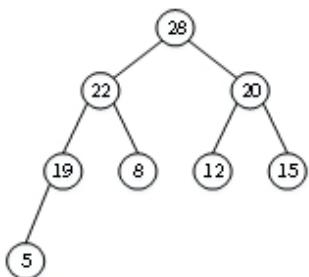
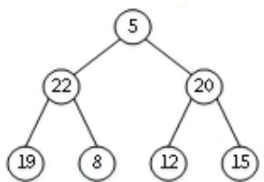
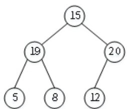
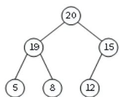
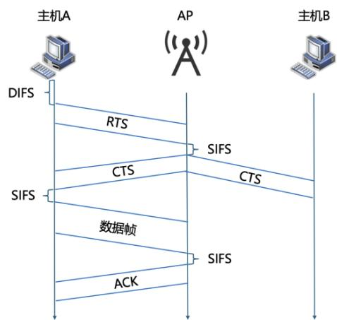

# 2024 考研 408 真题答案解析

# 一、单项选择题

1． D 2． A 3． A 4． B 5． D 6． A 7． D 8． A   
9． B 10． C 11． D 12． B 13． B 14． C 15． D 16． D   
17． C 18． B 19． C 20． B 21． A 22． C 23． A 24． A   
25． D 26． A 27． A 28． B 29． A 30． C 31． C 32． C   
33． B 34． C 35． D 36． B 37． D 38． D 39． C 40． D

1.【参考答案】D

【解析】本题考查链表的基本操作。

语句 q=p->next：指针 q 指向 p 的下一个结点；

语句p->next=q->next：p的next 域指向q的下一个结点，即将q所指结点从链表中取出；

语句 q->next=L->next：q 的 next 域指向第一个结点（头结点的后一个结点）；

语句 L->next=q：头指针指向 q 所指结点。

因此，这段代码的功能是将 q 结点移动到表头。故本题选 D。

2.【参考答案】A

【解析】本题考查栈的应用中表达式的转换。

可以采用增减括号的方法解答。

（1）根据运算的先后顺序为中缀表达式全部加上括号变为 $( \mathrm { x } + ( ( \mathrm { y } ^ { \ast } ( \mathrm { z } \mathrm { - u } ) ) / \mathrm { v } ) )$ ；  
（2）把运算符移到对应的括号外面，变为： $( \mathrm { x } ( ( \mathrm { y } ( \mathrm { z u } ) \mathrm { - } ) ^ { \ast } \mathrm { v } ) / ) \mathrm { + } \mathrm { ; }$ ；  
（3）将括号全部去除后即为后缀表达式：xyzu- $^ { * } \mathrm { v / + }$ 。故本题选 A。

3.【参考答案】A

【解析】本题考查二叉树的遍历。

中序遍历的顺序为左子树、根结点、右子树。本题中v有两个孩子结点，且中序遍历中有片段p,v,q，则 p、q 分别是 v 左、右子树中的结点。在 v 的左子树中，p 是左子树的中序遍历序列最后一个结点，则p是最右边的结点，故p 没有右孩子；在v的右子树中，q是右子树的中序遍历序列第一个结点，则q是最左边的结点，故q没有左孩子。故本题选A。

4.【参考答案】B

【解析】 本题考查无向图邻接多重表的存储方式。

本题有两种做法，一种是根据邻接多重表还原图，另一种是直接数出abcd对应的1234出现的次数，由下图可知，b对应的1出现了2次，度为 2，d对应的3出现了4次。度为4。故本题选 B。

# 5.【参考答案】D

【解析】本题考查折半查找的基本性质。

折半查找，也称二分查找，在某些情况下相比于顺序查找，使用折半查找算法的效率更高。但是该算法的使用的前提是静态查找表中的数据必须是有序的。也就是说，在使用折半查找算法查找数据之前，应该首先把该表的数据按照所查的关键字进行排序。链表不支持随机查找，故I 不适用，无序数组不适用折半查找，故 II 不适用。静态链表是用数组来实现链式存储结构，目的是方便在不设指针类型的高级程序设计语言中使用链式结构。故 III、IV 不适用。故本题选 D。

# 6.【参考答案】A

【解析】本题考查KMP算法中nextval 的应用。

传统 KMP 算法使用 next 数组，会存在 j=next[j]的情况，因此采用 next_val 来优化，处理结果如下：

<table><tr><td>下标</td><td>1</td><td>2</td><td>3</td><td>4</td><td>5</td><td>6</td></tr><tr><td>字符</td><td>a</td><td>a</td><td>b</td><td>a</td><td>a</td><td>b</td></tr><tr><td>next</td><td>0</td><td>1</td><td>2</td><td>1</td><td>2</td><td>3</td></tr><tr><td>nextval</td><td>0</td><td>0</td><td>2</td><td>0</td><td>0</td><td>2</td></tr></table>

当主串中某个字符与S中某字符失配时，有6种情况，分别为下标1-6不匹配。

当下标1不匹配时，需要右移1位

当下标2不匹配时，需要右移2位

当下标3不匹配时，需要右移1位

当下标4不匹配时，需要右移4位

当下标5不匹配时，需要右移5位

当下标6不匹配时，需要右移4位

故本题选A。

# 7.【参考答案】D

【解析】本题考查二叉搜索树的基本性质。二叉搜索树，即二叉排序树。由二叉排序（搜索）树的性质：若它的左子树不空，则左子树上所有结点的值均小于它的根结点的值；若它的右子

树不空，则右子树上所有结点的值均大于它的根结点的值。那么大小顺序应该是： $_ { \mathrm { K 1 < K 3 < T < K 2 } }$ ，T中任意结点均满足该大小顺序。而 X是T 中的一个结点，故本题选D。

8.【参考答案】A

【解析】本题考查快速排序的基本性质。

快速排序的基本思想是，通过一趟排序将待排记录分割成独立的两部分，其中一部分记录的关键字均比另一部分记录的关键字小，之后，可分别对这两部分记录继续进行排序，以达到整个序列有序。故第一趟排序将 M 划分为均不空的 P 和 Q 两块，P 与 Q 之间应是块间有序，但 P与Q内的顺序无法确定。故本题选A。

9.【参考答案】B

【解析】本题考查堆排序的过程。

堆的删除操作是把根结点和最后一个结点直接交换，删掉（在最后一个结点处的）根结点，再从根结点向下调整。向下调整：在该结点的左右子树中，找一个最大的，与该结点交换，重复此过程直到叶子节点。因此删除结点的结构如下图所示。

原大根堆：

原大根堆：



删除结点28：



调整：


删除结点22：



调整：



进行两次删除操作后，得到的新堆是20，19，15，5，8，12；故本题选B。

# 10.【参考答案】C

【解析】本题考查二路归并排序的过程。

二路归并排序的思想是假设初始序列含有n个记录，则可看成是n个有序的子序列，每个子序列的长度为 1，然后两两归并，得到个长度为 2 或 1 的有序子序列；再两两归并，......，如此重复，直至得到一个长度为n的有序序列为止。

将（3,5）与（7,9）进行合并：

3 和 7 进行比较，3 存入序列得（3）；（1 次比较）

5和7进行比较，5存入序列得（3,5）；（1次比较）

子序列（3,5）处理完毕，将剩下的依次存入得（3,5,7,9）。

将（3,5,7,9）与（6）进行合并：

3和6进行比较，3存入序列得（3）；（1次比较）

5 和 6 进行比较，5 存入序列得（3,5）；（1 次比较）

7和6进行比较，6存入序列得（3,5,6）；（1次比较）

子序列（6）处理完毕，将剩下的依次存入得（3,5,6,7,9）。

综上，总比较次数为 5，故本题选 C。

# 11.【参考答案】D

【解析】本题考查败者树的基本定义。

败者树是胜者树的一种变体。在胜者树中，中间结点记录的是胜者的标号，而在败者树中，中间结点记录的是败者的标号。败者树与胜者树很类似，通过比赛使胜者晋级，直到决出冠军。但是败者树的非叶子节点记录的是败者（最小关键字）的归并段号，且需要增加一个节点记录比赛的胜者。故本题选D。

# 12.【参考答案】B

【解析】在这道题目中，涉及到了 int 和 short 类型的转换。首先，让我们明确 int 和 short 类型的大小：int 通常是 32 位（4 字节），short 通常是 16 位（2 字节），需要注意的是，int 和short 类型都默认是有符号数，即最高位表示符号位。类型转换的规则是：当长整数转短整数时，遵循高位截断，低位保留，会改变符号位；当短整数转长整数时，遵循符号扩展，高位按照补码规则补。32777转换为16进制数，并用int 类型表示的结果是0000 8009H，转换为short型只保留低位 16 位，高位截掉，结果为 8009H。Short 转换成 int 需要符号扩展，8009H 在 short类型中为负数，转成十进制是（-32759），短整数转长整数不损失精度，结果仍为（-32759）。

# 13.【参考答案】B

【解析】伪指令不是真正的指令，并没有与之对应的的机器码，不会被执行，伪指令所起的作用主要是对汇编过程进行控制。汇编指令是汇编语言中的指令，它们使用助记符来表示机器指令的功能。汇编指令本身并不是 CPU 能直接执行的，它们需要被汇编器转换成机器指令后才能被CPU 执行。微指令和机器指令都是可以被CPU直接执行的。

14.【参考答案】C

【解析】32 位整数可以表示 α 范围内的每一个数字。对于β，虽然单精度浮点数可以表示的范围是- $- 2 ^ { 1 2 8 }$ 到 $2 ^ { 1 2 8 }$ ，包含了 B 的范围。但是浮点数并不能表示范围内的任意整数。比如 $2 ^ { 4 0 } – 1$ 的二进制表示是11111111 1111（39个1），单精度浮点数不能表示这个数字，因为尾数只有23位。而双精度浮点数的尾数有52位，可以完全表示β范围里的每一个整数。

15.【参考答案】D

【解析】二进制的乘法可以表示成左移和加法，比如“111” 可以分为 $^ { * } 1 0 0 + ^ { * } 1 0 + ^ { * } 1$ 也就是左移 2 位 $^ +$ 左移 1 位 $^ +$ 本身。所以一个乘法可以展开成移位和加法，这样可以通过 ALU 和移位器在多个时钟周期下完成乘法运算。

16.【参考答案】D

【解析】A.为概念性知识

B.cache 缺失是大概率事件，所以要利用速度比较快的方式，硬件速度快。缺页的发生相对较少，所以采用软件实现。  
C. Cache-主存层次可采用回写法写策略，也可采用全写法。主存-外存交换页面的开销比较大，所以采用回写法。  
D. 对于后半句，外存中的页面可以放到主存的任意位置，所以可以看成某种意义上的全相联映射，而不是直接映射。

17.【参考答案】C

【解析】表项用4路组相联，说明有 $3 2 / 4 { = } 8$ 组组号，占3个二进制位。页大小是 $1 \mathrm { K B } { = } 2 ^ { 1 0 }$

B，说明页内偏移占 10个二进制位，所以标记字段位为： $3 2 - 1 0 - 3 = 1 9$ 位。

18.【参考答案】B

【解析】MMU 负责虚拟地址到物理地址的转换，而 cache 缺失属于访问物理内存后的工作，不属于 MMU。  
19.【参考答案】C

【解析】C.假设 R[x]表示通用寄存器 x 的内容，M[x]表示地址为 x 的存储单元内容， I0 : R[r1]← M[R[rs1]+imm]，I1: R[r1]+R[r2]—>R[Rr1]，那么第一条先从内存中取一个数到寄存器 r1 第

二条指令要用到这个r1，那么就算用转发也要使用阻塞等到访存结束才能拿到这个数。

D. 如果插入空指令，那么在数据冒险的时候，流水线会退化成单周期，这样就能消除数据冒险。

20.【参考答案】B

【解析】直接算总线传输结果： 420M*8B*2=6720MB/s=6.72GB/s

如果算一次突发传送总线事务的时间是7个时钟，一次突发传送总线事物传输 $8 ^ { * } 8 \mathrm { { B } } { = } 6 4 \mathrm { { B } }$ ，那么答案是 420M*64B/7=3840MB/s=3.84GB/s<6.72GB/s

21.【参考答案】A

【解析】A.中断响应优先级是由中断控制照本身电路决定的，是有固定的顺序，而中断屏蔽字是软件设置的，用来决定是否响应当前传过来的中断。  
C.在中断处理时，用指令（软件）保存通用寄存器和设置的中断屏蔽字，由硬件保存断点和程序状态字（PSW）。  
D.单级中断必须保证正在处理的中断不能被别的中断插入嵌套执行，因此在中断处理过程中应该始终让 CPU 处于关中断状态。

22.【参考答案】C

【解析】DMA 的作用是实现外设数据和主存数据的直接交换，数据传输过程不需要 CPU 的参与。所以选C。需要注意的是，DMA传输前的预处理和传输后的后处理阶段还是需要CPU參与的，前者通常由设备驱动程序来完成，后者通常由中断处理程序来完成，预处理阶段的数据交换主要发生在 CPU 和 DMA 控制器之间，在数据传输过程中，DMA 控制器代替 CPU 和设备接口及内存进行数据传输，每次传输单位依然为一个字，但是这些数据交换与题干要求无关。

23.【参考答案】A

【解析】中断或异常发生时，CPU 既可能处于内核态，也可能处于用户态。例如，当某个用户程序试图将一个数除以 0 时，CPU 会检测到这一非法操作并触发异常，此时 CPU 仍处于用户态。

24.【参考答案】A

【解析】在操作系统终止父进程时，通常不会强制终止其子进程。此时，子进程会变成“孤儿进程”，并由 init 进程（在 Linux 系统中为 $\mathrm { P I D } { = } 1$ 的进程）接管。操作系统在终止进程时，会回收该进程所占用的所有资源，包括设备和内存，并释放进程控制块。

25.【参考答案】D

【解析】程序计数器（PC）保存着进程下一条即将执行的指令的地址。在进程切换时，需要将当前进程的程序计数器值恢复，以便该进程能够从之前暂停的地方继续执行。栈基址寄存器（SP）保存着进程栈的基地址，栈用于存储函数调用信息、局部变量、返回地址等数据，每个进程都有自己的栈。在进程切换时，需要将当前进程的栈指针恢复，以便该进程可以正确访问自己的栈。页表基地址寄存器（PTBR）保存着进程页表的基地址。在页式存储管理中，页表存储了虚拟地址到物理地址的映射，每个进程都有自己的页表。进程切换时需要将当前进程的页表指针恢复，以便该进程可以访问自己的内存区域。

# 26.【参考答案】A

【解析】位图法使用位图来表示资源的使用状态，每个位表示一个磁盘块的占用情况。其中，0 表示对应的磁盘块是空闲的，尚未被分配；1 表示对应的磁盘块已被分配。因此，位图法占用的外存空间大小仅与外存空间的总大小有关，而与空闲块的数量无关。相对而言，B、C、D选项的思想是只记录空闲块的信息，而不记录已分配块的信息，因此它们占用的外存空间大小与当前空闲块的数量有关。

# 27.【参考答案】A

【解析】伙伴算法的核心思想是将内存划分为大小为2的幂次方的块，最小块的大小是系统定义的最小内存单元。每次分配内存时，如果请求的内存大小不符合当前内存块的大小标准，内存块会继续拆分成两半，直到找到合适大小的块。每当内存回收时，系统会尝试将相邻的“伙伴”块合并，所以仅合并大小相等的空闲分区。而 B、C、D 选项则会合并相邻的空闲分区，而不考虑它们的大小。

# 28.【参考答案】B

【解析】栈是线程私有的内存区域，用于存储线程在执行过程中的局部变量、函数调用的返回地址、函数参数和一些中间结果。每个线程都有自己的栈空间，因此线程 Ta 和 Tb 无法访问线程 T 的栈。进程 P 的地址空间、文件描述符、全局变量和堆空间等资源是进程 P 中所有线程共享的。

# 29.【参考答案】A

【解析】在调用 open() 函数时，操作系统根据传入的文件名在文件系统中查找具体的文件并将其打开，然后返回一个文件描述符，这就是文件按名查找功能。在调用 read()、write() 和close() 函数时，只允许传入文件描述符，而不允许传入文件名。

# 30.【参考答案】C

【解析】在时间片轮转调度算法中，系统将所有就绪进程放入一个队列中，每个进程按顺序轮

流获得 CPU 执行的机会。每个进程在获得 CPU 时，最多可以执行一个固定长度的时间片。如果在时间片结束前进程没有完成，它将被放回队列的末尾，等待下一轮执行。在这个系统中，时间片的大小为 5ms，队尾进程 P 需要 25ms 的 CPU 时间，所以进程 P 需要 5 轮调度才能执行完成。由于系统中共有 10 个进程，一轮调度的时间为 $5 \mathrm { m s } \ \times \ 1 0 = 5 0 \mathrm { m s }$ ，5 轮调度共需要 $5 \times 5 0 \mathrm { m s } = 2 5 0 \mathrm { m s }$ ，此时进程 P 刚好执行完毕。进程的周转时间是指进程完成时间减去进程到达时间。对于进程 P，到达时间为 0ms，完成时间为 $2 5 0 \mathrm { m s }$ ，因此 P 进程的周转时间为 $2 5 0 \mathrm { m s }$ 。

# 31.【参考答案】C

【解析】当 CPU 接收到来自键盘的中断信号后，操作系统会暂停当前正在运行的任务，并跳转到专门的中断服务例程来处理该中断。中断服务例程通过键盘控制器读取按键扫描码，以确定用户按下的是哪个按键，并将其转换为相应的字符，然后存入内核中的键盘缓冲区。之后，操作系统或应用程序可以从内核缓冲区中读取用户输入的数据进行处理。

# 32.【参考答案】C

【解析】在循环扫描算法中，磁头在磁盘上仅向一个方向扫描并服务沿途遇到的所有磁盘请求。当磁头到达磁盘上待访问请求的最低磁道后，它会快速回到磁盘上待访问请求的最高磁道，在此期间不处理任何请求，然后再次开始向同一方向扫描并服务新的请求。本题中，磁盘完成对200 号磁道的请求后，磁头向磁道号减小的方向移动到 0 号磁道，处理了请求 160、120、110和 0，期间移动了 200 个磁道。随后，磁头从 0 号磁道快速移动到 399 号磁道，不处理任何请求，期间移动了 399 个磁道。最后，磁头从 399 号磁道移动到 210 号磁道，处理了请求 399、300 和 210，期间移动了 189 个磁道。整个过程共移动了 $2 0 0 + 3 9 9 + 1 8 9 = 7 8 8$ 个磁道。

# 33.【参考答案】B

【解析】带宽指的是网络或通信链路在单位时间内能够承载或传输的最大数据量，吞吐量指的是实际在某一段时间内成功传输的数据量。如果链路的传输速率限制了数据的发送或接收速度，那么即使其他链路可以更快地传输数据，也无法提升整体的吞吐量。

在本题中，H1 和 H2 之间的数据传输有三种可能的路径：1、经过两条带宽为 1000Mb/s 的路径；2、经过一条带宽为1Mb/s 的路径；3、经过两条100Mb/s 的路径。无论选择哪种路径，数据传输都必须经过带宽为10Mb/s的链路（H1到路由）和10Mb/s的链路（路由到 H2）。在理想环境下（即未提及拥塞或数据包丢失的情况），整体吞吐量由瓶颈链路的带宽决定。因此，这三种不同路径的整体数据吞吐量分别为：10Mb/s、1Mb/s、10Mb/s，因此，最大吞吐量为10Mb/s。

选项 B 是正确答案。

# 34.【参考答案】C

【解析】在这些选项中，FSK (Frequency Shift Keying) 是唯一需要使用两个不同频率载波的调制方法。FSK是一种二进制调制技术，通过改变载波信号的频率来传输信息，其中两种不同的频率分别表示二进制的两个状态（0 和 1）。其他选项中，ASK (Amplitude Shift Keying) 通过改变载波的幅度来表示不同的二进制状态。PSK (Phase Shift Keying) 则通过改变载波的相位来传递信息。DPSK (Differential Phase Shift Keying) 是 PSK 的变体，通过改变载波的相位差来传输信息。选项C是正确答案。

# 35.【参考答案】D

【解析】H4 与其他主机通过支持 VLAN 划分的交换机连接，该交换机按端口划分了不同的VLAN，因此不同VLAN之间的主机无法直接通信。ARP表中仅存储与H4处于同一VLAN内的主机的 IP 地址与 MAC 地址映射关系。因此，H4 只能通过 ARP 获得与其处于同一 VLAN的主机信息，跨VLAN的主机不会出现在H4的ARP 表中。H4位于VLAN1，选项 D中的主机 H6 位于 VLAN3，无法与 H4 直接通信，因此不会出现在 H4 的 ARP 表中。而选项 A、B、C 中的主机 H2、H1 和 H3 都与 H4 同处 VLAN1，可能出现在 H4 的 ARP 表中。选项 D 是正确答案。

# 36.【参考答案】B

【解析】在 CSMA/CA 协议中，当主机 A 打算发送数据时，它会通过发送 RTS 帧来通知接收设备 AP。接收设备在发送 CTS 帧时，会在帧中包含一个 NAV 字段，指示接下来通信的时间长度。收到CTS帧的其他设备（如隐藏站B）读取 NAV值，知道在这段时间内信道会被占用，从而不再尝试占用信道。NAV设置了一个倒计时器，当倒计时结束时，设备才会再次检测信道是否空闲，以决定是否可以发起新的通信。

所以本道题中我们需要计算的 NAV值，也就是主机B收到CTS 帧后，AP 与主机A之间通信的持续时间的值，也就是主机 A 收到 AP 发送 CTS 帧后（由于题目中忽略信号传播时延，故CTS 帧从 AP 到 B 的时间与到 A 的时间相同）开始发送数据，到 AP 接收到数据并发送 ACK帧完成通信的时间，具体过程如下图。



依图可知， ${ \mathrm { N A V } } = { \mathrm { S I F S } } +$ 数据帧传输时延 $+ \thinspace \mathrm { S I F S + A C K }$ 传输时延。由于数据帧长度为1998B，无限链路带宽为 ${ 5 4 } \mathrm { M b } / \mathrm { s }$ ，所以数据帧传输时延为 $2 9 6 \mu \mathrm { s }$ 。将对应数值带入公式，求得 ${ \mathrm { N A V } } { = } 2 8 { \mu } \mathrm { s }$ ${ } + 2 9 6 \mu \mathrm { s } + 2 8 \mu \mathrm { s } + 2 \mu \mathrm { s } = 3 5 4 \mu \mathrm { s }$ 。选项B是正确答案。

# 37.【参考答案】D

【解析】本题使用的是选择重传（SR）滑动窗口协议，且序号的位数为3比特，发送窗口和接收窗口大小相同且均为最大值，故发送窗口与接收窗口的大小均为4。

根据图示，甲首先发送了F0至F3四个连续的数据帧，其中F1在传输过程中丢失。此时，甲的滑动窗口内的数据帧已全部发送。t1 时刻，甲收到乙对 F0 的确认帧，滑动窗口向后移动，发送数据帧 F4；t2 时刻，甲收到乙对 F2 的确认帧，但由于未收到 F1 的确认帧，滑动窗口未继续滑动，此时F1超时，甲重新发送F1。综上，t1 和t2 时刻甲分别发送了F4和F1，选项D是正确答案。

# 38.【参考答案】D

【解析】从H请求建立TCP连接时刻起，到H进入 CLOSED 状态为止，共要经历三个阶段，分别是TCP连接建立阶段，数据传输阶段和TCP连接结束阶段。具体过程如下：

首先，H 向服务器发送第一次握手信息，服务器回复第二次握手信息。由于 TCP 协议采用慢开始的拥塞控制策略，H在发送第三次握手信息时，可以携带1000B的数据，这标志着第一次数据传输的开始，此时拥塞窗口为1，H需要等待服务器的ACK。接下来，H在第二次数据传输时，拥塞窗口为 2，可以一次性发送 2000B 的数据，数据传输阶段在服务器返回 ACK 后结束。随后，H请求断开连接，向服务器发送第一次挥手数据包。由于服务器没有数据需要回传，它会依次发送第二次和第三次挥手数据包。H 在收到第三次挥手数据包后，发送第四次挥手包，同时在等待2倍MSL的时间后，进入CLOSED状态。

总结上述过程，连接建立阶段，耗费1个RTT的时间。数据传输阶段，耗费2个RTT的时间。

连接结束阶段，耗费 1 个 RTT 的时间。所以从 H 请求建立 TCP 连接起到 H 进入 CLOSED 状态为止，所需的时间至少是 $4 ^ { * } \mathrm { R T T } + 2 ^ { * } \mathrm { M S L } = 6 0 . 0 4 \mathrm { s }$ 。选项D是正确答案。

# 39.【参考答案】C

【解析】UDP校验和的计算主要分为三个步骤：字块求和、进位回卷和按位取反。首先，将数据按 16 位字块划分，对这些字块执行二进制加法操作。这里的二进制加法包括进位处理，而不是异或运算。通过这种加法操作，得到结果X。接下来，检查X的位数是否超过16位。如果 X 的位数超出了 16 位，则将高位溢出的部分加回到低位。最后，对结果 X 进行按位取反，得到的值即为校验和。

在题目中，已完成多个字块的求和，现需进行最后一次求和。我们将 1011 1001 1011 0110 和0110 0101 1100 0101 相加，得到 1 0001 1111 0111 1011。由于结果超过了 16 位，需进行进位回卷，将溢出的高位加回到低位，得到 0001 1111 0111 1100。最后，对结果进行按位取反，得到 1110 0000 1000 0011，这就是校验和。选项 C 是正确答案。

# 40.【参考答案】D

【解析】在使用非持久的 HTTP/1.0 协议请求一个 Web 页面时，每个资源（包括主页面和引用的图像）都需要单独的TCP连接。每个TCP连接的建立和数据传输都需要往返时间 RTT。具体来说，每个 TCP 连接的过程包括：建立连接需要 1 个 RTT，发送请求并接收响应也需要 1个RTT。因此，对于一个包含1个主页面和7个图像的网页，总共有 8个请求。每个请求都涉及到建立一个新的TCP连接和进行数据传输，因此总共需要 8个TCP连接 * 2 RTT（每个连接的建立和数据传输），总共为16 RTT。选项D是正确答案。

# 二、简答题

# 41.【解析】

# （1）算法的基本设计思想

建立图 G 各顶点的入度表 degree[ ]。

选择入度为 0 的顶点 v，将 v 的所有邻接点的入度减 1，重复执行这个过程。若每次选中的入度为0的顶点有且仅有一个，且共进行了 G.numVertices 次，则意味着存在唯一的拓扑序列，返回1，否则不存在拓扑序列，或存在多个拓扑序列，返回0。

# （2）用C语言描述的算法

```javascript
int uniquely(MGraph G) //判定有向图是否存在唯一的拓扑序列{
```

int\*degree，i，j,count $= 0$ ,in0 $\equiv$ -1，prev_in0;   
degree=(int\*)malloc(G.numVertices\*sizeof(int));   
for(j=0；j<G.numVertices;j++) //计算各顶点的入度   
{ degree[j]=0; for(i=0;i<G.numVertices; i++) degree[j] $+ = G$ .Edge[i][j]; if(degree[j]==0) { if(in0=-1)in0=j; //入度为0的顶点 else in0=-2; //有多个入度为0的顶点 } } while(inO>=0) { Count++; prev_in0=in0; in0=-1; for(j=0；j<G.numVertices;j++) if(G.Edge[prev_in0][j]>0) { if(--degree[j]==0) //邻接点入度值减1 { if(in0=-1)in0=j; //入度为0的顶点 else ino=-2; //有多个入度为0的顶点 } } }   
free(degree);

if(count $=$ G. numVertices) return 1; else return 0;

# 42.【解析】

（1）HT 如下。

```txt
0 1 2 3 4 5 6 7 8 9 10   
11 14 7 20 9 3 18 
```

装填因子 $\mathrm { ~ a ~ } = 7 / 1 1$ 。

（2）查找关键字 14 的关键字比较序列：3，18，14。  
（3）查找关键字 8，确认查找失败时的散列地址是 7。

# 43.【解析】

（1）最多有 $2 ^ { 5 } { = } 3 2$ 个通用寄存器。M 字长为 32 位，故通用寄存器宽度为 32 位，因此 shamt字段占 $\log _ { 2 } 3 2 = 5$ 位。  
（2）控制信号 ALUBsrc $\scriptstyle  = 0$ 。F=1FDB 9753H； $\mathrm { O F } { = } 1$ ； $\mathrm { C F } { = } 1$ ；根据 CF 判断是否溢出。  
（3）因为 slli 指令的移位位数只使用 IR[31:20]中的低 5 位，与高位 IR[31:25]及扩展出来的位无关，故 Ext 取值可以是 0 也可以是 1。  
（4）Ext=1； ALUctr=000。  
（ 5 ） 因 为 A040 A103H=101000000100 00001 010 00010 0000011B ， 根 据 指 令 格 式 中IR[6:0]=0000011B，IR[14:12]=010B，可以判定该指令是 1w 指令。1w 指令所读取数据的存储地址为 FFFF 9CD4H。

# 44.【解析】

（1）a 的首地址存放在 r3；i 存放在 r2；sum 存放在 r1。  
（2）a[i]的地址为 0013 E004H； a[i]的机器数为 FFFF ECDCH；sum 的机器数为 0000 000EH； a[i]所在页的页号是 0013EH；数组 a 至少存放在 2 页中。

（3）指令机器码为 0021 2213H。汇编形式是 slli r4，r2，1。

# 45.【解析】

（1）页表项的虚拟地址为： $\mathrm { B 8 C 0 ~ 0 0 0 0 \mathrm { H } + 4 8 \mathrm { H } < < 2 = B 8 C 0 ~ 0 1 2 0 \mathrm { H } } \mathrm { } _ { \circ }$ 。

页表项的物理地址为： $6 5 4 0 ~ 0 0 0 0 \mathrm { H } \mathrm { + } 4 8 \mathrm { H } < < 2 = 6 5 4 0 ~ 0 1 2 0 \mathrm { H }$

相应页表项中的页框号为：BAB4 5678H >> 22 = 2EAH。

（2）进程 P 的页表所在页的页号为： $\mathrm { B 8 C 0 } 0 0 0 0 0 \mathrm { H } > > 2 2 = 2 \mathrm { E } 3 \mathrm { H }$ 。

页表项的虚拟地址为： $\mathrm { B 8 C 0 ~ 0 0 0 0 H + 2 E 3 H } < < 2 = \mathrm { B 8 C 0 } ~ 0 \mathrm { B 8 C H } _ { \circ }$

页表项中的页框号为： $6 5 4 0 \ 0 0 0 0 \mathrm { H } > > 2 2 = 1 9 5 \mathrm { H }$

# 46.【解析】

（1）实现C1 的代码是临界区。因为代码 C1执行对B的写操作，且 P1和 P2 需要互斥执行C1。  
（2）进程 P1和 P2的同步伪代码如下。

Semaphore ${ \bf S } { = } 0$ ; //实现进程 P1 与 P2 的同步

P1

P2

C1;

wait(S);

signal(S);

C2;

（3）进程 P1和 P2的互斥伪代码如下。

Semaphore mutex $\mathrm { \Phi } = 1$ ; //实现 P1 与 P2 互斥执行 C3

P1

wait(mutex);

wait(mutex);

C3;

C3;

signal(mutex);

signal(mutex);

# 47.【解析】

（1）AS4 应该选择 OSPF 协议。  
（2）初始 TTL值应该至少设置为 16。  
（3）R11~R16路由器均获得到达网络210.2.3.0/24的正确路由，至少需要 30s； 均获得到达网络 210.2.4.0/24 的正确路由，至少需要 $6 0 \mathrm { s }$ 。  
（4）由 BGP 协议外部会话（eBGP）完成；通过 UPDATE 报文通告；R13 通过 BGP 协议内部会话（iBGP）通告 R14 和 R15。

（5）R14 路由表中到达网络 136.5.16.0/20 路由的下一跳是 R11；R15 路由表中到达网络 136.5.16.0/20 路由的下一跳是 R13。