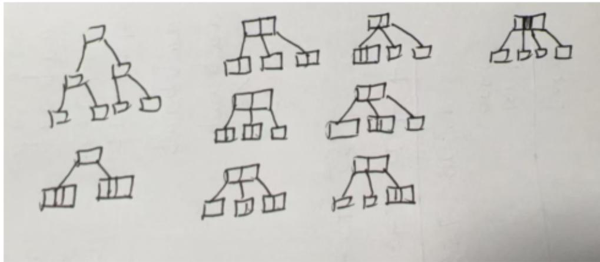
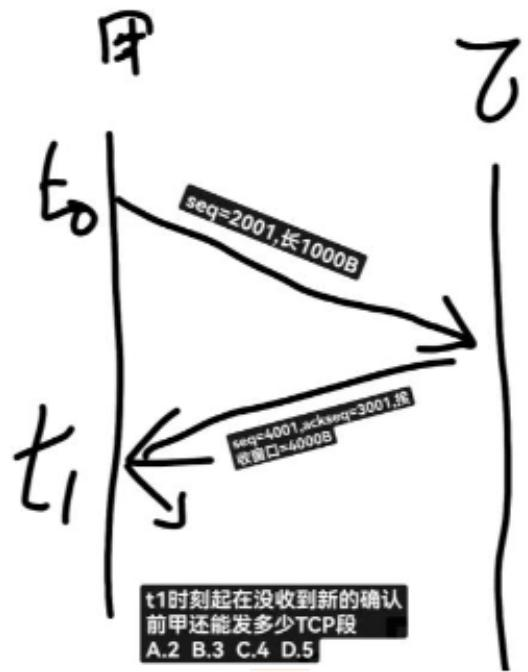
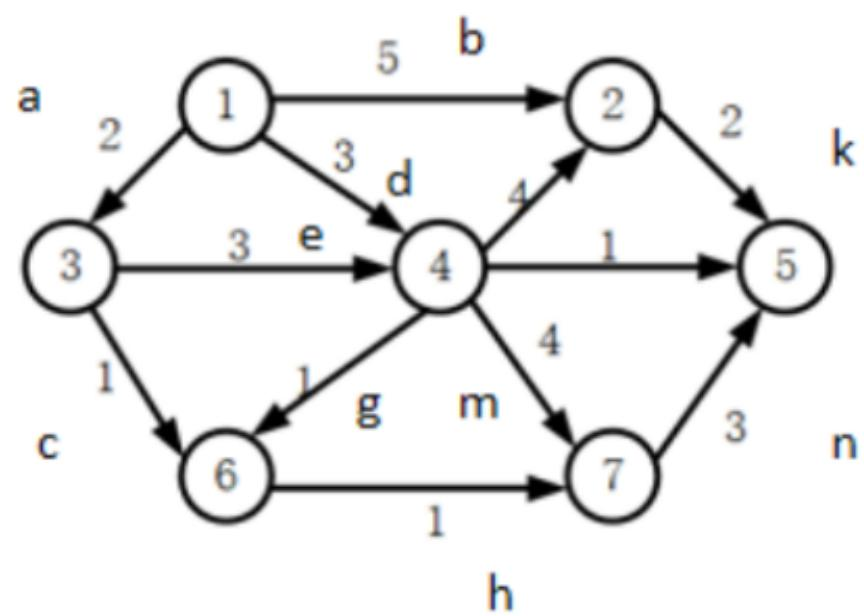
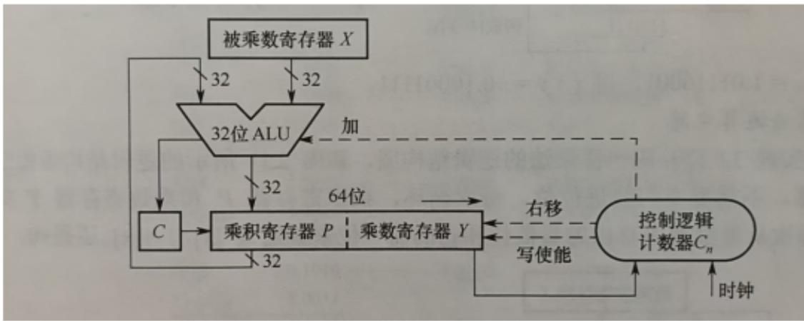

# 2025年408统考真题&答案解析

# （抢鲜1.0版）回忆整理

# 一、选择题

# 数据结构：

1. 请计算以下代码的时间复杂度。（）

int count =0;

for (int i=0;i*i<n;i++)

for(int j=0;j<i;j++)

count++;

A. logn

B.n

C.nlogn

D.n²

# 【参考答案】

【解析】

① 外层循环的条件是 $i * i < n$ 。这意味着 $i$ 的最大值是满足 $i * i < n$ 的最大整数。换句话说， $i$ 的最大值是 $\sqrt{n}$ （向下取整）。因此，外层循环大约执行 $\sqrt{n}$ 次。  
② 内层循环分析

对于每一个i值，内层循环执行i次。因此，内层循环的总执行次数是各次外层循环中内层循环执行次数的总和。（代码时间复杂度其实求的也是内层循环总共执行多少次）

具体来说，内层循环的总执行次数为：

$$
0 + 1 + 2 + 3 + \dots + \sqrt {n}
$$

这是一个等差数列的和，其和为： $\sqrt{n} a_{1} + \frac{\sqrt{n} (\sqrt{n} - 1) d}{2} = \frac{\sqrt{n} (\sqrt{n} - 1)}{2}$

$\frac{\sqrt{n}(\sqrt{n} - 1)}{2}$ 可以近似于 $\frac{\left|\sqrt{n}\right|^2}{2}$ 即 $\frac{\mathbf{n}}{2}$ ，时间复杂度为 $O(n)$

2、栈内空间3个，括号入栈，哪个不行？

A

B

C

D.[a-(b+[c*(d+e)-f]+g+h)]

3、数组不能作为完全二叉树的是？

A B C D, 17, 20, 35, -1, 18, 45, -1, -1, 29, 2

4、

A

B. 任意一个森林可以转换为一棵二叉树

C

D

5、构造哈夫曼编码，编码长度大于等于3的结点数有多少个

A. 2   
B.3   
C.4   
D.5

6、下列描述正确的是？

A   
B   
C. 各顶点的度均大于等于 2 的无向图必有回路  
D.

7.对400个元素采用分块查找，问每块分多少个效率最高？

A.8   
B.10   
C.20   
D.25

解析：分块的大小应该设置为使得块间查找和块内查找的平均查找长度之和最小。

根据搜索结果中的分析，当分块大小设置为sqrt(n)时（n为总元素数），分块查找的平均查找长度达到最小。

对于400个元素， $\mathrm{sqrt}(400) = 20$ ，因此理论上每块分20个元素时效率最高。

8.一棵4阶B树，有7个关键字，符合条件的B树有多少种



A.7   
B.8   
C.9   
D.10

9.下列描述正确的是

A. 只要线性表不满, 线性探查再散列一定能找到一个空闲位置  
B.   
C.   
D.

10、在最坏情况下，移动次数最少的是

A. 冒泡排序   
B. 直接插入排序  
C. 快速排序  
D. 简单选择排序

【参考答案】D

【解析】

冒泡排序（A选项）：

最坏情况下，移动次数为 $3n(n - 1) / 2$ 次。

直接插入排序（B选项）：

最坏情况下，移动次数为 $(n + 2)(n - 1) / 2$ 次。

快速排序（C选项）：

最坏情况下，移动次数取决于具体的实现方式，但通常不会是最少的。快速排序在最坏情况下（例如，每次选择的枢轴都是最小或最大元素）的时间复杂度为 $O(n^{2})$ ，移动次数会相当多。

简单选择排序（D选项）：

最坏情况下，移动次数为 $n$ 次。这是因为简单选择排序每次找到最小（或最大）元素后，只需将该元素与当前位置的元素交换一次，总共需要交换 $n - 1$ 次（对于 $n$ 个元素），每次交换涉及两次移动（一次是原位置元素移到新位置，一次是新元素移到原位置）。因此，移动次数为 $2^{*}(n - 1)$ 次，即 $O(n)$ 次。

综上所述，在最坏情况下，移动次数最少的排序算法是简单选择排序。

11. 给定一个初始序列，已知第一趟排序结构为xxxx，第二趟排序结果为15,20,25...

是以下哪种排序？（）。

A. 希尔排序  
B. 基数排序   
c. 归并排序   
D. 折半插入排序

# 【参考答案】A

【解析】A.希尔排序：希尔排序是一种基于插入排序的算法，它通过比较相距一定间隔的元素来工作，这个间隔在排序过程中会逐渐减小，直到最后变为1（即进行普通的插入排序）。希尔排序的特点是在初始阶段，元素可能会进行大步长的移动，随着排序的进行，步长逐渐减小，排序变得更加精细。题目中提到的“两趟排序”和逐渐变得有序的序列与希尔排序的特点相符。

B.基数排序：基数排序是一种非比较型整数排序算法，它按照元素的位（如十进制数的个位、十位等）进行排序。基数排序通常不是通过多趟类似插入排序的过程来实现的，因此与题目描述不符。  
C.归并排序：归并排序是一种分治算法，它将序列分成两个子序列分别排序，然后将两个有序子序列合并成一个有序序列。归并排序的每一趟都会将序列分成更小的部分进行排序，而不是像题目中描述的那样进行两趟整体排序。  
D. 折半插入排序：折半插入排序是插入排序的一种变体，它在插入元素时使用二分查找来确定插入位置，从而减少比较次数。但它仍然是每次插入一个元素，与题目中描述的两趟整体排序不符。

综上所述，根据题目描述的两趟排序过程和结果，最符合的是希尔排序。希尔排序在初始阶段会进行大步长的排序，使得序列逐渐变得有序，随着步长的减小，排序变得更加精细，最终得到完全有序的序列。

12. 有一段代码：

Short si=-32767;

Unsigned int ui = si;

则其对应的值为：（）。

A. $2^{15} + 1$ B. $2^{15}$ C. $2^{32} - 2^{15} - 1$ D. $2^{32} - 2^{15} + 1$

【参考答案】D

【解析】short si = -32767

unsigned int ui = 4294934529

选项A: $2^{\wedge}15 - 1 = 32767$

选项B: $2^{\wedge}15 + 1 = 32769$

选项C: $2^{\wedge}32 - 2^{\wedge}15 - 1 = 4294934527$

选项D: $2^{\wedge}32 - 2^{\wedge}15 + 1 = 4294934529$

13.在IEEE754标准下，47300000H对应的真值是多少（）。

A. $0.375 \times 2^{14}$ B. $1.6375 \times 2^{14}$   
C. $0.375 \times 2^{15}$ D. $1.375 \times 2^{15}$

【参考答案】D

【解析】首先，将十六进制数4730000H转换为二进制数：

4730 0000H=0100 0111 0011 0000 0000 0000 0000 0000B

符号位 $S = 0$ （表示正数）

指数部分 $\mathrm{E} = {10001110}\mathrm{\;B} = {142}$ (十进制)

尾数部分M=0110000000000000000000B

先计算指数的偏移值：对于单精度，偏移值为127。

实际指数 $\mathrm{e} = \mathrm{E} - {127} = {142} - {127} = {15}$

尾数 $\mathrm{m} = 1 + \mathrm{M}$ (隐含了一个 1 在前面)

m=1.011B=1.375（十进制）

真值 $V = (-1)^{5}\times m\times 2^{e}$

$$
V = 1 \times 1. 3 7 5 \times 2 ^ {1 5}
$$

因此，答案为D

14.x=A3H,y=75H计算x-y求真值和OF（）。

A. 22,0

B.22,1

C. ${46},0$

D. 46,1

【参考答案】D

【解析】 $X = A3H$ ，转换为十进制为163，y=75H,转换为十进制117，x-y=163-117=46。OF=为最高位进位异或次高位进位=1

15. 结构体小端存储

```txt
{ int d; char C [10]; int s; } M[200] 
```

其起始地址为0000A0B0H则M[1].d的机器数为（）。

A. 0000 A0C3H

B. 0000 A0C4H

C. 0000 A0C5H

D.0000 A0C6H

【参考答案】C

【解析】因为int类型在小端存储中，存储顺序是低位在前，高位在后。M[1].d的机器数为0000A0C5H（d的4字节在小段存储下，最后一个字节在A0C5H位置）。

16.ISA规定了（）。

A. 定长指令字 B. 阵列乘法器

C. 微程序控制器 D. 单总线数据通路

【参考答案】A

【解析】A选项，ISA可以规定指令字的长度。例如，在MIPS架构中，指令字是32位的定长指令。这种设计简化了指令的取指和译码过程。所以，ISA可以规定定长指令字。B选项，阵列乘法器是一种硬件实现乘法运算的电路，属于微架构（Microarchitecture）的范畴，而不是ISA规定的内容。ISA不涉及具体的硬件实现细节，如乘法器的设计。C选项，微程序控制器是一种实现控制单元的方法，属于硬件实现的细节，不属于ISA的规定内容。ISA关注的是指令集和软件可见的硬件状态，而不是控制单元的具体实现方式。D选项，单总线数据通路是一种硬件设计选择，属于微架构的内容，而不是ISA规定的内容。ISA不规定数据通路的具体设计。

17. RISC 中说法错误的是（）

A. load/store   
B. 硬连接方式  
C. 难以采用流水线数据通路实现微架构  
D. 传递过程调用函数

# 【参考答案】C

【解析】A选项，RISC架构通常采用load/store架构，这是RISC的典型特点，不是错误的说法。B选项，RISC通常采用硬连线控制逻辑，而不是微程序控制，这也是RISC的典型特点，不是错误的说法。C选项，RISC的设计目的之一就是便于采用流水线数据通路实现高效的微架构，所以这种说法是错误的。D选项，RISC在函数调用和返回时可以高效地处理，这是RISC的优势之一，不是错误的说法。

18. 关于CPU和CPI的叙述说法正确的是（）。

A.   
B.

C. 程序的 CPI 和缺失率无关  
D.

# 【参考答案】B

19. 数据通路错误的是（）。

A. 通用寄存器包含在 PC  
B.   
C.   
D.

# 【参考答案】A

【解析】A 选项，这是错误的说法。程序计数器（PC）是一个特殊的寄存器，它通常不包含在通用寄存器组中。PC 用于指示下一条要执行的指令的地址，而通用寄存器用于存储数据和操作数。C 选项，这是正确的。在单周期数据通路设计中，时钟周期需要满足所有指令中最耗时的指令的执行时间，这样才能保证所有指令在一个时钟周期内完成执行。D 选项，这是正确的。在流水线 CPU 设计中，时钟周期长度通常由流水线中最长的流水段（即执行时间最长的阶段）决定，以确保流水线能够正常工作。答案是 A。通用寄存器包含 PC 是错误的说法。

20. 10M 以太网 总线采用同步方式，并行传输，每个时钟周期传4次32位时钟频率 $1333\mathrm{MHz}$ ，总线带宽是多少（）。

A.10.665GB/s

B.32.636GB/s

C.24.666GB/s

D.19.663GB/s

# 【参考答案】A

21. 适合采用DMA的设备有（）。

1. 键盘   
II.网卡

III. 固态硬盘  
IV.打印机

A. I, II   
B. II、III  
C. II, IV   
D. III, IV

# 【参考答案】B

【解析】I. 键盘，键盘是一种低速输入设备，每次按键产生的数据量很小，通常不需要使用DMA进行数据传输。CPU可以轻松处理键盘输入的数据，因此键盘一般不采用DMA。

II. 网卡，网卡通常需要处理大量的网络数据，数据传输速率较高。为了避免 CPU 在数据传输过程中被大量占用，网卡通常采用 DMA 技术来直接在内存和网卡之间传输数据，提高系统效率。III. 固态硬盘，固态硬盘（SSD）的数据读写速度较快，尤其是在进行大量数据传输时。为了提高数据传输效率，SSD 通常采用 DMA 技术来直接与内存交换数据，减少 CPU 的干预。IV. 打印机，打印机是一种相对低速的输出设备，每次打印的数据量通常不大，且数据传输速度要求不高。因此，打印机一般不需要采用 DMA 技术，CPU 可以很好地处理与打印机的数据交互。答案是 II. 网卡和 III. 固态硬盘适合采用 DMA、B 选项。

22.下列不会触发中断的事件是（）。

A.DMA 传送结束   
B. 贡故障处理结束  
C.总线事务结束   
D.执行断点指令

# 【参考答案】C

【解析】A选项，DMA（直接内存访问）是一种允许外部设备在不经过CPU干预的情况下直接访问系统内存的技术。当DMA传送结束时，通常会产生一个中断信号来通知CPU数据传输已经完成，这样CPU可以进行后续的数据处理等操作。所以，DMA传送结束会触发中断。B选项，当发生页故障（例如，程序访问的页面不在内存中）时，操作系统会进行页故障处理，如从磁盘调入页面到内存。当页故障处理结束后，会触发中断来通知CPU可以继续执行因页故障而暂停的程序。所以，页故障处理结束会触发中断。C选项，总线事务通常包括数据的读取或写入操作。当总线事务结束时，一般不需要触发中断。例如，CPU对内存的一次读操作完成后，不需要通过中断来通知CPU（因为这是CPU主动发起的操作）。所以，总线事务结束通常不会触发中断。D选项，断点指令是用于调试程序的一种特殊指令。当CPU执行到断点指令时，会触发中断，这样调试器可以接管控制，查看程序状态等。所以，执行断点指令会触发中断。

23.在虚拟页式管理系统中，进行进程上下文切换时，不用发生变化的是（）。

A. 页表基址寄存器  
B. 通用寄存器  
C. 程序计数器  
D. 中断向量表的基址寄存器

# 【参考答案】D

【解析】A选项，页表基址寄存器（PTBR）指向当前进程的页表。在进程上下文切换时，由于不同进程有不同的页表，PTBR需要被更新为新进程的页表地址，所以会发生变化。B选项，通用寄存器保存了进程执行过程中的临时数据。在进程上下文切换时，当前进程的通用寄存器值需要被保存，而下一个进程的通用寄存器值需要被恢复，所以会发生变化。C选项，程序计数器（PC）指向当前要执行的指令地址。在进程上下文切换时，当前进程的PC

值需要被保存，而下一个进程的PC值需要被恢复，所以会发生变化。D选项，中断向量表的基址寄存器通常指向系统的中断向量表，这个表是系统级别的，不依赖于具体的进程。在进程上下文切换时，不需要改变中断向量表的基址寄存器的值，因为它对所有进程都是一样的。答案是D.中断向量表的基址寄存器。

24.关于虚拟化技术，错误的说法是（）。

A. 操作系统可以在虚拟机上运行  
B. 可以用一台主机上模拟多种 ISA  
C. VMM 与操作系统特权级相同  
D. 一台主机可以支持多个虚拟机

【参考答案】C

【解析】第二类虚拟机（VMM）管理程序以用户态运行在宿主操作系统上，这类虚拟机所在的内核态实际是用户态，而不是真正的内核态，特权级不同。

25.根据优先级调度算法，用队列保存就绪队列，高优先级进程在队头、队列的长度为n,则插入、出队进程的时间复杂度分别为（）。

A. O(1)、O(1)  
B. O(1)、O(n)  
C. O (n)、O (1)  
D. O (n)、O (n)

【参考答案】C

【解析】插入操作在队尾，出队在对头，故插入的时间复杂度为O(n)，出队时间复杂度为0(1)

26.采用LRU调度算法，局部置换策略，给进程分配3个页框，页面访问序列为 $\{0,1,2,0,5,1,4,3,0,2,3,2,0\}$ ，其中0,1,2已调入内存、问缺页次数为（）

A. 5 B. 6 C. 7 D. 8

【参考答案】B

【解析】根据LRU调度算法依次访问

27.确定进程运行所需的最少页框数时，要考虑指标有（）

A. 代码段长  
B. 虚拟地址空间大小   
C. 物理地址空间大小  
D. 指令系统支持的寻址方式

【参考答案】D

【解析】D 选项, 指令系统支持的寻址方式会影响进程对内存的访问模式。例如, 如果指令系统支持大跨度的间接寻址, 可能需要更多的页框来确保这些寻址操作能够正确执行。

28.关于虚拟文件系统的内容

A.   
B.   
C.   
D.

【参考答案】C

【解析】A选项，这个说法是错误的。VFS并不是运行在虚拟内存中的文件系统，而是一个抽象层，用于管理不同文件系统的接口。B选项，这个选项没有实际意义，不做考虑。C选项，这个说法是正确的。VFS的主要作用就是提供一个统一的接口，使得操作系统可以无缝地访问不同类型的文件系统。D选项，这个说法是错误的。VFS不仅可以访问本地文件系统，还可以通过网络协议访问网络文件系统，如NFS（网络文件系统）和CIFS（通用互联网文件系统）。

29 使用索引节点，用户在新建文件 F 时，文件系统不会做的是（）。

A. 初始化文件 F 的索引节点  
B. 在目录文件中写入 F 的索引节点号  
C. 写入 F 的访问权限信息  
D. 目录中增加一条文件 F 对应的目录项

# 【参考答案】C

【解析】A选项，当用户在目录中新建文件F时，文件系统会为文件F创建一个索引节点，并对其进行初始化，包括设置文件的大小为0、设置默认的访问权限等。B选项，文件系统会在目录文件中添加一条记录，记录中包含文件名F和其对应的索引节点号，这样通过文件名就能找到对应的索引节点。C选项，访问权限信息通常存储在索引节点中，而不是目录文件中。在新建文件时，文件系统会在索引节点中设置默认的访问权限，而不是在目录文件中写入这些信息。D选项，如前所述，文件系统会在目录文件中添加一条记录，记录文件名F和其对应的索引节点号，这是新建文件时的必要操作。答案是C.在目录文件中写入F的访问权限信息。

30 关于内存映射文件，正确的是（）。

I. 可实现进程间通信  
II. 实现了页面到磁盘块的映射  
III. 将文件映射到进程的逻辑地址空间  
IV. 将文件映射到系统的物理地址空间

A. I、III  
B. I, IV   
C. II、III  
D.I、II、III

【参考答案】D

【解析】I 正确，当多个进程映射同一个文件时，它们可以共享数据。内存映射文件实现了文件到进程的逻辑地址空间，而不是系统的物理地址空间。页面属于逻辑层面，磁盘块属于物理层面。II、III 正确，IV 错误。

31. 可记录外存空间使用情况的是（）。

A. 目录  
B. 进程控制块  
C. 文件分配表 (FAT)  
D.系统打开文件表

【参考答案】C

【解析】目录主要用于组织和存储文件名及其对应的索引节点信息等，它并不直接记录外存空间的使用情况。系统打开文件表主要用于记录当前系统中打开的文件信息，包括文件的状态

态、读写指针位置等，它不用于记录外存空间的使用情况。文件分配表（FAT）是一种用于记录文件在磁盘上存储位置的数据结构。它通过链式结构记录了文件所占用的磁盘簇（cluster），能够准确地反映外存空间的使用情况，包括哪些簇已经被占用，哪些簇是空闲的。进程控制块（PCB）主要用于记录进程的状态信息，如进程的优先级、程序计数器、寄存器状态等，与外存空间的使用情况无关。答案是C.文件分配表（FAT）。

32.文件系统要为温彻斯特硬盘、固态硬盘都有的功能是（）。

A.划分扇区 B.确定盘块大小   
C.降低寻道时间 D.实现均衡磨损

【参考答案】B

【解析】温彻斯特硬盘（HDD）和固态硬盘（SSD），SSD 不会划分扇区，A 错误。文件系统管理存储设备时，不论是 HDD 还是 SSD，都需要将存储空间划分为固定大小的块（或称为簇）来进行数据分配和寻址，B 正确。这是 HDD 的一个特点，因为 HDD 需要物理移动磁头来读取数据，而 SSD 没有机械移动部件，因此不存在寻道时间的问题，C 错误。SSD 有均衡磨损，而 HDD 没有，D 错误。

33、H1、H2 之间按电路交换方式、报文交换方式、分组交换方式传送 2MB（ $1\mathrm{M} = 10^{6}$ ）文件。接收文件全部内容所需时间记为 $T_{CS}$ 、 $T_{MS}$ 、 $T_{PS}$ ，问这三个耗时的大小关系是（）

A. $T_{CS} > T_{MS} > T_{PS}$   
B. $T_{MS} > T_{PS} > T_{CS}$   
C. $T_{MS} > T_{CS} > T_{PS}$   
D. $T_{PS} > T_{MS} > T_{CS}$

【参考答案】B

【解析】电路交换方式（TCS）在建立连接后，数据传输速度较快，且不受其他用户的影响。但是，连接建立时间和释放时间可能是一些额外的开销。

报文交换方式（TMS）不需要建立连接，但可能受到存储转发延迟的影响，特别是当文件很大或网络拥塞时。

分组交换方式（TPS）提供了更高的灵活性和网络利用率，但可能因为分组处理、网络拥塞和额外的分组头部信息而引入额外的延迟。

在大多数情况下，对于大数据文件（如2MB）的传输，电路交换方式（TCS）可能提供最快的传输速度，因为它提供了专用的带宽和较少的额外开销。然而，这取决于网络的具体情况和可用的资源。在某些情况下，特别是当网络资源丰富且分组交换网络优化得当时，分组交换方式（TPS）可能接近或甚至超过电路交换的性能。而报文交换方式（TMS）通常不是大数据传输的最佳选择，因为它可能受到较大的存储转发延迟的影响。

34、某差错编码的编码集为{10011010,01011100,11110000,00001111},其检错、纠错能力是（）

A. 可以检测不超过 2 位错, 检错率 100%; 可纠正不超过 1 位错  
B. 可以检测不超过 2 位错,检错率 $100\%$ ; 可纠正不超过 2 位错  
C. 可以检测不超过 3 位错,检错率 $100\%$ ; 可纠正不超过 1 位错  
D. 可以检测不超过 3 位错,检错率 $100\%$ ; 可纠正不超过 2 位错

【参考答案】

【解析】计算最小海明距离：

汉明距离是两个等长字符串之间对应位置的不同字符的个数。对于给定的编码集{10011010,

01011100, 11110000, 00001111}, 我们需要找出任意两个编码之间的最小汉明距离。

通过比较，我们可以发现最小海明距离是4（例如，10011010与01011100之间有4个位置不同）。

然后根据海明距离判断检错和纠错能力：

检错能力：检错能力：根据海明距离的性质，一个编码集能够检测出的错误数量最多为最小汉明距离减1。因此，这个编码集能够检测出最多3个错误（4-1=3）

纠错能力：可以纠正不超过 $\frac{\mathrm{d}_{\min} - 1}{2}$ 位错。

纠错能力：可以纠正不超过 $\lfloor \frac{4 - 1}{2}\rfloor = 1$ 位错。

最后根据选项判断：

选项C：可以检测不超过3位错，检错率 $100\%$ ；可纠正不超过1位错，符合上述分析。

答案是C。

35、10BaseT以太网，甲乙处于同一个冲突域，连续发生11次冲突，甲再次发送的最大时间间隔为（）

A. 0.512ms   
B. ${0.5632}\mathrm{{ms}}$   
C. 52.3776ms   
D. 104.8064ms

# 【参考答案】

【解析】

根据以太网的二进制指数退避算法（Binary Exponential Backoff）来计算重传时间：

第一次冲突后，随机选择0或1个时隙后重传。

第二次冲突后，随机选择0、1、2或3个时隙后重传。

第三次冲突后，随机选择0到7个时隙后重传。

依次类推，第 $n$ 次冲突后，随机选择0到 $2^{n} - 1$ 个时隙后重传。

对于连续发生11次冲突：

第11次冲突后，随机选择的范围是0到 $2^{10} - 1$ 个时隙。

$2^{10} = 1023$ ，最大可能选择个时隙。

每个时隙 $T = 51.2\mu s$ ，所以最大时间间隔 $= 1023\times 51.2 = 52377.6\mu s = 52.3776ms$

所以甲再次发送的最大时间间隔为52.3776ms，答案是选项C。

36、DHCP协议的REQUEST报文，目的IP、源IP为（）

A、  
B、  
C、255.255.255.255， 0.0.0.0  
D、

# 【参考答案】C

【解析】目的IP地址：

当 DHCP 客户端发送 REQUEST 报文时，由于此时客户端可能还没有真正拥有 IP 地址（例如在首次申请 IP 地址时），因此目的 IP 地址通常设置为广播地址 255.255.255.255。这样，

REQUEST报文会被发送到网络中的所有设备，DHCP服务器会监听到这个报文并作出响应。

源IP地址：

在DHCP客户端发送REQUEST报文时，如果客户端还没有获得IP地址（例如在首次申请IP地址时），源IP地址会设置为0.0.0.0。

然而，在某些情况下，如果客户端已经有了IP地址（例如在续租IP地址时），REQUEST报文可能会以单播方式发送，此时源IP地址将是客户端当前使用的IP地址。

37、NAT路由器从内网转发一个IP分组到外网，IP分组内携带UDP数据报，问UDP首部被修改的是（）

I源端口号

Ⅱ目的端口号

Ⅲ总长度

IV校验和

A、ⅡⅢ   
B、I IV   
C、ⅠⅢ   
D、ⅡIV

【参考答案】B

【解析】

源端口号（I）：

- NAT路由器可能会修改源端口号，特别是在进行地址和端口转换时，以确保外部网络能够正确地将响应发送回内部网络。

目的端口号（Ⅱ）：

目的端口号通常不会被NAT路由器修改，因为它指定了外部网络中接收数据的设备和服务。总长度（III）：

UDP数据报的总长度（包括首部和数据）通常不会被NAT路由器修改，因为它是由UDP协议本身在发送端设置的，表示整个数据报的长度。

校验和（IV）：

当源端口号被修改时，UDP校验和也需要重新计算，因为校验和覆盖了UDP首部和数据部分，包括源端口号和目的端口号。

综上所述，UDP首部在NAT转发过程中可能会被修改的是源端口号和校验和。因此，正确答案是：

I源端口号和IV校验和

38、（易错题）t0时刻，甲的ssthresh = 8，拥塞窗口 = 2，发送窗口 = 2，MSS = 1000B。在t1时刻，甲可以再给乙发送（）个TCP段。



A. 2   
B. 3   
C. 4   
D. 5

【参考答案】A

【解析】在本题中，考点是发送窗口和MSS对发送TCP段数量的影响。发送窗口（以字节为单位）决定了发送方在不等待确认的情况下能够发送的最大数据量。而MSS则决定了每个TCP段能够携带的最大数据量。

现在，我们来计算甲在t0时刻能够发送给乙的TCP段的数量：

发送窗口的大小是2（这里假设是以MSS为单位，即2个MSS）。

MSS是1000B，即每个TCP段能够携带1000字节的数据。

因此，甲在t0时刻能够发送的TCP段的数量是发送窗口大小除以MSS，即：

发送段数 = 发送窗口（以 MSS 为单位） = 2

所以，甲在 t1 时刻（假设 t1 紧接着 t0，且没有新的确认或拥塞控制事件改变窗口大小）可以再给乙发送 2 个 TCP 段。这是因为发送窗口的大小限制了甲能够发送的数据量，而 MSS 则决定了每个段的大小。在这个情况下，发送窗口恰好等于 2 个 MSS，所以甲可以发送 2 个 TCP 段。

39、Time 服务器采用 C/S 模型，RTT = 8ms。采用 UDP、TCP 请求时间服务器，最短耗时为（）

A. 8ms 8ms   
B. 8ms 16ms   
C. 16ms 8ms   
D. 16ms 16ms

# 【参考答案】

【解析】UDP是一个无连接的协议，不需要在数据传输之前建立连接。因此，UDP请求可以立即发送，无需等待连接建立。

对于一个 UDP 请求，最短耗时将主要由 RTT 决定。由于 UDP 请求和响应都是直接发送的，没有额外的握手或确认开销，所以最短耗时接近 RTT。

因此，使用 UDP 请求时间服务器的最短耗时大约为 8ms（RTT）。

采用TCP请求时间服务器的最短耗时可以计算为：

三次握手建立连接的时间：1*RTT=8ms

请求和响应的时间：1*RTT=8ms

两者相加，得到最短耗时为：

8ms（连接建立）+8ms（请求和响应）=16ms

# 40、关于POP3，正确的是（）

I. 支持用户代理从邮件服务器读取邮件  
II. 支持用户代理向邮件服务器发送邮件  
III. 支持邮件服务器之间发送与接收邮件  
IV. 支持一条 TCP 连接接收多封邮件

A. I、IV  
B. II、III  
c. I、II、III  
D. I、III、IV

# 【参考答案】

# 【解析】

I. 支持用户代理从邮件服务器读取邮件：

这是正确的。POP3协议的主要功能之一就是从邮件服务器检索电子邮件至本地客户端应用程序（即用户代理）。用户代理通过POP3协议可以连接到邮件服务器并下载其邮箱中的新邮件。

II. 支持用户代理向邮件服务器发送邮件：

这是不正确的。POP3协议主要用于从邮件服务器读取邮件，而不支持发送邮件。发送邮件通常使用SMTP（Simple Mail Transfer Protocol，简单邮件传输协议）。

III. 支持邮件服务器之间发送与接收邮件：

这是不正确的。POP3协议不用于邮件服务器之间的通信。邮件服务器之间的邮件传输通常使用SMTP协议。

IV. 支持一条 TCP 连接接收多封邮件：

这是正确的。POP3协议允许用户通过一条TCP连接从邮件服务器下载多封邮件。用户代理打开到邮件服务器端口110上的TCP连接后，就可以通过POP3协议下载所有未阅读的电子邮件。

综上所述，关于POP3的正确选项是：

I. 支持用户代理从邮件服务器读取邮件 IV. 支持一条 TCP 连接接收多封邮件所以，正确答案是 I 和 IV。

41.（13分）有两个长度均为 $n$ 的一维整型数组A[n]、res[n]，计算A[i]与A[j](0≤i≤j≤n-1)乘积的最大值，并将其保存到res[i]中。若A[]={1,4,-9,6}，则得到res[]={6,24,81,36}。现给定数组A，请设计时间空间上尽可能高效的算法CalMulMax，求res中各元素的值。函数原型为：void CalMulMax(int A[],int res[],int n)。

1. 给出算法的基本思想。（4分）  
2. 用 $C / C + +$ 描述算法关键之处给出注释。（7分）  
3. 说明时间、空间复杂度。（2分）

# 【参考答案】

方法1：

(1) 使用两个 for 循环遍历数组 A，需要满足 $0 \leq i \leq j \leq n - 1$ 。

对于每个i，遍历所有j（其中 $\mathrm{j}\geq \mathrm{i})$ ，计算A[i]*A[j]，并记录其中的最大值到res[]中。

(2)

```javascript
voidMulMax(intA[],intn,intres[]) { for(inti=0;i<n;i++) res[i]=-1; for(inti=0;i<n;i++) { for(intj=i;j<n;j++) { if(A[i]*A[j]>=res[i]) res[i]=A[i][j]; } } 
```

}

(3)时间复杂度 $\mathrm{O}\left( {\mathrm{n}}^{2}\right)$ ,空间复杂度 $\mathrm{O}$ (1)

方法2：

(1) 直接找出所有元素中的最大值与最小值，若当前元素小于 0，则对应 res 里应存储 A[i]乘以最小值（此时最小值必小于 0）；若当前元素大于 0，则对应 res 里应存储 A[i]乘以最大值（此时最大值必大于 0）

(2)

void maxMulti(int A[],int n,int res[]) {

int max=A[n-1],min=A[n-1];

for(int i=0; i<n; i++) {

//找出最大值和最小值

if(A[i] $\rightharpoondown$ max) max=A[i];

if(A[i] $<  =$ min) min=A[i];

}

for(int i=0; i<n; i++) { //

if(A[i] < 0) res[i] = A[i]*min;

else res[i]=A[i]*max;

}

$\therefore m - 1 \neq  0$ ;

(3)时间复杂度O(n),空间复杂度O(1)

42. 在带权有向图中，AOE 网指用边表示活动的网络。以下有一个 AOE 网。

请回答以下问题：



(1) 求活动最早的结束时间? 关键活动是什么?  
(2) 与 e 并行的活动有哪些？  
(3) 活动余量最大值是多少？是哪个活动的？  
(4) 活动 b 的开始时间推迟到 6 , 不压缩其它活动, 活动 b 的时间应压缩多少? 如果压缩其它活动, 应该压缩哪个? 【减少 b 影不影响活动, b 的空闲时间是多少】

# 【参考答案】

(1) 12   
a,e,m,n   
(2) b, c, d   
(3) j 6   
(4) b 压缩到 4 ; 否则压缩 k 到 1

43.计算机M字长为32位，按字节编址，数据cache的数据区大小为32KB，采8路组相联，主存块大小为64B，cache命中时间为2个时钟周期，缺失损失为200个时钟周期，采用页式虚拟存储，页大小为4KB。数组d的起始地址为01800020H(VA31~VA0)

(1)主存地址中的 Cache 组号、块内地址分别占几位？VA 中哪些位可以作为 Cache 索引？  
(2)d[100]的 VA 是多少？d[100]所在主存块中对应的 Cache 组号是多少？  
(3)设代码已经在cache中，i，x已装入内存，但不在cache，则d[0]在其主存块内的偏移量是多少？执行for的过程中，访问d的Cache缺失率和数组元素的平均访问时间分别是多少？（缺失率用百分比表示，保留两位小数）  
(4)d分布在几个页中？若代码已在主存，d不在主存，则执行for的过程中，访问d所引起的缺页次数是？

```c
1 int x, d[2048], i;  
2 for(i = 0; i < 2048; i++)  
3 d[i] = d[i] / x; 
```

# 【参考答案】

(1) Cache 组号和块内地址分别占 6 位, VA 中的 V11~V6 可以作为 Cache 索引。  
(2) d [100] 的 VA 是 0180 01B0H, Cache 组号为 06H。  
(3) Cache 缺失率为 $129 / 4096 = 3.15\%$ ，平均访问时间为 $202 \times 3.15\% + 2 \times 96.85\% = 8.3$   
(4)3,3

44.接上题，R0～R4为通用寄存器，SEXT表示按符号扩展，M中补码除法器，逻辑结构图如下：



1 机器级代码：  
2//x在R2中，i在R4中  
3 //数组 d 的首地址在 R3 中  
4 mov R1, (R3+R4*4) //R1<-d[i]   
5 scov R1 //{R0,R1}<- -SEXT(R1)   
6 idiv R1 //R1<-（{R0,R1}）/R2)

(1) 若执行 idiv 指令时，d[i] = 0x87654321，x = 0xff，则补码除法器中 R、Q、Y 的初始值分别为多少（用十六进制表示）？图 b 中哪个部分包含计数器？在补码除法器执行过程中，ALUop 所控制的 ALU 运算有哪几种？  
(2)假设 idiv 执行过程中会检测并触发除法异常，则执行 idiv 指令时，哪些情况下会发生除法异常（要求给出此时 d[i]和 x 的十六进制机器数）？发生除法异常时，在异常响应过程中，CPU 需要完成哪些操作？

# 【参考答案】

(1) R 中的值为 FFFF FFFFH, Q 中的值为 87654321H, Y 中的值为 FFFFFFFH。b 中的控制逻辑包含计数器, ALUop 所控制的 ALU 运算包含加法和减法。  
(2)第一种情况：除数为0异常，d[i]为任意值，x为00000000H。

第二种情况：溢出异常，d[i]为8000000H，x为FFFF FFFFH，在d[i]=-2³¹，x=-1的情况下会发生溢出异常。

在发生除法异常时 CPU 响应的操作：1. 关中断，修改 CPU 状态为内核态。2. 保存断点（PC 和 PSWR 中的值）。3. 跳转到异常处理程序。

45.甲、乙、丙三人合作种树，首先甲负责挖树坑；然后乙负责放树苗、填土，最后丙负责浇水。只有一把铁锹和一个水桶，甲挖坑当且仅当树坑 $< 3$ 时才挖坑，挖坑和填土需要铁锹，浇水需要水桶。请用尽可能少的信号量和wait()、signal()操作，实现三人之间的互斥和其他关系。

semaphore mutexT=1; //对铁锹的使用需要互斥访问 1分

semaphore sk=3; //可挖的树坑数量，初值为3; 2分

semaphore empty=0; //可使用的树坑数量 2分

【参考答案】

semaphore water=0; //需要浇水的树苗 2分

```javascript
甲（）{ while（1）{ wait(sk); wait(muTeX); 挖坑; signal(muTeX); signal(empty); }   
}
```

```txt
乙（）{ while(1){ wait(empty); wait(matxT); 入坑并填土; signal(matxt); signal(sk); signal(water); }   
}
```

```txt
丙（）{while（1）{wait(water);浇水;1}
```

46.有代码如下所示：

```txt
char \*ptr; void main () { int length; 
```

```c
ptr = (char*) malloc(10);  
scanf("%c", &ptr);  
length = ptr;  
printf("%d", length);  
free(ptr); 
```

<table><tr><td>操作系统内核区</td></tr><tr><td>用户栈</td></tr><tr><td>共享库的存储映射区</td></tr><tr><td>动态生成的堆(运行时由malloc 创建)</td></tr><tr><td>读/写数据段</td></tr><tr><td>只读代码段</td></tr><tr><td>未使用区</td></tr></table>

(1) 代码执行时, PCB 位于右图中哪个位置? 执行 scanf() 函数时, 进程处于什么状态?  
(2) 代码中的 main(), ptr 指针、length 变量和 malloc 函数各位于右图中的哪个位置?  
(3) 代码中哪些函数会调用 I/O 驱动程序？

【参考答案】(1)PCB位于内核区，执行scanf()时，进程处于阻塞态。

(2) main() 函数的代码位于只读代码段，其直接调用的 scanf() 和 printf() 需要执行驱动程序。  
(3)ptr 被分配在可读写数据段，length 在用户栈，ptr 指向的字符串在运行时堆。

# 计算机网络-大题

47


(1) 忽略卫星信号中继，TR1，TR2 调制解调开销，则 R1 到 R2 之间的卫星链路单向传播时延是多少？主机 H 向总部服务器传输数据时可达到的最大吞吐量是多少？若忽略各层协议首部开销，以及以太网的传播时延，则 H->sever 上传一个 4000B 的文件，至少需要多长时间？  
(2) 基于GBN为卫星链路设计单向可靠的链路层协议SLP，支持R1->R2发送数据。SLP数据帧长1500B，忽略ACK帧长度，要求SLP单向信道利用率不低于 $80\%$ ，则发送窗口至少为？SLP帧序号至少为多少？  
(3) 总部给工程部分配 IP 地址空间 10.10.10.0/24，再划分为 3 个子网，生活区子网不少于 120 个，作业子网，管理区子网 IP 均不少于 60 个，H 已正确配置 IP。问作，管，生子网地址各是多少？

# 【参考答案】

# （1）计算卫星链路单项传播时延

在忽略卫星信号中继、TR1、TR2调制解调开销的情况下，R1到R2之间的卫星链路单向传播时延主要取决于电磁波在太空中的传播速度以及卫星与地球之间的距离。对于GEO（地球同步轨道）卫星，其到地球表面的距离大约为 $36000\mathrm{km}$ 。电磁波在太空中的传播速度接近光速，即约每秒300000公里。

因此，R1到R2之间的卫星链路单向传播时延可以计算为：

时延 = 距离 / 速度 = 36000km / (300000km/s) ≈ 0.12秒

主机H向总部服务器传输数据时可达到的最大吞吐量：

最大吞吐量与链路带宽和传播时延相关。在忽略一些开销的情况下，可以通过链路带宽和传播时延来

计算。一般公式为最大吞吐量=数据帧大小传播时延+数据帧大小链路带宽

H->Server上传一个4000B文件至少需要多长时间：

在忽略各层协议首部开销以及以太网的传播时延的情况下，上传一个4000B（即4000字节，或32000比特）文件所需的时间主要取决于网络带宽，那么上传文件所需的时间T（秒）可以计算为：

T = 文件大小（比特） / 带宽（bps）

(2)

发送窗口大小的确定：

SLP数据帧长为1500B。

假设单向传播时延为 $T$ （这个值在之前的问题中给出为约 119.3 毫秒，但在这里我们不需要具体数值，只需要知道它是一个固定值）。

信道利用率要求不低于 $80\%$ 。

在GBN协议中，发送窗口大小（N）与信道利用率直接相关。为了最大化信道利用率，我们需要确保在发送下一个数据帧之前，当前数据帧的确认（ACK）不需要等待太长时间。然而，在单向链路中，ACK不是即时的，因此我们需要一个足够大的发送窗口来“填充”信道，同时保持足够的帧在传输中，以满足80%的信道利用率要求。

理论上，为了达到高信道利用率，发送窗口大小应至少为：

N = 信道带宽 * 单向传播时延 / 帧大小 * 信道利用率系数

SLP帧序号至少为多少：

在GBN协议中，帧序号用于区分不同的数据帧，并确保接收方能够按序接收和确认它们。

帧序号的范围要保证能区分不通的帧，与发送窗口大小相关。考虑到确认和重传的情况，发送窗口大小的2倍，为帧序号至少大小

（3）生活区子网需要不少于120个IP地址，由于子网内可用的IP地址数（不包括网络地址和广播地址）是 $2^{(\text{主机位长度})} - 2$ ，我们需要找到一个主机位长度，使得 $2^{(\text{主机位长度})} - 2 >= 120$ 。最小的满足条件的值是7（因为 $2^7 - 2 = 126$ ）。所以，生活区子网需要借用7位主机位作为网络位，子网掩码将是/27（因为原来的/24表示24位网络位，现在变为27位）。

作业子网和管理区子网均需要不少于60个IP地址，同样的计算表明，最小的满足条件的子网掩码长度是/26（因为 $2^{6} - 2 = 62$ ）。

现在，我们来分配子网地址：

原始网络 10.10.10.0/24 可以被划分为 8 个 /27 子网或 4 个 /26 子网。

为了满足需求，我们可以分配一个/26子网给作业子网，一个/26子网给管理区子网，以及一个/27子网（实际上，由于生活区需要更多IP地址，我们可能需要分配连续的/27子网来达到120个IP地址的需求，但这里我们先按最少需求分配）。