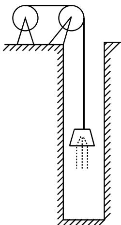

# 1999年全国硕士研究生招生考试试题

# 一、填空题(本题共5小题，每小题3分，满分15分)

(1) $\lim_{x\to 0}\left(\frac{1}{x^2} -\frac{1}{x\tan x}\right) = \underline{\quad}$   
(2) $\frac{\mathrm{d}}{\mathrm{d}x}\int_{0}^{x}\sin (x - t)^{2}\mathrm{d}t = \underline{\quad}$   
(3) $y^{\prime \prime} - 4y = \mathrm{e}^{2x}$ 的通解为 $y =$   
(4) 设 $n$ 阶矩阵 $\mathbf{A}$ 的元素全为 1 , 则 $\mathbf{A}$ 的 $n$ 个特征值是  
(5) 设两两相互独立的三事件 $A, B$ 和 $C$ 满足条件: $ABC = \emptyset$ , $P(A) = P(B) = P(C) < \frac{1}{2}$ , 且已知 $P(A \cup B \cup C) = \frac{9}{16}$ , 则 $P(A) = \_$ .

# 二、选择题(本题共5小题，每小题3分，满分15分)

（1）设 $f(x)$ 是连续函数， $F(x)$ 是 $f(x)$ 的原函数，则( )

(A) 当 $f(x)$ 是奇函数时, $F(x)$ 必是偶函数.  
(B) 当 $f(x)$ 是偶函数时, $F(x)$ 必是奇函数.  
（C）当 $f(x)$ 是周期函数时， $F(x)$ 必是周期函数  
（D）当 $f(x)$ 是单调增函数时， $F(x)$ 必是单调增函数

(2) 设 $f(x) = \begin{cases} \frac{1 - \cos x}{\sqrt{x}}, & x > 0, \\ x^2 g(x), & x \leqslant 0, \end{cases}$ 其中 $g(x)$ 是有界函数, 则 $f(x)$ 在 $x = 0$ 处 ( )

(A) 极限不存在.

（B）极限存在，但不连续

(C) 连续, 但不可导.

(D) 可导.

(3) 设 $f(x) = \begin{cases} x, & 0 \leqslant x \leqslant \frac{1}{2}, \\ 2 - 2x, & \frac{1}{2} < x < 1, \end{cases} \quad S(x) = \frac{a_0}{2} + \sum_{n=1}^{\infty} a_n \cos n\pi x, -\infty < x < +\infty$ , 其中 $a_n = 2\int_0^1 f(x) \cos n\pi x \, \mathrm{d}x, (n = 0,1,2,\dots)$ , 则 $S\left(-\frac{5}{2}\right)$ 等于（ ）

(A) $\frac{1}{2}$ .

(B) $-\frac{1}{2}$ .

(C) $\frac{3}{4}$ .

(D) $-\frac{3}{4}$ .

(4) 设 $\mathbf{A}$ 是 $m \times n$ 矩阵, $\mathbf{B}$ 是 $n \times m$ 矩阵, 则( )

(A) 当 $m > n$ 时, 必有行列式 $|\mathbf{A}\mathbf{B}| \neq 0$ .  
(B) 当 $m > n$ 时, 必有行列式 $|\mathbf{A}\mathbf{B}| = 0$ .  
(C) 当 $n > m$ 时, 必有行列式 $|\mathbf{A}\mathbf{B}| \neq 0$ .  
(D) 当 $n > m$ 时, 必有行列式 $|\mathbf{A}\mathbf{B}| = 0$ .

(5) 设两个相互独立的随机变量 $X$ 和 $Y$ 分别服从正态分布 $N(0,1)$ 和 $N(1,1)$ , 则( )

$\left(\mathrm{A}\right)P\{X + Y\leqslant 0\} = \frac{1}{2}.$

(B) $P\{X + Y \leqslant 1\} = \frac{1}{2}$ .

(C) $P\{X - Y \leqslant 0\} = \frac{1}{2}$ .

(D) $P\{X - Y \leqslant 1\} = \frac{1}{2}$ .

# 三、(本题满分5分)

设 $y = y(x), z = z(x)$ 是由方程 $z = xf(x + y)$ 和 $F(x, y, z) = 0$ 所确定的函数，其中 $f$ 和 $F$ 分别具有一阶连续导数和一阶连续偏导数，求 $\frac{\mathrm{d}z}{\mathrm{d}x}$ .

# 四、(本题满分5分)

求 $I = \int_{L}[\mathrm{e}^{x}\sin y - b(x + y)]\mathrm{d}x + (\mathrm{e}^{x}\cos y - ax)\mathrm{d}y,$ 其中 $a,b$ 为正的常数， $L$ 为从点 $A(2a,0)$ 沿曲线 $y = \sqrt{2ax - x^2}$ 到点 $O(0,0)$ 的弧.

# 五、(本题满分6分)

设函数 $y(x)(x \geqslant 0)$ 二阶可导且 $y'(x) > 0, y(0) = 1$ . 过曲线 $y = y(x)$ 上任意一点 $P(x,y)$ 作该曲线的切线及 $x$ 轴的垂线, 上述两直线与 $x$ 轴所围成的三角形的面积记为 $S_{1}$ , 区间 $[0,x]$ 上以 $y = y(x)$ 为曲边的曲边梯形面积记为 $S_{2}$ , 并设 $2S_{1} - S_{2}$ 恒为 1 , 求此曲线 $y = y(x)$ 的方程.

# 六、(本题满分6分)

试证：当 $x > 0$ 时， $(x^{2} - 1)\ln x\geqslant (x - 1)^{2}$

# 七、(本题满分6分)

为清除井底的污泥, 用缆绳将抓斗放入井底, 抓起污泥后提出井口. 已知井深 $30 \mathrm{~m}$ , 抓斗自重 $400 \mathrm{~N}$ , 缆绳每米重 $50 \mathrm{~N}$ , 抓斗抓起的污泥重 $2000 \mathrm{~N}$ , 提升速度为 $3 \mathrm{~m} / \mathrm{s}$ , 在提升过程中, 污泥以 $20 \mathrm{~N} / \mathrm{s}$ 的速率从抓斗缝隙中漏掉. 现将抓起污泥的抓斗提升至井口, 问克服重力需作多少焦耳的功?

（说明：① $1\mathrm{N} \times 1\mathrm{m} = 1\mathrm{J}; \mathrm{m}, \mathrm{N}, \mathrm{s}, \mathrm{J}$ 分别表示米，牛顿，秒，焦耳。② 抓斗的高度及位于井口上方的缆绳长度忽略不计。）

# 八、(本题满分7分)

设 $S$ 为椭球面 $\frac{x^2}{2} +\frac{y^2}{2} +z^2 = 1$ 的上半部分，点 $P(x,y,z)\in S,\pi$ 为 $S$ 在点 $P$ 处的切平面， $\rho (x,y,z)$ 为点 $O(0,0,0)$ 到平面 $\pi$ 的距离，求 $\iint \limits_{S}\frac{z}{\rho(x,y,z)}\mathrm{d}S.$

# 九、(本题满分7分)

设 $a_{n} = \int_{0}^{\frac{\pi}{4}}\tan^{n}x\mathrm{d}x$

(1) 求 $\sum_{n=1}^{\infty} \frac{1}{n} (a_n + a_{n+2})$ 的值；  
(2) 试证: 对任意的常数 $\lambda > 0$ , 级数 $\sum_{n=1}^{\infty} \frac{a_n}{n^\lambda}$ 收敛.

# 十、(本题满分8分)

设矩阵 $A = \left( \begin{array}{ccc}a & -1 & c\\ 5 & b & 3\\ 1 - c & 0 & -a \end{array} \right)$ 其行列式 $|\mathbf{A}| = -1$ ，又 $\pmb{A}$ 的伴随矩阵 $A^{*}$ 有一个特征值 $\lambda_0$ ，属于 $\lambda_0$ 的一个特征向量为 $\alpha = (-1, - 1,1)^{\mathrm{T}}$ ，求 $a,b,c$ 和 $\lambda_0$ 的值.

# 十一、(本题满分6分)

设 $\mathbf{A}$ 为 $m$ 阶实对称矩阵且正定， $\mathbf{B}$ 为 $m \times n$ 实矩阵， $\mathbf{B}^{\mathrm{T}}$ 为 $\mathbf{B}$ 的转置矩阵，试证： $\mathbf{B}^{\mathrm{T}}\mathbf{A}\mathbf{B}$ 为正定矩阵的充分必要条件是 $\mathbf{B}$ 的秩 $r(\mathbf{B}) = n$ 。

# 十二、(本题满分8分)

设随机变量 $X$ 与 $Y$ 相互独立, 下表列出了二维随机变量 $(X, Y)$ 的联合分布律及关于 $X$ 和关于 $Y$ 的边缘分布律中的部分数值, 试将其余数值填入表中的空白处.

<table><tr><td>X Y</td><td>y1</td><td>y2</td><td>y3</td><td>P{X=x_i} = pi.</td></tr><tr><td>x1</td><td></td><td>1/8</td><td></td><td></td></tr><tr><td>x2</td><td>1/8</td><td></td><td></td><td></td></tr><tr><td>P{Y=yj} = pj</td><td>1/6</td><td></td><td></td><td>1</td></tr></table>

# 十三、(本题满分6分)

设总体 $X$ 的概率密度为

$$
f (x) = \left\{ \begin{array}{l l} \frac {6 x}{\theta^ {3}} (\theta - x), & 0 <   x <   \theta , \\ 0, & \text {其 他}, \end{array} \right.
$$

$X_{1}, X_{2}, \dots, X_{n}$ 是取自总体 $X$ 的简单随机样本

(1) 求 $\theta$ 的矩估计量 $\hat{\theta}$ ;  
(2) 求 $\hat{\theta}$ 的方差 $D(\hat{\theta})$ .