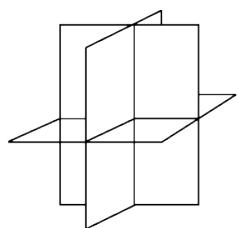
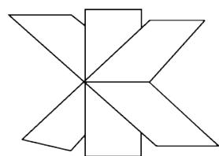
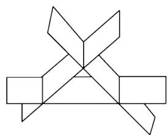
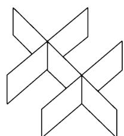

# 2002年全国硕士研究生招生考试试题

# 一、填空题(本题共5小题，每小题3分，满分15分)

(1) $\int_{\mathrm{e}}^{+\infty} \frac{\mathrm{d}x}{x \ln^2 x} = \underline{\quad}$ .   
(2) 已知函数 $y = y(x)$ 由方程 $e^{y} + 6xy + x^{2} - 1 = 0$ 确定, 则 $y''(0) =$ ______.  
(3) 微分方程 $y y^{\prime \prime} + (y^{\prime})^{2} = 0$ 满足初始条件 $y \Big|_{x=0} = 1, y^{\prime} \Big|_{x=0} = \frac{1}{2}$ 的特解是  
(4) 已知实二次型 $f(x_{1}, x_{2}, x_{3}) = a\left(x_{1}^{2} + x_{2}^{2} + x_{3}^{2}\right) + 4x_{1}x_{2} + 4x_{1}x_{3} + 4x_{2}x_{3}$ 经正交变换 $\mathbf{x} = \mathbf{P}\mathbf{y}$ 可化成标准形 $f = 6y_{1}^{2}$ , 则 $a =$   
(5) 设随机变量 $X$ 服从正态分布 $N(\mu, \sigma^2)(\sigma > 0)$ , 且二次方程 $y^2 + 4y + X = 0$ 无实根的概率为 $\frac{1}{2}$ , 则 $\mu = \_$ .

# 二、选择题(本题共5小题，每小题3分，满分15分)

（1）考虑二元函数 $f(x,y)$ 的下面4条性质：

$f(x,y)$ $f(x,y)$ $f(x,y)$ $x_0,y_0$ $x_0,y_0$ $x_0,y_0$   
$③ f ( x , y )$ 在点 $(x_0,y_0)$ 处可微； $④ f ( x , y )$ 在点 $(x_0,y_0)$ 处的两个偏导数存在.

若用“ $P \Rightarrow Q$ ”表示可由性质 $P$ 推出性质 $Q$ , 则有( )

(A) $② \Rightarrow ③ \Rightarrow ①$

(B) $③ \Rightarrow ② \Rightarrow ①$

(C) $③ \Rightarrow ④ \Rightarrow ①$

(D) $③ \Rightarrow ① \Rightarrow ④$

(2) 设 $u_{n} \neq 0 (n = 1, 2, 3, \dots)$ , 且 $\lim_{n \to \infty} \frac{n}{u_{n}} = 1$ , 则级数 $\sum_{n=1}^{\infty} (-1)^{n+1} \left(\frac{1}{u_{n}} + \frac{1}{u_{n+1}}\right)$

（A）发散.

（B）绝对收敛.

（C）条件收敛

(D) 收敛性根据所给条件不能判定.

(3) 设函数 $y = f(x)$ 在 $(0, +\infty)$ 内有界且可导，则（ ）

(A) 当 $\lim_{x \to +\infty} f(x) = 0$ 时, 必有 $\lim_{x \to +\infty} f'(x) = 0$ .  
(B) 当 $\lim_{x \to +\infty} f'(x)$ 存在时, 必有 $\lim_{x \to +\infty} f'(x) = 0$ .  
(C) 当 $\lim_{x \to 0^{+}} f(x) = 0$ 时, 必有 $\lim_{x \to 0^{+}} f'(x) = 0$ .  
(D) 当 $\lim_{x \to 0^{+}} f'(x)$ 存在时, 必有 $\lim_{x \to 0^{+}} f'(x) = 0$ .

(4) 设有三张不同平面的方程 $a_{i1}x + a_{i2}y + a_{i3}z = b_i, i = 1,2,3$ , 它们所组成的线性方程组的系数矩阵与增广矩阵的秩都为 2 , 则这三张平面可能的位置关系为 ( )

  
(A)

  
(B)

  
(C)

  
(D)

(5) 设 $X_{1}$ 和 $X_{2}$ 是任意两个相互独立的连续型随机变量, 它们的概率密度分别为 $f_{1}(x)$ 和 $f_{2}(x)$ , 分布函数分别为 $F_{1}(x)$ 和 $F_{2}(x)$ , 则( )

$(\mathrm{A})f_{1}(x) + f_{2}(x)$ 必为某一随机变量的概率密度  
(B) $f_{1}(x)f_{2}(x)$ 必为某一随机变量的概率密度.   
$(\mathrm{C})F_{1}(x) + F_{2}(x)$ 必为某一随机变量的分布函数  
$(\mathrm{D})F_{1}(x)F_{2}(x)$ 必为某一随机变量的分布函数

# 三、(本题满分6分)

设函数 $f(x)$ 在 $x = 0$ 的某邻域内具有一阶连续导数，且 $f(0) \neq 0, f'(0) \neq 0$ ，若 $a f(h) + b f(2h) - f(0)$ 在 $h \to 0$ 时是比 $h$ 高阶的无穷小，试确定 $a, b$ 的值.

# 四、(本题满分7分)

已知两曲线 $y = f(x)$ 与 $y = \int_{0}^{\arctan x} \mathrm{e}^{-t^{2}} \, \mathrm{d}t$ 在点 $(0,0)$ 处的切线相同，写出此切线方程，并求极限 $\lim_{n\to \infty}nf\left(\frac{2}{n}\right)$ .

# 五、(本题满分7分)

计算二重积分 $\iint_{D} \mathrm{e}^{\max \left\{x^{2}, y^{2}\right\}} \mathrm{d} x \mathrm{~d} y$ ，其中 $D = \{(x, y) \mid 0 \leqslant x \leqslant 1, 0 \leqslant y \leqslant 1\}$ .

# 六、(本题满分8分)

设函数 $f(x)$ 在 $(- \infty, + \infty)$ 内具有一阶连续导数， $L$ 是上半平面 $(y > 0)$ 内的有向分段光滑曲线，其起点为 $(a, b)$ ，终点为 $(c, d)$ . 记

$$
I = \int_ {L} \frac {1}{y} [ 1 + y ^ {2} f (x y) ] d x + \frac {x}{y ^ {2}} [ y ^ {2} f (x y) - 1 ] d y.
$$

(1) 证明曲线积分 $I$ 与路径 $L$ 无关;  
(2) 当 $ab = cd$ 时, 求 $I$ 的值.

# 七、(本题满分7分)

(1) 验证函数 $y(x) = 1 + \frac{x^3}{3!} + \frac{x^6}{6!} + \frac{x^9}{9!} + \dots + \frac{x^{3n}}{(3n)!} + \dots (-\infty < x < +\infty)$ 满足微分方程 $y'' + y' + y = e^x$ ;  
(2) 利用 (1) 的结果求幂级数 $\sum_{n=0}^{\infty} \frac{x^{3n}}{(3n)!}$ 的和函数.

# 八、(本题满分7分)

设有一小山,取它的底面所在的平面为 $xOy$ 坐标面,其底部所占的区域为 $D = \{(x,y)\mid x^2 +y^2 -xy$ $\leqslant 75\}$ ,小山的高度函数为 $h(x,y) = 75 - x^{2} - y^{2} + xy.$

(1) 设 $M(x_0, y_0)$ 为区域 $D$ 上一点，问 $h(x, y)$ 在该点沿平面上什么方向的方向导数最大？若记此方向导数的最大值为 $g(x_0, y_0)$ ，试写出 $g(x_0, y_0)$ 的表达式.

(2) 现欲利用此小山开展攀岩活动, 为此需要在山脚寻找一上山坡度最大的点作为攀登的起点. 也就是说, 要在 $D$ 的边界线 $x^{2} + y^{2} - xy = 75$ 上找出使 (1) 中的 $g(x, y)$ 达到最大值的点. 试确定攀登起点的位置.

# 九、(本题满分6分)

已知4阶方阵 $A = (\alpha_{1},\alpha_{2},\alpha_{3},\alpha_{4})$ ， $\alpha_{1},\alpha_{2},\alpha_{3},\alpha_{4}$ 均为4维列向量，其中 $\alpha_{2},\alpha_{3},\alpha_{4}$ 线性无关， $\pmb{\alpha}_{1} = 2\pmb{\alpha}_{2} - \pmb{\alpha}_{3}$ .如果 $\pmb {\beta} = \pmb {\alpha}_1 + \pmb {\alpha}_2 + \pmb {\alpha}_3 + \pmb {\alpha}_4$ ，求线性方程组 $Ax = \beta$ 的通解.

# 十、(本题满分8分)

设 $A, B$ 为同阶方阵，

（1）如果 $A, B$ 相似，试证 $A, B$ 的特征多项式相等  
(2) 举一个 2 阶方阵的例子说明 (1) 的逆命题不成立.  
(3) 当 $A, B$ 均为实对称矩阵时, 试证 (1) 的逆命题成立.

# 十一、(本题满分7分)

设随机变量 $X$ 的概率密度为

$$
f (x) = \left\{ \begin{array}{l l} { \frac {1}{2} \cos \frac {x}{2},} & {0 \leqslant x \leqslant \pi ,} \\ {0,} & {\text {其 他},} \end{array} \right.
$$

对 $X$ 独立地重复观察4次，用 $Y$ 表示观察值大于 $\frac{\pi}{3}$ 的次数，求 $Y^2$ 的数学期望

# 十二、(本题满分7分)

设总体 $X$ 的概率分布为

<table><tr><td>X</td><td>0</td><td>1</td><td>2</td><td>3</td></tr><tr><td>P</td><td>θ²</td><td>2θ(1 - θ)</td><td>θ²</td><td>1 - 2θ</td></tr></table>

其中 $\theta \left(0 < \theta < \frac{1}{2}\right)$ 是未知参数, 利用总体 $X$ 的如下样本值

$$
3, 1, 3, 0, 3, 1, 2, 3,
$$

求 $\theta$ 的矩估计值和最大似然估计值