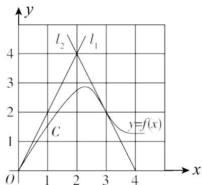

# 2005年全国硕士研究生招生考试试题

# 一、填空题(本题共6小题，每小题4分，满分24分)

(1) 曲线 $y = \frac{x^2}{2x + 1}$ 的斜渐近线方程为  
(2) 微分方程 $xy' + 2y = x \ln x$ 满足 $y(1) = -\frac{1}{9}$ 的解为  
(3) 设函数 $u(x, y, z) = 1 + \frac{x^2}{6} + \frac{y^2}{12} + \frac{z^2}{18}$ , 单位向量 $\boldsymbol{n} = \frac{1}{\sqrt{3}} (1, 1, 1)$ , 则 $\left.\frac{\partial u}{\partial \boldsymbol{n}}\right|_{(1, 2, 3)} =$ ______.  
(4) 设 $\Omega$ 是由锥面 $z = \sqrt{x^2 + y^2}$ 与半球面 $z = \sqrt{R^2 - x^2 - y^2}$ 围成的空间区域, $\Sigma$ 是 $\Omega$ 的整个边界的外侧, 则 $\iint_{\Sigma} x \mathrm{~d}y \mathrm{~d}z + y \mathrm{~d}z \mathrm{~d}x + z \mathrm{~d}x \mathrm{~d}y = \underline{\quad}$ .  
(5) 设 $\alpha_{1}, \alpha_{2}, \alpha_{3}$ 均为 3 维列向量, 记矩阵

$$
\boldsymbol {A} = \left(\boldsymbol {\alpha} _ {1}, \boldsymbol {\alpha} _ {2}, \boldsymbol {\alpha} _ {3}\right), \boldsymbol {B} = \left(\boldsymbol {\alpha} _ {1} + \boldsymbol {\alpha} _ {2} + \boldsymbol {\alpha} _ {3}, \boldsymbol {\alpha} _ {1} + 2 \boldsymbol {\alpha} _ {2} + 4 \boldsymbol {\alpha} _ {3}, \boldsymbol {\alpha} _ {1} + 3 \boldsymbol {\alpha} _ {2} + 9 \boldsymbol {\alpha} _ {3}\right).
$$

如果 $|\mathbf{A}| = 1$ ，那么 $|\mathbf{B}| =$

(6) 从数 $1,2,3,4$ 中任取一个数，记为 $X$ ，再从 $1,\dots ,X$ 中任取一个数，记为 $Y$ ，则 $P\{Y = 2\} =$

# 二、选择题(本题共8小题，每小题4分，满分32分)

(7) 设函数 $f(x) = \lim_{n \to \infty} \sqrt[n]{1 + |x|^{3n}}$ ，则 $f(x)$ 在 $(- \infty, + \infty)$ 内（ ）

(A) 处处可导.

(B) 恰有一个不可导点.

(C) 恰有两个不可导点.

(D) 至少有三个不可导点.

(8) 设 $F(x)$ 是连续函数 $f(x)$ 的一个原函数, “ $M \Leftrightarrow N$ ” 表示“ $M$ 的充分必要条件是 $N$ ”, 则必有 ( )

(A) $F(x)$ 是偶函数 $\Leftrightarrow f(x)$ 是奇函数  
(B) $F(x)$ 是奇函数 $\Leftrightarrow f(x)$ 是偶函数  
(C) $F(x)$ 是周期函数 $\Leftrightarrow f(x)$ 是周期函数  
(D) $F(x)$ 是单调函数 $\Leftrightarrow f(x)$ 是单调函数

(9) 设函数 $u(x, y) = \varphi(x + y) + \varphi(x - y) + \int_{x - y}^{x + y} \psi(t) \, \mathrm{d}t$ , 其中函数 $\varphi$ 具有二阶导数, $\psi$ 具有一阶导数, 则必有 ( )

(A) $\frac{\partial^2 u}{\partial x^2} = -\frac{\partial^2 u}{\partial y^2}$ .

(B) $\frac{\partial^2 u}{\partial x^2} = \frac{\partial^2 u}{\partial y^2}$ .

(C) $\frac{\partial^2 u}{\partial x \partial y} = \frac{\partial^2 u}{\partial y^2}$ .

(D) $\frac{\partial^2 u}{\partial x \partial y} = \frac{\partial^2 u}{\partial x^2}$ .

(10) 设有三元方程 $xy - z\ln y + \mathrm{e}^{xz} = 1$ ，根据隐函数存在定理，存在点 $(0,1,1)$ 的一个邻域，在此邻域内该方程（ ）

(A) 只能确定一个具有连续偏导数的隐函数 $z = z(x, y)$ .  
（B）可确定两个具有连续偏导数的隐函数 $y = y(x,z)$ 和 $z = z(x,y)$ .  
(C) 可确定两个具有连续偏导数的隐函数 $x = x(y, z)$ 和 $z = z(x, y)$ .  
(D) 可确定两个具有连续偏导数的隐函数 $x = x(y, z)$ 和 $y = y(x, z)$ .

(11) 设 $\lambda_{1}, \lambda_{2}$ 是矩阵 $\mathbf{A}$ 的两个不同的特征值, 对应的特征向量分别为 $\alpha_{1}, \alpha_{2}$ , 则 $\alpha_{1}, A\left(\alpha_{1} + \alpha_{2}\right)$ 线性无关的充分必要条件是 ( )

$(\mathrm{A})\lambda_{1}\neq 0.$

(B) $\lambda_{2} \neq 0$ .

$\left(\mathrm{C}\right)\lambda_{1} = 0.$

$\left(\mathrm{D}\right)\lambda_{2} = 0.$

(12) 设 $\mathbf{A}$ 为 $n (n \geqslant 2)$ 阶可逆矩阵, 交换 $\mathbf{A}$ 的第 1 行与第 2 行得矩阵 $\mathbf{B}, \mathbf{A}^{*}, \mathbf{B}^{*}$ 分别为 $\mathbf{A}, \mathbf{B}$ 的伴随矩阵, 则( )

(A) 交换 $A^{*}$ 的第1列与第2列得 $\pmb{B}^{*}$   
(B) 交换 $A^{*}$ 的第1行与第2行得 $\pmb{B}^{*}$   
(C) 交换 $A^{*}$ 的第1列与第2列得 $-B^{*}$ .  
(D) 交换 $A^{*}$ 的第1行与第2行得 $-B^{*}$ .

(13) 设二维随机变量 $(X, Y)$ 的概率分布为

<table><tr><td>X Y</td><td>0</td><td>1</td></tr><tr><td>0</td><td>0.4</td><td>a</td></tr><tr><td>1</td><td>b</td><td>0.1</td></tr></table>

已知随机事件 $\{X = 0\}$ 与 $\{X + Y = 1\}$ 相互独立, 则( )

(A) $a = 0.2, b = 0.3$ .

(B) $a = 0.4, b = 0.1$ .

(C) $a = 0.3, b = 0.2$ .

(D) $a = 0.1, b = 0.4$ .

(14) 设 $X_{1}, X_{2}, \dots, X_{n} (n \geqslant 2)$ 为来自总体 $N(0,1)$ 的简单随机样本, $\overline{X}$ 为样本均值, $S^{2}$ 为样本方差, 则( )

(A) $n\overline{X} \sim N(0,1)$ .

(B) $nS^2 \sim \chi^2(n)$ .

(C) $\frac{(n - 1)\overline{X}}{S} \sim t(n - 1)$ .

$\frac{(n - 1)X_1^2}{\sum_{i = 2}^{n}X_i^2}\sim F(1,n - 1).$

# 三、解答题(本题共9小题，满分94分.解答应写出文字说明、证明过程或演算步骤)

(15) (本题满分 11 分)

设 $D = \{(x,y) \mid x^2 + y^2 \leqslant \sqrt{2}, x \geqslant 0, y \geqslant 0\}$ , $[1 + x^2 + y^2]$ 表示不超过 $1 + x^2 + y^2$ 的最大整数，计算二重积分 $\iint_{D} xy[1 + x^2 + y^2] \, \mathrm{d}x \, \mathrm{d}y$ .

(16) (本题满分 12 分)

求幂级数 $\sum_{n=1}^{\infty} (-1)^{n-1} \left[1 + \frac{1}{n(2n-1)}\right] x^{2n}$ 的收敛区间与和函数 $f(x)$ .

(17) (本题满分 11 分)

如图，曲线 $C$ 的方程为 $y = f(x)$ ，点(3,2)是它的一个拐点，直线 $l_{1}$ 与 $l_{2}$ 分别是曲线 $C$ 在点(0,0）与(3,2）处的切线，其交点为(2,4).设函数 $f(x)$ 具有三阶连续导数，计算定积分

$$
\int_ {0} ^ {3} \left(x ^ {2} + x\right) f ^ {\prime \prime \prime} (x) d x.
$$

(18) (本题满分 12 分)

已知函数 $f(x)$ 在 $[0,1]$ 上连续，在 $(0,1)$ 内可导，且 $f(0) = 0$ ， $f(1) = 1$ 。证明：

（I）存在 $\xi \in (0,1)$ ，使得 $f(\xi) = 1 - \xi$   
（Ⅱ）存在两个不同的点 $\eta, \zeta \in (0,1)$ ，使得 $f'(\eta)f'(\zeta) = 1$

(19) (本题满分 12 分)

设函数 $\varphi(y)$ 具有连续导数，在围绕原点的任意分段光滑简单闭曲线 $L$ 上，曲线积分 $\oint_{L} \frac{\varphi(y) \, \mathrm{d}x + 2xy \, \mathrm{d}y}{2x^2 + y^4}$ 的值恒为同一常数。

（I）证明：对右半平面 $x > 0$ 内的任意分段光滑简单闭曲线 $C$ ，有

$$
\oint_ {C} \frac {\varphi (y) \mathrm {d} x + 2 x y \mathrm {d} y}{2 x ^ {2} + y ^ {4}} = 0;
$$

（Ⅱ）求函数 $\varphi (y)$ 的表达式

(20) (本题满分 9 分)

已知二次型 $f(x_{1},x_{2},x_{3}) = (1 - a)x_{1}^{2} + (1 - a)x_{2}^{2} + 2x_{3}^{2} + 2(1 + a)x_{1}x_{2}$ 的秩为2.

（I）求 $a$ 的值；  
（Ⅱ）求正交变换 $x = Qy$ ，把 $f(x_{1},x_{2},x_{3})$ 化成标准形；  
（Ⅲ）求方程 $f(x_{1},x_{2},x_{3}) = 0$ 的解

(21) (本题满分 9 分)

已知3阶矩阵 $\mathbf{A}$ 的第一行是 $(a,b,c),a,b,c$ 不全为零，矩阵 $\pmb {B} = \begin{pmatrix} 1 & 2 & 3\\ 2 & 4 & 6\\ 3 & 6 & k \end{pmatrix} (k$ 为常数），且 $\mathbf{AB} = \mathbf{O}$ ，求线性方程组 $Ax = 0$ 的通解.

(22) (本题满分 9 分)

设二维随机变量 $(X,Y)$ 的概率密度为 $f(x,y) = \left\{ \begin{array}{ll}1, & 0 < x < 1, 0 < y < 2x, \\ 0, & \text{其他.} \end{array} \right.$

求：（I） $(X,Y)$ 的边缘概率密度 $f_{X}(x),f_{Y}(y)$

(II) $Z = 2X - Y$ 的概率密度 $f_{Z}(z)$ .

(23) (本题满分9分)

设 $X_{1}, X_{2}, \dots, X_{n} (n > 2)$ 为来自总体 $N(0,1)$ 的简单随机样本， $\overline{X}$ 为样本均值，记 $Y_{i} = X_{i} - \overline{X}$ ， $i = 1,2,\dots,n$ 。

求：(I) $Y_{i}$ 的方差 $D(Y_{i}), i = 1,2,\dots,n$

（Ⅱ） $Y_{1}$ 与 $Y_{n}$ 的协方差 $\operatorname {Cov}(Y_1,Y_n)$