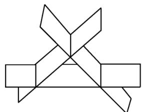

# 2019年全国硕士研究生招生考试试题

# 一、选择题(本题共8小题，每小题4分，共32分.在每小题给出的四个选项中，只有一项符合题目要求，把所选项前的字母填在题后的括号内.)

(1) 当 $x \to 0$ 时, 若 $x - \tan x$ 与 $x^k$ 是同阶无穷小, 则 $k = (\quad)$

(A)1.

(B)2.

(C)3.

(D)4.

(2) 设函数 $f(x) = \begin{cases} x & |x|, \\ x \ln x, \end{cases} \quad x \leqslant 0$ , 则 $x = 0$ 是 $f(x)$ 的（ ）

(A) 可导点, 极值点.

(B) 不可导点, 极值点.

(C) 可导点, 非极值点.

(D) 不可导点, 非极值点.

(3) 设 $\{u_{n}\}$ 是单调增加的有界数列, 则下列级数中收敛的是 ( )

(A) $\sum_{n=1}^{\infty} \frac{u_n}{n}$ .

(B) $\sum_{n=1}^{\infty}(-1)^{n}\frac{1}{u_{n}}$ .

(C) $\sum_{n=1}^{\infty}\left(1-\frac{u_{n}}{u_{n+1}}\right)$ .

(D) $\sum_{n=1}^{\infty}\left(u_{n+1}^{2}-u_{n}^{2}\right)$ .

(4) 设函数 $Q(x, y) = \frac{x}{y^2}$ . 如果对上半平面 $(y > 0)$ 内的任意有向光滑封闭曲线 $C$ 都有 $\oint_{C} P(x, y) \mathrm{d}x + Q(x, y) \mathrm{d}y = 0$ , 那么函数 $P(x, y)$ 可取为（）

(A) $y - \frac{x^2}{y^3}$ .

(B) $\frac{1}{y} -\frac{x^2}{y^3}.$

(C) $\frac{1}{x} - \frac{1}{y}$ .

(D) $x - \frac{1}{y}$ .

(5) 设 $A$ 是 3 阶实对称矩阵, $E$ 是 3 阶单位矩阵. 若 $A^2 + A = 2E$ , 且 $|A| = 4$ , 则二次型 $\boldsymbol{x}^{\mathrm{T}} \boldsymbol{A} \boldsymbol{x}$ 的规范形为 ( )

(A) $y_1^2 + y_2^2 + y_3^2$ .

(B) $y_1^2 + y_2^2 - y_3^2$ .

(C) $y_1^2 - y_2^2 - y_3^2$ .

(D) $-y_{1}^{2} - y_{2}^{2} - y_{3}^{2}$ .

(6) 如图所示, 有 3 张平面两两相交, 交线相互平行, 它们的方程

$$
a _ {i 1} x + a _ {i 2} y + a _ {i 3} z = d _ {i} (i = 1, 2, 3)
$$

组成的线性方程组的系数矩阵和增广矩阵分别记为 $A, \overline{A}$ , 则( )

(A) $r(\mathbf{A}) = 2, r(\overline{\mathbf{A}}) = 3.$   
(B) $r(\mathbf{A}) = 2, r(\overline{\mathbf{A}}) = 2.$   
(C) $r(\mathbf{A}) = 1, r(\overline{\mathbf{A}}) = 2.$   
$(\mathrm{D})r(\mathbf{A}) = 1,r(\overline{\mathbf{A}}) = 1.$

(7) 设 $A, B$ 为随机事件, 则 $P(A) = P(B)$ 的充分必要条件是( )

(A) $P(A \cup B) = P(A) + P(B)$ .

(B) $P(AB) = P(A)P(B)$ .

(C) $P(A\overline{B}) = P(B\overline{A}).$

(D) $P(AB) = P(\overline{A}\overline{B})$

(8) 设随机变量 $X$ 与 $Y$ 相互独立, 且都服从正态分布 $N(\mu, \sigma^2)$ , 则 $P\{|X - Y| < 1\}$ ( )

(A) 与 $\mu$ 无关, 而与 $\sigma^2$ 有关.

(B) 与 $\mu$ 有关, 而与 $\sigma^2$ 无关.

(C) 与 $\mu, \sigma^{2}$ 都有关.

(D) 与 $\mu, \sigma^2$ 都无关.

# 二、填空题(本题共6小题，每小题4分，共24分，把答案填在题中横线上.)

(9) 设函数 $f(u)$ 可导， $z = f(\sin y - \sin x) + xy$ ，则 $\frac{1}{\cos x} \cdot \frac{\partial z}{\partial x} + \frac{1}{\cos y} \cdot \frac{\partial z}{\partial y} =$ ______.  
(10) 微分方程 $2yy' - y^2 - 2 = 0$ 满足条件 $y(0) = 1$ 的特解 $y = \_$   
(11) 幂级数 $\sum_{n=0}^{\infty} \frac{(-1)^n}{(2n)!} x^n$ 在 $(0, +\infty)$ 内的和函数 $S(x) = \_$ .  
(12) 设 $\Sigma$ 设为曲面 $x^{2} + y^{2} + 4z^{2} = 4 (z \geqslant 0)$ 的上侧, 则 $\iint_{\Sigma} \sqrt{4 - x^{2} - 4z^{2}} \mathrm{d}x \mathrm{~d}y = \underline{\quad}$ .  
(13) 设 $A = (\pmb{\alpha}_1, \pmb{\alpha}_2, \pmb{\alpha}_3)$ 为 3 阶矩阵. 若 $\pmb{\alpha}_1, \pmb{\alpha}_2$ 线性无关，且 $\pmb{\alpha}_3 = -\pmb{\alpha}_1 + 2\pmb{\alpha}_2$ ，则线性方程组 $Ax = 0$ 的通解为  
(14) 设随机变量 $X$ 的概率密度为 $f(x) = \left\{ \begin{array}{ll} \frac{x}{2}, & 0 < x < 2, \\ 0, & \text{其他}, \end{array} \right.$ $F(x)$ 为 $X$ 的分布函数， $E(X)$ 为 $X$ 的数学期望，则 $P\{F(X) > E(X) - 1\} =$

# 三、解答题（本题共9小题，共94分，解答应写出文字说明、证明过程或演算步骤。）

(15) (本题满分 10 分)

设函数 $y(x)$ 是微分方程 $y' + xy = e^{-\frac{x^2}{2}}$ 满足条件 $y(0) = 0$ 的特解.

(I) 求 $y(x)$ ;   
（Ⅱ）求曲线 $y = y(x)$ 的凹凸区间及拐点

(16) (本题满分 10 分)

设 $a, b$ 为实数，函数 $z = 2 + ax^2 + by^2$ 在点(3,4)处的方向导数中，沿方向 $\boldsymbol{l} = -3\boldsymbol{i} - 4\boldsymbol{j}$ 的方向导数最大，最大值为10.

(I) 求 $a, b$ ;   
（Ⅱ）求曲面 $z = 2 + ax^2 + by^2 (z \geqslant 0)$ 的面积.

(17) (本题满分 10 分)

求曲线 $y = \mathrm{e}^{-x}\sin x (x \geqslant 0)$ 与 $x$ 轴之间图形的面积.

(18) (本题满分 10 分)

设 $a_{n} = \int_{0}^{1}x^{n}\sqrt{1 - x^{2}}\mathrm{d}x(n = 0,1,2,\dots)$

(I) 证明数列 $\{a_{n}\}$ 单调递减, 且 $a_{n} = \frac{n - 1}{n + 2} a_{n - 2}(n = 2,3,\dots)$ ;  
（Ⅱ）求 $\lim_{n\to \infty}\frac{a_n}{a_{n - 1}}.$

(19) (本题满分 10 分)

设 $\Omega$ 是由锥面 $x^{2} + (y - z)^{2} = (1 - z)^{2}(0\leqslant z\leqslant 1)$ 与平面 $z = 0$ 围成的锥体，求 $\varOmega$ 的形心坐标.

(20) (本题满分 11 分)

设向量组 $\pmb{\alpha}_{1} = (1,2,1)^{\mathrm{T}},\pmb{\alpha}_{2} = (1,3,2)^{\mathrm{T}},\pmb{\alpha}_{3} = (1,a,3)^{\mathrm{T}}$ 为 $\mathbf{R}^3$ 的一个基， $\pmb {\beta} = (1,1,1)^{\mathrm{T}}$ 在这个基下的坐标为 $(b,c,1)^{\mathrm{T}}$

(I) 求 $a, b, c$ ;   
（Ⅱ）证明 $\alpha_{2},\alpha_{3},\beta$ 为 $\mathbf{R}^3$ 的一个基，并求 $\alpha_{2},\alpha_{3},\beta$ 到 $\alpha_{1},\alpha_{2},\alpha_{3}$ 的过渡矩阵

(21) (本题满分 11 分)

已知矩阵 $\mathbf{A} = \begin{pmatrix} -2 & -2 & 1 \\ 2 & x & -2 \\ 0 & 0 & -2 \end{pmatrix}$ 与 $\mathbf{B} = \begin{pmatrix} 2 & 1 & 0 \\ 0 & -1 & 0 \\ 0 & 0 & y \end{pmatrix}$ 相似.

(I) 求 $x, y$ ;   
（Ⅱ）求可逆矩阵 $\pmb{P}$ 使得 $P^{-1}AP = B$

(22) (本题满分 11 分)

设随机变量 $X$ 与 $Y$ 相互独立， $X$ 服从参数为1的指数分布， $Y$ 的概率分布为 $P\{Y = -1\} = p$ ， $P\{Y = 1\} = 1 - p (0 < p < 1)$ 。令 $Z = XY$ 。

（I）求 $Z$ 的概率密度；  
(II) $p$ 为何值时, $X$ 与 $Z$ 不相关;  
(III) $X$ 与 $Z$ 是否相互独立？

(23) (本题满分 11 分)

设总体 $X$ 的概率密度为

$$
f (x; \sigma^ {2}) = \left\{ \begin{array}{l l} \frac {A}{\sigma} \mathrm {e} ^ {- \frac {(x - \mu) ^ {2}}{2 \sigma^ {2}}}, & x \geqslant \mu , \\ 0, & x <   \mu , \end{array} \right.
$$

其中 $\mu$ 是已知参数， $\sigma > 0$ 是未知参数， $A$ 是常数. $X_{1}, X_{2}, \dots, X_{n}$ 是来自总体 $X$ 的简单随机样本.

(I) 求 $A$ ;   
（Ⅱ）求 $\sigma^2$ 的最大似然估计量