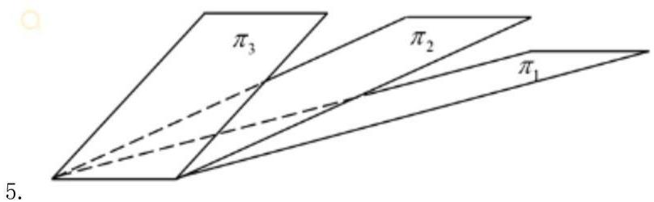

# 2024年全国硕士研究生入学统一考试数学（一）试题

考试时间：180分钟，满分：150分

一、选择题： $1 \sim 10$ 小题，每小题5分，共50分，下列每题给出的四个选项中，只有一个选项符合题目要求，请将所选项前的字母填在答题纸指定位置上。

已知函数 $f(x) = \int_0^x\mathrm{e}^{\cos t}\mathrm{d}t$ ， $g(x) = \int_0^{\sin x}\mathrm{e}^{t^2}\mathrm{d}t$ ，则1.

A. $f(x)$ 为奇函数, $g_{(x)}$ 为偶函数  
B. $f(x)$ 为偶函数, $g_{(x)}$ 为奇函数  
C. $\mathrm{f}\left( \mathrm{x}\right)$ 与 ${\mathrm{g}}_{\left( \mathrm{x}\right) }$ 均为奇函数  
D. $f(x)$ 与 $g_{(x)}$ 均为周期函数

设 $P = P(x,y,z),Q = Q(x,y,z)$ 均为连续函数，

$\Sigma$ 为曲面 $z = \sqrt{1 - x^2 - y^2}$ （ $x \geqslant 0, y \geqslant 0$ ）的上侧，则 $\iint_{\Sigma} P \mathrm{d}y \mathrm{~d}z + Q \mathrm{~d}z \mathrm{~d}x =$

$\iint \limits_{\Sigma}\left(\frac{x}{z} P + \frac{y}{z} Q\right)\mathrm{d}x\mathrm{d}y$ A.   
B. $\iint_{\Sigma}\left(-\frac{x}{z} P + \frac{y}{z} Q\right)\mathrm{d}x\mathrm{d}y$   
$\iint \limits_{\Sigma}\left(\frac{x}{z} P - \frac{y}{z} Q\right)\mathrm{d}x\mathrm{d}y$ C.   
D. $\iint_{\Sigma}\left(-\frac{x}{z} P - \frac{y}{z} Q\right)\mathrm{d}x\mathrm{d}y$

已知幂函数 $\sum_{n=0}^{\infty} a_n x^n$ 的和函数为 $\ln (2 + x)$ ，则 $\sum_{n=0}^{\infty} n a_{2n} = 3$ .

A. $-\frac{1}{6}$   
B. $-\frac{1}{3}$   
C. $\frac{1}{6}$   
D. $\frac{1}{3}$

设函数 $f(x)$ 在区间 $(-1,1)$ 内有定义， $\lim_{x\to 0}f(x) = 0$ ，则

当 $\lim_{x\to 0}\frac{f(x)}{x} = m$ 时， $f^{\prime}(0) = m$ A.  
当 $f^{\prime}(0) = m$ 时， $\lim_{x\to 0}\frac{f(x)}{x} = m.$ B.  
当 $\lim_{x\to 0}f'(x) = m$ 时， $f^{\prime}(0) = m$ C.  
当 $f^{\prime}(0) = m$ 时， $\lim_{x\to 0}f'(x) = m$ D.

在空间直角坐标系 $O - xyz$ 中，三张平面 $\pi_{i}:a_{i}x + b_{i}y + c_{i}z = d_{i}$

$(i = 1,2,3)$ 位置关系如图所示，记 $\pmb{\alpha}_{i} = (a_{i},b_{i},c_{i}),\pmb{\beta}_{i} = (a_{i},b_{i},c_{i},d_{i})$

若 $r\left( \begin{array}{l}a_{1}\\ a_{2}\\ a_{3} \end{array} \right) = m,r\left( \begin{array}{l}\beta_{1}\\ \beta_{2}\\ \beta_{3} \end{array} \right) = n$ ，则

A. $m = 1, n = 2$

B. $m = n = 2$   
C. $\mathrm{m} = 2,\mathrm{n} = 3$   
D. $\mathrm{m} = \mathrm{n} = 3$

设向量 $\alpha_{1} = \begin{pmatrix} a \\ 1 \\ -1 \\ 1 \end{pmatrix}$ , $\alpha_{2} = \begin{pmatrix} 1 \\ 1 \\ b \\ a \end{pmatrix}$ , $\alpha_{3} = \begin{pmatrix} 1 \\ a \\ -1 \\ 1 \end{pmatrix}$ , 若 $\alpha_{1}, \alpha_{2}, \alpha_{3}$ 线性相关, 且其中任意两个

向量均线性无关，则

6.

A. $a = 1, b \neq -1$   
B. $a = 1, b = -1$   
C. $a \neq -2, b = 2$   
D. $a = -2, b = 2$

3阶矩阵A的秩为2，非零向量 $\alpha$ 满足 $A\alpha = 0$ ，任意向量 $\beta$ ，使得 $\beta^T\alpha = 0$ ，且 $A\beta = \beta$ 则下列结论正确的是

7.

A. $A^{3}$ 的迹为 2  
B. $A^{3}$ 的迹为 5  
C. $A^{5}$ 的迹为 7  
D. $A^{5}$ 的迹为 9

8. 设随机变量 $\mathrm{X}$ 与 $\mathrm{Y}$ 独立， $\mathrm{X}$ 服从 $\mathrm{N}(0,2)$ 的正态分布， $\mathrm{Y}$ 服从 $\mathrm{N}(-2,2)$ 的正态分布，若 $\mathrm{P}\{2\mathrm{X} + \mathrm{Y} < \mathrm{a}\} = \mathrm{P}\{\mathrm{X} > \mathrm{Y}\}$ ，则 $\mathrm{a} =$

A. -2-√10   
B. $-2 + \sqrt{10}$   
C. $-2 - \sqrt{6}$

D. $-2 + \sqrt{6}$

设随机变量X的概率密度为f(x)= $\begin{array}{l}2(1 - x),\\ 0, \end{array}$ $0 <   x <   1$ 其他 在 $\mathbf{X} = \mathbf{x}$ 的条件下，Y在区9.间（x，1）上服从均匀分布，则 $\operatorname {cov}(\mathrm{X},\mathrm{Y}) =$

A. $-\frac{1}{36}$   
B. $-\frac{1}{72}$   
C. $\frac{1}{72}$   
D. $\frac{1}{36}$

10. 设随机变量 $X$ ， $Y$ 相互独立，且均服从参数为 $\lambda$ 的指数分布，令 $Z = |X - Y|$ ，则下列随机变量与 $Z$ 同分布的是

A. $X + Y$   
B. $\frac{X + Y}{2}$   
C. 2X   
D.X

二、填空题： $11\sim 16$ 小题，每小题5分，共30分，请将答案写在答题纸指定位置上。

11.

若 $\lim_{x\to 0}\frac{\left(1 + ax^2\right)^{\sin x} - 1}{x^3} = 6$ ，则 $a =$

$z = f(u,v)$ 有二阶连续导数， $\mathrm{d}f\big|_{(1,1)} = 3\mathrm{d}u + 4\mathrm{d}v$

$y = f(\cos x,1 + x^2)$ ，则 $\frac{\mathrm{d}^2y}{\mathrm{d}x^2}\bigg|_{x = 0} =$

12.

13.

若函数f（x）-x+1.若f（x）=a+∑αcosx.x∈[0,π].则极限limn²sinα

14.

微分方程 $y' = \frac{1}{(x + y)^2}$ ，满足条件 $y(1) = 0$ 的解为

15.

设实矩阵 $A = \begin{pmatrix} a + 1 & a \\ a & a \end{pmatrix}$ ，若对任意实向量 $\alpha = \begin{pmatrix} x_1 \\ x_2 \end{pmatrix}$ ， $\beta = \begin{pmatrix} y_1 \\ y_2 \end{pmatrix}$ ， $\beta = \begin{pmatrix} y_1 \\ y_2 \end{pmatrix}$

16. 随机试验每次成功的概率为 $\mathrm{P}$ , 现进行三次独立重复实验, 已知至少成功一次的条件下全部成功概率为 $\frac{4}{13}$ , 现 $\mathrm{P} =$

三、解答题: 17-22 小题, 共 70 分。请将解答写在答题纸指定位置上解答应写出文字说明、证明过程或演算步骤。

已知平面区域D={（x，y）|√1-y²≤x≤1,-1≤y≤1}，计算 ∫x dσ.

17.

18. 设 $f(x, y) = x^3 + y^3 - (x + y)^2 + 3$ ，曲面 $z = f(x, y)$ 在 $(1, 1, 1)$ 处的切平面为 $T$ ， $T$ 与三个坐标面所围有界区域在 $xoy$ 面的设影为 $D$

（1）求T的方程  
（2）求 $f(x, y)$ 在 $D$ 上的最大值和最小值

设 $f(x)$ 二阶可导， $f^{\prime}(0) = f^{\prime}(0).|f^{\prime \prime}(x)|\leq 1$ ，证：

1）|f（x）-f(0)(1-x）-f(1)x|≤x（1-x）/2  
2） $\left|\int_0^1 f(x)dx - \frac{f(0) + f(1)}{2}\right|\leq \frac{1}{12}$

19.

20. 已知有向曲线 L 为球面 $x^{2} + y^{2} + z^{2} = 2x$ 与平面 $2x - z - 1 = 0$ 的交线从 $z$ 轴正向往 $z$ 轴负向看去为逆时针方向，计算曲线积分 $\int_{L}(6xyz - yz^{2})dx + 2x^{2}zdy + xyzdz$

已知数列 $\{x_{n}\},\{y_{n}\},\{z_{n}\}$ 满足 $x_0 = -1, y_0 = 0, z_0 = 2$ 且 $\left\{ \begin{array}{l} x_n = -2x_{n-1} + 2z_{n-1} \\ y_n = -2y_{n-1} - 2z_{n-1} \\ z_n = -6x_{n-1} - 3y_{n-1} + 3z_{n-1} \end{array} \right.$ ,

记 $\alpha_{n} = \left\{ \begin{array}{l}x_{n}\\ y_{n}\\ \vdots \end{array} \right\}$ ，写出满足 $\alpha_{n} = A\alpha_{n - 1}$ 的矩阵 $A$ ，并求 $A^n$ 及 $x_{n},y_{n},z_{n}(n = 1,2,\dots)$

21.

22.

设总体 $X - U(0,\theta)$ ， $\theta$ 未知， $X_{1},X_{2}\dots X_{n}$ 为简单随机样本，

$$
X _ {(n)} = \max  \left(X _ {1}, X _ {2} \dots X _ {n}\right), T _ {c} = c X _ {(n)}.
$$

（1）求 $c$ 时，使得 $T_{c}$ 为 $\theta$ 的无偏估计  
（2）记 $h(c) = E(T_c - \theta)^2$ ，求c使得h(c)取最小值