# 一九八七年考研数学试卷三解答

# 一、填空题（本题满分10分，每小题2分）

1. 设 $y = \ln (1 + ax)$ ，其中 $a$ 为非零常数，则 $y' =$ ______， $y'' =$ ______.

解. $y' = \frac{a}{1 + ax}$ , $y'' = -\frac{a^2}{(1 + ax)^2}$ .

2. 曲线 $y = \arctan x$ 在横坐标为 1 点处的切线方程是 ________；法线方程是 ________。

解. 切线方程是 $y = \frac{1}{2} x + \frac{\pi - 2}{4}$ ; 法线方程是 $y = -2x + \frac{\pi + 8}{4}$ .

3. 积分中值定理的条件是 , 结论是

解. $f(x)$ 在闭区间 $[a, b]$ 上连续; 存在 $\xi \in [a, b]$ , 使得 $\int_{a}^{b} f(x) \mathrm{d} x = f(\xi)(b - a)$ .

4. $\lim_{n\to \infty}\left(\frac{n - 2}{n + 1}\right)^n = \underline{\quad}.$

解. 极限等于 $\mathbf{e}^{-3}$ .

5. $\int f'(x) \, \mathrm{d}x = \underline{\quad}$ ; $\int_{a}^{b} f'(2x) \, \mathrm{d}x = \underline{\quad}$ .

解. $f(x) + C;\frac{1}{2} f(2b) - \frac{1}{2} f(2a).$

# 二、(本题满分6分)

求极限 $\lim_{x\to 0}\left(\frac{1}{x} -\frac{1}{\mathrm{e}^x - 1}\right)$

解. 由洛必达法则和等价无穷小量代换, 求得极限等于 $\frac{1}{2}$ .

# 三、(本题满分7分)

设 $\left\{ \begin{array}{l}x = 5(t - \sin t)\\ y = 5(1 - \cos t) \end{array} \right.$ 求 $\frac{\mathrm{dy}}{\mathrm{dx}}$ 和 $\frac{\mathrm{d}^2y}{\mathrm{dx}^2}$

解 $\frac{\mathrm{d}y}{\mathrm{d}x} = \frac{\sin t}{1 - \cos t}; \frac{\mathrm{d}^2y}{\mathrm{d}x^2} = -\frac{1}{5(1 - \cos t)^2}.$

# 四、(本题满分8分)

计算定积分 $\int_0^1 x\arcsin x\mathrm{d}x$

解. 由分部积分法和换元积分法, 求得

$$
\int_ {0} ^ {1} x \arcsin x d x = \frac {\pi}{4} - \frac {1}{2} \int_ {0} ^ {1} \frac {x ^ {2}}{\sqrt {1 - x ^ {2}}} d x = \frac {\pi}{4} - \frac {1}{2} \int_ {0} ^ {\frac {\pi}{2}} \sin^ {2} x d x = \frac {\pi}{8}.
$$

# 五、(本题满分8分)

设 $D$ 是曲线 $y = \sin x + 1$ 与三条直线 $x = 0, x = \pi, y = 0$ 围成的曲边梯形. 求 $D$ 绕 $x$ 轴旋转一周所生成的旋转体的体积 $V$ .

解. $V = \pi \int_{0}^{\pi} (\sin x + 1)^{2} \mathrm{d}x = \frac{\pi}{4} + \frac{3\pi^{2}}{2}$ .

# 六、证明题（本题满分10分，每小题5分）

1. 若 $f(x)$ 在 $(a, b)$ 内可导，且导数 $f'(x)$ 恒大于零，证明 $f(x)$ 在 $(a, b)$ 内单调增加.

解. 任取 $x_{1}, x_{2} \in (a, b)$ , $x_{2} > x_{1}$ , 则由拉格朗日中值定理, 存在 $\xi \in (x_{1}, x_{2}) \subset (a, b)$ ,使得 $f(x_{2}) - f(x_{1}) = f'(\xi)(x_{2} - x_{1}) > 0$ . 从而 $f(x_{2}) > f(x_{1})$ , 即 $f(x)$ 在 $(a, b)$ 内单调增加.

2. 若 $g(x)$ 在 $x = c$ 处二阶导数存在，且 $g'(c) = 0, g''(c) < 0$ ，证明 $g(c)$ 为 $g(x)$ 的一个极大值.

解. 由导数的定义, 我们有

$$
g ^ {\prime \prime} (c) = \lim  _ {x \rightarrow c} \frac {g ^ {\prime} (x) - g ^ {\prime} (c)}{x - c} = \lim  _ {x \rightarrow c} \frac {g ^ {\prime} (x)}{x - c} <   0.
$$

由极限的局部保号性，存在 $c$ 的某个去心邻域，使得 $\frac{g'(x)}{x - c} < 0$ 。则当 $x < c$ 时 $g'(x) > 0$ ，函数单调增加；当 $x > c$ 时， $g'(x) < 0$ 。函数单调减少。因此 $g(c)$ 为 $g(x)$ 的一个极大值。

# 七、(本题满分10分)

计算不定积分 $\int \frac{\mathrm{d}x}{a^2\sin^2x + b^2\cos^2x}$ （其中 $a, b$ 为不全为零的非负数）.

解. 令 $u = \tan x$ ，则原式 $= \int \frac{\mathrm{d}u}{a^2u^2 + b^2}$ . 下面分情形讨论：

(I) 当 $ab \neq 0$ 时, 原式 $= \frac{1}{ab} \arctan \left(\frac{a}{b} x\right) + C$ .  
(II) 当 $a = 0, b \neq 0$ 时，原式 $= \frac{1}{b^2} \tan x + C$ .  
(III) 当 $a \neq 0, b = 0$ 时，原式 $= -\frac{1}{a^2} \cot x + C.$

# 八、计算题（本题满分15分）

1. (本题满分7分)

求微分方程 $x\frac{\mathrm{dy}}{\mathrm{dx}} = x - y$ 满足条件 $y\big|_{x = \sqrt{2}} = 0$ 的解.

解. 通解为 $y = \frac{1}{x}\left(\frac{1}{2} x^2 + C\right)$ , 满足初始条件的特解为 $y = \frac{x}{2} - \frac{1}{x}$ .

2. (本题满分8分)

求微分方程 $y^{\prime \prime} + 2y^{\prime} + y = x\mathrm{e}^{x}$ 的通解

解. 原方程的通解为 $y = (C_{1} + C_{2}x)\mathrm{e}^{-2x} + \frac{1}{4} (x - 1)\mathrm{e}^{x}.$

# 九、选择题（本题满分16分，每小题4分）

1. $f(x) = |x\sin x|\mathrm{e}^{\cos x}, - \infty <  x <   + \infty$ 是…

(A) 有界函数.

(B) 单调函数.

(C) 周期函数.

(D) 偶函数.

解. 应选 (D).

2. 函数 $f(x) = x \sin x$

(A) 当 $x \to \infty$ 时为无穷大.

(B) 当 $x \to \infty$ 时有极限.

(C) 在 $(- \infty, + \infty)$ 内有界.

(D) 在 $(- \infty, + \infty)$ 内无界.

解. 应选 (D).

3. 设 $f(x)$ 在 $x = a$ 处可导，则 $\lim_{x\to 0}\frac{f(a + x) - f(a - x)}{x}$ 等于……（）

(A) $f^{\prime}(a)$

(B) $2f^{\prime}(a)$

(C) 0.

(D) $f^{\prime}(2a)$

解. 应选 (B).

4. 同试卷一第五[2]题

十、(本题满分10分)

在第一象限内，求曲线 $y = -x^{2} + 1$ 上的一点，使该点处切线与所给曲线及两坐标轴围成的面积为最小，并求此最小面积.

解. 设切点的坐标为 $(a, 1 - a^2)$ , 则切线方程为 $y = -2ax + a^2 + 1$ , 所围成的面积

$$
S (a) = \frac {1}{2} \left(a ^ {2} + 1\right) \frac {a ^ {2} + 1}{2 a} - \int_ {0} ^ {1} (- x ^ {2} + 1) d x = \frac {a ^ {3}}{4} + \frac {a}{2} + \frac {1}{4 a} - \frac {2}{3}.
$$

令 $S^{\prime}(a) = 0$ ，得驻点 $a = \frac{\sqrt{3}}{3}$ ．由于 $S''\left(\frac{\sqrt{3}}{3}\right) > 0$ ，故所求点的坐标为 $\left(\frac{\sqrt{3}}{3},\frac{2}{3}\right)$ 面积的最小值为 $\frac{4}{9}\sqrt{3} -\frac{2}{3}$

# 一九八八年考研数学试卷三解答

# 一、填空题（本题满分20分，每小题4分）

1. 若 $f(x) = \left\{ \begin{array}{ll} \mathrm{e}^2 (\sin x + \cos x), & x > 0 \\ 2x + a, & x \leqslant 0 \end{array} \right.$ 是 $(- \infty, + \infty)$ 上的连续函数，则 $a =$ ________.

解. $a = 1$

2. 同试卷一第二[1]题  
3. 同试卷一第二[3]题  
4. $\lim_{x\to +0}\left(\frac{1}{\sqrt{x}}\right)^{\tan x} = \underline{\quad}$

解. 应填 1.

5. $\int_0^4\mathrm{e}^{\sqrt{x}}\mathrm{d}x = \underline{\quad}$

解. 应填 $2(\mathrm{e}^{2} + 1)$ .

# 二、选择题（本题满分20分，每小题4分）

1. $f(x) = \frac{1}{3} x^{3} + \frac{1}{2} x^{2} + 6x + 1$ 的图形在点 (0,1) 处切线与 $x$ 轴交点的坐标是 $\cdots$ （）

(A) $\left(-\frac{1}{6},0\right)$

(B) $(-1,0)$ .

(C) $\left(\frac{1}{6},0\right)$

(D) $(1,0)$ .

解. 应选 (A).

2. 若 $f(x)$ 与 $g(x)$ 在 $(- \infty, + \infty)$ 上皆可导，且 $f(x) < g(x)$ ，则必有……（）

(A) $f(-x) > g(-x)$

(B) $f^{\prime}(x) <   g^{\prime}(x)$

(C) $\lim_{x\to x_0}f(x) <   \lim_{x\to x_0}g(x).$

(D) $\int_0^x f(t)\mathrm{d}t <   \int_0^x g(t)\mathrm{d}t.$

解. 可导必定连续, 从而选 (C).

3. 同试卷一第三[1]题

4. 曲线 $y = \sin^{3 / 2} x$ （ $0 \leqslant x \leqslant \pi$ ）与 $x$ 轴围成的图形绕 $x$ 轴旋转所形成的旋转体体积为……（）

(A) $\frac{4}{3}$ .

(B) $\frac{4}{3}\pi$

(C) $\frac{2}{3}\pi^2$

(D) $\frac{2}{3}\pi$

解. 应选 (B).

5. 同试卷一第三[5]题

# 三、计算题（本题满分15分，每小题5分）

1. 同试卷一第一[2]题  
2. 已知 $y = 1 + x \mathrm{e}^{xy}$ ，求 $y' \big|_{x=0}$ 及 $y'' \big|_{x=0}$ .

解. $y^{\prime}|_{x = 0} = 1, y^{\prime \prime}|_{x = 0} = 2.$

3. 求微分方程 $y' + \frac{1}{x} y = \frac{1}{x(x^2 + 1)}$ 的通解（一般解）.

解. 通解为 $y = \frac{1}{x} (\arctan x + C)$ .

# 四、(本题满分12分)

作函数 $y = \frac{6}{x^2 - 2x + 4}$ 的图形，并填写下表.

<table><tr><td>单调增区间</td><td></td></tr><tr><td>单调减区间</td><td></td></tr><tr><td>极值点</td><td></td></tr><tr><td>极值</td><td></td></tr><tr><td>凹(U)区间</td><td></td></tr><tr><td>凸(∩)区间</td><td></td></tr><tr><td>拐点</td><td></td></tr><tr><td>渐近线</td><td></td></tr></table>

解. 所得数据如下表:

<table><tr><td>单调增区间</td><td>(−∞,1)</td></tr><tr><td>单调减区间</td><td>(1,+∞)</td></tr><tr><td>极值点</td><td>1</td></tr><tr><td>极值</td><td>2</td></tr><tr><td>凹(U)区间</td><td>(−∞,0)及(2,+∞)</td></tr><tr><td>凸(∩)区间</td><td>(0,2)</td></tr><tr><td>拐点</td><td>(0,3/2)及(2,3/2)</td></tr><tr><td>渐近线</td><td>y=0</td></tr></table>

其图形如下：

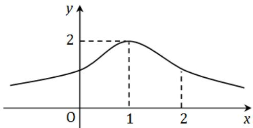

# 五、（本题满分8分）

将长为 $a$ 的铁丝切成两段, 一段围成正方形, 另一段围成圆形. 问这两段铁丝各长为多少时, 正方形与圆形的面积之和为最小?

解. 当圆的周长为 $x = \frac{\pi a}{4 + \pi}$ , 正方形的周长为 $a - x = \frac{4a}{4 + \pi}$ 时, 面积之和最小..

# 六、(本题满分10分)

同试卷一第五题.

# 七、（本题满分6分）

设 $x \geqslant -1$ ，求 $\int_{-1}^{x} (1 - |t|) \, \mathrm{d}t$ .

解. 当 $-1 \leqslant x < 0$ 时, 积分等于 $\frac{1}{2}(1 + x)^2$ . 当 $x \geqslant 0$ 时, 积分等于 $1 - \frac{1}{2}(1 - x)^2$ .

# 八、(本题满分6分)

设 $f(x)$ 在 $(-\infty +\infty)$ 上有连续导数，且 $m\leqslant f(x)\leqslant M$

(I) 求 $\lim_{a\to +0}\frac{1}{4a^2}\int_{-a}^{a}[f(t + a) - f(t - a)]\mathrm{d}t.$   
(II) 证明 $\left|\frac{1}{2a}\int_{-a}^{a}f(t)\mathrm{d}t - f(x)\right| \leqslant M - m(a > 0).$

解. (I) 可以用积分中值定理和微分中值定理. 这里用洛必达法则直接计算:

$$
\begin{array}{l} \text {原 式} = \lim  _ {a \rightarrow + 0} \frac {1}{4 a ^ {2}} \left[ \int_ {0} ^ {2 a} f (u) \mathrm {d} u - \int_ {- 2 a} ^ {0} f (u) \mathrm {d} u \right] \\ = \lim  _ {a \rightarrow + 0} \frac {1}{8 a} [ 2 f (2 a) - 2 f (- 2 a) ] = \lim  _ {a \rightarrow + 0} \frac {1}{4 a} [ f (2 a) - f (- 2 a) ] \\ = \lim  _ {a \rightarrow + 0} \frac {1}{4} \left[ 2 f ^ {\prime} (2 a) + 2 f ^ {\prime} (- 2 a) \right] = f ^ {\prime} (0). \\ \end{array}
$$

(II) 可以分别估计两项. 这里利用积分的绝对值不等式来估计:

$$
\begin{array}{l} \left| \frac {1}{2 a} \int_ {- a} ^ {a} f (t) \mathrm {d} t - f (x) \right| = \left| \frac {1}{2 a} \int_ {- a} ^ {a} [ f (t) - f (x) ] \mathrm {d} t \right| \\ \leqslant \frac {1}{2 a} \int_ {- a} ^ {a} | f (t) - f (x) | d t \leqslant \frac {1}{2 a} \int_ {- a} ^ {a} (M - m) d t = M - m \\ \end{array}
$$

# 一九八九年考研数学试卷三解答

# 一、填空题（本题满分15分，每小题3分）

1. $\lim_{x\to 0}x\cot 2x = \underline{\quad}$

解. 应填 $\frac{1}{2}$ .

2. $\int_0^\pi t\sin t\mathrm{d}t =$

解，应填 $\pi$

3. 曲线 $y = \int_{0}^{x} (t - 1)(t - 2) \, \mathrm{d}t$ 在点 $(0,0)$ 处的切线方程是

解. 应填 $y = 2x$ .

4. 设 $f(x) = x(x + 1)(x + 2)\dots \dots (x + n)$ ，则 $f^{\prime}(0) =$

解. 用导数的定义计算, 得到 $f^{\prime}(0) = n!$ .

5. 同试卷一第一[2]题.

6. 设 $f(x) = \left\{ \begin{array}{ll} a + bx^2, & x \leqslant 0 \\ \frac{\sin bx}{x}, & x > 0 \end{array} \right.$ 在 $x = 0$ 处连续，则常数 $a$ 与 $b$ 应满足的关系是

解. 应填 $a = b$ .

7. 设 $\tan \gamma = x + \gamma$ ，则 $\mathrm{d}\gamma =$

解. 应填 $\cot^2 y \, \mathrm{d}x$ .

# 二、计算题（本题满分20分，每小题4分）

1. 已知 $y = \arcsin e^{-\sqrt{x}}$ ，求 $y'$

解 $\frac{-\mathrm{e}^{-\sqrt{x}}}{2 \sqrt{x(1 - \mathrm{e}^{-2\sqrt{x}})}}.$

2. 求 $\int \frac{\mathrm{d}x}{x\ln^2x}$

解. $-\frac{1}{\ln x} + C.$

3. 求 $\lim_{x\to 0}(2\sin x + \cos x)^{\frac{1}{x}}$

解. $\mathbf{e}^2$

4. 已知 $\left\{ \begin{array}{l} x = \ln (1 + t^2), \\ y = \arctan t, \end{array} \right.$ 求 $\frac{\mathrm{d}y}{\mathrm{d}x}$ 及 $\frac{\mathrm{d}^2y}{\mathrm{d}x^2}$ .

解 $\frac{\mathrm{dy}}{\mathrm{dx}} = \frac{1}{2t},\frac{\mathrm{d}^2y}{\mathrm{dx}^2} = -\frac{1 + t^2}{4t^3}.$

5. 已知 $f(2) = \frac{1}{2}, f'(2) = 0$ 及 $\int_{0}^{2} f(x) \, \mathrm{d}x = 1$ ，求 $\int_{0}^{1} x^2 f''(2x) \, \mathrm{d}x$ .

解. 作换元 $t = 2 x$ , 再由分部积分法, 得到

$$
\begin{array}{l} \int_ {0} ^ {1} x ^ {2} f ^ {\prime \prime} (2 x) d x = \frac {1}{8} \int_ {0} ^ {2} t ^ {2} f ^ {\prime \prime} (t) d t = \frac {1}{8} \left(\left[ t ^ {2} f ^ {\prime} (t) \right] _ {0} ^ {2} - 2 \int_ {0} ^ {2} t f ^ {\prime} (t) d t\right) \\ = \frac {1}{8} \left(\left[ t ^ {2} f ^ {\prime} (t) \right] _ {0} ^ {2} - \left[ 2 t f (t) \right] _ {0} ^ {2} + 2 \int_ {0} ^ {2} f (t) d t\right) = \frac {1}{8} (0 - 2 + 2) = 0. \\ \end{array}
$$

# 三、选择题（本题满分18分，每小题3分）

1. 同试卷一第二[1]题

2. 若 $3a^{2} - 5b < 0$ ，则方程 $x^{5} + 2ax^{3} + 3bx + 4c = 0 \cdots \cdots \cdots \cdots \cdots \cdots \cdots \cdots \cdots \cdots \cdots \cdots \cdots \cdots$ （）

(A) 无实根.

(B)有唯一实根.

(C) 有三个不同实根.

(D) 有五个不同实根.

解. 应选 (B).

3. 曲线 $y = \cos x\left(-\frac{\pi}{2} \leqslant x \leqslant \frac{\pi}{2}\right)$ 与 $x$ 轴所围成的图形, 绕 $x$ 轴旋转一周所成的旋转体的体积为……( )

(A) $\frac{\pi}{2}$ .

(B) $\pi$

(C) $\frac{\pi^2}{2}$ .

(D) $\pi^2$

解. 应选 (C).

4. 设两函数 $f(x)$ 及 $g(x)$ 都在 $x = a$ 处取得极大值, 则函数 $F(x) = f(x)g(x)$ 在 $x = a$ 处……( )

(A) 必取极大值.

(B) 必取极小值.

(C) 不可能取极值.

(D) 是否取极值不能确定.

解. 应选 (D).

5. 微分方程 $y'' - y = \mathrm{e}^x + 1$ 的一个特解应具有形式（式中 $a, b$ 为常数）……（）

(A) $a\mathrm{e}^x +b$

(B) $ax\mathrm{e}^x + b$ .

(C) $a\mathbf{e}^x +bx$

(D) $ax\mathrm{e}^{x} + bx$

解. 应选 (B).

6. 设 $f(x)$ 在 $x = a$ 的某个邻域内有定义, 则 $f(x)$ 在 $x = a$ 可导的一个充分条件是……( )

(A) $\lim_{h\to +\infty}h[f(a + \frac{1}{h}) - f(a)]$ 存在.

(B) $\lim_{h\to 0}\frac{f(a + h) - f(a + h)}{h}$ 存在.

(C) $\lim_{h\to 0}\frac{f(a + h) - f(a - h)}{2h}$ 存在.

(D) $\lim_{h\to 0}\frac{f(a) - f(a - h)}{h}$ 存在.

解. 应选 (D).

# 四、（本题满分6分）

求微分方程 $xy' + (1 - x)y = \mathrm{e}^{2x}(0 < x < +\infty)$ 满足 $y(1) = 0$ 的解.

解. 原方程即 $y' + \frac{1 - x}{x}y = \frac{e^{2x}}{x}$ . $\nu(x) = \exp\left(\int \frac{1 - x}{x} \, \mathrm{d}x\right) = \frac{x}{\mathrm{e}^x}$ ，所以通解为

$$
y = \frac {1}{\nu (x)} \left(\int \frac {\mathrm {e} ^ {2 x}}{x} \nu (x) \mathrm {d} x + C\right) = \frac {\mathrm {e} ^ {x}}{x} \left(\int \frac {\mathrm {e} ^ {2 x}}{x} \frac {x}{\mathrm {e} ^ {x}} \mathrm {d} x + C\right) = \frac {\mathrm {e} ^ {x} (\mathrm {e} ^ {x} + C)}{x}.
$$

代入初始条件，得 $C = -\mathbf{e}$ ，因此特解为 $y = \frac{\mathrm{e}^x(\mathrm{e}^x - \mathrm{e})}{x}$

# 五、(本题满分7分)

同试卷一第五题.

# 六、（本题满分7分）

同试卷一第六题.

# 七、(本题满分11分)

对函数 $y = \frac{x + 1}{x^2}$ ，填写下表：

<table><tr><td>单调减少区间</td><td></td></tr><tr><td>单调增加区间</td><td></td></tr><tr><td>极值点</td><td></td></tr><tr><td>极值</td><td></td></tr><tr><td>凹(∪)区间</td><td></td></tr><tr><td>凸(∩)区间</td><td></td></tr><tr><td>拐点</td><td></td></tr><tr><td>渐近线</td><td></td></tr></table>

解.结果如下表：

<table><tr><td>单调减少区间</td><td>(−∞,−2), (0,+∞)</td></tr><tr><td>单调增加区间</td><td>(−2,0)</td></tr><tr><td>极值点</td><td>−2</td></tr><tr><td>极值</td><td>−1/4</td></tr><tr><td>凹(∪)区间</td><td>(−3,0), (0,+∞)</td></tr><tr><td>凸(∩)区间</td><td>(−∞,-3)</td></tr><tr><td>拐点</td><td>(−3,-2/9)</td></tr><tr><td>渐近线</td><td>x=0, y=0</td></tr></table>

# 八、(本题满分10分)

设抛物线 $y = ax^{2} + bx + c$ 过原点，当 $0 \leqslant x \leqslant 1$ 时 $y \geqslant 0$ ，又已知该抛物线与 $x$ 轴及直线 $x = 1$ 所围图形的面积为 $\frac{1}{3}$ ，试确定 $a, b, c$ 使此图形绕 $x$ 旋转一周而成的旋转体的体积 $V$ 最小.

解. $a = -\frac{5}{4}, b = \frac{3}{2}, c = 0.$

# 一九九〇年考研数学试卷三解答

# 一、填空题（本题满分15分，每小题3分）

1. 曲线 $\left\{ \begin{array}{l} x = \cos^3 t \\ y = \sin^3 t \end{array} \right.$ 上对应于点 $t = \frac{\pi}{6}$ 点处的法线方程是

解. 应填 $y = \sqrt{3} x - 1$

2. 设 $y = \mathrm{e}^{\tan \frac{1}{x}}\sin \frac{1}{x}$ ，则 $y^\prime =$

解. 应填 $-\frac{1}{x^2} \mathrm{e}^{\tan \frac{1}{x}} \left( \sec^2 \frac{1}{x} \sin \frac{1}{x} + \cos \frac{1}{x} \right)$ .

3. $\int_0^1 x\sqrt{1 - x}\mathrm{d}x = \underline{\quad}$

解. 应填 $\frac{4}{15}$ .

4. 下列两个积分的大小关系是: $\int_{-2}^{-1} \mathrm{e}^{-x^3} \, \mathrm{d}x$ ________ $\int_{-2}^{-1} \mathrm{e}^{x^3} \, \mathrm{d}x$ .

解. 应填 $>$ .

5. 同试卷一第一[3]题

# 二、选择题（本题满分15分，每小题3分）

1. 已知 $\lim_{x \to \infty} \left( \frac{x^2}{x + 1} - ax - b \right) = 0$ ，其中 $a, b$ 是常数，则……（）

(A) $a = 1, b = 1$ .

(B) $a = -1, b = 1$ .

(C) $a = 1, b = -1$ .

(D) $a = -1, b = -1$ .

解. 应选 (C).

2. 设函数 $f(x)$ 在 $(- \infty + \infty)$ 上连续，则 $\mathrm{d}\left[\int f(x) \, \mathrm{d}x\right]$ 等于……（）

(A) $f(x)$

(B) $f(x)\mathrm{d}x$

(C) $f(x) + C$

(D) $f^{\prime}(x)\mathrm{d}x$

解. 应选 (B).

3. 同试卷一第二[2]题

4. 同试卷一第二[1]题

5. 设 $F(x) = \left\{ \begin{array}{ll} \frac{f(x)}{x}, & x \neq 0 \\ f(0), & x = 0 \end{array} \right.$ ，其中 $f(x)$ 在 $x = 0$ 处可导， $f'(0) \neq 0, f(0) = 0$ ，则 $x = 0$ 是 $F(x)$ 的……（）

(A) 连续点.

(B) 第一类间断点.

(C) 第二类间断点.

(D) 连续点或间断点不能由此确定.

解. 应选 (B).

# 三、计算题（本题满分25分，每小题5分）

1. 已知 $\lim_{x\to \infty}\left(\frac{x + a}{x - a}\right)^{x} = 9$ ，求常数 $a$

解. $a = \ln 3$

2. 求由方程 $2y - x = (x - y)\ln (x - y)$ 所确定的函数 $y = y(x)$ 的微分 $\mathrm{d}y$ .

解. $\mathrm{d}y = \frac{x}{2x - y}\mathrm{d}x$

3. 求曲线 $y = \frac{1}{1 + x^2} (x > 0)$ 的拐点.

解. $\left(\frac{1}{\sqrt{3}},\frac{3}{4}\right)$

4. 计算 $\int \frac{\ln x}{(1 - x)^2} \, \mathrm{d}x$ .

解. 原式 $= \frac{\ln x}{1 - x} + \ln \frac{|1 - x|}{x} + C$ .

5. 同试卷二第四[2]题

四、(本题满分9分)

在椭圆 $\frac{x^2}{a^2} +\frac{y^2}{b^2} = 1$ 的第一象限部分上求一点 $P$ ，使该点处的切线、椭圆及两坐标轴所围图形面积为最小（其中 $a > 0,b > 0)$

解. $P\left(\frac{a}{\sqrt{2}}, \frac{b}{\sqrt{2}}\right)$ .

五、（本题满分9分）

证明：当 $x > 0$ 时，有不等式 $\arctan x + \frac{1}{x} > \frac{\pi}{2}$

解. 令 $f(x) = \arctan x + \frac{1}{x} - \frac{\pi}{2}$ ，则当 $x > 0$ 时 $f'(x) = \frac{1}{1 + x^2} - \frac{1}{x^2} < 0$ . 又 $\lim_{x \to +\infty} f(x) = 0$ ，故结论成立.

# 六、（本题满分9分）

设 $f(x) = \int_{1}^{x} \frac{\ln t}{1 + t} \, \mathrm{d}t$ ，其中 $x > 0$ ，求 $f(x) + f\left(\frac{1}{x}\right)$ .

解. $f(x) + f\left(\frac{1}{x}\right) = \int_{1}^{x} \frac{\ln t}{1 + t} \, \mathrm{d}t + \int_{1}^{x} \frac{\ln t}{t(1 + t)} \, \mathrm{d}t = \int_{1}^{x} \frac{\ln t}{t} \, \mathrm{d}t = \frac{1}{2} \ln^2 x.$

# 七、(本题满分9分)

同试卷二第四[3]题

# 八、(本题满分8分)

求微分方程 $y^{\prime \prime} + 4y^{\prime} + 4y = \mathrm{e}^{ax}$ 之通解，其中 $a$ 为实数.

解. $a \neq -2$ 时, $y = (C_{1} + C_{2}x)\mathrm{e}^{-2x} + \frac{1}{(a + 2)^{2}}\mathrm{e}^{ax}$ .

$a = -2$ 时, $y = \left(C_{1} + C_{2} x\right) \mathrm{e}^{-2 x} + \frac{1}{2} x^{2} \mathrm{e}^{-2 x}$ .

# 一九九一年考研数学试卷三解答

# 一、填空题（本题满分15分，每小题3分）

1. 设 $y = \ln (1 + 3^{-x})$ ，则 $\mathrm{dy} =$ ________.

解. 应填 $-\frac{\ln 3}{3^x + 1} \mathrm{d}x$ .

2. 曲线 $y = \mathrm{e}^{-x^2}$ 的上凸区间是

解. 应填 $\left(-\frac{\sqrt{2}}{2}, \frac{\sqrt{2}}{2}\right)$ .

3. $\int_{1}^{+\infty}\frac{\ln x}{x^2}\mathrm{d}x = \underline{\quad}$

解. 不定积分等于 $-\frac{\ln x}{x} - \frac{1}{x}$ , 故定积分等于 1.

4. 质点以速度 $t \sin \left(t^{2}\right)$ 米/秒作直线运动, 则从时刻 $t_{1} = \sqrt{\frac{\pi}{2}}$ 秒到 $t_{2} = \sqrt{\pi}$ 秒质点所经过的路程等于米

解. 应填 $\frac{1}{2}$ .

5. $\lim_{x\to 0^{+}}\frac{1 - \mathrm{e}^{\frac{1}{x}}}{x + \mathrm{e}^{\frac{1}{x}}} = \underline{\quad}$

解. 应填 -1.

# 二、选择题（本题满分15分，每小题3分）

1. 若曲线 $y = x^{2} + ax + b$ 和 $2y = -1 + xy^3$ 在点(1,-1)处相切，其中 $a, b$ 是常数，则

(A) $a = 0, b = -2$

(B) $a = 1, b = -3$ .

(C) $a = -3, b = 1$

(D) $a = -1, b = -1$ .

解. 应选 (D).

2. 设函数 $f(x) = \begin{cases} x^2, & 0 \leqslant x \leqslant 1, \\ 2 - x, & 1 < x \leqslant 2. \end{cases}$ 记 $F(x) = \int_{0}^{x} f(t) \, \mathrm{d}t, 0 \leqslant x \leqslant 2$ ，则……（）

(A) $F(x) = \left\{ \begin{array}{ll} \frac{x^3}{3}, & 0 \leqslant x \leqslant 1; \\ \frac{1}{3} + 2x - \frac{x^2}{3}, & 1 < x \leqslant 2. \end{array} \right.$

(B) $F(x) = \left\{ \begin{array}{ll} \frac{x^3}{3}, & 0 \leqslant x \leqslant 1; \\ -\frac{7}{6} + 2x - \frac{x^2}{2}, & 1 < x \leqslant 2. \end{array} \right.$

(C) $F(x) = \left\{ \begin{array}{ll} \frac{x^3}{3}, & 0 \leqslant x \leqslant 1; \\ \frac{x^2}{3} + 2x - \frac{x^2}{2}, & 1 < x \leqslant 2. \end{array} \right.$

$\begin{array}{r}\mathrm{(D)}F(x) = \left\{ \begin{array}{ll} \frac{x^3}{3}, & 0\leqslant x\leqslant 1;\\ 2x - \frac{x^2}{2}, & 1 <   x\leqslant 2. \end{array} \right. \end{array}$

解. 应选 (B).

3. 设函数 $f(x)$ 在 $(- \infty, + \infty)$ 内有定义, $x_0 \neq 0$ 是函数 $f(x)$ 的极大值点, 则 $\cdot$ ( )

(A) $x_{0}$ 必是 $f(x)$ 的驻点

(B) $-x_{0}$ 必是 $-f(-x)$ 的极小值点

(C) $-x_{0}$ 必是 $-f(x)$ 的极小值点

(D) 对一切 $x$ 都有 $f(x) \leqslant f(x_0)$

解. 应选 (B).

4. 同试卷一第二[1]题

5. 如图, $x$ 轴上有一线密度为常数 $\mu$ , 长度为 $l$ 的细杆, 有一质量为 $m$ 的质点到杆右端的距离为 $a$ , 已知引力系数为 $k$ , 则质点和细杆之间引力的大小为 ( )

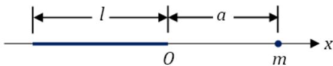

(A) $\int_{-1}^{0}\frac{k m\mu}{(a - x)^2}\mathrm{d}x.$

(B) $\int_0^l\frac{km\mu}{(a - x)^2}\mathrm{d}x$

(C) $2\int_{-\frac{l}{2}}^{0}\frac{k m\mu}{(a - x)^{2}}\mathrm{d}x.$

(D) $2\int_{0}^{\frac{l}{2}}\frac{km\mu}{(a - x)^{2}}\mathrm{d}x.$

解. 应选 (A).

# 三、计算题（本题满分25分，每小题5分）

1. 设 $\left\{ \begin{array}{l} x = t \cos t \\ y = t \sin t \end{array} \right.$ , 求 $\frac{\mathrm{d}^2y}{\mathrm{d}x^2}$ .

解 $\frac{\mathrm{d}^2y}{\mathrm{d}x^2} = \frac{2 + t^2}{(\cos t - t\sin t)^3}.$

2. 计算 $\int_{1}^{4} \frac{\mathrm{d}x}{x(1 + \sqrt{x})}$ .

解. $2 \ln \frac{4}{3}$ .

3. 求 $\lim_{x\to 0}\frac{x - \sin x}{x^2(\mathrm{e}^x - 1)}$

解. $\frac{1}{6}$

4. 求 $\int x \sin^2 x \, \mathrm{d}x$ .

解. $\frac{1}{4} x^{2} - \frac{1}{4} x\sin 2x - \frac{1}{8}\cos 2x + C.$

5. 求微分方程 $xy' + y = xe^{x}$ 满足 $y(1) = 1$ 的特解

解. $y = \frac{x - 1}{x}\mathrm{e}^{x} + \frac{1}{x}.$

# 四、(本题满分9分)

利用导数证明: 当 $x > 1$ 时, 有不等式 $\frac{\ln(1 + x)}{\ln x} > \frac{x}{1 + x}$ .

解. 令 $f(x) = (1 + x)\ln (1 + x) - x\ln x$ ，则 $f^{\prime}(x) = \ln \left(1 + \frac{1}{x}\right) > 0$ 因此当 $x > 1$ 时有 $f(x) > f(1) = 2\ln 2 > 0$

# 五、（本题满分9分）

求微分方程 $y^{\prime \prime} + y = x + \cos x$ 的通解

解. $y = C_{1}\cos x + C_{2}\sin x + x + \frac{1}{2} x\sin x$ ，其中 $C_1$ 和 $C_2$ 为任意常数

# 六、（本题满分9分）

曲线 $y = (x - 1)(x - 2)$ 和 $x$ 轴围成一平面图形，求此平面图形绕 $y$ 轴旋转一周所成的旋转体的体积.

解. $V = \int_{1}^{2} 2\pi x |y| \, \mathrm{d}x = \frac{\pi}{2}$ .

# 七、(本题满分9分)

如图， $A$ 和 $D$ 分别是曲线 $y = \mathrm{e}^{x}$ 和 $y = \mathrm{e}^{-2x}$ 上的点， $AB$ 和 $DC$ 均垂直 $x$ 轴且 $|AB|:|DC| = 2:1, |AB| < 1$ ，求点 $B$ 和 $C$ 的横坐标，使梯形ABCD的面积最大.

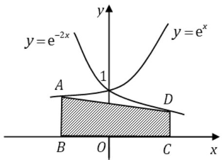

解. 当点 $B$ 的横坐标为 $\frac{1}{3} \ln 2 - 1$ , 点 $C$ 的横坐标为 $\frac{1}{2} + \frac{1}{3} \ln 2$ 时, 梯形面积最大.

# 八、（本题满分8分）

设函数 $f(x)$ 在 $(-\infty, +\infty)$ 内满足 $f(x) = f(x - \pi) + \sin x$ ，且 $f(x) = x, x \in [0, \pi)$ ，计算 $\int_{\pi}^{3\pi} f(x) \mathrm{d}x$ .

解. $\pi^2 - 2$

# 一九九二年考研数学试卷三解答

# 一、填空题（本题共5小题，每小题3分，满分15分）

1. 设 $\left\{ \begin{array}{l} x = f(t) - \pi, \\ y = f(\mathrm{e}^{3t} - 1), \end{array} \right.$ 其中 $f$ 可导，且 $f'(0) \neq 0$ ，则 $\left.\frac{\mathrm{d}y}{\mathrm{d}x}\right|_{t=0} =$ ________.

解. 应填3.

2. 函数 $y = x + 2\cos x$ 在 $\left[0, \frac{\pi}{2}\right]$ 上的最大值为 ______.

解. 应填 $\sqrt{3} + \frac{\pi}{6}$ .

3. $\lim_{x\to 0}\frac{1 - \sqrt{1 - x^2}}{\mathrm{e}^x - \cos{x}} = \underline{\quad}$

解. 应填0.

4. $\int_{1}^{+\infty}\frac{\mathrm{d}x}{x(x^2 + 1)} = \underline{\quad}$

解. 应填 $\frac{1}{2} \ln 2$ .

5. 由曲线 $y = x \mathrm{e}^{x}$ 与直线 $y = \mathrm{e}x$ 所围成的图形的面积 $S =$ ________.

解. 应填 $\frac{\mathrm{e}}{2} - 1$ .

# 二、选择题（本题共5小题，每小题3分，满分15分）

1. 当 $x \to 0$ 时， $x - \sin x$ 是 $x^2$ 的……（）

(A) 低阶无穷小.

(B) 高阶无穷小.

(C) 等价无穷小.

(D) 同阶但非等价的无穷小.

解. 应选 (B).

2. 设 $f(x) = \begin{cases} x^2, & x \leqslant 0 \\ x^2 + x, & x > 0 \end{cases}$ ，则

(A) $f(-x) = \left\{ \begin{array}{ll} - x^2, & x\leqslant 0,\\ -(x^2 +x), & x > 0. \end{array} \right.$

(B) $f(-x) = \left\{ \begin{array}{ll} - (x^2 +x), & x <   0,\\ -x^2, & x\geqslant 0. \end{array} \right.$

(C) $f(-x) = \left\{ \begin{array}{ll}x^{2}, & x\leqslant 0,\\ x^{2} - x, & x > 0. \end{array} \right.$

(D) $f(-x) = \left\{ \begin{array}{ll} x^2 - x, & x < 0, \\ x^2, & x \geqslant 0. \end{array} \right.$

解. 应选 (D).

3. 同试卷一第二[1]题

4. 设 $f(x)$ 连续, $F(x) = \int_{0}^{x^2} f(t^2) \, \mathrm{d}t$ , 则 $F'(x)$ 等于……( )

(A) $f(x^4)$

(B) $x^{2}f(x^{4})$

(C) $2xf(x^4)$

(D) $2xf(x^{2})$

解. 应选 (C).

5. 若 $f(x)$ 的导函数是 $\sin x$ ，则 $f(x)$ 有一个原函数为……（）

(A) $1 + \sin x$

(B) $1 - \sin x$

(C) $1 + \cos x$

(D) $1 - \cos x$

解. 应选 (B).

# 三、计算题（本题共5小题，每小题5分，满分25分）

1. 求 $\lim_{x \to \infty} \left( \frac{3 + x}{6 + x} \right)^{\frac{x - 1}{2}}$ .

解. 极限等于 $\mathrm{e}^{-3 / 2}$

2. 设函数 $y = y(x)$ 由方程 $y - x\mathrm{e}^{y} = 1$ 所确定，求 $\left.\frac{\mathrm{d}^2y}{\mathrm{d}x^2}\right|_{x=0}$ 的值.

解. 导数等于 $2 \mathrm{e}^{2}$ .

3. 求 $\int \frac{x^3}{\sqrt{1 + x^2}} \, \mathrm{d}x$ .

解. $\frac{1}{3} (1 + x^{2})^{3 / 2} - (1 + x^{2})^{1 / 2} + C.$

4. 求 $\int_0^\pi \sqrt{1 - \sin x} \, \mathrm{d}x$ .

解. $4(\sqrt{2} -1)$

5. 求微分方程 $(y - x^{3})\mathrm{d}x - 2x\mathrm{d}y = 0$ 的通解

解. 当 $x > 0$ 时 $y = C\sqrt{x} - \frac{1}{5} x^3$ , 当 $x < 0$ 时 $y = C\sqrt{-x} - \frac{1}{5} x^3$ .

四、（本题满分9分）

同试卷一第三[3]题

五、（本题满分9分）

求微分方程 $y^{\prime \prime} - 3y^{\prime} + 2y = x\mathrm{e}^{x}$ 的通解

解. $y = C_{1} \mathrm{e}^{x} + C_{2} \mathrm{e}^{2x} - \left(\frac{1}{2} x^{2} + x\right) \mathrm{e}^{x}$ .

# 六、（本题满分9分）

计算曲线 $y = \ln (1 - x^{2})$ 上相对于 $0 \leqslant x \leqslant \frac{1}{2}$ 的一段弧的长度.

解. $\ln 3 - \frac{1}{2}$

# 七、(本题满分6分)

求曲线 $y = \sqrt{x}$ 的一条切线 $l$ , 使该曲线与切线 $l$ 及直线 $x = 0, x = 2$ 所围成的平面图形面积最小.

解. 设切点为 $(t, \sqrt{t})$ . 则当 $t = 1$ 时面积最小, 此时切线方程为 $y = \frac{x}{2} + \frac{1}{2}$ .

# 八、(本题满分8分)

同试卷一第六题.

# 一九九三年考研数学试卷三解答

# 一、填空题（本题共5小题，每小题3分，满分15分）

1. $\lim_{x\to 0^{+}}x\ln x = \underline{\quad}$

解. 由洛必达法则, 求得极限等于 0 .

2. 函数 $y = y(x)$ 由方程 $\sin (x^2 + y^2) + \mathrm{e}^x - xy^2 = 0$ 所确定，则 $\frac{\mathrm{dy}}{\mathrm{dx}} =$

解 $\frac{y^2 - 2x\cos(x^2 + y^2) - e^x}{2y\cos(x^2 + y^2) - 2xy}.$

3. 同试卷一第一[1]题

4. $\int \frac{\tan x}{\sqrt{\cos x}} \mathrm{d}x = \underline{\quad}$ .

解. $\frac{2}{\sqrt{\cos x}} + C$

5. 已知曲线 $y = f(x)$ 过点 $\left(0, -\frac{1}{2}\right)$ , 且其上任一点 $(x, y)$ 处的切线斜率为 $x \ln (1 + x^2)$ , 则 $f(x) =$ ________.

解. $\frac{1}{2} (1 + x^{2})[\ln (1 + x^{2}) - 1]$

# 二、选择题（本题共5小题，每小题3分，满分15分）

1. 当 $x \to 0$ 时，变量 $\frac{1}{x^2} \sin \frac{1}{x}$ 是

(A) 无穷小.

(B)无穷大.

(C) 有界的, 但不是无穷小.

(D) 有界的，但不是无穷大.

解. 应选 (D).

2. 设 $f(x) = \begin{cases} \frac{|x^2 - 1|}{x - 1}, & x \neq 1, \\ 2, & x = 1, \end{cases}$ 则在点 $x = 1$ 处函数 $f(x) \cdots \cdots \cdots \cdots \cdots \cdots \cdots \cdots \cdots \cdots \cdots \cdots \cdots \cdots$ （）

(A) 不连续.

(B) 连续, 但不可导.

(C) 可导，但导数不连续.

(D) 可导，且导数连续.

解. 应选 (A).

3. 已知 $f(x) = \begin{cases} x^2, & 0 \leqslant x < 1, \\ 1, & 1 \leqslant x \leqslant 2, \end{cases}$ 设 $F(x) = \int_{1}^{x} f(t) \, \mathrm{d}t$ （ $0 \leqslant x \leqslant 2$ ），则 $F(x)$ 为·（）

(A) $\left\{ \begin{array}{ll} \frac{1}{3} x^3, & 0 \leqslant x < 1; \\ x, & 1 \leqslant x \leqslant 2. \end{array} \right.$

(B) $\left\{ \begin{array}{ll} \frac{1}{3} x^3 - \frac{1}{3}, & 0 \leqslant x < 1; \\ x, & 1 \leqslant x \leqslant 2. \end{array} \right.$

(C) $\left\{ \begin{array}{ll} \frac{1}{3} x^3, & 0 \leqslant x < 1; \\ x - 1, & 1 \leqslant x \leqslant 2. \end{array} \right.$

(D) $\left\{ \begin{array}{ll} \frac{1}{3} x^3 - \frac{1}{3}, & 0 \leqslant x < 1; \\ x - 1, & 1 \leqslant x \leqslant 2. \end{array} \right.$

解. 应选 (D).

4. 设常数 $k > 0$ , 函数 $f(x) = \ln x - \frac{x}{e} + k$ 在 $(0, +\infty)$ 内的零点个数为 $\cdots \cdots \cdots$ ( )

(A) 3.

(B) 2.

(C) 1.

(D) 0.

解. 应选 (B).

5. 设 $f(x) = -f(-x)$ ，在 $(0, +\infty)$ 内 $f'(x) > 0, f''(x) > 0$ ，则 $f(x)$ 在 $(- \infty, 0)$ 内（）

(A) $f^{\prime}(x) <   0,f^{\prime \prime}(x) <   0.$

(B) $f^{\prime}(x) <   0,f^{\prime \prime}(x) > 0.$

(C) $f^{\prime}(x) > 0,f^{\prime \prime}(x) <   0.$

(D) $f^{\prime}(x) > 0,f^{\prime \prime}(x) > 0.$

解. 应选 (C).

# 三、计算题（本题共5小题，每小题5分，满分25分）

1. 设 $y = \sin [f(x^2)]$ ，其中 $f$ 具有二阶导数，求 $\frac{\mathrm{d}^2y}{\mathrm{d}x^2}$ .

解. $\frac{\mathrm{d}^2y}{\mathrm{d}x^2} = 2f'(x^2)\cos [f(x^2)] + 4x^2\{f''(x^2)\cos [f(x^2)] - [f'(x^2)]^2\sin [f(x^2)]\}$ .

2. 求 $\lim_{x \to -\infty} x(\sqrt{x^2 + 100 + x})$

解. -50.

3. 求 $\int_{0}^{\frac{\pi}{4}} \frac{x}{1 + \cos 2x} \, \mathrm{d}x$ .

解. $\frac{\pi}{8} -\frac{1}{4}\ln 2.$

4. 求 $\int_0^{+\infty} \frac{x}{(1 + x)^3} \, \mathrm{d}x$ .

解. $\frac{1}{2}$

5. 求微分方程 $(x^{2} - 1)\mathrm{d}y + (2xy - \cos x)\mathrm{d}x = 0$ 满足初始条件 $y|_{x=0} = 0$ 的特解.

解. $y = \frac{\sin x - 1}{x^2 - 1}$

# 四、（本题满分9分）

设二阶常系数线性微分方程 $y'' + \alpha y' + \beta y = \gamma \mathrm{e}^{x}$ 的一个特解为 $y = \mathrm{e}^{2x} + (1 + x)\mathrm{e}^{x}$ , 试确定常数 $\alpha, \beta, \gamma$ , 并求该方程的通解.

解. $y = C_{1}\mathrm{e}^{x} + C_{2}\mathrm{e}^{2x} + x\mathrm{e}^{x}$

# 五、（本题满分9分）

设平面图形 $A$ 由 $x^{2} + y^{2} \leqslant 2x$ 与 $y \geqslant x$ 所确定，求图形 $A$ 绕 $x = 2$ 旋转一周所得旋转体的体积.

解. $V = \int_{0}^{1}2\pi \left[\sqrt{1 - y^2} -(1 - y)^2\right]\mathrm{d}y = \frac{\pi}{2} -\frac{2}{3}\pi .$

# 六、（本题满分9分）

作半径为 $r$ 的球的外切正圆锥, 问此圆锥的高 $h$ 为何值时, 其体积 $V$ 最小, 并求出该最小值.

解. 当 $h = 4r$ 时, $V$ 取最小值 $V(4r) = \frac{8\pi r^3}{3}$ .

# 七、(本题满分9分)

设 $x > 0$ ，常数 $a > \mathrm{e}$ ，证明： $(a + x)^{a} <   a^{a + x}$

解. 令 $f(x) = (a + x)\ln a - a\ln (a + x)$ ，则当 $x > 0$ 时 $f^{\prime}(x) = \ln a - \frac{a}{a + x} > 0$ ，所以 $f(x)$ 在 $[0, +\infty]$ 上单调增加，从而 $f(x) > f(0) = 0$ 。即结论成立。

# 八、（本题满分9分）

设 $f^{\prime}(x)$ 在 $[0, a]$ 上连续，且 $f(0) = 0$ ，证明：

$$
\left| \int_ {0} ^ {a} f (x) \mathrm {d} x \right| \leqslant \frac {M a ^ {2}}{2},
$$

其中 $M = \max_{0\leqslant x\leqslant a}\left|f^{\prime}(x)\right|$

解. 证法一：任取 $x \in (0, a]$ ，由微分中值定理有

$$
f (x) = f (x) - f (0) = f ^ {\prime} (\xi) x, \quad \xi \in (0, x).
$$

再由定积分的绝对值不等式有

$$
\left| \int_ {0} ^ {a} f (x) \mathrm {d} x \right| = \left| \int_ {0} ^ {a} f ^ {\prime} (\xi) x \mathrm {d} x \right| \leqslant \int_ {0} ^ {a} \left| f ^ {\prime} (\xi) \right| x \mathrm {d} x \leqslant M \int_ {0} ^ {a} x \mathrm {d} x = \frac {M a ^ {2}}{2}.
$$

证法二：由微积分基本公式及定积分的绝对值不等式有

$$
| f (x) | = | f (x) - f (0) | = \left| \int_ {0} ^ {x} f ^ {\prime} (t) \mathrm {d} t \right| \leqslant \int_ {0} ^ {x} \left| f ^ {\prime} (t) \right| \mathrm {d} t \leqslant \int_ {0} ^ {x} M \mathrm {d} t = M x.
$$

从而由积分的保号性有

$$
\left| \int_ {0} ^ {a} f (x) \mathrm {d} x \right| \leqslant \int_ {0} ^ {a} | f (x) | \mathrm {d} x \leqslant \int_ {0} ^ {a} M x \mathrm {d} x = \frac {M a ^ {2}}{2}.
$$

# 一九九四年考研数学试卷三解答

# 一、填空题（本题共5小题，每小题3分，满分15分）

1. 若 $f(x) = \left\{ \begin{array}{ll} \frac{\sin 2x + \mathrm{e}^{2ax} - 1}{x}, & x \neq 0, \\ a, & x = 0 \end{array} \right.$ 在 $(- \infty, + \infty)$ 上连续，则 $a =$ ________.

解. 应填 -2.

2. 设函数 $y = y(x)$ 由参数方程 $\left\{ \begin{array}{l} x = t - \ln (1 + t), \\ y = t^3 + t^2 \end{array} \right.$ 所确定，则 $\frac{\mathrm{d}^2y}{\mathrm{d}x^2} =$

解. 应填 $\frac{1}{t} (6t + 5)(t + 1)$ .

3. $\frac{\mathrm{d}}{\mathrm{d}x}\left[\int_0^{\cos 3x}f(t)\mathrm{d}t\right] = \underline{\quad}$

解. 应填 $-3f(\cos 3x)\sin 3x$ .

4. $\int x^{3}\mathrm{e}^{x^{2}}\mathrm{d}x = \underline{\quad}$

解. 应填 $\frac{1}{2} (x^{2} - 1)\mathrm{e}^{x^{2}} + C$ .

5. 微分方程 $y \, \mathrm{d}x + (x^2 - 4x) \, \mathrm{d}y = 0$ 的通解为

解. 应填 $y^4 = \frac{Cx}{4 - x}$

# 二、选择题（本题共5小题，每小题3分，满分15分）

1. 设 $\lim_{x \to 0} \frac{\ln(1 + x) - (ax + bx^2)}{x^2} = 2$ ，则

(A) $a = 1, b = -\frac{5}{2}$ .

(B) $a = 0, b = -2$

(C) $a = 0, b = -\frac{5}{2}$ .

(D) $a = 1, b = -2$ .

解. 应选 (A).

2. 设 $f(x) = \begin{cases} \frac{2}{3} x^3, & x \leqslant 1, \\ x^2, & x > 1, \end{cases}$ 则 $f(x)$ 在 $x = 1$ 处………( )

(A) 左、右导数都存在.

(B) 左导数存在, 但右导数不存在.

(C) 左导数不存在, 但右导数存在.

(D) 左、右导数都不存在.

解. 应选 (B).

3. 设 $y = f(x)$ 是满足微分方程 $y'' + y' - \mathrm{e}^{\sin x} = 0$ 的解，且 $f'(x_0) = 0$ ，则 $f(x)$ 在( )

(A) $x_{0}$ 的某个邻域内单调增加.

(B) $x_0$ 的某个邻域内单调减少.

(C) $x_0$ 处取得极小值.

(D) $x_0$ 处取得极大值.

解. 应选 (C).

4. 曲线 $y = \mathrm{e}^{\frac{1}{x^2}} \arctan \frac{x^2 + x + 1}{(x + 1)(x - 2)}$ 的渐近线有……（）

(A) 1条.

(B) 2条.

(C)3条.

(D) 4条.

解. 应选 (B). 由于

$$
\lim  _ {x \rightarrow \infty} \mathrm {e} ^ {\frac {1}{x ^ {2}}} \arctan \frac {x ^ {2} + x + 1}{(x + 1) (x - 2)} = \frac {\pi}{4},
$$

故 $y = \frac{\pi}{4}$ 为该曲线的一条水平渐近线. 又

$$
\lim  _ {x \rightarrow 0} \mathrm {e} ^ {\frac {1}{x ^ {2}}} \arctan \frac {x ^ {2} + x + 1}{(x + 1) (x - 2)} = \infty ,
$$

故 $x = 0$ 为该曲线的一条垂直渐近线. 所以该曲线的渐近线有两条.

5. 同试卷一第二[1]题

# 三、解答题（本题共5小题，每小题5分，满分25分）

1. 设 $y = f\left( {x + y}\right)$ ,其中 $f$ 具有二阶导数,且其一阶导数不等于 1 ,求 $\frac{{\mathrm{d}}^{2}y}{\mathrm{\;d}{x}^{2}}$ .

解. $\frac{\mathrm{d}^2y}{\mathrm{d}x^2} = \frac{f''}{(1 - f')^3}$

2. 计算 $\int_0^1 x(1 - x^4)^{\frac{3}{2}}\mathrm{d}x$

解. 令 $x^{2} = \sin t$ , 可求得积分等于 $\frac{3}{32}\pi$ .

3. 计算 $\lim_{n\to \infty}\tan^n\left(\frac{\pi}{4} +\frac{2}{n}\right)$

解. $\mathbf{e}^4$

4. 同试卷一第三[3]题

5. 如图, 设曲线方程为 $y = x^{2} + \frac{1}{2}$ , 梯形 $OABC$ 的面积为 $D$ , 曲边梯形 $OABC$ 的面积为 $D_{1}$ , 点 $A$ 的坐标为 $(a,0) (a > 0)$ . 证明: $\frac{D}{D_{1}} < \frac{3}{2}$ .

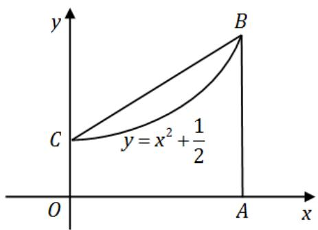

解. $D_{1} = \frac{(2a^{2} + 3)a}{6}, D = \frac{(a^{2} + 1)a}{2}$ , 所以 $\frac{D}{D_{1}} < \frac{3}{2}$ .

# 四、(本题满分9分)

设当 $x > 0$ 时，方程 $kx + \frac{1}{x^2} = 1$ 有且仅有一个解，求 $k$ 的取值范围.

解. 当 $k = \frac{2}{9} \sqrt{3}$ 及 $k \leqslant 0$ 时, 方程有且仅有一个解.

# 五、（本题满分9分）

设 $y = \frac{x^3 + 4}{x^2}$

(I) 求函数的增减区间及极值；  
(II) 求函数图像的凹凸区间及拐点；  
(III)求其渐近线；  
(IV) 作出其图形.

解. (I) $(- \infty, 0)$ 和 $(2, +\infty)$ 为增区间, $(0, 2)$ 为减区间, 极小值点为 $x = 2$ , 极小值为 $y = 3$ ;

(II) $(- \infty, 0)$ 和 $(0, +\infty)$ 均为凹区间，无拐点；  
(III) $x = 0$ 为铅直渐近线, $y = x$ 为斜渐近线;  
(IV) 其图形如下图:

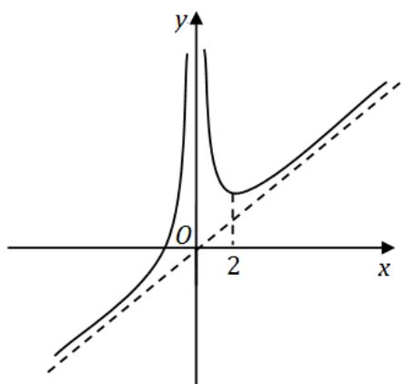

# 六、（本题满分9分）

求微分方程 $y'' + a^2y = \sin x$ 的通解，其中常数 $a > 0$ .

解. 当 $a \neq 1$ 时, 原方程的通解为 $y = C_{1} \cos ax + C_{2} \sin ax + \frac{1}{a^{2} - 1} \sin x$ ;

当 $a = 1$ 时，原方程的通解为 $y = C_{1}\cos x + C_{2}\sin x + - \frac{1}{2} x\cos x.$

# 七、(本题满分9分)

设 $f(x)$ 在 $[0,1]$ 上连续且递减，证明：当 $0 < \lambda < 1$ 时， $\int_0^\lambda f(x)\mathrm{d}x \geqslant \lambda \int_0^1 f(x)\mathrm{d}x.$

解. 由积分中值定理以及函数的单调性可得

$$
\begin{array}{l} \int_ {0} ^ {\lambda} f (x) \mathrm {d} x - \lambda \int_ {0} ^ {1} f (x) \mathrm {d} x = (1 - \lambda) \int_ {0} ^ {\lambda} f (x) \mathrm {d} x - \lambda \int_ {\lambda} ^ {1} f (x) \mathrm {d} x \\ = (1 - \lambda) \cdot \lambda f (\xi_ {1}) - \lambda \cdot (1 - \lambda) f (\xi_ {2}) \\ = \lambda (1 - \lambda) [ f (\xi_ {1}) - f (\xi_ {2}) ] \geqslant 0. \\ \end{array}
$$

# 八、(本题满分8分)

求曲线 $y = 3 - |x^2 - 1|$ 与 $x$ 轴围成的封闭图形绕直线 $y = 3$ 旋转所得的旋转体体积.

解. $V = \frac{448}{15} \pi$ .

# 一九九五年考研数学试卷三解答

# 一、填空题（本题共5小题，每小题3分，满分15分）

1. 设 $y = \cos (x^{2})\sin^{2}\frac{1}{x}$ ，则 $y^\prime =$ ________.

解. 应填 $-2x\sin (x^{2})\sin^{2}\frac{1}{x} - \frac{1}{x^{2}}\sin \frac{2}{x}\cos (x^{2}).$

2. 微分方程 $y'' + y = -2x$ 的通解为

解. 应填 $C_1 \cos x + C_2 \sin x - 2x$ .

3. 曲线 $\left\{ \begin{array}{l} x = 1 + t^{2} \\ y = t^{3} \end{array} \right.$ 在 $t = -2$ 处的切线方程为

解. 应填 $3x - y - 7 = 0$

4. $\lim_{n\to \infty}\left(\frac{1}{n^2 + n + 1} +\frac{2}{n^2 + n + 2} +\dots +\frac{n}{n^2 + n + n}\right) = \underline{\quad}$

解. 应填 $\frac{1}{2}$ .

5. 由曲线 $y = x^{2} \mathrm{e}^{-x^{2}}$ 的渐近线方程为

解. 应填 $y = 0$

# 二、选择题（本题共5小题，每小题3分，满分15分）

1. 设 $f(x)$ 和 $\phi (x)$ 在 $(-\infty , + \infty)$ 上有定义， $f(x)$ 为连续函数，且 $f(x)\neq 0$ ， $\phi (x)$ 有间断点，则

(A) $\phi [f(x)]$ 必有间断点.

(B) $[\phi (x)]^2$ 必有间断点.

(C) $f[\phi (x)]$ 必有间断点.

$\left(\mathrm{D}\right)\frac{\phi(x)}{f(x)}$ 必有间断点.

解. 应选 (D).

2. 曲线 $y = x(x - 1)(2 - x)$ 与 $x$ 轴所围图形的面积可表示为……（）

(A) $-\int_0^2 x(x - 1)(2 - x)\mathrm{d}x.$   
(B) $\int_0^1 x(x - 1)(2 - x)\mathrm{d}x - \int_1^2 x(x - 1)(2 - x)\mathrm{d}x.$   
(C) $-\int_0^1 x(x - 1)(2 - x)\mathrm{d}x + \int_1^2 x(x - 1)(2 - x)\mathrm{d}x.$   
(D) $\int_0^2 x(x - 1)(2 - x)\mathrm{d}x.$

解. 应选 (C).

3. 设 $f(x)$ 在 $(- \infty, + \infty)$ 内可导，且对任意 $x_{1}, x_{2}$ ，当 $x_{1} > x_{2}$ 时都有 $f(x_{1}) > f(x_{2})$ ，则

(A) 对任意 $x, f'(x) > 0$ .

(B) 对任意 $x, f^{\prime}(-x) \leqslant 0$ .

(C) 函数 $f(-x)$ 单调增加.

(D) 函数 $-f(-x)$ 单调增加.

解. 应选 (D).

4. 同试卷一第二[2]题

5. 设 $f(x)$ 可导， $F(x) = f(x)(1 + |\sin x|)$ ，若 $F(x)$ 在 $x = 0$ 处可导，则必有 $\cdots$ （）

(A) $f(0) = 0$

(B) $f^{\prime}(0) = 0$ .

(C) $f(0) + f'(0) = 0$ .

(D) $f(0) - f'(0) = 0$

解. 应选 (A). 设 $F(x)$ 在 $x = 0$ 处可导, 则 $f(x) \cdot |\sin x|$ 在 $x = 0$ 处可导, 由可导的充要条件知

$$
\lim  _ {x \rightarrow 0 ^ {-}} \frac {f (x) \cdot | \sin x |}{x} = \lim  _ {x \rightarrow 0 ^ {+}} \frac {f (x) \cdot | \sin x |}{x}.
$$

根据重要极限 $\lim_{x\to 0}\frac{\sin x}{x} = 1$ ，可得

$$
\lim  _ {x \rightarrow 0 ^ {-}} \frac {| \sin x |}{x} = - \lim  _ {x \rightarrow 0 ^ {-}} \frac {\sin x}{x} = - 1, \quad \lim  _ {x \rightarrow 0 ^ {+}} \frac {| \sin x |}{x} = \lim  _ {x \rightarrow 0 ^ {+}} \frac {\sin x}{x} = 1.
$$

因此我们有 $f(0) = -f(0)$ ，故 $f(0) = 0$

# 三、解答题（本题共6小题，每小题5分，满分30分）

1. 求 $\lim_{x \to 0^{+}} \frac{1 - \sqrt{\cos x}}{x(1 - \cos \sqrt{x})}$ .

解. $\frac{1}{2}$

2. 设函数 $y = y(x)$ 由方程 $x\mathrm{e}^{f(y)} = \mathrm{e}^{y}$ 确定，其中 $f$ 具有二阶导数，且 $f^{\prime}\neq 1$ ，求 $\frac{\mathrm{d}^2y}{\mathrm{d}x^2}$ .

解 $\frac{\mathrm{d}^2y}{\mathrm{d}x^2} = \frac{f''(y) - [1 - f'(y)]^2}{x^2[1 - f'(y)]^3}.$

3. 设 $f(x^{2} - 1) = \ln \frac{x^{2}}{x^{2} - 2}$ ，且 $f[\phi (x)] = \ln x$ ，求 $\int \phi (x)\mathrm{d}x$

解. $2\ln |x - 1| + x + C$

4. 设 $f(x) = \begin{cases} x \arctan \frac{1}{x^2}, & x \neq 0, \\ 0, & x = 0, \end{cases}$ 试讨论 $f'(x)$ 在 $x = 0$ 处的连续性.

解. $f^{\prime}(x)$ 在 $x = 0$ 处是连续的

5. 求摆线 $\left\{ \begin{array}{l} x = 1 - \cos t \\ y = t - \sin t \end{array} \right.$ 一拱（ $0 \leqslant t \leqslant 2\pi$ ）的弧长。

解. 弧长 $s = 8$

6. 设单位质点在水平面内作直线运动, 初速度 $v\big|_{t=0} = v_{0}$ , 已知阻力与速度成正比 (比例常数为 1), 问 $t$ 为多少时此质点的速度为 $\frac{v_{0}}{3}$ ? 并求到此时刻该质点所经过的路程.

解. $t = \ln 3$ 时此质点的速度为 $\frac{v_0}{3}$ , 到此时刻该质点所经过的路程 $s = \frac{2}{3} v_0$ .

四、(本题满分8分)

求函数 $f(x) = \int_0^{x^2}(2 - t)\mathrm{e}^{-t}\mathrm{d}t$ 的最大值和最小值.

解. 最大值为 $f(\pm \sqrt{2}) = 1 + \mathrm{e}^{-2}$ ; 最小值为 $f(0) = 0$ .

五、(本题满分8分)

设 $y = \mathrm{e}^{x}$ 是微分方程 $xy' + p(x)y = x$ 的一个解，求此微分方程满足条件 $y|_{x = \ln 2} = 0$ 的特解.

解. 所求特解为 $y = \mathrm{e}^{x} - \mathrm{e}^{x + \mathrm{e}^{-x} - \frac{1}{2}}$ .

六、（本题满分8分）

如图，设曲线 $L$ 的方程为 $y = f(x)$ ，且 $y'' > 0$ ，又 $MT, MP$ 分别为该曲线在点 $M(x_0, y_0)$ 处的切线和法线，已知线段 $MP$ 的长度为 $\frac{(1 + (y_0')^2)^{\frac{3}{2}}}{y_0''}$ （其中 $y_0' = y'(x_0), y_0'' = y''(x_0)$ ），试推导出点 $P(\xi, \eta)$ 的坐标表达式.

解. $\xi = x_0 - \frac{y_0'(1 + (y_0')^2)}{y_0''},\eta = y_0 + \frac{1 + (y_0')^2}{y_0''}.$

七、(本题满分8分)

设 $f(x) = \int_0^x\frac{\sin t}{\pi - t}\mathrm{d}t$ ，求 $\int_0^\pi f(x)\mathrm{d}x$

解. $\int_0^\pi f(x)\mathrm{d}x = 2.$

# 八、（本题满分8分）

设 $\lim_{x\to 0}\frac{f(x)}{x} = 1$ ，且 $f^{\prime \prime}(x) > 0$ ，证明 $f(x)\geqslant x$

解. 因为 $f(x)$ 连续且具有一阶导数, 所以由 $\lim_{x \to 0} \frac{f(x)}{x} = 1$ 知 $f(0) = 0$ . 从而有

$$
f ^ {\prime} (0) = \lim  _ {x \rightarrow 0} \frac {f (x) - f (0)}{x - 0} = 1.
$$

令 $F(x) = f(x) - x$ ，则 $F(0) = 0, F'(0) = 0.$ 又由 $F''(x) = f''(x) > 0$ 知 $F(0)$ 是 $F(x)$ 的极小值和 $F'(x)$ 单调. 故 $F(x)$ 只有一个驻点，从而 $F(0)$ 是 $F(x)$ 的最小值．因此 $F(x) \geqslant F(0) = 0$ ，即 $f(x) \geqslant x$

# 一九九六年考研数学试卷三解答

# 一、填空题（本题共5小题，每小题3分，满分15分）

1. 设 $y = \left( x + \mathrm{e}^{-\frac{x}{2}} \right)^{\frac{2}{3}}$ ，则 $y' \mid_{x=0} =$ ________.

解. 应填 $\frac{1}{3}$ .

2. $\int_{-1}^{1}\left(x + \sqrt{1 - x^2}\right)^2\mathrm{d}x = \underline{\quad}$

解. 应填2.

3. 微分方程的 $y'' + 2y' + 5y = 0$ 通解为

解. 应填 $y = \mathrm{e}^{-x}\left(C_{1} \cos 2 x + C_{2} \sin 2 x\right)$ , 其中 $C_{1}, C_{2}$ 为任意常数.

4. $\lim_{x\to \infty}x\left[\sin \ln \left(1 + \frac{3}{x}\right) - \sin \ln \left(1 + \frac{1}{x}\right)\right] = \underline{\quad}$

解. 应填 2 .

5. 由曲线 $y = x + \frac{1}{x}$ , $x = 2$ 及 $y = 2$ 所围图形的面积 $S =$ ________.

解. 应填 $\ln 2 - \frac{1}{2}$ .

# 二、选择题（本题共5小题，每小题3分，满分15分）

1. 设 $x \to 0$ 时 $\mathrm{e}^x - (ax^2 + bx + 1)$ 是比 $x^2$ 高阶的无穷小, 则……( )

(A) $a = \frac{1}{2}, b = 1$ .

(B) $a = 1, b = 1$ .

(C) $a = -\frac{1}{2}, b = -1.$

(D) $a = -1, b = 1$ .

解. 应选 (A).

2. 设函数 $f(x)$ 在区间 $(- \delta, \delta)$ 内有定义，若当 $x \in (-\delta, \delta)$ 时，恒有 $\left|f(x)\right| \leqslant x^{2}$ ，则 $x = 0$ 必是 $f(x)$ 的……( )

(A)间断点.

(B) 连续而不可导的点.

(C) 可导的点, 且 $f^{\prime}(0) = 0$ .

(D) 可导的点, 且 $f^{\prime}(0) \neq 0$ .

解. 应选 (C).

3. 设 $f(x)$ 处处可导，则

(A) 当 $\lim_{x \to -\infty} f(x) = -\infty$ 时，必有 $\lim_{x \to -\infty} f'(x) = -\infty$ .

(B) 当 $\lim_{x \to -\infty} f'(x) = -\infty$ 时，必有 $\lim_{x \to -\infty} f(x) = -\infty$ .

(C) 当 $\lim_{x \to +\infty} f(x) = +\infty$ 时，必有 $\lim_{x \to +\infty} f'(x) = +\infty.$

(D) 当 $\lim_{x \to +\infty} f'(x) = +\infty$ 时，必有 $\lim_{x \to +\infty} f(x) = +\infty$

解. 应选 (D). 取反例 $f(x) = x$ , 可排除选项 (A) 和 (C); 另取反例 $f(x) = x^{2}$ , 可排除选项 (B); 因而只能选 (D).

事实上，由 $\lim_{x\to +\infty}f'(x) = +\infty$ 知，对任意正数 $M$ ，存在 $N$ ，使得当 $x > N$ 时有 $f^{\prime}(x) > M$ ：故由拉格朗日中值定理，当 $x > N$ 时有

$$
f (x) - f (N) = f ^ {\prime} (x) (x - N) > M (x - N),
$$

即 $x \to +\infty$ 时 $f(x) > f(N) + M(x - N) \to +\infty$ .

4. 在区间 $(- \infty, + \infty)$ 内，方程 $|x|^{\frac{1}{4}} + |x|^{\frac{1}{2}} - \cos x = 0 \cdots \cdots \cdots \cdots \cdots \cdots \cdots \cdots \cdots \cdots \cdots \cdots \cdots \cdots$ （）

(A) 无实根.

(B) 有且仅有一个实根.

(C) 有且仅有两个实根.

(D) 有无穷多个实根.

解. 应选 (C).

5. 设 $f(x), g(x)$ 在区间 $[a, b]$ 上连续, $g(x) < f(x) < m$ ( $m$ 为常数), 由曲线 $y = g(x)$ , $y = f(x)$ , $x = a$ 及 $x = b$ 所围平面图形绕直线 $y = m$ 旋转而成的旋转体体积为……( )

(A) $\int_{a}^{b}\pi [2m - f(x) + g(x)][f(x) - g(x)]\mathrm{d}x.$   
(B) $\int_{a}^{b}\pi [2m - f(x) - g(x)][f(x) - g(x)]\mathrm{d}x.$   
(C) $\int_{a}^{b}\pi [m - f(x) + g(x)][f(x) - g(x)]\mathrm{d}x.$   
(D) $\int_{a}^{b}\pi [m - f(x) - g(x)][f(x) - g(x)]\mathrm{d}x.$

解. 应选 (B).

# 三、计算题（本题共6小题，每小题5分，满分30分）

1. 计算 $\int_0^{\ln 2} \sqrt{1 - \mathrm{e}^{-2x}} \, \mathrm{d}x$ .

解. $\ln (2 + \sqrt{3}) - \frac{\sqrt{3}}{2}$ .

2. 求 $\int \frac{\mathrm{d}x}{1 + \sin x}$

解. $\tan x - \sec x + C$

3. 设 $\left\{ \begin{array}{l} x = \int_{0}^{t} f(u^{2}) \mathrm{d}u, \\ y = [f(t^{2})]^{2}, \end{array} \right.$ 其中 $f(u)$ 具有二阶导数，且 $f(u) \neq 0$ ，求 $\frac{\mathrm{d}^2y}{\mathrm{d}x^2}$ .

解 $\frac{\mathrm{d}^2y}{\mathrm{d}x^2} = \frac{4[f'(t^2) + 2t^2f''(t^2)]}{f(t^2)}.$

4. 求函数 $f(x) = \frac{1 - x}{1 + x}$ 在 $x = 0$ 点处带拉格朗日型余项的 $n$ 阶泰勒展开式.

解. $f(x) = 1 - 2x + 2x^{2} + \dots +(-1)^{n}2x^{n} + (-1)^{n + 1}\frac{2x^{n + 1}}{(1 + \theta x)^{n + 2}},0 <   \theta <  1.$

5. 求微分方程 $y'' + y' = x^2$ 的通解

解. $y = \frac{1}{3} x^3 -x^2 +2x + C_1 + C_2\mathrm{e}^{-x}.$

6. 设有一正椭圆柱体，其底面的长、短轴分别为 $2a, 2b$ ，用过此柱体底面的短轴与底面成 $\alpha$ 角（ $0 < \alpha < \frac{\pi}{2}$ ）的平面截此柱体，得一锲形体（如图），求此锲形体的体积 $V$ .

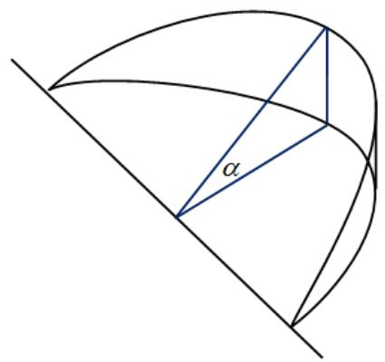

解. $V = \frac{2a^{2}b}{3}\tan \alpha .$

# 四、(本题满分8分)

计算不定积分 $\int \frac{\arctan x}{x^2(1 + x^2)}\mathrm{d}x.$

解. $-\frac{\arctan x}{x} - \frac{1}{2} (\arctan x)^2 + \frac{1}{2}\ln \frac{x^2}{1 + x^2} + C.$

# 五、(本题满分8分)

设函数 $f(x) = \left\{ \begin{array}{ll}1 - 2x^2, & x <   - 1,\\ x^3, & -1\leqslant x\leqslant 2,\\ 12x - 16, & x > 2. \end{array} \right.$

(I) 写出 $f(x)$ 的反函数 $g(x)$ 的表达式；  
(II) $g(x)$ 是否有间断点、不可导点, 若有, 指出这些点.

解. (I) $g(x) = \begin{cases} -\sqrt{\frac{1 - x}{2}}, & x < -1, \\ \sqrt[3]{x}, & -1 \leqslant x \leqslant 8, \\ \frac{x + 16}{12}, & x > 8. \end{cases}$

(II) $g(x)$ 在 $(- \infty, + \infty)$ 处处连续，没有间断点． $g(x)$ 的不可导点是 $x = 0$ 和 $x = -1$ .

# 六、（本题满分8分）

设函数 $y = y(x)$ 由方程 $2y^{3} - 2y^{2} + 2xy - x^{2} = 1$ 所确定，试求 $y = y(x)$ 的驻点，并判别它是否为极值点.

解. 唯一驻点是 $x = 1$ ，也是函数的极小值点

# 七、(本题满分8分)

设 $f(x)$ 在区间 $[a,b]$ 上具有二阶导数，且 $f(a) = f(b) = 0,f^{\prime}(a)f^{\prime}(b) > 0$ ．试证明：存在 $\xi \in (a,b),\eta \in (a,b)$ ，使 $f(\xi) = 0$ 及 $f''(\eta) = 0$

解. 不妨设 $f^{\prime}(a) > 0, f^{\prime}(b) > 0$ . 则有

$$
\lim  _ {x \rightarrow a ^ {+}} \frac {f (x)}{x - a} > 0, \quad \lim  _ {x \rightarrow b ^ {-}} \frac {f (x)}{x - b} > 0.
$$

由此知在 $a$ 的右邻域中有 $x_{1}$ 使得 $f(x_{1}) > 0$ , 在 $b$ 的左邻域中有 $x_{2}$ 使得 $f(x_{2}) < 0$ . 由零值定理, 存在 $\xi \in (x_{1}, x_{2}) \subset (a, b)$ 使得 $f(\xi) = 0$ .

另外，由罗尔定理，存在 $\eta_1\in (a,\xi)$ 和 $\eta_{2}\in (\xi ,b)$ ，使得 $f^{\prime}(\eta_1) = f^{\prime}(\eta_2) = 0$ 再用一次罗尔定理，存在 $\eta \in (\eta_1,\eta_2)\subset (a,b)$ 使得 $f''(\eta) = 0$

# 八、（本题满分8分）

设 $f(x)$ 为连续函数，

(I) 求初值问题 $\left\{ \begin{array}{l} y' + ay = f(x), \\ y|_{x=0} = 0 \end{array} \right.$ 的解 $y(x)$ ，其中 $a$ 是正常数.  
(II) 若 $\left| f(x) \right| \leqslant k$ ( $k$ 为常数), 证明: 当 $x \geqslant 0$ 时, 有 $\left| y(x) \right| \leqslant \frac{k}{a} (1 - \mathrm{e}^{-ax})$ .

解. (I) 解为 $y(x) = \mathrm{e}^{-ax}\int_{0}^{x}f(t)\mathrm{e}^{at}\mathrm{d}t.$

(II) $|y(x)| \leqslant \mathrm{e}^{-ax}\int_{0}^{x}|f(t)|\mathrm{e}^{at}\mathrm{d}t \leqslant k\mathrm{e}^{-ax}\int_{0}^{x}\mathrm{e}^{at}\mathrm{d}t = \frac{k}{a}\mathrm{e}^{-ax}(\mathrm{e}^{ax} - 1) = \frac{k}{a}(1 - \mathrm{e}^{-ax})$

# 一九九七年考研数学试卷二解答

# 一、填空题（本题共5小题，每小题3分，满分15分）

1. 已知 $f(x) = \left\{ \begin{array}{ll} (\cos x)^{x^{-2}}, & x \neq 0, \\ a, & x = 0 \end{array} \right.$ 在 $x = 0$ 处连续，则 $a =$ ________.

解. 应填 $\mathrm{e}^{-1 / 2}$ .

2. 设 $y = \ln \sqrt{\frac{1 - x}{1 + x^2}}$ ，则 $y''|_{x=0} =$ ________.

解. 应填 $-\frac{3}{2}$ .

3. $\int \frac{\mathrm{d}x}{\sqrt{x(4 - x)}} = \underline{\quad}$

解. 应填 $\arcsin \frac{x - 2}{2} + C$ .

4. $\int_{0}^{+\infty}\frac{\mathrm{d}x}{x^2 + 4x + 8} = \underline{\quad}$

解. 应填 $\frac{\pi}{8}$ .

5. 已知向量组 $\alpha_{1} = (1,2,-1,1), \alpha_{,2} = (2,0,t,0), \alpha_{3} = (0,-4,5,-2)$ 的秩为 2 , 则 $t =$

解. 应填3.

# 二、选择题（本题共5小题，每小题3分，满分15分）

1. 设 $x \to 0$ 时, $\mathrm{e}^{\tan x} - \mathrm{e}^{x}$ 与 $x^{n}$ 是同阶无穷小, 则 $n$ 为……( )

(A) 1.

(B) 2.

(C) 3.

(D) 4.

解. 应选 (C).

2. 同试卷一第二[2]题

3. 已知函数 $y = f(x)$ 对一切 $x$ 满足 $xf''(x) + 3x[f'(x)]^2 = 1 - \mathrm{e}^{-x}$ ，若 $f'(x_0) = 0$ （ $x_0 \neq 0$ ），则

(A) $f(x_0)$ 是 $f(x)$ 的极大值.  
(B) $f(x_0)$ 是 $f(x)$ 的极小值.  
(C) $(x_0, f(x_0))$ 是曲线 $\gamma = f(x)$ 的拐点.  
(D) $f(x_{0})$ 不是 $f(x)$ 的极小值, $(x_{0}, f(x_{0}))$ 也不是曲线 $\gamma = f(x)$ 的拐点.

解. 应选 (B).

4. 同试卷一第二[3]题

5. 设 $g(x) = \begin{cases} 2 - x, & x \leqslant 0 \\ x + 2, & x > 0 \end{cases}$ , $f(x) = \begin{cases} x^2, & x < 0 \\ -x, & x \geqslant 0 \end{cases}$ , 则 $g[f(x)]$ 为……( )

(A) $\left\{ \begin{array}{ll}2 + x^2, & x <   0,\\ 2 - x, & x\geqslant 0. \end{array} \right.$

(B) $\left\{ \begin{array}{ll}2 - x^2, & x < 0,\\ 2 + x, & x\geqslant 0. \end{array} \right.$

(C) $\left\{ \begin{array}{ll}2 - x^2, & x < 0,\\ 2 - x, & x\geqslant 0. \end{array} \right.$

(D) $\left\{ \begin{array}{ll}2 + x^2, & x <   0,\\ 2 + x, & x\geqslant 0. \end{array} \right.$

解. 应选 (D).

# 三、计算题（本题共6小题，每小题5分，满分30分）

1. 求极限 $\lim_{x \to -\infty} \frac{\sqrt{4x^2 + x - 1} + x + 1}{\sqrt{x^2 + \sin x}}$ .

解. 极限等于 1.

2. 设 $y = y(x)$ 由 $\left\{ \begin{array}{l} x = \arctan t \\ 2y - ty^2 + e^t = 5 \end{array} \right.$ 所确定，求 $\frac{\mathrm{dy}}{\mathrm{dx}}$

解 $\frac{\mathrm{dy}}{\mathrm{dx}} = \frac{(y^2 - \mathrm{e}^t)(1 + t^2)}{2(1 - ty)}.$

3. 计算 $\int \mathrm{e}^{2x} (\tan x + 1)^2 \, \mathrm{d}x$ .

解. $\mathrm{e}^{2x}\tan x + C$

4. 求微分方程 $\left(3x^{2} + 2xy - y^{2}\right)\mathrm{d}x + \left(x^{2} - 2xy\right)\mathrm{d}y = 0$ 的通解.

解. 通解为 $xy^{2} - x^{2}y - x^{3} = C$ .

5. 已知 $y_{1} = x\mathrm{e}^{x} + \mathrm{e}^{2x}, y_{2} = x\mathrm{e}^{x} + \mathrm{e}^{-x}, y_{3} = x\mathrm{e}^{x} + \mathrm{e}^{2x} - \mathrm{e}^{-x}$ 是某二阶线性非齐次微分方程的三个解，求此微分方程.

解. $y^{\prime \prime} - y^{\prime} - 2y = \mathrm{e}^{x} - 2x\mathrm{e}^{x}$

6. 已知 $A = \left( \begin{array}{rrr}1 & 1 & -1\\ 0 & 1 & 1\\ 0 & 0 & -1 \end{array} \right)$ , 且 $A^2 - AB = E$ , 其中 $E$ 是三阶单位矩阵, 求矩阵 $B$ .

解. $B = \left( \begin{array}{lll}0 & 2 & 1\\ 0 & 0 & 0\\ 0 & 0 & 0 \end{array} \right).$

# 四、(本题满分8分)

$\lambda$ 取何值时，方程组 $\left\{ \begin{array}{ll}2x_{1} + \lambda x_{2} - x_{3} = 1\\ \lambda x_{1} - x_{2} + x_{3} = 2\\ 4x_{1} + 5x_{2} - 5x_{3} = -1 \end{array} \right.$ 无解，有唯一解或由无穷多解？并在有无穷多解时写出方程组的通解.

解. 当 $\lambda = -\frac{4}{5}$ 时, 原方程组无解.

当 $\lambda \neq 1$ 且 $\lambda \neq -\frac{4}{5}$ 时，方程组有唯一解.

当 $\lambda = 1$ 时, 原方程组有无穷多解, 其通解为

$$
\left(x _ {1}, x _ {2}, x _ {3}\right) ^ {T} = \left(1, - 1, 0\right) ^ {T} + k (0, 1, 1) ^ {T},
$$

其中 $k$ 为任意常数

# 五、（本题满分8分）

设曲线 $L$ 的极坐标方程为 $r = r(\theta)$ , $M(r, \theta)$ 为 $L$ 上的任一点, $M_0(2,0)$ 为 $L$ 上一定点, 若极径 $OM_0$ , $OM$ 与曲线 $L$ 所围成的曲边扇形面积值等于 $L$ 上 $M_0$ , $M$ 两点间弧长值的一半, 求曲线 $L$ 的方程.

解. 直线方程为 $x \mp \sqrt{3} y = 2$ .

# 六、（本题满分8分）

设函数 $f(x)$ 在闭区间 $[0,1]$ 上连续，在开区间 $(0,1)$ 内大于零，并满足 $xf'(x) = f(x) + \frac{3a}{2} x^2$ （ $a$ 为常数），又曲线 $y = f(x)$ 与 $x = 1, y = 0$ 所围成的图形 $S$ 的面积值为 2，求函数 $y = f(x)$ ，并问 $a$ 为何值时，图形 $S$ 绕 $x$ 轴旋转一周所得的旋转体的体积最小.

解. $f(x) = \frac{3}{2} ax^2 + (4 - a)x$ . 故 $a = -5$ 时, 旋转体体积 $V(a)$ 最小.

# 七、(本题满分8分)

已知函数 $f(x)$ 连续，且 $\lim_{x\to 0}\frac{f(x)}{x} = 2$ ，设 $\varphi (x) = \int_0^1 f(xt)\mathrm{d}t$ ，求 $\varphi^{\prime}(x)$ 并讨论 $\varphi '(x)$ 在 $x = 0$ 处的连续性.

解. 由题设 $\lim_{x\to 0}\frac{f(x)}{x} = 2$ 知 $f(0) = 0, f'(0) = 2$ ，且有 $\varphi (0) = 0$ 当 $x\neq 0$ 时有

$$
\varphi (x) = \int_ {0} ^ {1} f (x t) d t = \frac {\int_ {0} ^ {x} f (u) d u}{x} \Rightarrow \varphi^ {\prime} (x) = \frac {x f (x) - \int_ {0} ^ {x} f (u) d u}{x ^ {2}},
$$

当 $x = 0$ 时有

$$
\varphi^ {\prime} (0) = \lim  _ {x \rightarrow 0} \frac {\varphi (x) - \varphi (0)}{x} = \lim  _ {x \rightarrow 0} \frac {\int_ {0} ^ {x} f (u) \mathrm {d} u}{x ^ {2}} = \lim  _ {x \rightarrow 0} \frac {f (x)}{2 x} = 1.
$$

从而

$$
\begin{array}{l} \lim  _ {x \rightarrow 0} \varphi^ {\prime} (x) = \lim  _ {x \rightarrow 0} \frac {x f (x) - \int_ {0} ^ {x} f (u) \mathrm {d} u}{x ^ {2}} = \lim  _ {x \rightarrow 0} \frac {f (x)}{x} - \lim  _ {x \rightarrow 0} \frac {\int_ {0} ^ {x} f (u) \mathrm {d} u}{x ^ {2}} \\ = 2 - 1 = 1 = \varphi^ {\prime} (0), \\ \end{array}
$$

即 $\varphi^{\prime}(x)$ 在 $x = 0$ 处连续

# 八、(本题满分8分)

就 $k$ 的不同取值情况，确定方程 $x - \frac{\pi}{2}\sin x = k$ 在开区间 $\left(0, \frac{\pi}{2}\right)$ 内根的个数，并证明你的结论.

解. 设 $f(x) = x - \frac{\pi}{2} \sin x, x \in \left[0, \frac{\pi}{2}\right]$ . 则 $f(x)$ 在 $x_0 = \arccos \frac{2}{\pi}$ 处有最小值 $y_0$ . 因此:

(I) 当 $k \notin [y_0, 0)$ 时，原方程在 $\left(0, \frac{\pi}{2}\right)$ 内没有根；  
(II) 当 $k = y_0$ 时, 原方程在 $\left(0, \frac{\pi}{2}\right)$ 内有唯一根 $x_0$ ;  
(III) 当 $k \notin (y_0, 0)$ 时，原方程在 $\left(0, \frac{\pi}{2}\right)$ 内恰有两个不同的根.

# 一九九八年考研数学试卷二解答

# 一、填空题（本题共5小题，每小题3分，满分15分）

1. 同试卷一第一[1]题  
2. 曲线 $y = -x^{3} + x^{2} + 2x$ 与 $x$ 轴所围成的图形的面积 $A =$ ________.

解. 应填 $\frac{37}{12}$ . 易见 $y = -x^{3} + x^{2} + 2x$ 的零点为 $-1,0,2$ , 且当 $x \in (-1,0)$ 时 $y < 0$ ; 当 $x \in (0,2)$ 时 $y > 0$ . 于是有

$$
A = \int_ {- 1} ^ {0} - (- x ^ {3} + x ^ {2} + 2 x) \mathrm {d} x + \int_ {0} ^ {2} (- x ^ {3} + x ^ {2} + 2 x) \mathrm {d} x = \frac {3 7}{1 2}.
$$

3. $\int \frac{\ln(\sin x)}{\sin^2 x} \mathrm{d}x = \underline{\quad}$ .

解. 应填 $-\cot x \cdot \ln \sin x - \cot x - x + C$ ．用分部积分法，有

$$
\begin{array}{l} \int \frac {\ln \sin x}{\sin^ {2} x} d x = - \int \ln \sin x d (\cot x) = - \cot x \cdot \ln \sin x + \int \cot^ {2} x d x \\ = - \cot x \cdot \ln \sin x + \int \left(\csc^ {2} x - 1\right) d x \\ = - \cot x \cdot \ln \sin x - \cot x - x + C. \\ \end{array}
$$

4. 设 $f(x)$ 连续, 则 $\frac{\mathrm{d}}{\mathrm{d}x}\int_{0}^{x}tf(x^{2} - t^{2})\mathrm{d}t =$ ________.

解. 应填 $x f(x^{2})$ . 作变量代换 $u = x^{2} - t^{2}$ , 则有

$$
\int_ {0} ^ {x} t f \left(x ^ {2} - t ^ {2}\right) d t = \int_ {x ^ {2}} ^ {0} - \frac {1}{2} f (u) d u = \frac {1}{2} \int_ {0} ^ {x ^ {2}} f (u) d u,
$$

从而导函数为

$$
\frac {\mathrm {d}}{\mathrm {d} x} \int_ {0} ^ {x} t f \left(x ^ {2} - t ^ {2}\right) \mathrm {d} t = \frac {1}{2} \frac {\mathrm {d}}{\mathrm {d} x} \int_ {0} ^ {x ^ {2}} f (u) \mathrm {d} u = \frac {1}{2} f \left(x ^ {2}\right) \cdot \left(x ^ {2}\right) ^ {\prime} = x f \left(x ^ {2}\right).
$$

5. 曲线 $y = x \ln \left( e + \frac{1}{x} \right) (x > 0)$ 的渐进线方程为

解. 应填 $y = x + \frac{1}{\mathrm{e}}$ .

# 二、选择题（本题共5小题，每小题3分，满分15分）

1. 设数列 $x_{n}$ 与 $y_{n}$ 满足 $\lim_{x\to \infty}x_ny_n = 0$ ，则下列断言正确的是…

(A) 若 $x_{n}$ 发散, 则 $y_{n}$ 必发散.  
(B) 若 $x_{n}$ 无界, 则 $y_{n}$ 必有界.  
(C) 若 $x_{n}$ 有界, 则 $y_{n}$ 必为无穷小.  
(D) 若 $\frac{1}{x_{n}}$ 为无穷小, 则 $y_{n}$ 必为无穷小.

解. 应选 (D).

2. 同试卷一第二[2]题

3. 同试卷一第二[3]题

4. 设函数 $f(x)$ 在 $x = a$ 的某个邻域内连续, 且 $f(a)$ 为其极大值, 则存在 $\delta > 0$ , 当 $x \in (a - \delta, a + \delta)$ 时, 必有……( )

(A) $(x - a)[f(x) - f(a)]\geqslant 0$

(B) $(x - a)[f(x) - f(a)]\leqslant 0$

(C) $\lim_{t\to a}\frac{f(t) - f(x)}{(t - x)^2}\geqslant 0 (x\neq a).$

(D) $\lim_{t\to a}\frac{f(t) - f(x)}{(t - x)^2}\leqslant 0 (x\neq a).$

解. 应选 (C).

5. 设 $A$ 是任一 $n (n \geqslant 3)$ 阶方程, $A^{*}$ 是其伴随矩阵, 又 $k$ 为常数, 且 $k \neq 0, \pm 1$ , 则必有 $(kA)^{*} = \cdots$ .

(A) $kA^{*}$

(B) $k^{n - 1}A^*$

(C) $k^n A^*$

(D) $k^{-1}A^{*}$

解. 应选 (B).

# 三、(本题满分5分)

求函数 $f(x) = (1 + x)^{\frac{x}{\tan(x - \pi / 4)}}$ ．在区间 $(0,2\pi)$ 内的间断点，并判断其类型.

解. $f(x)$ 在区间 $(0, 2\pi)$ 内有第二类间断点 $\frac{\pi}{4}$ 和 $\frac{5\pi}{4}$ , 第一类 (可去) 间断点 $\frac{3\pi}{4}$ 和 $\frac{7\pi}{4}$ .

# 四、(本题满分5分)

确定常数 $a, b, c$ 的值，使 $\lim_{x \to 0} \frac{ax - \sin x}{\int_{b}^{x} \frac{\ln(1 + t^3)}{t} \mathrm{d}t} = c (c \neq 0)$ .

解. $a = 1, b = 0, c = \frac{1}{2}$ .

# 五、(本题满分5分)

利用代换 $y = \frac{u}{\cos x}$ 将方程 $y''\cos x - 2y'\sin x + 3y\cos x = \mathrm{e}^x$ 化简，并求出原方程的通解.

解. 原方程化简为 $u'' + 4u = \mathrm{e}^x$ ，其通解为 $y = C_1\frac{\cos 2x}{\cos x} + C_2\sin x + \frac{\mathrm{e}^x}{5\cos x}$ .

# 六、（本题满分6分）

计算积分 $\int_{\frac{1}{2}}^{\frac{3}{2}}\frac{\mathrm{d}x}{\sqrt{|x - x^2|}}.$

解. $\frac{\pi}{2} + \ln (2 + \sqrt{3})$ .

# 七、（本题满分6分）

同试卷一第五题.

# 八、(本题满分8分)

同试卷一第九题.

# 九、（本题满分8分）

设有曲线 $y = \sqrt{x - 1}$ ，过原点作其切线，求由此曲线、切线及 $x$ 轴围成的平面图形绕 $x$ 轴旋转一周所得到的旋转体的表面积.

解. $\frac{\pi}{6} (11\sqrt{5} - 1)$ .

# 十、（本题满分8分）

设 $y = y(x)$ 是一向上凸的连续曲线，其上任意一点 $(x, y)$ 处的曲率为 $\frac{1}{\sqrt{1 + y'^2}}$ 且此曲线上点 $(0, 1)$ 处的切线方程为 $y = x + 1$ ，求该曲线的方程，并求函数 $y = y(x)$ 的极值.

解. 曲线的方程为 $y = \ln \left| \cos \left( \frac{\pi}{4} - x \right) \right| + 1 + \frac{1}{2} \ln 2$ . 当 $x = \frac{\pi}{4}$ 时, 函数有极大值 $y = 1 + \frac{1}{2} \ln 2$ .

# 十一、(本题满分6分)

设 $x\in (0,1)$ ，证明：(I) $(1 + x)\ln^2 (1 + x) <   x^2$ ；(II) $\frac{1}{\ln 2} -1 <   \frac{1}{\ln(1 + x)} -\frac{1}{x} <  \frac{1}{2}.$

解. (I) 令 $\varphi(x) = (1 + x)\ln^2(1 + x) - x^2$ ，则有

$$
\begin{array}{l} \varphi^ {\prime} (x) = \ln^ {2} (1 + x) + 2 \ln (1 + x) - 2 x, \\ \varphi^ {\prime \prime} (x) = \frac {2}{1 + x} [ \ln (1 + x) - x ]. \\ \end{array}
$$

当 $x \in (0,1)$ 时，由 $\varphi''(x) < 0$ 可得 $\varphi'(x) < \varphi'(0) = 0$ ，从而 $\varphi(x) < \varphi(0) = 0$ ，即有 $(1 + x)\ln^2(1 + x) < x^2$ .

(II) 令 $f(x) = \frac{1}{\ln(1 + x)} - \frac{1}{x}$ ， $(1 + x)\ln^2(1 + x) < x^2$ . 则有

$$
f ^ {\prime} (x) = \frac {(1 + x) \ln^ {2} (1 + x) - x ^ {2}}{x ^ {2} (1 + x) \ln^ {2} (1 + x)}.
$$

由(I)知，当 $x\in (0,1)$ 时， $f(x) <   0$ ，于是 $f(x)$ 单调减少.又 $f(x)$ 在区间[0,1]上连续，故当 $x\in (0,1)$ 时，

$$
f (x) = \frac {1}{\ln (1 + x)} - \frac {1}{x} > f (1) = \frac {1}{\ln 2} - 1.
$$

又因为

$$
\lim  _ {x \rightarrow 0} f (x) = \lim  _ {x \rightarrow 0} \frac {x - \ln (1 + x)}{x \ln (1 + x)} = \lim  _ {x \rightarrow 0} \frac {x - \ln (1 + x)}{x ^ {2}} = \lim  _ {x \rightarrow 0} \frac {x}{2 x (1 + x)} = \frac {1}{2},
$$

故当 $x\in (0,1)$ 时，

$$
f (x) = \frac {1}{\ln (1 + x)} - \frac {1}{x} <   \frac {1}{2}.
$$

# 十二、(本题满分5分)

设 $\left(2E - C^{-1}B\right)A^{T} = C^{-1}$ , 其中 $E$ 是 4 阶单位矩阵, $A^{T}$ 是 4 阶矩阵 $A$ 的转置矩

阵， $B = \left( \begin{array}{rrrr}1 & 2 & -3 & -2\\ 0 & 1 & 2 & -3\\ 0 & 0 & 1 & 2\\ 0 & 0 & 0 & 1 \end{array} \right),$ $C = \left( \begin{array}{rrr}1 & 2 & 0 & 1\\ 0 & 1 & 2 & 0\\ 0 & 0 & 1 & 2\\ 0 & 0 & 0 & 1 \end{array} \right)$ 求A.

解. $A = \left( \begin{array}{rrrr}1 & 0 & 0 & 0\\ -2 & 1 & 0 & 0\\ 1 & -2 & 1 & 0\\ 0 & 1 & -2 & 1 \end{array} \right).$

# 十三、(本题满分8分)

已知 $\alpha_{1} = (1,4,0,2)^{T},\alpha_{2} = (2,7,1,3)^{T},\alpha_{3} = (0,1, - 1,a)^{T},\beta = (3,10,b,4)^{T}$ ：问：

(I) $a, b$ 取何值时, $\beta$ 不能由 $\alpha_{1}, \alpha_{2}, \alpha_{3}$ 线性表示?  
(II) $a, b$ 取何值时， $\beta$ 可由 $\alpha_{1}, \alpha_{2}, \alpha_{3}$ 线性表示？并写出表达式.

解. (I) 当 $b \neq 2$ 时, 线性方程组 $(\alpha_{1}, \alpha_{2}, \alpha_{3}) x = \beta$ 无解, 此时 $\beta$ 不能由 $\alpha_{1}, \alpha_{2}, \alpha_{3}$ 线性表示.

(II) 当 $b = 2, a \neq 1$ 时，线性方程组 $(\alpha_{1}, \alpha_{2}, \alpha_{3})x = \beta$ 有唯一解：

$$
\boldsymbol {x} = \left(x _ {1}, x _ {2}, x _ {3}\right) ^ {T} = \left(- 1, 2, 0\right) ^ {T},
$$

于是 $\beta$ 可唯一表示为 $\beta = -a_{1} + 2a_{2}$

当 $b = 2, a = 1$ 时，线性方程组 $(\alpha_{1}, \alpha_{2}, \alpha_{3})x = \beta$ 有无穷多个解：

$x = (x_{1},x_{2},x_{3})^{T} = k(-2,1,1)^{T} + (-1,2,0)^{T}$ （ $k$ 为任意常数).

这时 $\beta$ 可由 $a_{1}, a_{2}, a_{3}$ 线性表示:

$$
\beta = - (2 k + 1) \alpha_ {1} + (k + 2) \alpha_ {2} + k \alpha_ {3} \quad (k \text {为 任 意 常 数}).
$$

# 一九九九年考研数学试卷二解答

# 一、填空题（本题共5小题，每小题3分，满分15分）

1. 曲线 $\left\{ \begin{array}{l} x = \mathrm{e}^{t} \sin 2t \\ y = \mathrm{e}^{t} \cos t \end{array} \right.$ 在点 (0,1) 处的法线方程为

解. 应填 $y + 2x - 1 = 0$ . 曲线的切线斜率为

$$
\frac {\mathrm {d} y}{\mathrm {d} x} = \frac {\frac {\mathrm {d} y}{\mathrm {d} t}}{\frac {\mathrm {d} x}{\mathrm {d} t}} = \frac {\mathrm {e} ^ {t} \cos t - \mathrm {e} ^ {t} \sin t}{\mathrm {e} ^ {t} \sin 2 t + 2 \mathrm {e} ^ {t} \cos 2 t} = \frac {\cos t - \sin t}{\sin 2 t + 2 \cos 2 t}.
$$

点 (0,1) 对应 $t = 0$ , 把 $t = 0$ 代入得 $\frac{\mathrm{d}y}{\mathrm{d}x} = \frac{1}{2}$ , 所以该点处法线斜率为 -2, 故所求法线方程为 $y + 2x - 1 = 0$ .

2. 设函数 $y = y(x)$ 由方程 $\ln (x^2 + y) = x^3 y + \sin x$ 确定，则 $\left.\frac{\mathrm{d}y}{\mathrm{d}x}\right|_{x=0} =$ ________.

解. 应填 1. $y(x)$ 由方程 $\ln \left(x^{2} + y\right) = x^{3}y + \sin x$ 所确定, 所以当 $x = 0$ 时 $y = 1$ . 在方程 $\ln \left(x^{2} + y\right) = x^{3}y + \sin x$ 两边分别对 $x$ 求导得

$$
\frac {2 x + y ^ {\prime}}{x ^ {2} + y} = 3 x ^ {2} y + x ^ {3} y ^ {\prime} + \cos x.
$$

把 $x = 0$ 和 $y = 1$ 代入得 $y'(0) = \left.\frac{\mathrm{d}y}{\mathrm{d}x}\right|_{x=0} = 1$ .

3. $\int \frac{x + 5}{x^2 - 6x + 13}\mathrm{d}x = \underline{\quad}$

解. 应填 $\frac{1}{2} \ln (x^{2} - 6x + 13) + 4 \arctan \frac{x - 3}{2} + C$ . 事实上,

$$
\begin{array}{l} \int \frac {x + 5}{x ^ {2} - 6 x + 1 3} d x = \int \frac {x - 3}{x ^ {2} - 6 x + 1 3} d x + \int \frac {8}{x ^ {2} - 6 x + 1 3} d x \\ = \frac {1}{2} \int \frac {\mathrm {d} (x ^ {2} - 6 x + 1 3)}{x ^ {2} - 6 x + 1 3} + \int \frac {8}{(x - 3) ^ {2} + 4} \mathrm {d} x \\ = \frac {1}{2} \ln (x ^ {2} - 6 x + 1 3) + 4 \int \frac {\mathrm {d} \left(\frac {x - 3}{2}\right)}{\left(\frac {x - 3}{2}\right) ^ {2} + 1} \\ = \frac {1}{2} \ln (x ^ {2} - 6 x + 1 3) + 4 \arctan \frac {x - 3}{2} + C. \\ \end{array}
$$

4. 函数 $y = \frac{x^2}{\sqrt{-x^2}}$ 在区间 $\left[\frac{1}{2}, \frac{\sqrt{3}}{2}\right]$ 上的平均值为

解. 应填 $\frac{\sqrt{3} + 1}{12}\pi$ . 令 $x = \sin t$ , 可得所求平均值为

$$
\overline {{y}} = \frac {1}{\frac {\sqrt {3}}{2} - \frac {1}{2}} \int_ {\frac {1}{2}} ^ {\frac {\sqrt {3}}{2}} \frac {x ^ {2}}{\sqrt {1 - x ^ {2}}} d x = \frac {2}{\sqrt {3} - 1} \int_ {\frac {\pi}{6}} ^ {\frac {\pi}{3}} \sin^ {2} t d t
$$

$$
= (\sqrt {3} + 1) \int_ {\frac {\pi}{6}} ^ {\frac {\pi}{3}} \left(\frac {1}{2} - \frac {1}{2} \cos 2 t\right) d t = (\sqrt {3} + 1) \left[ \frac {1}{2} t - \frac {1}{2} \sin 2 t \right] _ {\frac {\pi}{6}} ^ {\frac {\pi}{3}} = \frac {\sqrt {3} + 1}{1 2} \pi .
$$

5. 同试卷一第一[3]题

# 二、选择题（本题共5小题，每小题3分，满分15分）

1. 同试卷一第二[2]题

2. 设 $\alpha(x) = \int_{0}^{5x} \frac{\sin t}{t} \, \mathrm{d}t$ , $\beta(x) = \int_{0}^{\sin x} (1 + t)^{1/t} \, \mathrm{d}t$ , 则当 $x \to 0$ 时 $\alpha(x)$ 是 $\beta(x)$ 的( )

(A) 高阶无穷小.

(B) 低阶无穷小.

(C) 同阶但不等价的无穷小.

(D) 等价无穷小.

解. 应选 (C). 当 $x \to 0$ 时有

$$
\begin{array}{l} \lim  _ {x \rightarrow 0} \frac {\alpha (x)}{\beta (x)} = \lim  _ {x \rightarrow 0} \frac {\int_ {0} ^ {5 x} \frac {\sin t}{t} d t}{\int_ {0} ^ {\sin x} (1 + t) ^ {1 / t} d t} = \lim  _ {x \rightarrow 0} \frac {\frac {\sin 5 x}{5 x} \cdot 5}{(1 + \sin x) ^ {1 / \sin x} \cdot \cos x} \\ = 5 \lim  _ {x \rightarrow 0} \frac {\sin 5 x}{5 x} \cdot \frac {1}{\lim  _ {\sin x \rightarrow 0} (1 + \sin x) ^ {1 / \sin x} \cdot \lim  _ {x \rightarrow 0} \cos x} = 5 \times 1 \times \frac {1}{e \times 1} = \frac {5}{e}, \\ \end{array}
$$

所以当 $x \to 0$ 时 $\alpha(x)$ 是 $\beta(x)$ 同阶但不等价的无穷小.

3. 同试卷一第二[1]题

4. “对任意给定的 $\varepsilon \in (0,1)$ , 总存在正整数 $N$ , 当 $n \geqslant N$ 时, 恒有 $|x_{n} - a| \leqslant 2\varepsilon$ ”是数列 $\{x_{n}\}$ 收敛于 $a$ 的……( )

(A) 充分条件但非必要条件.

(B) 必要条件但非充分条件.

(C) 充分必要条件.

(D) 既非充分条件又非必要条件.

解. 应选 (C). “必要性”: 数列极限的定义 “对于任意给定的 $\varepsilon_{1} > 0$ , 存在 $N_{1} > 0$ ,使得当 $n > N_{1}$ 时恒有 $|x_{n} - a| < \varepsilon_{1}$ ”. 由该定义可以直接推出题中所述, 即必要性. “充分性”: 对于任意给定的 $\varepsilon_{1} > 0$ , 取 $\varepsilon = \min \left\{\frac{\varepsilon_{1}}{3}, \frac{1}{3}\right\}$ , 这时 $\varepsilon \in (0,1)$ , 由已知, 对于此 $\varepsilon$ 存在 $N > 0$ , 使得当 $n \geqslant N$ 时, 恒有 $|x_{n} - a| < 2\varepsilon$ , 现取 $N_{1} = N - 1$ ,于是有当 $n \geqslant N > N_{1}$ 时, 恒有 $|x_{n} - a| \leqslant \frac{2}{3}\varepsilon_{1} < \varepsilon_{1}$ . 这证明了数列 $\{x_{n}\}$ 收敛于 $a$ .

5. 记行列式 $\left| \begin{array}{cccc}x - 2 & x - 1 & x - 2 & x - 3\\ 2x - 2 & 2x - 1 & 2x - 2 & 2x - 3\\ 3x - 3 & 3x - 2 & 4x - 5 & 3x - 5\\ 4x & 4x - 3 & 5x - 7 & 4x - 3 \end{array} \right|$ 为 $f(x)$ ，则方程 $f(x) = 0$ 的根的个数为……（）

(A) 1.

(B) 2.

(C) 3.

(D) 4.

解. 应选 (B). 利用行列式性质计算 $f(x)$ 得到

$$
\begin{array}{l} f (x) = \left| \begin{array}{c c c c} x - 2 & x - 1 & x - 2 & x - 3 \\ 2 x - 2 & 2 x - 1 & 2 x - 2 & 2 x - 3 \\ 3 x - 3 & 3 x - 2 & 4 x - 5 & 3 x - 5 \\ 4 x & 4 x - 3 & 5 x - 7 & 4 x - 3 \end{array} \right| = \left| \begin{array}{c c c c} x - 2 & 1 & 0 & - 1 \\ 2 x - 2 & 1 & 0 & - 1 \\ 3 x - 3 & 1 & x - 2 & - 2 \\ 4 x & - 3 & x - 7 & - 3 \end{array} \right| \\ = \left| \begin{array}{c c c c} x - 2 & 1 & 0 & 0 \\ 2 x - 2 & 1 & 0 & 0 \\ 3 x - 3 & 1 & x - 2 & - 1 \\ 4 x & - 3 & x - 7 & - 6 \end{array} \right| = \left| \begin{array}{c c} x - 2 & 1 \\ 2 x - 2 & 1 \end{array} \right| \cdot \left| \begin{array}{c c} x - 2 & - 1 \\ x - 7 & - 6 \end{array} \right| \\ = (- x) \times (- 5 x + 5) = 5 x \cdot (x - 1), \\ \end{array}
$$

故 $f(x) = x\cdot (5x - 5) = 0$ 有两个根 $x_{1} = 0,x_{2} = 1$ ，故应选(B).

# 三、(本题满分5分)

求 $\lim_{x\to 0}\frac{\sqrt{1 + \tan{x}} - \sqrt{1 + \sin{x}}}{x\ln(1 + x) - x^2}.$

解. 先作恒等变形, 再利用等价无穷小量代换和洛必达法则:

$$
\begin{array}{l} \lim  _ {x \rightarrow 0} \frac {\sqrt {1 + \tan x} - \sqrt {1 + \sin x}}{x \ln (1 + x) - x ^ {2}} = \lim  _ {x \rightarrow 0} \frac {(\sqrt {1 + \tan x} - \sqrt {1 + \sin x}) (\sqrt {1 + \tan x} + \sqrt {1 + \sin x})}{(x \ln (1 + x) - x ^ {2}) (\sqrt {1 + \tan x} + \sqrt {1 + \sin x})} \\ = \lim  _ {x \rightarrow 0} \frac {\tan x - \sin x}{x (\ln (1 + x) - x) \cdot 2} = \lim  _ {x \rightarrow 0} \frac {\tan x (1 - \cos x)}{2 x (\ln (1 + x) - x)} \\ = \frac {1}{2} \lim  _ {x \rightarrow 0} \frac {1 - \cos x}{\ln (1 + x) - x} = \frac {1}{2} \lim  _ {x \rightarrow 0} \frac {x ^ {2} / 2}{\ln (1 + x) - x} \\ = \frac {1}{2} \lim  _ {x \rightarrow 0} \frac {x}{- x / (1 + x)} = \frac {1}{2} \lim  _ {x \rightarrow 0} \frac {- 1}{1 + x} = - \frac {1}{2}. \\ \end{array}
$$

# 四、(本题满分6分)

计算 $\int_{1}^{+\infty}\frac{\arctan x}{x^2}\mathrm{d}x.$

解. 利用分部积分法, 得到

$$
\begin{array}{l} \int_ {1} ^ {+ \infty} \frac {\arctan x}{x ^ {2}} d x = - \int_ {1} ^ {+ \infty} \arctan x d \left(\frac {1}{x}\right) = \left[ - \frac {1}{x} \arctan x \right] _ {1} ^ {+ \infty} + \int_ {1} ^ {+ \infty} \frac {1}{x} \cdot \frac {1}{1 + x ^ {2}} d x \\ = \frac {\pi}{4} + \int_ {1} ^ {+ \infty} \left(\frac {1}{x} - \frac {x}{1 + x ^ {2}}\right) d x = \frac {\pi}{4} + \left[ \ln x - \frac {1}{2} \ln (1 + x ^ {2}) \right] _ {1} ^ {+ \infty} \\ = \frac {\pi}{4} + \left[ \ln \frac {x}{\sqrt {1 + x ^ {2}}} \right] _ {1} ^ {+ \infty} = \frac {\pi}{4} + \frac {1}{2} \ln 2. \\ \end{array}
$$

# 五、(本题满分7分)

求初值问题 $\left\{ \begin{array}{l} \left(y + \sqrt{x^2 + y^2}\right) \mathrm{d}x - x \mathrm{~d}y = 0 (x > 0) \\ \left.y\right|_{x=1} = 0 \end{array} \right.$ 的解.

解. 将原方程变形得

$$
\frac {\mathrm {d} y}{\mathrm {d} x} = \frac {y + \sqrt {x ^ {2} + y ^ {2}}}{x} = \frac {y}{x} + \sqrt {1 + (\frac {y}{x}) ^ {2}}.
$$

令 $\frac{y}{x} = u$ ，则 $\frac{\mathrm{d}y}{\mathrm{d}x} = u + x\frac{\mathrm{d}u}{\mathrm{d}x}$ ，代入上式得

$$
u + x \frac {\mathrm {d} u}{\mathrm {d} x} = u + \sqrt {1 + u ^ {2}} \Rightarrow \frac {\mathrm {d} u}{\sqrt {1 + u ^ {2}}} = \frac {\mathrm {d} x}{x}.
$$

积分得 $\ln (u + \sqrt{1 + u^2}) = \ln (Cx)$ , 其中 $C$ 是常数. 由 $x > 0$ 得 $C > 0$ , 去掉根号得

$$
u + \sqrt {1 + u ^ {2}} = C x \Rightarrow \frac {y}{x} + \sqrt {1 + \left(\frac {y}{x}\right) ^ {2}} = C x.
$$

把 $y \big|_{x=1} = 0$ 代入并化简得 $y = \frac{1}{2} x^2 - \frac{1}{2} (x > 0)$ .

# 六、(本题满分7分)

同试卷一第七题

# 七、(本题满分8分)

已知函数 $y = \frac{x^3}{(x - 1)^2}$ ，求

(I) 函数的增减区间及极值；  
(II) 函数图形的凹凸区间及拐点;  
(III) 函数图形的渐近线.

解. 函数的定义域为 $(- \infty, 1) \cup (1, + \infty)$ , 对函数求导, 得

$$
y ^ {\prime} = \frac {x ^ {2} (x - 3)}{(x - 1) ^ {3}}, \quad y ^ {\prime \prime} = \frac {6 x}{(x - 1) ^ {4}}.
$$

令 $y' = 0$ 得驻点 $x = 0, x = 3$ ; 令 $y'' = 0$ 得 $x = 0$ . 列表讨论如下:

<table><tr><td>x</td><td>(−∞,0)</td><td>0</td><td>(0,1)</td><td>(1,3)</td><td>3</td><td>(3,+∞)</td></tr><tr><td>y&#x27;&#x27;</td><td>-</td><td>0</td><td>+</td><td>+</td><td>+</td><td>+</td></tr><tr><td>y&#x27;</td><td>+</td><td>0</td><td>+</td><td>-</td><td>0</td><td>+</td></tr><tr><td>y</td><td>凸，增</td><td>拐点</td><td>凹，增</td><td>凹，减</td><td>极小值</td><td>凹，增</td></tr></table>

由此可知,

(I) 函数的单调增区间为 $(- \infty, 1) \cup (3, + \infty)$ , 单调减区间为 $(1, 3)$ , 极小值为 $y\big|_{x=3} = \frac{27}{4}$ .  
(II) 函数图形在区间 $(- \infty, 0)$ 内是向上凸的，在区间 $(0,1), (1, +\infty)$ 内是向上凹的，拐点为 $(0,0)$ 点.  
(III) 由 $\lim_{x \to 1} \frac{x^3}{(x - 1)^2} = +\infty$ ，可知 $x = 1$ 是函数图形的铅直渐近线．又因为

$$
\begin{array}{l} \lim  _ {x \rightarrow \infty} \frac {y}{x} = \lim  _ {x \rightarrow \infty} \frac {x ^ {3}}{x (x - 1) ^ {2}} = 1, \\ \lim  _ {x \rightarrow \infty} (y - x) = \lim  _ {x \rightarrow \infty} \left(\frac {x ^ {3}}{(x - 1) ^ {2}} - x\right) = \lim  _ {x \rightarrow \infty} \left[ \frac {x ^ {3} - x (x - 1) ^ {2}}{(x - 1) ^ {2}} \right] = \lim  _ {x \rightarrow \infty} \left[ \frac {2 x ^ {2} - x}{(x - 1) ^ {2}} \right] = 2, \\ \end{array}
$$

故 $y = x + 2$ 是函数的斜渐近线.

# 八、（本题满分8分）

设函数 $f(x)$ 在闭区间 $[-1,1]$ 上具有三阶连续导数，且 $f(-1) = 0$ ， $f(1) = 1$ $f^{\prime}(0) = 0$ ，证明：在开区间 $(-1,1)$ 内至少存在一点 $\xi$ ，使 $f^{\prime \prime \prime}(\xi) = 3.$

解. 方法1: 由麦克劳林公式得

$$
f (x) = f (0) + f ^ {\prime} (0) x + \frac {1}{2 !} f ^ {\prime \prime} (0) x ^ {2} + \frac {1}{3 !} f ^ {\prime \prime \prime} (\eta) x ^ {3},
$$

其中 $\eta$ 介于0与 $x$ 之间， $x\in [-1,1]$ .分别令 $x = -1$ 和 $x = 1$ ，结合已知条件得

$$
f (- 1) = f (0) + \frac {1}{2} f ^ {\prime \prime} (0) - \frac {1}{6} f ^ {\prime \prime \prime} (\eta_ {1}) = 0, - 1 <   \eta_ {1} <   0;
$$

$$
f (1) = f (0) + \frac {1}{2} f ^ {\prime \prime} (0) + \frac {1}{6} f ^ {\prime \prime \prime} (\eta_ {2}) = 1, \quad 0 <   \eta_ {2} <   1.
$$

两式相减, 得 $f^{\prime \prime \prime}(\eta_2) + f^{\prime \prime \prime}(\eta_1) = 6$ . 由 $f^{\prime \prime \prime}(x)$ 的连续性, 知 $f^{\prime \prime \prime}(x)$ 在区间 $[\eta_1, \eta_2]$ 上有最大值和最小值, 设它们分别为 $M$ 和 $m$ , 则有

$$
m \leqslant \frac {1}{2} \left[ f ^ {\prime \prime \prime} (\eta_ {2}) + f ^ {\prime \prime \prime} (\eta_ {1}) \right] \leqslant M.
$$

再由连续函数的介值定理知，至少存在一点 $\xi \in [\eta_1, \eta_2] \subset (-1, 1)$ ，使

$$
f ^ {\prime \prime \prime} (\xi) = \frac {1}{2} \left[ f ^ {\prime \prime \prime} (\eta_ {2}) + f ^ {\prime \prime \prime} (\eta_ {1}) \right] = 3.
$$

方法2: 构造函数 $\varphi(x)$ , 使得 $x \in [-1,1]$ 时 $\varphi'(x)$ 有三个零点, 再用罗尔定理证明 $\xi$ 的存在性. 设具有三阶连续导数的 $\varphi(x) = f(x) + ax^3 + bx^2 + cx + d$ , 令

$$
\left\{ \begin{array}{l l} \varphi (- 1) = - a + b - c + d = 0, \\ \varphi (0) = f (0) + d = 0, \\ \varphi (1) = 1 + a + b + c + d = 0, \\ \varphi^ {\prime} (0) = c = 0, \end{array} \right. \Rightarrow \left\{ \begin{array}{l l} a = - \frac {1}{2}, \\ b = f (0) - \frac {1}{2}, \\ c = 0, \\ d = - f (0). \end{array} \right.
$$

代入 $\varphi(x)$ 得

$$
\varphi (x) = f (x) - \frac {1}{2} x ^ {3} + \left(f (0) - \frac {1}{2}\right) x ^ {2} - f (0).
$$

由罗尔定理可知，存在 $\eta_1\in (-1,0),\eta_2\in (0,1)$ ，使 $\varphi^{\prime}(\eta_{1}) = 0,\varphi^{\prime}(\eta_{2}) = 0$ 又因为 $\varphi^{\prime}(0) = 0$ ，再由罗尔定理可知，存在 $\xi_1\in (\eta_1,0),\xi_2\in (0,\eta_2)$ ，使得 $\varphi ''(\xi_1) = 0$ $\varphi ''(\xi_2) = 0.$ 再由罗尔定理可知，存在 $\xi \in (\xi_1,\xi_2)\subset (\eta_1,\eta_2)\subset (-1,1)$ ，使得 $\varphi^{\prime \prime \prime}(\xi) =$ $f^{\prime \prime \prime}(\xi) - 3 = 0$ ，即 $f^{\prime \prime \prime}(\xi) = 3$

# 九、(本题满分9分)

同试卷一第五题.

# 十、(本题满分6分)

设 $f(x)$ 是区间 $[0, +\infty)$ 上单调减少且非负的连续函数，

$$
a _ {n} = \sum_ {i = 1} ^ {n} f (k) - \int_ {1} ^ {n} f (x) \mathrm {d} x \quad (n = 1, 2, \dots),
$$

证明数列 $\{a_{n}\}$ 的极限存在.

解. 利用单调有界必有极限的准则来证明. 因为

$$
a _ {n} = \sum_ {i = 1} ^ {n - 1} f (k) + f (n) - \sum_ {k = 1} ^ {n - 1} \int_ {k} ^ {k + 1} f (x) \mathrm {d} x = \sum_ {k = 1} ^ {n - 1} \int_ {k} ^ {k + 1} [ f (k) - f (x) ] \mathrm {d} x + f (n),
$$

而且 $f(x)$ 单调减少且非负， $k \leqslant x \leqslant k + 1$ ，所以 $a_{n} \geqslant 0$ 。又因为

$$
\begin{array}{l} a _ {n + 1} - a _ {n} = \left[ \sum_ {i = 1} ^ {n + 1} f (k) - \int_ {1} ^ {n + 1} f (x) d x \right] - \left[ \sum_ {i = 1} ^ {n} f (k) - \int_ {1} ^ {n} f (x) d x \right] \\ = f (n + 1) - \int_ {n} ^ {n + 1} f (x) \mathrm {d} x = \int_ {n} ^ {n + 1} [ f (n + 1) - f (x) ] \mathrm {d} x \leqslant 0, \\ \end{array}
$$

所以 $\{a_{n}\}$ 单调减少．因为单调有界必有极限，所以 $\lim_{n\to \infty}a_n$ 存在.

# 十一、(本题满分8分)

设矩阵 $A = \left( \begin{array}{rrr}1 & 1 & -1\\ -1 & 1 & 1\\ 1 & -1 & 1 \end{array} \right)$ ，矩阵 $X$ 满足 $A^{*}X = A^{-1} + 2X$ ，其中 $A^*$ 是 $A$ 的伴随矩阵，求矩阵 $X$

解. 由题设条件 $A^{*}X = A^{-1} + 2X$ , 两端左乘 $A$ 得

$$
| A | X = E + 2 A X \Rightarrow (| A | E - 2 A) X = E \Rightarrow X = (| A | E - 2 A) ^ {- 1}.
$$

又因为

$$
| A | = \left| \begin{array}{c c c} 1 & 1 & - 1 \\ - 1 & 1 & 1 \\ 1 & - 1 & 1 \end{array} \right| = 4 \quad \Rightarrow \quad | A | E - 2 A = 2 \left( \begin{array}{c c c} 1 & - 1 & 1 \\ 1 & 1 & - 1 \\ - 1 & 1 & 1 \end{array} \right),
$$

所以

$$
X = (| A | E - 2 A) ^ {- 1} = \frac {1}{2} \left( \begin{array}{c c c} 1 & - 1 & 1 \\ 1 & 1 & - 1 \\ - 1 & 1 & 1 \end{array} \right) ^ {- 1} = \frac {1}{2} \left( \begin{array}{c c c} 1 / 2 & 1 / 2 & 0 \\ 0 & 1 / 2 & 1 / 2 \\ 1 / 2 & 0 & 1 / 2 \end{array} \right) = \frac {1}{4} \left( \begin{array}{c c c} 1 & 1 & 0 \\ 0 & 1 & 1 \\ 1 & 0 & 1 \end{array} \right).
$$

# 十二、(本题满分5分)

设向量组

$$
\alpha_ {1} = (1, 1, 1, 3) ^ {T}, \alpha_ {2} = (- 1, - 3, 5, 1) ^ {T}, \alpha_ {3} = (3, 2, - 1, p + 2) ^ {T}, \alpha_ {4} = (- 2, - 6, 1 0, p) ^ {T}.
$$

(I) $p$ 为何值时, 该向量组线性无关? 并在此时将向量 $\alpha = (4,1,6,10)^T$ 用 $\alpha_{1}, \alpha_{2}, \alpha_{3}, \alpha_{4}$ 线性表示;  
(II) $p$ 为何值时, 该向量组线性相关? 并在此时求出它的秩和一个极大线性无关组.

解. 对方程组 $\alpha_{1} x_{1} + \alpha_{2} x_{2} + \alpha_{3} x_{3} + \alpha_{4} x_{4} = \alpha$ 的增广矩阵作初等行变换:

$$
\begin{array}{l} (\alpha_ {1}, \alpha_ {2}, \alpha_ {3}, \alpha_ {4}, \alpha) = \left(\begin{array}{c c c c c c}1&- 1&3&- 2&\vdots&4\\1&- 3&2&- 6&\vdots&1\\1&5&- 1&1 0&\vdots&6\\3&1&p + 2&p&\vdots&1 0\end{array}\right)\rightarrow \left(\begin{array}{c c c c c c}1&- 1&3&- 2&\vdots&4\\0&- 2&- 1&- 4&\vdots&- 3\\0&0&- 7&0&\vdots&- 7\\0&0&p - 9&p - 2&\vdots&- 8\end{array}\right) \\ \rightarrow \left(\begin{array}{c c c c c c}1&- 1&3&- 2&\vdots&4\\0&- 2&- 1&- 4&\vdots&- 3\\0&0&1&0&\vdots&1\\0&0&p - 9&p - 2&\vdots&- 8\end{array}\right)\rightarrow \left(\begin{array}{c c c c c c}1&- 1&3&- 2&\vdots&4\\0&- 2&- 1&- 4&\vdots&- 3\\0&0&1&0&\vdots&1\\0&0&0&p - 2&\vdots&1 - p\end{array}\right). \\ \end{array}
$$

(I) 当 $p \neq 2$ 时, $r(\alpha_{1}, \alpha_{2}, \alpha_{3}, \alpha_{4}) = r(\alpha_{1}, \alpha_{2}, \alpha_{3}, \alpha_{4}, \alpha) = 4$ , 故 $\alpha_{1}, \alpha_{2}, \alpha_{3}, \alpha_{4}$ 线性无关, 且方程组 $\alpha_{1} x_{1} + \alpha_{2} x_{2} + \alpha_{3} x_{3} + \alpha_{4} x_{4} = \alpha$ 有唯一解, 解得

$$
x _ {1} = 2, \quad x _ {2} = \frac {3 p - 4}{p - 2}, \quad x _ {3} = 1, \quad x _ {4} = \frac {1 - p}{p - 2}.
$$

即 $\alpha$ 可由 $a_{1}, a_{2}, a_{3}, a_{4}$ 线性表示, 且表达式为

$$
\alpha = 2 \alpha_ {1} + \frac {3 p - 4}{p - 2} \alpha_ {2} + \alpha_ {3} + \frac {1 - p}{p - 2} \alpha_ {4}.
$$

(II) 当 $p = 2$ 时, $r\left(\alpha_{1}, \alpha_{2}, \alpha_{3}, \alpha_{4}\right)=3, \alpha_{1}, \alpha_{2}, \alpha_{3}$ (或 $\alpha_{1}, \alpha_{3}, \alpha_{4}$ ) 线性无关, 是其极大线性无关组.

# 二〇〇〇年考研数学试卷二解答

# 一、填空题（本题共5小题，每小题3分，满分15分）

1. $\lim_{x\to 0}\frac{\arctan{x} - x}{\ln(1 + 2x^3)} = \underline{\quad}$

解. 应填 $-\frac{1}{6}$ . 事实上, 由等价无穷小量代换和洛必达法则可得

$$
\lim _ {x \to 0} \frac {\arctan x - x}{\ln (1 + 2 x ^ {3})} = \lim _ {x \to 0} \frac {\arctan x - x}{2 x ^ {3}} = \lim _ {x \to 0} \frac {\frac {1}{1 + x ^ {2}} - 1}{6 x ^ {2}} = \lim _ {x \to 0} \frac {- x ^ {2}}{6 x ^ {2} (1 + x ^ {2})} = - \frac {1}{6}.
$$

2. 设函数 $y = y(x)$ 由方程 $2^{xy} = x + y$ 所确定，则 $\left.\mathrm{d}y\right|_{x=0} =$ ________.

解. 应填 $(\ln 2 - 1) \mathrm{d} x$ . 对方程 $2^{x y} = x + y$ 两边求微分得

$$
2 ^ {x y} \ln 2 \cdot (x d y + y d x) = d x + d y.
$$

由所给方程知，当 $x = 0$ 时 $y = 1$ 将 $x = 0, y = 1$ 代入上式，有 $\ln 2 \cdot \mathrm{d}x = \mathrm{d}x + \mathrm{d}y$ 所以， $\left.\mathrm{d}y\right|_{x=0} = (\ln 2 - 1) \mathrm{d}x$

3. $\int_{2}^{+\infty}\frac{\mathrm{d}x}{(x + 7)\sqrt{x - 2}} = \underline{\quad}$

解. 应填 $\frac{\pi}{3}$ . 令 $\sqrt{x - 2} = t$ , 则 $x - 2 = t^2$ , $\mathrm{d}x = 2t\mathrm{d}t$ . 从而

$$
\int_ {2} ^ {+ \infty} \frac {\mathrm {d} x}{(x + 7) \sqrt {x - 2}} = \int_ {0} ^ {+ \infty} \frac {2 t}{(t ^ {2} + 9) t} \mathrm {d} t = 2 \cdot \frac {1}{3} \arctan \left. \frac {t}{3} \right| _ {0} ^ {+ \infty} = \frac {2}{3} \cdot \frac {\pi}{2} = \frac {\pi}{3}.
$$

4. 曲线 $y = (2x - 1)\mathrm{e}^{1 / x}$ 的斜渐近线方程为

解. 应填 $y = 2x + 1$ . 因为

$$
\begin{array}{l} k = \lim  _ {x \rightarrow \infty} \frac {y}{x} = \lim  _ {x \rightarrow \infty} \left(2 - \frac {1}{x}\right) e ^ {1 / x} = 2, \\ b = \lim  _ {x \rightarrow \infty} (y - 2 x) = \lim  _ {x \rightarrow \infty} \left[ (2 x - 1) e ^ {1 / x} - 2 x \right] = \lim  _ {u \rightarrow 0} \left(\frac {2 e ^ {u} - 2}{u} - e ^ {u}\right) = 2 - 1 = 1. \\ \end{array}
$$

所以，曲线有斜渐近线 $y = 2x + 1$

5. 设 $A = \begin{pmatrix} 1 & 0 & 0 & 0 \\ -2 & 3 & 0 & 0 \\ 0 & -4 & 5 & 0 \\ 0 & 0 & -6 & 7 \end{pmatrix}$ , $E$ 为4阶单位矩阵, 而且 $B = (E + A)^{-1}(E - A)$ , 则 $(E + B)^{-1} =$ ________.

解. 应填 $\left( \begin{array}{cccc}1 & 0 & 0 & 0\\ -1 & 2 & 0 & 0\\ 0 & -2 & 3 & 0\\ 0 & 0 & -3 & 4 \end{array} \right)$ . 由于 $B = (E + A)^{-1}(E - A)$ , 所以

$$
\begin{array}{l} (E + B) ^ {- 1} = \left[ E + (E + A) ^ {- 1} (E - A) \right] ^ {- 1} \\ = \left[ (E + A) ^ {- 1} (E + A) + (E + A) ^ {- 1} (E - A) \right] ^ {- 1} \\ = \left[ 2 (E + A) ^ {- 1} \right] ^ {- 1} = \frac {1}{2} (E + A) \\ = \frac {1}{2} \left( \begin{array}{c c c c} 2 & 0 & 0 & 0 \\ - 2 & 4 & 0 & 0 \\ 0 & - 4 & 6 & 0 \\ 0 & 0 & - 6 & 8 \end{array} \right) = \left( \begin{array}{c c c c} 1 & 0 & 0 & 0 \\ - 1 & 2 & 0 & 0 \\ 0 & - 2 & 3 & 0 \\ 0 & 0 & - 3 & 4 \end{array} \right). \\ \end{array}
$$

# 二、选择题（本题共5小题，每小题3分，共15分）

1. 设函数 $f(x) = \frac{x}{a + \mathrm{e}^{bx}}$ 在 $(- \infty, + \infty)$ 内连续，且 $\lim_{x \to -\infty} f(x) = 0$ ，则常数 $a, b$ 满足

(A) $a <   0,b <   0$

(B) $a > 0, b > 0$ .

(C) $a\leqslant 0,b > 0$

(D) $a\geqslant 0,b <   0$

解. 应选 (D). 排除法: 如果 $a < 0$ , 则在 $(- \infty, + \infty)$ 内 $f(x)$ 的分母 $a + \mathrm{e}^{bx}$ 必有零点 $x_0$ , 从而 $f(x)$ 在 $x = x_0$ 处不连续, 与题设不符. 若 $b > 0$ , 则无论 $a = 0$ 还是 $a \neq 0$ 均有 $\lim_{x \to -\infty} f(x) = \infty$ , 与题设 $\lim_{x \to -\infty} f(x) = 0$ 矛盾. 故选 (D).

2. 设函数 $f(x)$ 满足关系式 $f''(x) + [f'(x)]^2 = x$ ，且 $f'(0) = 0$ ，则……（）

(A) $f(0)$ 是 $f(x)$ 的极大值.  
(B) $f(0)$ 是 $f(x)$ 的极小值.  
(C) 点 $(0, f(0))$ 是曲线 $y = f(x)$ 的拐点.  
(D) $f(0)$ 不是 $f(x)$ 的极值, 点 $(0, f(0))$ 也不是曲线 $y = f(x)$ 的拐点.

解. 应选 (C). 令等式 $f^{\prime \prime}(x) + [f^{\prime}(x)]^{2} = x$ 中 $x = 0$ , 得 $f^{\prime \prime}(0) = 0 - [f^{\prime}(0)]^{2} = 0$ . 再求导数 (因为下式右边存在, 所以左边也存在):

$$
f ^ {\prime \prime \prime} (x) = (x - \left[ f ^ {\prime} (x) \right] ^ {2}) ^ {\prime} = 1 - 2 f ^ {\prime} (x) f ^ {\prime \prime} (x)
$$

以 $x = 0$ 代入，有 $f^{\prime \prime \prime}(0) = 1$ ，所以

$$
f ^ {\prime \prime \prime} (0) = \lim  _ {x \rightarrow 0} \frac {f ^ {\prime \prime} (x) - f ^ {\prime \prime} (0)}{x - 0} = \lim  _ {x \rightarrow 0} \frac {f ^ {\prime \prime} (x)}{x} = 1.
$$

从而存在 $x = 0$ 的去心邻域，在此去心邻域内， $f''(x)$ 与 $x$ 同号。于是在此去心邻域内，当 $x < 0$ 时曲线 $y = f(x)$ 是凸的，当 $x > 0$ 时曲线 $y = f(x)$ 是凹的，即点 $(0, f(0))$ 是曲线 $y = f(x)$ 的拐点，故选 (C)。

3. 同试卷一第二[1]题

4. 若 $\lim_{x \to 0} \left( \frac{\sin 6x + xf(x)}{x^3} \right) = 0$ ，则 $\lim_{x \to 0} \frac{6 + f(x)}{x^2}$ 为……（）

(A) 0.

(B) 6.

(C) 36.

(D) $\infty$

解. 应选 (C). 凑成已知极限得

$$
\begin{array}{l} \lim  _ {x \rightarrow 0} \frac {6 + f (x)}{x ^ {2}} = \lim  _ {x \rightarrow 0} \frac {6 x + x f (x)}{x ^ {3}} = \lim  _ {x \rightarrow 0} \frac {6 x - \sin 6 x + \sin 6 x + x f (x)}{x ^ {3}} \\ = \lim  _ {x \rightarrow 0} \frac {6 x + \sin 6 x}{x ^ {3}} + \lim  _ {x \rightarrow 0} \frac {\sin 6 x + x f (x)}{x ^ {3}} \\ = \lim  _ {x \rightarrow 0} \frac {6 (1 - c o s 6 x)}{3 x ^ {2}} + 0 = \lim  _ {x \rightarrow 0} \frac {2 \cdot \frac {1}{2} (6 x) ^ {2}}{x ^ {2}} = 3 6. \\ \end{array}
$$

5. 具有特解 $y_{1} = \mathrm{e}^{-x}, y_{2} = 2x\mathrm{e}^{-x}, y_{3} = 3\mathrm{e}^{x}$ 的 3 阶常系数齐次线性微分方程是…（）

(A) $y^{\prime \prime \prime} - y^{\prime \prime} - y^{\prime} + y = 0.$

(B) $y^{\prime \prime \prime} + y^{\prime \prime} - y^{\prime} - y = 0.$

(C) $y^{\prime \prime \prime} - 6y^{\prime \prime} + 11y^{\prime} - 6y = 0.$

(D) $y^{\prime \prime \prime} - 2y^{\prime \prime} - y^{\prime} + 2y = 0.$

解. 应选 (B). 由特解 $y_{1} = \mathrm{e}^{-x}, y_{2} = 2 x \mathrm{e}^{-x}$ , 对照常系数线性齐次微分方程的特征方程、特征根与解的对应关系知道, $r_{2} = -1$ 为特征方程的二重根; 由 $y_{3} = 3 \mathrm{e}^{x}$ 可知 $r_{1} = 1$ 为特征方程的单根, 因此特征方程为

$$
(r - 1) (r + 1) ^ {2} = r ^ {3} + r ^ {2} - r - 1 = 0,
$$

由常系数齐次线性微分方程与特征方程的关系，得该微分方程为

$$
y ^ {\prime \prime \prime} + y ^ {\prime \prime} - y ^ {\prime} - y = 0.
$$

# 三、(本题满分5分)

设 $f(\ln x) = \frac{\ln(1 + x)}{x}$ ，计算 $\int f(x)\mathrm{d}x$

解. 作积分变量替换, 令 $x = \ln t$ , 则有

$$
\begin{array}{l} \int f (x) \mathrm {d} x = \int f (\ln t) \cdot \frac {1}{t} \mathrm {d} t = \int \frac {\ln (1 + t)}{t ^ {2}} \mathrm {d} t = - \int \ln (1 + t) d \left(\frac {1}{t}\right) \\ = - \left[ \frac {\ln (1 + t)}{t} - \int \frac {1}{t (1 + t)} d t \right] = - \frac {\ln (1 + t)}{t} + \int \left(\frac {1}{t} - \frac {1}{1 + t}\right) d t \\ = - \frac {\ln (1 + t)}{t} + \int \frac {1}{t} d t - \int \frac {1}{1 + t} d (1 + t) = - \frac {\ln (1 + t)}{t} + \ln t - \ln (1 - t) + C \\ = - \mathrm {e} ^ {- x} \ln (1 + \mathrm {e} ^ {x}) + x - \ln (1 + \mathrm {e} ^ {x}) + C. \\ \end{array}
$$

# 四、(本题满分5分)

设 $xOy$ 平面上有正方形 $D = \{(x,y)\big|0\leqslant x\leqslant 1,0\leqslant y\leqslant 1\}$ 及直线 $l:x + y = t$ $(t\geqslant 0)$ .若 $S(t)$ 表示正方形 $D$ 位于直线 $l$ 左下方部分的面积，试求 $\int_0^x S(t)\mathrm{d}t$ $(x\geqslant 0)$

解. 先写出面积 $S(t)$ 的分段表达式. 当 $0 < t < 1$ 时, 图形为三角形, 利用三角形的面积公式: $S(t) = \frac{1}{2} t^{2}$ ; 当 $1 < t < 2$ 时, 图形面积可由正方形面积减去小三角形面积:

$$
S (t) = 1 - \frac {1}{2} (2 - t) ^ {2} = 1 - \frac {1}{2} \left(t ^ {2} - 4 t + 4\right) = - \frac {1}{2} t ^ {2} + 2 t - 1;
$$

当 $t > 2$ 时, 图形面积就是正方形的面积: $S(t) = 1$ , 则有

$$
S (t) = \left\{ \begin{array}{l} \frac {1}{2} t ^ {2}, 0 \leqslant t \leqslant 1, \\ 1 - \frac {1}{2} (2 - t) ^ {2}, 1 <   t \leqslant 2, \\ 1, 2 <   t. \end{array} \right.
$$

所以，当 $0 \leqslant x \leqslant 1$ 时，

$$
\int_ {0} ^ {x} S (t) \mathrm {d} t = \int_ {0} ^ {x} \frac {1}{2} t ^ {2} \mathrm {d} t = \left(\frac {1}{2} \cdot \frac {t ^ {3}}{3}\right) \Bigg | _ {0} ^ {x} = \frac {x ^ {3}}{6};
$$

当 $1 < x \leqslant 2$ 时，

$$
\begin{array}{l} \int_ {0} ^ {x} S (t) \mathrm {d} t = \int_ {0} ^ {1} S (t) \mathrm {d} t + \int_ {1} ^ {x} S (t) \mathrm {d} t = \int_ {0} ^ {1} \frac {1}{2} t ^ {2} \mathrm {d} t + \int_ {1} ^ {x} [ 1 - \frac {1}{2} (t - 2) ^ {2} ] \mathrm {d} t \\ = \frac {1}{6} + (x - 1) - \frac {1}{6} (x - 2) ^ {3} - \frac {1}{6} = - \frac {x ^ {3}}{6} + x ^ {2} - x + \frac {1}{3}. \\ \end{array}
$$

当 $x > 2$ 时，

$$
\int_ {0} ^ {x} S (t) \mathrm {d} t = \int_ {0} ^ {2} S (t) \mathrm {d} t + \int_ {2} ^ {x} S (t) \mathrm {d} t = 1 + \int_ {2} ^ {x} 1 \mathrm {d} t = x - 1.
$$

因此

$$
\int_ {0} ^ {x} S (t) \mathrm {d} t = \left\{ \begin{array}{l l} \frac {1}{6} x ^ {3} & 0 \leqslant x \leqslant 1 \\ - \frac {1}{6} x ^ {3} + x ^ {2} - x + \frac {1}{3} & 1 <   x \leqslant 2 \\ x - 1 & x > 2 \end{array} \right.
$$

# 五、（本题满分5分）

求函数 $f(x) = x^{2}\ln (1 + x)$ 在 $x = 0$ 处的 $n$ 阶导数 $f^n (0)$ （ $n\geqslant 3$ ）.

解. 由麦克劳林公式,

$$
\ln (1 + x) = x - \frac {x ^ {2}}{2} + \frac {x ^ {3}}{3} + \dots + (- 1) ^ {n - 1} \frac {x ^ {n - 2}}{n - 2} + o (x ^ {n - 2}),
$$

所以

$$
x ^ {2} \ln (1 + x) = x ^ {3} - \frac {x ^ {4}}{2} + \frac {x ^ {5}}{3} + \dots + (- 1) ^ {n - 1} \frac {x ^ {n - 2}}{n - 2} + o (x ^ {n}).
$$

对照麦克劳林公式

$$
f (x) = f (0) + \frac {f ^ {\prime} (0)}{1 !} x + \frac {f ^ {\prime \prime} (0)}{2 !} x ^ {2} + \dots + \frac {f ^ {(n)} (0)}{n !} x ^ {n} + o (x ^ {n}),
$$

可以得到 $\frac{f^{(n)}(0)}{n!} = \frac{(-1)^{n - 1}}{n - 2}$ , 从而 $f^{(n)}(0) = \frac{(-1)^{n - 1} n!}{n - 2}, n = 3,4,\dots$ .

# 六、（本题满分6分）

设函数 $S(x) = \int_0^x |\cos t|\mathrm{d}t,$

(I) 当 $n$ 为正整数，且 $n\pi \leqslant x \leqslant (n + 1)\pi$ 时，证明 $2n \leqslant S(x) < 2(n + 1)$   
(II) 求 $\lim_{x\to +\infty}\frac{S(x)}{x}.$

解. (I) 因为 $|\cos x| \geqslant 0$ , 且 $n\pi \leqslant x < (n + 1)\pi$ , 所以

$$
\int_ {0} ^ {n \pi} | \cos x | d x \leqslant \int_ {0} ^ {x} | \cos x | d x <   \int_ {0} ^ {(n + 1) \pi} | \cos x | d x.
$$

又因为 $|\cos x|$ 具有周期 $\pi$ , 在长度为 $\pi$ 的积分区间上的积分均相等, 所以

$$
\int_ {0} ^ {n \pi} | \cos x | \mathrm {d} x = n \int_ {0} ^ {\pi} | \cos x | \mathrm {d} x = 2 n, \quad \int_ {0} ^ {(n + 1) \pi} | \cos x | \mathrm {d} x = 2 (n + 1).
$$

所以当 $n\pi \leqslant x < (n + 1)\pi$ 时 $2n \leqslant \int_{0}^{x} |\cos x| \, \mathrm{d}x < 2(n + 1)$ ，即 $2n \leqslant S(x) < 2(n + 1)$ .

(II) 由 (1) 有, 当 $n\pi \leqslant x \leqslant (n + 1)\pi$ 时, $\frac{2n}{(n + 1)\pi} < \frac{S(x)}{x} < \frac{2(n + 1)}{n\pi}$ . 而

$$
\lim  _ {n \rightarrow \infty} \frac {2 n}{(n + 1) \pi} = \lim  _ {n \rightarrow \infty} \frac {2}{(1 + \frac {1}{n}) \pi} = \frac {2}{\pi}, \quad \lim  _ {n \rightarrow \infty} \frac {2 (n + 1)}{n \pi} = \lim  _ {n \rightarrow \infty} \frac {2 (1 + \frac {1}{n})}{\pi} = \frac {2}{\pi},
$$

由极限存在准则1，得到 $\lim_{x\to \infty}\frac{S(x)}{x} = \frac{2}{\pi}.$

# 七、(本题满分7分)

某湖泊的水量为 $V$ , 每年排入湖泊内含污染物 $A$ 的污水量为 $\frac{V}{6}$ , 流入湖泊内不含 $A$ 的水量为 $\frac{V}{6}$ , 流出湖泊的水量为 $\frac{V}{3}$ , 已知 1999 年底湖中 $A$ 的含量为 $5 m_{0}$ ,超过国家规定指标. 为了治理污染, 从 2000 年初起, 限定排入湖泊中含 $A$ 污水的浓度不超过 $\frac{m_{0}}{V}$ . 问至多需要经过多少年, 湖泊中污染物 $A$ 的含量降至 $m_{0}$ 以内? (注: 设湖水中 $A$ 的浓度是均匀的.)

解. 设从 2000 年初（相应 $t = 0$ ）开始，第 $t$ 年湖泊中污染物 $A$ 的总量为 $m$ ，浓度为 $\frac{m}{V}$ ，则在时间间隔 $[t, t + \mathrm{d}t]$ 内，排入湖泊中 $A$ 的量为

$$
\frac {m _ {0}}{V} \cdot \frac {V}{6} (t + \mathrm {d} t - \mathrm {d} t) = \frac {m _ {0}}{6} \mathrm {d} t,
$$

流出湖泊的水中 $A$ 的量为

$$
\frac {m}{V} \cdot \frac {V}{3} d t = \frac {m}{3} d t.
$$

因而时间从 $t$ 到 $t + \mathrm{d} t$ 相应地湖泊中污染物 $A$ 的改变量为

$$
d m = \left(\frac {m _ {0}}{6} - \frac {m}{3}\right) d t.
$$

由分离变量法, 可解得 $m = \frac{m_0}{2} - C \cdot \mathrm{e}^{-\frac{t}{3}}$ . 代入初始条件 $m(0) = 5m_0$ , 得 $C = -\frac{9}{2} m_0$ .

于是 $m = \frac{m_0}{2} (1 + 9\mathrm{e}^{-\frac{t}{3}})$ . 令 $m = m_0$ , 得 $t = 6\ln 3$ . 即至多需经过 6ln3 年, 湖泊中 $A$ 的含量将降至 $m_0$ 以内.

# 八、(本题满分6分)

同试卷一第九题.

# 九、(本题满分7分)

已知 $f(x)$ 是周期为 5 的连续函数, 它在 $x = 0$ 的某个邻域内满足关系式

$$
f (1 + \sin x) - 3 f (1 - \sin x) = 8 x + \alpha (x),
$$

其中 $\alpha(x)$ 是当 $x \to 0$ 时比 $x$ 高阶的无穷小，且 $f(x)$ 在 $x = 1$ 处可导，求曲线 $y = f(x)$ 在点 $(6, f(6))$ 处的切线方程.

解. 将 $f(1 + \sin x) - 3f(1 - \sin x) = 8x + \alpha(x)$ 两边令 $x \to 0$ 取极限, 由 $f$ 的连续性得

$$
f (1) - 3 f (1) = \lim  _ {x \rightarrow 0} (8 x + a (x)) = 0 \quad \Rightarrow \quad f (6) = f (1) = 0.
$$

又由原设 $f(x)$ 在 $x = 1$ 处可导，两边同除 $\sin x$

$$
\lim  _ {x \rightarrow 0} \frac {f (1 + \sin x) - f (1)}{\sin x} + 3 \lim  _ {x \rightarrow 0} \frac {f (1 - \sin x) - f (1)}{- \sin x} = \lim  _ {x \rightarrow 0} \frac {8 x}{\sin x} + \lim  _ {x \rightarrow 0} \frac {\alpha (x)}{\sin x}.
$$

根据导数的定义，得

$$
f ^ {\prime} (1) + 3 f ^ {\prime} (1) = \lim  _ {x \rightarrow 0} \frac {8 x}{x} \cdot \frac {x}{\sin x} + \lim  _ {x \rightarrow 0} \frac {\alpha (x)}{x} \cdot \frac {x}{\sin x} = 8 \quad \Rightarrow \quad f ^ {\prime} (1) = 2.
$$

所以 $f^{\prime}(6) = f^{\prime}(1) = 2$ ，从而切线方程为

$$
(y - f (6)) = f ^ {\prime} (6) (x - 6) \Rightarrow 2 x - y - 1 2 = 0.
$$

# 十、(本题满分8分)

设曲线 $y = a x^{2}$ （ $a > 0, x \geqslant 0$ ）与 $y = 1 - x^{2}$ 交于点 $A$ ，过坐标原点 $O$ 和点 $A$ 的直线与曲线 $y = a x^{2}$ 围成一平面图形。问 $a$ 为何值时，该图形绕 $x$ 轴旋转一周所得的旋转体体积最大？最大体积是多少？

解. 当 $x \geqslant 0$ 时，直线与曲线的交点为 $(x, y) = \left(\frac{1}{\sqrt{1 + a}}, \frac{a}{1 + a}\right)$ . 故直线 $OA$ 的方程为 $y = \frac{ax}{\sqrt{1 + a}}$ . 从而旋转体体积

$$
\begin{array}{l} V = \int_ {0} ^ {\frac {1}{\sqrt {a + 1}}} \pi \left(\frac {a x}{\sqrt {1 + a}}\right) ^ {2} d x - \int_ {0} ^ {\frac {1}{\sqrt {a + 1}}} \pi \left(a x ^ {2}\right) ^ {2} d x = \int_ {0} ^ {\frac {1}{\sqrt {a + 1}}} \pi \left(\frac {a ^ {2} x ^ {2}}{1 + a} - a ^ {2} x ^ {4}\right) d x \\ = \pi \left(\frac {a ^ {2} x ^ {3}}{3 (1 + a)} - \frac {a ^ {2} x ^ {5}}{5}\right) \bigg | _ {0} ^ {\frac {1}{\sqrt {a + 1}}} = \frac {2 \pi a ^ {2}}{1 5 (1 + a) ^ {5 / 2}}. \\ \end{array}
$$

函数对 $a$ 求导得

$$
\frac {\mathrm {d} V}{\mathrm {d} a} = \frac {2 \pi}{1 5} \cdot \frac {2 a \cdot (1 + a) ^ {5 / 2} - a ^ {2} \cdot \frac {5}{2} (1 + a) ^ {3 / 2}}{(1 + a) ^ {5}} = \frac {\pi}{1 5} \cdot \frac {[ 4 a - a ^ {2} ]}{(1 + a) ^ {7 / 2}}, (a > 0).
$$

令 $\frac{\mathrm{d}V}{\mathrm{d}a} = 0$ ，得唯一驻点 $a = 4$ ，所以 $a = 4$ 也是 $\mathrm{V}$ 的最大值点，最大体积为 $V|_{a=4} = \frac{32\sqrt{5}}{1875}\pi.$

# 十一、(本题满分8分)

函数 $f(x)$ 在 $[0, +\infty)$ 上可导， $f(0) = 1$ 且满足等式

$$
f ^ {\prime} (x) + f (x) - \frac {1}{x + 1} \int_ {0} ^ {x} f (t) \mathrm {d} t = 0,
$$

(I) 求导数 $f'(x)$ ;  
(II) 证明：当 $x \geqslant 0$ 时，不等式 $\mathrm{e}^{-x} \leqslant f(x) \leqslant 1$ 成立.

解. (I) 在已知等式两边同乘 $(x + 1)$ , 得到

$$
(x + 1) f ^ {\prime} (x) + (x + 1) f (x) - \int_ {0} ^ {x} f (t) \mathrm {d} t = 0,
$$

两边对 $x$ 求导，整理得

$$
(x + 1) f ^ {\prime \prime} (x) + (x + 2) f ^ {\prime} (x) = 0
$$

令 $u = f^{\prime}(x)$ ，化为 $(x + 1)u^{\prime} + (x + 2)u = 0$ ，即

$$
\frac {\mathrm {d} u}{u} = - \frac {(x + 2)}{(x + 1)} \mathrm {d} x.
$$

两边求积分，解得 $f^{\prime}(x) = u = \frac{C\mathrm{e}^{-x}}{x + 1}$ . 已知 $f(0) = 1$ ，再以 $x = 0$ 代入原方程得 $f^{\prime}(0) = -1$ . 于是 $C = -1$ ， $f^{\prime}(x) = -\frac{\mathrm{e}^{-x}}{x + 1}$ .

(II) 因 $f(0) = 1, f'(x) < 0$ ，即 $f(x)$ 单调递减，所以当 $x \geqslant 0$ 时 $f(x) \leqslant 1$ 。令 $\varphi(x) = f(x) - \mathrm{e}^{-x}$ ，则 $\varphi(0) = 1 - 1 = 0$ ，且 $x \geqslant 0$ 时

$$
\varphi^ {\prime} (x) = f ^ {\prime} (x) + \mathrm {e} ^ {- x} \geqslant f ^ {\prime} (x) + \frac {\mathrm {e} ^ {- x}}{x + 1} = 0.
$$

所以，当 $x \geqslant 0$ 时 $\varphi(x) \geqslant 0$ ，即 $f(x) \geqslant \mathrm{e}^{-x}$ 。结合两个不等式可得，当 $x \geqslant 0$ 时 $\mathrm{e}^{-x} \leqslant f(x) \leqslant 1$ 。

# 十二、(本题满分6分)

设 $\alpha = \begin{pmatrix} 1 \\ 2 \\ 1 \end{pmatrix}, \beta = \begin{pmatrix} 1 \\ \frac{1}{2} \\ 0 \end{pmatrix}, \gamma = \begin{pmatrix} 0 \\ 0 \\ 8 \end{pmatrix}$ , $A = \alpha \beta^T, B = \beta^T \alpha$ . 其中 $\beta^T$ 是 $\beta$ 的转置，求解方程 $2B^{2}A^{2}x = A^{4}x + B^{4}x + \gamma$ .

解. 由题设得

$$
A = \alpha \boldsymbol {\beta} ^ {T} = \left( \begin{array}{l} 1 \\ 2 \\ 1 \end{array} \right) \left( \begin{array}{c c c} 1 & \frac {1}{2} & 0 \end{array} \right) = \left( \begin{array}{c c c} 1 & \frac {1}{2} & 0 \\ 2 & 1 & 0 \\ 1 & \frac {1}{2} & 0 \end{array} \right), \quad B = \boldsymbol {\beta} ^ {T} \alpha = \left( \begin{array}{c c c} 1 & \frac {1}{2} & 0 \\ 2 & 1 & 0 \\ 1 & 1 & 0 \end{array} \right) \left( \begin{array}{l} 1 \\ 2 \\ 1 \end{array} \right) = 2.
$$

所以 $A^2 = \alpha \beta^T\alpha \beta^T = \alpha (\alpha \beta^T)\beta = 2A$ ， $A^4 = 8A$ ； $B^{2} = 4$ ， $B^{2} = 16$ ．代入原方程得 $16Ax = 8Ax + 16x + \gamma$ ，即 $8(A - 2E)x = \gamma$ ，其中 $E$ 是三阶单位矩阵．令 $x = (x_{1},x_{2},x_{3})^{T}$ ，代入上式，得线性非齐次方程组.

$$
\left\{ \begin{array}{l} - x _ {1} + \frac {1}{2} x _ {2} = 0 \\ 2 x _ {1} - x _ {2} = 0 \\ x _ {1} + \frac {1}{2} x _ {2} - 2 x _ {3} = 1 \end{array} \right.
$$

方程组通解为 $\left( \begin{array}{l}x_{1}\\ x_{2}\\ x_{3} \end{array} \right) = \left( \begin{array}{c}k\\ 2k\\ k - \frac{1}{2} \end{array} \right) = k\left( \begin{array}{l}1\\ 2\\ 1 \end{array} \right) + \left( \begin{array}{c}0\\ 0\\ -\frac{1}{2} \end{array} \right),$ ( $k$ 为任意常数).

# 十三、(本题满分7分)

已知向量组 $\beta_{1} = \left( \begin{array}{l}0\\ 1\\ -1 \end{array} \right),\beta_{2} = \left( \begin{array}{l}a\\ 2\\ 1 \end{array} \right),\beta_{3} = \left( \begin{array}{l}b\\ 1\\ 0 \end{array} \right)$ 与向量组 $\alpha_{1} = \left( \begin{array}{l}1\\ 2\\ -3 \end{array} \right),\alpha_{2} = \left( \begin{array}{l}3\\ 0\\ 1 \end{array} \right),\alpha_{3} =$ （204  
（20 $9$ 具有相同的秩，且 $\beta_{3}$ 可由 $\alpha_{1},\alpha_{2},\alpha_{3}$ 线性表示，求 $a,b$ 的值.6-7

解. 对矩阵 $(\alpha_{1}, \alpha_{2}, \alpha_{3})$ 作初等行变换得

$$
\left(\alpha_ {1}, \alpha_ {2}, \alpha_ {3}\right) = \left(\begin{array}{c c c}1&3&9\\2&0&6\\- 3&1&- 7\end{array}\right)\rightarrow \left(\begin{array}{c c c}1&3&9\\0&- 6&- 1 2\\0&1 0&2 0\end{array}\right)\rightarrow \left(\begin{array}{c c c}1&3&9\\0&1&2\\0&0&0\end{array}\right)\rightarrow \left(\begin{array}{c c c}1&0&3\\0&1&2\\0&0&0\end{array}\right).
$$

可以看出 $\alpha_{1},\alpha_{2}$ 线性无关，且 $\alpha_{3} = 3\alpha_{1} + 2\alpha_{2}$ ，故 $r(\alpha_{1},\alpha_{2},\alpha_{3}) = 2,\alpha_{1},\alpha_{2}$ 是 $\alpha_{1},\alpha_{2},\alpha_{3}$ 的极大线性无关组．又 $r(\beta_1,\beta_2,\beta_3) = r(\alpha_1,\alpha_2,\alpha_3) = 2$ ， $\beta_{1},\beta_{2},\beta_{3}$ 线性相关，从而得

$$
\left| \beta_ {1}, \beta_ {2}, \beta_ {3} \right| = \left| \begin{array}{c c c} 0 & a & b \\ 1 & 2 & 1 \\ - 1 & 1 & 0 \end{array} \right| = \left| \begin{array}{c c c} 0 & a & b \\ 1 & 3 & 1 \\ - 1 & 0 & 0 \end{array} \right| = 0.
$$

计算三阶行列式得 $-a + 3b = 0$ ，得 $a = 3b$ 。又 $\beta_{3}$ 可由 $\alpha_{1}, \alpha_{2}, \alpha_{3}$ 线性表示，即可由 $\alpha_{1}, \alpha_{2}$ 线性表示， $\alpha_{1}, \alpha_{2}\beta_{3}$ 线性相关，从而有

$$
\left| \alpha_ {1}, \alpha_ {2}, \beta_ {3} \right| = \left| \begin{array}{c c c} 1 & 3 & b \\ 2 & 0 & 1 \\ - 3 & 1 & 0 \end{array} \right| = 0.
$$

解得 $b = 5$ ，从而 $a = 3b = 15$

# 二〇〇一年考研数学试卷二解答

# 一、填空题（本题共5小题，每小题3分，满分15分）

1. $\lim_{x\to 1}\frac{\sqrt{3 - x} - \sqrt{1 + x}}{x^2 + x - 2} = \underline{\quad}$

解. 应填 $-\frac{\sqrt{2}}{6}$ . 事实上,

$$
\begin{array}{l} \lim  _ {x \rightarrow 1} \frac {\sqrt {3 - x} - \sqrt {1 + x}}{x ^ {2} + x - 2} = \lim  _ {x \rightarrow 1} \frac {2 (1 - x)}{\left(x ^ {2} + x - 2\right)\left(\sqrt {3 - x} + \sqrt {1 + x}\right)} \\ = \lim  _ {x \rightarrow 1} \frac {- 2}{(x + 2) (\sqrt {3 - x} + \sqrt {1 + x})} = - \frac {1}{3 \sqrt {2}} = - \frac {\sqrt {2}}{6}. \\ \end{array}
$$

2. 设函数 $y = f(x)$ 由方程 $\mathrm{e}^{2x + y} - \cos(xy) = \mathrm{e} - 1$ 所确定, 则曲线 $y = f(x)$ 在点(0,1)处的法线方程为

解. 应填 $x - 2y + 2 = 0$ . 在等式 $\mathrm{e}^{2x + y} - \cos(xy) = \mathrm{e} - 1$ 两边对 $x$ 求导得

$$
\mathrm {e} ^ {2 x + y} \cdot (2 + y ^ {\prime}) + \sin (x y) \cdot (y + x y ^ {\prime}) = 0.
$$

将 $x = 0, y = 1$ 代入上式解得 $y'(0) = -2$ . 故所求法线方程斜率 $k = \frac{1}{2}$ , 从而法线方程为 $y - 1 = \frac{1}{2} x$ , 即 $x - 2y + 2 = 0$ .

3. $\int_{-\frac{\pi}{2}}^{\frac{\pi}{2}}\left(x^{3} + \sin^{2}x\right)\cos^{2}x\mathrm{d}x = \underline{\quad}$

解. 应填 $\frac{\pi}{8}$ . 由定积分的对称性及倍角公式可得

$$
\begin{array}{l} \int_ {- \frac {\pi}{2}} ^ {\frac {\pi}{2}} \left(x ^ {3} + \sin^ {2} x\right) \cos^ {2} x d x = \int_ {- \frac {\pi}{2}} ^ {\frac {\pi}{2}} x ^ {3} \cos^ {2} x d x + \int_ {- \frac {\pi}{2}} ^ {\frac {\pi}{2}} \sin^ {2} x \cos^ {2} x d x \\ = 2 \int_ {0} ^ {\frac {\pi}{2}} \sin^ {2} x \cos^ {2} x d x = \int_ {0} ^ {\frac {\pi}{2}} \frac {1}{2} \sin^ {2} 2 x d x \\ = \frac {1}{4} \int_ {0} ^ {\frac {\pi}{2}} (1 - \cos 4 x) d x = \left[ \frac {1}{4} \cdot x - \frac {1}{1 6} \sin 4 x \right] _ {0} ^ {\frac {\pi}{2}} = \frac {\pi}{8}. \\ \end{array}
$$

4. 过点 $\left(\frac{1}{2}, 0\right)$ 且满足关系式 $y' \arcsin x + \frac{y}{\sqrt{1 - x^2}} = 1$ 的曲线方程为

解. 应填 $y \arcsin x = x - \frac{1}{2}$ . 这是因为已知关系式可改写为 $(y \arcsin x)' = 1$ , 从而 $y \arcsin x = x + c$ . 将 $x = \frac{1}{2}, y = 0$ 代入上式, 解得 $c = -\frac{1}{2}$ . 故所求曲线方程为 $y \arcsin x = x - \frac{1}{2}$ .

5. 设方程 $\left( \begin{array}{lll}a & 1 & 1\\ 1 & a & 1\\ 1 & 1 & a \end{array} \right)\left( \begin{array}{l}x_{1}\\ x_{2}\\ x_{3} \end{array} \right) = \left( \begin{array}{l}1\\ 1\\ -2 \end{array} \right)$ 有无穷多个解，则 $a =$

解. 应填 -2 . 利用初等行变换化增广矩阵为阶梯形, 可得

$$
\overline {{A}} = \left(\begin{array}{c c c c}a&1&1&1\\1&a&1&1\\1&1&a&- 2\end{array}\right)\rightarrow \left(\begin{array}{c c c c}1&1&a&- 2\\0&a - 1&1 - a&3\\0&0&(1 - a) (a + 2)&2 (2 + a)\end{array}\right)
$$

可见，只有当 $a = -2$ 时才有秩 $r(\overline{A}) = r(A) = 2 < 3$ ，对应方程组有无穷多个解.

# 二、选择题（本题共5小题，每小题3分，共15分）

1. 设 $f(x) = \begin{cases} 1, & |x| \leqslant 1, \\ 0, & |x| > 1, \end{cases}$ 则 $f\left\{f[f(x)]\right\}$ 等于……（）

(A) 0.

(B) 1.

(C) $\left\{ \begin{array}{ll}1, & |x|\leqslant 1,\\ 0, & |x| > 1. \end{array} \right.$

(D) $f(x) = \left\{ \begin{array}{ll}0, & |x|\leqslant 1,\\ 1, & |x| > 1. \end{array} \right.$

解. 应选 (B). 因为 $f(x) = \begin{cases} 1, & |x| \leqslant 1 \\ 0, & |x| > 1 \end{cases}$ ，所以在整个定义域内 $f(x) = 0$ 或 $f(x) = 1$ ，所以 $|f(x)| \leqslant 1$ ，于是 $f[f(x)] = 1$ ，从而 $f\{f[f(x)]\} = f(1) = 1$

2. 设当 $x \to 0$ 时, $(1 - \cos x) \ln (1 + x^{2})$ 是比 $x \sin x^{n}$ 高阶的无穷小, $x \sin x^{n}$ 是比 $\left(\mathrm{e}^{x^{2}} - 1\right)$ 高阶的无穷小, 则正整数 $n$ 等于……( )

(A) 1.

(B) 2.

(C) 3.

(D) 4.

解. 应选 (B). 由题设可得

$$
0 = \lim  _ {x \rightarrow 0} \frac {(1 - \cos x) \ln (1 + x ^ {2})}{x \sin x ^ {n}} = \lim  _ {x \rightarrow 0} \frac {\frac {1}{2} x ^ {2} \cdot x ^ {2}}{x \cdot x ^ {n}} = \lim  _ {x \rightarrow 0} \frac {1}{2} x ^ {3 - n} \quad \Rightarrow \quad n \leqslant 2;
$$

$$
0 = \lim  _ {x \rightarrow 0} \frac {x \sin x ^ {n}}{\mathrm {e} ^ {x ^ {2}} - 1} = \lim  _ {x \rightarrow 0} \frac {x \cdot x ^ {n}}{x ^ {2}} = \lim  _ {x \rightarrow 0} x ^ {n - 1} \quad \Rightarrow \quad n \geqslant 2.
$$

综上可得正整数 $n = 2$ ，故选 (B).

3. 曲线 $y = (x - 1)^2 (x - 3)^2$ 的拐点个数为……（）

(A) 0.

(B) 1.

(C) 2.

(D) 3.

解. 应选 (C). 由 $y = (x - 1)^{2}(x - 3)^{2}$ 可得

$$
y ^ {\prime} = 4 (x - 1) (x - 2) (x - 3), \quad y ^ {\prime \prime} = 4 (3 x ^ {2} - 1 2 x + 1 1), \quad y ^ {\prime \prime \prime} = 2 4 (x - 2).
$$

令 $y^{\prime \prime} = 0$ ，得 $3x^{2} - 12x + 11 = 0$ 。故 $y^{\prime \prime} = 0$ 有两个不相等的实根，且在使 $y^{\prime \prime} = 0$ 这两点处，三阶导数 $y^{\prime \prime \prime} \neq 0$ ，因此曲线有两个拐点，故选 (C).

4. 已知函数 $f(x)$ 在区间 $(1 - \delta, 1 + \delta)$ 内具有二阶导数， $f'(x)$ 严格单调减少，且 $f(1) = f'(1) = 1$ ，则

(A) 在 $(1 - \delta, 1)$ 和 $(1, 1 + \delta)$ 内均有 $f(x) < x$ .  
(B) 在 $(1 - \delta, 1)$ 和 $(1, 1 + \delta)$ 内均有 $f(x) > x$ .  
(C) 在 $(1 - \delta, 1)$ 内 $f(x) < x$ ，在 $(1, 1 + \delta)$ 内 $f(x) > x$ .  
(D) 在 $(1 - \delta, 1)$ 内 $f(x) > x$ ，在 $(1, 1 + \delta)$ 内 $f(x) < x$ .

解. 应选 (A). 令 $F(x) = f(x) - x$ ，则 $F'(x) = f'(x) - 1 = f'(x) - f'(1)$ . 由于 $f'(x)$ 严格单调减少，因此当 $x \in (1 - \delta, 1)$ 时， $F'(x) = f'(x) - f'(1) > 0$ ；当 $x \in (1, 1 + \delta)$ 时， $f'(x) < f'(1)$ ，则 $F'(x) = f'(x) - f'(1) < 0$ ，且在 $x = 1$ 处 $F'(1) = f'(1) - f'(1) = 0$ . 从而知 $F(x)$ 在 $x = 1$ 处取极大值，即在在 $(1 - \delta, 1)$ 和 $(1, 1 + \delta)$ 内均有 $F(x) < F(1) = 0$ ，也即 $f(x) < x$ . 故选 (A).

# 5. 同试卷一第二[1]题

# 三、(本题满分6分)

求 $\int \frac{\mathrm{d}x}{(2x^2 + 1)\sqrt{x^2 + 1}}.$

解. 令 $x = \tan u$ , 则 $\mathrm{d}x = \sec^2 u \, \mathrm{d}u$ , 从而

$$
\begin{array}{l} \int \frac {\mathrm {d} x}{(2 x ^ {2} + 1) \sqrt {x ^ {2} + 1}} = \int \frac {\mathrm {d} u}{(2 \tan^ {2} u + 1) \cos u} = \int \frac {\cos u \mathrm {d} u}{2 \sin^ {2} u + \cos^ {2} u} \\ = \int \frac {\mathrm {d} (\sin u)}{\sin^ {2} u + 1} = \arctan (\sin u) + C = \arctan \left(\frac {x}{\sqrt {1 + x ^ {2}}}\right) + C. \\ \end{array}
$$

# 四、(本题满分7分)

求极限 $\lim_{t\to x}\left(\frac{\sin t}{\sin x}\right)^{\frac{x}{\sin t - \sin x}}$ ，记此极限为 $f(x)$ ，求函数 $f(x)$ 的间断点并指出其类型.

解. 由于 $f(x) = \exp \left(\lim_{t\to x}\frac{x}{\sin t - \sin x}\ln \left(\frac{\sin t}{\sin x}\right)\right)$ ，而

$$
\begin{array}{l} \lim  _ {t \rightarrow x} \frac {x}{\sin t - \sin x} \ln \left(\frac {\sin t}{\sin x}\right) = \lim  _ {t \rightarrow x} \frac {x}{\sin t - \sin x} \ln \left(1 + \frac {\sin t}{\sin x} - 1\right) \\ = \lim  _ {t \rightarrow x} \frac {x}{\sin t - \sin x} \ln \left(1 + \frac {\sin t - \sin x}{\sin x}\right) \\ = \lim  _ {t \rightarrow x} \frac {x}{\sin t - \sin x} \left(\frac {\sin t - \sin x}{\sin x}\right) = \lim  _ {t \rightarrow x} \frac {x}{\sin x} = \frac {x}{\sin x}, \\ \end{array}
$$

所以 $f(x) = \exp \left(\frac{x}{\sin x}\right)$ . 它的间断点为 $x \neq k\pi, k = 0, \pm 1, \pm 2, \dots$ 当 $x \to 0$ 时， $\lim_{x \to 0} f(x) = e$ ，所以 $x = 0$ 为 $f(x)$ 的第一类（或可去）间断点；对于非零整数 $k$ ，当 $k$ 为奇数时 $\lim_{x \to k\pi^{-}} f(x) = +\infty$ ，当 $k$ 为偶数时 $\lim_{x \to k\pi^{+}} f(x) = +\infty$ 。故 $x = k\pi, k = \pm 1, \pm 2, \dots$ 为 $f(x)$ 的第二类（或无穷）间断点.

# 五、(本题满分7分)

设 $\rho = \rho (x)$ 是抛物线 $y = \sqrt{x}$ 上任一点 $M(x,y)$ （ $x\geqslant 1$ )处的曲率半径， $s = s(x)$ 是该抛物线上介于点 $A(1,1)$ 与 $M$ 之间的弧长，计算 $3\rho \frac{\mathrm{d}^2\rho}{\mathrm{d}s^2} -\left(\frac{\mathrm{d}\rho}{\mathrm{d}s}\right)^2$ 的值（在直角坐标系下曲率公式为 $K = \frac{|y''|}{(1 + y'^2)^{3 / 2}}$ ）.

解. 由 $y = \sqrt{x}$ , 有 $y' = \frac{1}{2\sqrt{x}}, y'' = -\frac{1}{4\sqrt{x^3}}$ , 抛物线在点 $M(x, y)$ 处的曲率半径

$$
\rho = \rho (x) = \frac {1}{K} = \frac {(1 + y ^ {\prime 2}) ^ {3 / 2}}{\left| y ^ {\prime \prime} \right|} = \frac {1}{2} (4 x + 1) ^ {\frac {3}{2}}.
$$

抛物线上的弧长

$$
s = s (x) = \int_ {1} ^ {x} \sqrt {1 + y ^ {\prime 2}} d x = \int_ {1} ^ {x} \sqrt {1 + \frac {1}{4 x}} d x.
$$

从而

$$
\frac {\mathrm {d} \rho}{\mathrm {d} s} = \frac {\frac {\mathrm {d} \rho}{\mathrm {d} x}}{\frac {\mathrm {d} s}{\mathrm {d} x}} = \frac {\frac {1}{2} \cdot \frac {3}{2} (4 x + 1) ^ {\frac {1}{2}} \cdot 4}{\sqrt {1 + \frac {1}{4 x}}} = 6 \sqrt {x},
$$

$$
\frac {\mathrm {d} ^ {2} \rho}{\mathrm {d} s ^ {2}} = \frac {\mathrm {d}}{\mathrm {d} x} \left(\frac {\mathrm {d} \rho}{\mathrm {d} s}\right) \cdot \frac {1}{\frac {\mathrm {d} s}{\mathrm {d} x}} = \frac {6}{2 \sqrt {x}} \cdot \frac {1}{\sqrt {1 + \frac {1}{4 x}}} = \frac {6}{\sqrt {1 + 4 x}}.
$$

于是

$$
3 \rho \frac {\mathrm {d} ^ {2} \rho}{\mathrm {d} s ^ {2}} - \left(\frac {\mathrm {d} \rho}{\mathrm {d} s}\right) ^ {2} = 3 \cdot \frac {1}{2} (1 + 4 x) ^ {\frac {3}{2}} \cdot \frac {6}{\sqrt {1 + 4 x}} - (6 \sqrt {x}) ^ {2} = 9.
$$

# 六、(本题满分7分)

设函数 $f(x)$ 在 $[0, +\infty)$ 上可导， $f(0) = 0$ ，且其反函数为 $g(x)$ 。若

$$
\int_ {0} ^ {f (x)} g (t) \mathrm {d} t = x ^ {2} \mathrm {e} ^ {x},
$$

求 $f(x)$

解. 根据反函数的性质有 $g(f(x)) = x$ , 已知等式两边对 $x$ 求导可得

$$
\begin{array}{l} g [ f (x) ] f ^ {\prime} (x) = x ^ {2} \mathrm {e} ^ {x} + 2 x \mathrm {e} ^ {x} \Rightarrow x f ^ {\prime} (x) = x ^ {2} \mathrm {e} ^ {x} + 2 x \mathrm {e} ^ {x} \\ \Rightarrow \quad f ^ {\prime} (x) = (x + 2) \mathrm {e} ^ {x}, \quad x \in (0, + \infty). \\ \end{array}
$$

两边积分得

$$
f (x) = \int (x + 2) \mathrm {e} ^ {x} \mathrm {d} x = (x + 1) \mathrm {e} ^ {x} + C.
$$

由题设 $f(x)$ 在 $[0, +\infty)$ 上可导，所以在 $x = 0$ 处连续，故有

$$
f (0) = \lim  _ {x \rightarrow 0 ^ {+}} f (x) = 1 + C = 0.
$$

所以 $C = -1$ ，于是

$$
f (x) = (x + 1) \mathrm {e} ^ {x} - 1, \quad x \in [ 0, + \infty).
$$

# 七、(本题满分7分)

设函数 $f(x), g(x)$ 满足 $f'(x) = g(x), g'(x) = 2\mathrm{e}^x - f(x)$ ，且 $f(0) = 0, g(0) = 2$ ，求

$$
\int_ {0} ^ {\pi} \left[ \frac {g (x)}{1 + x} - \frac {f (x)}{(1 + x) ^ {2}} \right] \mathrm {d} x.
$$

解. 由已知条件, 可得 $f(x)$ 满足

$$
f ^ {\prime \prime} (x) + f (x) = 2 \mathrm {e} ^ {x}, \quad f (0) = 0,, f ^ {\prime} (0) = 2.
$$

此为二阶常系数线性非齐次方程，解得

$$
f (x) = C _ {1} \cos x + C _ {2} \sin x + e ^ {x}.
$$

从而所求的积分可以计算如下：

$$
\begin{array}{l} \int_ {0} ^ {\pi} \left[ \frac {g (x)}{1 + x} - \frac {f (x)}{(1 + x) ^ {2}} \right] d x = \int_ {0} ^ {\pi} \frac {g (x) (1 + x) - f (x)}{(1 + x) ^ {2}} d x \\ = \int_ {0} ^ {\pi} \frac {f ^ {\prime} (x) (1 + x) - f (x)}{(1 + x) ^ {2}} d x = \int_ {0} ^ {\pi} d \left(\frac {f (x)}{1 + x}\right) \\ = \left[ \frac {f (x)}{1 + x} \right] _ {0} ^ {\pi} = \frac {f (\pi)}{1 + \pi} - \frac {f (0)}{1 + 0} = \frac {1 + \mathrm {e} ^ {\pi}}{1 + \pi}. \\ \end{array}
$$

# 八、（本题满分9分）

设 $L$ 是一条平面曲线，其上任意一点 $P(x,y)$ （ $x > 0$ ）到坐标原点的距离恒等于该点处的切线在 $y$ 轴上的的截距，且 $L$ 经过点 $\left(\frac{1}{2},0\right)$ .

(I) 试求曲线 $L$ 的方程.  
(II) 求 $L$ 位于第一象限部分的一条切线, 使该切线与 $L$ 以及两坐标轴所围图形面积最小.

解. (I) 设曲线 $L$ 过点 $P(x, y)$ 的切线方程为 $Y - y = y'(X - x)$ , 令 $X = 0$ , 则有 $Y = -xy' + y$ , 即它在 $y$ 轴上的截距为 $-xy' + y$ . 由题设可得

$$
- x y ^ {\prime} + y = \sqrt {x ^ {2} + y ^ {2}}, \quad (x > 0).
$$

此为一阶齐次微分方程，求得通解为

$$
\frac {y}{x} + \sqrt {1 + \left(\frac {y}{x}\right) ^ {2}} = \frac {C}{x} \Rightarrow y + \sqrt {x ^ {2} + y ^ {2}} = C.
$$

由题设曲线经过点 $\left(\frac{1}{2}, 0\right)$ , 代入通解得 $C = \frac{1}{2}$ , 故所求方程为

$$
y + \sqrt {x ^ {2} + y ^ {2}} = \frac {1}{2} \Rightarrow y = \frac {1}{4} - x ^ {2}.
$$

(II) 由 (1) 知 $y = \frac{1}{4} - x^{2}$ , 则 $y' = -2x$ , 设过曲线上点 $P(x, y)$ 的切线方程为

$$
Y - \left(\frac {1}{4} - x ^ {2}\right) = - 2 x (X - x).
$$

它在 $x$ 轴， $y$ 轴上的截距分别为 $\frac{x}{2} + \frac{1}{8x}$ 和 $x^2 + \frac{1}{4}$ 。此切线与两坐标轴围成的三角形面积为：

$$
A (x) = \frac {1}{2} \left(\frac {x}{2} + \frac {1}{8 x}\right) \left(x ^ {2} + \frac {1}{4}\right) = \frac {1}{6 4 x} \left(4 x ^ {2} + 1\right) ^ {2}, \quad x > 0.
$$

由于该曲线在第一象限中与两坐标轴所围成的面积为定值，记为 $S_{0}$ ，于是题中所要求的面积为

$$
S (x) = A (x) - S _ {0} = \frac {1}{6 4 x} \left(4 x ^ {2} + 1\right) ^ {2} - S _ {0}.
$$

对 $S(x)$ 求导得

$$
S ^ {\prime} (x) = \frac {(4 x ^ {2} + 1) (1 2 x ^ {2} - 1)}{6 4 x ^ {2}}.
$$

令 $S^{\prime}(x) = 0$ 得 $x = \frac{1}{\sqrt{12}} = \frac{\sqrt{3}}{6}$ ，当 $0 < x < \frac{\sqrt{3}}{6}$ 时， $S^{\prime}(x) < 0$ ；当 $x > \frac{\sqrt{3}}{6}$ 时， $S^{\prime}(x) > 0$ ，从而知 $x = \frac{\sqrt{3}}{6}$ 是 $S(x)$ 在 $x > 0$ 处的唯一极小值点，即最小值点。于是所求切线方程为：

$$
Y - \left(\frac {1}{4} - \left(\frac {\sqrt {3}}{6}\right) ^ {2}\right) = - \frac {2 \sqrt {3}}{6} \left(X - \frac {\sqrt {3}}{6}\right) \Rightarrow Y = - \frac {\sqrt {3}}{3} X + \frac {1}{3}.
$$

# 九、(本题满分7分)

一个半球体状的雪堆，其体积融化的速率与半球面面积 $S$ 成正比，比例常数 $K > 0$ 。假设在融化过程中雪堆始终保持半球体状，已知半径为 $r_0$ 的雪堆在开始融化的 3 小时内，融化了其体积的 $\frac{7}{8}$ ，问雪堆全部融化需要多少小时？

解. 设半球形雪堆在时刻 $t$ 时的半径为 $r$ , 则半球的体积 $V = \frac{2}{3} \pi r^3$ , 侧面积 $S = 2 \pi r^2$ . 由题设体积融化的速率与半球面面积 $S$ 成正比, 则有

$$
\frac {\mathrm {d} V}{\mathrm {d} t} = - k S \Rightarrow \frac {\mathrm {d} V}{\mathrm {d} r} \cdot \frac {\mathrm {d} r}{\mathrm {d} t} = - k S \Rightarrow \frac {\mathrm {d} r}{\mathrm {d} t} = - k.
$$

积分得 $r = -k t + c$ , 把 $\left|r\right|_{t=0} = r_{0}$ 代入得 $c = r_{0}$ , 所以 $r = -k t + r_{0}$ . 又半径为 $r_{0}$ 的雪堆在开始融化的 3 小时内, 融化了其体积的 $\frac{7}{8}$ , 即 $\left.V\right|_{t=3} = \frac{1}{8} V\left|_{t=0}\right.$ . 以 $V$ 的公式代入上式, 得到

$$
\frac {2}{3} \pi (- 3 k + r _ {0}) ^ {3} = \frac {1}{8} \cdot \frac {2}{3} \pi r _ {0} ^ {3} \Rightarrow k = \frac {1}{6} r _ {0},
$$

于是 $r = -kt + r_0 = r_0\left(1 - \frac{t}{6}\right)$ . 当 $t = 6$ 时 $r = 0$ , 雪堆全部融化需 6 小时.

# 十、(本题满分8分)

设 $f(x)$ 在区间 $[-a, a]$ （ $a > 0$ ）上具有二阶连续导数， $f(0) = 0$ .

(I) 写出 $f(x)$ 的带拉格朗日余项的一阶麦克劳林公式;  
(II) 证明在 $[-a, a]$ 上至少存在一点 $\eta$ , 使 $a^3 f''(\eta) = 3 \int_{-a}^{a} f(x) \mathrm{d}x$ .

解. (I) $f(x)$ 的拉格朗日余项一阶麦克劳林公式为:

$$
f (x) = f (0) + f ^ {\prime} (0) x + \frac {1}{2} f ^ {\prime \prime} (\xi) x ^ {2} = f ^ {\prime} (0) x + \frac {f ^ {\prime \prime} (\xi)}{2} x ^ {2},
$$

其中 $\xi$ 位于0和 $x$ 为端点的开区间内， $x\in [-a,a]$

(II) 将 $f(x)$ 的麦克劳林公式从 $-a$ 到 $a$ 积分, 得到

$$
\int_ {- a} ^ {a} f (x) \mathrm {d} x = \int_ {- a} ^ {a} f ^ {\prime} (0) x \mathrm {d} x + \frac {1}{2} \int_ {- a} ^ {a} f ^ {\prime \prime} (\xi) x ^ {2} \mathrm {d} x = \frac {1}{2} \int_ {- a} ^ {a} f ^ {\prime \prime} (\xi) x ^ {2} \mathrm {d} x.
$$

因为 $f''(x)$ 在 $[-a, a]$ 上连续，所以 $f''(x)$ 在 $[-a, a]$ 上存在最大值 $M$ 和最小值 $m$ ，因此

$$
\frac {1}{3} m a ^ {3} = \frac {1}{2} m \int_ {- a} ^ {a} x ^ {2} d x \leqslant \frac {1}{2} \int_ {- a} ^ {a} f ^ {\prime \prime} (\xi) x ^ {2} d x \leqslant \frac {1}{2} M \int_ {- a} ^ {a} x ^ {2} d x = \frac {M a ^ {3}}{3},
$$

从而 $m \leqslant \frac{3}{a^3} \int_{-a}^{a} f(x) \mathrm{d}x \leqslant M$ . 由连续函数介值定理知, 存在 $\eta \in [-a, a]$ , 使

$$
f ^ {\prime \prime} (\eta) = \frac {3}{a ^ {3}} \int_ {- a} ^ {a} f (x) \mathrm {d} x \quad \Leftrightarrow \quad a ^ {3} f ^ {\prime \prime} (\eta) = 3 \int_ {- a} ^ {a} f (x) \mathrm {d} x.
$$

# 十一、(本题满分6分)

已知矩阵 $A = \begin{pmatrix} 1 & 0 & 0\\ 1 & 1 & 0\\ 1 & 1 & 1 \end{pmatrix}$ ， $B = \left( \begin{array}{lll}0 & 1 & 1\\ 1 & 0 & 1\\ 1 & 1 & 0 \end{array} \right)$ .且矩阵 $X$ 满足

$$
A X A + B X B = A X B + B X A + E,
$$

其中 $E$ 是3阶单位矩阵，求 $X$

解. 由题设的关系式可得 $(A - B)X(A - B) = E$ . 其中

$$
A - B = \left( \begin{array}{c c c} 1 & 0 & 0 \\ 1 & 1 & 0 \\ 1 & 1 & 1 \end{array} \right) - \left( \begin{array}{c c c} 0 & 1 & 1 \\ 1 & 0 & 1 \\ 1 & 1 & 0 \end{array} \right) = \left( \begin{array}{c c c} 1 & - 1 & - 1 \\ 0 & 1 & - 1 \\ 0 & 0 & 1 \end{array} \right).
$$

因为 $|A - B| = 1 \neq 0$ , 故知矩阵 $A - B$ 可逆, 求其逆矩阵得

$$
(A - B) ^ {- 1} = \left( \begin{array}{c c c} 1 & 1 & 2 \\ 0 & 1 & 1 \\ 0 & 0 & 1 \end{array} \right),
$$

于是，在等式 $(A - B)X(A - B) = E$ 两边左乘和右乘 $(A - B)^{-1}$ 可得

$$
X = \left[ (A - B) ^ {- 1} \right] ^ {2} = \left( \begin{array}{c c c} 1 & 1 & 2 \\ 0 & 1 & 1 \\ 0 & 0 & 1 \end{array} \right) \left( \begin{array}{c c c} 1 & 1 & 2 \\ 0 & 1 & 1 \\ 0 & 0 & 1 \end{array} \right) = \left( \begin{array}{c c c} 1 & 2 & 5 \\ 0 & 1 & 2 \\ 0 & 0 & 1 \end{array} \right).
$$

# 十二、(本题满分6分)

设 $\alpha_{1},\alpha_{2},\alpha_{3},\alpha_{4}$ 为线性方程组 $AX = 0$ 的一个基础解系，

$$
\beta_ {1} = \alpha_ {1} + t \alpha_ {2}, \beta_ {2} = \alpha_ {2} + t \alpha_ {3}, \beta_ {3} = \alpha_ {3} + t \alpha_ {4}, \beta_ {4} = \alpha_ {4} + t \alpha_ {1}.
$$

试问实数 $t$ 满足什么关系时, $\beta_{1}, \beta_{2}, \beta_{3}, \beta_{4}$ 也为 $AX = 0$ 的一个基础解系.

解. 由题设知, $\beta_{1}, \beta_{2}, \beta_{3}, \beta_{4}$ 均为 $\alpha_{1}, \alpha_{2}, \alpha_{3}, \alpha_{4}$ 的线性组合, 所以 $\beta_{1}, \beta_{2}, \beta_{3}, \beta_{4}$ 均为 $Ax = 0$ 的解. 下面证明 $\beta_{1}, \beta_{2}, \beta_{3}, \beta_{4}$ 线性无关. 设

$$
k _ {1} \beta_ {1} + k _ {2} \beta_ {2} + k _ {3} \beta_ {3} + k _ {4} \beta_ {4} = 0,
$$

代入整理得

$$
(t k _ {4} + k _ {1}) \alpha_ {1} + (t k _ {1} + k _ {2}) \alpha_ {2} + (t k _ {2} + k _ {3}) \alpha_ {3} + (t k _ {3} + k _ {4}) \alpha_ {4} = 0
$$

由 $\alpha_{1},\alpha_{2},\alpha_{3},\alpha_{4}$ 为线性方程组 $Ax = 0$ 的基础解系，知 $\alpha_{1},\alpha_{2},\alpha_{3},\alpha_{4}$ 线性无关，即

$$
\left\{ \begin{array}{l} t k _ {4} + k _ {1} = 0, \\ t k _ {1} + k _ {2} = 0, \\ t k _ {2} + k _ {3} = 0, \\ t k _ {3} + k _ {4} = 0. \end{array} \right.
$$

其系数行列式

$$
\left| \begin{array}{c c c c} 1 & 0 & 0 & t \\ t & 1 & 0 & 0 \\ 0 & t & 1 & 0 \\ 0 & 0 & t & 1 \end{array} \right| = 1 - t ^ {4}.
$$

由齐次线性方程组只有零解得充要条件可得：当 $t \neq \pm 1$ 时，上述方程组只有零解 $k_{1} = k_{2} = k_{3} = k_{s} = 0$ ，因此向量组 $\beta_{1},\beta_{2},\beta_{3},\beta_{4}$ 线性无关，此时 $\beta_{1},\beta_{2},\beta_{3},\beta_{4}$ 也是方程组 $Ax = 0$ 的基础解系.

# 二〇〇二年考研数学试卷二解答

# 一、填空题（本题共5小题，每小题3分，满分15分）

1. 设函数 $f(x) = \left\{ \begin{array}{ll} \frac{1 - \mathrm{e}^{\tan x}}{x}, & x > 0 \\ \arcsin \frac{x}{2}, & \text{在 } x = 0 \text{ 处连续, 则 } a = \_ . \\ a\mathrm{e}^{2x}, & x \leqslant 0 \end{array} \right.$

解. 应填 -2. 事实上,

$$
\lim  _ {x \rightarrow 0 ^ {+}} f (x) = \lim  _ {x \rightarrow 0 ^ {+}} \frac {1 - \mathrm {e} ^ {\tan x}}{\arcsin \frac {x}{2}} = \lim  _ {x \rightarrow 0 ^ {+}} \frac {- \tan x}{\frac {x}{2}} = \lim  _ {x \rightarrow 0 ^ {+}} \frac {- x}{\frac {x}{2}} = - 2;
$$

$$
\lim  _ {x \rightarrow 0 ^ {-}} f (x) = \lim  _ {x \rightarrow 0 ^ {-}} a e ^ {2 x} = a = f (0).
$$

如果 $f(x)$ 在 $x = 0$ 处连续，必有 $f(0^{+}) = f(0^{-}) = f(0)$ ，即 $a = -2$ .

2. 位于曲线 $y = x \mathrm{e}^{-x} (0 \leqslant x < +\infty)$ 下方， $x$ 轴上方的无界图形的面积是

解. 应填 1. 事实上, 所求面积即为

$$
S = \int_ {0} ^ {+ \infty} x \mathrm {e} ^ {- x} \mathrm {d} x = - \int_ {0} ^ {+ \infty} x \mathrm {d} \left(\mathrm {e} ^ {- x}\right) = - \left[ x \mathrm {e} ^ {- x} \right] _ {0} ^ {+ \infty} + \int_ {0} ^ {+ \infty} \mathrm {e} ^ {- x} \mathrm {d} x = 0 + 1 = 1.
$$

3. 同试卷一第一[3]题

4. $\lim_{n\to \infty}\frac{1}{n}\left[\sqrt{1 + \cos{\frac{\pi}{n}}} +\sqrt{1 + \cos{\frac{2\pi}{n}}} +\dots +\sqrt{1 + \cos{\frac{n\pi}{n}}}\right] = \underline{\quad}.$

解. 应填 $\frac{2\sqrt{2}}{\pi}$ . 令 $f(x) = \sqrt{1 + \cos x}, \Delta x_{i} = \frac{\pi}{n} (i = 1,2,\dots,n)$ , 由定积分的定义有

$$
\begin{array}{l} \lim  _ {n \rightarrow \infty} \frac {1}{n} \left[ \sqrt {1 + \cos \frac {\pi}{n}} + \sqrt {1 + \cos \frac {2 \pi}{n}} + \dots + \sqrt {1 + \cos \frac {n \pi}{n}} \right] \\ = \lim  _ {n \rightarrow \infty} \frac {1}{\pi} \sum_ {i = 1} ^ {n} \sqrt {1 + \cos \frac {\pi}{n} i} \cdot \frac {\pi}{n} = \frac {1}{\pi} \lim  _ {n \rightarrow \infty} \sum_ {i = 1} ^ {n} f \left(\frac {i \pi}{n}\right) \Delta x _ {i} \\ = \frac {1}{\pi} \int_ {0} ^ {\pi} \sqrt {1 + \cos x} d x = \frac {\sqrt {2}}{\pi} \int_ {0} ^ {\pi} \cos \frac {x}{2} d x = \frac {2 \sqrt {2}}{\pi}. \\ \end{array}
$$

5. 矩阵 $\left( \begin{array}{rrr}0 & -2 & -2\\ 2 & 2 & -2\\ -2 & -2 & 2 \end{array} \right)$ 的非零特征值是

解. 应填4. 记 $A = \left( \begin{array}{rrr}0 & -2 & -2\\ 2 & 2 & -2\\ -2 & -2 & 2 \end{array} \right)$ , 则

$$
| \lambda E - A | = \left| \begin{array}{c c c} \lambda & 2 & 2 \\ - 2 & \lambda - 2 & 2 \\ 2 & 2 & \lambda - 2 \end{array} \right| = \left| \begin{array}{c c c} \lambda & 2 & 2 \\ 0 & \lambda & \lambda \\ 2 & 2 & \lambda - 2 \end{array} \right| = \lambda \left| \begin{array}{c c c} \lambda & 2 & 2 \\ 0 & 1 & 1 \\ 2 & 2 & \lambda - 2 \end{array} \right|
$$

$$
= \lambda \left| \begin{array}{c c c} \lambda & 0 & 0 \\ 0 & 1 & 1 \\ 2 & 2 & \lambda - 2 \end{array} \right| = \lambda \cdot \lambda \cdot (- 1) ^ {1 + 1} \left| \begin{array}{c c} 1 & 1 \\ 2 & \lambda - 2 \end{array} \right| = \lambda^ {2} (\lambda - 4).
$$

令 $|\lambda E - A| = 0$ ，解得 $\lambda_1 = \lambda_2 = 0, \lambda_3 = 4$ ，故 $\lambda = 4$ 是矩阵的非零特征值.

# 二、选择题（本题共5小题，每小题3分，共15分）

1. 设函数 $f(u)$ 可导, $y = f(x^{2})$ 当自变量 $x$ 在 $x = -1$ 处取得增量 $\Delta x = -0.1$ 时, 相应的函数增量 $\Delta y$ 的线性主部为 0.1 , 则 $f^{\prime}(1) = \dots \dots \dots \dots \dots \dots \dots \dots \dots \dots \dots \dots \dots \dots \dots \dots \dots \dots \dots \dots \dots \dots \dots \dots \dots \dots \dots \dots \dots \dots \dots \dots \dots \dots \dots \dots \dots \dots \dots \dots$ ( )

(A) $-1$

(B) 0.1.

(C) 1.

(D) 0.5.

解. 应选 (D). 在可导条件下, $\Delta y$ 的线性主部即为微分 $\mathrm{d}y$ . 由于 $\mathrm{d}y = f'(x^2) 2x \Delta x$ , 以 $x = -1, \Delta x = -0.1$ 代入得 $0.1 = f'(1) \times 0.2$ , 于是 $f'(1) = 0.5$ , 从而选 (D).

2. 设函数 $f(x)$ 连续，则下列函数中，必为偶函数的是……（）

(A) $\int_0^x f(t^2)\mathrm{d}t$

(B) $\int_0^x f^2 (t)\mathrm{d}t$

(C) $\int_0^x t[f(t) - f(-t)]\mathrm{d}t.$

(D) $\int_0^x t[f(t) + f(-t)]\mathrm{d}t.$

解. 应选 (D). 对于 (D), 令 $F(x) = \int_{0}^{x} t[f(t) + f(-t)] \mathrm{d}t$ , 则

$$
\begin{array}{l} F (- x) = \int_ {0} ^ {- x} t [ f (t) + f (- t) ] d t = \int_ {0} ^ {x} (- u) [ f (- u) + f (u) ] d (- u) \\ = \int_ {0} ^ {x} u [ f (- u) + f (u) ] d u = F (x), \\ \end{array}
$$

所以 (D) 为偶函数. 同理证得 (A) 和 (C) 为奇函数, 而 (B) 不确定, 如 $f(t) = 1 + t$ . 故应选 (D).

3. 设 $y = (x)$ 是二阶常系数微分方程 $y'' + py' + qy = \mathrm{e}^{3x}$ 满足初始条 $y(0) = y'(0) = 0$ 的特解, 则当 $x \to 0$ , 函数 $\frac{\ln(1 + x^2)}{y(x)}$ 的极限……( )

(A) 不存在.

(B) 等于 1.

(C) 等于 2.

(D) 等于 3.

解. 应选 (C). 由 $y'' + py' + qy = \mathrm{e}^{3x}$ 和 $y(0) = y'(0) = 0$ 得 $y''(0) = 1$ . 由洛必达法则

$$
\lim  _ {x \rightarrow 0} \frac {\ln (1 + x ^ {2})}{y (x)} = \lim  _ {x \rightarrow 0} \frac {x ^ {2}}{y (x)} = \lim  _ {x \rightarrow 0} \frac {2 x}{y ^ {\prime} (x)} = \lim  _ {x \rightarrow 0} \frac {2}{y ^ {\prime \prime} (x)} = \frac {2}{1} = 2.
$$

本题也可利用泰勒公式求解

4. 同试卷一第二[3]题

5. 设向量组 $\alpha_{1}, \alpha_{2}, \alpha_{3}$ 线性无关, 向量 $\beta_{1}$ 可由 $\alpha_{1}, \alpha_{2}, \alpha_{3}$ 线性表示, 而向量 $\beta_{2}$ 不能由 $\alpha_{1}, \alpha_{2}, \alpha_{3}$ 线性表示, 则对于任意常数 $k$ , 必有……( )

(A) $\alpha_{1},\alpha_{2},\alpha_{3},k\beta_{1} + \beta_{2}$ 线性无关.

(B) $\alpha_{1},\alpha_{2},\alpha_{3},k\beta_{1} + \beta_{2}$ 线性相关.

(C) $\alpha_{1},\alpha_{2},\alpha_{3},\beta_{1} + k\beta_{2}$ 线性无关.

(D) $\alpha_{1}, \alpha_{2}, \alpha_{3}, \beta_{1} + k\beta_{2}$ 线性相关.

解. 应选 (A). 取 $k = 0$ , 则显然能排除 (B) 和 (C); 而取 $k = 1$ , 则由反证法不难排除 (D). 故仅有 (A) 是正确的. 用反证法, 若 $\alpha_{1}, \alpha_{2}, \alpha_{3}, k \beta_{1} + \beta_{2}$ 线性相关, 因已知 $\alpha_{1}, \alpha_{2}, \alpha_{3}$ 线性无关, 故 $k \beta_{1} + \beta_{2}$ 可由 $\alpha_{1}, \alpha_{2}, \alpha_{3}$ 线性表示. 即存在常数 $\lambda_{1}, \lambda_{2}, \lambda_{3}$ , 使得

$$
k \beta_ {1} + \beta_ {2} = \lambda_ {1} \alpha_ {1} + \lambda_ {2} \alpha_ {2} + \lambda_ {3} \alpha_ {3}.
$$

又已知 $\beta_{1}$ 可由 $\alpha_{1},\alpha_{2},\alpha_{3}$ 线性表示，即存在常数 $l_{1},l_{2},l_{3}$ ，使得

$$
\beta_ {1} = l _ {1} \alpha_ {1} + l _ {2} \alpha_ {2} + l _ {3} \alpha_ {3}.
$$

由上述两式得

$$
\beta_ {2} = (\lambda_ {1} - k l _ {1}) \alpha_ {1} + (\lambda_ {2} - k l _ {2}) \alpha_ {2} + (\lambda_ {3} - k l _ {3}) \alpha_ {3}.
$$

这与 $\beta_{2}$ 不能由 $\alpha_{1},\alpha_{2},\alpha_{3}$ 线性表示矛盾．故向量组 $\alpha_{1},\alpha_{2},\alpha_{3},k\beta_{1} + \beta_{2}$ 线性无关.

# 三、(本题满分6分)

已知曲线的极坐标方程是 $r = 1 - \cos \theta$ , 求该曲线上对应于 $\theta = \frac{\pi}{6}$ 处的切线与法线的直角坐标方程.

解. 由极坐标到直角坐标的变换公式 $\left\{ \begin{array}{l} x = r \cos \theta \\ y = r \sin \theta \end{array} \right.$ , 得参数方程为

$$
\left\{ \begin{array}{l} x = (1 - \cos \theta) \cos \theta , \\ y = (1 - \cos \theta) \sin \theta , \end{array} \right. \Rightarrow \left\{ \begin{array}{l} x = \cos \theta - \cos^ {2} \theta , \\ y = \sin \theta - \cos \theta \sin \theta . \end{array} \right.
$$

曲线上 $\theta = \frac{\pi}{6}$ 的点对应的直角坐标为 $\left(\frac{\sqrt{3}}{2} -\frac{3}{4},\frac{1}{2} -\frac{\sqrt{3}}{4}\right)$ , 切线斜率为

$$
\left. \frac {\mathrm {d} y}{\mathrm {d} x} \right| _ {\theta = \frac {\pi}{6}} = \left. \frac {\frac {\mathrm {d} y}{\mathrm {d} \theta}}{\frac {\mathrm {d} x}{\mathrm {d} \theta}} \right| _ {\theta = \frac {\pi}{6}} = \left. \frac {\cos \theta + \sin^ {2} \theta - \cos^ {2} \theta}{- \sin \theta + 2 \cos \theta \sin \theta} \right| _ {\theta = \frac {\pi}{6}} = 1.
$$

于是切线的直角坐标方程为

$$
y - \left(\frac {1}{2} - \frac {\sqrt {3}}{4}\right) = x - \left(\frac {\sqrt {3}}{2} - \frac {3}{4}\right) \Rightarrow x - y - \frac {3}{4} \sqrt {3} + \frac {5}{4} = 0.
$$

法线的直角坐标方程为

$$
y - \left(\frac {1}{2} - \frac {\sqrt {3}}{4}\right) = - \frac {1}{1} \left(x - \left(\frac {\sqrt {3}}{2} - \frac {3}{4}\right)\right) \Rightarrow x + y - \frac {\sqrt {3}}{4} + \frac {1}{4} = 0.
$$

# 四、(本题满分7分)

设 $f(x) = \left\{ \begin{array}{ll}2x + \frac{3}{2} x^2, & -1\leqslant x < 0;\\ \frac{x\mathrm{e}^x}{(\mathrm{e}^x + 1)^2}, & 0\leqslant x\leqslant 1. \end{array} \right.$ 求函数 $F(x) = \int_{-1}^{x}f(t)\mathrm{d}t$ 的表达式

解. 当 $-1 \leqslant x < 0$ 时,

$$
F (x) = \int_ {- 1} ^ {x} f (t) \mathrm {d} t = \int_ {- 1} ^ {x} \left(2 t + \frac {3}{2} t ^ {2}\right) \mathrm {d} t = \left[ t ^ {2} + \frac {1}{2} t ^ {3} \right] _ {- 1} ^ {x} = \frac {1}{2} x ^ {3} + x ^ {2} - \frac {1}{2}.
$$

当 $0 \leqslant x < 1$ 时,

$$
\begin{array}{l} F (x) = \int_ {- 1} ^ {x} f (t) \mathrm {d} t = \int_ {- 1} ^ {0} f (t) \mathrm {d} t + \int_ {0} ^ {x} f (t) \mathrm {d} t = \left[ t ^ {2} + \frac {1}{2} t ^ {3} \right] _ {- 1} ^ {0} + \int_ {0} ^ {x} \frac {t \mathrm {e} ^ {t}}{(\mathrm {e} ^ {t} + 1) ^ {2}} \mathrm {d} t \\ = - \frac {1}{2} - \int_ {0} ^ {x} t \mathrm {d} \left(\frac {1}{\mathrm {e} ^ {t} + 1}\right) = - \frac {1}{2} - \left[ \frac {t}{\mathrm {e} ^ {t} + 1} \right] _ {0} ^ {x} + \int_ {0} ^ {x} \frac {\mathrm {d} t}{\mathrm {e} ^ {t} + 1} \\ = - \frac {1}{2} - \frac {x}{\mathrm {e} ^ {x} + 1} - \int_ {0} ^ {x} \frac {\mathrm {d} (\mathrm {e} ^ {- t})}{1 + \mathrm {e} ^ {- t}} = - \frac {1}{2} - \frac {x}{\mathrm {e} ^ {x} + 1} - \left[ \ln (1 + \mathrm {e} ^ {- t}) \right] _ {0} ^ {x} \\ = - \frac {1}{2} - \frac {x}{\mathrm {e} ^ {x} + 1} + \ln \frac {\mathrm {e} ^ {x}}{\mathrm {e} ^ {x} + 1} + \ln 2. \\ \end{array}
$$

所以

$$
F (x) = \left\{ \begin{array}{l l} \frac {1}{2} x ^ {3} + x ^ {2} - \frac {1}{2}, & - 1 \leqslant x <   0; \\ \ln \frac {\mathrm {e} ^ {x}}{\mathrm {e} ^ {x} + 1} - \frac {x}{\mathrm {e} ^ {x} + 1} + \ln 2 - \frac {1}{2}, & 0 \leqslant x <   1. \end{array} \right.
$$

# 五、(本题满分7分)

已知函数 $f(x)$ 在 $(0, +\infty)$ 内可导 $f(x) > 0$ ， $\lim_{x \to +\infty} f(x) = 1$ ，且满足

$$
\lim  _ {h \rightarrow 0} \left(\frac {f (x + h x)}{f (x)}\right) ^ {\frac {1}{h}} = \mathrm {e} ^ {\frac {1}{x}},
$$

求 $f(x)$

解. 当 $x \neq 0$ 时,

$$
\begin{array}{l} \lim  _ {h \rightarrow 0} \frac {1}{h} \ln \left(\frac {f (x + h x)}{f (x)}\right) = \lim  _ {h \rightarrow 0} \frac {1}{h} (\ln f (x + h x) - \ln f (x)) \\ = x \lim  _ {h \rightarrow 0} \frac {\ln f (x + h x) - \ln f (x)}{h x} = x [ \ln f (x) ] ^ {\prime} = \frac {x f ^ {\prime} (x)}{f (x)}, \\ \end{array}
$$

从而得到

$$
\mathrm {e} ^ {\frac {1}{x}} = \lim  _ {h \rightarrow 0} \left(\frac {f (x + h x)}{f (x)}\right) ^ {\frac {1}{h}} = \exp \left(\lim  _ {h \rightarrow 0} \frac {1}{h} \ln \left(\frac {f (x + h x)}{f (x)}\right)\right) = \exp \left(\frac {x f ^ {\prime} (x)}{f (x)}\right).
$$

于是推得

$$
\frac {x f ^ {\prime} (x)}{f (x)} = x [ \ln f (x) ] ^ {\prime} = \frac {1}{x} \Rightarrow [ \ln f (x) ] ^ {\prime} = \frac {1}{x ^ {2}}.
$$

解此微分方程，得到 $\ln f(x) = -\frac{1}{x} + C_1$ 。整理得 $f(x) = C \mathrm{e}^{-\frac{1}{x}}$ 。再利用条件 $\lim_{x \to +\infty} f(x) = C = 1$ ，求得 $f(x) = \mathrm{e}^{-\frac{1}{x}}$ 。

# 六、(本题满分8分)

求微分方程 $x \mathrm{~d} y + (x - 2 y) \mathrm{~d} x = 0$ 的一个解 $y = y(x)$ , 使得由曲线 $y = y(x)$ 与直线 $x = 1$ , $x = 2$ 以及 $x$ 轴所围成的平面图形绕 $x$ 轴旋转一周的旋转体体积最小.

解. 这是一阶线性微分方程 $y' - \frac{2}{x} y = -1$ , 由通解公式有

$$
y = \mathrm {e} ^ {\int \frac {2}{x} \mathrm {d} x} \left[ - \int \mathrm {e} ^ {- \int \frac {2}{x} \mathrm {d} x} \mathrm {d} x + C \right] = x ^ {2} \left[ - \int \frac {1}{x ^ {2}} \mathrm {d} x + C \right] = x ^ {2} \left(\frac {1}{x} + C\right) = x + C x ^ {2}.
$$

由曲线 $y = x + Cx^{2}$ 与 $x = 1, x = 2$ 及 $x$ 轴围成的图形绕 $x$ 轴旋转一周的旋转体的体积为

$$
V = \pi \int_ {1} ^ {2} (x + C x ^ {2}) ^ {2} d x = \pi \left(\frac {3 1}{5} C ^ {2} + \frac {1 5}{2} C + \frac {7}{3}\right).
$$

求导并令导数为零，得到

$$
\frac {\mathrm {d} V}{\mathrm {d} C} = \pi \left(\frac {6 2}{5} C + \frac {1 5}{2}\right) = 0.
$$

解得 $C = -\frac{75}{124}$ . 又 $V''(C) > 0$ , 故 $C = -\frac{75}{124}$ 为 $V$ 的惟一极小值点, 也是最小值点, 于是所求曲线为 $y = x - \frac{75}{124} x^2$ .

# 七、(本题满分7分)

某闸门的形状与大小如图所示，其中直线 $l$ 为对称轴，闸门的上部为矩形 $ABCD$ ，下部由二次抛物线与线段 $AB$ 所围成，当水面与闸门的上端相平时，欲使闸门矩形部分承受的水压力与闸门下部承受的水压力之比为 $5:4$ ，闸门矩形部分的高 $h$ 应为多少 $m$ (米)?

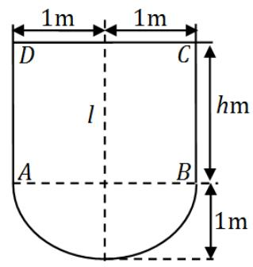

解. 建立坐标系如下图:

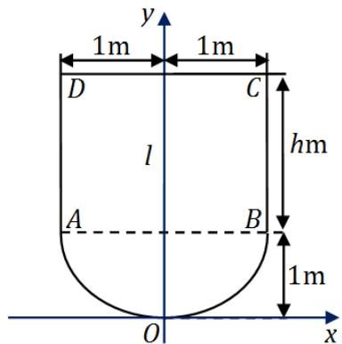

设底部抛物线为 $y = px^{2} + q$ ，由坐标轴的建立知此抛物线过(0,0),(1,1)点，代入抛物线的方程，解得 $q = 0, p = 1$ 。即底部抛物线是 $y = x^{2}$ （ $-1 \leqslant x \leqslant 1$ ）。已知压力 $=$ 压强 $\times$ 面积。设 $\rho$ 为水的密度， $g$ 为重力加速度，则平板ABCD上

所受的总压力为

$$
P _ {1} = \int_ {1} ^ {1 + h} 2 \rho g (1 + h - y) d y = \rho g h ^ {2},
$$

抛物板 $AOB$ 上所受的总压力为

$$
P _ {2} = \int_ {0} ^ {1} 2 \rho g (1 + h - y) \sqrt {y} d y = 4 \rho g \left(\frac {1}{3} h + \frac {2}{1 5}\right).
$$

由题意得

$$
P _ {1}: P _ {2} = 5: 4 \Rightarrow \frac {h ^ {2}}{4 \left(\frac {1}{3} h + \frac {2}{1 5}\right)} = \frac {5}{4}.
$$

解之得 $h = -\frac{1}{3}$ (舍去) 或 $h = 2$ (米), 即闸门矩形部分的高应为 $2m$ .

# 八、(本题满分8分)

设 $0 < x_{1} < 3$ ， $x_{n + 1} = \sqrt{x_n(3 - x_n)} (n = 1,2,\dots)$ ，证明数列 $\{x_{n}\}$ 的极限存在，并求此极限.

解. 先说明有界性: 由 $0 < x_{1} < 3$ 知 $x_{1}$ 及 $3 - x_{1}$ 均为正数, 故

$$
0 <   x _ {2} = \sqrt {x _ {1} (3 - x _ {1})} \leqslant \frac {1}{2} \left(x _ {1} + 3 - x _ {1}\right) = \frac {3}{2}.
$$

假设 $0 < x_{k} \leqslant \frac{3}{2}$ （ $k \geqslant 2$ ），则有

$$
x _ {k + 1} = \sqrt {x _ {k} (3 - x _ {k})} \leqslant \frac {1}{2} (x _ {k} + 3 - x _ {k}) = \frac {3}{2}.
$$

由数学归纳法知，对任意正整数 $n \geqslant 2$ 有 $0 < x_{n} \leqslant \frac{3}{2}$ ，即数列有界．再说明单调性：因为

$$
x _ {n + 1} - x _ {n} = \sqrt {x _ {n} (3 - x _ {n})} - x _ {n} \leqslant \frac {x _ {n} (3 - x _ {n}) - x _ {n} ^ {2}}{\sqrt {x _ {n} (3 - x _ {n})} + x _ {n}} = \frac {x _ {n} (3 - 2 x _ {n})}{\sqrt {x _ {n} (3 - x _ {n})} + x _ {n}} \geqslant 0,
$$

所以 $\{x_{n}\}$ 单调增加. 数列 $\{x_{n}\}$ 单调增加且有上界, 所以 $\lim_{n\to \infty}x_n$ 存在, 记为 $a$ . 由 $x_{n + 1} = \sqrt{x_n(3 - x_n)}$ 两边取极限得 $a = \sqrt{a(3 - a)}$ , 即 $2a^{2} - 3a = 0$ . 解得 $a = \frac{3}{2}$ 或 $a = 0$ , 但因 $x_{1} > 0$ 且单调增加, 故 $a \neq 0$ , 所以 $\lim_{n\to \infty}x_n = \frac{3}{2}$ .

# 九、(本题满分8分)

设 $0 < a < b$ ，证明不等式 $\frac{2a}{a^2 + b^2} < \frac{\ln b - \ln a}{b - a} < \frac{1}{\sqrt{ab}}.$

解. (I) 先证左边不等式．由拉格朗日中值定理．存在 $\xi \in (a,b)$ ，使得

$$
\left. \frac {\ln b - \ln a}{b - a} = (\ln x) ^ {\prime} \right| _ {x = \xi} = \frac {1}{\xi}.
$$

而 $\frac{1}{\xi} > \frac{1}{b} > \frac{2a}{a^2 + b^2}$ , 所以左边不等式成立.

(II) 再证右边不等式. 令

$$
\psi (x) = \ln x - \ln a - \frac {1}{\sqrt {a x}} (x - a),
$$

则有 $\psi(a) = 0$ , 及

$$
\psi^ {\prime} (x) = \frac {1}{x} - \frac {1}{\sqrt {a}} \left(\frac {1}{2 \sqrt {x}} + \frac {a}{2 x \sqrt {x}}\right) = - \frac {(\sqrt {x} - \sqrt {a}) ^ {2}}{2 x \sqrt {a x}} <   0.
$$

所以当 $x > a > 0$ 时， $\psi (x) <   0$ ，再以 $x = b$ 代入，得

$$
\ln b - \ln a <   \frac {1}{\sqrt {a b}} (b - a) \Rightarrow \frac {\ln b - \ln a}{b - a} <   \frac {1}{\sqrt {a b}}.
$$

从而右边不等式成立.

# 十、(本题满分8分)

设函数 $f(x)$ 在 $x = 0$ 的某邻域内具有二阶连续导数, 且 $f(0) \neq 0$ , $f'(0) \neq 0$ , $f''(0) \neq 0$ . 证明: 存在惟一的一组实数 $\lambda_1, \lambda_2, \lambda_3$ , 使得当 $h \to 0$ 时,

$$
\lambda_ {1} f (h) + \lambda_ {2} f (2 h) + \lambda_ {3} f (3 h) - f (0)
$$

是比 $h^2$ 高阶的无穷小.

解. 要证存在唯一的一组 $\lambda_{1}, \lambda_{2}, \lambda_{3}$ , 使得

$$
L = \lim  _ {h \rightarrow 0} \frac {\lambda_ {1} f (h) + \lambda_ {2} f (2 h) + \lambda_ {3} f (3 h) - f (0)}{h ^ {2}} = 0.
$$

由极限的四则运算法则知，分子极限应为0，即

$$
\lim  _ {h \rightarrow 0} \left[ \lambda_ {1} f (h) + \lambda_ {2} f (2 h) + \lambda_ {3} f (3 h) \right] = f (0)
$$

由 $f(0) \neq 0$ , 求得 $\lambda_{1} + \lambda_{2} + \lambda_{3} = 1$ . 再由洛必达法则得

$$
\begin{array}{l} L = \lim  _ {h \rightarrow 0} \frac {\lambda_ {1} f (h) + \lambda_ {2} f (2 h) + \lambda_ {3} f (3 h) - f (0)}{h ^ {2}} \\ = \lim  _ {h \rightarrow 0} \frac {\lambda_ {1} f ^ {\prime} (h) + 2 \lambda_ {2} f ^ {\prime} (2 h) + 3 \lambda_ {3} f ^ {\prime} (3 h)}{2 h}. \\ \end{array}
$$

由极限的四则运算法则知分子的极限应是 0 , 即

$$
\lim  _ {h \rightarrow 0} \left(\lambda_ {1} f ^ {\prime} (h) + 2 \lambda_ {2} f ^ {\prime} (2 h) + 3 \lambda_ {3} f ^ {\prime} (3 h)\right) = 0.
$$

由 $f^{\prime}(0) \neq 0$ , 求得 $\lambda_{1} + 2 \lambda_{2} + 3 \lambda_{3} = 0$ . 继续用洛必达法则, 由 $f^{\prime \prime}(x)$ 在 $x = 0$ 连续可得

$$
L = \lim  _ {h \rightarrow 0} \frac {\lambda_ {1} f ^ {\prime \prime} (h) + 4 \lambda_ {2} f ^ {\prime \prime} (2 h) + 9 \lambda_ {3} f ^ {\prime \prime} (3 h)}{2} = \frac {1}{2} (\lambda_ {1} + 4 \lambda_ {2} + 9 \lambda_ {3}) f ^ {\prime \prime} (0) = 0.
$$

由 $f^{\prime \prime}(0)\neq 0$ ，求得 $\lambda_1 + 4\lambda_2 + 9\lambda_3 = 0$ 所以 $\lambda_{1},\lambda_{2},\lambda_{3}$ 应满足

$$
\left\{ \begin{array}{l} \lambda_ {1} + \lambda_ {2} + \lambda_ {3} = 1, \\ \lambda_ {1} + 2 \lambda_ {2} + 3 \lambda_ {3} = 0, \\ \lambda_ {1} + 4 \lambda_ {2} + 9 \lambda_ {3} = 0. \end{array} \right.
$$

由于系数行列式 $\left| \begin{array}{lll}1 & 1 & 1\\ 1 & 2 & 3\\ 1 & 4 & 9 \end{array} \right| = 2\neq 0$ ，由克莱姆法则知，存在唯一的一组解满足题设要求，证毕.

注记：也可由泰勒公式求得 $\lambda_1, \lambda_2, \lambda_3$ 应满足的方程组.

# 十一、(本题满分6分)

已知 $A, B$ 为3阶矩阵，且满足 $2A^{-1}B = B - 4E$ ，其中 $E$ 是3阶单位矩阵. (I)证明：矩阵 $A - 2E$ 可逆；(II)若 $B = \begin{pmatrix} 1 & -2 & 0\\ 1 & 2 & 0\\ 0 & 0 & 2 \end{pmatrix}$ ，求矩阵 $A$

解. (I) 由题设条件 $2A^{-1}B = B - 4E$ , 两边左乘 $A$ , 整理得 $AB - 2B - 4A = 0$ . 所以

$$
(A - 2 E) (B - 4 E) = 8 E \Rightarrow (A - 2 E) \cdot \frac {1}{8} (B - 4 E) = E.
$$

根据可逆矩阵的定义知 $A - 2E$ 可逆，且 $(A - 2E)^{-1} = \frac{1}{8} (B - 4E)$

(II) 由 (I) 结果知 $A = 8(B - 4E)^{-1} + 2E$ . 而

$$
B - 4 E = \left( \begin{array}{r r r} - 3 & - 2 & 0 \\ 1 & - 2 & 0 \\ 0 & 0 & - 2 \end{array} \right) \Rightarrow (B - 4 E) ^ {- 1} = \left( \begin{array}{r r r} - \frac {1}{4} & \frac {1}{4} & 0 \\ - \frac {1}{8} & - \frac {3}{8} & 0 \\ 0 & 0 & - \frac {1}{2} \end{array} \right).
$$

代入 $A = 8(B - 4E)^{-1} + 2E$ 可得

$$
A = 8 (B - 4 E) ^ {- 1} + 2 E = \left( \begin{array}{r r r} 0 & 2 & 0 \\ - 1 & - 1 & 0 \\ 0 & 0 & - 2 \end{array} \right).
$$

# 十二、(本题满分6分)

同试卷一第九题.

# 二〇〇三年考研数学试卷二解答

# 一、填空题（本题共6小题，每小题4分，满分24分）

1. 若 $x \to 0$ 时, $(1 - ax^2)^{\frac{1}{4}} - 1$ 与 $x \sin x$ 是等价无穷小, 则 $a =$ ________.

解. 应填 -4. 由等价无穷小量代换可得

$$
1 = \lim  _ {x \rightarrow 0} \frac {(1 - a x ^ {2}) ^ {\frac {1}{4}}}{x \sin x} = \lim  _ {x \rightarrow 0} \frac {- \frac {1}{4} a x ^ {2}}{x ^ {2}} = - \frac {1}{4} a,
$$

从而 $a = -4$

2. 设函数 $y = f(x)$ 由方程 $xy + 2\ln x = y^4$ 所确定, 则曲线 $y = f(x)$ 在点 (1,1) 处的切线方程是

解. 应填 $x - y = 0$ . 对所给方程两边对 $x$ 求导数得

$$
y + x y ^ {\prime} + \frac {2}{x} = 4 y ^ {3} y ^ {\prime}.
$$

将 $x = 1, y = 1$ 代入上式，得 $y'(1) = 1$ 。故曲线在点 $(1,1)$ 处的切线方程为

$$
y - 1 = 1 \cdot (x - 1) \quad \Rightarrow \quad x - y = 0.
$$

3. $y = 2^{x}$ 的麦克劳林公式中 $x^n$ 项的系数是

解. 应填 $\frac{(\ln 2)^n}{n!}$ . 因为 $y^{(n)} = 2^x (\ln 2)^n$ , 所以 $y^{(n)}(0) = (\ln 2)^n$ , 从而所求系数为

$$
\frac {y ^ {(n)} (0)}{n !} = \frac {(\ln 2) ^ {n}}{n !}.
$$

4. 设曲线的极坐标方程为 $\rho = \mathrm{e}^{a\theta}$ ( $a > 0$ ), 则该曲线上相应于 $\theta$ 从 0 变到 $2\pi$ 的一段弧与极轴所围成的图形的面积为

解. 应填 $\frac{1}{4a} (e^{4\pi a} - 1)$ . 由极坐标下平面图形的面积公式得

$$
S = \frac {1}{2} \int_ {0} ^ {2 \pi} \rho^ {2} (\theta) d \theta = \frac {1}{2} \int_ {0} ^ {2 \pi} e ^ {2 a \theta} d \theta = \left[ \frac {1}{4 a} e ^ {2 a \theta} \right] _ {0} ^ {2 \pi} = \frac {1}{4 a} (e ^ {4 \pi a} - 1).
$$

5. 设 $\alpha$ 为3维向量, $\alpha^T$ 是 $\alpha$ 的转置. 若 $\alpha \alpha^T = \left( \begin{array}{rrr}1 & -1 & 1\\ -1 & 1 & -1\\ 1 & -1 & 1 \end{array} \right)$ , 则 $\alpha^T\alpha =$ ________.

解. 应填 3. 若矩阵的秩为 1 , 则可把它分解为一列乘一行的形式. 因为

$$
A = \alpha \alpha^ {T} = \left( \begin{array}{c c c} 1 & - 1 & 1 \\ - 1 & 1 & - 1 \\ 1 & - 1 & 1 \end{array} \right) = \left( \begin{array}{c} 1 \\ - 1 \\ 1 \end{array} \right) \left( \begin{array}{c c c} 1 & - 1 & 1 \end{array} \right),
$$

所以 $\alpha = \left( \begin{array}{l}1\\ -1\\ 1 \end{array} \right)$ ，于是 $\alpha^T\alpha = \left( \begin{array}{lll}1 & -1 & 1 \end{array} \right)\left( \begin{array}{l}1\\ -1\\ 1 \end{array} \right) = 3.$

6. 设三阶方阵 $A, B$ 满足 $A^2 B - A - B = E$ , 其中 $E$ 为三阶单位矩阵, 若 $A = \left( \begin{array}{rrr}1 & 0 & 1\\ 0 & 2 & 0\\ -2 & 0 & 1 \end{array} \right)$ , 则 $|B| =$ ________.

解. 应填 $\frac{1}{2}$ . 由 $A^2 B - A - B = E$ , 知 $(A + E)(A - E)B = A + E$ . 易知矩阵 $A + E$ 可逆,于是有 $(A - E)B = E$ . 两边取行列式得 $|A - E| \cdot |B| = 1$ , 所以

$$
| B | = | A - E | ^ {- 1} = \left| \begin{array}{c c c} 0 & 0 & 1 \\ 0 & 1 & 0 \\ - 2 & 0 & 0 \end{array} \right| ^ {- 1} = \frac {1}{2}.
$$

# 二、选择题（本题共6小题，每小题4分，满分24分）

1. 同试卷一第二[2]题

2. 设 $a_{n} = \frac{3}{2}\int_{0}^{\frac{n}{n + 1}}x^{n - 1}\sqrt{1 + x^n}\mathrm{d}x$ ，则极限 $\lim_{n\to \infty}na_n$ 等于…

(A) $(1 + e)^{\frac{3}{2}} + 1$ .

(B) $(1 + \mathrm{e}^{-1})^{\frac{3}{2}} - 1$

(C) $\left(1 + \mathrm{e}^{-1}\right)^{\frac{3}{2}} + 1$

(D) $(1 + e)^{\frac{3}{2}} - 1$ .

解. 应选 (B). 由换元积分法得

$$
\begin{array}{l} a _ {n} = \frac {3}{2} \int_ {0} ^ {\frac {n}{n + 1}} x ^ {n - 1} \sqrt {1 + x ^ {n}} d x = \frac {3}{2 n} \int_ {0} ^ {\frac {n}{n + 1}} \sqrt {1 + x ^ {n}} d (1 + x ^ {n}) \\ = \left[ \frac {1}{n} (1 + x ^ {n}) ^ {\frac {3}{2}} \right] _ {0} ^ {\frac {n}{n + 1}} = \frac {1}{n} \left(1 + \left(\frac {n}{n + 1}\right) ^ {n}\right) ^ {\frac {3}{2}} - \frac {1}{n}. \\ \end{array}
$$

由重要极限之二可得

$$
\lim  _ {n \rightarrow \infty} n a _ {n} = \lim  _ {n \rightarrow \infty} \left[\left(1 + \left(\frac {n}{n + 1}\right) ^ {n}\right) ^ {\frac {3}{2}} - 1 \right] = (1 + e ^ {- 1}) ^ {\frac {3}{2}} - 1.
$$

3. 已知 $y = \frac{x}{\ln x}$ 是微分方程 $y' = \frac{y}{x} + \phi\left(\frac{x}{y}\right)$ 的解，则 $\phi\left(\frac{x}{y}\right)$ 的表达式为……（）

(A) $-\frac{y^2}{x^2}$ .

(B) $\frac{y^2}{x^2}$ .

(C) $-\frac{x^2}{y^2}$ .

(D) $\frac{x^2}{y^2}$ .

解. 应选 (A). 由 $y = \frac{x}{\ln x}$ 得 $y' = \frac{\ln x - 1}{\ln^2 x}$ . 代入微分方程得

$$
\frac {\ln x - 1}{\ln^ {2} x} = \frac {1}{\ln x} + \phi (\ln x) \Rightarrow \phi (\ln x) = - \frac {1}{\ln^ {2} x} \Rightarrow \phi \left(\frac {x}{y}\right) = - \frac {y ^ {2}}{x ^ {2}}.
$$

4. 同试卷一第二[1]题

5. 设 $I_{1} = \int_{0}^{\frac{\pi}{4}} \frac{\tan x}{x} \, \mathrm{d}x$ , $I_{2} = \int_{0}^{\frac{\pi}{4}} \frac{x}{\tan x} \, \mathrm{d}x$ , 则

(A) $I_{1} > I_{2} > 1$

(B) $1 > I_{1} > I_{2}$

(C) $I_{2} > I_{1} > 1$

(D) $1 > I_{2} > I_{1}$

解. 应选 (B). 当 $x \in \left(0, \frac{\pi}{4}\right)$ 时 $\tan x > x > 0$ , $\frac{\tan x}{x} > 1$ , $\frac{x}{\tan x} < 1$ . 从而有

$$
I _ {1} = \int_ {0} ^ {\frac {\pi}{4}} \frac {\tan x}{x} d x > \frac {\pi}{4} > \int_ {0} ^ {\frac {\pi}{4}} \frac {x}{\tan x} d x = I _ {2}.
$$

利用 $I_{1} > I_{2}$ 且 $I_{2} < \frac{\pi}{4}$ ，可以排除选项(A)，(C)，(D). 也可以利用 $\frac{\tan x}{x}$ 在 $\left(0, \frac{\pi}{4}\right)$ 上单调增加直接得到 $I_{1} < 1$ .

6. 同试卷一第二[4]题

三、(本题满分10分)

$\begin{array}{l}\frac{\ln(1 + ax^3)}{x - \arcsin x},\\ 6,\\ \frac{\mathrm{e}^{ax} + x^2 - ax - 1}{x\sin\frac{x}{4}}, \end{array}$ $x <   0$ ；问 $a$ 为何值时， $f(x)$ 在 $x = 0$ 处连续； $x > 0$

$a$ 为何值时， $x = 0$ 是 $f(x)$ 的可去间断点？

解. 因为 $f(0) = 6$ , 而单侧极限为

$$
\begin{array}{l} f \left(0 ^ {-}\right) = \lim  _ {x \rightarrow 0 ^ {-}} f (x) = \lim  _ {x \rightarrow 0 ^ {-}} \frac {\ln \left(1 + a x ^ {3}\right)}{x - \arcsin x} = \lim  _ {x \rightarrow 0 ^ {-}} \frac {a x ^ {3}}{x - \arcsin x} \\ = \lim  _ {x \rightarrow 0 ^ {-}} \frac {3 a x ^ {2}}{1 - \frac {1}{\sqrt {1 - x ^ {2}}}} = \lim  _ {x \rightarrow 0 ^ {-}} \frac {3 a x ^ {2}}{\sqrt {1 - x ^ {2}} - 1} \cdot \lim  _ {x \rightarrow 0 ^ {-}} \sqrt {1 - x ^ {2}} = \lim  _ {x \rightarrow 0 ^ {-}} \frac {3 a x ^ {2}}{- \frac {1}{2} x ^ {2}} = - 6 a, \\ \end{array}
$$

$$
\begin{array}{l} f (0 ^ {+}) = \lim  _ {x \to 0 ^ {+}} f (x) = \lim  _ {x \to 0 ^ {+}} \frac {\mathrm {e} ^ {a x} + x ^ {2} - a x - 1}{x \sin \frac {x}{4}} = \lim  _ {x \to 0 ^ {+}} \frac {\mathrm {e} ^ {a x} + x ^ {2} - a x - 1}{\frac {x ^ {2}}{4}} \\ = 4 \lim  _ {x \rightarrow 0 ^ {+}} \frac {\mathrm {e} ^ {a x} + x ^ {2} - a x - 1}{x ^ {2}} = 4 \lim  _ {x \rightarrow 0 ^ {+}} \frac {a \mathrm {e} ^ {a x} + 2 x - a}{2 x} \\ = 4 \lim  _ {x \rightarrow 0 ^ {+}} \frac {a ^ {2} e ^ {a x} + 2}{2} = 2 \lim  _ {x \rightarrow 0 ^ {+}} (a ^ {2} e ^ {a x} + 2) = 2 a ^ {2} + 4. \\ \end{array}
$$

所以， $x = 0$ 为 $f(x)$ 的连续点当且仅当 $-6a = 6 = 2a^2 + 4$ ，即 $a = -1$ ； $x = 0$ 为 $f(x)$ 的可去间断点当且仅当 $-6a = 2a^2 + 4 \neq 6$ ，即 $2a^2 + 6a + 4 = 0$ 但 $a \neq -1$ 即 $a = -2$ .

四、(本题满分9分)

设函数 $y = y(x)$ 由参数方程 $\left\{ \begin{array}{l}x = 1 + 2t^2,\\ y = \int_1^{1 + 2\ln t}\frac{\mathrm{e}^u}{u}\mathrm{d}u \end{array} \right.$ （ $t > 1$ ）所确定，求 $\left.\frac{\mathrm{d}^2y}{\mathrm{d}x^2}\right|_{x = 9}$ .

解. 设 $x = \varphi(t) = 1 + 2t^2, y = \psi(t) = \int_{1}^{1 + 2\ln t} \frac{\mathrm{e}^u}{u} \, \mathrm{d}u$ ，则

$$
\frac {\mathrm {d} x}{\mathrm {d} t} = \varphi^ {\prime} (t) = 4 t, \quad \frac {\mathrm {d} y}{\mathrm {d} t} = \psi^ {\prime} (t) = \frac {\mathrm {e} ^ {1 + 2 \ln t}}{1 + 2 \ln t} \cdot \frac {2}{t} = \frac {\mathrm {e} \cdot t ^ {2}}{1 + 2 \ln t} \cdot \frac {2}{t} = \frac {2 \mathrm {e} t}{1 + 2 \ln t}.
$$

所以

$$
\frac {\mathrm {d} y}{\mathrm {d} x} = \frac {\frac {2 \mathrm {e} t}{1 + 2 \ln t}}{4 t} = \frac {\mathrm {e}}{2 (1 + 2 \ln t)},
$$

$$
\begin{array}{l} \frac {\mathrm {d} ^ {2} y}{\mathrm {d} x ^ {2}} = \frac {\mathrm {d}}{\mathrm {d} x} \left(\frac {\mathrm {d} y}{\mathrm {d} x}\right) = \frac {\mathrm {d}}{\mathrm {d} t} \left(\frac {\psi^ {\prime} (t)}{\varphi^ {\prime} (t)}\right) \cdot \frac {\mathrm {d} t}{\mathrm {d} x} = \left(\frac {\mathrm {e}}{2 (1 + 2 \ln t)}\right) ^ {\prime} \cdot \frac {1}{4 t} \\ = \frac {- 4 \mathrm {e} \frac {1}{t}}{4 (1 + 2 \ln t) ^ {2}} \cdot \frac {1}{4 t} = - \frac {\mathrm {e}}{4 t ^ {2} (1 + 2 \ln t) ^ {2}}. \\ \end{array}
$$

当 $x = 9$ 时，由 $x = 1 + 2t^{2}$ 及 $t > 1$ 得 $t = 2$ 故有

$$
\left. \frac {\mathrm {d} ^ {2} y}{\mathrm {d} x ^ {2}} \right| _ {x = 9} = - \frac {\mathrm {e}}{4 t ^ {2} (1 + 2 \ln t) ^ {2}} \Bigg | _ {t = 2} = - \frac {\mathrm {e}}{1 6 (1 + 2 \ln 2) ^ {2}}.
$$

# 五、（本题满分9分）

计算不定积分 $\int \frac{x\mathrm{e}^{\arctan x}}{(1 + x^2)^{3 / 2}}\mathrm{d}x.$

解. 作积分换元 $x = \tan t\left(-\frac{\pi}{2} < x < \frac{\pi}{2}\right)$ , 得到

$$
\int \frac {x \mathrm {e} ^ {\arctan x}}{(1 + x ^ {2}) ^ {3 / 2}} \mathrm {d} x = \int \frac {\mathrm {e} ^ {t} \tan t}{(1 + \tan^ {2} t) ^ {3 / 2}} \sec^ {2} t \mathrm {d} t = \int \mathrm {e} ^ {t} \frac {\tan t}{\sec t} \mathrm {d} t = \int \mathrm {e} ^ {t} \sin t \mathrm {d} t.
$$

又由分部积分法得到

$$
\begin{array}{l} \int \mathrm {e} ^ {t} \sin t \mathrm {d} t = - \int \mathrm {e} ^ {t} \mathrm {d} (\cos t) = - \mathrm {e} ^ {t} \cos t + \int \mathrm {e} ^ {t} \cos t \mathrm {d} t \\ = - \mathrm {e} ^ {t} \cos t + \int \mathrm {e} ^ {t} \mathrm {d} (\sin t) = - \mathrm {e} ^ {t} \cos t + \mathrm {e} ^ {t} \sin t - \int \mathrm {e} ^ {t} \sin t \mathrm {d} t. \\ \end{array}
$$

从而有

$$
\int \mathrm {e} ^ {t} \sin t \mathrm {d} t = \frac {1}{2} \mathrm {e} ^ {t} (\sin t - \cos t) + C.
$$

因此

$$
\int {\frac {x \mathrm {e} ^ {\arctan x}}{(1 + x ^ {2}) ^ {3 / 2}}} \mathrm {d} x = \frac {1}{2} \mathrm {e} ^ {\arctan x} \left(\frac {x}{\sqrt {1 + x ^ {2}}} - \frac {1}{\sqrt {1 + x ^ {2}}}\right) + C = \frac {(x - 1) \mathrm {e} ^ {\arctan x}}{2 \sqrt {1 + x ^ {2}}} + C.
$$

# 六、(本题满分12分)

同试卷一第七题.

# 七、(本题满分12分)

讨论曲线 $y = 4\ln x + k$ 与 $y = 4x + \ln^4 x$ 的交点个数.

解. 问题等价于讨论 $\phi(x) = \ln^4 x - 4\ln x + 4x - k$ 在区间 $(0, +\infty)$ 内的零点个数，对 $\phi(x)$ 求导得

$$
\phi^ {\prime} (x) = \frac {4 \ln^ {3} x}{x} - \frac {4}{x} + 4 = \frac {4}{x} (\ln^ {3} x - 1 + x).
$$

可以看出 $x = 1$ 是 $\phi (x)$ 的驻点，而且当 $0 < x < 1$ 时， $\phi '(x) < 0$ ，即 $\phi (x)$ 单调减少；当 $x > 1$ 时， $\phi '(x) > 0$ ，即 $\phi (x)$ 单调增加，故 $\phi (1) = 4 - k$ 为函数 $\phi (x)$ 的惟一极小值即最小值.

(I) 当 $\phi(1) = 4 - k > 0$ ，即当 $k < 4$ 时， $\phi(x) \geqslant \phi(1) > 0$ ， $\phi(x)$ 无零点.  
(II) 当 $\phi(1) = 4 - k = 0$ ，即当 $k = 4$ 时， $\phi(x) \geqslant \phi(1) = 0$ ， $\phi(x)$ 有且仅有一个零点. (III) 当 $\phi(1) = 4 - k < 0$ ，即当 $k > 4$ 时，由于

$$
\begin{array}{l} \lim  _ {x \rightarrow 0 ^ {+}} \phi (x) = \lim  _ {x \rightarrow 0 ^ {+}} [ \ln x (\ln^ {3} x - 4) + 4 x - k ] = + \infty , \\ \lim  _ {x \rightarrow + \infty} \phi (x) = \lim  _ {x \rightarrow + \infty} [ \ln x (\ln^ {3} x - 4) + 4 x - k ] = + \infty . \\ \end{array}
$$

由连续函数的介值定理和函数的单调性， $\phi(x)$ 有且仅有两个零点，分别位于区间 $(0,1)$ 与 $(1, +\infty)$ 内.

综上所述，当 $k < 4$ 时，两曲线没有交点；当 $k = 4$ 时，两曲线仅有一个交点；当 $k > 4$ 时，两曲线有两个交点.

# 八、(本题满分12分)

设位于第一象限的曲线 $y = f(x)$ 过点 $\left(\frac{\sqrt{2}}{2}, \frac{1}{2}\right)$ ，其上任一点 $P(x, y)$ 处的法线与 $y$ 轴的交点为 $Q$ ，且线段 $PQ$ 被 $x$ 轴平分.

(I) 求曲线 $y = f(x)$ 的方程；  
(II) 已知曲线 $y = \sin x$ 在 $[0, \pi]$ 上的弧长为 $l$ ，试用 $l$ 表示曲线 $y = f(x)$ 的弧长 $s$ .

解. (I) 曲线 $y = f(x)$ 在点 $P(x, y)$ 处的法线方程为

$$
Y - y = - \frac {1}{y ^ {\prime}} (X - x).
$$

令 $X = 0$ ，则它与 $y$ 轴的交点为 $Q\left(0, y + \frac{x}{y'}\right)$ 。由题设，线段 $PQ$ 被 $x$ 轴平分，从而

$$
\frac {1}{2} \left(y + y + \frac {x}{y ^ {\prime}}\right) = 0 \Rightarrow 2 y d y + x d x = 0.
$$

积分得 $\frac{x^2}{2} + y^2 = C$ （ $C$ 为任意常数），代入初始条件 $y\big|_{x = \frac{\sqrt{2}}{2}} = \frac{1}{2}$ 得 $C = \frac{1}{2}$ ，故曲线 $y = f(x)$ 的方程为 $\frac{x^2}{2} + y^2 = \frac{1}{2}$ ，即 $x^2 + 2y^2 = 1$ 。

(II) 曲线 $y = \sin x$ 在 $[0, \pi]$ 上的弧长为

$$
l = \int_ {0} ^ {\pi} \sqrt {1 + y ^ {\prime 2}} d x = \int_ {0} ^ {\pi} \sqrt {1 + \cos^ {2} x} d x
$$

$$
= \int_ {- \frac {\pi}{2}} ^ {\frac {\pi}{2}} \sqrt {1 + \cos^ {2} t} d t = 2 \int_ {0} ^ {\frac {\pi}{2}} \sqrt {1 + \cos^ {2} t} d t.
$$

另一方面，曲线 $y = f(x)$ 的参数方程为

$$
\left\{ \begin{array}{l} x = \cos t, \\ y = \frac {\sqrt {2}}{2} \sin t, \end{array} \right. \quad \left(0 \leqslant t \leqslant \frac {\pi}{2}\right).
$$

于是该曲线的弧长为（其中换元 $u = \frac{\pi}{2} - t$ ）

$$
\begin{array}{l} s = \int_ {0} ^ {\frac {\pi}{2}} \sqrt {(x _ {t} ^ {\prime}) ^ {2} + (y _ {t} ^ {\prime}) ^ {2}} d t = \int_ {0} ^ {\frac {\pi}{2}} \sqrt {\sin^ {2} t + \frac {1}{2} \cos^ {2} t} d t = \frac {1}{\sqrt {2}} \int_ {0} ^ {\frac {\pi}{2}} \sqrt {1 + \sin^ {2} t} d t \\ = \frac {1}{\sqrt {2}} \int_ {\frac {\pi}{2}} ^ {0} \sqrt {1 + \cos^ {2} u} (- \mathrm {d} u) = \frac {1}{\sqrt {2}} \int_ {0} ^ {\frac {\pi}{2}} \sqrt {1 + \cos^ {2} u} \mathrm {d} u \\ \end{array}
$$

所以 $s = \frac{\sqrt{2}}{4} l$

# 九、(本题满分10分)

有一平底容器，其内侧壁是由曲线 $x = \phi(y)$ （ $y \geqslant 0$ ）绕 $y$ 轴旋转而成的旋转曲面（如图），容器的底面圆的半径为 $2m$ 。根据设计要求，当以 $3m^3 / \min$ 的速率向容器内注入液体时，液面的面积将以 $\pi m^2 / \min$ 的速率均匀扩大（假设注入液体前，容器内无液体）。

(I) 根据 $t$ 时刻液面的面积, 写出 $t$ 与 $\phi(y)$ 之间的关系式;  
(II) 求曲线 $x = \phi(y)$ 的方程

(注: $m$ 表示长度单位米, $\min$ 表示时间单位分.)

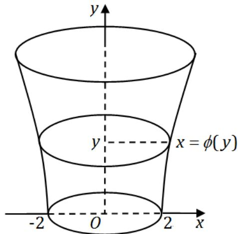

解. (I) 设在 $t$ 时刻液面的高度为 $y$ , 则此时液面的面积为 $\pi \phi^{2}(y) = 4 \pi + \pi t$ , 从而 $t = \phi^{2}(y) - 4$ .

(II) 液面的高度为 $y$ 时，液体的体积

$$
\pi \int_ {0} ^ {y} \phi^ {2} (u) d u = 3 t = 3 \phi^ {2} (y) - 1 2.
$$

上式两边对 $y$ 求导得

$$
\pi \phi^ {2} (y) = 6 \phi (y) \phi^ {\prime} (y) \Rightarrow \frac {d \phi (y)}{\mathrm {d} y} = \frac {\pi}{6} \phi (y).
$$

解此微分方程，得 $\phi (y) = C\mathrm{e}^{\frac{\pi}{6} y}$ ，其中 $C$ 为任意常数．由 $\phi (0) = 2$ 知 $C = 2$ 故所求曲线方程为 $x = 2\mathrm{e}^{\frac{\pi}{6} y}$

# 十、(本题满分10分)

设函数 $f(x)$ 在闭区间 $[a,b]$ 上连续，在开区间 $(a,b)$ 内可导，且 $f^{\prime}(x) > 0$ 若极限 $\lim_{x\to a^{+}}\frac{f(2x - a)}{x - a}$ 存在，证明：

(I) 在 $(a, b)$ 内 $f(x) > 0$   
(II) 在 $(a, b)$ 内存在点 $\xi$ , 使 $\frac{b^{2} - a^{2}}{\int_{a}^{b} f(x) \mathrm{d} x} = \frac{2 \xi}{f(\xi)}$ ;  
(III) 在 $(a, b)$ 内存在与 (2) 中 $\xi$ 相异的点 $\eta$ , 使 $f'(\eta)(b^2 - a^2) = \frac{2\xi}{\xi - a} \int_{a}^{b} f(x) \mathrm{d}x$ .

解. (I) 因为 $\lim_{x \to a^{+}} \frac{f(2x - a)}{x - a}$ 存在, 且 $\lim_{x \to a^{+}} (x - a) = 0$ , 故 $\lim_{x \to a^{+}} f(2x - a) = 0$ . 又 $f(x)$ 在 $[a, b]$ 上连续, 从而 $\lim_{x \to a^{+}} f(2x - a) = f(a)$ , 则 $f(a) = 0$ . 由于 $f'(x) > 0$ , 则 $f(x)$ 在 $(a, b)$ 内严格单调增加, 所以 $f(x)$ 在 $x = a$ 处取最小值, 即 $f(x) > f(a) = 0$ , $x \in (a, b)$ .

(II) 取 $F(x) = x^{2}$ , $g(x) = \int_{a}^{x} f(t) \mathrm{d}t (a \leqslant x \leqslant b)$ , 则 $g'(x) = f(x) > 0$ , 则 $F(x)$ , $g(x)$ 满足柯西中值定理的条件, 于是在 $(a, b)$ 内存在点 $\xi$ , 使

$$
\frac {F (b) - F (a)}{g (b) - g (a)} = \frac {b ^ {2} - a ^ {2}}{\int_ {a} ^ {b} f (t) \mathrm {d} t - \int_ {a} ^ {a} f (t) \mathrm {d} t} = \frac {2 \xi}{f (\xi)} \Rightarrow \frac {b ^ {2} - a ^ {2}}{\int_ {a} ^ {b} f (x) \mathrm {d} x} = \frac {2 \xi}{f (\xi)}.
$$

(III) 在区间 $[a, \xi]$ 上应用拉格朗日中值定理，得在 $(a, \xi)$ 内存在一点 $\eta$ ，使

$$
f (\xi) - f (a) = f ^ {\prime} (\eta) (\xi - a).
$$

因 $f(a) = 0$ ，上式即 $f(\xi) = f'(\eta)(\xi - a)$ ，代入 (II) 的结论得

$$
\frac {b ^ {2} - a ^ {2}}{\int_ {a} ^ {b} f (x) \mathrm {d} x} = \frac {2 \xi}{f ^ {\prime} (\eta) (\xi - a)} \Rightarrow f ^ {\prime} (\eta) (b ^ {2} - a ^ {2}) = \frac {2 \xi}{\xi - a} \int_ {a} ^ {b} f (x) \mathrm {d} x.
$$

# 十一、(本题满分10分)

若矩阵 $A = \begin{pmatrix} 2 & 2 & 0\\ 8 & 2 & a\\ 0 & 0 & 6 \end{pmatrix}$ 相似于对角阵 $\Lambda$ ，试确定常数 $a$ 的值；并求可逆矩阵 $P$ 使 $P^{-1}AP = \Lambda$

解. 矩阵 $A$ 的特征多项式为

$$
| \lambda E - A | = \left| \begin{array}{c c c} \lambda - 2 & - 2 & 0 \\ - 8 & \lambda - 2 & - a \\ 0 & 0 & \lambda - 6 \end{array} \right| = (\lambda - 6) [ (\lambda - 2) ^ {2} - 1 6 ] = (\lambda - 6) ^ {2} (\lambda + 2).
$$

故 $A$ 的特征值为 $\lambda_{1} = \lambda_{2} = 6, \lambda_{3} = -2$ . 由于 $A$ 相似于对角矩阵 $\Lambda$ , 故对应 $\lambda_{1} = \lambda_{2} = 6$ 应有两个线性无关的特征向量, 因此 $r(6E - A) = 1$ . 从而由

$$
6 E - A = \left( \begin{array}{c c c} 4 & - 2 & 0 \\ - 8 & 4 & - a \\ 0 & 0 & 0 \end{array} \right) \to \left( \begin{array}{c c c} 2 & - 1 & 0 \\ 0 & 0 & - a \\ 0 & 0 & 0 \end{array} \right)
$$

知 $a = 0$ ，于是对应于 $\lambda_1 = \lambda_2 = 6$ 的两个线性无关的特征向量可取为

$$
\xi_ {1} = \left( \begin{array}{c} 0 \\ 0 \\ 1 \end{array} \right), \qquad \xi_ {2} = \left( \begin{array}{c} 1 \\ 2 \\ 0 \end{array} \right).
$$

当 $\lambda_3 = -2$ 时，

$$
- 2 E - A = \left( \begin{array}{c c c} - 4 & - 2 & 0 \\ - 8 & - 4 & 0 \\ 0 & 0 & - 8 \end{array} \right) \to \left( \begin{array}{c c c} 2 & 1 & 0 \\ 0 & 0 & 1 \\ 0 & 0 & 0 \end{array} \right).
$$

解方程组 $\left\{ \begin{array}{l} 2x_{1} + x_{2} = 0, \\ x_{3} = 0, \end{array} \right.$ 得对应于 $\lambda_{3} = -2$ 的特征向量

$$
\xi_ {3} = \left( \begin{array}{c} 1 \\ - 2 \\ 0 \end{array} \right).
$$

令 $P = \left( \begin{array}{rrr}0 & 1 & 1\\ 0 & 2 & -2\\ 1 & 0 & 0 \end{array} \right)$ 则 $P$ 可逆，并有 $P^{-1}AP = \Lambda$

# 十二、(本题满分8分)

同试卷一第十题

# 二〇〇四年考研数学试卷二解答

# 一、填空题（1～6小题，每小题4分，共24分）

1. 设 $f(x) = \lim_{n\to \infty}\frac{(n - 1)x}{nx^2 + 1}$ ，则 $f(x)$ 的间断点为 $x =$

解. 应填 0 . 当 $x = 0$ 时, $f(x) = 0$ ; 而当 $x \neq 0$ 时,

$$
f (x) = \lim  _ {n \rightarrow \infty} \frac {(n - 1) x}{n x ^ {2} + 1} = \frac {x}{x ^ {2}} = \frac {1}{x},
$$

故 $x = 0$ 为 $f(x)$ 的间断点.

2. 设函数 $y(x)$ 由参数方程 $\left\{ \begin{array}{l} x = t^3 + 3t + 1 \\ y = t^3 - 3t + 1 \end{array} \right.$ 确定，则曲线 $y = y(x)$ 向上凸的 $x$ 取值范围为 _______.

解. 应填 $(-\infty, 1]$ . 由参数方程可得

$$
\begin{array}{l} \frac {\mathrm {d} y}{\mathrm {d} x} = \frac {\mathrm {d} y / \mathrm {d} t}{\mathrm {d} x / \mathrm {d} t} = \frac {3 t ^ {2} - 3}{3 t ^ {2} + 3} = \frac {t ^ {2} - 1}{t ^ {2} + 1} = 1 - \frac {2}{t ^ {2} + 1}, \\ \frac {\mathrm {d} ^ {2} y}{\mathrm {d} x ^ {2}} = \frac {\mathrm {d}}{\mathrm {d} t} \left(\frac {\mathrm {d} y}{\mathrm {d} x}\right) \frac {\mathrm {d} t}{\mathrm {d} x} = \left(1 - \frac {2}{t ^ {2} + 1}\right) ^ {\prime} \cdot \frac {1}{3 (t ^ {2} + 1)} = \frac {4 t}{(t ^ {2} + 1) ^ {2}} \cdot \frac {1}{3 (t ^ {2} + 1)} = \frac {4 t}{3 (t ^ {2} + 1) ^ {3}}. \\ \end{array}
$$

令 $\frac{\mathrm{d}^2y}{\mathrm{d}x^2} < 0, t < 0.$ 又 $x'(t) = 3t^2 + 3 > 0$ ，所以 $x(t)$ 单调增。当 $t = 0$ 时， $x = 1$ ，当 $t \to -\infty$ 时， $x \to -\infty$ 。从而 $x \in (-\infty, 1]$ 时，曲线是向上凸的。

3. $\int_{1}^{+\infty}\frac{\mathrm{d}x}{x\sqrt{x^2 - 1}} = \underline{\quad}$

解. 应填 $\frac{\pi}{2}$ . 令 $x = \sec t$ , 则有

$$
\int_ {1} ^ {+ \infty} \frac {\mathrm {d} x}{x \sqrt {x ^ {2} - 1}} = \int_ {0} ^ {\frac {\pi}{2}} \frac {\sec t \cdot \tan t}{\sec t \cdot \tan t} \mathrm {d} t = \int_ {0} ^ {\frac {\pi}{2}} \mathrm {d} t = \frac {\pi}{2}.
$$

4. 设函数 $z = z(x, y)$ 由方程 $z = \mathrm{e}^{2x - 3z} + 2y$ 确定，则 $3\frac{\partial z}{\partial x} + \frac{\partial z}{\partial y} =$

解. 应填 2. 令 $F(x, y, z) = \mathrm{e}^{2x - 3z} + 2y - z = 0$ , 则有

$$
\frac {\partial z}{\partial x} = - \frac {\frac {\partial F}{\partial x}}{\frac {\partial F}{\partial z}} = - \frac {\mathrm {e} ^ {2 x - 3 z} \cdot 2}{- (1 + 3 \mathrm {e} ^ {2 x - 3 z})} = \frac {2 \mathrm {e} ^ {2 x - 3 z}}{1 + 3 \mathrm {e} ^ {2 x - 3 z}},
$$

$$
\frac {\partial z}{\partial y} = - \frac {\frac {\partial F}{\partial y}}{\frac {\partial F}{\partial z}} = - \frac {2}{- (1 + 3 \mathrm {e} ^ {2 x - 3 z})} = \frac {2}{1 + 3 \mathrm {e} ^ {2 x - 3 z}}.
$$

从而 $3\frac{\partial z}{\partial x} + \frac{\partial z}{\partial y} = 2.$

5. 微分方程 $(y + x^3)\mathrm{d}x - 2x\mathrm{d}y = 0$ 满足 $y \big|_{x=1} = \frac{6}{5}$ 的特解为

解. 应填 $y = \frac{1}{5} x^3 + \sqrt{x}$ . 原方程变形为 $\frac{\mathrm{dy}}{\mathrm{dx}} - \frac{1}{2x} y = \frac{1}{2} x^2$ ，则由一阶线性微分方程的通解公式，可得（由初始条件可设 $x > 0$ ）

$$
\begin{array}{l} y = \mathrm {e} ^ {\int \frac {1}{2 x} \mathrm {d} x} \left[ \int \frac {1}{2} x ^ {2} \mathrm {e} ^ {- \int \frac {1}{2 x} \mathrm {d} x} \mathrm {d} x + C \right] = \mathrm {e} ^ {\frac {1}{2} \ln x} \left[ \int \frac {1}{2} x ^ {2} \mathrm {e} ^ {- \frac {1}{2} \ln x} \mathrm {d} x + C \right] \\ = \sqrt {x} \left[ \int \frac {1}{2} x ^ {\frac {3}{2}} d x + C \right] = \sqrt {x} \left[ \frac {1}{5} x ^ {\frac {5}{2}} + C \right]. \\ \end{array}
$$

再由 $y(1) = \frac{6}{5}$ 得 $C = 1$ ，从而特解为 $y = \frac{1}{5} x^3 + \sqrt{x}$ .

6. 同试卷一第一[5]题

# 二、选择题（7～14小题，每小题4分，共32分）

7. 同试卷一第二[7]题  
8. 设 $f(x) = |x(1 - x)|$ ，则

(A) $x = 0$ 是 $f(x)$ 的极值点，但 $(0,0)$ 不是曲线 $y = f(x)$ 的拐点.  
(B) $x = 0$ 不是 $f(x)$ 的极值点, 但 $(0,0)$ 是曲线 $y = f(x)$ 的拐点.  
(C) $x = 0$ 是 $f(x)$ 的极值点，且 $(0,0)$ 是曲线 $y = f(x)$ 的拐点.  
(D) $x = 0$ 不是 $f(x)$ 的极值点, $(0,0)$ 也不是曲线 $y = f(x)$ 的拐点.

解. 应选 (C). 由于 $f(x) = |x(1 - x)| \geqslant 0 = f(0)$ ，所以 $x = 0$ 为极小值点．又

$$
f (x) = \left\{ \begin{array}{l l} - x (1 - x), & - 1 <   x \leqslant 0; \\ x (1 - x), & 0 <   x <   1. \end{array} \right. \Rightarrow f ^ {\prime \prime} (x) = \left\{ \begin{array}{l l} 2, & - 1 <   x <   0; \\ - 2, & 0 <   x <   1. \end{array} \right.
$$

于是 $(0,0)$ 为拐点.

9. $\lim_{n\to \infty}\ln{\sqrt[n]{\left(1 + \frac{1}{n}\right)^2\left(1 + \frac{2}{n}\right)^2\cdots\left(1 + \frac{n}{n}\right)^2}}$ 等于

(A) $\int_{1}^{2}\ln^{2}x\mathrm{d}x.$

(B) $2\int_{1}^{2}\ln x\mathrm{d}x$

(C) $2\int_{1}^{2}\ln (1 + x)\mathrm{d}x.$

(D) $\int_{1}^{2}\ln^{2}(1 + x)\mathrm{d}x.$

解. 应选 (B). 由对数性质和定积分的定义可得

$$
\begin{array}{l} \lim  _ {n \rightarrow \infty} \ln \sqrt {\left(1 + \frac {1}{n}\right) ^ {2} \left(1 + \frac {2}{n}\right) ^ {2} \cdots \left(1 + \frac {n}{n}\right) ^ {2}} \\ = \lim  _ {n \rightarrow \infty} \frac {2}{n} \left[ \ln \left(1 + \frac {1}{n}\right) + \ln \left(1 + \frac {2}{n}\right) + \dots + \ln \left(1 + \frac {n}{n}\right)\right] \\ = \lim  _ {n \rightarrow \infty} 2 \sum_ {i = 1} ^ {n} \ln \left(1 + \frac {i}{n}\right) \frac {1}{n} = 2 \int_ {0} ^ {1} \ln (1 + x) d x = 2 \int_ {1} ^ {2} \ln t d t = 2 \int_ {1} ^ {2} \ln x d x. \\ \end{array}
$$

10. 同试卷一第二[8]题

11. 微分方程 $y'' + y = x^2 + 1 + \sin x$ 的特解形式可设为……（）

(A) $y^{*} = ax^{2} + bx + c + x (A \sin x + B \cos x)$ .   
(B) $y^{*} = x(ax^{2} + bx + c + A\sin x + B\cos x).$   
(C) $y^{*} = ax^{2} + bx + c + A\sin x$ .   
(D) $y^{*} = ax^{2} + bx + c + A\cos x$ .

解. 应选 (A). 原方程对应的齐次方程 $y'' + y = 0$ 的特征方程为 $\lambda^2 + 1 = 0$ , 则特征根为 $\lambda = \pm i$ . 对 $y'' + y = x^2 + 1$ , 其特解形式可设为 $y_1^* = ax^2 + bx + c$ ; 对 $y'' + y = \sin x$ , 其特解形式可设为 $y_2^* = x(A \sin x + B \cos x)$ . 由叠加原理, 方程 $y'' + y = x^2 + 1 + \sin x$ 的特解形式可设为

$$
y ^ {*} = y _ {1} ^ {*} + y _ {2} ^ {*} = a x ^ {2} + b x + c + x (A \sin x + B \cos x).
$$

12. 设函数 $f(u)$ 连续, 区域 $D = \{(x,y)|x^2 + y^2 \leqslant 2y\}$ , 则 $\iint_{D} f(xy) \, \mathrm{d}x \, \mathrm{d}y$ 等于( )

(A) $\int_{-1}^{1}\mathrm{d}x\int_{-\sqrt{1 - x^2}}^{\sqrt{1 - x^2}}f(xy)\mathrm{d}y.$

(B) $2\int_{0}^{2}\mathrm{d}y\int_{0}^{\sqrt{2y - y^2}}f(xy)\mathrm{d}x.$

(C) $\int_0^\pi \mathrm{d}\theta \int_0^{2\sin \theta}f(r^2\sin \theta \cos \theta)\mathrm{d}r.$

(D) $\int_0^\pi \mathrm{d}\theta \int_0^{2\sin \theta}f(r^2\sin \theta \cos \theta)r\mathrm{d}r.$

解. 应选 (D). 由 $D = \left\{(x, y) \mid x^2 + y^2 \leqslant 2y\right\}$ , 则积分区域是以 (0,1) 为圆心, 1 为半径的圆及其内部, 积分区域见图.

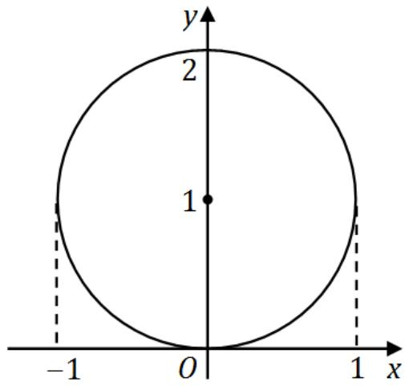

在直角坐标系下，先 $x$ 后 $y$ ，则有

$$
\iint_ {D} f (x y) \mathrm {d} x \mathrm {d} y = \int_ {0} ^ {2} \mathrm {d} y \int_ {- \sqrt {2 y - y ^ {2}}} ^ {\sqrt {2 y - y ^ {2}}} f (x y) \mathrm {d} x.
$$

先 $y$ 后 $x$ ，则有

$$
\iint_ {D} f (x y) \mathrm {d} x \mathrm {d} y = \int_ {- 1} ^ {1} \mathrm {d} x \int_ {1 - \sqrt {1 - x ^ {2}}} ^ {1 + \sqrt {1 - x ^ {2}}} f (x y) \mathrm {d} y.
$$

在极坐标系下，则有

$$
\iint_ {D} f (x y) \mathrm {d} x \mathrm {d} y = \int_ {0} ^ {\pi} \mathrm {d} \theta \int_ {0} ^ {2 \sin \theta} f \left(r ^ {2} \sin \theta \cos \theta\right) r \mathrm {d} r.
$$

13. 同试卷一第二[11]题  
14. 同试卷一第二[12]题

# 三、解答题（15～23小题，共94分）

15. (本题满分 10 分)

求极限 $\lim_{x\to 0}\frac{1}{x^3}\left[\left(\frac{2 + \cos x}{3}\right)^x -1\right].$

解. 由等价无穷小量代换可得

原式 $= \lim_{x\to 0}\frac{\mathrm{e}^{x\ln\left(\frac{2 + \cos x}{3}\right)} - 1}{x^3} = \lim_{x\to 0}\frac{\ln\left(\frac{2 + \cos x}{3}\right)}{x^2} = \lim_{x\to 0}\frac{\ln\left(1 + \frac{\cos x - 1}{3}\right)}{x^2}$

$$
= \lim  _ {x \rightarrow 0} \frac {\cos x - 1}{3 x ^ {2}} = - \lim  _ {x \rightarrow 0} \frac {1 - \cos x}{3 x ^ {2}} = - \lim  _ {x \rightarrow 0} \frac {\frac {x ^ {2}}{2}}{3 x ^ {2}} = - \frac {1}{6}.
$$

16. (本题满分 10 分)

设函数 $f(x)$ 在 $(- \infty, + \infty)$ 上有定义，在区间 $[0,2]$ 上， $f(x) = x(x^{2} - 4)$ ，若对任意的 $x$ 都满足 $f(x) = kf(x + 2)$ ，其中 $k$ 为常数.

(I) 写出 $f(x)$ 在 $[-2,0]$ 上的表达式；  
(II) 问 $k$ 为何值时， $f(x)$ 在 $x = 0$ 处可导

解. (I) 当 $-2 \leqslant x < 0$ , 即 $0 \leqslant x + 2 < 2$ 时,

$$
f (x) = k f (x + 2) = k (x + 2) [ (x + 2) ^ {2} - 4 ] = k x (x + 2) (x + 4).
$$

(II) 由题设 $f(0) = 0$ ,

$$
\begin{array}{l} f _ {+} ^ {\prime} (0) = \lim  _ {x \rightarrow 0 ^ {+}} \frac {f (x) - f (0)}{x - 0} = \lim  _ {x \rightarrow 0 ^ {+}} \frac {x \left(x ^ {2} - 4\right) - 0}{x} = - 4, \\ f _ {-} ^ {\prime} (0) = \lim  _ {x \rightarrow 0 ^ {-}} \frac {f (x) - f (0)}{x - 0} = \lim  _ {x \rightarrow 0 ^ {-}} \frac {k x (x + 2) (x + 4) - 0}{x} = 8 k. \\ \end{array}
$$

令 $f_{-}^{\prime}(0) = f_{+}^{\prime}(0)$ ，得 $k = -\frac{1}{2}$ 。即当 $k = -\frac{1}{2}$ 时， $f(x)$ 在 $x = 0$ 处可导。

17. (本题满分11分)

设 $f(x) = \int_{x}^{x + \frac{\pi}{2}}|\sin t|\mathrm{d}t.$

(I) 证明 $f(x)$ 是以 $\pi$ 为周期的周期函数；(II) 求 $f(x)$ 的值域.

解. (I) 令 $t = u + \pi$ . 则有

$$
\begin{array}{l} f (x + \pi) = \int_ {x + \pi} ^ {x + \frac {3 \pi}{2}} | \sin t | d t = \int_ {x} ^ {x + \frac {\pi}{2}} | \sin (u + \pi) | d (u + \pi) \\ = \int_ {x} ^ {x + \frac {\pi}{2}} | \sin u | \mathrm {d} u = f (x) \\ \end{array}
$$

故 $f(x)$ 是以 $\pi$ 为周期的周期函数

(II) 因为 $f(x)$ 是以 $\pi$ 为周期的周期函数，故只需在 $[0, \pi]$ 上讨论其值域．令

$$
f ^ {\prime} (x) = \left| \sin (x + \frac {\pi}{2}) \right| - | \sin x | = | \cos x | - | \sin x | = 0,
$$

在区间 $[0, \pi]$ 内求得驻点 $x_{1} = \frac{\pi}{4}, x_{2} = \frac{3\pi}{4}$ . 计算

$$
f \left(\frac {\pi}{4}\right) = \int_ {\frac {\pi}{4}} ^ {\frac {3 \pi}{4}} | \sin t | \mathrm {d} t = \int_ {\frac {\pi}{4}} ^ {\frac {3 \pi}{4}} \sin t \mathrm {d} t = \sqrt {2},
$$

$$
f \left(\frac {3 \pi}{4}\right) = \int_ {\frac {3 \pi}{4}} ^ {\frac {5 \pi}{4}} | \sin t | \mathrm {d} t = \int_ {\frac {3 \pi}{4}} ^ {\pi} \sin t \mathrm {d} t - \int_ {\pi} ^ {\frac {5 \pi}{4}} \sin t \mathrm {d} t = 2 - \sqrt {2},
$$

$$
f (0) = \int_ {0} ^ {\frac {\pi}{2}} | \sin t | \mathrm {d} t = \int_ {0} ^ {\frac {\pi}{2}} \sin t \mathrm {d} t = 1,
$$

$$
f (\pi) = \int_ {\pi} ^ {\frac {3 \pi}{2}} | \sin t | \mathrm {d} t = \int_ {\pi} ^ {\frac {3 \pi}{2}} (- \sin t) \mathrm {d} t = 1.
$$

因此 $f(x)$ 的最小值是 $2 - \sqrt{2}$ , 最大值是 $\sqrt{2}$ . 故 $f(x)$ 的值域是 $[2 - \sqrt{2}, \sqrt{2}]$ .

# 18. (本题满分 12 分)

曲线 $y = \frac{\mathrm{e}^{x} + \mathrm{e}^{-x}}{2}$ 与直线 $x = 0, x = t (t > 0)$ 及 $y = 0$ 围成一曲边梯形。该曲边梯形绕 $x$ 轴旋转一周得一旋转体，其体积为 $V(t)$ ，侧面积为 $S(t)$ ，在 $x = t$ 处的底面积为 $F(t)$ 。

(I) 求 $\frac{S(t)}{V(t)}$ 的值；(II) 计算极限 $\lim_{t \to +\infty} \frac{S(t)}{F(t)}$ .

解. (I) 旋转体体积

$$
V (t) = \pi \int_ {0} ^ {t} y ^ {2} \mathrm {d} x = \pi \int_ {0} ^ {t} \left(\frac {\mathrm {e} ^ {x} + \mathrm {e} ^ {- x}}{2}\right) ^ {2} \mathrm {d} x,
$$

旋转体的侧面积

$$
\begin{array}{l} S (t) = \int_ {0} ^ {t} 2 \pi y \sqrt {1 + y ^ {\prime 2}} \mathrm {d} x = 2 \pi \int_ {0} ^ {t} \left(\frac {\mathrm {e} ^ {x} + \mathrm {e} ^ {- x}}{2}\right) \sqrt {1 + \left(\frac {\mathrm {e} ^ {x} - \mathrm {e} ^ {- x}}{2}\right) ^ {2}} \mathrm {d} x \\ = 2 \pi \int_ {0} ^ {t} \left(\frac {\mathrm {e} ^ {x} + \mathrm {e} ^ {- x}}{2}\right) \sqrt {\left(\frac {\mathrm {e} ^ {x} + \mathrm {e} ^ {- x}}{2}\right) ^ {2}} \mathrm {d} x = 2 \pi \int_ {0} ^ {t} \left(\frac {\mathrm {e} ^ {x} + \mathrm {e} ^ {- x}}{2}\right) ^ {2} \mathrm {d} x, \\ \end{array}
$$

所以 $\frac{S(t)}{V(t)} = 2$ .

(II) 在 $x = t$ 处旋转体的底面积为

$$
F (t) = \left. \pi y ^ {2} \right| _ {x = t} = \pi \left(\frac {\mathrm {e} ^ {t} + \mathrm {e} ^ {- t}}{2}\right) ^ {2},
$$

所以由洛必达法则有

$$
\begin{array}{l} \lim  _ {t \rightarrow + \infty} \frac {S (t)}{F (t)} = \lim  _ {t \rightarrow + \infty} \frac {2 \pi \int_ {0} ^ {t} \left(\frac {\mathrm {e} ^ {x} + \mathrm {e} ^ {- x}}{2}\right) ^ {2} \mathrm {d} x}{\pi \left(\frac {\mathrm {e} ^ {t} + \mathrm {e} ^ {- t}}{2}\right) ^ {2}} = \lim  _ {t \rightarrow + \infty} \frac {2 \left(\frac {\mathrm {e} ^ {t} + \mathrm {e} ^ {- t}}{2}\right) ^ {2}}{2 \left(\frac {\mathrm {e} ^ {t} + \mathrm {e} ^ {- t}}{2}\right)\left(\frac {\mathrm {e} ^ {t} - \mathrm {e} ^ {- t}}{2}\right)} \\ = \lim  _ {t \rightarrow + \infty} \frac {\mathrm {e} ^ {t} + \mathrm {e} ^ {- t}}{\mathrm {e} ^ {t} - \mathrm {e} ^ {- t}} = \lim  _ {t \rightarrow + \infty} \frac {1 + \mathrm {e} ^ {- 2 t}}{1 - \mathrm {e} ^ {- 2 t}} = 1. \\ \end{array}
$$

19. 同试卷一第三[15]题.  
20. 同试卷一第三[16]题  
21. (本题满分 10 分)

设 $z = f(x^{2} - y^{2},\mathrm{e}^{xy})$ ，其中 $f$ 具有连续二阶偏导数，求 $\frac{\partial z}{\partial x},\frac{\partial z}{\partial y},\frac{\partial^2z}{\partial x\partial y}.$

解. 令 $u = x^{2} - y^{2}, \nu = \mathrm{e}^{xy}$ , 则 $z = f(x^{2} - y^{2}, \mathrm{e}^{xy}) = f(u, \nu)$ , 所以

$$
\begin{array}{l} \frac {\partial z}{\partial x} = \frac {\partial f}{\partial u} \frac {\partial u}{\partial x} + \frac {\partial f}{\partial v} \frac {\partial v}{\partial x} = 2 x f _ {1} ^ {\prime} + y \mathrm {e} ^ {x y} f _ {2} ^ {\prime}, \\ \frac {\partial z}{\partial y} = \frac {\partial f}{\partial u} \frac {\partial u}{\partial y} + \frac {\partial f}{\partial v} \frac {\partial v}{\partial y} = - 2 y f _ {1} ^ {\prime} + x \mathrm {e} ^ {x y} f _ {2} ^ {\prime}. \\ \end{array}
$$

从而二阶偏导数

$$
\begin{array}{l} \frac {\partial^ {2} z}{\partial x \partial y} = \frac {\partial}{\partial x} \left(\frac {\partial z}{\partial y}\right) = \frac {\partial}{\partial x} \left(- 2 y f _ {1} ^ {\prime} + x e ^ {x y} f _ {2} ^ {\prime}\right) \\ = - 2 y \left(f _ {1 1} ^ {\prime \prime} \frac {\partial u}{\partial x} + f _ {1 2} ^ {\prime \prime} \frac {\partial v}{\partial x}\right) + e ^ {x y} f _ {2} ^ {\prime} + x y e ^ {x y} f _ {2} ^ {\prime} + x e ^ {x y} \left(f _ {2 1} ^ {\prime \prime} \frac {\partial u}{\partial x} + f _ {2 2} ^ {\prime \prime} \frac {\partial v}{\partial x}\right) \\ = - 2 y \left(2 x f _ {1 1} ^ {\prime \prime} + y \mathrm {e} ^ {x y} f _ {1 2} ^ {\prime \prime}\right) + \mathrm {e} ^ {x y} f _ {2} ^ {\prime} + x y \mathrm {e} ^ {x y} f _ {2} ^ {\prime} + x \mathrm {e} ^ {x y} \left(2 x f _ {2 1} ^ {\prime \prime} + y \mathrm {e} ^ {x y} f _ {2 2} ^ {\prime \prime}\right) \\ = - 4 x y f _ {1 1} ^ {\prime \prime} + 2 \left(x ^ {2} - y ^ {2}\right) \mathrm {e} ^ {x y} f _ {1 2} ^ {\prime \prime} + + x y \mathrm {e} ^ {2 x y} f _ {2 2} ^ {\prime \prime} + \mathrm {e} ^ {x y} (1 + x y) f _ {2} ^ {\prime}. \\ \end{array}
$$

22. (本题满分9分)

设有齐次线性方程组

$$
\left\{ \begin{array}{l l} & (1 + a) x _ {1} + x _ {2} + x _ {3} + x _ {4} = 0, \\ & 2 x _ {1} + (2 + a) x _ {2} + 2 x _ {3} + 2 x _ {4} = 0, \\ & 3 x _ {1} + 3 x _ {2} + (3 + a) x _ {3} + 3 x _ {4} = 0, \\ & 4 x _ {1} + 4 x _ {2} + 4 x _ {3} + (4 + a) x _ {4} = 0. \end{array} \right.
$$

试问 $a$ 取何值时，该方程组有非零解，并求出其通解

解. 对方程组的系数矩阵 $A$ 作初等行变换, 有

$$
A = \left( \begin{array}{c c c c} 1 + a & 1 & 1 & 1 \\ 2 & 2 + a & 2 & 2 \\ 3 & 3 & 3 & 3 \\ 4 & 4 & 4 & 4 + a \end{array} \right) \to \left( \begin{array}{c c c c} 1 + a & 1 & 1 & 1 \\ - 2 a & a & 0 & 0 \\ - 3 a & 0 & a & 0 \\ - 4 a & 0 & 0 & a \end{array} \right) = B.
$$

当 $a = 0$ 时， $r(A) = 1 < 4$ ，故次方程组有非零解。其同解方程组为

$$
x _ {1} + x _ {2} + x _ {3} + x _ {4} = 0,
$$

由此得基础解系为

$$
\eta_ {1} = (- 1, 1, 0, 0) ^ {T}, \quad \eta_ {2} = (- 1, 0, 1, 0) ^ {T}, \quad \eta_ {3} = (- 1, 0, 0, 1) ^ {T}.
$$

于是方程组的通解为 $x = k_{1}\eta_{1} + k_{2}\eta_{2} + k_{3}\eta_{3}$ , 其中 $k_{1}, k_{2}, k_{3}$ 为任意常数. 当 $a \neq 0$ 时, 对矩阵 $B$ 作初等行变换, 有

$$
B \rightarrow \left(\begin{array}{c c c c}1 + a&1&1&1\\- 2&1&0&0\\- 3&0&1&0\\- 4&0&0&1\end{array}\right)\rightarrow \left(\begin{array}{c c c c}a + 1 0&0&0&0\\- 2&1&0&0\\- 3&0&1&0\\- 4&0&0&1\end{array}\right),
$$

可知 $a = -10$ 时, $r(A) = 3 < 4$ , 故此方程组也有非零解. 其同解方程组为

$$
\left\{ \begin{array}{l} - 2 x _ {1} + x _ {2} = 0, \\ - 3 x _ {1} + x _ {3} = 0, \\ - 4 x _ {1} + x _ {4} = 0, \end{array} \right.
$$

由此得基础解系为 $\eta = (1,2,3,4)^T$ ，于是方程组的通解为 $x = k\eta$ ，其中 $k$ 为任意常数.

23. 同试卷一第三[21]题

# 二〇〇五年考研数学试卷二解答

# 一、填空题（1～6小题，每小题4分，共24分）

1. 设 $y = (1 + \sin x)^x$ ，则 $\left.\mathrm{d}y\right|_{x = \pi} =$

解. 应填 $-\pi \mathrm{d}x$ ．两边取对数得 $\ln y = x \ln (1 + \sin x)$ ，对 $x$ 求导得

$$
\frac {1}{y} \cdot y ^ {\prime} = \ln (1 + \sin x) + \frac {x \cos x}{1 + \sin x},
$$

于是导函数

$$
y ^ {\prime} = (1 + \sin x) ^ {x} \cdot \left[ \ln (1 + \sin x) + x \cdot \frac {\cos x}{1 + \sin x} \right].
$$

故 $\mathrm{d}y\big|_{x = \pi} = y'(\pi)\mathrm{d}x = -\pi \mathrm{d}x.$

2. 曲线 $y = \frac{(1 + x)^{3/2}}{\sqrt{x}}$ 的斜渐近线方程为

解. 应填 $y = x + \frac{3}{2}$ . 由求斜渐近线公式得:

$$
k = \lim  _ {x \rightarrow + \infty} \frac {f (x)}{x} = \lim  _ {x \rightarrow + \infty} \frac {(1 + x) ^ {3 / 2}}{x \sqrt {x}} = 1,
$$

$$
b = \lim  _ {x \rightarrow + \infty} [ f (x) - k x ] = \lim  _ {x \rightarrow + \infty} \frac {(1 + x) ^ {3 / 2} - x ^ {3 / 2}}{\sqrt {x}} = \frac {3}{2},
$$

于是所求斜渐近线方程为 $y = x + \frac{3}{2}$

3. $\int_0^1\frac{x\mathrm{d}x}{(2 - x^2)\sqrt{1 - x^2}} = \underline{\quad}$

解. 应填 $\frac{\pi}{4}$ . 令 $\sqrt{1 - x^2} = t$ , 有 $x^2 = 1 - t^2$ , $x \, \mathrm{d}x = -t \, \mathrm{d}t$ . 从而

$$
\int_ {0} ^ {1} \frac {x \mathrm {d} x}{(2 - x ^ {2}) \sqrt {1 - x ^ {2}}} = \int_ {0} ^ {1} \frac {\mathrm {d} t}{1 + t ^ {2}} = [ \arctan t ] _ {0} ^ {1} = \frac {\pi}{4}.
$$

4. 同试卷一第一[2]题

5. 当 $x \to 0$ 时, $\alpha(x) = k x^{2}$ 与 $\beta(x) = \sqrt{1 + x \arcsin x} - \sqrt{\cos x}$ 是等价无穷小, 则 $k =$

解. 应填 $\frac{3}{4}$ . 由题设,

$$
\begin{array}{l} 1 = \lim  _ {x \rightarrow 0} \frac {\sqrt {1 + x \arcsin x} - \sqrt {\cos x}}{k x ^ {2}} = \lim  _ {x \rightarrow 0} \frac {x \arcsin x + 1 - \cos x}{k x ^ {2} (\sqrt {1 + x \arcsin x} + \sqrt {\cos x})} \\ = \frac {1}{2 k} \lim  _ {x \rightarrow 0} \frac {x \arcsin x + 1 - \cos x}{x ^ {2}} = \frac {1}{2 k} \left[ \lim  _ {x \rightarrow 0} \frac {\arcsin x}{x} + \lim  _ {x \rightarrow 0} \frac {1 - \cos x}{x ^ {2}} \right] \\ = \frac {1}{2 k} \left(1 + \frac {1}{2}\right) = \frac {3}{4 k}, \\ \end{array}
$$

所以 $k = \frac{3}{4}$

6. 同试卷一第一[5]题.

# 二、选择题（7～14小题，每小题4分，共32分）

7. 同试卷一第二[7]题

8. 同试卷一第二[8]题

9. 设函数 $y = y(x)$ 由参数方程 $\left\{ \begin{array}{l} x = t^2 + 2t, \\ y = \ln(1 + t) \end{array} \right.$ 确定，则曲线 $y = y(x)$ 在 $x = 3$ 处的法线与 $x$ 轴交点的横坐标是……（）

(A) $\frac{1}{8} \ln 2 + 3$ .

(B) $-\frac{1}{8}\ln 2 + 3.$

(C) $-8\ln 2 + 3$

(D) $8\ln 2 + 3$

解. 应选 (A). 当 $x = 3$ 时, 有 $t^{2} + 2t = 3$ , 得 $t = -3$ (舍去) 或 $t = 1$ . 曲线 $y = y(x)$ 的导数为

$$
\frac {\mathrm {d} y}{\mathrm {d} x} = \frac {\frac {\mathrm {d} y}{\mathrm {d} t}}{\frac {\mathrm {d} x}{\mathrm {d} t}} = \frac {\frac {1}{1 + t}}{2 t + 2} = \frac {1}{2 (t + 1) ^ {2}},
$$

所以曲线 $y = y(x)$ 在 $x = 3$ （即 $t = 1$ ）处的切线斜率为 $\frac{1}{8}$ . 于是在该处的法线的斜率为 -8, 所以过点 (3, ln2) 的法线方程为

$$
y - \ln 2 = - 8 (x - 3).
$$

令 $y = 0$ ，得其与 $x$ 轴交点的横坐标为 $\frac{1}{8}\ln 2 + 3.$

10. 设区域 $D = \left\{(x, y) \mid x^2 + y^2 \leqslant 4, x \geqslant 0, y \geqslant 0\right\}$ , $f(x)$ 为 $D$ 上的正值连续函数, $a, b$ 为常数, 则 $\iint_{D} \frac{a \sqrt{f(x)} + b \sqrt{f(y)}}{\sqrt{f(x)} + \sqrt{f(y)}} \mathrm{d}\sigma = \cdots$

(A) $ab\pi$

(B) $\frac{ab}{2}\pi$

(C) $(a + b)\pi$

(D) $\frac{a + b}{2}\pi$

解. 应选 (D). 由于积分区域 $D$ 是关于 $y = x$ 对称的, 所以 $x$ 与 $y$ 互换后积分值不变, 所以有

$$
\begin{array}{l} \iint_ {D} \frac {a \sqrt {f (x)} + b \sqrt {f (y)}}{\sqrt {f (x)} + \sqrt {f (y)}} \mathrm {d} \sigma = \iint_ {D} \frac {a \sqrt {f (y)} + b \sqrt {f (x)}}{\sqrt {f (y)} + \sqrt {f (x)}} \mathrm {d} \sigma \\ = \frac {1}{2} \iint_ {D} \left[ \frac {a \sqrt {f (x)} + b \sqrt {f (y)}}{\sqrt {f (x)} + \sqrt {f (y)}} + \frac {a \sqrt {f (y)} + b \sqrt {f (x)}}{\sqrt {f (y)} + \sqrt {f (x)}} \right] d \sigma \\ = \frac {a + b}{2} \iint_ {D} \mathrm {d} \sigma = \frac {a + b}{2} \cdot \frac {1}{4} \cdot \pi \cdot 2 ^ {2} = \frac {a + b}{2} \pi . \\ \end{array}
$$

11. 同试卷一第二 [9] 题.

12. 设函数 $f(x) = \frac{1}{\mathrm{e}^{\frac{x}{x - 1}} - 1}$ ，则

(A) $x = 0, x = 1$ 都是 $f(x)$ 的第一类间断点.  
(B) $x = 0, x = 1$ 都是 $f(x)$ 的第二类间断点.  
(C) $x = 0$ 是 $f(x)$ 的第一类间断点， $x = 1$ 是 $f(x)$ 的第二类间断点.  
(D) $x = 0$ 是 $f(x)$ 的第二类间断点， $x = 1$ 是 $f(x)$ 的第一类间断点.

解. 应选 (D). 由于函数 $f(x)$ 在 $x = 0$ 和 $x = 1$ 点处无定义, 因此它们是间断点. 因为 $\lim_{x \to 0} f(x) = \infty$ , 所以 $x = 0$ 为第二类间断点; 因为 $\lim_{x \to 1^{+}} f(x) = 0$ , $\lim_{x \to 1^{-}} f(x) = -1$ , 所以 $x = 1$ 为第一类间断点.

13. 同试卷一第二[11]题  
14. 同试卷一第二[12]题

# 三、解答题（15～23小题，共94分）

15. (本题满分 11 分)

设函数 $f(x)$ 连续，且 $f(0) \neq 0$ ，求极限 $\lim_{x \to 0} \frac{\int_{0}^{x} (x - t)f(t) \, \mathrm{d}t}{x\int_{0}^{x} f(x - t) \, \mathrm{d}t}$ .

解. 作积分变量代换, 令 $x - t = u$ , 则

$$
\int_ {0} ^ {x} f (x - t) \mathrm {d} t = \int_ {x} ^ {0} f (u) (- \mathrm {d} u) = \int_ {0} ^ {x} f (u) \mathrm {d} u.
$$

于是由洛必达法则和微分中值定理，存在 $\xi$ 介于0和 $x$ 之间，使得

$$
\begin{array}{l} \lim  _ {x \rightarrow 0} \frac {\int_ {0} ^ {x} (x - t) f (t) \mathrm {d} t}{x \int_ {0} ^ {x} f (x - t) \mathrm {d} t} = \lim  _ {x \rightarrow 0} \frac {x \int_ {0} ^ {x} f (t) \mathrm {d} t - \int_ {0} ^ {x} t f (t) \mathrm {d} t}{x \int_ {0} ^ {x} f (u) \mathrm {d} u} \\ = \lim  _ {x \rightarrow 0} \frac {\int_ {0} ^ {x} f (t) \mathrm {d} t + x f (x) - x f (x)}{\int_ {0} ^ {x} f (u) \mathrm {d} u + x f (x)} = \lim  _ {x \rightarrow 0} \frac {\int_ {0} ^ {x} f (t) \mathrm {d} t}{\int_ {0} ^ {x} f (u) \mathrm {d} u + x f (x)} \\ = \lim  _ {x \rightarrow 0} \frac {x f (\xi)}{x f (\xi) + x f (x)} = \lim  _ {x \rightarrow 0} \frac {f (\xi)}{f (\xi) + f (x)} = \frac {f (0)}{f (0) + f (0)} = \frac {1}{2}. \\ \end{array}
$$

16. (本题满分 11 分)

如图, $C_{1}$ 和 $C_{2}$ 分别是 $y = \frac{1}{2}(1 + \mathrm{e}^{x})$ 和 $y = \mathrm{e}^{x}$ 的图象, 过点 $(0,1)$ 的曲线 $C_{3}$ 是一单调增函数的图象. 过 $C_{2}$ 上任一点 $M(x,y)$ 分别作垂直于 $x$ 轴和 $y$ 轴的直线 $l_{x}$ 和 $l_{y}$ . 记 $C_{1}, C_{2}$ 与 $l_{x}$ 所围图形的面积为 $S_{1}(x)$ ; $C_{2}, C_{3}$ 与 $l_{y}$ 所围图形的面积为 $S_{2}(y)$ . 如果总有 $S_{1}(x) = S_{2}(y)$ , 求曲线 $C_{3}$ 的方程 $x = \phi(y)$ .

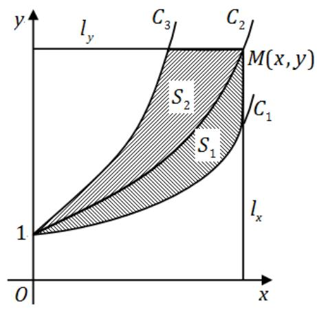

解. 由题设图形知, $C_{3}$ 在 $C_{1}$ 的左侧, 根据平面图形的面积公式得,

$$
S _ {1} (x) = \int_ {0} ^ {x} \left[ \mathrm {e} ^ {t} - \frac {1}{2} (1 + \mathrm {e} ^ {t}) \right] \mathrm {d} t = \frac {1}{2} (\mathrm {e} ^ {x} - x - 1),
$$

$$
S _ {2} (y) = \int_ {1} ^ {y} (\ln t - \phi (t)) d t.
$$

由 $S_{1}(x) = S_{2}(y)$ 得

$$
\frac {1}{2} \left(\mathrm {e} ^ {x} - x - 1\right) = \int_ {1} ^ {y} (\ln t - \phi (t)) \mathrm {d} t.
$$

注意到 $M(x,y)$ 是 $y = \mathrm{e}^{x}$ 的点，于是

$$
\frac {1}{2} (y - \ln y - 1) = \int_ {1} ^ {y} (\ln t - \phi (t)) d t.
$$

两边对 $y$ 求导得

$$
\frac {1}{2} \left(1 - \frac {1}{y}\right) = \ln y - \phi (y).
$$

整理得曲线 $C_3$ 的方程为： $x = \phi (y) = \ln y - \frac{y - 1}{2y}$

17. 同试卷一第三[17]题

18. (本题满分 12 分)

用变量代换 $x = \cos t$ （ $0 < t < \pi$ ）化简微分方程 $(1 - x^{2})y^{\prime \prime} - xy^{\prime} + y = 0$ ，并求其满足 $y\big|_{x=0} = 1, y^{\prime}\big|_{x=0} = 2$ 的特解.

解. 由复合函数求导的链式法则得

$$
y ^ {\prime} = \frac {\mathrm {d} y}{\mathrm {d} t} \cdot \frac {\mathrm {d} t}{\mathrm {d} x} = - \frac {1}{\sin t} \frac {\mathrm {d} y}{\mathrm {d} t},
$$

$$
y ^ {\prime \prime} = \frac {\mathrm {d} y ^ {\prime}}{\mathrm {d} t} \cdot \frac {\mathrm {d} t}{\mathrm {d} x} = \left(\frac {\cos t}{\sin^ {2} t} \frac {\mathrm {d} y}{\mathrm {d} t} - \frac {1}{\sin t} \frac {\mathrm {d} ^ {2} y}{\mathrm {d} t ^ {2}}\right) \cdot \left(- \frac {1}{\sin t}\right).
$$

代入原方程得

$$
(1 - \cos^ {2} t) \left(\frac {\cos t}{\sin^ {2} t} \frac {\mathrm {d} y}{\mathrm {d} t} - \frac {1}{\sin t} \frac {\mathrm {d} ^ {2} y}{\mathrm {d} t ^ {2}}\right) \cdot \left(- \frac {1}{\sin t}\right) - \cos t \left(- \frac {1}{\sin t} \frac {\mathrm {d} y}{\mathrm {d} t}\right) + y = 0.
$$

化简得 $\frac{\mathrm{d}^2y}{\mathrm{d}t^2} + y = 0$ ，其特征方程为 $r^2 + 1 = 0$ ，特征根 $r_{1,2} = \pm i$ ，通解为 $y = C_1 \cos t + C_2 \sin t$ 。所以

$$
y = C _ {1} \cos t + C _ {2} \sin t = C _ {1} x + C _ {2} \sqrt {1 - x ^ {2}},
$$

$$
y ^ {\prime} = C _ {1} x ^ {\prime} + C _ {2} \left(\sqrt {1 - x ^ {2}}\right) ^ {\prime} = C _ {1} + \frac {2 x}{2 \sqrt {1 - x ^ {2}}}.
$$

将初始条件 $y \big|_{x=0} = 1, y' \big|_{x=0} = 2$ 代入，解得 $C_1 = 2, C_2 = 1$ 。故所求特解为

$$
y = 2 x + \sqrt {1 - x ^ {2}}, \quad - 1 <   x <   1.
$$

19. 同试卷一第三[18]题.

20. (本题满分 10 分)

已知函数 $z = f(x,y)$ 的全微分 $\mathrm{d}z = 2x\mathrm{d}x - 2y\mathrm{d}y$ ，并且 $f(1,1) = 2$ 求 $f(x,y)$ 在椭圆域 $D = \left\{(x,y)\Bigg|x^2 +\frac{y^2}{4}\leqslant 1\right\}$ 上的最大值和最小值.

解. (I) 由 $\mathrm{d}z = 2x\mathrm{d}x - 2y\mathrm{d}y$ 知 $\frac{\partial z}{\partial x} = 2x, \frac{\partial z}{\partial y} = -2y$ . 对 $\frac{\partial z}{\partial x} = 2x$ 两边积分得

$$
z = f (x, y) = x ^ {2} + c (y).
$$

将 $z(x, y) = x^{2} + c(y)$ 代入 $\frac{\partial z}{\partial y} = -2y$ 得 $c'(y) = 2y$ . 所以 $c(y) = y^{2} + c$ . 所以

$$
z = x ^ {2} - y ^ {2} + c.
$$

再由 $x = 1, y = 1$ 时 $z = 2$ 知 $c = 2$ . 于是所讨论的函数为

$$
z = x ^ {2} - y ^ {2} + 2.
$$

(II) 先求 $z$ 在 $D$ 的内部 $x^{2} + \frac{y^{2}}{4} < 1$ 中的驻点: 由 $\frac{\partial z}{\partial x} = 2x, \frac{\partial z}{\partial y} = -2y$ 得驻点 $(0,0)$ , 对应的 $z = f(0,0) = 2$ . 再求 $z = x^{2} - y^{2} + 2$ 在 $D$ 的边界 $x^{2} + \frac{y^{2}}{4} = 1$ 上的最值: 把 $y^{2} = 4(1 - x^{2})$ 代入 $z$ 的表达式有

$$
z = x ^ {2} - y ^ {2} + 2 = 5 x ^ {2} - 2, \quad - 1 \leqslant x \leqslant 1.
$$

令 $z_{x}^{\prime} = 10x = 0$ 解得 $x = 0$ ，对应的 $y = \pm 2$ ， $\left.\left.z\right|_{x = 0,y = \pm 2} = -2.\right.$ 还要考虑 $-1\leqslant x\leqslant 1$ 的端点 $x = \pm 1$ ，对应的 $y = 0$ ， $\left.\left.z\right|_{x = \pm 1,y = 0} = 3.\right.$ 由 $z = 2,z = -2,z = 3$ 比较大小，故 $z = f(x,y)$ 在椭圆域 $D$ 的最小值为-2（对应于 $x = 0$ ， $y = \pm 2$ ），最大值为3（对应于 $x = 0$ ， $y = \pm 2$ ）。

21. (本题满分9分)

计算二重积分 $\iint_{D}\left|x^{2} + y^{2} - 1\right|\mathrm{d}\sigma$ ，其中 $D = \{(x,y)\big|0\leqslant x\leqslant 1,0\leqslant y\leqslant 1\}$

解. 如图, 将 $D$ 划分为 $D_{1}$ 与 $D_{2}$ 两部分:

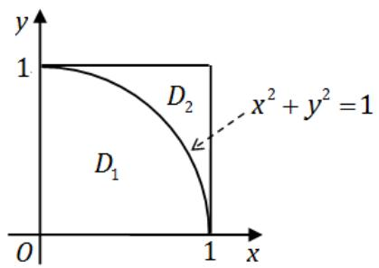

则有

$$
\iint_ {D} \left| x ^ {2} + y ^ {2} - 1 \right| d \sigma = \iint_ {D _ {1}} \left(1 - x ^ {2} - y ^ {2}\right) d x d y + \iint_ {D _ {2}} \left(x ^ {2} + y ^ {2} - 1\right) d x d y.
$$

前一个积分用极坐标计算:

$$
\iint_ {D _ {1}} \left(1 - x ^ {2} - y ^ {2}\right) \mathrm {d} x \mathrm {d} y = \int_ {0} ^ {\frac {\pi}{2}} \mathrm {d} \theta \int_ {0} ^ {1} \left(1 - r ^ {2}\right) r \mathrm {d} r = \int_ {0} ^ {\frac {\pi}{2}} \left(\frac {1}{2} - \frac {1}{4}\right) \mathrm {d} \theta = \frac {\pi}{8}.
$$

后一个积分用直角坐标计算:

$$
\begin{array}{l} \iint_ {D _ {2}} \left(x ^ {2} + y ^ {2} - 1\right) \mathrm {d} x \mathrm {d} y = \int_ {0} ^ {1} \mathrm {d} x \int_ {\sqrt {1 - x ^ {2}}} ^ {1} \left(x ^ {2} + y ^ {2} - 1\right) \mathrm {d} y \\ = \int_ {0} ^ {1} \left[ \left(x ^ {2} - \frac {2}{3}\right) + \frac {2}{3} (1 - x ^ {2}) ^ {\frac {3}{2}} \right] d x = \int_ {0} ^ {1} \left(x ^ {2} - \frac {2}{3}\right) d x + \frac {2}{3} \int_ {0} ^ {1} (1 - x ^ {2}) ^ {\frac {3}{2}} d x \\ = - \frac {1}{3} + \frac {2}{3} \int_ {0} ^ {\frac {\pi}{2}} \cos^ {4} t d t = - \frac {1}{3} + \frac {2}{3} \left(\frac {3}{4} \cdot \frac {1}{2} \cdot \frac {\pi}{2}\right) = - \frac {1}{3} + \frac {\pi}{8}. \\ \end{array}
$$

所以原积分

$$
\iint_ {D} \left| x ^ {2} + y ^ {2} - 1 \right| \mathrm {d} \sigma = \frac {\pi}{8} - \frac {1}{3} + \frac {\pi}{8} = \frac {\pi}{4} - \frac {1}{3}.
$$

# 22. (本题满分9分)

确定常数 $a$ ，使向量组 $\alpha_{1} = (1,1,a)^{T},\alpha_{2} = (1,a,1)^{T},\alpha_{3} = (a,1,1)^{T}$ 可由向量组 $\beta_{1} = (1,1,a)^{T},\beta_{2} = (-2,a,4)^{T},\beta_{3} = (-2,a,a)^{T}$ 线性表示，但向量组 $\beta_{1},\beta_{2},\beta_{3}$ 不能由向量组 $\alpha_{1},\alpha_{2},\alpha_{3}$ 线性表示.

解. 记 $A = (\alpha_{1}, \alpha_{2}, \alpha_{3}), B = (\beta_{1}, \beta_{2}, \beta_{3})$ . 由于 $\beta_{1}, \beta_{2}, \beta_{3}$ 不能由 $\alpha_{1}, \alpha_{2}, \alpha_{3}$ 线性表示, 故 $r(A) < 3$ (若 $r(A) = 3$ , 则任何三维向量都可以由 $\alpha_{1}, \alpha_{2}, \alpha_{3}$ 线性表示). 从而

$$
| A | = \left| \begin{array}{c c c} 1 & 1 & a \\ 1 & a & 1 \\ a & 1 & 1 \end{array} \right| = - (2 + a) (a - 1) ^ {2} = 0,
$$

从而得 $a = 1$ 或 $a = -2$ . 当 $a = 1$ 时, $\alpha_{1} = \alpha_{2} = \alpha_{3} = \beta_{1} = (1,1,1)^{T}$ , 则 $\alpha_{1} = \alpha_{2} = \alpha_{3} = \beta_{1} + 0 \cdot \beta_{2} + 0 \cdot \beta_{3}$ , 故 $\alpha_{1}, \alpha_{2}, \alpha_{3}$ 可由 $\beta_{1}, \beta_{2}, \beta_{3}$ 线性表示, 但 $\beta_{2} = (-2,1,4)^{T}$ 不

能由 $\alpha_{1},\alpha_{2},\alpha_{3}$ 线性表示，故 $a = 1$ 符合题意．当 $a = -2$ 时，作初等行变换

$$
(B \vdots A) = \left( \begin{array}{c c c c c c c} 1 & - 2 & - 2 & \vdots & 1 & 1 & - 2 \\ 1 & - 2 & - 2 & \vdots & 1 & - 2 & 1 \\ - 2 & 4 & - 2 & \vdots & - 2 & 1 & 1 \end{array} \right) \to \left( \begin{array}{c c c c c c c} 1 & - 2 & - 2 & \vdots & 1 & 1 & - 2 \\ 0 & 0 & - 6 & \vdots & 0 & 3 & - 3 \\ 0 & 0 & 0 & \vdots & 0 & - 3 & 3 \end{array} \right)
$$

因 $r(B) = 2 \neq r(B: \alpha_{2}) = 3$ ，系数矩阵的秩和增广矩阵的秩不相等，故方程组 $BX = \alpha_{2}$ 无解，即 $\alpha_{2}$ 不能由 $\beta_{1}, \beta_{2}, \beta_{3}$ 线性表示，与题设矛盾．所以 $a = -2$ 不合题意.

23. 同试卷一第三[21]题

# 二〇〇六年考研数学试卷二解答

# 一、填空题（1～6小题，每小题4分，共24分）

1. 曲线 $y = \frac{x + 4\sin x}{5x - 2\cos x}$ 的水平渐近线方程为

解. 应填 $y = \frac{1}{5}$ . 由无穷小量的性质可知

$$
\lim  _ {x \rightarrow \infty} y = \lim  _ {x \rightarrow \infty} \frac {x + 4 \sin x}{5 x - 2 \cos x} = \lim  _ {x \rightarrow \infty} \frac {1 + \frac {4 \sin x}{x}}{5 - \frac {2 \cos x}{x}} = \lim  _ {x \rightarrow \infty} \frac {1 + 0}{5 - 0} = \frac {1}{5},
$$

故 $y = \frac{1}{5}$ 是水平渐近线.

2. 设函数 $f(x) = \left\{ \begin{array}{ll} \frac{1}{x^3}\int_0^x\sin t^2\mathrm{d}t, & x \neq 0 \\ a, & x = 0 \end{array} \right.$ 在 $x = 0$ 处连续，则 $a =$ ________.

解. 应填 $\frac{1}{3}$ . 按连续性定义和洛必达法则, 有 $a = \lim_{x \to 0} f(x) = \lim_{x \to 0} \frac{\sin(x^2)}{3x^2} = \frac{1}{3}$ .

3. 广义积分 $\int_{0}^{+\infty} \frac{x \, \mathrm{d}x}{(1 + x^2)^2} =$ ________.

解. 应填 $\frac{1}{2}$ . 因为 $\int_{0}^{+\infty} \frac{x \, \mathrm{d}x}{(1 + x^2)^2} = \frac{1}{2} \int_{0}^{+\infty} \frac{\mathrm{d}(1 + x^2)}{(1 + x^2)^2} = -\frac{1}{2} \cdot \left[\frac{1}{1 + x^2}\right]_0^{+\infty} = \frac{1}{2}$ .

4. 同试卷一第一[2]题

5. 设函数 $y = y(x)$ 由方程 $y = 1 - x\mathrm{e}^{y}$ 确定，则 $\left.\frac{\mathrm{dy}}{\mathrm{dx}}\right|_{x=0} =$

解. 应填 $-\mathrm{e}$ . 在原方程中令 $x = 0$ , 得 $y = 1$ . 方程两边对 $x$ 求导得 $y' = -\mathrm{e}^{y} - x\mathrm{e}^{y}y'$ , 令 $x = 0$ 得 $y'(0) = -\mathrm{e}$ .

6. 同试卷一第一[5]题

# 二、选择题（7～14小题，每小题4分，共32分）

7. 同试卷一第二[7]题

8. 设 $f(x)$ 是奇函数, 除 $x = 0$ 外处处连续, $x = 0$ 是其第一类间断点, 则 $\int_{0}^{x} f(t) \mathrm{d} t$ 是……( )

(A) 连续的奇函数.

(B) 连续的偶函数.

(C) 在 $x = 0$ 间断的奇函数

(D) 在 $x = 0$ 间断的偶函数.

解. 应选 (B). 由题设知 $f(x)$ 在任意区间 $[a, b]$ 上都可积, 故 $F(x) = \int_{0}^{x} f(t) \mathrm{d}t$ 处处连续. 又

$$
F (- x) = \int_ {0} ^ {- x} f (t) d t = - \int_ {0} ^ {- x} f (- t) d t = \int_ {0} ^ {x} f (s) d s = F (x),
$$

则 $F(x)$ 为偶函数

9. 设函数 $g(x)$ 可微， $h(x) = e^{1 + g(x)}$ ， $h'(1) = 1$ ， $g'(1) = 2$ ，则 $g(1)$ 等于……（）

(A) $\ln 3 - 1$

(B) $-\ln 3 - 1$

(C) $-\ln 2 - 1$

(D) $\ln 2 - 1$

解. 应选 (C). 由复合函数求导法则有 $h'(x) = g'(x)\mathrm{e}^{1 + g(x)}$ . 将 $x = 1$ 代入上式得 $1 = 2\mathrm{e}^{1 + g(1)}$ . 解得 $g(1) = \ln \frac{1}{2} - 1 = -\ln 2 - 1$ .

10. 函数 $y = c_{1} \mathrm{e}^{x} + c_{2} \mathrm{e}^{-2x} + x \mathrm{e}^{x}$ 满足的一个微分方程是……( )

(A) $y^{\prime \prime} - y^{\prime} - 2y = 3x\mathrm{e}^{x}$

(B) $y^{\prime \prime} - y^{\prime} - 2y = 3\mathrm{e}^{x}$

(C) $y^{\prime \prime} + y^{\prime} - 2y = 3x\mathrm{e}^{x}$

(D) $y^{\prime \prime} + y^{\prime} - 2y = 3\mathrm{e}^{x}$

解. 应选 (D). 依题意, 微分方程对应的齐次方程的特征根为 1 和 -2 , 于是特征方程为 $\lambda^2 + \lambda - 2 = 0$ , 对应的齐次微分方程为 $y'' + y' - 2y = 0$ . 又 $\alpha = 1$ 是特征方程的单根, 故非齐次项为 $f(x) = A\mathrm{e}^{x}$ , 所以选 (D).

11. 同试卷一第二[8]题  
12. 同试卷一第二[10]题  
13. 同试卷一第二[11]题  
14. 同试卷一第二[12]题

# 三、解答题（15～23小题，共94分）

15. (本题满分 10 分)

试确定常数 $A, B, C$ 的值，使得 $e^{x}(1 + Bx + Cx^{2}) = 1 + Ax + o(x^{3})$ ，其中 $o(x^{3})$ 是当 $x \to 0$ 时比 $x^{3}$ 高阶的无穷小.

解. 用泰勒公式, 将 $e^{x} = 1 + x + \frac{x^{2}}{2} + \frac{x^{3}}{6} + o\left(x^{3}\right)$ 代入题设等式整理得

$$
1 + (B + 1) x + \left(C + B + \frac {1}{2}\right) x ^ {2} + \left(\frac {B}{2} + C + \frac {1}{6}\right) + o \left(x ^ {3}\right) = 1 + A x + o \left(x ^ {3}\right).
$$

比较两边同次幂函数得

$$
\left\{ \begin{array}{l} B + 1 = A, \\ C + B + \frac {1}{2} = 0, \\ \frac {B}{2} + C + \frac {1}{6} = 0. \end{array} \right.
$$

由此可解得 $A = \frac{1}{3}, B = -\frac{2}{3}, C = \frac{1}{6}$ .

16.（本题满分10分）

求 $\int \frac{\arcsin\mathrm{e}^x}{\mathrm{e}^x}\mathrm{d}x.$

解. 由换元积分法和分部积分法, 可得

$$
\begin{array}{l} \int \frac {\arcsin e ^ {x}}{e ^ {x}} d x = \int \frac {\arcsin e ^ {x}}{e ^ {2 x}} d (e ^ {x}) = \int \frac {\arcsin t}{t ^ {2}} d t = - \int \arcsin t d \left(\frac {1}{t}\right) \\ = - \frac {\arcsin t}{t} + \int \frac {\mathrm {d} t}{t \sqrt {1 - t ^ {2}}} = - \frac {\arcsin t}{t} + \int \frac {t \mathrm {d} t}{t ^ {2} \sqrt {1 - t ^ {2}}} \\ = - \frac {\arcsin t}{t} + \frac {1}{2} \int \frac {\mathrm {d} (1 - t ^ {2})}{(1 - t ^ {2}) \sqrt {1 - t ^ {2}} - \sqrt {1 - t ^ {2}}} = - \frac {\arcsin t}{t} + \frac {1}{2} \int \frac {\mathrm {d} (u ^ {2})}{u ^ {3} - u} \\ = - \frac {\arcsin t}{t} + \int \frac {\mathrm {d} u}{u ^ {2} - 1} = - \frac {\arcsin t}{t} + \frac {1}{2} \ln \left| \frac {u - 1}{u + 1} \right| + C \\ = - \frac {\arcsin \mathrm {e} ^ {x}}{\mathrm {e} ^ {x}} + \frac {1}{2} \ln \left| \frac {\sqrt {1 - \mathrm {e} ^ {2 x}} - 1}{\sqrt {1 - \mathrm {e} ^ {2 x}} + 1} \right| + C. \\ \end{array}
$$

17. 同试卷一第三[15]题  
18. 同试卷一第三[16]题  
19.（本题满分10分）

证明：当 $0 < a < b < \pi$ 时， $b\sin b + 2\cos b + \pi b > a\sin a + 2\cos a + \pi a.$

解. 令 $f(x) = x \sin x + 2 \cos x + \pi x$ ，则有

$$
\begin{array}{l} f ^ {\prime} (x) = \sin x + x \cos x - 2 \sin x + \pi = x \cos x - \sin x + \pi , \\ f ^ {\prime \prime} (x) = \cos x - x \sin x - \cos x = - x \sin x <   0, \\ \end{array}
$$

所以 $f^{\prime}(x)$ 严格单调减少．又 $f^{\prime}(\pi) = \pi \cos \pi +\pi = 0$ ，故 $0 <   x <   \pi$ 时 $f^{\prime}(x) > 0$ 从而 $f(x)$ 严格单调增加，由 $b > a$ 可得 $f(b) > f(a)$

20. 同试卷一第三[18]题

21. (本题满分 12 分)

已知曲线 $L$ 的方程 $\left\{ \begin{array}{l}x = t^2 +1,\\ y = 4t - t^2, \end{array} \right.$ （ $t\geqslant 0)$

(I) 讨论 $L$ 的凹凸性;  
(II) 过点 $(-1,0)$ 引 $L$ 的切线，求切点 $(x_0,y_0)$ ，并写出切线的方程；  
(III) 求此切线与 $L$ (对应 $x \leqslant x_0$ 的部分) 及 $x$ 轴所围成的平面图形的面积.

解. (I) 计算该参数方程的各阶导数得

$$
\frac {\mathrm {d} y}{\mathrm {d} x} = \frac {\frac {\mathrm {d} y}{\mathrm {d} t}}{\frac {\mathrm {d} x}{\mathrm {d} t}} = \frac {4 - 2 t}{2 t} = \frac {2}{t} - 1, \quad \frac {\mathrm {d} ^ {2} y}{\mathrm {d} x ^ {2}} = \frac {d \left(\frac {\mathrm {d} y}{\mathrm {d} x}\right)}{\mathrm {d} t} \cdot \frac {1}{\frac {\mathrm {d} x}{\mathrm {d} t}} = \left(- \frac {2}{t ^ {2}}\right) \cdot \frac {1}{2 t} = - \frac {1}{t ^ {3}}.
$$

因为 $t > 0$ 时二阶导数小于零，所以曲线 $L$ 在 $t \geqslant 0$ 处是凸的.

(II) 切线方程为 $y - 0 = \left(\frac{2}{t} - 1\right)(x + 1)$ ，设 $x_0 = t_0^2 + 1$ ， $y_0 = 4t_0 - t_0^2$ ，代入方程解得 $t_0 = 1$ 。所以切点为 (2,3)，切线方程为 $y = x + 1$ 。  
(III) 设 $L$ 的方程 $x = g(y)$ , 则 $S = \int_{0}^{3}\left[\left(g(y) - (y - 1)\right)\right] \mathrm{d}y$ . 由 $y = 4t - t^2$ 解得 $t = 2 \pm \sqrt{4 - y}$ , 从而 $x = \left(2 \pm \sqrt{4 - y}\right)^2 + 1$ . 由于点 (2,3) 在 $L$ 上, 可知 $x = \left(2 - \sqrt{4 - y}\right)^2 + 1 = g(y)$ . 所以

$$
\begin{array}{l} S = \int_ {0} ^ {3} \left[ (9 - y - 4 \sqrt {4 - y}) - (y - 1) \right] d y \\ = \int_ {0} ^ {3} (1 0 - 2 y) d y - 4 \int_ {0} ^ {3} \sqrt {4 - y} d y = 2 1 - \frac {5 6}{3} = \frac {7}{3}. \\ \end{array}
$$

22. 同试卷一第三[20]题.  
23. 同试卷一第三[21]题

# 二〇〇七年考研数学试卷二解答

# 一、选择题（1～10小题，每小题4分，共40分）

1. 同试卷一第一[1]题

2. 函数 $f(x) = \frac{(\mathrm{e}^{\frac{1}{x}} + \mathrm{e})\tan x}{x(\mathrm{e}^{\frac{1}{x}} - \mathrm{e})}$ 在 $[- \pi, \pi]$ 上的第一类间断点是 $x = \dots \dots \dots \dots \dots \dots$ ( )

(A) 0.

(B) 1.

(C) $-\frac{\pi}{2}$ .

(D) $\frac{\pi}{2}$ .

解. 应选 (A). $f(x)$ 的不连续点为 0、1、 $\pm \frac{\pi}{2}$ . 由于

$$
\lim  _ {x \rightarrow 0 ^ {+}} f (x) = \lim  _ {x \rightarrow 0 ^ {+}} \frac {\left(\mathrm {e} ^ {\frac {1}{x}} + \mathrm {e}\right) \tan x}{x \left(\mathrm {e} ^ {\frac {1}{x}} - \mathrm {e}\right)} = \lim  _ {x \rightarrow 0 ^ {+}} \frac {\mathrm {e} ^ {\frac {1}{x}} + \mathrm {e}}{\mathrm {e} ^ {\frac {1}{x}} - \mathrm {e}} = \lim  _ {x \rightarrow 0 ^ {+}} \frac {\mathrm {e} \left(1 + \mathrm {e} ^ {1 - \frac {1}{x}}\right)}{\mathrm {e} \left(1 - \mathrm {e} ^ {1 - \frac {1}{x}}\right)} = 1,
$$

$$
\lim  _ {x \rightarrow 0 ^ {-}} f (x) = \lim  _ {x \rightarrow 0 ^ {-}} \frac {\left(\mathrm {e} ^ {\frac {1}{x}} + \mathrm {e}\right) \tan x}{x \left(\mathrm {e} ^ {\frac {1}{x}} - \mathrm {e}\right)} = \lim  _ {x \rightarrow 0 ^ {-}} \frac {\mathrm {e} ^ {\frac {1}{x}} + \mathrm {e}}{\mathrm {e} ^ {\frac {1}{x}} - \mathrm {e}} = \frac {\lim  _ {x \rightarrow 0 ^ {-}} \left(\mathrm {e} ^ {\frac {1}{x}} + \mathrm {e}\right)}{\lim  _ {x \rightarrow 0 ^ {-}} \left(\mathrm {e} ^ {\frac {1}{x}} - \mathrm {e}\right)} = \frac {\mathrm {e}}{- \mathrm {e}} = - 1,
$$

即 $f(x)$ 在 $x = 0$ 存在左右极限，且 $\lim_{x\to 0^{+}}f(x)\neq \lim_{x\to 0^{-}}f(x)$ ，所以 $x = 0$ 是 $f(x)$ 的第一类间断点；同样，可验证其余选项是第二类间断点：

$$
\lim  _ {x \to 1} f (x) = \infty , \quad \lim  _ {x \to \frac {\pi}{2}} f (x) = \infty , \quad \lim  _ {x \to - \frac {\pi}{2}} f (x) = \infty .
$$

3. 同试卷一第一[3]题

4. 同试卷一第一[4]题

5. 同试卷一第一[2]题

6. 同试卷一第一[5]题

7. 二元函数 $f(x, y)$ 在点 $(0,0)$ 处可微的一个充分条件是……( )

(A) $\lim_{(x,y)\to (0,0)}[f(x,y) - f(0,0)] = 0.$   
(B) $\lim_{x\to 0}\frac{\left[f(x,0) - f(0,0)\right]}{x} = 0$ 且 $\lim_{y\to 0}\frac{\left[f(0,y) - f(0,0)\right]}{y} = 0.$   
(C) $\lim_{(x,y)\to (0,0)}\frac{\left[f(x,y) - f(0,0)\right]}{\sqrt{x^2 + y^2}} = 0.$   
(D) $\lim_{x\to 0}\left[f_x'(x,0) - f_x'(0,0)\right] = 0$ 且 $\lim_{y\to 0}\left[f_y'(0,y) - f_y'(0,0)\right] = 0.$

解. 应选 (C). 由 $\lim_{(x, y) \to (0, 0)} \frac{\left[f(x, y) - f(0, 0)\right]}{\sqrt{x^2 + y^2}} = 0$ 推知

$$
f (x, y) - f (0, 0) = \alpha \sqrt {x ^ {2} + y ^ {2}} = 0 \cdot x + 0 \cdot y + o (\rho),
$$

其中 $\rho = \sqrt{x^{2} + y^{2}}$ , $\lim_{\rho \to 0} \frac{o(\rho)}{\rho} = \lim_{\rho \to 0} a = 0$ . 对照全微分定义, 相当于

$$
x _ {0} = 0, y _ {0} = 0, \Delta x = x, \Delta y = y, A = 0, B = 0.
$$

可见 $f(x,y)$ 在 $(0,0)$ 点可微，故选择(C).选项(A)相当于已知 $f(x,y)$ 在点 $(0,0)$ 处连续；选项(B)相当于已知两个一阶偏导数 $f_{x}^{\prime}(0,0),f_{y}^{\prime}(0,0)$ 存在，(A)和(B)均不能保证 $f(x,y)$ 在点 $(0,0)$ 处可微．选项(D)相当于已知两个一元导函数 $f_{x}^{\prime}(x,0),f_{y}^{\prime}(0,y)$ 分别在 $x = 0$ 和 $y = 0$ 处连续，但不能推出两个一阶偏导函数 $f_{x}^{\prime}(x,y),f_{y}^{\prime}(x,y)$ 在点 $(0,0)$ 处连续，因此也不能保证 $f(x,y)$ 在点 $(0,0)$ 处可微.

8. 设函数 $f(x, y)$ 连续，则二次积分 $\int_{\frac{\pi}{2}}^{\pi} \mathrm{d}x \int_{\sin x}^{1} f(x, y) \mathrm{d}y$ 等于……（ ）

(A) $\int_0^1\mathrm{d}y\int_{\pi +\arcsin y}^\pi f(x,y)\mathrm{d}x.$

(B) $\int_0^1\mathrm{d}y\int_{\pi -\arcsin y}^\pi f(x,y)\mathrm{d}x.$

(C) $\int_0^1\mathrm{d}y\int_{\frac{\pi}{2}}^{\pi +\arcsin y}f(x,y)\mathrm{d}x.$

(D) $\int_0^1\mathrm{d}y\int_{\frac{\pi}{2}}^{\pi -\arcsin y}f(x,y)\mathrm{d}x.$

解. 应选 (B). 该二次积分所对应的积分区域 $D: \frac{\pi}{2} \leqslant x \leqslant \pi, \sin x \leqslant y \leqslant 1$ . 交换为先 $x$ 后 $y$ , 则积分区域可化为: $0 \leqslant y \leqslant 1, \pi - \arcsin y \leqslant x \leqslant \pi$ . 所以

$$
\int_ {\frac {\pi}{2}} ^ {\pi} \mathrm {d} x \int_ {\sin x} ^ {1} f (x, y) \mathrm {d} y = \int_ {0} ^ {1} \mathrm {d} y \int_ {\pi - \arcsin y} ^ {\pi} f (x, y) \mathrm {d} x.
$$

9. 同试卷一第一[7]题.

10. 同试卷一第一[8]题

# 二、填空题（11～16小题，每小题4分，共24分）

11. $\lim_{x\to 0}\frac{\arctan{x} - \sin{x}}{x^3} = \underline{\quad}$

解. 应填 $-\frac{1}{6}$ . 由洛必达法则,

$$
\begin{array}{l} \lim  _ {x \rightarrow 0} \frac {\arctan x - \sin x}{x ^ {3}} = \lim  _ {x \rightarrow 0} \frac {\frac {1}{1 + x ^ {2}} - \cos x}{3 x ^ {2}} = \lim  _ {x \rightarrow 0} \frac {1 - (1 + x ^ {2}) \cos x}{3 x ^ {2} (1 + x ^ {2})} \\ = \lim  _ {x \rightarrow 0} \frac {1}{3 (1 + x ^ {2})} \cdot \lim  _ {x \rightarrow 0} \left(\frac {1 - \cos x}{x ^ {2}} - \cos x\right) \\ = \frac {1}{3} \left(\lim  _ {x \rightarrow 0} \frac {x ^ {2} / 2}{x ^ {2}} - 1\right) = - \frac {1}{6}. \\ \end{array}
$$

12. 曲线 $\left\{ \begin{array}{l} x = \cos t + \cos^2 t \\ y = 1 + \sin t \end{array} \right.$ 上对应于 $t = \frac{\pi}{4}$ 的点处的法线斜率为

解. 应填 $1 + \sqrt{2}$ . 由参数方程的导数公式,

$$
\frac {\mathrm {d} y}{\mathrm {d} x} = \frac {\mathrm {d} y / \mathrm {d} t}{\mathrm {d} x / \mathrm {d} t} = \frac {\left(1 + \sin t\right) ^ {\prime}}{\left(\cos t + \cos^ {2} t\right) ^ {\prime}} = \frac {\cos t}{- \sin t - 2 \sin t \cos t}.
$$

把 $t = \frac{\pi}{4}$ 代入得 $\left.\frac{\mathrm{dy}}{\mathrm{dx}}\right|_{t = \frac{\pi}{4}} = -\frac{1}{1 + \sqrt{2}}$ 所以法线斜率为 $1 + \sqrt{2}$ .

13. 设函数 $y = \frac{1}{2x + 3}$ ，则 $y^{(n)}(0) =$ ________.

解. 应填 $\frac{(-1)^n 2^n n!}{3^{n+1}}$ . 由数学归纳法可知 $y^{(n)} = (-1)^n 2^n n!(2x + 3)^{-n-1}$ . 把 $x = 0$ 代入得 $y^{(n)}(0) = \frac{(-1)^n 2^n n!}{3^{n+1}}$ .

14. 同试卷一第二[13]题

15. 设 $f(u, v)$ 是二元可微函数， $z = f\left(\frac{y}{x}, \frac{x}{y}\right)$ ，则 $x \frac{\partial z}{\partial x} - y \frac{\partial z}{\partial y} =$ ________.

解. 应填 $2\left(-\frac{y}{x} f_{1}^{\prime} + \frac{x}{y} f_{2}^{\prime}\right)$ . 由复合函数导数公式,

$$
\frac {\partial z}{\partial x} = f _ {1} ^ {\prime} \cdot \frac {\partial \left(\frac {y}{x}\right)}{\partial x} + f _ {2} ^ {\prime} \cdot \frac {\partial \left(\frac {x}{y}\right)}{\partial x} = f _ {1} ^ {\prime} \cdot \left(- \frac {y}{x ^ {2}}\right) + f _ {2} ^ {\prime} \cdot \frac {1}{y},
$$

$$
\frac {\partial z}{\partial y} = f _ {1} ^ {\prime} \cdot \frac {\partial \left(\frac {y}{x}\right)}{\partial y} + f _ {2} ^ {\prime} \cdot \frac {\partial \left(\frac {x}{y}\right)}{\partial y} = f _ {1} ^ {\prime} \cdot \frac {1}{x} + f _ {2} ^ {\prime} \cdot \left(- \frac {x}{y ^ {2}}\right).
$$

所以

$$
\begin{array}{l} x \frac {\partial z}{\partial x} - y \frac {\partial z}{\partial y} = x \cdot \left[ f _ {1} ^ {\prime} \cdot \left(- \frac {y}{x ^ {2}}\right) + f _ {2} ^ {\prime} \cdot \frac {1}{y} \right] - y \left[ f _ {1} ^ {\prime} \cdot \frac {1}{x} + f _ {2} ^ {\prime} \cdot \left(- \frac {x}{y ^ {2}}\right) \right] \\ = \left(- \frac {y}{x}\right) \cdot f _ {1} ^ {\prime} + f _ {2} ^ {\prime} \cdot \frac {x}{y} - f _ {1} ^ {\prime} \cdot \frac {y}{x} + f _ {2} ^ {\prime} \cdot \frac {x}{y} = 2 \left(- \frac {y}{x} f _ {1} ^ {\prime} + \frac {x}{y} f _ {2} ^ {\prime}\right). \\ \end{array}
$$

16. 同试卷一第二[15]题

# 三、解答题（17～24小题，共86分）

17. (本题满分 10 分)

设 $f(x)$ 是区间 $\left[0, \frac{\pi}{4}\right]$ 上的单调、可导函数，且满足

$$
\int_ {0} ^ {f (x)} f ^ {- 1} (t) \mathrm {d} t = \int_ {0} ^ {x} t \frac {\cos t - \sin t}{\sin t + \cos t} \mathrm {d} t,
$$

其中 $f^{-1}$ 是 $f$ 的反函数，求 $f(x)$

解. 方程两边对 $x$ 求导得

$$
f ^ {- 1} [ f (x) ] \cdot f ^ {\prime} (x) = x \frac {\cos x - \sin x}{\sin x + \cos x} \Rightarrow x f ^ {\prime} (x) = x \frac {\cos x - \sin x}{\sin x + \cos x}.
$$

当 $x \neq 0$ 时，对上式两边同时除以 $x$ ，得 $f'(x) = \frac{\cos x - \sin x}{\sin x + \cos x}$ ，所以

$$
f (x) = \int \frac {\cos x - \sin x}{\sin x + \cos x} d x = \int \frac {d (\sin x + \cos x)}{\sin x + \cos x} = \ln | \sin x + \cos x | + C.
$$

在已知等式中令 $x = 0$ ，得 $\int_0^{f^{(0)}}f^{-1}(t)\mathrm{d}t = 0$ 因 $f(x)$ 是 $\left[0,\frac{\pi}{4}\right]$ 上的单调可导函数， $f^{-1}(t)$ 的值域为 $[0,\frac{\pi}{4} ]$ ，它是单调非负的，故必有 $f(0) = 0$ ，从而两边对上式取 $x\to 0^+$ 极限 $\lim_{x\to 0^{+}}f(x) = f(0) = C = 0.$ 于是 $f(x) = \ln (\sin x + \cos x),x\in \left[0,\frac{\pi}{4}\right].$

18. (本题满分11分)

设 $D$ 是位于曲线 $y = \sqrt{x} a^{-\frac{x}{2a}} (a > 1, 0 \leqslant x < +\infty)$ 下方、 $x$ 轴上方的无界区域.

(I) 求区域 $D$ 绕 $x$ 轴旋转一周所成旋转体的体积 $V(a)$ ;  
(II) 当 $a$ 为何值时， $V(a)$ 最小？并求出最小值.

解. (I) 由旋转体的体积公式,

$$
\begin{array}{l} V (a) = \pi \int_ {0} ^ {\infty} x a ^ {- \frac {x}{a}} d x = - \frac {a}{\ln a} \pi \int_ {0} ^ {\infty} x d \left(a ^ {- \frac {x}{a}}\right) \\ = - \frac {a}{\ln a} \pi \Big [ x a ^ {- \frac {x}{a}} \Big ] _ {0} ^ {+ \infty} + \frac {a}{\ln a} \pi \int_ {0} ^ {\infty} a ^ {- \frac {x}{a}} \mathrm {d} x = \pi \Big (\frac {a}{\ln a} \Big) ^ {2}. \\ \end{array}
$$

(II) 对 $V(a)$ 求导得到

$$
\begin{array}{l} V ^ {\prime} (a) = \left[ \pi \left(\frac {a}{\ln a}\right) ^ {2} \right] ^ {\prime} = \pi \cdot \frac {2 a \ln^ {2} a - a ^ {2} \cdot 2 \ln a \cdot \frac {1}{a}}{\ln^ {4} a} \\ = \pi \cdot \frac {2 a \ln a - 2 a}{\ln^ {3} a} = 2 \pi \left(\frac {a (\ln a - 1)}{\ln^ {3} a}\right). \\ \end{array}
$$

令 $V^{\prime}(a) = 0$ ，得 $\ln a = 1$ ，从而 $a = e$ 。当 $1 < a < e$ 时， $V^{\prime}(a) < 0$ ， $V(a)$ 单调减少；当 $a > e$ 时， $V^{\prime}(a) > 0$ ， $V(a)$ 单调增加。所以 $a = e$ 时 $V$ 最小，最小体积为 $V_{\min}(a) = \pi e^{2}$ 。

19. (本题满分 11 分)

求微分方程 $y''(x + y'^2) = y'$ 满足初始条件 $y(1) = y'(1) = 1$ 的特解.

解. 令 $y' = p$ ，则 $y'' = p'$ ，原方程化为 $p'(x + p^2) = p$ 。即

$$
\frac {\mathrm {d} x}{\mathrm {d} p} - \frac {x}{p} = p.
$$

由一阶线性微分方程求解公式，得

$$
x = \mathrm {e} ^ {\int \frac {1}{p} \mathrm {d} p} \left(\int p \mathrm {e} ^ {\int - \frac {1}{p} \mathrm {d} p} \mathrm {d} p + C _ {1}\right) = p \left(\int \mathrm {d} p + C _ {1}\right) = p (p + C _ {1}).
$$

代入初始条件得 $C_{1} = 0$ , 于是 $p^{2} = x$ . 由 $y^{\prime}(1) = 1$ 知 $p = \sqrt{x}$ , 即

$$
\frac {\mathrm {d} y}{\mathrm {d} x} = \sqrt {x} \quad \Rightarrow \quad y = \frac {2}{3} x ^ {\frac {3}{2}} + C _ {2}.
$$

代入初始条件得 $C_{2} = \frac{1}{3}$ , 所以特解为

$$
y = \frac {2}{3} x ^ {\frac {3}{2}} + \frac {1}{3}.
$$

20. (本题满分10分)

已知函数 $f(u)$ 具有二阶导数，且 $f^{\prime}(0) = 1$ ，函数 $y = y(x)$ 由方程 $y - x\mathrm{e}^{y - 1} = 1$ 所确定．设 $z = f(\ln y - \sin x)$ ，求 $\left.\frac{\mathrm{d}z}{\mathrm{d}x}\right|_{x = 0},\left.\frac{\mathrm{d}^2z}{\mathrm{d}x^2}\right|_{x = 0}.$

解. 在 $y - x\mathrm{e}^{y - 1} = 1$ 中，令 $x = 0$ ，得 $y = 1$ ： $y - x\mathrm{e}^{y - 1} = 1$ 两边对 $x$ 求导，得

$$
y ^ {\prime} - \mathrm {e} ^ {y - 1} - x \mathrm {e} ^ {y - 1} y ^ {\prime} = 0 \Rightarrow (2 - y) y ^ {\prime} - \mathrm {e} ^ {y - 1} = 0.
$$

由 $x = 0, y = 1$ 得 $\left. y^{\prime} \right|_{x=0} = 1$ . 对上式两边求导, 得

$$
(2 - y) y ^ {\prime \prime} - y ^ {\prime 2} - \mathrm {e} ^ {y - 1} y ^ {\prime} = 0.
$$

令 $x = 0$ , 由 $x = 0$ 时 $y = 1, y' = 1$ , 得 $\left. y'' \right|_{x=0} = 2$ . 因为 $z = f(\ln y - \sin x)$ , 所以

$$
\frac {\mathrm {d} z}{\mathrm {d} x} = f ^ {\prime} (\ln y - \sin x) \left(\frac {y ^ {\prime}}{y} - \cos x\right).
$$

把 $x = 0, y = 1, y' = 1$ 代入，得 $\left.\frac{\mathrm{d}z}{\mathrm{d}x}\right|_{x=0} = 0$ 。对上式再次求导，得

$$
\frac {\mathrm {d} ^ {2} z}{\mathrm {d} x ^ {2}} = f ^ {\prime \prime} (\ln y - \sin x) \left(\frac {y ^ {\prime}}{y} - \cos x\right) ^ {2} + f ^ {\prime} (\ln y - \sin x) \left[ - \frac {y ^ {\prime 2}}{y ^ {2}} + \frac {y ^ {\prime \prime}}{y} + \sin x \right].
$$

把 $x = 0, y = 1, y' = 1, y'' = 2$ 代入上式，得 $\frac{\mathrm{d}^2z}{\mathrm{d}x^2} = f'(0)(2 - 1) = 1.$

21. 同试卷一第三[19]题

22. (本题满分11分)

设二元函数 $f(x,y) = \left\{ \begin{array}{ll}x^{2}, & |x| + |y|\leqslant 1,\\ \frac{1}{\sqrt{x^2 + y^2}}, & 1 <   |x| + |y|\leqslant 2, \end{array} \right.$ 计算二重积分 $\iint_{D}f(x,y)\mathrm{d}\sigma$ 其中 $D = \{(x,y)||x| + |y|\leqslant 2\}$

解. 记 $D_{1} = \left\{(x,y) \mid |x| + |y| \leqslant 1\right\}$ , $D_{2} = \left\{(x,y) \mid 1 < |x| + |y| \leqslant 2\right\}$ . 则

$$
\begin{array}{l} \iint_ {D} f (x, y) \mathrm {d} \sigma = \iint_ {D _ {1}} f (x, y) \mathrm {d} \sigma + \iint_ {D _ {2}} f (x, y) \mathrm {d} \sigma \\ = \iint_ {D _ {1}} x ^ {2} \mathrm {d} \sigma + \iint_ {D _ {2}} \frac {1}{\sqrt {x ^ {2} + y ^ {2}}} \mathrm {d} \sigma . \\ \end{array}
$$

再记 $\sigma_{1} = \left\{(x,y)\big|0\leqslant x + y\leqslant 1,x\geqslant 0,y\geqslant 0\right\},\sigma_{2} = \left\{(x,y)\big|1\leqslant x + y\leqslant 2,x\geqslant 0,y\geqslant 0\right\}$ 由于 $D_{1}$ 与 $D_{2}$ 都与 $x$ 轴对称，也都与 $y$ 轴对称，函数 $x^{2}$ 与 $\frac{1}{\sqrt{x^2 + y^2}}$ 都是 $x$ 的偶函数，也都是 $y$ 的偶函数，所以由区域对称性和被积函数的奇偶性有

$$
\begin{array}{l} \iint_ {D _ {1}} x ^ {2} \mathrm {d} \sigma = 4 \iint_ {\sigma_ {1}} x ^ {2} \mathrm {d} \sigma = 4 \int_ {0} ^ {1} \mathrm {d} x \int_ {0} ^ {1 - x} x ^ {2} \mathrm {d} y \\ = 4 \int_ {0} ^ {1} x ^ {2} (1 - x) \mathrm {d} x = 4 \int_ {0} ^ {1} \left(x ^ {2} - x ^ {3}\right) \mathrm {d} x = \frac {1}{3}, \\ \iint_ {D _ {2}} \frac {1}{\sqrt {x ^ {2} + y ^ {2}}} \mathrm {d} \sigma = 4 \iint_ {\sigma_ {2}} \frac {1}{\sqrt {x ^ {2} + y ^ {2}}} \mathrm {d} \sigma . \\ \end{array}
$$

对第二个积分采用极坐标，令 $x = r\cos \theta, y = r\sin \theta, 0 < \theta < \frac{\pi}{2}$ 则 $x + y = 1$ 化为 $r = \frac{1}{\cos\theta + \sin\theta}, x + y = 2$ 化为 $r = \frac{2}{\cos\theta + \sin\theta}, \sqrt{x^2 + y^2} = r$ ，于是

$$
\begin{array}{l} \iint_ {D _ {2}} \frac {1}{\sqrt {x ^ {2} + y ^ {2}}} d \sigma = 4 \int_ {0} ^ {\frac {\pi}{2}} d \theta \int_ {\frac {1}{\cos \theta + \sin \theta}} ^ {\frac {2}{\cos \theta + \sin \theta}} d r = 4 \int_ {0} ^ {\frac {\pi}{2}} \frac {1}{\cos \theta + \sin \theta} d \theta \\ = 4 \int_ {0} ^ {\frac {\pi}{2}} \frac {1}{\sqrt {2} \cos (\theta - \frac {\pi}{4})} d \theta = 2 \sqrt {2} \int_ {0} ^ {\frac {\pi}{2}} \sec (\theta - \frac {\pi}{4}) d \theta \\ = 2 \sqrt {2} \ln \left[ \sec \left(\theta - \frac {\pi}{4}\right) + \tan \left(\theta - \frac {\pi}{4}\right) \right] \Bigg | _ {0} ^ {\frac {\pi}{2}} \\ = 2 \sqrt {2} \ln \left(\ln \left| \frac {2}{\sqrt {2}} + 1 \right| - \ln \left| \frac {2}{\sqrt {2}} - 1 \right|\right) \\ = 2 \sqrt {2} \ln \frac {2 + \sqrt {2}}{2 - \sqrt {2}} = 2 \sqrt {2} \ln (3 + 2 \sqrt {2}). \\ \end{array}
$$

所以

$$
\iint_ {D} f (x, y) \mathrm {d} \sigma = \iint_ {D _ {1}} f (x, y) \mathrm {d} \sigma + \iint_ {D _ {2}} f (x, y) \mathrm {d} \sigma = \frac {1}{3} + 2 \sqrt {2} \ln (3 + 2 \sqrt {2}).
$$

23. 同试卷一第三[21]题  
24. 同试卷一第三[22]题

# 二〇〇八年考研数学试卷二解答

# 一、选择题（1～8小题，每小题4分，共32分）

1. 设 $f(x) = x^{2}(x - 1)(x - 2)$ ，求 $f^{\prime}(x)$ 的零点个数为……（）

(A) 0.

(B) 1.

(C) 2.

(D) 3.

解. 应选 (D). 因为 $f(0) = f(1) = f(2) = 0$ , 由罗尔定理知至少有 $\xi_1 \in (0,1)$ , $\xi_2 \in (1,2)$ 使 $f'(\xi_1) = f'(\xi_2) = 0$ , 所以 $f'(x)$ 至少有两个零点. 又由于三次方程 $f'(x) = 0$ 的实根不是三个就是一个, 故 $f'(x)$ 的零点个数为 3 .

2. 如图, 曲线段方程为 $y = f(x)$ , 函数在区间 $[0, a]$ 上有连续导数, 则定积分 $\int_{0}^{a} x f'(x) \mathrm{d} x$ 等于

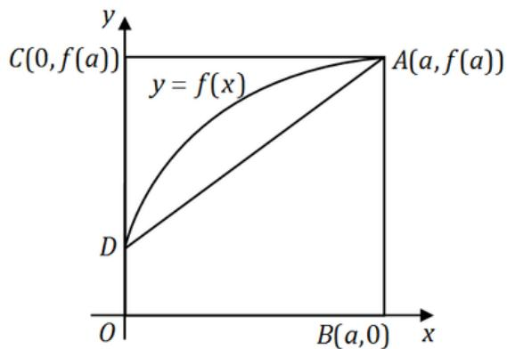

(A) 曲边梯形 $ABOD$ 面积.

(B) 梯形 $ABOD$ 面积.

(C) 曲边三角形 $ACD$ 面积.

(D) 三角形 $ACD$ 面积.

解. 应选 (C). 由分部积分法可得

$$
\int_ {0} ^ {a} x f ^ {\prime} (x) \mathrm {d} x = \int_ {0} ^ {a} x \mathrm {d} (f (x)) = [ x f (x) ] _ {0} ^ {a} - \int_ {0} ^ {a} f (x) \mathrm {d} x = a f (a) - \int_ {0} ^ {a} f (x) \mathrm {d} x.
$$

因为 $af(a)$ 是矩形ABOC面积， $\int_0^a f(x)\mathrm{d}x$ 为曲边梯形ABOD的面积，所以 $\int_0^a xf'(x)\mathrm{d}x$ 为曲边三角形的面积.

3. 同试卷一第一[3]题

4. 设函数 $f(x) = \frac{\ln |x|}{|x - 1|} \sin x$ ，则 $f(x)$ 有……（）

(A) 1 个可去间断点, 1 个跳跃间断点. (B) 1 个可去间断点, 1 个无穷间断点.

(C) 2 个无穷间断点.

(D) 2 个跳跃间断点.

解. 应选 (A). 易知 $x = 0$ 和 $x = 1$ 是函数 $f(x)$ 的间断点. 因为

$$
\lim  _ {x \rightarrow 0} f (x) = \lim  _ {x \rightarrow 0} \ln | x | \cdot \sin x = \lim  _ {x \rightarrow 0} x \ln | x |
$$

$$
= \lim  _ {x \rightarrow 0} \frac {\ln | x |}{1 / x} = \lim  _ {x \rightarrow 0} \frac {1 / x}{- 1 / x ^ {2}} = \lim  _ {x \rightarrow 0} (- x) = 0,
$$

所以 $x = 0$ 是可去间断点. 又因为

$$
\lim  _ {x \rightarrow 1 ^ {+}} f (x) = \lim  _ {x \rightarrow 1 ^ {+}} \frac {\ln x}{x - 1} \cdot \lim  _ {x \rightarrow 1 ^ {+}} \sin x = \left(\lim  _ {x \rightarrow 1 ^ {+}} \frac {x - 1}{x - 1}\right) \sin 1 = \sin 1,
$$

$$
\lim  _ {x \rightarrow 1 ^ {-}} f (x) = \lim  _ {x \rightarrow 1 ^ {-}} \frac {\ln x}{1 - x} \cdot \lim  _ {x \rightarrow 1 ^ {+}} \sin x = - \sin 1,
$$

所以 $x = 1$ 是跳跃间断点

5. 同试卷一第一[4]题.

6. 设函数 $f$ 连续。若 $F(u, v) = \iint_{D_{uv}} \frac{f(x^2 + y^2)}{\sqrt{x^2 + y^2}} \, \mathrm{d}x \, \mathrm{d}y$ ，其中区域 $D_{uv}$ 为图中阴影部分，则 $\frac{\partial F}{\partial u} = \dots$

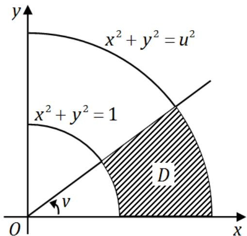

(A) $\nu f(u^2)$ .

(B) $\frac{\nu}{u} f(u^2)$

(C) $\nu f(u)$

(D) $\frac{\nu}{u} f(u)$ .

解. 应选 (A). 化为极坐标得到

$$
F (u, v) = \iint_ {D _ {u v}} \frac {f (x ^ {2} + y ^ {2})}{\sqrt {x ^ {2} + y ^ {2}}} \mathrm {d} x \mathrm {d} y = \int_ {0} ^ {v} \mathrm {d} \theta \int_ {1} ^ {u} \frac {f (r ^ {2})}{r} r \mathrm {d} r = v \int_ {1} ^ {u} f (r ^ {2}) \mathrm {d} r,
$$

所以 $\frac{\partial F}{\partial u} = \nu f(u^2)$

7. 同试卷一第一[5]题.

8. 设 $A = \begin{pmatrix} 1 & 2 \\ 2 & 1 \end{pmatrix}$ , 则在实数域上与 $A$ 合同的矩阵为……( )

(A) $\left( \begin{array}{cc} - 2 & 1\\ 1 & -2 \end{array} \right)$

(B) $\left( \begin{array}{cc}2 & -1\\ -1 & 2 \end{array} \right).$

(C) $\left( \begin{array}{ll}2 & 1\\ 1 & 2 \end{array} \right)$

(D) $\left( \begin{array}{cc}1 & -2\\ -2 & 1 \end{array} \right)$

解. 应选 (D). 记 $D = \left( \begin{array}{rr} 1 & -2 \\ -2 & 1 \end{array} \right)$ , 则可求得 $A$ 和 $D$ 有相同的特征值 3 和 -1, 从而 $A$ 和 $D$ 有相同的正负惯性指数, 所以 $A$ 和 $D$ 合同.

# 二、填空题（9～14小题，每小题4分，共24分）

9. 已知 $f(x)$ 连续，且 $\lim_{x \to 0} \frac{1 - \cos[xf(x)]}{(e^{x^2} - 1)f(x)} = 1$ ，则 $f(0) =$ ________.

解. 应填2．因为

$$
1 = \lim  _ {x \rightarrow 0} \frac {1 - \cos [ x f (x) ]}{(\mathrm {e} ^ {x ^ {2}} - 1) f (x)} = \lim  _ {x \rightarrow 0} \frac {\frac {1}{2} [ x f (x) ] ^ {2}}{x ^ {2} f (x)} = \frac {1}{2} \lim  _ {x \rightarrow 0} f (x) = \frac {1}{2} f (0),
$$

所以 $f(0) = 2$

10. 微分方程 $(y + x^{2}\mathrm{e}^{-x})\mathrm{d}x - x\mathrm{d}y = 0$ 的通解是 $y =$

解. 应填 $x\left(-\mathrm{e}^{-x} + C\right)$ . 原微分方程可变形为 $\frac{\mathrm{d}y}{\mathrm{d}x} - \frac{y}{x} = x \mathrm{e}^{-x}$ , 所以其通解为

$$
y = \mathrm {e} ^ {\int \frac {1}{x} \mathrm {d} x} \left[ \int x \mathrm {e} ^ {- x} \mathrm {e} ^ {- \int \frac {1}{x} \mathrm {d} x} \mathrm {d} x + C \right] = x \left(\int x \mathrm {e} ^ {- x} \cdot \frac {1}{x} \mathrm {d} x + C\right) = x (- \mathrm {e} ^ {- x} + C).
$$

11. 同试卷一第二[10]题

12. 求函数 $f(x) = (x - 5)x^{2 / 3}$ 的拐点坐标为

解. 应填 $(-1, -6)$ . 由 $y = x^{5/3} - 5x^{2/3}$ 得

$$
y ^ {\prime} = \frac {5}{3} x ^ {2 / 3} - \frac {1 0}{3} x ^ {- 1 / 3} = \frac {1 0 (x + 2)}{3 x ^ {1 / 3}},
$$

$$
y ^ {\prime \prime} = \frac {1 0}{9} x ^ {- 1 / 3} + \frac {1 0}{9} x ^ {- 4 / 3} = \frac {1 0 (x + 1)}{9 x ^ {4 / 3}}.
$$

当 $x = 0$ 时 $y''$ 不存在, 但是在 $x = 0$ 左右邻域 $y'' > 0$ , 因此 $x = 0$ 不是拐点. 当 $x = -1$ 时 $y'' = 0$ , 而且在 $x = -1$ 左右邻域 $y''$ 异号, $f(-1) = -6$ , 因此曲线的拐点为 $(-1, -6)$ .

13. 已知 $z = \left(\frac{y}{x}\right)^{\frac{x}{y}}$ ，则 $\left.\frac{\partial z}{\partial x}\right|_{(1,2)} =$

解. 应填 $\frac{\sqrt{2}}{2} (\ln 2 - 1)$ . 设 $u = \frac{y}{x}, v = \frac{x}{y}$ , 则 $z = u^v$ , 所以

$$
\begin{array}{l} \frac {\partial z}{\partial x} = \frac {\partial z}{\partial u} \cdot \frac {\partial u}{\partial x} + \frac {\partial z}{\partial v} \cdot \frac {\partial v}{\partial x} = v u ^ {v - 1} \left(- \frac {y}{x ^ {2}}\right) + u ^ {v} \ln u \cdot \frac {1}{y} \\ = u ^ {v} \left(- \frac {v y}{u x ^ {2}} + \frac {\ln u}{y}\right) = \left(\frac {y}{x}\right) ^ {x / y} \cdot \frac {1}{y} \left(- 1 + \ln \frac {y}{x}\right), \\ \end{array}
$$

所以 $\left.\frac{\partial z}{\partial x}\right|_{(1,2)} = \frac{\sqrt{2}}{2} (\ln 2 - 1).$

14. 设3阶矩阵 $A$ 的特征值是 $2,3,\lambda$ ，若行列式 $|2A| = -48$ ，则 $\lambda =$

解. 应填 -1. 因为 $|A| = 2 \times 3 \times \lambda = 6\lambda$ ，所以 $-48 = |2A| = 2^3 |A| = 48\lambda$ ，故 $\lambda = -1$ .

# 三、解答题（15～23小题，共94分）

15. 同试卷一第三[15]题

16.（本题满分10分）

设函数 $y = y(x)$ 由参数方程 $\left\{ \begin{array}{l}x = x(t),\\ y = \int_0^{t^2}\ln (1 + u)\mathrm{d}u \end{array} \right.$ 确定，其中 $x(t)$ 是初值问题 $\left\{ \begin{array}{ll} \frac{\mathrm{d}x}{\mathrm{d}t} -2te^{-x} = 0,\\ x|_{t = 0} = 0 \end{array} \right.$ 的解，求 $\frac{\mathrm{d}^2y}{\mathrm{d}x^2}$

解. 由 $\frac{\mathrm{d}x}{\mathrm{d}t} - 2te^{-x} = 0$ 得 $e^x \, \mathrm{d}x = 2t \, \mathrm{d}t$ , 两边同时积分, 并由初始条件得 $e^x = 1 + t^2$ , 即 $x = \ln(1 + t^2)$ . 所以

$$
\frac {\mathrm {d} y}{\mathrm {d} x} = \frac {\frac {\mathrm {d} y}{\mathrm {d} t}}{\frac {\mathrm {d} x}{\mathrm {d} t}} = \frac {\ln (1 + t ^ {2}) \cdot 2 t}{\frac {2 t}{1 + t ^ {2}}} = (1 + t ^ {2}) \ln (1 + t ^ {2}) = \mathrm {e} ^ {x} x,
$$

从而 $\frac{\mathrm{d}^2y}{\mathrm{d}x^2} = \mathrm{e}^x (x + 1).$

17. (本题满分9分)

计算 $\int_0^1\frac{x^2\arcsin x}{\sqrt{1 - x^2}}\mathrm{d}x.$

解. 令 $\arcsin x = t$ , 则 $x = \sin t, t \in [0, \pi / 2)$ , 从而

$$
\begin{array}{l} \int_ {0} ^ {1} \frac {x ^ {2} \arcsin x}{\sqrt {1 - x ^ {2}}} d x = \int_ {0} ^ {\frac {\pi}{2}} \frac {t \sin^ {2} t}{\cos t} \cos t d t = \int_ {0} ^ {\frac {\pi}{2}} t \sin^ {2} t d t = \int_ {0} ^ {\frac {\pi}{2}} \left(\frac {t}{2} - \frac {t \cos 2 t}{2}\right) d t \\ = \left[ \frac {t ^ {2}}{4} \right] _ {0} ^ {\frac {\pi}{2}} - \frac {1}{4} \int_ {0} ^ {\frac {\pi}{2}} t d (\sin 2 t) = \frac {\pi^ {2}}{1 6} - \left[ \frac {t \sin 2 t}{4} \right] _ {0} ^ {\frac {\pi}{2}} + \frac {1}{4} \int_ {0} ^ {\frac {\pi}{2}} \sin 2 t d t \\ = \frac {\pi^ {2}}{1 6} + \left[ - \frac {1}{8} \cos 2 t \right] _ {0} ^ {\frac {\pi}{2}} = \frac {\pi^ {2}}{1 6} + \frac {1}{4}. \\ \end{array}
$$

18. (本题满分 11 分)

计算 $\iint_{D} \max \{xy, 1\} \mathrm{d}x \mathrm{d}y$ ，其中 $D = \{(x,y) | 0 \leqslant x \leqslant 2, 0 \leqslant y \leqslant 2\}$ .

解. 曲线 $x y = 1$ 将区域分成三个区域 $D_{1}, D_{2}, D_{3}$ :

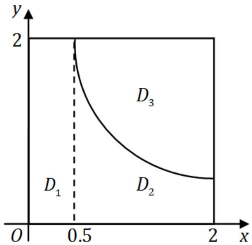

从而所求的积分

$$
\begin{array}{l} \iint_ {D} \max  (x y, 1) d x d y = \iint_ {D _ {1}} x y d x d y + \iint_ {D _ {2}} d x d y + \iint_ {D _ {3}} d x d y \\ = \int_ {0} ^ {\frac {1}{2}} d x \int_ {0} ^ {2} 1 d y + \int_ {\frac {1}{2}} ^ {2} d x \int_ {0} ^ {\frac {1}{x}} 1 d y + \int_ {\frac {1}{2}} ^ {2} d x \int_ {\frac {1}{x}} ^ {2} x y d y \\ = 1 + 2 \ln 2 + \frac {1 5}{4} - \ln 2 = \frac {1 9}{4} + \ln 2. \\ \end{array}
$$

19. (本题满分 11 分)

设 $f(x)$ 是区间 $[0, +\infty)$ 上具有连续导数的单调增加函数，且 $f(0) = 1$ 。对于任意的 $t \in [0, +\infty)$ ，直线 $x = 0$ ， $x = t$ ，曲线 $y = f(x)$ 以及 $x$ 轴所围成曲边梯形绕 $x$ 轴旋转一周生成一旋转体。若该旋转体的侧面面积在数值上等于其体积的2倍，求函数 $f(x)$ 的表达式。

解. 因为旋转体的体积 $V = \pi \int_{0}^{t} f^{2}(x) \, \mathrm{d}x$ , 侧面积 $S = 2\pi \int_{0}^{t} f(x) \sqrt{1 + f'^{2}(x)} \, \mathrm{d}x$ , 所以由题设有

$$
\int_ {0} ^ {t} f ^ {2} (x) \mathrm {d} x = \int_ {0} ^ {t} f (x) \sqrt {1 + f ^ {\prime 2} (x)} \mathrm {d} x.
$$

上式两端对 $t$ 求导得 $f^2 (t) = f(t)\sqrt{1 + f'^2(t)}$ ，即 $y^\prime = \sqrt{y^2 - 1}$ ．由分离变量法解得 $\ln (y + \sqrt{y^2 - 1}) = t + C_1$ ，即 $y + \sqrt{y^{2} - 1} = Ce^{t}$ 将 $y(0) = 1$ 代入知 $C = 1$ 故 $y + \sqrt{y^2 - 1} = \mathrm{e}^t$ ，即 $y = \frac{1}{2} (\mathrm{e}^t +\mathrm{e}^{-t})$ 于是所求函数为 $y = f(x) = \frac{1}{2} (\mathrm{e}^t +\mathrm{e}^{-t})$

20. (本题满分11分)

(I) 证明积分中值定理: 若函数 $f(x)$ 在闭区间 $[a, b]$ 上连续, 则至少存在一点 $\eta \in [a, b]$ , 使得 $\int_{a}^{b} f(x) \mathrm{d} x = f(\eta)(b - a)$ .

(II) 若函数 $\varphi(x)$ 具有二阶导数，且满足 $\varphi(2) > \varphi(1)$ ， $\varphi(2) > \int_{2}^{3} \varphi(x) \, \mathrm{d}x$ ，则至少存在一点 $\xi \in (1, 3)$ ，使得 $\varphi''(\xi) < 0$ 。

解. (I) 设 $M$ 与 $m$ 是连续函数 $f(x)$ 在 $[a, b]$ 上的最大值与最小值，即

$$
m \leqslant f (x) \leqslant M, \quad x \in [ a, b ].
$$

由定积分性质有

$$
m (b - a) \leqslant \int_ {a} ^ {b} f (x) \mathrm {d} x \leqslant M (b - a), \quad \Rightarrow \quad m \leqslant \frac {\int_ {a} ^ {b} f (x) \mathrm {d} x}{b - a} \leqslant M.
$$

由连续函数介值定理，至少存在一点 $\eta \in [a,b]$ ，使得

$$
f (\eta) = \frac {\int_ {a} ^ {b} f (x) \mathrm {d} x}{b - a} \Rightarrow \int_ {a} ^ {b} f (x) \mathrm {d} x = f (\eta) (b - a).
$$

(II) 由 (I) 的结论可知至少存在一点 $\eta \in [2,3]$ ，使

$$
\int_ {2} ^ {3} \varphi (x) d x = \varphi (\eta) (3 - 2) = \varphi (\eta).
$$

又由 $\varphi (2) > \int_{2}^{3}\varphi (x)\mathrm{d}x = \varphi (\eta)$ ，知 $2 <   \eta \leqslant 3$ .对 $\varphi (x)$ 在[1,2]和 $[2,\eta ]$ 上分别应用拉格朗日中值定理，并注意到 $\varphi (1) <   \varphi (2),\varphi (\eta) <   \varphi (2)$ ，得

$$
\begin{array}{l} \varphi^ {\prime} (\xi_ {1}) = \frac {\varphi (2) - \varphi (1)}{2 - 1} > 0, \quad 1 <   \xi_ {1} <   2; \\ \varphi^ {\prime} (\xi_ {2}) = \frac {\varphi (\eta) - \varphi (2)}{\eta - 2} <   0, \quad 2 <   \xi_ {1} <   \eta \leqslant 3. \\ \end{array}
$$

在 $[\xi_1,\xi_2]$ 上对 $\varphi^{\prime}(x)$ 应用拉格朗日中值定理，有 $\xi \in (\xi_{1},\xi_{2})\subset (1,3)$ ，使得

$$
\varphi^ {\prime \prime} (\xi) = \frac {\varphi^ {\prime} \left(\xi_ {2}\right) - \varphi^ {\prime} \left(\xi_ {1}\right)}{\xi_ {2} - \xi_ {1}} <   0.
$$

# 21. (本题满分 11 分)

求函数 $u = x^{2} + y^{2} + z^{2}$ 在约束条件 $z = x^{2} + y^{2}$ 和 $x + y + z = 4$ 下的最大和最小值.

# 解. 作拉格朗日函数

$$
F (x, y, z, \lambda , \mu) = x ^ {2} + y ^ {2} + z ^ {2} + \lambda (x ^ {2} + y ^ {2} - z) + \mu (x + y + z - 4),
$$

令各个偏导数为零得

$$
\left\{ \begin{array}{l} F _ {x} ^ {\prime} = 2 x + 2 \lambda x + \mu = 0, \\ F _ {y} ^ {\prime} = 2 y + 2 \lambda y + \mu = 0, \\ F _ {z} ^ {\prime} = 2 z - \lambda + \mu = 0, \\ F _ {\lambda} ^ {\prime} = x ^ {2} + y ^ {2} - z = 0, \\ F _ {\mu} ^ {\prime} = x + y + z - 4 = 0. \end{array} \right.
$$

解方程组得 $(x_{1},y_{1},z_{1}) = (1,1,2)$ ， $(x_{2},y_{2},z_{2}) = (-2, - 2,8)$ 故所求的最大值为72，最小值为6.

# 22. 同试卷一第三[21]题

23. (本题满分10分)

设 $A$ 为3阶矩阵， $\alpha_{1},\alpha_{2}$ 为 $A$ 的分别属于特征值-1,1的特征向量，向量 $\alpha_{3}$ 满足 $A\alpha_{3} = \alpha_{2} + \alpha_{3}$

(I) 证明 $\alpha_{1}, \alpha_{2}, \alpha_{3}$ 线性无关；(II) 令 $P = (\alpha_{1}, \alpha_{2}, \alpha_{3})$ ，求 $P^{-1}AP$ .

解. (I) 设存在数 $k_{1}, k_{2}, k_{3}$ , 使得

$$
k _ {1} \alpha_ {1} + k _ {2} \alpha_ {2} + k _ {3} \alpha_ {3} = 0.
$$

用 $A$ 左乘上式的两边，并由 $A\alpha_{1} = -\alpha_{1}, A\alpha_{2} = \alpha_{2}$ 得

$$
- k _ {1} \alpha_ {1} + (k _ {2} + k _ {3}) \alpha_ {2} + k _ {3} \alpha_ {3} = 0.
$$

上面两式相减得 $2k_{1}\alpha_{1} - k_{3}\alpha_{2} = 0$ 。因为 $\alpha_{1}, \alpha_{2}$ 是 $A$ 的属于不同特征值的特征向量，所以 $\alpha_{1}, \alpha_{2}$ 线性无关，从而 $k_{1} = k_{3} = 0$ ，代入第一式得 $k_{2}\alpha_{2} = 0$ ，又由于 $\alpha_{2} \neq 0$ ，所以 $k_{2} = 0$ ，故 $\alpha_{1}, \alpha_{2}, \alpha_{3}$ 线性无关。

(II) 若 $P = (\alpha_{1},\alpha_{2},\alpha_{3})$ ，则 $P$ 可逆，而且

$$
\begin{array}{l} A P = A (\alpha_ {1}, \alpha_ {2}, \alpha_ {3}) = (A \alpha_ {1}, A \alpha_ {2}, A \alpha_ {3}) = (- \alpha_ {1}, \alpha_ {2}, \alpha_ {2} + \alpha_ {3}) \\ = (\alpha_ {1}, \alpha_ {2}, \alpha_ {3}) \left( \begin{array}{c c c} - 1 & 0 & 0 \\ 0 & 1 & 1 \\ 0 & 0 & 1 \end{array} \right) = P \left( \begin{array}{c c c} - 1 & 0 & 0 \\ 0 & 1 & 1 \\ 0 & 0 & 1 \end{array} \right), \\ \end{array}
$$

所以 $P^{-1}AP = \left( \begin{array}{lll} - 1 & 0 & 0\\ 0 & 1 & 1\\ 0 & 0 & 1 \end{array} \right).$

# 二〇〇九年考研数学试卷二解答

# 一、选择题（1～8小题，每小题4分，共32分）

1. 函数 $f(x) = \frac{x - x^3}{\sin nx}$ 的可去间断点的个数为……（）

(A) 1.

(B) 2.

(C) 3.

(D) 无穷多个.

解. 应选 (C). 显然 $f(x)$ 的间断点为所有整数, 但可去间断点为极限存在的点, 故应是 $x - x^{3} = 0$ 的解 $x = 0$ 或 $x = -1$ 或 $x = 1$ . 因为

$$
\lim  _ {x \rightarrow 0} \frac {x - x ^ {3}}{\sin \pi x} = \lim  _ {x \rightarrow 0} \frac {1 - 3 x ^ {2}}{\pi \cos \pi x} = \frac {1}{\pi},
$$

$$
\lim  _ {x \rightarrow 1} \frac {x - x ^ {3}}{\sin \pi x} = \lim  _ {x \rightarrow 1} \frac {1 - 3 x ^ {2}}{\pi \cos \pi x} = \frac {2}{\pi},
$$

$$
\lim  _ {x \rightarrow - 1} \frac {x - x ^ {3}}{\sin \pi x} = \lim  _ {x \rightarrow - 1} \frac {1 - 3 x ^ {2}}{\pi \cos \pi x} = \frac {2}{\pi},
$$

所以可去间断点为3个.

2. 同试卷一第一[1]题

3. 设函数 $z = f(x, y)$ 的全微分为 $\mathrm{d}z = x \, \mathrm{d}x + y \, \mathrm{d}y$ ，则点 $(0, 0)$ ……( )

(A) 不是 $f(x, y)$ 的连续点.

(B) 不是 $f(x, y)$ 的极值点.

(C) 是 $f(x, y)$ 的极大值点.

(D) 是 $f(x, y)$ 的极小值点.

解. 应选 (D). 因 $\mathrm{d}z = x\mathrm{d}x + y\mathrm{d}y$ 可得 $\frac{\partial z}{\partial x} = x, \frac{\partial z}{\partial y} = y$ ，从而

$$
A = \frac {\partial^ {2} z}{\partial x ^ {2}} = 1, \qquad B = \frac {\partial^ {2} z}{\partial x \partial y} = \frac {\partial^ {2} z}{\partial y \partial x} = 0, \qquad C = \frac {\partial^ {2} z}{\partial y ^ {2}} = 1.
$$

又在 $(0,0)$ 处， $\frac{\partial z}{\partial x} = 0, \frac{\partial z}{\partial y} = 0$ ， $AC - B^2 = 1 > 0$ ，故 $(0,0)$ 为函数 $z = f(x,y)$ 的一个极小值点.

4. 设函数 $f(x, y)$ 连续，则 $\int_{1}^{2} \mathrm{d}x \int_{x}^{2} f(x, y) \mathrm{d}y + \int_{1}^{2} \mathrm{d}y \int_{y}^{4 - y} f(x, y) \mathrm{d}x = \cdots$ （ ）

(A) $\int_{1}^{2}\mathrm{d}x\int_{1}^{4 - x}f(x,y)\mathrm{d}y.$

(B) $\int_{1}^{2}\mathrm{d}x\int_{x}^{4 - x}f(x,y)\mathrm{d}y.$

(C) $\int_{1}^{2}\mathrm{d}y\int_{1}^{4 - y}f(x,y)\mathrm{d}x.$

(D) $\int_{1}^{2}\mathrm{d}y\int_{y}^{2}f(x,y)\mathrm{d}x.$

解. 应选 (C). $\int_{1}^{2} \mathrm{d}x \int_{x}^{2} f(x, y) \mathrm{d}y + \int_{1}^{2} \mathrm{d}y \int_{x}^{2} f(x, y) \mathrm{d}x$ 的积分区域为两部分:

$$
D _ {1} = \left\{(x, y) \mid 1 \leqslant x \leqslant 2, x \leqslant y \leqslant 2 \right\}, \quad D _ {2} = \left\{(x, y) \mid 1 \leqslant y \leqslant 2, y \leqslant x \leqslant 4 - y \right\}.
$$

将两部分合并得到 $D = \{(x,y) | 1 \leqslant y \leqslant 2, 1 \leqslant x \leqslant 4 - y\}$ . 故二重积分可以表示为 $\int_{1}^{2} \mathrm{d}y \int_{1}^{4 - y} f(x,y) \mathrm{d}x$ .

5. 若 $f''(x)$ 不变号，且曲线 $y = f(x)$ 在点 (1,1) 上的曲率圆为 $x^2 + y^2 = 2$ ，则 $f(x)$ 在区间 (1,2) 内……（）

(A) 有极值点, 无零点.

(B) 无极值点, 有零点.

(C) 有极值点, 有零点.

(D) 无极值点, 无零点.

解. 应选 (B). 由题意可知, $f(1) = 1$ , $f'(1) = -1$ , 且由 $f(x)$ 在点 (1,1) 处的曲率

$$
\rho = \frac {| y ^ {\prime \prime} |}{\left(1 + (y ^ {\prime}) ^ {2}\right) ^ {\frac {3}{2}}} = \frac {1}{\sqrt {2}},
$$

可得 $f^{\prime \prime}(1) = -2$ ，因为 $f^{\prime \prime}(x)$ 不变号，所以 $f^{\prime \prime}(x) < 0$ ，在[1,2]上，

$$
f ^ {\prime} (x) \leqslant f ^ {\prime} (1) = - 1 <   0,
$$

即 $f(x)$ 单调减少，没有极值点．由拉格朗日中值定理，

$$
f (2) - f (1) = f ^ {\prime} (\zeta) <   - 1, \quad \zeta \in (1, 2).
$$

所以 $f(2) < 0$ . 而 $f(1) = 1 > 0$ ，由零点定理知， $f(x)$ 在 $[1,2]$ 上有零点.

6. 同试卷一第一[3]题.

7. 同试卷一第一[6]题

8. 设 $A, P$ 均为3阶矩阵， $P^T$ 为 $P$ 的转置矩阵，且 $P^T A P = \begin{pmatrix} 1 & 0 & 0 \\ 0 & 1 & 0 \\ 0 & 0 & 2 \end{pmatrix}$ ，若 $P = (\alpha_1, \alpha_2, \alpha_3)$ ， $Q = (\alpha_1 + \alpha_2, \alpha_2, \alpha_3)$ ，则 $Q^T A Q$ 为……（）

(A) $\left( \begin{array}{lll}2 & 1 & 0\\ 1 & 1 & 0\\ 0 & 0 & 2 \end{array} \right)$

(B) $\left( \begin{array}{lll}1 & 1 & 0\\ 1 & 2 & 0\\ 0 & 0 & 2 \end{array} \right)$

(C) $\left( \begin{array}{lll}2 & 0 & 0\\ 0 & 1 & 0\\ 0 & 0 & 2 \end{array} \right)$

(D) $\left( \begin{array}{lll}1 & 0 & 0\\ 0 & 2 & 0\\ 0 & 0 & 2 \end{array} \right)$

解. 应选 (A). 记 $E_{12}(1) = \begin{pmatrix} 1 & 0 & 0 \\ 1 & 1 & 0 \\ 0 & 0 & 1 \end{pmatrix}$ , 则有 $Q = PE_{12}(1)$ . 从而

$$
\begin{array}{l} Q ^ {T} A Q = [ P E _ {1 2} (1) ] ^ {T} A [ P E _ {1 2} (1) ] = E _ {1 2} ^ {T} (1) [ P ^ {T} A P ] E _ {1 2} (1) \\ = \left( \begin{array}{l l l} 1 & 1 & 0 \\ 0 & 1 & 0 \\ 0 & 0 & 1 \end{array} \right) \left( \begin{array}{l l l} 1 & 0 & 0 \\ 0 & 1 & 0 \\ 0 & 0 & 2 \end{array} \right) \left( \begin{array}{l l l} 1 & 0 & 0 \\ 1 & 1 & 0 \\ 0 & 0 & 1 \end{array} \right) = \left( \begin{array}{l l l} 2 & 1 & 0 \\ 1 & 1 & 0 \\ 0 & 0 & 2 \end{array} \right). \\ \end{array}
$$

# 二、填空题（9～14小题，每小题4分，共24分）

9. 曲线 $\left\{ \begin{array}{l} x = \int_{0}^{1 - t} \mathrm{e}^{-u^2} \, \mathrm{d}u \\ y = t^2 \ln (2 - t^2) \end{array} \right.$ 在 $(0, 0)$ 处的切线方程为

解. 应填 $y = 2x$ . 因为

$$
\frac {\mathrm {d} y}{\mathrm {d} x} = \left. \frac {\mathrm {d} y / \mathrm {d} t}{\mathrm {d} x / \mathrm {d} t} \right| _ {t = 1} = \left. \frac {2 t \ln (2 - t ^ {2}) - t ^ {2} \cdot \frac {2 t}{2 - t ^ {2}}}{\mathrm {e} ^ {- (1 - t) ^ {2}} \cdot (- 1)} \right| _ {t = 1} = \frac {- 2}{- 1} = 2,
$$

所以切线方程为 $y = 2x$

10. 已知 $\int_{-\infty}^{+\infty}\mathrm{e}^{k|x|}\mathrm{d}x = 1$ ，则 $k =$ ________.

解. 应填 -2. 显然有 $k < 0$ . 所以

$$
1 = \int_ {- \infty} ^ {+ \infty} \mathrm {e} ^ {k | x |} \mathrm {d} x = 2 \int_ {0} ^ {+ \infty} \mathrm {e} ^ {k x} \mathrm {d} x = \left[ \frac {1}{k} \mathrm {e} ^ {k x} \right] _ {0} ^ {+ \infty} = 0 - \frac {2}{k} = - \frac {2}{k},
$$

从而 $k = -2$

11. $\lim_{n\to \infty}\int_0^1\mathrm{e}^{-x}\sin nx\mathrm{d}x = \underline{\quad}$

解. 应填 0 . 由分部积分法有

$$
\begin{array}{l} I _ {n} = \int \mathrm {e} ^ {- x} \sin n x \mathrm {d} x = - \mathrm {e} ^ {- x} \sin n x + n \int \mathrm {e} ^ {- x} \cos n x \mathrm {d} x \\ = - \mathrm {e} ^ {- x} \sin n x - n \mathrm {e} ^ {- x} \cos n x - n ^ {2} I _ {n}, \\ \end{array}
$$

所以 $I_{n} = -\frac{n\cos nx + \sin nx}{n^{2} + 1}\mathrm{e}^{-x} + C$ ，即

$$
\begin{array}{l} \lim  _ {n \rightarrow \infty} \int_ {0} ^ {1} \mathrm {e} ^ {- x} \sin n x \mathrm {d} x = \lim  _ {n \rightarrow \infty} \left[ - \frac {n \cos n x + \sin n x}{n ^ {2} + 1} \mathrm {e} ^ {- x} \right] _ {0} ^ {1} \\ = \lim  _ {n \rightarrow \infty} \left(- \frac {n \cos n + \sin n}{n ^ {2} + 1} e ^ {- 1} + \frac {n}{n ^ {2} + 1}\right) = 0. \\ \end{array}
$$

12. 设 $y = y(x)$ 是由方程 $xy + e^{y} = x + 1$ 确定的隐函数，则 $\left.\frac{\partial^2y}{\partial x^2}\right|_{x=0} =$ ________.

解. 应填 -3. 对方程 $xy + \mathrm{e}^{y} = x + 1$ 两边关于 $x$ 求导有

$$
y + x y ^ {\prime} + y ^ {\prime} \mathrm {e} ^ {y} = 1 \quad \Rightarrow \quad y ^ {\prime} = \frac {1 - y}{x + \mathrm {e} ^ {y}}.
$$

对 $y + xy' + y'\mathrm{e}^{y} = 1$ 再次求导可得

$$
2 y ^ {\prime} + x y ^ {\prime \prime} + y ^ {\prime \prime} e ^ {y} + (y ^ {\prime}) ^ {2} e ^ {y} = 0, \Rightarrow y ^ {\prime \prime} = - \frac {2 y ^ {\prime} + (y ^ {\prime}) ^ {2} e ^ {y}}{x + e ^ {y}}.
$$

当 $x = 0$ 时， $y = 0$ ， $y'(0) = 1$ ，代入上式得 $y''(0) = -3$ .

13. 函数 $y = {x}^{2x}$ 在区间(0,1]上的最小值为_____.

解. 应填 $\mathrm{e}^{-\frac{2}{\mathrm{e}}}$ . 因为 $y' = x^{2x}(2 \ln x + 2)$ , 令 $y' = 0$ 得驻点为 $x = \frac{1}{\mathrm{e}}$ . 又

$$
y ^ {\prime \prime} = x ^ {2 x} (2 \ln x + 2) ^ {2} + x ^ {2 x} \cdot \frac {2}{x} \Rightarrow y ^ {\prime \prime} \left(\frac {1}{\mathrm {e}}\right) = 2 \mathrm {e} ^ {- \frac {2}{\mathrm {e}} + 1} > 0.
$$

故 $x = \frac{1}{\mathrm{e}}$ 为 $y = x^{2x}$ 的极小值点，此时 $y = \mathrm{e}^{-\frac{2}{\mathrm{e}}}$ 。又当 $x \in \left(0, \frac{1}{\mathrm{e}}\right)$ 时， $y'(x) < 0$ ； $x \in \left(\frac{1}{\mathrm{e}}, 1\right]$ 时， $y'(x) > 0$ ，故 $y$ 在 $\left(0, \frac{1}{\mathrm{e}}\right)$ 上递减，在 $\left(\frac{1}{\mathrm{e}}, 1\right)$ 上递增。而

$$
y (1) = 1, \quad y _ {+} (0) = \lim  _ {x \rightarrow 0 ^ {+}} x ^ {2 x} = \lim  _ {x \rightarrow 0 ^ {+}} e ^ {2 x \ln x} = 1,
$$

所以 $y = x^{2x}$ 在区间 $[0,1]$ 上的最小值为 $y\left(\frac{1}{e}\right) = e^{-\frac{2}{e}}$ .

14. 设 $\alpha, \beta$ 为3维列向量， $\beta^T$ 为 $\beta$ 的转置，若矩阵 $\alpha \beta^T$ 相似于 $\left( \begin{array}{lll}2 & 0 & 0\\ 0 & 0 & 0\\ 0 & 0 & 0 \end{array} \right)$ ，则 $\beta^T \alpha =$ ________.

解. 应填2. 因为 $\alpha \beta^T$ 相似于 $\left( \begin{array}{lll} 2 & 0 & 0 \\ 0 & 0 & 0 \\ 0 & 0 & 0 \end{array} \right)$ , 根据相似矩阵有相同的特征值, 得到 $\alpha \beta^T$ 的特征值是 $2,0,0$ . 而 $\beta^T \alpha$ 是一个常数, 是矩阵 $\alpha \beta^T$ 的对角元素之和, 则 $\beta^T \alpha = 2 + 0 + 0 = 2$ .

# 三、解答题（15～23小题，共94分）

15. (本题满分9分)

求极限 $\lim_{x\to 0}\frac{(1 - \cos x)[x - \ln(1 + \tan x)]}{\sin^4x}.$

解. 由等价无穷小量代换和洛必达法则, 可得

$$
\begin{array}{l} \lim  _ {x \rightarrow 0} \frac {(1 - \cos x) [ x - \ln (1 + \tan x) ]}{\sin^ {4} x} = \lim  _ {x \rightarrow 0} \frac {\frac {1}{2} x ^ {2} [ x - \ln (1 + \tan x) ]}{x ^ {4}} \\ = \lim  _ {x \rightarrow 0} \frac {x - \ln (1 + \tan x)}{2 x ^ {2}} = \lim  _ {x \rightarrow 0} \frac {1 - \frac {\sec^ {2} x}{1 + \tan x}}{4 x} = \lim  _ {x \rightarrow 0} \frac {1 + \tan x - \sec^ {2} x}{4 x} \\ = \lim  _ {x \rightarrow 0} \frac {\sec^ {2} x - 2 \sec^ {2} x \tan x}{4} = \frac {1}{4}. \\ \end{array}
$$

16. (本题满分 10 分)

计算不定积分 $\int \ln \left(1 + \sqrt{\frac{1 + x}{x}}\right) \mathrm{d}x (x > 0)$ .

解. 令 $\sqrt{\frac{1 + x}{x}} = t$ , 则 $x = \frac{1}{t^2 - 1}, \mathrm{d}x = \frac{-2t \mathrm{~d}t}{(t^2 - 1)^2}$ , 从而

$$
\begin{array}{l} \int \ln \left(1 + \sqrt {\frac {1 + x}{x}}\right) d x = \int \ln (1 + t) d \left(\frac {1}{t ^ {2} - 1}\right) = \frac {\ln (1 + t)}{t ^ {2} - 1} - \int \frac {1}{t ^ {2} - 1} \frac {1}{t + 1} d t \\ = \frac {\ln (1 + t)}{t ^ {2} - 1} - \frac {1}{4} \int \left(\frac {1}{t - 1} - \frac {1}{t + 1} - \frac {2}{(t + 1) ^ {2}}\right) d t \\ = \frac {\ln (1 + t)}{t ^ {2} - 1} - \frac {1}{4} \ln (t - 1) + \frac {1}{4} \ln (t + 1) - \frac {1}{2 (t + 1)} + C \\ \end{array}
$$

$$
\begin{array}{l} = \frac {\ln (1 + t)}{t ^ {2} - 1} + \frac {1}{4} \ln \frac {t + 1}{t - 1} - \frac {1}{2 (t + 1)} + C \\ = x \ln \left(1 + \sqrt {\frac {1 + x}{x}}\right) + \frac {1}{2} \ln (\sqrt {1 + x} + \sqrt {x}) - \frac {1}{2} \frac {\sqrt {x}}{\sqrt {1 + x} + \sqrt {x}} + C \\ = x \ln \left(1 + \sqrt {\frac {1 + x}{x}}\right) + \frac {1}{2} \ln (\sqrt {1 + x} + \sqrt {x}) + \frac {1}{2} x - \frac {1}{2} \sqrt {x + x ^ {2}} + C. \\ \end{array}
$$

17. (本题满分 10 分)

设 $z = f(x + y, x - y, xy)$ , 其中 $f$ 具有 2 阶连续偏导数, 求 $\mathrm{d}z$ 与 $\frac{\partial^2 z}{\partial x \partial y}$ .

解. 因为 $\frac{\partial z}{\partial x} = f_1' + f_2' + yf_3'$ , $\frac{\partial z}{\partial y} = f_1' - f_2' + xf_3'$ , 所以

$$
\begin{array}{l} \mathrm {d} z = \frac {\partial z}{\partial x} \mathrm {d} x + \frac {\partial z}{\partial y} \mathrm {d} y = \left(f _ {1} ^ {\prime} + f _ {2} ^ {\prime} + y f _ {3} ^ {\prime}\right) \mathrm {d} x + \left(f _ {1} ^ {\prime} - f _ {2} ^ {\prime} + x f _ {3} ^ {\prime}\right) \mathrm {d} y, \\ \frac {\partial^ {2} z}{\partial x \partial y} = f _ {1 1} ^ {\prime \prime} - f _ {1 2} ^ {\prime \prime} + f _ {1 3} ^ {\prime \prime} \cdot x + f _ {2 1} ^ {\prime \prime} - f _ {2 2} ^ {\prime \prime} + f _ {2 3} ^ {\prime \prime} \cdot x + f _ {3} ^ {\prime} + y \left[ f _ {3 1} ^ {\prime \prime} - f _ {3 2} ^ {\prime \prime} \cdot + f _ {3 3} ^ {\prime \prime} \cdot x \right] \\ = f _ {3} ^ {\prime} + f _ {1 1} ^ {\prime \prime} - f _ {2 2} ^ {\prime \prime} + x y f _ {3 3} ^ {\prime \prime} + (x + y) f _ {1 3} ^ {\prime \prime} + (x - y) f _ {2 3} ^ {\prime \prime}, \\ \end{array}
$$

18. (本题满分 10 分)

设非负函数 $y = y(x)$ （ $x \geqslant 0$ ）满足微分方程 $xy'' - y' + 2 = 0$ ，当曲线 $y = y(x)$ 过原点时，其与直线 $x = 1$ 及 $y = 0$ 围成平面区域 $D$ 的面积为 2，求 $D$ 绕 $y$ 轴旋转所得旋转体体积.

解. 令 $p = y'$ , 代入微分方程得 $p' - \frac{1}{x} p = -\frac{2}{x}$ , 解得 $p = 2 + C_1 x$ , 即 $y' = 2 + C_1 x$ . 因此通解为 $y = C_2 + 2x + \frac{C_1}{2} x^2$ , 其中 $C_1, C_2$ 为任意常数. 由题设, $y(0) = 0$ 即 $C_2 = 0$ , 而且

$$
2 = \int_ {0} ^ {1} y (x) d x = \int_ {0} ^ {1} \left(2 x + \frac {C _ {1}}{2} x ^ {2}\right) d x = \left[ x ^ {2} + \frac {C _ {1}}{6} x ^ {3} \right] _ {0} ^ {1} = 1 + \frac {C _ {1}}{6},
$$

从而 $C_1 = 6$ ，于是所求非负函数为 $y = 2x + 3x^2 (x\geqslant 0)$ . 所求体积为

$$
V = 2 \pi \int_ {0} ^ {1} x y (x) d x = 2 \pi \int_ {0} ^ {1} \left(2 x ^ {2} + 3 x ^ {3}\right) d x = \frac {1 7}{6} \pi .
$$

19. (本题满分 10 分)

计算二重积分 $\iint_{D} (x - y) \, \mathrm{d}x \, \mathrm{d}y$ ，其中 $D = \{(x, y) | (x - 1)^2 + (y - 1)^2 \leqslant 2, y \geqslant x\}$ .

解.由 $(x - 1)^2 +(y - 1)^2\leqslant 2$ 得极坐标表示 $\frac{\pi}{4}\leqslant \theta \leqslant \frac{3\pi}{4},0\leqslant r\leqslant 2(\sin \theta +\cos \theta).$

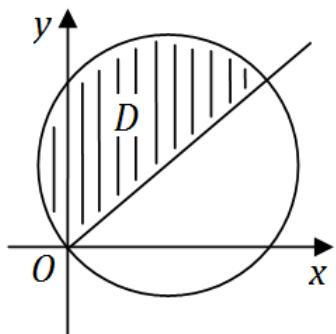

故由二重积分的极坐标公式可得

$$
\begin{array}{l} \iint_ {D} (x - y) \mathrm {d} x \mathrm {d} y = \int_ {\frac {\pi}{4}} ^ {\frac {3 \pi}{4}} \mathrm {d} \theta \int_ {0} ^ {2 (\sin \theta + \cos \theta)} (r \cos \theta - r \sin \theta) r \mathrm {d} r \\ = \int_ {\frac {\pi}{4}} ^ {\frac {3 \pi}{4}} \left[ \frac {1}{3} (\cos \theta - \sin \theta) \cdot r ^ {3} \right] _ {0} ^ {2 (\sin \theta + \cos \theta)} d \theta = \frac {8}{3} \int_ {\frac {\pi}{4}} ^ {\frac {3 \pi}{4}} (\cos \theta - \sin \theta) (\sin \theta + \cos \theta) ^ {3} d \theta \\ = \frac {8}{3} \int_ {\frac {\pi}{4}} ^ {\frac {3 \pi}{4}} (\sin \theta + \cos \theta) ^ {3} d (\sin \theta + \cos \theta) = \frac {8}{3} \times \frac {1}{4} \left[ (\sin \theta + \cos \theta) ^ {4} \right] _ {\frac {\pi}{4}} ^ {\frac {3 \pi}{4}} = - \frac {8}{3}. \\ \end{array}
$$

20. (本题满分 12 分)

设 $y = y(x)$ 是区间 $(- \pi, \pi)$ 内过点 $\left(-\frac{\pi}{\sqrt{2}}, \frac{\pi}{\sqrt{2}}\right)$ 的光滑曲线，当 $-\pi < x < 0$ 时，曲线上任一点处的法线都过原点，当 $0 \leqslant x < \pi$ 时，函数 $y(x)$ 满足 $y'' + y + x = 0$ 。求 $y(x)$ 的表达式。

解. 由题意, 当 $-\pi < x < 0$ 时, $y = -\frac{x}{y'}$ , 即 $y \mathrm{~d} y = -x \mathrm{~d} x$ , 得 $y^{2} = -x^{2} + C$ , 又曲线过点 $\left(-\frac{\pi}{\sqrt{2}}, \frac{\pi}{\sqrt{2}}\right)$ , 故 $C = \pi^{2}$ , 从而有 $y = \sqrt{\pi^{2} - x^{2}}$ .

当 $0 \leqslant x < \pi$ 时， $y(x)$ 满足 $y'' + y + x = 0$ 。它对应的齐次方程的通解为 $y^* = c_1 \cos x + c_2 \sin x$ ；设它有特解 $y^* = ax + b$ ，解得 $a = -1, b = 0$ ，故 $y^* = -x$ 。因此当 $0 \leqslant x < \pi$ 时 $y = C_1 \cos x + C_2 \sin x - x$ 。

由于 $y = y(x)$ 是 $(- \pi, \pi)$ 内的光滑曲线，故它在 $x = 0$ 处连续且可导，于是由 $y(0^{-}) = \pi = y(0^{+}) = C_{1}$ ，得 $C_{1} = \pi$ ；由 $y_{-}^{\prime}(0) = 0 = y_{+}^{\prime}(0) = C_{2} - 1$ ，得 $C_{2} = 1$ 。所以 $y(x)$ 的表达式为

$$
y = \left\{ \begin{array}{l l} \sqrt {\pi^ {2} - x ^ {2}}, & - \pi <   x <   0; \\ \pi \cos x + \sin x - x, & 0 \leqslant x <   \pi . \end{array} \right.
$$

21. 同试卷一第三[18]题.  
22. 同试卷一第三[20]题  
23. 同试卷一第三[21]题

# 二〇一〇年考研数学试卷二解答

# 一、选择题（1～8小题，每小题4分，共32分）

1. 函数 $f(x) = \frac{x^2 - x}{x^2 - 1}\sqrt{1 + \frac{1}{x^2}}$ 的无穷间断点的个数为……（）

(A) 0.

(B) 1.

(C) 2.

(D) 3.

解. 应选 (B). 易知 $f(x)$ 有间断点 $x = 0, \pm 1$ . 因为

$$
\lim  _ {x \rightarrow 0 ^ {+}} f (x) = \lim  _ {x \rightarrow 0 ^ {+}} \frac {x (x - 1)}{(x + 1) (x - 1)} \sqrt {1 + \frac {1}{x ^ {2}}} = \lim  _ {x \rightarrow 0 ^ {+}} x \sqrt {1 + \frac {1}{x ^ {2}}} = 1,
$$

$$
\lim  _ {x \rightarrow 0 ^ {-}} f (x) = \lim  _ {x \rightarrow 0 ^ {-}} \frac {x (x - 1)}{(x + 1) (x - 1)} \sqrt {1 + \frac {1}{x ^ {2}}} = \lim  _ {x \rightarrow 0 ^ {-}} x \sqrt {1 + \frac {1}{x ^ {2}}} = - 1,
$$

所以 $x = 0$ 为跳跃间断点．因为

$$
\lim  _ {x \rightarrow 1} f (x) = \frac {1}{2} \sqrt {1 + 1} = \frac {\sqrt {2}}{2},
$$

所以 $x = 1$ 为可去间断点点．因为

$$
\lim  _ {x \rightarrow - 1} f (x) = \lim  _ {x \rightarrow - 1} \frac {x (x - 1)}{(x + 1) (x - 1)} \sqrt {1 + \frac {1}{x ^ {2}}} = \infty ,
$$

所以 $x = -1$ 为无穷间断点．总之，无穷间断点仅有一个.

2. 设 $y_{1}, y_{2}$ 是一阶线性非齐次微分方程 $y' + p(x)y = q(x)$ 的两个特解, 若常数 $\lambda, \mu$ 使 $\lambda y_{1} + \mu y_{2}$ 是该方程的解, $\lambda y_{1} - \mu y_{2}$ 是该方程对应的齐次方程的解, 则 $\cdot$ ( )

(A) $\lambda = \frac{1}{2},\mu = \frac{1}{2}.$

(B) $\lambda = -\frac{1}{2}, \mu = -\frac{1}{2}$ .

(C) $\lambda = \frac{2}{3},\mu = \frac{1}{3}.$

(D) $\lambda = \frac{2}{3},\mu = \frac{2}{3}.$

解. 应选 (A). 因为 $\lambda y_{1} + \mu y_{2}$ 是非齐次微分方程 $y' + p(x)y = q(x)$ 的解, 代入方程解得 $\lambda + \mu = 1$ ; 又因为 $\lambda y_{1} - \mu y_{2}$ 是 $y' + p(x)y = 0$ 的解, 代入方程求得 $\lambda - \mu = 0$ . 由此可求得 $\lambda = \mu = \frac{1}{2}$ .

3. 曲线 $y = x^{2}$ 与曲线 $y = a\ln x$ （ $a \neq 0$ ）相切，则 $a = \dots \dots \dots \dots \dots \dots \dots \dots \dots \dots \dots \dots \dots \dots$ （

(A) 4e.

(B) 3e.

(C) $2\mathbf{e}$

(D) e.

解. 应选 (C). 设 $y = x^{2}$ 与 $y = a\ln x$ 的公切点为 $(x_0, y_0)$ , 则有

$$
y _ {0} = x _ {0} ^ {2}, \quad y _ {0} = a \ln x _ {0}, \quad 2 x _ {0} = \frac {a}{x _ {0}}.
$$

从而解得 $a = 2 \mathrm{e}$ .

4. 同试卷一第一[3]题  
5. 同试卷一第一[2]题  
6. 同试卷一第一[4]题

7. 设向量组 $\mathrm{I}:\alpha_{1},\alpha_{2},\dots ,\alpha_{r}$ 可由向量组 $\mathrm{II}:\beta_{1},\beta_{2},\dots ,\beta_{s}$ 线性表示, 下列命题正确的是……( )

(A) 若向量组 I 线性无关, 则 $r \leqslant s$ .

(B) 若向量组 I 线性相关, 则 $r > s$ .

(C) 若向量组 $\mathrm{II}$ 线性无关，则 $r \leqslant s$

(D) 若向量组 $\mathrm{II}$ 线性相关, 则 $r > s$ .

解. 应选 (A). 由于向量组 I 能由向量组 II 线性表示, 所以

$$
r \left(\alpha_ {1}, \dots , \alpha_ {r}\right) \leqslant r \left(\beta_ {1}, \dots , \beta_ {s}\right) \leqslant s.
$$

若向量组 I 线性无关, 则 $r(\alpha_{1}, \cdots, \alpha_{r}) = r$ , 所以

$$
r = r (\alpha_ {1}, \dots , \alpha_ {r}) \leqslant r (\beta_ {1}, \dots , \beta_ {s}) \leqslant s,
$$

即有 $r \leqslant s$

8. 同试卷一第一[6]题

# 二、填空题（9~14小题，每小题4分，共24分）

9. 3 阶常系数线性齐次微分方程 $y''' - 2y'' + y' - 2y = 0$ 的通解为 $y =$ ________.

解. 应填 $C_{1} \mathrm{e}^{2 x} + C_{2} \cos x + C_{3} \sin x$ . 该常系数线性齐次微分方程的特征方程为 $\lambda^{3}-2 \lambda^{2}+\lambda-2=0$ , 解得特征根为 $\lambda=2, \lambda=\pm i$ , 所以通解为

$$
y = C _ {1} \mathrm {e} ^ {2 x} + C _ {2} \cos x + C _ {3} \sin x.
$$

10. 曲线 $y = \frac{2x^3}{x^2 + 1}$ 的渐近线方程为

解. 应填 $y = 2x$ . 易知曲线没有铅直和水平渐近线. 因为 $k = \lim_{x \to \infty} \frac{y}{x} = 2 \neq 0$ , 所以曲线有斜渐近线. 又因为 $b = \lim_{x \to \infty} (y - kx) = 0$ , 所以斜渐近线方程为 $y = 2x$ .

11. 函数 $y = \ln (1 - 2x)$ 在 $x = 0$ 处的 $n$ 阶导数 $y^{(n)}(0) =$ ________.

解. 应填 $-2^{n}(n - 1)!$ . 由高阶导数公式可知 $\ln^{(n)}(1 + x) = (-1)^{n - 1}\frac{(n - 1)!}{(1 + x)^{n}}$ , 所以

$$
\ln^ {(n)} (1 - 2 x) = (- 1) ^ {n - 1} \frac {(n - 1) !}{(1 - 2 x) ^ {n}} \cdot (- 2) ^ {n} = - 2 ^ {n} \frac {(n - 1) !}{(1 - 2 x) ^ {n}},
$$

从而 $y^{(n)}(0) = -2^n\frac{(n - 1)!}{(1 - 2\cdot 0)^n} = -2^n (n - 1)!$

12. 当 $0 \leqslant \theta \leqslant \pi$ 时, 对数螺线 $r = \mathrm{e}^{\theta}$ 的弧长为

解. 应填 $\sqrt{2} (\mathrm{e}^{\pi} - 1)$ . 由极坐标弧长公式可得

$$
s = \int_ {0} ^ {\pi} \sqrt {\left(\mathrm {e} ^ {\theta}\right) ^ {2} + \left(\mathrm {e} ^ {\theta}\right) ^ {2}} \mathrm {d} \theta = \int_ {0} ^ {\pi} \sqrt {2} \mathrm {e} ^ {\theta} \mathrm {d} \theta = \sqrt {2} \left(\mathrm {e} ^ {\pi} - 1\right).
$$

13. 已知一个长方形的长 $l$ 以 $2 \mathrm{~cm} / \mathrm{s}$ 的速率增加, 宽 $w$ 以 $3 \mathrm{~cm} / \mathrm{s}$ 的速率增加. 则当 $l = 12 \mathrm{~cm}, w = 5 \mathrm{~cm}$ 时, 它的对角线增加的速率为

解. 应填 $3 \mathrm{~cm} / \mathrm{s}$ . 设 $l = x(t), w = y(t)$ , 由题意知, 在 $t = t_{0}$ 时刻 $x\left(t_{0}\right)=12, y\left(t_{0}\right)=5$ , 且 $x^{\prime}\left(t_{0}\right)=2, y^{\prime}\left(t_{0}\right)=3$ . 设该对角线长为 $S(t)$ , 则

$$
S (t) = \sqrt {x ^ {2} (t) + y ^ {2} (t)} \Rightarrow S ^ {\prime} (t) = \frac {x (t) x ^ {\prime} (t) + y (t) y ^ {\prime} (t)}{\sqrt {x ^ {2} (t) + y ^ {2} (t)}}.
$$

代入易知数据可得

$$
S ^ {\prime} (t _ {0}) = \frac {x (t _ {0}) x ^ {\prime} (t _ {0}) + y (t _ {0}) y ^ {\prime} (t _ {0})}{\sqrt {x ^ {2} (t _ {0}) + y ^ {2} (t _ {0})}} = \frac {1 2 \cdot 2 + 5 \cdot 3}{\sqrt {1 2 ^ {2} + 5 ^ {2}}} = 3.
$$

14. 设 $A, B$ 为3阶矩阵，且 $|A| = 3, |B| = 2, \left|A^{-1} + B\right| = 2$ ，则 $\left|A + B^{-1}\right| =$

解. 应填3．由于 $A(A^{-1} + B)B^{-1} = (E + AB)B^{-1} = B^{-1} + A$ ，所以

$$
\left| A + B ^ {- 1} \right| = \left| A (A ^ {- 1} + B) B ^ {- 1} \right| = | A | \left| A ^ {- 1} + B \right| \left| B ^ {- 1} \right| = 3 \times 2 \times \frac {1}{2} = 3.
$$

# 三、解答题（15～23小题，共94分）

15. 同试卷一第三 [16] 题.  
16. 同试卷一第三[17]题  
17. (本题满分 10 分)

设函数 $y = f(x)$ 由参数方程 $\left\{ \begin{array}{l} x = 2t + t^2 \\ y = \psi(t) \end{array} \right.$ ( $t > -1$ ) 所确定，其中 $\psi(t)$ 具有 2 阶导数，且 $\psi(1) = \frac{5}{2}$ ， $\psi'(1) = 6$ 。已知 $\frac{\mathrm{d}^2y}{\mathrm{d}x^2} = \frac{3}{4(1 + t)}$ ，求函数 $\psi(t)$ 。

解. 根据题意, 求导得

$$
\begin{array}{l} \frac {\mathrm {d} y}{\mathrm {d} x} = \frac {\mathrm {d} y / d t}{\mathrm {d} x / d t} = \frac {\psi^ {\prime} (t)}{2 t + 2}, \\ \frac {\mathrm {d} ^ {2} y}{\mathrm {d} x ^ {2}} = \frac {\mathrm {d}}{\mathrm {d} t} \left(\frac {\psi^ {\prime} (t)}{2 t + 2}\right) \cdot \frac {1}{\mathrm {d} x / d t} = \frac {\psi^ {\prime \prime} (t) (2 t + 2) - 2 \psi^ {\prime} (t)}{(2 t + 2) ^ {2}} \cdot \frac {1}{2 t + 2} = \frac {3}{4 (1 + t)}. \\ \end{array}
$$

整理得 $\psi''(t)(t + 1) - \psi'(t) = 3(t + 1)^2$ 。令 $y = \psi'(t)$ ，则有

$$
y ^ {\prime} - \frac {1}{1 + t} y = 3 (1 + t) \Rightarrow y = (1 + t) (3 t + C _ {1}).
$$

因为 $y(1) = \psi'(1) = 6$ ，所以 $C_1 = 0$ ，故 $y = 3t(t + 1)$ ，即 $\psi'(t) = 3t(t + 1)$ 。故

$$
\psi (t) = \int 3 t (t + 1) \mathrm {d} t = \frac {3}{2} t ^ {2} + t ^ {3} + C _ {2}.
$$

又由 $\psi (1) = \frac{5}{2}$ 得 $C_2 = 0$ ，故 $\psi (t) = \frac{3}{2} t^2 +t^3.$

18. (本题满分 10 分)

一个高为 $l$ 的柱体形贮油罐, 底面是长轴为 $2 a$ , 短轴为 $2 b$ 的椭圆. 现将贮油罐平放, 当油罐中油面高度为 $\frac{3}{2} b$ 时 (如图), 计算油的质量.

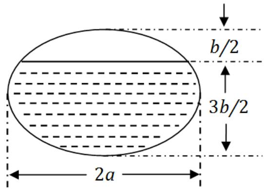

(长度单位为 $\mathrm{m}$ , 质量单位为 $\mathrm{kg}$ , 油的密度为常数 $\rho \mathrm{kg} / \mathrm{m}^{3}$ )

解. 如图建立坐标系, 则油罐底面的椭圆方程为 $\frac{x^{2}}{a^{2}} + \frac{y^{2}}{b^{2}} = 1$ .

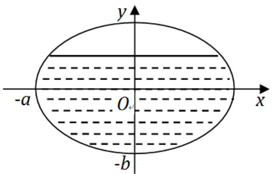

阴影部分的面积（其中用到 $y = b \sin t$ 换元）

$$
\begin{array}{l} S = \int_ {- b} ^ {\frac {b}{2}} 2 x \mathrm {d} y = \frac {2 a}{b} \int_ {- b} ^ {\frac {b}{2}} \sqrt {b ^ {2} - y ^ {2}} \mathrm {d} y = 2 a b \int_ {- \frac {\pi}{2}} ^ {\frac {\pi}{6}} \cos^ {2} t \mathrm {d} t \\ = 2 a b \int_ {- \frac {\pi}{2}} ^ {\frac {\pi}{6}} \left(\frac {1}{2} + \frac {1}{2} \cos 2 t\right) d t = \left(\frac {2}{3} \pi + \frac {\sqrt {3}}{4}\right) a b. \\ \end{array}
$$

所以油的质量 $m = \left(\frac{2}{3}\pi +\frac{\sqrt{3}}{4}\right)ab\ln \rho .$

19. (本题满分 11 分)

设函数 $u = f(x,y)$ 具有二阶连续偏导数, 且满足等式 $4\frac{\partial^2 u}{\partial x^2} + 12\frac{\partial^2 u}{\partial x \partial y} + 5\frac{\partial^2 u}{\partial y^2} = 0$

确定 $a, b$ 的值，使等式在变换 $\xi = x + ay, \eta = x + by$ 下化简为 $\frac{\partial^2 u}{\partial \xi \partial \eta} = 0$ .

解. 由复合函数链式法则得

$$
\begin{array}{l} \frac {\partial u}{\partial x} = \frac {\partial u}{\partial \xi} \cdot \frac {\partial \xi}{\partial x} + \frac {\partial u}{\partial y} \cdot \frac {\partial \eta}{\partial x} = \frac {\partial u}{\partial \xi} + \frac {\partial u}{\partial \eta}, \\ \frac {\partial u}{\partial y} = \frac {\partial u}{\partial \xi} \cdot \frac {\partial \xi}{\partial y} + \frac {\partial u}{\partial \eta} \frac {\partial \eta}{\partial y} = a \frac {\partial u}{\partial \xi} + b \frac {\partial u}{\partial \eta}, \\ \end{array}
$$

$$
\begin{array}{l} \frac {\partial^ {2} u}{\partial x ^ {2}} = \frac {\partial^ {2} u}{\partial \xi^ {2}} \cdot \frac {\partial \xi}{\partial x} + \frac {\partial^ {2} u}{\partial \xi \partial \eta} \cdot \frac {\partial \eta}{\partial x} + \frac {\partial^ {2} u}{\partial \eta^ {2}} \cdot \frac {\partial \eta}{\partial x} + \frac {\partial^ {2} u}{\partial \xi \partial \eta} \cdot \frac {\partial \eta}{\partial x} = \frac {\partial^ {2} u}{\partial \xi^ {2}} + \frac {\partial^ {2} u}{\partial \eta^ {2}} + 2 \frac {\partial^ {2} u}{\partial \xi \partial \eta}, \\ \frac {\partial^ {2} u}{\partial x \partial y} = \frac {\partial^ {2} u}{\partial \xi^ {2}} \cdot \frac {\partial \xi}{\partial y} + \frac {\partial^ {2} u}{\partial \xi \partial \eta} \cdot \frac {\partial \eta}{\partial y} + \frac {\partial^ {2} u}{\partial \eta^ {2}} \cdot \frac {\partial \eta}{\partial y} + \frac {\partial^ {2} u}{\partial \xi \partial \eta} \cdot \frac {\partial \eta}{\partial y} = a \frac {\partial^ {2} u}{\partial \xi^ {2}} + b \frac {\partial^ {2} u}{\partial \eta^ {2}} + (a + b) \frac {\partial^ {2} u}{\partial \xi \partial \eta}, \\ \frac {\partial^ {2} u}{\partial y ^ {2}} = a \left(a \frac {\partial^ {2} u}{\partial \xi^ {2}} + b \frac {\partial^ {2} u}{\partial \xi \partial \eta}\right) + b \left(a \frac {\partial^ {2} u}{\partial \eta^ {2}} + a \frac {\partial^ {2} u}{\partial \xi \partial \eta}\right) = a ^ {2} \frac {\partial^ {2} u}{\partial \xi^ {2}} + b ^ {2} \frac {\partial^ {2} u}{\partial \eta^ {2}} + 2 a b \frac {\partial^ {2} u}{\partial \xi \partial \eta}. \\ \end{array}
$$

因此 $4 \frac{\partial^2 u}{\partial x^2} + 12 \frac{\partial^2 u}{\partial x \partial y} + 5 \frac{\partial^2 u}{\partial y^2} = 0$ 变换为

$$
(5 a ^ {2} + 1 2 a + 4) \frac {\partial^ {2} u}{\partial \xi^ {2}} + (5 b ^ {2} + 1 2 b + 4) \frac {\partial^ {2} u}{\partial \eta^ {2}} + [ 1 2 (a + b) + 1 0 a b + 8 ] \frac {\partial^ {2} u}{\partial \xi \partial \eta} = 0.
$$

所以由题设有

$$
\left\{ \begin{array}{l} 5 a ^ {2} + 1 2 a + 4 = 0, \\ 5 b ^ {2} + 1 2 b + 4 = 0, \\ 1 2 (a + b) + 1 0 a b + 8 \neq 0. \end{array} \right.
$$

由前两式可解得 $a = -\frac{2}{5}$ 或 $-2, b = -\frac{2}{5}$ 或 $-2$ . 又因为当 $(a, b)$ 为 $(-2, -2), \left(-\frac{2}{5}, -\frac{2}{5}\right)$ 时不满足第三式，所以当 $(a, b)$ 为 $\left(-\frac{2}{5}, -2\right), \left(-2, -\frac{2}{5}\right)$ 时满足题意.

20. (本题满分 10 分)

计算二重积分

$$
I = \iint_ {D} r ^ {2} \sin \theta \sqrt {1 - r ^ {2} \cos 2 \theta} d r d \theta ,
$$

其中 $D = \left\{(r,\theta)\bigg|0\leqslant r\leqslant \sec \theta ,0\leqslant \theta \leqslant \frac{\pi}{4}\right\} .$

解. 将积分区域用直角坐标表示得 $D = \{(x, y) | 0 \leqslant x \leqslant 1, 0 \leqslant y \leqslant x\}$ . 所以

$$
\begin{array}{l} I = \iint_ {D} r \sin \theta \sqrt {1 - r ^ {2} (\cos^ {2} \theta - \sin^ {2} \theta)} \cdot r d r d \theta = \iint_ {D} y \sqrt {1 - x ^ {2} + y ^ {2}} d x d y \\ = \int_ {0} ^ {1} d x \int_ {0} ^ {x} y \sqrt {1 - x ^ {2} + y ^ {2}} d y = \int_ {0} ^ {1} \frac {1}{3} \left[ 1 - (1 - x ^ {2}) ^ {\frac {3}{2}} \right] d x \\ = \int_ {0} ^ {1} \frac {1}{3} d x - \frac {1}{3} \int_ {0} ^ {1} (1 - x ^ {2}) ^ {\frac {3}{2}} d x = \frac {1}{3} - \int_ {0} ^ {\frac {\pi}{2}} \cos^ {4} t d t = \frac {1}{3} - \frac {3}{1 6} \pi . \\ \end{array}
$$

21. (本题满分 10 分)

设函数 $f(x)$ 在闭区间 $[0,1]$ 上连续，在开区间 $(0,1)$ 内可导，且 $f(0) = 0,f(1) = \frac{1}{3}$ 证明：存在 $\xi \in \left(0,\frac{1}{2}\right),\eta \in \left(\frac{1}{2},1\right)$ ，使得 $f^{\prime}(\xi) + f^{\prime}(\eta) = \xi^{2} + \eta^{2}$

解. 令 $F(x) = f(x) - \frac{1}{3} x^3$ . 对于 $F(x)$ 分别在 $\left[0, \frac{1}{2}\right]$ 和 $\left[\frac{1}{2}, 1\right]$ 上应用拉格朗日中值定理，得存在 $\xi \in \left(0, \frac{1}{2}\right)$ ， $\eta \in \left(\frac{1}{2}, 1\right)$ ，使得

$$
F \left(\frac {1}{2}\right) - F (0) = \frac {1}{2} F ^ {\prime} (\xi), \quad F (1) - F \left(\frac {1}{2}\right) = \frac {1}{2} F ^ {\prime} (\eta).
$$

两式相加，整理得 $f^{\prime}(\xi) + f^{\prime}(\eta) = \xi^{2} + \eta^{2}$

22. 同试卷一第三[20]题

23. (本题满分11分)

设 $A = \left( \begin{array}{rrr}0 & -1 & 4\\ -1 & 3 & a\\ 4 & a & 0 \end{array} \right)$ ，正交矩阵 $Q$ 使得 $Q^T A Q$ 为对角矩阵，若 $Q$ 的第1列为 $\frac{1}{\sqrt{6}} (1,2,1)^T$ ，求 $a,Q$

解. 由题设, $A$ 对应于 $\lambda_{1}$ 的特征向量为 $\xi_{1} = \frac{1}{\sqrt{6}} (1,2,1)^{T}$ . 从而有

$$
\left( \begin{array}{c c c} 0 & - 1 & 4 \\ - 1 & 3 & a \\ 4 & a & 0 \end{array} \right) \left( \begin{array}{c} 1 \\ 2 \\ 1 \end{array} \right) = \lambda_ {1} \left( \begin{array}{c} 1 \\ 2 \\ 1 \end{array} \right),
$$

由此可得 $a = -1, \lambda_1 = 2$ 故有

$$
A = \left( \begin{array}{c c c} 0 & - 1 & 4 \\ - 1 & 3 & - 1 \\ 4 & - 1 & 0 \end{array} \right) \Rightarrow | \lambda E - A | = \left| \begin{array}{c c c} \lambda & 1 & - 4 \\ 1 & \lambda - 3 & 1 \\ - 4 & 1 & \lambda \end{array} \right| = (\lambda + 4) (\lambda - 2) (\lambda - 5).
$$

由此可得 $A$ 的特征值为 $\lambda_{1} = 2, \lambda_{2} = -4, \lambda_{3} = 5$ . 由 $(\lambda_{2}E - A)x = 0$ , 可解得对应于 $\lambda_{2} = -4$ 的线性无关的特征向量为 $\xi_{2} = (-1,0,1)^{T}$ . 由 $(\lambda_{3}E - A)x = 0$ , 可解得对应于 $\lambda_{3} = 5$ 的特征向量为 $\xi_{3} = (1, -1,1)^{T}$ . 将 $\xi_{1}, \xi_{2}, \xi_{3}$ 单位化, 得到

$$
\eta_ {1} = \frac {\xi_ {1}}{\| \xi_ {1} \|} = \frac {1}{\sqrt {6}} (1, 2, 1) ^ {T}, \quad \eta_ {2} = \frac {\xi_ {2}}{\| \xi_ {2} \|} = \frac {1}{\sqrt {2}} (- 1, 0, 1) ^ {T}, \quad \eta_ {3} = \frac {\xi_ {3}}{\| \xi_ {3} \|} = \frac {1}{\sqrt {3}} (1, - 1, 1) ^ {T}.
$$

令 $Q = \left(\eta_{1},\eta_{2},\eta_{3}\right) = \left( \begin{array}{ccc} \frac{1}{\sqrt{6}} & -\frac{1}{\sqrt{2}} & \frac{1}{\sqrt{3}}\\ \frac{2}{\sqrt{6}} & 0 & -\frac{1}{\sqrt{3}}\\ \frac{1}{\sqrt{6}} & \frac{1}{\sqrt{2}} & \frac{1}{\sqrt{3}} \end{array} \right)$ 则 $Q^T A Q = \Lambda = \left( \begin{array}{ccc} 2 & & \\ & -4 & \\ & & 5 \end{array} \right).$

# 二〇一一年考研数学试卷二解答

# 一、选择题（1～8小题，每小题4分，共32分）

1. 已知当 $x \to 0$ 时, $f(x) = 3\sin x - \sin 3x$ 与 $cx^k$ 是等价无穷小, 则……( )

(A) $k = 1, c = 4$

(B) $k = 1, c = -4$ .

(C) $k = 3, c = 4$

(D) $k = 3, c = -4$ .

解. 应选 (C). 由三倍角公式和等价无穷小量代换得

$$
\begin{array}{l} 1 = \lim  _ {x \rightarrow 0} \frac {3 \sin x - \sin 3 x}{c x ^ {k}} = \lim  _ {x \rightarrow 0} \frac {3 \sin x - (3 \sin x - 4 \sin^ {3} x)}{c x ^ {k}} \\ = \lim  _ {x \rightarrow 0} \frac {4 \sin^ {3} x}{c x ^ {k}} = \lim  _ {x \rightarrow 0} \frac {4 x ^ {3}}{c x ^ {k}}. \\ \end{array}
$$

所以 $c = 4, k = 3$

2. 已知 $f(x)$ 在 $x = 0$ 处可导，且 $f(0) = 0$ ，则 $\lim_{x \to 0} \frac{x^2 f(x) - 2 f(x^3)}{x^3} = \dots$ （）

(A) $-2f^{\prime}(0)$

(B) $-f^{\prime}(0)$

(C) $f^{\prime}(0)$

(D) 0.

解. 应选 (B). 由导数的定义可得

$$
\begin{array}{l} \lim  _ {x \rightarrow 0} \frac {x ^ {2} f (x) - 2 f \left(x ^ {3}\right)}{x ^ {3}} = \lim  _ {x \rightarrow 0} \frac {x ^ {2} f (x) - x ^ {2} f (0) - 2 f \left(x ^ {3}\right) + 2 f (0)}{x ^ {3}} \\ = \lim  _ {x \rightarrow 0} \left[ \frac {f (x) - f (0)}{x} - 2 \frac {f \left(x ^ {3}\right) - f (0)}{x ^ {3}} \right] \\ = f ^ {\prime} (0) - 2 f ^ {\prime} (0) = - f ^ {\prime} (0). \\ \end{array}
$$

3. 函数 $f(x) = \ln |(x - 1)(x - 2)(x - 3)|$ 的驻点个数为……（）

(A) 0.

(B) 1.

(C) 2.

(D) 3.

解. 应选 (C). 由 $f(x) = \ln |x - 1| + \ln |x - 2| + \ln |x - 3|$ 得

$$
f ^ {\prime} (x) = \frac {1}{x - 1} + \frac {1}{x - 2} + \frac {1}{x - 3} = \frac {3 x ^ {2} - 1 2 x + 1 1}{(x - 1) (x - 2) (x - 3)}.
$$

令 $f^{\prime}(x) = 0$ ，得 $x_{1,2} = \frac{6 \pm \sqrt{3}}{3}$ ，故 $f(x)$ 有两个不同的驻点.

4. 微分方程 $y'' - \lambda^2 y = \mathrm{e}^{\lambda x} + \mathrm{e}^{-\lambda x}$ （ $\lambda > 0$ ）的特解形式为……（）

(A) $a(\mathrm{e}^{\lambda x} + \mathrm{e}^{-\lambda x})$

(B) $ax(\mathrm{e}^{\lambda x} + \mathrm{e}^{-\lambda x})$

(C) $x(a\mathrm{e}^{\lambda x} + b\mathrm{e}^{-\lambda x})$

(D) $x^{2}(a\mathrm{e}^{\lambda x} + b\mathrm{e}^{-\lambda x})$

解. 应选 (C). 微分方程对应的齐次方程的特征方程为 $r^2 - \lambda^2 = 0$ , 解得特征根 $r_1 = \lambda, r_2 = -\lambda$ . 所以非齐次方程 $y'' - \lambda^2 y = \mathrm{e}^{\lambda x}$ 有特解 $y_1 = x \cdot a \cdot \mathrm{e}^{\lambda x}$ , 非齐次方程 $y'' - \lambda^2 y = \mathrm{e}^{-\lambda x}$ 有特解 $y_2 = x \cdot b \cdot \mathrm{e}^{-\lambda x}$ . 故由叠加原理可知非齐次方程 $y'' - \lambda^2 y = \mathrm{e}^{\lambda x} + \mathrm{e}^{-\lambda x}$ 的特解形式为 $y = x(a\mathrm{e}^{\lambda x} + b\mathrm{e}^{-\lambda x})$

5. 同试卷一第一[3]题

6. 同试卷一第一[4]题  
7. 同试卷一第一[5]题  
8. 同试卷一第一[6]题

# 二、填空题（9～14小题，每小题4分，共24分）

9. $\lim_{x\to 0}\left(\frac{1 + 2^x}{2}\right)^{\frac{1}{x}} = \underline{\quad}.$

解. 应填 $\sqrt{2}$ . 由等价无穷小量代换得

$$
\begin{array}{l} \lim  _ {x \rightarrow 0} \left(\frac {1 + 2 ^ {x}}{2}\right) ^ {\frac {1}{x}} = \exp \left(\lim  _ {x \rightarrow 0} \left(\frac {1 + 2 ^ {x}}{2} - 1\right) \frac {1}{x}\right) = \exp \left(\lim  _ {x \rightarrow 0} \frac {2 ^ {x} - 1}{2 x}\right) \\ = \exp \left(\lim  _ {x \rightarrow 0} \frac {x \ln 2}{2 x}\right) = \exp \left(\frac {1}{2} \ln 2\right) = \sqrt {2}. \\ \end{array}
$$

10. 同试卷一第二[10]题  
11. 同试卷一第二[9]题  
12. 设函数 $f(x) = \left\{ \begin{array}{ll} \lambda \mathrm{e}^{-\lambda x}, & x > 0, \\ 0, & x \leqslant 0, \end{array} \right. \lambda > 0$ ，则 $\int_{-\infty}^{+\infty} x f(x) \mathrm{d}x =$ ________.

解. 应填 $\frac{1}{\lambda}$ . 由分部积分法可得

$$
\begin{array}{l} \int_ {- \infty} ^ {+ \infty} x f (x) d x = \int_ {0} ^ {+ \infty} x \lambda e ^ {- \lambda x} d x = - \int_ {0} ^ {+ \infty} x d \left(e ^ {- \lambda x}\right) \\ = - \left[ x e ^ {- \lambda x} \right] _ {0} ^ {+ \infty} + \int_ {0} ^ {+ \infty} e ^ {- \lambda x} d x = 0 + \left[ - \frac {1}{\lambda} e ^ {- \lambda x} \right] _ {0} ^ {+ \infty} = \frac {1}{\lambda}. \\ \end{array}
$$

13. 设平面区域 $D$ 由直线 $y = x$ , 圆 $x^{2} + y^{2} = 2y$ 及 $y$ 轴围成, 则二重积分 $\iint_{D} xy \, \mathrm{d}\sigma =$ ________.

解. 应填 $\frac{7}{12}$ . 由二重积分的极坐标公式得

$$
\begin{array}{l} \iint_ {D} x y \mathrm {d} \sigma = \int_ {\frac {\pi}{4}} ^ {\frac {\pi}{2}} \mathrm {d} \theta \int_ {0} ^ {2 \sin \theta} r \cos \theta \cdot r \sin \theta r \mathrm {d} r = \int_ {\frac {\pi}{4}} ^ {\frac {\pi}{2}} \cos \theta \cdot \sin \theta \mathrm {d} \theta \int_ {0} ^ {2 \sin \theta} r ^ {3} \mathrm {d} r \\ = \int_ {\frac {\pi}{4}} ^ {\frac {\pi}{2}} \sin \theta \cdot \cos \theta \cdot \frac {1}{4} \cdot 1 6 \sin^ {4} \theta d \theta = \int_ {\frac {\pi}{4}} ^ {\frac {\pi}{2}} 4 \cos \theta \cdot \sin^ {5} \theta d \theta \\ = 4 \int_ {\frac {\pi}{4}} ^ {\frac {\pi}{2}} \sin^ {5} \theta d (\sin \theta) = \frac {2}{3} \left[ \sin^ {6} \theta \right] _ {\frac {\pi}{4}} ^ {\frac {\pi}{2}} = \frac {7}{1 2}. \\ \end{array}
$$

14. 二次型 $f(x_{1}, x_{2}, x_{3}) = x_{1}^{2} + 3x_{2}^{2} + x_{3}^{2} + 2x_{1}x_{2} + 2x_{1}x_{3} + 2x_{2}x_{3}$ ，则 $f$ 的正惯性指数为 _______.

解. 应填2．因为

$$
\begin{array}{l} f \left(x _ {1}, x _ {2}, x _ {3}\right) = x _ {1} ^ {2} + 3 x _ {2} ^ {2} + x _ {3} ^ {2} + 2 x _ {1} x _ {2} + 2 x _ {1} x _ {3} + 2 x _ {2} x _ {3} \\ = \left(x _ {1} + x _ {2} + x _ {3}\right) ^ {2} + 2 x _ {2} ^ {2} = y _ {1} ^ {2} + 2 y _ {2} ^ {2}, \\ \end{array}
$$

所以 $f$ 的正惯性指数为 2.

# 三、解答题（15～23小题，共94分）

15. (本题满分 10 分)

已知函数 $F(x) = \frac{\int_0^x\ln(1 + t^2)\mathrm{d}t}{x^a}$ ，设 $\lim_{x\to +\infty}F(x) = \lim_{x\to 0^{+}}F(x) = 0$ ，试求 $a$ 的取值范围.

解. 若 $a \leqslant 0$ , 则有

$$
\lim  _ {x \rightarrow + \infty} \frac {\int_ {0} ^ {x} \ln (1 + t ^ {2}) \mathrm {d} t}{x ^ {a}} = \lim  _ {x \rightarrow + \infty} x ^ {- a} \cdot \int_ {0} ^ {x} \ln (1 + t ^ {2}) \mathrm {d} t = + \infty ,
$$

与题设矛盾，故应有 $a > 0$ 。当 $a > 0$ 时，由

$$
0 = \lim  _ {x \rightarrow 0 ^ {+}} \frac {\int_ {0} ^ {x} \ln (1 + t ^ {2}) \mathrm {d} t}{x ^ {a}} = \lim  _ {x \rightarrow 0 ^ {+}} \frac {\ln (1 + x ^ {2})}{a x ^ {a - 1}} = \lim  _ {x \rightarrow 0 ^ {+}} \frac {x ^ {2}}{a x ^ {a - 1}} = \lim  _ {x \rightarrow 0 ^ {+}} \frac {1}{a} \cdot x ^ {3 - a},
$$

可得 $3 - a > 0$ 即 $a < 3$ . 又由

$$
0 = \lim  _ {x \rightarrow + \infty} \frac {\int_ {0} ^ {x} \ln (1 + t ^ {2}) \mathrm {d} t}{x ^ {a}} = \lim  _ {x \rightarrow + \infty} \frac {\ln (1 + x ^ {2})}{a x ^ {a - 1}} = \lim  _ {x \rightarrow + \infty} \frac {\frac {2 x}{1 + x ^ {2}}}{a (a - 1) x ^ {a - 2}} = \frac {2}{a (a - 1)} \lim  _ {x \rightarrow + \infty} \frac {x ^ {3 - a}}{1 + x ^ {2}},
$$

可得 $3 - a < 2$ 即 $a > 1$ . 综上所述有 $1 < a < 3$ .

16. (本题满分 11 分)

设函数 $y = y(x)$ 由参数方程 $\left\{ \begin{array}{l} x = \frac{1}{3} t^3 + t + \frac{1}{3}, \\ y = \frac{1}{3} t^3 - t + \frac{1}{3}, \end{array} \right.$ 确定，求 $y = y(x)$ 的极值和曲线 $y = y(x)$ 的凹凸区间及拐点.

解. 首先由参数方程的导数公式有

$$
\begin{array}{l} y ^ {\prime} (x) = \frac {\mathrm {d} y / \mathrm {d} t}{\mathrm {d} x / \mathrm {d} t} = \frac {t ^ {2} - 1}{t ^ {2} + 1}, \\ y ^ {\prime \prime} (x) = \frac {\mathrm {d}}{\mathrm {d} t} \left(\frac {t ^ {2} - 1}{t ^ {2} + 1}\right) \cdot \frac {1}{\mathrm {d} x / \mathrm {d} t} = \frac {2 t (t ^ {2} + 1) - (t ^ {2} - 1) \cdot 2 t}{(t ^ {2} + 1) ^ {2}} \cdot \frac {1}{t ^ {2} + 1} = \frac {4 t}{(t ^ {2} + 1) ^ {3}}. \\ \end{array}
$$

令 $y^\prime (x) = 0$ 得 $t = \pm 1$ 当 $t = 1$ 时， $x = \frac{5}{3}$ ， $y = -\frac{1}{3}$ ，此时 $y^{\prime \prime} > 0$ ，所以 $y = -\frac{1}{3}$ 为极小值．当 $t = -1$ 时， $x = -1$ ， $y = 1$ ，此时 $y^{\prime \prime} <   0$ ，所以 $y = 1$ 为极大值.令 $y^{\prime \prime}(x) = 0$ 得 $t = 0$ ， $x = y = \frac{1}{3}$ 当 $t <   0$ 时， $x <   \frac{1}{3}$ ，此时 $y^{\prime \prime} <   0$ ；当 $t > 0$ 时，

$x > \frac{1}{3}$ ，此时 $y^{\prime \prime} > 0$ ，所以曲线的凸区间为 $\left(-\infty ,\frac{1}{3}\right)$ ，凹区间为 $\left(\frac{1}{3}, + \infty\right)$ ，拐点为 $\left(\frac{1}{3},\frac{1}{3}\right)$

17. 同试卷一第三[16]题.

18. (本题满分 10 分)

设函数 $y(x)$ 具有二阶导数，且曲线 $l: y = y(x)$ 与直线 $y = x$ 相切于原点，记 $\alpha$ 为曲线 $l$ 在点 $(x, y)$ 处切线的倾角，若 $\frac{\mathrm{d}\alpha}{\mathrm{d}x} = \frac{\mathrm{d}y}{\mathrm{d}x}$ ，求 $y(x)$ 的表达式.

解. 由题意可知当 $x = 0$ 时, $y = 0$ , $y'(0) = 1$ . 由导数的几何意义得 $y' = \tan \alpha$ , 即 $\alpha = \arctan y'$ , 由题意

$$
\frac {\mathrm {d}}{\mathrm {d} x} \left(\arctan y ^ {\prime}\right) = \frac {\mathrm {d} y}{\mathrm {d} x} \quad \Rightarrow \quad \frac {y ^ {\prime \prime}}{1 + \left(y ^ {\prime}\right) ^ {2}} = y ^ {\prime}.
$$

令 $y' = p$ ， $y'' = p'$ ，则 $\frac{p'}{1 + p^2} = p$ ，分离变量得 $\frac{\mathrm{d}p}{p(p^2 + 1)} = \mathrm{d}x$ ，积分得

$$
\frac {1}{2} \ln \frac {p ^ {2}}{p ^ {2} + 1} = x + C _ {0} \Rightarrow p ^ {2} = \frac {1}{C e ^ {- 2 x} - 1}.
$$

当 $x = 0, p = 1$ ，代入得 $C = 2$ ，所以 $y' = \frac{1}{\sqrt{2\mathrm{e}^{-2x} - 1}}$ 积分得

$$
\begin{array}{l} y (x) = y (0) + \int_ {0} ^ {x} \frac {\mathrm {d} t}{\sqrt {2 \mathrm {e} ^ {- 2 t} - 1}} = \int_ {0} ^ {x} \frac {\mathrm {e} ^ {t} \mathrm {d} t}{\sqrt {2 - \mathrm {e} ^ {2 t}}} \\ = \int_ {0} ^ {x} \frac {d \left(\frac {\mathrm {e} ^ {t}}{\sqrt {2}}\right)}{\sqrt {1 - \left(\frac {\mathrm {e} ^ {t}}{\sqrt {2}}\right) ^ {2}}} = \left[ \arcsin \frac {\mathrm {e} ^ {t}}{\sqrt {2}} \right] _ {0} ^ {x} = \arcsin \frac {\mathrm {e} ^ {x}}{\sqrt {2}} - \frac {\pi}{4}. \\ \end{array}
$$

19. 同试卷一第三[18]题

20. (本题满分 11 分)

一容器的内侧是由图中曲线绕 $y$ 轴旋转一周而成的曲面, 该曲线由 $x^{2} + y^{2} = 2y$ $(y \geqslant \frac{1}{2})$ 与 $x^{2} + y^{2} = 1$ $(y \leqslant \frac{1}{2})$ 连接而成.

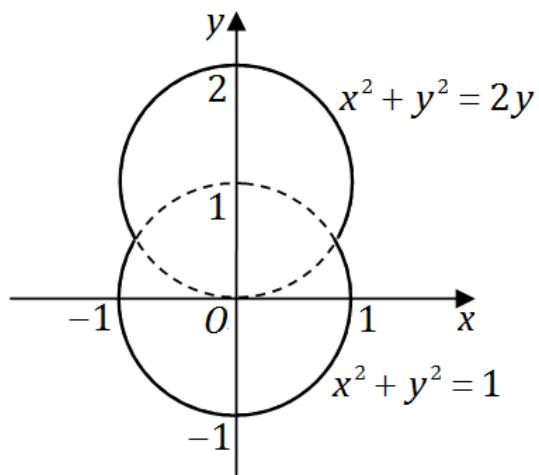

(I) 求容器的容积;   
(II) 若将容器内盛满的水从容器顶部全部抽出，至少需要做多少功？

(长度单位: m, 重力加速度为 gm/s², 水的密度为 $10^{3} \mathrm{~kg} / \mathrm{m}^{3}$ .)

解. (I) 由对称性, 所求的容积为

$$
V = V _ {1} + V _ {2} = 2 \int_ {- 1} ^ {\frac {1}{2}} \pi x ^ {2} d y = 2 \pi \int_ {- 1} ^ {\frac {1}{2}} (1 - y ^ {2}) d y = \frac {9}{4} \pi .
$$

(II) 所做的功为

$$
\begin{array}{l} W = \pi \rho g \int_ {- 1} ^ {\frac {1}{2}} (2 - y) \left(1 - y ^ {2}\right) d y + \pi \rho g \int_ {\frac {1}{2}} ^ {2} (2 - y) \left(2 y - y ^ {2}\right) d y \\ = \pi \rho g \left(\int_ {- 1} ^ {\frac {1}{2}} \left(y ^ {3} - 2 y ^ {2} - y + 2\right) d y + \int_ {\frac {1}{2}} ^ {2} \left(y ^ {3} - 4 y ^ {2} + 4 y\right) d y\right) \\ = \frac {2 7 \times 1 0 ^ {3}}{8} \pi g = 3 3 7 5 g \pi . \\ \end{array}
$$

21. 同试卷一第三[19]题  
22. 同试卷一第三[20]题  
23. 同试卷一第三[21]题

# 二〇一二年考研数学试卷二解答

# 一、选择题（1～8小题，每小题4分，共32分）

1. 同试卷一第一[1]题.  
2. 同试卷一第一[2]题  
3. 设 $a_{n} > 0 (n = 1,2,\dots)$ , $S_{n} = a_{1} + a_{2} + \dots + a_{n}$ , 则数列 $\{s_{n}\}$ 有界是数列 $\{a_{n}\}$ 收敛的……（）

(A) 充分必要条件.

(B) 充分非必要条件.

(C) 必要非充分条件.

(D) 即非充分也非必要条件.

解. 应选 (B).

4. 同试卷一第一[4]题.

5. 设函数 $f(x, y)$ 可微，且对任意 $x, y$ 都有 $\frac{\partial f(x, y)}{\partial x} > 0$ ， $\frac{\partial f(x, y)}{\partial y} < 0$ 。则使不等式 $f(x_1, y_1) < f(x_2, y_2)$ 成立的一个充分条件是

(A) $x_{1} > x_{2},y_{1} <   y_{2}$

(B) $x_{1} > x_{2},y_{1} > y_{1}$

(C) $x_{1} <   x_{2},y_{1} <   y_{2}$

(D) $x_{1} <   x_{2},y_{1} > y_{2}$

解. 应选 (D). $\frac{\partial f(x, y)}{\partial x} > 0$ , $\frac{\partial f(x, y)}{\partial y} < 0$ 表示函数 $f(x, y)$ 关于变量 $x$ 是单调递增的,关于变量 $y$ 是单调递减的. 因此, 当 $x_1 < x_2, y_1 > y_2$ 必有 $f(x_1, y_1) < f(x_2, y_2)$ .

6. 设区域D由曲线 $y = \sin x, x = \pm \frac{\pi}{2}, y = 1$ 围成，则 $\iint_{D} (x^5 y - 1) \, \mathrm{d}x \, \mathrm{d}y = \dots (\quad)$

(A) $\pi$

(B) 2.

(C) $-2$

(D) $-\pi$

解. 应选 (D). 由二重积分的奇偶对称性,

$$
\begin{array}{l} \iint_ {D} \left(x ^ {5} y - 1\right) \mathrm {d} x \mathrm {d} y = \int_ {- \frac {\pi}{2}} ^ {\frac {\pi}{2}} \mathrm {d} x \int_ {\sin x} ^ {1} \left(x ^ {5} y - 1\right) \mathrm {d} y \\ = \int_ {- \frac {\pi}{2}} ^ {\frac {\pi}{2}} \left(\frac {1}{2} x ^ {5} - \frac {1}{2} x ^ {5} \sin x - 1 + \sin x\right) d x = \int_ {- \frac {\pi}{2}} ^ {\frac {\pi}{2}} (- 1) d x = - \pi \\ \end{array}
$$

7. 同试卷一第一[5]题  
8. 同试卷一第一[6]题

# 二、填空题（9～14小题，每小题4分，共24分）

9. 设 $y = y(x)$ 是由方程 $x^{2} - y + 1 = \mathrm{e}^{y}$ 所确定的隐函数, 则 $\left.\frac{\mathrm{d}^2y}{\mathrm{d}x^2}\right|_{x=0} =$ ________.

解. 应填 1. 将 $x = 0$ 代入方程, 可得 $y = 0$ . 求导得 $\left.\frac{\mathrm{d}y}{\mathrm{d}x}\right|_{x=0} = 0$ , $\left.\frac{\mathrm{d}^2y}{\mathrm{d}x^2}\right|_{x=0} = 1$ .

10. 计算 $\lim_{x\to \infty}n\left(\frac{1}{1 + n^2} +\frac{1}{2^2 + n^2} +\dots +\frac{1}{n^2 + n^2}\right) = \underline{\quad}$   
解. 应填 $\frac{\pi}{4}$ . 原式 $= \lim_{n \to \infty} \frac{1}{n} \sum_{i=1}^{n} \frac{1}{1 + \left( \frac{i}{n} \right)^2} = \int_{0}^{1} \frac{\mathrm{d}x}{1 + x^2} = \left[ \arctan x \right]_0^1 = \frac{\pi}{4}$ .  
11. 设 $z = f\left(\ln x + \frac{1}{y}\right)$ ，其中函数 $f(u)$ 可微，则 $x\frac{\partial z}{\partial x} + y^2\frac{\partial z}{\partial y} =$ ________.  
解. 应填 0 . 因为 $\frac{\partial z}{\partial x} = f^{\prime} \cdot \frac{1}{x}, \frac{\partial z}{\partial y} = f^{\prime} \cdot \left(-\frac{1}{y^{2}}\right)$ , 所以 $x \frac{\partial z}{\partial x} + y^{2} \frac{\partial z}{\partial y} = 0$ .  
12. 微分方程 $y \, \mathrm{d}x + (x - 3y^2) \, \mathrm{d}y = 0$ 满足初始条件 $y|_{x=1} = 1$ 的解为 $y =$ ________.  
解. 应填 $\sqrt{x}$ . 微分方程整理得 $\frac{\mathrm{d}x}{\mathrm{d}y} + \frac{1}{y} x = 3y$ . 这是一阶线性微分方程,

$$
x = \mathrm {e} ^ {- \int \frac {1}{y} \mathrm {d} y} \left[ \int 3 y \cdot \mathrm {e} ^ {\int \frac {1}{y} \mathrm {d} y} \mathrm {d} y + C \right] = \frac {1}{y} \left[ \int 3 y ^ {2} \mathrm {d} y + C \right] = (y ^ {3} + C) \frac {1}{y}.
$$

又因为 $x = 1$ 时 $y = 1$ ，解得 $C = 0$ ，故 $x = y^{2}$ ，由初始条件得到 $y = \sqrt{x}$

13. 曲线 $y = x^{2} + x$ （ $x < 0$ ）上曲率为 $\frac{\sqrt{2}}{2}$ 的点的坐标是

解. 应填 $(-1,0)$ . 将代入曲率计算公式, 有

$$
K = \frac {| y ^ {\prime \prime} |}{(1 + {y ^ {\prime}} ^ {2}) ^ {3 / 2}} = \frac {2}{[ 1 + (2 x + 1) ^ {2} ] ^ {\frac {3}{2}}} = \frac {\sqrt {2}}{2}
$$

整理得 $(2x + 1)^{2} = 1$ ，解得 $x = 0$ （舍去）或 $x = -1$ 。此时 $y = 0$ ，故该点坐标为 $(-1,0)$ 。

14. 设 $A$ 为 3 阶矩阵, $|A| = 3$ , $A^{*}$ 为 $A$ 的伴随矩阵, 若交换 $A$ 的第一行与第二行得到矩阵 $B$ , 则 $\left|BA^{*}\right| =$

解. 应填 -27. 由于 $B = E_{12} A$ , 故 $B A^{*} = E_{12} A \cdot A^{*} = |A| E_{12} = 3 E_{12}$ , 所以

$$
| B A ^ {*} | = | 3 E _ {1 2} | = 3 ^ {3} | E _ {1 2} | = 2 7 \times (- 1) = - 2 7.
$$

# 三、解答题（15～23小题，共94分）

15. (本题满分 10 分)

已知函数 $f(x) = \frac{1 + x}{\sin x} - \frac{1}{x}$ ，记 $a = \lim_{x \to 0} f(x)$ .

(I) 求 $a$ 的值；(II) 若当 $x \to 0$ 时， $f(x) - a$ 是 $x^k$ 的同阶无穷小，求 $k$ .

解. (I) $\lim_{x \to 0} f(x) = \lim_{x \to 0} \left( \frac{1}{\sin x} - \frac{1}{x} + 1 \right) = \lim_{x \to 0} \frac{x - \sin x}{x^2} + 1 = 1$ ，即 $a = 1$

(II) 当 $x \to 0$ 时, 由 $f(x) - a = f(x) - 1 = \frac{1}{\sin x} - \frac{1}{x} = \frac{x - \sin x}{x \sin x}$ . 又因为当 $x \to 0$ 时, $x - \sin x$ 与 $\frac{1}{6} x^3$ 等价, 故 $f(x) - a \sim \frac{1}{6} x$ , 即 $k = 1$ .

16. 同试卷一第三[16]题.

17. (本题满分 10 分)

过 (0,1) 点作曲线 $L: y = \ln x$ 的切线，切点为 $A$ ，又 $L$ 与 $x$ 轴交于 $B$ 点，区域 $D$ 由 $L$ 与直线 $AB$ 围成，求区域 $D$ 的面积及 $D$ 绕 $x$ 轴旋转一周所得旋转体的体积.

解. 设切点坐标为 $A(x_{0}, \ln x_{0})$ , 斜率为 $\frac{1}{x_{0}}$ , 切线方程为

$$
y - \ln x _ {0} = \frac {1}{x _ {0}} (x - x _ {0})
$$

又因为该切线过 (0,1)，所以 $x_0 = \mathbf{e}^2$ ，故切点为 $A(\mathbf{e}^2, 2)$ 。而 $L$ 与 $x$ 轴的交点为 $B(1,0)$ 。从而区域 $D$ 的面积

$$
\begin{array}{l} S = \int_ {1} ^ {\mathrm {e} ^ {2}} \ln x \mathrm {d} x - \frac {1}{2} (\mathrm {e} ^ {2} - 1) \cdot 2 = [ x \ln x - x ] _ {1} ^ {\mathrm {e} ^ {2}} - (\mathrm {e} ^ {2} - 1) \\ = \left(\mathrm {e} ^ {2} + 1\right) - \left(\mathrm {e} ^ {2} - 1\right) = 2. \\ \end{array}
$$

$D$ 绕 $x$ 轴旋转一周所得旋转体的体积

$$
\begin{array}{l} V = \pi \int_ {1} ^ {\mathrm {e} ^ {2}} \ln^ {2} x \mathrm {d} x - \frac {1}{3} \pi \cdot 2 ^ {2} \cdot \left(\mathrm {e} ^ {2} - 1\right) = \pi \left[ x \ln^ {2} x - 2 x \ln x + 2 x \right] _ {1} ^ {\mathrm {e} ^ {2}} \\ = (2 \mathrm {e} ^ {2} - 2) - \frac {4}{3} \pi (\mathrm {e} ^ {2} - 1) = \frac {2}{3} \pi (\mathrm {e} ^ {2} - 1). \\ \end{array}
$$

18. (本题满分 10 分)

计算二重积分 $\iint_{D} xy \, \mathrm{d}\sigma$ ，其中区域 D 为曲线

$$
r = 1 + \cos \theta (0 \leqslant \theta \leqslant \pi)
$$

与极轴围成.

解. 由极坐标的面积公式, 有

$$
\begin{array}{l} \iint_ {D} x y \mathrm {d} \sigma = \int_ {0} ^ {\pi} \mathrm {d} \theta \int_ {0} ^ {1 + \cos \theta} r \cos \theta \cdot r \sin \theta \cdot r \mathrm {d} r \\ = \frac {1}{4} \int_ {0} ^ {\pi} \sin \theta \cdot \cos \theta \cdot (1 + \cos \theta) ^ {4} d \theta \\ = \frac {1}{4} \int_ {- 1} ^ {1} t (1 + t) ^ {4} \mathrm {d} t = \frac {1}{4} \int_ {0} ^ {2} (u - 1) u ^ {4} \mathrm {d} u = \frac {1}{4} \cdot \frac {6 4}{1 5} = \frac {1 6}{1 5}. \\ \end{array}
$$

19. (本题满分 11 分)

设函数 $f(x)$ 满足方程 $f^{\prime \prime}(x) + f^{\prime}(x) - 2f(x) = 0$ 及 $f^{\prime}(x) + f(x) = 2\mathrm{e}^{x}$

(I) 求表达式 $f(x)$ ;

(II) 求曲线的拐点 $y = f(x^{2}) \int_{0}^{x} f(-t^{2}) \, \mathrm{d}t$ .

解. (I) 解微分方程 $f''(x) + f'(x) - 2f(x) = 0$ , 得到通解为 $f(x) = C_1 \mathrm{e}^x + C_2 \mathrm{e}^{-2x}$ . 再由 $f'(x) + f(x) = 2 \mathrm{e}^x$ 得 $2C_1 \mathrm{e}^x - C_2 \mathrm{e}^{-2x} = 2 \mathrm{e}^x$ , 可知 $C_1 = 1, C_2 = 0$ . 故 $f(x) = \mathrm{e}^x$ .

(II) 曲线方程为 $y = \mathrm{e}^{x^{2}} \int_{0}^{x} \mathrm{e}^{-t^{2}} \mathrm{d}t$ , 则

$$
y ^ {\prime} = 1 + 2 x \mathrm {e} ^ {x ^ {2}} \int_ {0} ^ {x} \mathrm {e} ^ {- t ^ {2}} \mathrm {d} t, \quad y ^ {\prime \prime} = 2 x + 2 (1 + 2 x ^ {2}) \mathrm {e} ^ {x ^ {2}} \int_ {0} ^ {x} \mathrm {e} ^ {- t ^ {2}} \mathrm {d} t.
$$

当 $x = 0$ 时 $y'' = 0$ ; 当 $x > 0$ 时, $y'' > 0$ ; 当 $x < 0$ 时, $y'' < 0$ . 因此 $(0,0)$ 点就是曲线 $y = f(x^{2}) \int_{0}^{x} f(-t^{2}) \mathrm{d}t$ 唯一的拐点.

20. 同试卷一第三[15]题

21. (本题满分11分)

(I) 证明方程 $x^n + x^{n-1} + \dots + x = 1$ （ $n$ 为大于 1 的整数）在区间 $\left(\frac{1}{2}, 1\right)$ 内有且仅有一个实根；

(II) 记 (I) 中的实根为 $x_{n}$ , 证明 $\lim_{n \to \infty} x_{n}$ 存在, 并求此极限.

解. (I) 令 $f_{n}(x) = x^{n} + x^{n - 1} + \dots + x - 1$ , 则 $f_{n}(1) = n - 1 > 0$ , 而 $f_{n}\left(\frac{1}{2}\right) = -\left(\frac{1}{2}\right)^{n} < 0$ , 由零点定理得 $f_{n}(x) = 0$ 在 $\left(\frac{1}{2}, 1\right)$ 肯定有实根. 又因为

$$
f _ {n} ^ {\prime} (x) = n x ^ {n - 1} + (n - 1) x ^ {n - 2} + \dots + 1 > 1 > 0
$$

所以方程只有唯一的实根.

(II) 设该实根为 $x_{n}$ , 则有 $f_{n}\left(x_{n}\right)=0$ . 因为 $f_{n}^{\prime}(x)>1$ , 由拉格朗日中值定理得

$$
\left| x _ {n} - \frac {1}{2} \right| <   \left| f _ {n} ^ {\prime} (\xi) \left(x _ {n} - \frac {1}{2}\right) \right| = \left| f _ {n} (x _ {n}) - f _ {n} \left(\frac {1}{2}\right) \right| = \left| 0 - \left(- \frac {1}{2 ^ {n}}\right) \right| = \frac {1}{2 ^ {n}}
$$

则由迫敛准则可知 $\lim_{n\to \infty}\left(x_n - \frac{1}{2}\right) = 0$ ，从而 $\lim_{n\to \infty}x_n = \frac{1}{2}$

22. 同试卷一第三[20]题

23. 同试卷一第三[21]题

# 二〇一三年考研数学试卷二解答

# 一、选择题（1～8小题，每小题4分，共32分）

1. 设 $\cos x - 1 = x \sin \alpha(x)$ , 其中 $|\alpha(x)| < \frac{\pi}{2}$ , 则当 $x \to 0$ 时, $\alpha(x)$ 是 $\cdots \cdots \cdots$ ( )

(A) 比 $x$ 高阶的无穷小.

(B) 比 $x$ 低阶的无穷小.

(C) 与 $x$ 同阶但不等价的无穷小.

(D) 与 $x$ 等价的无穷小.

解. 应选 (C). 因为 $|\alpha(x)| < \frac{\pi}{2}$ , 所以

$$
\lim  _ {x \rightarrow 0} \sin \alpha (x) = \lim  _ {x \rightarrow 0} \frac {\cos x - 1}{x} = \lim  _ {x \rightarrow 0} \frac {- \frac {1}{2} x ^ {2}}{x} = 0 \Rightarrow \lim  _ {x \rightarrow 0} \alpha (x) = 0.
$$

从而当 $x \to 0$ 时 $\alpha(x) \sim \sin \alpha(x) = \frac{\cos x - 1}{x} \sim -\frac{1}{2} x$ ，即 $\alpha(x)$ 与 $x$ 同阶但不等价.

2. 设函数 $y = f(x)$ 由方程 $\cos (xy) + \ln y - x = 1$ 确定，则 $\lim_{n\to \infty}n\left[f\left(\frac{2}{n}\right) - 1\right] = (\quad)$

(A) 2.

(B) 1.

(C) -1.

(D) $-2$

解. 应选 (A). 首先 $f(0) = 1$ , 方程两边对 $x$ 求导得

$$
- \left(y + x y ^ {\prime}\right) \sin (x y) + \frac {y ^ {\prime}}{y} - 1 = 0 \Rightarrow f ^ {\prime} (0) = 1.
$$

所以由导数的定义可得

$$
\lim _ {n \to \infty} n \left[ f \left(\frac {2}{n}\right) - 1 \right] = 2 \lim _ {n \to \infty} \frac {f \left(\frac {2}{n}\right) - f (0)}{\frac {2}{n} - 0} = 2 f ^ {\prime} (0) = 2.
$$

3. 设函数 $f(x) = \begin{cases} \sin x, & 0 \leqslant x < \pi, \\ 2, & \pi \leqslant x \leqslant 2\pi, \end{cases} F(x) = \int_{0}^{x} f(t) \, \mathrm{d}t$ ，则……（）

(A) $x = \pi$ 是函数 $F(x)$ 的跳跃间断点.

(B) $x = \pi$ 是函数 $F(x)$ 的可去间断点

(C) $F(x)$ 在 $x = \pi$ 处连续但不可导.

(D) $F(x)$ 在 $x = \pi$ 处可导

解. 应选 (C). 依题意有

$$
F (x) = \int_ {0} ^ {x} f (t) \mathrm {d} t = \left\{ \begin{array}{l l} \int_ {0} ^ {x} \sin t \mathrm {d} t = 1 - \cos x, & 0 \leqslant x <   \pi , \\ \int_ {0} ^ {\pi} \sin t \mathrm {d} t + \int_ {\pi} ^ {x} 2 \mathrm {d} t = 2 + 2 x - 2 \pi , & \pi \leqslant x \leqslant 2 \pi . \end{array} \right.
$$

由于 $F(\pi^{-}) = F(\pi^{+}) = F(\pi) = 2$ ， $F(x)$ 在 $x = \pi$ 处连续．又因为

$$
\lim  _ {x \rightarrow \pi -} \frac {F (x) - F (\pi)}{x - \pi} = \lim  _ {x \rightarrow \pi +} \frac {- 1 - \cos x}{x - \pi} = 0, \quad \lim  _ {x \rightarrow \pi +} \frac {F (x) - F (\pi)}{x - \pi} = \lim  _ {x \rightarrow \pi +} \frac {2 (x - \pi)}{x - \pi} = 2,
$$

所以 $F(x)$ 在 $x = \pi$ 处不可导

4. 设函数 $f(x) = \begin{cases} \frac{1}{(x - 1)^{\alpha - 1}}, & 1 < x < \mathrm{e}, \\ \frac{1}{x\ln^{\alpha + 1}x}, & x \geqslant \mathrm{e}, \end{cases}$ 若反常积分 $\int_{1}^{+\infty} f(x) \, \mathrm{d}x$ 收敛，则 $\cdots$ （）

(A) $\alpha < -2$

(B) $\alpha > 2$ .

(C) $-2 < \alpha < 0$ .

(D) $0 < \alpha < 2$

解. 应选 (D). 因为积分 $\int_{1}^{e} \frac{1}{(x - 1)^{\alpha - 1}} \mathrm{d}x$ 收敛当且仅当 $\alpha - 1 < 1$ , 即 $\alpha < 2$ . 积分 $\int_{e}^{+\infty} \frac{1}{x \ln^{\alpha + 1} x} \mathrm{d}x = \int_{e}^{+\infty} \frac{\mathrm{d}(\ln x)}{\ln^{\alpha + 1} x}$ 收敛当且仅当 $\alpha + 1 > 1$ , 即 $\alpha > 0$ , 所以反常积分 $\int_{1}^{+\infty} f(x) \mathrm{d}x = \int_{1}^{e} f(x) \mathrm{d}x + \int_{e}^{+\infty} f(x) \mathrm{d}x = \int_{1}^{e} \frac{1}{(x - 1)^{\alpha - 1}} \mathrm{d}x + \int_{e}^{+\infty} \frac{1}{x \ln^{\alpha + 1} x} \mathrm{d}x$

收敛当且仅当 $0 < \alpha < 2$

5. 设 $z = \frac{y}{x} f(xy)$ ，其中函数 $f$ 可微，则 $\frac{x}{y}\frac{\partial z}{\partial x} + \frac{\partial z}{\partial y} = \dots$ （ ）

(A) $2yf^{\prime}(xy)$

(B) $-2yf'(xy)$ .

(C) $\frac{2}{x} f(xy)$ .

(D) $-\frac{2}{x} f(xy)$ .

解. 应选 (A). 已知 $z = \frac{y}{x} f(xy)$ ，所以

$$
\frac {\partial z}{\partial x} = - \frac {y}{x ^ {2}} f (x y) + \frac {y ^ {2}}{x} f ^ {\prime} (x y), \quad \Rightarrow \quad \frac {\partial z}{\partial y} = \frac {1}{x} f (x y) + y f ^ {\prime} (x y).
$$

所以 $\frac{x}{y} \frac{\partial z}{\partial x} + \frac{\partial z}{\partial y} = 2y f'(xy)$ .

6. 设 $D_{k}$ 是圆域 $D = \left\{(x,y)\big|x^{2} + y^{2}\leqslant 1\right\}$ 在第 $k$ 象限的部分，记

$I_{k} = \iint_{D_{k}}(y - x)\mathrm{d}x\mathrm{d}y (k = 1,2,3,4),$ 则

(A) $I_{1} > 0$

(B) $I_{2} > 0$

(C) $I_{3} > 0$

(D) $I_4 > 0$

解. 应选 (B). 因为在 $D_{2}$ 内部 $y - x > 0$ , 故由二重积分的保号性可得 $I_{2} > 0$

7. 同试卷一第一[5]题

8. 同试卷一第一[6]题

# 二、填空题（9～14小题，每小题4分，共24分）

9. $\lim_{x\to 0}\left(2 - \frac{\ln(1 + x)}{x}\right)^{\frac{1}{x}} = \underline{\quad}.$

解. 应填 $\mathrm{e}^{\frac{1}{2}}$ . 取对数后求极限得

$$
\lim  _ {x \rightarrow 0} \frac {\ln \left(1 + 1 - \frac {\ln (1 + x)}{x}\right)}{x} = \lim  _ {x \rightarrow 0} \frac {1 - \frac {\ln (1 + x)}{x}}{x} = \lim  _ {x \rightarrow 0} \frac {1 - \left(1 - \frac {1}{2} x + o (x)\right)}{x} = \frac {1}{2},
$$

因此原式 $= \mathrm{e}^{\frac{1}{2}}$

10. 设函数 $f(x) = \int_{-1}^{x} \sqrt{1 - \mathrm{e}^t} \, \mathrm{d}t$ ，则 $y = f(x)$ 的反函数 $x = f^{-1}(y)$ 在 $y = 0$ 处的导数 $\left. \frac{\mathrm{d}x}{\mathrm{d}y} \right|_{y=0} =$ ________.

解. 应填 $\frac{1}{\sqrt{1 - \mathrm{e}^{-1}}}$ . 因为 $\frac{\mathrm{dy}}{\mathrm{dx}} = \sqrt{1 - \mathrm{e}^{x}}$ , 所以 $\frac{\mathrm{dx}}{\mathrm{dy}} = \frac{1}{\sqrt{1 - \mathrm{e}^{x}}}$ , 从而

$$
\left. \frac {\mathrm {d} x}{\mathrm {d} y} \right| _ {y = 0} = \left. \frac {1}{\sqrt {1 - \mathrm {e} ^ {x}}} \right| _ {x = - 1} = \frac {1}{\sqrt {1 - \mathrm {e} ^ {- 1}}}.
$$

11. 设封闭曲线 $L$ 的极坐标方程为 $r = \cos 3\theta \left(-\frac{\pi}{6} \leqslant \theta \leqslant \frac{\pi}{6}\right)$ , 则 $L$ 所围成的平面图形的面积为

解. 应填 $\frac{\pi}{12}$ . 由极坐标的面积公式可得

$$
S = \frac {1}{2} \int_ {- \frac {\pi}{6}} ^ {\frac {\pi}{6}} \cos^ {2} 3 \theta d \theta = \int_ {0} ^ {\frac {\pi}{6}} \frac {1 + \cos 6 \theta}{2} d \theta = \frac {\pi}{1 2}.
$$

12. 曲线 $\left\{ \begin{array}{l} x = \arctan t, \\ y = \ln \sqrt{1 + t^2} \end{array} \right.$ 上对应于 $t = 1$ 的点处的法线方程为

解. 应填 $y + x - \frac{\pi}{4} - \ln \sqrt{2} = 0$ . 由参数方程的导数公式得

$$
\frac {\mathrm {d} y}{\mathrm {d} x} = \frac {\frac {\mathrm {d} y}{\mathrm {d} t}}{\frac {\mathrm {d} x}{\mathrm {d} t}} = \frac {\frac {1}{\sqrt {1 + t ^ {2}}} \cdot \frac {t}{\sqrt {1 + t ^ {2}}}}{\frac {1}{1 + t ^ {2}}} = t \quad \Rightarrow \quad \left. \frac {\mathrm {d} y}{\mathrm {d} x} \right| _ {t = 1} = 1.
$$

当 $t = 1$ 时， $x = \frac{\pi}{4}, y = \ln \sqrt{2}$ ，故法线方程为 $y + x - \frac{\pi}{4} - \ln \sqrt{2} = 0$ .

13. 已知 $y_{1} = \mathrm{e}^{3x} - x\mathrm{e}^{2x}, y_{2} = \mathrm{e}^{x} - x\mathrm{e}^{2x}, y_{3} = -x\mathrm{e}^{2x}$ 是某二阶常系数非齐次线性微分方程的 3 个解, 该方程满足条件 $y|_{x=0} = 0, y'|_{x=0} = 1$ 的解为 $y =$

解. 应填 $\mathrm{e}^{3x} - \mathrm{e}^x - x\mathrm{e}^{2x}$ . 根据线性微分方程解的性质, $\mathrm{e}^{3x}$ 和 $\mathrm{e}^x$ 是对应齐次方程的解, $-x\mathrm{e}^{2x}$ 是非齐次方程的解, 故非齐次通解为 $y = C_1\mathrm{e}^{3x} + C_2\mathrm{e}^x - x\mathrm{e}^{2x}$ . 由初始条件求得 $C_1 = 1$ , $C_2 = -1$ , 故满足条件的解为 $y = \mathrm{e}^{3x} - \mathrm{e}^x - x\mathrm{e}^{2x}$ .

14. 同试卷一第二[13]题

# 三、解答题（15～23小题，共94分）

15. (本题满分 10 分)

当 $x \to 0$ 时， $1 - \cos x \cdot \cos 2x \cdot \cos 3x$ 与 $ax^n$ 为等价无穷小，求 $n$ 与 $a$ 的值.

解. 由 $\cos x$ 的麦克劳林公式有：当 $x \to 0$ 时，

$$
\cos x = 1 - \frac {1}{2} x ^ {2} + o (x ^ {2}), \quad \cos 2 x = 1 - 2 x ^ {2} + o (x ^ {2}), \quad \cos 3 x = 1 - \frac {9}{2} x ^ {2} + o (x ^ {2}).
$$

故由 $1 - \cos x\cdot \cos 2x\cdot \cos 3x$ 与 $ax^n$ 为等价无穷小可得

$$
\begin{array}{l} 1 = \lim  _ {x \rightarrow 0} \frac {1 - \cos x \cdot \cos 2 x \cdot \cos 3 x}{a x ^ {n}} \\ = \lim  _ {x \rightarrow 0} \frac {1 - \left[ 1 - \frac {1}{2} x ^ {2} + o (x ^ {2}) \right]\left[ 1 - 2 x ^ {2} + o (x ^ {2}) \right]\left[ 1 - \frac {9}{2} x ^ {2} + o (x ^ {2}) \right]}{a x ^ {n}} \\ = \lim  _ {x \rightarrow 0} \frac {1 - \left[ 1 - 7 x ^ {2} + o \left(x ^ {2}\right)\right]}{a x ^ {n}} = \lim  _ {x \rightarrow 0} \frac {7 x ^ {2} + o \left(x ^ {2}\right)}{a x ^ {n}}. \\ \end{array}
$$

所以 $n = 2$ 且 $a = 7$

16. (本题满分 10 分)

设 $D$ 是由曲线 $y = x^{\frac{1}{3}}$ , 直线 $x = a (a > 0)$ 及 $x$ 轴所围成的平面图形, $V_x, V_y$ 分别是 $D$ 绕 $x$ 轴, $y$ 轴旋转一周所得旋转体的体积, 若 $V_y = 10V_x$ , 求 $a$ 的值.

解. 依题意可得

$$
V _ {x} = \pi \int_ {0} ^ {a} \left(x ^ {\frac {1}{3}}\right) ^ {2} d x = \frac {3}{5} \pi a ^ {\frac {5}{3}}, \quad V _ {y} = 2 \pi \int_ {0} ^ {a} x \cdot x ^ {\frac {1}{3}} d x = \frac {6 \pi}{7} a ^ {\frac {7}{3}}.
$$

由 $V_{y} = 10V_{x}$ 可得 $\frac{6\pi}{7} a^{\frac{7}{3}} = 10\cdot \frac{3}{5}\pi a^{\frac{5}{3}}$ ，解得 $a = 7\sqrt{7}$

17. (本题满分 10 分)

设平面内区域 $D$ 由直线 $x = 3y, y = 3x$ 及 $x + y = 8$ 围成，计算 $\iint_{D} x^{2} \mathrm{d}x \mathrm{d}y$ .

解 $\iint_{D} x^{2} \mathrm{~d}x \mathrm{~d}y = \int_{0}^{2} x^{2} \mathrm{~d}x \int_{\frac{x}{3}}^{3x} \mathrm{~d}y + \int_{2}^{6} x^{2} \mathrm{~d}x \int_{\frac{x}{3}}^{8-x} \mathrm{~d}y = \frac{416}{3}$ .

18. 同试卷一第三[18]题

19. (本题满分 11 分)

求曲线 $x^{3} - xy + y^{3} = 1 (x \geqslant 0, y \geqslant 0)$ 上的点到坐标原点的最长距离与最短距离.

解. 平面上点 $(x, y)$ 到坐标原点的距离为 $d(x, y) = \sqrt{x^2 + y^2}$ . 构造拉格朗日函数

$$
L (x, y, \lambda) = x ^ {2} + y ^ {2} + \lambda (x ^ {3} - x y + y ^ {3} - 1).
$$

则由 $x \geqslant 0, y \geqslant 0$ 以及

$$
\left\{ \begin{array}{l} \frac {\partial L}{\partial x} = 2 x + 3 \lambda x ^ {2} - \lambda y = 0, \\ \frac {\partial L}{\partial y} = 2 y + 3 \lambda y ^ {2} - \lambda x = 0, \\ \frac {\partial L}{\partial \lambda} = x ^ {3} - x y + y ^ {3} - 1 = 0, \end{array} \right.
$$

可求得唯一条件极值点 $x = 1, y = 1$ 。由于 $d(1,1) = \sqrt{2}$ ， $d(0,1) = d(1,0) = \sqrt{2}$ ，故所求的最长距离为 $\sqrt{2}$ ，最短距离为 1.

20. (本题满分11分)

设函数 $f(x) = \ln x + \frac{1}{x}$ .

(I) 求 $f(x)$ 的最小值；  
(II) 设数列 $\{x_{n}\}$ 满足 $\ln x_{n} + \frac{1}{x_{n+1}} < 1$ ，证明 $\lim_{n \to \infty} x_{n}$ 存在，并求此极限.

解. (I) 求导得 $f^{\prime}(x) = \frac{1}{x} - \frac{1}{x^{2}} = \frac{x - 1}{x^{2}}$ , $f^{\prime \prime}(x) = -\frac{1}{x^{2}} + \frac{2}{x^{3}} = \frac{2 - x}{x^{3}}$ . 则 $f(x)$ 有唯一驻点 $x = 1$ , 且 $f^{\prime \prime}(1) = 1 > 0$ , 从而 $f(x)$ 有极小值和最小值 $f(1) = 1$ .  
(II) 由 (I) 知 $\ln x_{n} + \frac{1}{x_{n}} \geqslant 1$ ，故由 $\ln x_{n} + \frac{1}{x_{n+1}} < 1$ 得 $\frac{1}{x_{n+1}} < \frac{1}{x_{n}}$ ，即 $x_{n+1} > x_{n}$ ，故 $\{x_{n}\}$ 单调递增。又由 $\ln x_{n} < \ln x_{n} + \frac{1}{x_{n+1}} < 1$ 得 $x_{n} < e$ ，故 $x_{n}$ 有上界。从而由单调有界收敛定理可知 $\lim_{n \to \infty} x_{n}$ 存在。令 $\lim_{n \to \infty} x_{n} = a$ ，则由 $\ln x_{n} + \frac{1}{x_{n+1}} < 1$ 得 $\ln a + \frac{1}{a} \leqslant 1$ 。又由 (I) 有 $\ln a + \frac{1}{a} \geqslant 1$ ，故 $a = 1$ 。

21. (本题满分 11 分)

设曲线 $L$ 的方程为 $y = \frac{1}{4} x^2 -\frac{1}{2}\ln x$ （ $1\leqslant x\leqslant \mathbf{e})$

(I)求 $L$ 的弧长；  
(II) 设 $D$ 是由曲线 $L$ , 直线 $x = 1, x = \mathrm{e}$ 及 $x$ 轴所围平面图形, 求 $D$ 的形心的横坐标.

解. (I) $L$ 的弧长为

$$
\begin{array}{l} s = \int_ {1} ^ {\mathrm {e}} \sqrt {1 + \left(y ^ {\prime}\right) ^ {2}} \mathrm {d} x = \int_ {1} ^ {\mathrm {e}} \sqrt {1 + \left(\frac {x}{2} - \frac {1}{2 x}\right) ^ {2}} \mathrm {d} x \\ = \int_ {1} ^ {\mathrm {e}} \sqrt {1 + \frac {x ^ {2}}{4} + \frac {1}{4 x} - \frac {1}{2}} \mathrm {d} x = \int_ {1} ^ {\mathrm {e}} \left(\frac {x}{2} + \frac {1}{2 x}\right) \mathrm {d} x = \frac {\mathrm {e} ^ {2} + 1}{4}. \\ \end{array}
$$

(II) $D$ 的形心的横坐标为

$$
\bar {x} = \frac {\int_ {1} ^ {\mathrm {e}} x \left(\frac {1}{4} x ^ {2} - \frac {1}{2} \ln x\right) \mathrm {d} x}{\int_ {1} ^ {\mathrm {e}} \left(\frac {1}{4} x ^ {2} - \frac {1}{2} \ln x\right) \mathrm {d} x} = \frac {3 \left(\mathrm {e} ^ {4} - 2 \mathrm {e} ^ {2} - 3\right)}{4 \left(\mathrm {e} ^ {3} - 7\right)}.
$$

22. 同试卷一第三[20]题  
23. 同试卷一第三[21]题

# 二〇一四年考研数学试卷二解答

# 一、选择题（1～8小题．每小题4分，共32分）

1. 当 $x \to 0^{+}$ 时，若 $\ln^{\alpha}(1 + 2x)$ ， $(1 - \cos x)^{\frac{1}{\alpha}}$ 均是比 $x$ 高阶的无穷小，则 $\alpha$ 的可能取值范围是……（）

(A) $(2, + \infty)$

(B) $(1,2)$ .

(C) $\left(\frac{1}{2}, 1\right)$ .

(D) $\left(0,\frac{1}{2}\right)$

解. 应选 (B). $\ln^{\alpha}(1 + 2x) \sim 2^{\alpha} x^{\alpha}$ , 是 $\alpha$ 阶无穷小, $(1 - \cos x)^{\frac{1}{\alpha}} \sim \frac{1}{2^{\frac{1}{\alpha}}} x^{\frac{2}{\alpha}}$ 是 $\frac{2}{\alpha}$ 阶无穷小, 由题意可知 $\alpha > 1$ 且 $\frac{2}{\alpha} > 1$ , 所以 $\alpha$ 的可能取值范围是 $(1, 2)$ .

2. 同试卷一第一[1]题  
3. 同试卷一第一[2]题  
4. 曲线 $\left\{ \begin{array}{l} x = t^2 + 7, \\ y = t^2 + 4t + 1 \end{array} \right.$ 上对应于 $t = 1$ 的点处的曲率半径是……（）

(A) $\frac{\sqrt{10}}{50}$ .

(B) $\frac{\sqrt{10}}{100}$ .

(C) $10\sqrt{10}$ .

(D) $5\sqrt{10}$ .

解. 应选 (C). 由曲线的参数方程, 可得

$$
\frac {\mathrm {d} x}{\mathrm {d} t} = 2 t, \frac {\mathrm {d} y}{\mathrm {d} t} = 2 t + 4, \Rightarrow \frac {\mathrm {d} y}{\mathrm {d} x} = \frac {2 t + 4}{2 t} = 1 + \frac {2}{t}, \frac {\mathrm {d} ^ {2} y}{\mathrm {d} x ^ {2}} = \frac {- \frac {2}{t ^ {2}}}{2 t} = - \frac {1}{t ^ {3}}.
$$

对应于 $t = 1$ 的点处 $y^\prime = 3,y^{\prime \prime} = -1$ ，所以

$$
K = \frac {\left| y ^ {\prime \prime} \right|}{\sqrt {(1 + (y ^ {\prime}) ^ {2}) ^ {3}}} = \frac {1}{1 0 \sqrt {1 0}} \Rightarrow R = \frac {1}{K} = 1 0 \sqrt {1 0}.
$$

5. 设函数 $f(x) = \arctan x$ ，若 $f(x) = xf'(\xi)$ ，则 $\lim_{x \to 0} \frac{\xi^2}{x^2} = \dots$

(A) 1.

(B) $\frac{2}{3}$ .

(C) $\frac{1}{2}$ .

(D) $\frac{1}{3}$ .

解. 应选 (D). 因为 $f^{\prime}(x) = \frac{1}{1 + x^{2}}$ , 所以由题设可得

$$
\frac {1}{1 + \xi^ {2}} = f ^ {\prime} (\xi) = \frac {f (x)}{x} = \frac {\arctan x}{x} \Rightarrow \xi^ {2} = \frac {x - \arctan x}{(\arctan x) ^ {2}}.
$$

由泰勒公式可得

$$
\lim  _ {x \rightarrow 0} \frac {\xi^ {2}}{x ^ {2}} = \lim  _ {x \rightarrow 0} \frac {x - \arctan x}{x (\arctan x) ^ {2}} = \lim  _ {x \rightarrow 0} \frac {x - \left(x - \frac {1}{3} x ^ {3}\right) + o \left(x ^ {3}\right)}{x ^ {3}} = \frac {1}{3}.
$$

6. 设 $u(x, y)$ 在平面有界闭区域 $D$ 上连续，在 $D$ 的内部具有二阶连续偏导数，且满足 $\frac{\partial^2 u}{\partial x \partial y} \neq 0$ 及 $\frac{\partial^2 u}{\partial x^2} + \frac{\partial^2 u}{\partial y^2} = 0$ ，则

(A) $u(x, y)$ 的最大值点和最小值点必定都在区域 $D$ 的边界上.  
(B) $u(x,y)$ 的最大值点和最小值点必定都在区域 $D$ 的内部.  
(C) $u(x, y)$ 的最大值点在区域 $D$ 的内部，最小值点在区域 $D$ 的边界上.  
(D) $u(x, y)$ 的最小值点在区域 $D$ 的内部，最大值点在区域 $D$ 的边界上.

解. 应选 (A). $u(x, y)$ 在平面有界闭区域 $D$ 上连续, 故 $u(x, y)$ 在 $D$ 内必有最大值和最小值. 如果在内部存在驻点 $(x_0, y_0)$ , 即 $\frac{\partial u}{\partial x} = \frac{\partial u}{\partial y} = 0$ , 在此处

$$
A = \frac {\partial^ {2} u}{\partial x ^ {2}}, \quad C = \frac {\partial^ {2} u}{\partial y ^ {2}}, \quad B = \frac {\partial^ {2} u}{\partial x \partial y} = \frac {\partial^ {2} u}{\partial y \partial x}.
$$

由条件，显然 $AC - B^2 < 0$ ，从而 $u(x,y)$ 不是极值点，当然也不是最值点．所以 $u(x,y)$ 的最大值点和最小值点必定都在区域 $D$ 的边界上.

7. 同试卷一第一[5]题  
8. 同试卷一第一[6]题

# 二、填空题（9～14小题，每小题4分，共24分）

9. $\int_{-\infty}^{1}\frac{1}{x^2 + 2x + 5}\mathrm{d}x = \underline{\quad}$

解. 应填 $\frac{3\pi}{8}$ . 这是因为

$$
\begin{array}{l} \int_ {- \infty} ^ {1} \frac {1}{x ^ {2} + 2 x + 5} d x = \int_ {- \infty} ^ {1} \frac {d x}{(x + 1) ^ {2} + 4} \\ = \frac {1}{2} \left[ \arctan \frac {x + 1}{2} \right] _ {- \infty} ^ {1} = \frac {1}{2} \left(\frac {\pi}{4} - \left(- \frac {\pi}{2}\right)\right) = \frac {3 \pi}{8}. \\ \end{array}
$$

10. 同试卷一第二[10]题

11. 设 $z = z(x, y)$ 是由方程 $e^{2yz} + x + y^2 + z = \frac{7}{4}$ 确定的函数, 则 $\mathrm{d}z\bigg|_{\left(\frac{1}{2}, \frac{1}{2}\right)} =$

解. 应填 $-\frac{1}{2} \mathrm{~d} x - \frac{1}{2} \mathrm{~d} y$ . 设 $F(x, y, z) = \mathrm{e}^{2y z} + x + y^{2} + z - \frac{7}{4}$ , 则有

$$
F _ {x} = 1, \quad F _ {y} = 2 z e ^ {2 y z} + 2 y, \quad F _ {z} = 2 y e ^ {2 y z} + 1.
$$

当 $x = y = \frac{1}{2}$ 时， $z = 0$ ，从而

$$
\frac {\partial z}{\partial x} = - \frac {F _ {x}}{F _ {z}} = - \frac {1}{2}, \quad \frac {\partial z}{\partial y} = - \frac {F _ {y}}{F _ {z}} = - \frac {1}{2} \quad \Rightarrow \quad \mathrm {d} z \Big | _ {\left(\frac {1}{2}, \frac {1}{2}\right)} = - \frac {1}{2} \mathrm {d} x - \frac {1}{2} \mathrm {d} y.
$$

12. 曲线 $L$ 的极坐标方程为 $r = \theta$ , 则 $L$ 在点 $(r, \theta) = \left(\frac{\pi}{2}, \frac{\pi}{2}\right)$ 处的切线方程为

解. 应填 $y = -\frac{2}{\pi} x + \frac{\pi}{2}$ . 先把曲线方程化为参数方程

$$
\left\{ \begin{array}{l} x = r (\theta) \cos \theta = \theta \cos \theta , \\ y = r (\theta) \sin \theta = \theta \sin \theta . \end{array} \right.
$$

于是在 $\theta = \frac{\pi}{2}$ 处， $x = 0, y = \frac{\pi}{2}$ ，从而

$$
\left. \frac {\mathrm {d} y}{\mathrm {d} x} \right| _ {\frac {\pi}{2}} = \left. \frac {\sin \theta + \theta \cos \theta}{\cos \theta - \theta \sin \theta} \right| _ {\frac {\pi}{2}} = - \frac {2}{\pi}.
$$

则 $L$ 在点 $(r,\theta) = \left(\frac{\pi}{2},\frac{\pi}{2}\right)$ 处的切线方程为 $y - \frac{\pi}{2} = -\frac{2}{\pi} (x - 0)$ ，即 $y = -\frac{2}{\pi} x + \frac{\pi}{2}$ .

13. 一根长为 1 的细棒位于 $x$ 轴的区间 $[0,1]$ 上，若其线密度 $\rho(x) = -x^2 + 2x + 1$ 则该细棒的质心坐标 $\overline{x} =$ ________.

解. 应填 $\frac{11}{20}$ . 由质心坐标的公式得

$$
\overline {{x}} = \frac {\int_ {0} ^ {1} x \rho (x) \mathrm {d} x}{\int_ {0} ^ {1} \rho (x) \mathrm {d} x} = \frac {\int_ {0} ^ {1} (- x ^ {3} + 2 x ^ {2} + x) \mathrm {d} x}{\int_ {0} ^ {1} (- x ^ {2} + 2 x + 1) \mathrm {d} x} = \frac {\frac {1 1}{1 2}}{\frac {5}{3}} = \frac {1 1}{2 0}.
$$

14. 同试卷一第二[13]题

# 三、解答题（15～23小题，共94分）

15. 同试卷一第三[15]题

16.（本题满分10分）

已知函数 $y = y\left( x\right)$ 满足微分方程 ${x}^{2} + {y}^{2}{y}^{\prime } = 1 - {y}^{\prime }$ ,且 $y\left( 2\right)  = 0$ ,求 $y\left( x\right)$ 的极大值和极小值.

解. 将微分方程分离变量得 $(1 + y^{2})\mathrm{d}y = (1 - x^{2})\mathrm{d}x$ ，两边分别积分得通解为

$$
\frac {1}{3} y ^ {3} + y = x - \frac {1}{3} x ^ {3} + C.
$$

由 $y(2) = 0$ 得 $C = \frac{2}{3}$ , 即

$$
\frac {1}{3} y ^ {3} + y = x - \frac {1}{3} x ^ {3} + \frac {2}{3}.
$$

令 $\frac{\mathrm{dy}}{\mathrm{dx}} = \frac{1 - x^2}{1 + y^2} = 0$ 得 $x = \pm 1$ ，且有

$$
\frac {\mathrm {d} ^ {2} y}{\mathrm {d} x ^ {2}} = \frac {- 2 x (1 + y ^ {2}) ^ {2} - 2 y (1 - x ^ {2}) ^ {2}}{(1 + y ^ {2}) ^ {3}}.
$$

当 $x = 1$ 时，可解得 $y = 1, y'' = -1 < 0$ ，函数取得极大值 $y = 1$ ；当 $x = -1$ 时，可解得 $y = 0, y'' = 2 > 0$ ，函数取得极小值 $y = 0$ .

17. (本题满分 10 分)

设平面区域 $D = \left\{(x,y) \mid 1 \leqslant x^2 + y^2 \leqslant 4, x \geqslant 0, y \geqslant 0\right\}$ . 计算

$$
\iint_ {D} \frac {x \sin (\pi \sqrt {x ^ {2} + y ^ {2}})}{x + y} \mathrm {d} x \mathrm {d} y.
$$

解. 积分区域关于直线 $y = x$ 对称, 所以

$$
\iint_ {D} \frac {x \sin \left(\pi \sqrt {x ^ {2} + y ^ {2}}\right)}{x + y} d x d y = \iint_ {D} \frac {y \sin \left(\pi \sqrt {x ^ {2} + y ^ {2}}\right)}{x + y} d x d y.
$$

从而所求积分

$$
\begin{array}{l} I = \iint_ {D} \frac {x \sin (\pi \sqrt {x ^ {2} + y ^ {2}})}{x + y} d x d y = \frac {1}{2} \iint_ {D} \frac {(x + y) \sin (\pi \sqrt {x ^ {2} + y ^ {2}})}{x + y} d x d y \\ = \frac {1}{2} \iint_ {D} \sin (\pi \sqrt {x ^ {2} + y ^ {2}}) \mathrm {d} x \mathrm {d} y = \frac {1}{2} \int_ {0} ^ {\frac {\pi}{2}} \mathrm {d} \theta \int_ {1} ^ {2} r \sin \pi r \mathrm {d} r = - \frac {3}{4}. \\ \end{array}
$$

18. 同试卷一第三[17]题

19. (本题满分 10 分)

设函数 $f(x), g(x)$ 在区间 $[a, b]$ 上连续，且 $f(x)$ 单调增加， $0 \leqslant g(x) \leqslant 1$ ，证明：

(I) $0 \leqslant \int_{a}^{x} g(t) \mathrm{d}t \leqslant x - a, \quad x \in [a,b]$ ;   
(II) $\int_{a}^{a + \int_{a}^{b}g(t)\mathrm{d}t}f(x)\mathrm{d}x\leqslant \int_{a}^{b}f(x)g(x)\mathrm{d}x.$

解. (I) 因为 $0 \leqslant g(x) \leqslant 1$ ，所以当 $x \in [a, b]$ 时有

$$
\int_ {a} ^ {x} 0 \mathrm {d} x \leqslant \int_ {a} ^ {x} g (t) \mathrm {d} t \leqslant \int_ {a} ^ {x} 1 \mathrm {d} t \Rightarrow 0 \leqslant \int_ {a} ^ {x} g (t) \mathrm {d} t \leqslant x - a.
$$

(II) 令 $F(x) = \int_{a}^{x} f(u) g(u) \, \mathrm{d}u - \int_{a}^{a + \int_{a}^{x} g(t) \, \mathrm{d}t} f(u) \, \mathrm{d}u$ ，则可知 $F(a) = 0$ ，且

$$
F ^ {\prime} (x) = f (x) g (x) - g (x) f \left(a + \int_ {a} ^ {x} g (t) \mathrm {d} t\right).
$$

因为 $0 \leqslant \int_{a}^{x} g(t) \mathrm{d}t \leqslant x - a$ , 且 $f(x)$ 单调增加, 所以

$$
f \left(a + \int_ {a} ^ {x} g (t) \mathrm {d} t\right) \leqslant f (a + x - a) = f (x),
$$

从而当 $x \in [a, b]$ 时有

$$
F ^ {\prime} (x) \geqslant f (x) g (x) - g (x) f (x) = 0.
$$

也是 $F(x)$ 在 $[a,b]$ 单调增加，则 $F(b)\geqslant F(a) = 0$ ，即得到

$$
\int_ {a} ^ {a + \int_ {a} ^ {b} g (t) \mathrm {d} t} f (x) \mathrm {d} x \leqslant \int_ {a} ^ {b} f (x) g (x) \mathrm {d} x.
$$

20. (本题满分11分)

设函数 $f(x) = \frac{x}{1 + x},x\in [0,1].$ 定义函数列

$$
f _ {1} (x) = f (x), \quad f _ {2} (x) = f \left(f _ {1} (x)\right), \quad \dots , \quad f _ {n} (x) = f \left(f _ {n - 1} (x)\right), \dots
$$

设 $S_{n}$ 是曲线 $y = f_n(x)$ , 直线 $x = 1$ , $y = 0$ 所围平面图形的面积. 求极限 $\lim_{n\to \infty}nS_n$ .

解. 依次计算得到

$$
f _ {1} (x) = \frac {x}{1 + x}, \quad f _ {2} (x) = \frac {f _ {1} (x)}{1 + f _ {1} (x)} = \frac {\frac {x}{1 + x}}{1 + \frac {x}{1 + x}} = \frac {x}{1 + 2 x}, \quad f _ {3} (x) = \frac {x}{1 + 3 x}, \quad \dots
$$

利用数学归纳法可得 $f_{n}(x) = \frac{x}{1 + nx}$ . 所以

$$
S _ {n} = \int_ {0} ^ {1} f _ {n} (x) \mathrm {d} x = \int_ {0} ^ {1} \frac {x}{1 + n x} \mathrm {d} x = \frac {1}{n} \int_ {0} ^ {1} \left(1 - \frac {1}{1 + n x}\right) \mathrm {d} x = \frac {1}{n} \left(1 - \frac {\ln (1 + n)}{n}\right).
$$

从而所求极限

$$
\lim  _ {n \to \infty} n S _ {n} = \lim  _ {n \to \infty} \left(1 - \frac {\ln (1 + n)}{n}\right) = 1.
$$

21. (本题满分 11 分)

已知函数 $f(x, y)$ 满足 $\frac{\partial f}{\partial y} = 2(y + 1)$ ，且 $f(y, y) = (y + 1)^2 - (2 - y)\ln y$ ，求曲线 $f(x, y) = 0$ 所围成的图形绕直线 $y = -1$ 旋转所成的旋转体的体积.

解. 由于函数 $f(x, y)$ 满足 $\frac{\partial f}{\partial y} = 2(y + 1)$ ，所以

$$
f (x, y) = y ^ {2} + 2 y + C (x),
$$

其中 $C(x)$ 为待定的连续函数. 又因为

$$
f (y, y) = (y + 1) ^ {2} - (2 - y) \ln y,
$$

从而可知 $C(y) = 1 - (2 - y)\ln y$ ，即

$$
f (x, y) = y ^ {2} + 2 y + 1 - (2 - x) \ln x.
$$

令 $f(x, y) = 0$ ，可得 $(y + 1)^2 = (2 - x)\ln x$ 。且当 $y = -1$ 时， $x_1 = 1, x_2 = 2$ 。曲线 $f(x, y) = 0$ 所成的图形绕直线 $y = -1$ 旋转所成的旋转体的体积为

$$
V = \pi \int_ {1} ^ {2} (y + 1) ^ {2} d x = \pi \int_ {1} ^ {2} (2 - x) \ln x d x = \left(2 \ln 2 - \frac {5}{4}\right) \pi .
$$

22. 同试卷一第三[20]题

23. 同试卷一第三[21]题

# 二〇一五年考研数学试卷二解答

# 一、选择题（1～8小题，每小题4分，共32分）

1. 下列反常积分收敛的是……（）

(A) $\int_{2}^{+\infty}\frac{1}{\sqrt{x}}\mathrm{d}x.$

(B) $\int_{2}^{+\infty}\frac{\ln x}{x}\mathrm{d}x.$

(C) $\int_{2}^{+\infty}\frac{1}{x\ln x}\mathrm{d}x.$

(D) $\int_{2}^{+\infty}\frac{x}{\mathrm{e}^x}\mathrm{d}x.$

解. 应选 (D). 这是因为

$$
\int_ {2} ^ {+ \infty} \frac {x}{\mathrm {e} ^ {x}} \mathrm {d} x = \left[ - (x + 1) \mathrm {e} ^ {- x} \right] _ {2} ^ {+ \infty} = 3 \mathrm {e} ^ {- 2} - \lim  _ {x \rightarrow + \infty} (x + 1) \mathrm {e} ^ {- x} = 3 \mathrm {e} ^ {- 2}.
$$

2. 函数 $f(x) = \lim_{t\to 0}\left(1 + \frac{\sin t}{x}\right)^{\frac{x^2}{t}}$ 在 $(- \infty, + \infty)$ 内………（）

(A) 连续.

(B) 有可去间断点.

(C) 有跳跃间断点.

(D) 有无穷间断点.

解. 应选 (B). 因为当 $x \neq 0$ 时有

$$
f (x) = \lim  _ {t \rightarrow 0} \left(1 + \frac {\sin t}{x}\right) ^ {\frac {x ^ {2}}{t}} = \exp \left(\lim  _ {t \rightarrow 0} \frac {\sin t}{x} \frac {x ^ {2}}{t}\right) = e ^ {x},
$$

所以 $f(x)$ 有可去间断点 $x = 0$

3. 设函数 $f(x) = \begin{cases} x^{\alpha} \cos \frac{1}{x^{\beta}}, & x > 0 \\ 0, & x \leqslant 0 \end{cases} (\alpha > 0, \beta > 0)$ ，若 $f'(x)$ 在 $x = 0$ 处连续，则（）

(A) $\alpha -\beta >1$

(B) $0 < \alpha -\beta \leqslant 1$

(C) $\alpha -\beta >2$

(D) $0 < \alpha -\beta \leqslant 2$

解. 应选 (A). $f^{\prime}(x)$ 在 $x = 0$ 处连续, 故 $f^{\prime}(0)$ 存在, 从而有

$$
0 = f _ {-} ^ {\prime} (0) = f _ {+} ^ {\prime} (0) = \lim  _ {x \rightarrow 0 ^ {+}} \frac {x ^ {\alpha} \cos \frac {1}{x ^ {\beta}} - 0}{x} = \lim  _ {x \rightarrow 0 ^ {+}} x ^ {\alpha - 1} \cos \frac {1}{x ^ {\beta}}.
$$

从而得到 $a - 1 > 0$ 当 $x <   0$ 时 $f^{\prime}(x) = 0$ 当 $x > 0$ 时，

$$
\begin{array}{l} f ^ {\prime} (x) = \alpha x ^ {\alpha - 1} \cos \frac {1}{x ^ {\beta}} + (- 1) x ^ {\alpha} \sin \frac {1}{x ^ {\beta}} (- \beta) \frac {1}{x ^ {\beta + 1}} \\ = \alpha x ^ {\alpha - 1} \cos \frac {1}{x ^ {\beta}} + \beta x ^ {\alpha - \beta - 1} \sin \frac {1}{x ^ {\beta}}. \\ \end{array}
$$

由 $f^{\prime}(x)$ 在 $x = 0$ 处连续得

$$
0 = f ^ {\prime} \left(0 ^ {-}\right) = f ^ {\prime} \left(0 ^ {+}\right) = \lim  _ {x \rightarrow 0 ^ {+}} \left(\alpha x ^ {\alpha - 1} \cos \frac {1}{x ^ {\beta}} + \beta x ^ {\alpha - \beta - 1} \sin \frac {1}{x ^ {\beta}}\right).
$$

由此得到 $\alpha -\beta -1 > 0$

4. 同试卷一第一[1]题

5. 设函数 $f(u, v)$ 满足 $f\left(x + y, \frac{y}{x}\right) = x^2 - y^2$ ，则 $\left.\frac{\partial f}{\partial u}\right|_{\substack{u = 1 \\ v = 1}}$ 与 $\left.\frac{\partial f}{\partial v}\right|_{\substack{u = 1 \\ v = 1}}$ 依次是…（）

(A) $\frac{1}{2}, 0$ .

(B) $0, \frac{1}{2}$ .

(C) $-\frac{1}{2}, 0.$

(D) $0, - \frac{1}{2}$

解. 应选 (D). 令 $u = x + y, \nu = \frac{y}{x}$ , 则 $x = \frac{u}{1 + \nu}, y = \frac{u\nu}{1 + \nu}$ , 从而得到

$$
f (u, \nu) = \left(\frac {u}{1 + \nu}\right) ^ {2} - \left(\frac {u \nu}{1 + \nu}\right) ^ {2} = \frac {u ^ {2} (1 - \nu)}{1 + \nu}.
$$

求偏导得 $\frac{\partial f}{\partial u} = \frac{2u(1 - \nu)}{1 + \nu}, \frac{\partial f}{\partial \nu} = -\frac{2u^2}{(1 + \nu)^2}$ 因而 $\left.\frac{\partial f}{\partial u}\right|_{\substack{u = 1\\ \nu = 1}} = 0,\left.\frac{\partial f}{\partial\nu}\right|_{\substack{u = 1\\ \nu = 1}} = -\frac{1}{2}.$

6. 同试卷一第一[4]题.  
7. 同试卷一第一[5]题  
8. 同试卷一第一[6]题

# 二、填空题（9～14小题，每小题4分，共24分）

9. 设 $\left\{ \begin{array}{l} x = \arctan t, \\ y = 3t + t^3, \end{array} \right.$ 则 $\left.\frac{\mathrm{d}^2y}{\mathrm{d}x^2}\right|_{t=1} =$

解. 应填 48. 由参数方程的求导公式得

$$
\begin{array}{l} \frac {\mathrm {d} y}{\mathrm {d} x} = \frac {\frac {\mathrm {d} y}{\mathrm {d} t}}{\frac {\mathrm {d} x}{\mathrm {d} t}} = \frac {3 + 3 t ^ {2}}{\frac {1}{1 + t ^ {2}}} = 3 (1 + t ^ {2}) ^ {2}, \\ \frac {\mathrm {d} ^ {2} y}{\mathrm {d} x ^ {2}} = \frac {\mathrm {d}}{\mathrm {d} x} \left[ 3 (1 + t ^ {2}) ^ {2} \right] = \frac {\frac {\mathrm {d} [ 3 (1 + t ^ {2}) ^ {2} ]}{\mathrm {d} t}}{\frac {\mathrm {d} x}{\mathrm {d} t}} = \frac {1 2 t (1 + t ^ {2})}{\frac {1}{1 + t ^ {2}}} = 1 2 t (1 + t ^ {2}) ^ {2}. \\ \end{array}
$$

因此 $\left.\frac{\mathrm{d}^2y}{\mathrm{d}x^2}\right|_{t = 1} = 48.$

10. 函数 $f(x) = x^{2} \cdot 2^{x}$ 在 $x = 0$ 处的 $n$ 阶导数 $f^{(n)}(0) =$ ________.

解. 应填 $n(n - 1)(\ln 2)^{n - 2}$ . 由莱布尼茨公式得

$$
f ^ {(n)} (x) = x ^ {2} \cdot 2 ^ {x} (\ln 2) ^ {n} + C _ {n} ^ {1} \cdot (2 x) \cdot 2 ^ {x} (\ln 2) ^ {n - 1} + C _ {n} ^ {2} \cdot 2 \cdot 2 ^ {x} (\ln 2) ^ {n - 2}.
$$

因此在 $x = 0$ 处的 $n$ 阶导数为

$$
f ^ {(n)} (0) = \frac {n (n - 1)}{2} 2 (\ln 2) ^ {n - 2} = n (n - 1) (\ln 2) ^ {n - 2}.
$$

11. 设 $f(x)$ 连续, $\varphi(x) = \int_{0}^{x^2} x f(t) \, \mathrm{d}t$ , 若 $\varphi(1) = 1$ , $\varphi'(1) = 5$ , 则 $f(1) =$ ________.

解. 应填 2. 对 $\varphi(x) = x \int_{0}^{x^2} f(t) \, \mathrm{d}t$ 求导得 $\varphi'(x) = \int_{0}^{x^2} f(t) \, \mathrm{d}t + 2x^2 f(x^2)$ , 故有

$$
\varphi (1) = \int_ {0} ^ {1} f (t) \mathrm {d} t = 1, \quad \varphi^ {\prime} (1) = 1 + 2 f (1) = 5.
$$

从而 $f(1) = 2$

12. 设函数 $y = y(x)$ 是微分方程 $y'' + y' - 2y = 0$ 的解, 且在 $x = 0$ 处 $y(x)$ 取得极值 3 , 则 $y(x) =$

解. 应填 $\mathrm{e}^{-2x} + 2\mathrm{e}^{x}$ . 由特征方程 $\lambda^2 + \lambda - 2 = 0$ 解得 $\lambda_1 = 1, \lambda_2 = -2$ , 所以微分方程的通解为 $y = C_1\mathrm{e}^x + C_2\mathrm{e}^{-2x}$ . 依题意得 $y(0) = 3$ , $y'(0) = 0$ . 代入通解求得 $C_1 = 2$ , $C_2 = 1$ . 即 $y = 2\mathrm{e}^x + \mathrm{e}^{-2x}$ .

13. 若函数 $z = z(x, y)$ 由方程 $\mathrm{e}^{x + 2y + 3z} + xyz = 1$ 确定，则 $\left.\mathrm{d}z\right|_{(0,0)} =$ ________.

解. 应填 $-\frac{1}{3} (\mathrm{d}x + 2 \mathrm{~d}y)$ . 对方程两边求偏导得

$$
(3 \mathrm {e} ^ {x + 2 y + 3 z} + x y) \frac {\partial z}{\partial x} = - y z - \mathrm {e} ^ {x + 2 y + 3 z}, \quad (3 \mathrm {e} ^ {x + 2 y + 3 z} + x y) \frac {\partial z}{\partial y} = - x z - 2 \mathrm {e} ^ {x + 2 y + 3 z}.
$$

当 $x = 0, y = 0$ 时 $z = 0$ ，将该点代入可求得

$$
\left. \frac {\partial z}{\partial x} \right| _ {(0, 0)} = - \frac {1}{3}, \quad \left. \frac {\partial z}{\partial y} \right| _ {(0, 0)} = - \frac {2}{3}.
$$

故有 $\left.\mathrm{d}z\right|_{(0,0)} = -\frac{1}{3}\mathrm{d}x - \frac{2}{3}\mathrm{d}y = -\frac{1}{3} (\mathrm{d}x + 2\mathrm{d}y).$

14. 若 3 阶矩阵 $A$ 的特征值为 2, -2, 1, $B = A^{2} - A + E$ , 其中 $E$ 为 3 阶单位阵, 则行列式 $|B| =$ ________.

解. 应填 21 . 因为 $A$ 的所有特征值为 2, -2, 1, 所以 $B$ 的所有特征值为 3, 7, 1, 从而 $|B| = 3 \times 7 \times 1 = 21$ .

# 三、解答题（15～23题，共94分）

15. 同试卷一第三[15]题

16. (本题满分 10 分)

设 $A > 0$ ， $D$ 是由曲线段 $y = A\sin x$ （ $0 \leqslant x \leqslant \frac{\pi}{2}$ ）及直线 $y = 0$ ， $x = \frac{\pi}{2}$ 所围成的平面区域， $V_{1}, V_{2}$ 分别表示 $D$ 绕 $x$ 轴与绕 $y$ 轴旋转成旋转体的体积，若 $V_{1} = V_{2}$ 求 $A$ 的值.

解. 由旋转体的体积公式, 得

$$
V _ {1} = \int_ {0} ^ {\frac {\pi}{2}} \pi f ^ {2} (x) d x = \int_ {0} ^ {\frac {\pi}{2}} \pi (A \sin x) ^ {2} d x = \pi A ^ {2} \int_ {0} ^ {\frac {\pi}{2}} \frac {1 - \cos 2 x}{2} d x = \frac {\pi^ {2} A ^ {2}}{4},
$$

$$
V _ {2} = \int_ {0} ^ {\frac {\pi}{2}} 2 \pi x f (x) d x = - 2 \pi A \int_ {0} ^ {\frac {\pi}{2}} x d (\cos x) = 2 \pi A.
$$

由题设 $V_{1} = V_{2}$ , 因此可求得 $A = \frac{8}{\pi}$ .

17. (本题满分11分)

已知函数 $f(x,y)$ 满足

$$
f _ {x y} ^ {\prime \prime} (x, y) = 2 (y + 1) \mathrm {e} ^ {x}, \quad f _ {x} ^ {\prime} (x, 0) = (x + 1) \mathrm {e} ^ {x}, \quad f (0, y) = y ^ {2} + 2 y.
$$

求 $f(x,y)$ 的极值.

解. 在 $f_{xy}''(x, y) = 2(y + 1)\mathrm{e}^x$ 两边对 $y$ 积分得

$$
f _ {x} ^ {\prime} (x, y) = (y ^ {2} + 2 y) \mathrm {e} ^ {x} + \phi (x).
$$

故由 $f_{x}^{\prime}(x,0) = \phi (x) = (x + 1)\mathrm{e}^{x}$ ，可求得 $\phi (x) = \mathrm{e}^{x}(x + 1)$ ，即有

$$
f _ {x} ^ {\prime} (x, y) = (y ^ {2} + 2 y) \mathrm {e} ^ {x} + \mathrm {e} ^ {x} (1 + x).
$$

在上式两边对 $x$ 积分得

$$
f (x, y) = \left(y ^ {2} + 2 y\right) \mathrm {e} ^ {x} + x \mathrm {e} ^ {x} + C
$$

故由 $f(0, y) = y^{2} + 2y + C = y^{2} + 2y$ ，可求得 $C = 0$ ，即有

$$
f (x, y) = (y ^ {2} + 2 y) \mathrm {e} ^ {x} + x \mathrm {e} ^ {x}.
$$

对上式求偏导数并令它们等于零得

$$
f _ {x} ^ {\prime} = (y ^ {2} + 2 y) \mathrm {e} ^ {x} + (x + 1) \mathrm {e} ^ {x} = 0, \quad f _ {y} ^ {\prime} = (2 y + 2) \mathrm {e} ^ {x} = 0.
$$

因此得到驻点 $(0, -1)$ . 又

$$
f _ {x x} ^ {\prime \prime} = (y ^ {2} + 2 y) \mathrm {e} ^ {x} + (x + 2) \mathrm {e} ^ {x}, f _ {x y} ^ {\prime \prime} = 2 (y + 1) \mathrm {e} ^ {x}, f _ {y y} ^ {\prime \prime} = 2 \mathrm {e} ^ {x},
$$

故在驻点 $(0, -1)$ 处 $AC - B^2 > 0$ ，所以 $f(0, -1) = -1$ 为极小值.

18. (本题满分 10 分)

计算二重积分 $\iint_{D} x(x + y) \, \mathrm{d}x \, \mathrm{d}y$ ，其中 $D = \{(x, y) | x^2 + y^2 \leqslant 2, y \geqslant x^2\}$ .

解. 由二重积分的奇偶对称性和换元积分法有

$$
\begin{array}{l} \iint_ {D} x (x + y) \mathrm {d} x \mathrm {d} y = \iint_ {D} x ^ {2} \mathrm {d} x \mathrm {d} y = 2 \int_ {0} ^ {1} \mathrm {d} x \int_ {x ^ {2}} ^ {\sqrt {2 - x ^ {2}}} x ^ {2} \mathrm {d} y \\ = 2 \int_ {0} ^ {1} x ^ {2} (\sqrt {2 - x ^ {2}} - x ^ {2}) d x = 2 \int_ {0} ^ {1} x ^ {2} \sqrt {2 - x ^ {2}} d x - \frac {2}{5} \\ = 2 \int_ {0} ^ {\frac {\pi}{4}} 2 \sin^ {2} t \cdot 2 \cos^ {2} t d t - \frac {2}{5} = 2 \int_ {0} ^ {\frac {\pi}{4}} \sin^ {2} 2 t d t - \frac {2}{5} \\ = \int_ {0} ^ {\frac {\pi}{2}} \sin^ {2} u d u - \frac {2}{5} = \frac {\pi}{4} - \frac {2}{5}. \\ \end{array}
$$

19. (本题满分11分)

已知函数 $f(x) = \int_{x}^{1}\sqrt{1 + t^2}\mathrm{d}t + \int_{1}^{x^2}\sqrt{1 + t}\mathrm{d}t$ ，求 $f(x)$ 的零点个数.

解. 对 $f(x)$ 求导得

$$
f ^ {\prime} (x) = - \sqrt {1 + x ^ {2}} + 2 x \sqrt {1 + x ^ {2}} = \sqrt {1 + x ^ {2}} (2 x - 1).
$$

令 $f^{\prime}(x) = 0$ ，得驻点为 $x = \frac{1}{2}$ 。因为在 $\left(-\infty, \frac{1}{2}\right)$ 内 $f(x)$ 单调递减；在 $\left(\frac{1}{2}, +\infty\right)$ 内 $f(x)$ 单调递增，所以 $f\left(\frac{1}{2}\right)$ 为唯一的极小值，也是最小值。因为 $f(1) = 0$ ，所以函数在 $\left(\frac{1}{2}, +\infty\right)$ 内存在唯一的零点。又因为

$$
f \left(\frac {1}{2}\right) <   f (1) = 0, \quad f (- 1) = \int_ {- 1} ^ {1} \sqrt {1 + t ^ {2}} \mathrm {d} t > 0,
$$

所以函数在 $\left(-\infty, \frac{1}{2}\right)$ 内存在唯一的零点。综上所述， $f(x)$ 的零点个数为 2。

20. (本题满分 10 分)

已知高温物体置于低温介质中，任一时刻该物体温度对时间的变化率与该时刻物体和介质的温差成正比，现将一初始温度为 $120^{\circ} \mathrm{C}$ 的物体在 $20^{\circ} \mathrm{C}$ 的恒温介质中冷却， $30 \mathrm{~min}$ 后该物体降至 $30^{\circ} \mathrm{C}$ ，若要将该物体的温度继续降至 $21^{\circ} \mathrm{C}$ ，还需冷却多长时间？

解. 设 $t$ 时刻物体温度为 $x(t)$ , 比例常数为 $k > 0$ , 则有

$$
\frac {\mathrm {d} x}{\mathrm {d} t} = - k (x - 2 0) \Rightarrow x (t) = C \mathrm {e} ^ {- k t} + 2 0.
$$

由 $x(0) = 120$ 得 $C = 100$ ，即有 $x(t) = 100\mathrm{e}^{-kt} + 20$ 。又由 $x(30) = 30$ 得 $k = \frac{\ln 10}{30}$ 即有 $x(t) = 100\exp \left(-\frac{\ln 10}{30} t\right) + 20.$ 当 $x = 21$ 时， $t = 60$ ，所以还需要冷却 $60 - 30 = 30\mathrm{min}$ 。

21. (本题满分 10 分)

已知函数 $f(x)$ 在区间 $[a, +\infty)$ 上具有 2 阶导数， $f(a) = 0$ ， $f'(x) > 0$ ， $f''(x) > 0$ 。设 $b > a$ ，曲线 $y = f(x)$ 在点 $(b, f(b))$ 处的切线与 $x$ 轴的交点是 $(x_0, 0)$ ，证明 $a < x_0 < b$ 。

解. 曲线在点 $(b, f(b))$ 处的切线方程为 $y - f(b) = f'(b)(x - b)$ . 令 $y = 0$ , 得交点 $x_0 = b - \frac{f(b)}{f'(b)}$ . 因为 $f'(x) > 0$ , 所以 $f(x)$ 单调递增, 从而 $f(b) > f(a) = 0$ . 又因为 $f'(b) > 0$ , 所以 $x_0 = b - \frac{f(b)}{f'(b)} < b$ . 在区间 $[a, b]$ 上应用拉格朗日中值定理, 存在 $\xi \in (a, b)$ 使得

$$
\frac {f (b) - f (a)}{b - a} = f ^ {\prime} (\xi) \Rightarrow f (b) = f ^ {\prime} (\xi) (b - a).
$$

从而得到

$$
x _ {0} - a = b - a - \frac {f (b)}{f ^ {\prime} (b)} = \frac {f ^ {\prime} (b) (b - a) - f ^ {\prime} (\xi) (b - a)}{f ^ {\prime} (b)} = \frac {[ f ^ {\prime} (b) - f ^ {\prime} (\xi) ] (b - a)}{f ^ {\prime} (b)}.
$$

因为 $f^{\prime \prime}(x) > 0$ ，所以 $f^{\prime}(x)$ 单调递增，所以 $f^{\prime}(b) > f^{\prime}(\xi)$ ，从而 $x_0 - a > 0$ ，即 $x_0 > a$ .综上所述， $a <   x_0 <   b$

22. (本题满分11分)

设矩阵 $A = \left( \begin{array}{rrr}a & 1 & 0\\ 1 & a & -1\\ 0 & 1 & a \end{array} \right)$ 且 $A^3 = O$

(I)求 $a$ 的值；  
(II) 若矩阵 $X$ 满足 $X - X A^{2} - A X + A X A^{2} = E$ , $E$ 为3阶单位阵, 求 $X$ .

解. (I) 因为 $A^3 = O$ ，所以

$$
| A | = 0 \Rightarrow \left| \begin{array}{c c c} a & 1 & 0 \\ 1 & a & - 1 \\ 0 & 1 & a \end{array} \right| = \left| \begin{array}{c c c} 0 & 1 & 0 \\ 1 - a ^ {2} & a & - 1 \\ - a & 1 & a \end{array} \right| = a ^ {3} = 0 \Rightarrow a = 0.
$$

(II) 由 $X - X A^{2} - A X + A X A^{2} = E$ 得 $(E - A)X(E - A^{2}) = E$ ，从而

$$
\begin{array}{l} X = (E - A) ^ {- 1} \left(E - A ^ {2}\right) ^ {- 1} = \left[ \left(E - A ^ {2}\right) (E - A) \right] ^ {- 1} = \left(E - A ^ {2} - A\right) ^ {- 1} \\ = \left( \begin{array}{c c c} 0 & - 1 & 1 \\ - 1 & 1 & 1 \\ - 1 & - 1 & 2 \end{array} \right) ^ {- 1} = \left( \begin{array}{c c c} 3 & 1 & - 2 \\ 1 & 1 & - 1 \\ 2 & 1 & - 1 \end{array} \right). \\ \end{array}
$$

23. 同试卷一第三[21]题

# 二〇一六年考研数学试卷二解答

# 一、选择题（1～8小题，每小题4分，共32分）

1. 设 $a_{1} = x(\cos \sqrt{x} - 1)$ , $a_{2} = \sqrt{x} \ln (1 + \sqrt[3]{x})$ , $a_{3} = \sqrt[3]{x + 1} - 1$ . 当 $x \to 0^{+}$ 时, 以上 3 个无穷小量按照从低阶到高阶的排序是……( )

(A) $a_1, a_2, a_3$ .

(B) $a_2, a_3, a_1$ .

(C) $a_2, a_1, a_3$ .

(D) $a_3, a_2, a_1$ .

解. 应选 (B). 这是因为当 $x \to 0^{+}$ 时有

$$
a _ {1} = x (\cos \sqrt {x} - 1) \sim - \frac {1}{2} x ^ {2}, a _ {2} = \sqrt {x} \ln (1 + \sqrt [ 3 ]{x}) \sim x ^ {5 / 6}, a _ {3} = \sqrt [ 3 ]{x + 1} - 1 \sim \frac {1}{3} x.
$$

2. 同试卷一第一[2]题

3. 反常积分 ① $\int_{-\infty}^{0} \frac{1}{x^2} \mathrm{e}^{\frac{1}{x}} \, \mathrm{d}x$ , ② $\int_{0}^{+\infty} \frac{1}{x^2} \mathrm{e}^{\frac{1}{x}} \, \mathrm{d}x$ 的敛散性为……（）

(A) ① 收敛, ② 收敛.

(B) ①收敛, ②发散.

(C) ①发散, ②收敛.

(D) ①发散, ②发散.

解. 应选 (B). 这是因为

$$
\int_ {- \infty} ^ {0} \frac {1}{x ^ {2}} \mathrm {e} ^ {\frac {1}{x}} \mathrm {d} x = \left[ - \mathrm {e} ^ {\frac {1}{x}} \right] _ {- \infty} ^ {0 ^ {-}} = 0 - (- 1) = 1,
$$

$$
\int_ {0} ^ {+ \infty} \frac {1}{x ^ {2}} \mathrm {e} ^ {\frac {1}{x}} \mathrm {d} x = \left[ - \mathrm {e} ^ {\frac {1}{x}} \right] _ {0 ^ {+}} ^ {+ \infty} = - 1 - (- \infty) = + \infty .
$$

4. 设函数 $f(x)$ 在 $(- \infty, + \infty)$ 内连续，其导函数的图形如图所示，则……（）

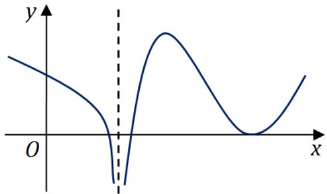

(A) 函数 $f(x)$ 有 2 个极值点，曲线 $y = f(x)$ 有 2 个拐点.  
(B) 函数 $f(x)$ 有 2 个极值点，曲线 $y = f(x)$ 有 3 个拐点.  
(C) 函数 $f(x)$ 有 3 个极值点, 曲线 $y = f(x)$ 有 1 个拐点.  
(D) 函数 $f(x)$ 有 3 个极值点, 曲线 $y = f(x)$ 有 2 个拐点.

解. 应选 (B). 由图像易知, 函数在前面 2 个驻点左右两侧导数符号相反, 故有 2 个极值点; 拐点是导函数单调性发生改变的点, 故有 3 个拐点.

5. 设函数 $f_{i}(x)$ （ $i = 1,2$ ）具有二阶连续导数，且 $f_{i}(x_{0}) < 0$ （ $i = 1,2$ ），若两条曲线 $y = f_{i}(x)$ （ $i = 1,2$ ）在点 $(x_{0},y_{0})$ 处具有公切线 $y = g(x)$ ，且在该点处曲线 $y = f_{1}(x)$ 的曲率大于曲线 $y = f_{2}(x)$ 的曲率，则在 $x_{0}$ 的某个邻域内，有……（）

(A) $f_{1}(x)\leqslant f_{2}(x)\leqslant g(x).$

(B) $f_{2}(x)\leqslant f_{1}(x)\leqslant g(x).$

(C) $f_{1}(x)\leqslant g(x)\leqslant f_{2}(x).$

(D) $f_{2}(x)\leqslant g(x)\leqslant f_{1}(x).$

解. 应选 (A). 由切线, 凹凸性和曲率的几何意义, 画图观察可得.

6. 已知函数 $f(x, y) = \frac{\mathrm{e}^x}{x - y}$ ，则

(A) $f_{x}^{\prime} - f_{y}^{\prime} = 0$

(B) $f_{x}^{\prime} + f_{y}^{\prime} = 0$

(C) $f_{x}^{\prime} - f_{y}^{\prime} = f$ .

(D) $f_{x}^{\prime} + f_{y}^{\prime} = f$

解. 应选 (D). $f_{x}^{\prime} = \frac{\mathrm{e}^{x}(x - y - 1)}{(x - y)^{2}}, f_{y}^{\prime} = \frac{\mathrm{e}^{x}}{(x - y)^{2}}$ , 所以 $f_{x}^{\prime} + f_{y}^{\prime} = f$ .

7. 同试卷一第一[5]题

8. 设二次型 $f(x_{1}, x_{2}, x_{3}) = a(x_{1}^{2} + x_{2}^{2} + x_{3}^{2}) + 2x_{1}x_{2} + 2x_{2}x_{3} + 2x_{1}x_{3}$ 的正负惯性指数分别为 1, 2，则

(A) $a > 1$

(B) $a <   - 2$

(C) $-2 < a < 1$ .

(D) $a = 1$ 或 $a = -2$

解. 应选 (C). 当 $a = 0$ 时, $f(x_{1}, x_{2}, x_{3}) = 2x_{1}x_{2} + 2x_{2}x_{3} + 2x_{1}x_{3}$ , 其矩阵为 $\left( \begin{array}{lll}0 & 1 & 1\\ 1 & 0 & 1\\ 1 & 1 & 0 \end{array} \right)$ ,

由此得特征值为 $2, -1, -1$ ，满足题目条件，故 $a = 0$ 成立，因此 (C) 为正确选项.

# 二、填空题（9～14小题，每小题4分，共24分）

9. 曲线 $y = \frac{x^3}{1 + x^2} + \arctan (1 + x^2)$ 的斜渐近线方程为

解. 应填 $y = x + \frac{\pi}{2}$ . 这是因为

$$
k = \lim  _ {x \rightarrow \infty} \frac {y}{x} = \lim  _ {x \rightarrow \infty} \left[ \frac {x ^ {2}}{1 + x ^ {2}} + \frac {\arctan (1 + x ^ {2})}{x} \right] = 1,
$$

$$
b = \lim  _ {x \rightarrow \infty} (y - k x) = \lim  _ {x \rightarrow \infty} \left[ \frac {- x}{1 + x ^ {2}} + \arctan (1 + x ^ {2}) \right] = \frac {\pi}{2}.
$$

10. 极限 $\lim_{n\to \infty}\frac{1}{n^2}\left(\sin {\frac{1}{n}} + 2\sin {\frac{2}{n}} + \dots +n\sin {\frac{n}{n}}\right) =$

解. 应填 $\sin 1 - \cos 1$ . 由定积分的定义

$$
\begin{array}{l} \lim  _ {n \rightarrow \infty} \frac {1}{n ^ {2}} \left(\sin \frac {1}{n} + 2 \sin \frac {2}{n} + \dots + n \sin \frac {n}{n}\right) = \lim  _ {n \rightarrow \infty} \frac {1}{n} \left(\frac {1}{n} \sin \frac {1}{n} + \frac {2}{n} \sin \frac {2}{n} + \dots + \frac {n}{n} \sin \frac {n}{n}\right) \\ = \int_ {0} ^ {1} x \sin x d x = \sin 1 - \cos 1. \\ \end{array}
$$

11. 以 $y = x^{2} - \mathrm{e}^{x}$ 和 $y = x^{2}$ 为特解的一阶非齐次线性微分方程为

解. 应填 $y' - y = 2x - x^2$ . 设微分方程为 $y' + p(x)y = q(x)$ , 代入两个特解得到

$$
\left\{ \begin{array}{l} 2 x + p (x) x ^ {2} = q (x), \\ (2 x - \mathrm {e} ^ {x}) + p (x) (x ^ {2} - \mathrm {e} ^ {x}) = q (x). \end{array} \right.
$$

解得 $p(x) = -1$ ， $q(x) = 2x - x^{2}$ ，所以微分方程为 $y^\prime -y = 2x - x^2$

12. 已知函数 $f(x)$ 在 $(- \infty, + \infty)$ 上连续, 且 $f(x) = (x + 1)^{2} + 2\int_{0}^{x}f(t)\mathrm{d}t$ , 则当 $n \geqslant 2$ 时, $f^{(n)}(0) =$ ________.

解. 应填 $2^{n - 1} \cdot 5$ . 易知 $f(0) = 1$ , 对已知等式两边依次求导得

$$
\begin{array}{l} f ^ {\prime} (x) = 2 (x + 1) + 2 f (x) \Rightarrow f ^ {\prime} (0) = 4, \\ f ^ {\prime \prime} (x) = 2 + 2 f ^ {\prime} (x) \Rightarrow f ^ {\prime \prime} (0) = 2 \cdot 5, \\ f ^ {\prime \prime \prime} (x) = 2 f ^ {\prime \prime} (x) \Rightarrow f ^ {\prime \prime \prime} (0) = 2 ^ {2} \cdot 5, \\ f ^ {(n)} (x) = 2 f ^ {(n - 2)} (x) \Rightarrow f ^ {(n)} (0) = 2 ^ {n - 1} \cdot 5. \\ \end{array}
$$

13. 已知动点 $P$ 在曲线 $y = x^{3}$ 上运动, 记坐标原点与点 $P$ 间的距离为 $l$ . 若点 $P$ 的横坐标对时间的变化率为常数 $\nu_{0}$ , 则当点 $P$ 运动到点 (1,1) 时, $l$ 对时间的变化率是

解. 应填 $2 \sqrt{2} v_{0}$ . 首先求得 $l = \sqrt{x^{2} + x^{6}}$ , 从而

$$
\frac {\mathrm {d} l}{\mathrm {d} t} = \frac {\mathrm {d} l}{\mathrm {d} x} \cdot \frac {\mathrm {d} x}{\mathrm {d} t} = \frac {2 x + 6 x ^ {5}}{2 \sqrt {x ^ {2} + x ^ {6}}} v _ {0} \quad \Rightarrow \quad \left. \frac {\mathrm {d} l}{\mathrm {d} t} \right| _ {x = 1} = 2 \sqrt {2} v _ {0}.
$$

14. 设矩阵 $\left( \begin{array}{rrr}a & -1 & -1\\ -1 & a & -1\\ -1 & -1 & a \end{array} \right)$ 与 $\left( \begin{array}{rrr}1 & 1 & 0\\ 0 & -1 & 1\\ 1 & 0 & 1 \end{array} \right)$ 等价，则 $a =$

解. 应填2. 设 $A = \begin{pmatrix} a & -1 & -1 \\ -1 & a & -1 \\ -1 & -1 & a \end{pmatrix}, B = \begin{pmatrix} 1 & 1 & 0 \\ 0 & -1 & 1 \\ 1 & 0 & 1 \end{pmatrix}$ , 则由两者等价可得 $r(A) = r(B) = 2$ . 因此 $|A| = 0$ , 解得 $a = 2$ 或 $a = -1$ . 当 $a = -1$ 时 $r(A) = 1$ 不满足条件, 故有 $a = 2$ .

# 三、解答题（15～23小题，共94分）

15. (本题满分 10 分)

求极限 $\lim_{x\to 0}(\cos 2x + 2x\sin x)^{\frac{1}{x^4}}$

解. 由泰勒公式可得

$$
\cos 2 x + 2 x \sin x - 1 = 1 - \frac {4 x ^ {2}}{2} + \frac {2 ^ {4} x ^ {4}}{4 !} + 2 x \left(x - \frac {x ^ {3}}{3 !}\right) - 1 + o (x ^ {4}) = \frac {1}{3} x ^ {4} + o (x ^ {4}),
$$

因此所求极限

$$
\lim  _ {x \rightarrow 0} (\cos 2 x + 2 x \sin x) ^ {\frac {1}{x ^ {4}}} = \lim  _ {x \rightarrow 0} \exp \left(\frac {\cos 2 x + 2 x \sin x - 1}{x ^ {4}}\right) = e ^ {\frac {1}{3}}.
$$

16. (本题满分 10 分)

设函数 $f(x) = \int_{0}^{1}\left|t^{2} - x^{2}\right|\mathrm{d}t$ （ $x > 0$ ），求 $f^{\prime}(x)$ 并求 $f(x)$ 的最小值.

解. 当 $x \geqslant 1$ 时, $f(x) = \int_{0}^{1}\left(x^{2} - t^{2}\right)\mathrm{d}t = x^{2} - \frac{1}{3}$ ; 当 $0 < x < 1$ 时,

$$
f (x) = \int_ {0} ^ {x} \left(x ^ {2} - t ^ {2}\right) \mathrm {d} t + \int_ {x} ^ {1} \left(t ^ {2} - x ^ {2}\right) \mathrm {d} t = \frac {4}{3} x ^ {3} - x ^ {2} + \frac {1}{3}.
$$

所以

$$
f (x) = \left\{ \begin{array}{l l} \frac {4}{3} x ^ {3} - x ^ {2} + \frac {1}{3}, & 0 \leqslant x <   1, \\ x ^ {2}, & x \geqslant 1; \end{array} \right. \Rightarrow f ^ {\prime} (x) = \left\{ \begin{array}{l l} 4 x ^ {2} - 2 x, & 0 <   x <   1, \\ 2 x, & x > 1. \end{array} \right.
$$

令 $f^{\prime}(x) = 0$ ，得到唯一的驻点 $x = \frac{1}{2}$ 。又因为 $f''\left(\frac{1}{2}\right) = 2 > 0$ ，所以 $f(x)$ 的最小值为 $f\left(\frac{1}{2}\right) = \frac{1}{4}$ 。

17. (本题满分 10 分)

已知函数 $z = z(x,y)$ 由方程 $(x^{2} + y^{2})z + \ln z + 2(x + y + 1) = 0$ 确定，求 $z = z(x,y)$ 的极值.

解. 对方程两边分别对 $x$ 和 $y$ 求偏导数得

$$
\left\{ \begin{array}{l} 2 x z + (x ^ {2} + y ^ {2}) z _ {x} ^ {\prime} + \frac {z _ {x} ^ {\prime}}{z} + 2 = 0, \\ 2 y z + (x ^ {2} + y ^ {2}) z _ {y} ^ {\prime} + \frac {z _ {y} ^ {\prime}}{z} + 2 = 0. \end{array} \right.
$$

令 $z_{x}^{\prime} = z_{y}^{\prime} = 0$ ，解得 $(-1, - 1)$ 是函数 $z = z(x,y)$ 的惟一驻点．对上面两个方程再求偏导数得

$$
\left\{ \begin{array}{l} 2 z + 2 x z _ {x} ^ {\prime} + 2 x z _ {x} ^ {\prime} + (x ^ {2} + y ^ {2}) z _ {x x} ^ {\prime \prime} + \frac {1}{z} z _ {x x} ^ {\prime \prime} - \frac {1}{z ^ {2}} (z _ {x} ^ {\prime}) ^ {2} = 0, \\ 2 x z _ {y} ^ {\prime} + 2 y z _ {x} ^ {\prime} + (x ^ {2} + y ^ {2}) z _ {x y} ^ {\prime \prime} - \frac {1}{z ^ {2}} z _ {x} ^ {\prime} z _ {y} ^ {\prime} + \frac {1}{z} z _ {x y} ^ {\prime \prime} = 0, \\ 2 z + 2 y z _ {y} ^ {\prime} + 2 y z _ {y} ^ {\prime} + (x ^ {2} + y ^ {2}) z _ {y y} ^ {\prime \prime} + \frac {1}{z} z _ {y y} ^ {\prime \prime} - \frac {1}{z ^ {2}} (z _ {y} ^ {\prime}) ^ {2} = 0. \end{array} \right.
$$

代入 $z(-1, - 1) = 1$ 和 $z_{x}^{\prime}(-1, - 1) = z_{y}^{\prime}(-1, - 1) = 0$ ，解得

$$
A = z _ {x x} ^ {\prime \prime} (- 1, - 1) = - \frac {2}{3}, \quad B = z _ {x y} ^ {\prime \prime} (- 1, - 1) = 0, \quad C = z _ {y y} ^ {\prime \prime} (- 1, - 1) = - \frac {2}{3}.
$$

由 $AC - B^2 > 0$ 和 $A < 0$ 可得， $z(-1, -1) = 1$ 是 $z = z(x, y)$ 的极大值.

18.（本题满分10分）

设 $D$ 是由直线 $y = 1, y = x, y = -x$ 围成的有界区域，

计算二重积分 $\iint_{D} \frac{x^2 - xy - y^2}{x^2 + y^2} \, \mathrm{d}x \, \mathrm{d}y.$

解. 利用二重积分的对称性, 可得

$$
\begin{array}{l} I = \iint_ {D} \frac {x ^ {2} - x y - y ^ {2}}{x ^ {2} + y ^ {2}} d x d y = \iint_ {D} \frac {x ^ {2} - y ^ {2}}{x ^ {2} + y ^ {2}} d x d y \\ = \int_ {\frac {\pi}{4}} ^ {\frac {3 \pi}{4}} \mathrm {d} \theta \int_ {0} ^ {\frac {1}{\sin \theta}} \frac {r ^ {2} (\cos^ {2} \theta - \sin^ {2} \theta)}{r ^ {2}} r \mathrm {d} r = 1 - \frac {\pi}{2}. \\ \end{array}
$$

19. (本题满分 10 分)

已知 $y_{1}(x) = \mathrm{e}^{x}$ , $y_{2}(x) = u(x)\mathrm{e}^{x}$ 是二阶微分方程 $(2x - 1)y^{n} - (2x + 1)y^{\prime} + 2y = 0$ 的解, 若 $u(-1) = e$ , $u(0) = -1$ , 求 $u(x)$ , 并写出该微分方程的通解.

解. 将 $y_{2}(x) = u(x)\mathrm{e}^{x}$ 代入微分方程, 整理得

$$
(2 x - 1) u ^ {\prime \prime} (x) + (2 x - 3) u ^ {\prime} (x) = 0.
$$

这是可降阶微分方程，解得 $u(x) = -(2x + 1)\mathrm{e}^{-x}$ 。所以原微分方程的通解为

$$
y = k _ {1} y _ {1} (x) + k _ {2} y _ {2} (x) = k _ {1} \mathrm {e} ^ {x} - k _ {2} (2 x + 1),
$$

其中 $k_{1}, k_{2}$ 为任意常数.

20. (本题满分 11 分)

设 $D$ 是由曲线 $y = \sqrt{1 - x^2}$ （ $0 \leqslant x \leqslant 1$ ）与 $\left\{ \begin{array}{l}x = \cos^3 t \\ y = \sin^3 t \end{array} \right.$ （ $0 \leqslant t \leqslant \frac{\pi}{2}$ ）围成的平面区域，求 $D$ 绕 $x$ 轴旋转一周所得旋转体的体积和表面积.

解. 旋转体的体积

$$
\begin{array}{l} V = V _ {1} - V _ {2} = \pi \int_ {0} ^ {1} (1 - x ^ {2}) d x - \int_ {\frac {\pi}{2}} ^ {0} \sin^ {6} t \cdot 3 \cos^ {2} t (- \sin t) d t \\ = \frac {2 \pi}{3} - \frac {1 6 \pi}{1 0 5} = \frac {1 8 \pi}{3 5}. \\ \end{array}
$$

旋转体的表面积

$$
\begin{array}{l} S = S _ {1} + S _ {2} = 2 \pi + 2 \pi \int_ {0} ^ {\frac {\pi}{2}} \sin^ {3} t \sqrt {(3 \cos^ {2} t \sin t) ^ {2} + (3 \sin^ {2} t \cos t) ^ {2}} d t \\ = 2 \pi + \frac {6 \pi}{5} = \frac {1 6 \pi}{5}. \\ \end{array}
$$

21. (本题满分 11 分)

已知 $f(x)$ 在 $\left[0, \frac{3\pi}{2}\right]$ 上连续，在 $\left(0, \frac{3\pi}{2}\right)$ 内是函数 $\frac{\cos x}{2x - 3\pi}$ 的一个原函数 $f(0) = 0$ .

(I) 求 $f(x)$ 在区间 $\left[0, \frac{3\pi}{2}\right]$ 上的平均值;  
(II) 证明 $f(x)$ 在区间 $\left(0, \frac{3\pi}{2}\right)$ 内存在唯一零点.

解. (I) 由题意, $f(x) = \int_{0}^{x} \frac{\cos t}{2t - 3\pi} \mathrm{d}t$ . 所以 $f(x)$ 在区间 $\left[0, \frac{3\pi}{2}\right]$ 上的平均值为

$$
\begin{array}{l} \bar {f} = \frac {2}{3 \pi} \int_ {0} ^ {\frac {3 \pi}{2}} f (x) d x = \frac {2}{3 \pi} \int_ {0} ^ {\frac {3 \pi}{2}} d x \int_ {0} ^ {x} \frac {\cos t}{2 t - 3 \pi} d t \\ = \frac {2}{3 \pi} \int_ {0} ^ {\frac {3 \pi}{2}} \mathrm {d} t \int_ {t} ^ {\frac {3 \pi}{2}} \frac {\cos t}{2 t - 3 \pi} \mathrm {d} x = \frac {1}{3 \pi}. \\ \end{array}
$$

(II) 由 $f'(x) = \frac{\cos x}{2x - 3\pi}$ ，可得 $f(x)$ 在区间 $\left(0, \frac{3\pi}{2}\right)$ 内存在唯一驻点 $x = \frac{\pi}{2}$ 。而且当 $0 < x < \frac{\pi}{2}$ 时 $f'(x) < 0$ ，当 $\frac{\pi}{2} < x < \frac{3\pi}{2}$ 时 $f'(x) > 0$ 。因为 $f(0) = 0$ ，由单调性，当 $0 < x < \frac{\pi}{2}$ 时 $f(x)$ 无零点。因为 $f\left(\frac{\pi}{2}\right) < 0$ 且 $f\left(\frac{3\pi}{2}\right) > 0$ ，由零值定理和单调性，当 $\frac{\pi}{2} < x < \frac{3\pi}{2}$ 时 $f(x)$ 有唯一零点。综上所述， $f(x)$ 在区间 $\left(0, \frac{3\pi}{2}\right)$ 内存在唯一零点。

22. (本题满分11分)

设矩阵 $A = \left( \begin{array}{lll}1 & 1 & 1 - a\\ 1 & 0 & a\\ a + 1 & 1 & a + 1 \end{array} \right),\beta = \left( \begin{array}{c}0\\ 1\\ 2a - 2 \end{array} \right)$ ，且方程组 $Ax = \beta$ 无解.

(I)求 $a$ 的值；(II)求方程组 $A^T Ax = A^T\beta$ 的通解.

解. (I) 对增广矩阵作初等行变换得

$$
\left(A, \beta\right) = \left( \begin{array}{c c c c} 1 & 1 & 1 - a & 0 \\ 1 & 0 & a & 1 \\ a + 1 & 1 & a + 1 & 2 a - 2 \end{array} \right) = \left( \begin{array}{c c c c} 1 & 1 & 1 - a & 0 \\ 0 & - 1 & 2 a - 1 & 1 \\ 0 & 0 & - a ^ {2} + 2 a & a - 2 \end{array} \right).
$$

由方程组 $Ax = \beta$ 无解，可知 $r(A) < r(A, \beta)$ ，故 $a = 0$ .

(II) 当 $a = 0$ 时,

$$
A ^ {T} A = \left( \begin{array}{c c c} 3 & 2 & 2 \\ 2 & 2 & 2 \\ 2 & 2 & 2 \end{array} \right), \quad A ^ {T} \beta = \left( \begin{array}{c} - 1 \\ - 2 \\ - 2 \end{array} \right).
$$

故由初等行变换有

$$
(A ^ {T} A, A ^ {T} \beta) = \left( \begin{array}{c c c c} 3 & 2 & 2 & - 1 \\ 2 & 2 & 2 & - 2 \\ 2 & 2 & 2 & - 2 \end{array} \right) \to \left( \begin{array}{c c c c} 1 & 0 & 0 & 1 \\ 0 & 1 & 1 & - 2 \\ 0 & 0 & 0 & 0 \end{array} \right).
$$

因此方程组 $A^T A x = A^T \beta$ 的通解为 $x = k \begin{pmatrix} 0 \\ -1 \\ 1 \end{pmatrix} + \begin{pmatrix} 1 \\ -2 \\ 0 \end{pmatrix}$ , 其中 $k$ 为任意实数.

23. 同试卷一第三[21]题

# 二〇一七年考研数学试卷二解答

# 一、选择题（1～8小题，每小题4分，共32分）

1. 同试卷一第一[1]题

2. 设二阶可导函数 $f(x)$ 满足 $f(1) = f(-1) = 1$ ， $f(0) = -1$ ，且 $f''(x) > 0$ ，则·（）

(A) $\int_{-1}^{1}f(x)\mathrm{d}x > 0.$

(B) $\int_{-1}^{1}f(x)\mathrm{d}x < 0.$

(C) $\int_{-1}^{0}f(x)\mathrm{d}x > \int_{0}^{1}f(x)\mathrm{d}x.$

(D) $\int_{-1}^{0}f(x)\mathrm{d}x <   \int_{0}^{1}f(x)\mathrm{d}x.$

解. 应选 (B). 由 $f''(x) < 0$ 知 $f(x)$ 的图像在其任意两点连线的曲线下方, 故有

$$
\begin{array}{l} f (x) \leqslant f (0) + [ f (1) - f (0) ] x = 2 x - 1, \quad x \in (0, 1); \\ f (x) \leqslant f (0) + [ f (0) - f (- 1) ] x = - 2 x - 1, \quad x \in (- 1, 0). \\ \end{array}
$$

因此由定积分的保号性得到

$$
\int_ {0} ^ {1} f (x) \mathrm {d} x <   \int_ {0} ^ {1} (2 x - 1) \mathrm {d} x = 0, \quad \int_ {- 1} ^ {0} f (x) \mathrm {d} x <   \int_ {- 1} ^ {0} (- 2 x - 1) \mathrm {d} x = 0.
$$

从而有

$$
\int_ {- 1} ^ {1} f (x) \mathrm {d} x = \int_ {- 1} ^ {0} f (x) \mathrm {d} x + \int_ {0} ^ {1} f (x) \mathrm {d} x <   0.
$$

3. 设数列 $\{x_{n}\}$ 收敛，则

(A) 当 $\lim_{n\to \infty}\sin x_n = 0$ 时， $\lim_{n\to \infty}x_n = 0.$   
(B) 当 $\lim_{n\to \infty}(x_n + \sqrt{|x_n|}) = 0$ 时, $\lim_{n\to \infty}x_n = 0.$   
(C) 当 $\lim_{n\to \infty}(x_n + x_n^2) = 0$ 时, $\lim_{n\to \infty}x_n = 0.$   
(D) 当 $\lim_{n\to \infty}(x_n + \sin x_n) = 0$ 时, $\lim_{n\to \infty}x_n = 0.$

解. 应选 (D). 设 $\lim_{n\to \infty}x_n = a$ ，则 $\lim_{n\to \infty}\sin x_n = \sin a$ ，可知当 $\sin a = 0$ ，也即 $a = k\pi$ 中 $(k = 0,\pm 1,\pm 2,\dots)$ 时，都有 $\lim_{n\to \infty}\sin x_n = 0$ ，故(A)错误. $\lim_{n\to \infty}(x_n + \sqrt{|x_n|}) = a + \sqrt{|a|},$ 可知当 $a + \sqrt{|a|} = 0$ ，也即 $a = 0$ 或者 $a = -1$ 时，都有 $\lim_{n\to \infty}(x_n + \sqrt{|x_n|}) = 0$ ，故(B)错误. $\lim_{n\to \infty}(x_n + x_n^2) = a + a^2$ ，可知当 $a + a^2 = 0$ ，也即 $a = 0$ 或者 $a = -1$ 时，都有 $\lim_{n\to \infty}(x_n + x_n^2) = 0$ ，故(C)错误. $\lim_{n\to \infty}(x_n + \sin x_n) = a + \sin a$ ，而要使 $a + \sin a = 0$ 只有 $a = 0$ ，故(D)正确.

4. 微分方程 $y'' - 4y' + 8y = \mathrm{e}^{2x}(1 + \cos 2x)$ 的特解可设为 $y^* = \dots \dots \dots \dots \dots \dots$ （）

(A) $A\mathrm{e}^{2x} + \mathrm{e}^{2x}\left(B\cos 2x + C\sin 2x\right).$   
(B) $Ax\mathrm{e}^{2x} + \mathrm{e}^{2x}(B\cos 2x + C\sin 2x).$   
(C) $A\mathrm{e}^{2x} + x\mathrm{e}^{2x}(B\cos 2x + C\sin 2x).$   
(D) $Ax\mathrm{e}^{2x} + x\mathrm{e}^{2x}(B\cos 2x + C\sin 2x).$

解. 应选 (C). 齐次方程的特征方程为 $\lambda^2 - 4\lambda + 8 = 0$ , 特征根为 $\lambda = 2 \pm 2i$ . 将非齐次方程拆分为: ① $y'' - 4y' + 8y = e^{2x}$ 与 ② $y'' - 4y' + 8y = e^{2x} \cos 2x$ . 方程 ① 和 ② 的特解可以分别设为

$$
y _ {1} ^ {*} = A \mathrm {e} ^ {2 x}, \quad y _ {2} ^ {*} = x \mathrm {e} ^ {2 x} (B \cos 2 x + C \sin 2 x).
$$

由解的叠加原理可知，原方程的特解可以设为

$$
y _ {2} ^ {*} = A \mathrm {e} ^ {2 x} + x \mathrm {e} ^ {2 x} (B \cos 2 x + C \sin 2 x).
$$

5. 设 $f(x, y)$ 具有一阶偏导数，且对任意的 $(x, y)$ ，都有 $\frac{\partial f(x, y)}{\partial x} > 0$ ， $\frac{\partial f(x, y)}{\partial y} < 0$ 则……（）

(A) $f(0,0) > f(1,1)$

(B) $f(0,0) <   f(1,1)$

(C) $f(0,1) > f(1,0)$

(D) $f(0,1) <   f(1,0)$

解. 应选 (D). 由于 $\frac{\partial f(x, y)}{\partial x} > 0$ , 可知 $f(x, y)$ 关于 $x$ 单调递增, 故有 $f(0, 1) < f(1, 1)$ . 又由于 $\frac{\partial f(x, y)}{\partial y} < 0$ , 可知 $f(x, y)$ 关于 $y$ 单调递减, 故有 $f(1, 1) < f(1, 0)$ , 从而 $f(0, 1) < f(1, 0)$ .

6. 同试卷一第一[4]题

7. 设 $A$ 为3阶矩阵， $P = (\alpha_{1}, \alpha_{2}, \alpha_{3})$ 为可逆矩阵，使得 $P^{-1}AP = \begin{pmatrix} 0 & 0 & 0 \\ 0 & 1 & 0 \\ 0 & 0 & 2 \end{pmatrix}$ ，则 $A(\alpha_{1} + \alpha_{2} + \alpha_{3}) = \dots \dots \dots \dots \dots \dots \dots \dots \dots \dots \dots \dots \dots \dots \dots \dots \dots \dots \dots \dots \dots \dots \dots \dots \dots \dots \dots \dots \dots \dots \dots \dots \dots \dots \dots \dots \dots \dots \dots \dots \dots \dots$ （）

(A) $\alpha_{1} + \alpha_{2}$

(B) $\alpha_{2} + 2\alpha_{3}$

(C) $\alpha_{2} + \alpha_{3}$

(D) $\alpha_{1} + 2\alpha_{2}$

解. 应选 (B). 这是因为

$$
\begin{array}{l} A (\alpha_ {1} + \alpha_ {2} + \alpha_ {3}) = A (\alpha_ {1}, \alpha_ {2}, \alpha_ {3}) \left( \begin{array}{c} 1 \\ 1 \\ 1 \end{array} \right) \\ = (\alpha_ {1}, \alpha_ {2}, \alpha_ {3}) (\alpha_ {1}, \alpha_ {2}, \alpha_ {3}) ^ {- 1} A (\alpha_ {1}, \alpha_ {2}, \alpha_ {3}) \left( \begin{array}{l} 1 \\ 1 \\ 1 \end{array} \right) \\ = (\alpha_ {1}, \alpha_ {2}, \alpha_ {3}) \left( \begin{array}{l l l} 0 & 0 & 0 \\ 0 & 1 & 0 \\ 0 & 0 & 2 \end{array} \right) \left( \begin{array}{l} 1 \\ 1 \\ 1 \end{array} \right) = (\alpha_ {1}, \alpha_ {2}, \alpha_ {3}) \left( \begin{array}{l} 0 \\ 1 \\ 2 \end{array} \right) = \alpha_ {2} + 2 \alpha_ {3}. \\ \end{array}
$$

8. 同试卷一第一[6]题

# 二、填空题（9～14小题，每小题4分，共24分）

9. 曲线 $y = x\left(1 + \arcsin \frac{2}{x}\right)$ 的斜渐近线方程为

解. 应填 $y = x + 2$ . 因为

$$
k = \lim  _ {x \rightarrow \infty} \frac {x \left(1 + \arcsin \frac {2}{x}\right)}{x} = 1, \quad b = \lim  _ {x \rightarrow \infty} x \left(1 + \arcsin \frac {2}{x}\right) - x = 2,
$$

所以斜渐近线方程为 $y = x + 2$

10. 设函数 $y = y(x)$ 由参数方程 $\left\{ \begin{array}{l} x = t + \mathrm{e}^t \\ y = \sin t \end{array} \right.$ 确定，则 $\left.\frac{\mathrm{d}^2y}{\mathrm{d}x^2}\right|_{t=0} =$

解. 应填 $-\frac{1}{8}$ . 因为

$$
\begin{array}{l} \frac {\mathrm {d} y}{\mathrm {d} x} = \frac {y ^ {\prime} (t)}{x ^ {\prime} (t)} = \frac {\cos t}{1 + \mathrm {e} ^ {t}}, \\ \frac {\mathrm {d} ^ {2} y}{\mathrm {d} x ^ {2}} = \frac {\left(\frac {\cos t}{1 + \mathrm {e} ^ {t}}\right) ^ {\prime}}{1 + \mathrm {e} ^ {t}} = \frac {\frac {- \sin t (1 + \mathrm {e} ^ {t}) - \mathrm {e} ^ {t} \cos t}{(1 + \mathrm {e} ^ {t}) ^ {2}}}{1 + \mathrm {e} ^ {t}} = \frac {- \sin t - \mathrm {e} ^ {t} \sin t - \mathrm {e} ^ {t} \cos t}{(1 + \mathrm {e} ^ {t}) ^ {3}}, \\ \end{array}
$$

所以 $\left.\frac{\mathrm{d}^2y}{\mathrm{d}x^2}\right|_{t = 0} = -\frac{1}{8}.$

11. $\int_{0}^{+\infty}\frac{\ln(1 + x)}{(1 + x)^{2}}\mathrm{d}x = \underline{\quad}$

解. 应填 1. 由分部积分法可得

$$
\begin{array}{l} \int_ {0} ^ {+ \infty} \frac {\ln (1 + x)}{(1 + x) ^ {2}} d x = \int_ {0} ^ {+ \infty} \ln (1 + x) d \left(- \frac {1}{1 + x}\right) \\ = - \frac {1}{1 + x} \ln (1 + x) \bigg | _ {0} ^ {+ \infty} + \int_ {0} ^ {+ \infty} \left(\frac {1}{1 + x}\right) ^ {2} d x \\ = - \frac {1}{1 + x} \ln (1 + x) \bigg | _ {0} ^ {+ \infty} - \frac {1}{1 + x} \bigg | _ {0} ^ {+ \infty} = 0 + 1 = 1. \\ \end{array}
$$

12. 设函数 $f(x, y)$ 具有一阶连续偏导数，且 $\mathrm{d}f(x, y) = y\mathrm{e}^{y}\mathrm{d}x + x(1 + y)\mathrm{e}^{y}\mathrm{d}y$ ， $f(0, 0) = 0$ ，则 $f(x, y) =$ ________.

解. 应填 $x y \mathrm{e}^{y}$ . 由题可知, $f_{x}^{\prime} = y \mathrm{e}^{y}, f_{y}^{\prime} = x (1 + y) \mathrm{e}^{y}$ , 从而

$$
f (x, y) = \int y e ^ {y} d x = x y e ^ {y} + c (y),
$$

$$
f _ {y} ^ {\prime} = x \mathrm {e} ^ {y} + x y \mathrm {e} ^ {y} + c ^ {\prime} (y) = x \mathrm {e} ^ {y} + x y \mathrm {e} ^ {y}.
$$

即 $c'(y) = 0$ ，即 $c(y) = c$ ，由 $f(0,0) = 0$ 得 $c = 0$ ，从而 $f(x,y) = xy\mathrm{e}^y$

13. $\int_0^1\mathrm{d}y\int_y^1\frac{\tan x}{x}\mathrm{d}x = \underline{\quad}$

解. 应填 $-\ln (\cos 1)$ . 交换积分次序可得

$$
\int_ {0} ^ {1} \mathrm {d} y \int_ {y} ^ {1} \frac {\tan x}{x} \mathrm {d} x = \int_ {0} ^ {1} \mathrm {d} x \int_ {0} ^ {x} \frac {\tan x}{x} \mathrm {d} y = \int_ {0} ^ {1} \tan x \mathrm {d} x = - [ \ln | \cos x | ] _ {0} ^ {1} = - \ln \cos 1.
$$

14. 设矩阵 $A = \begin{pmatrix} 4 & 1 & -2 \\ 1 & 2 & a \\ 3 & 1 & -1 \end{pmatrix}$ 的一个特征向量为 $\begin{pmatrix} 1 \\ 1 \\ 2 \end{pmatrix}$ , 则 $a =$ ________.

解. 应填 -1. 因为 $A\left( \begin{array}{l} 1 \\ 1 \\ 2 \end{array} \right) = \left( \begin{array}{l} 1 \\ 3 + 2a \\ 2 \end{array} \right)$ , 即 $3 + 2a = 1$ , 可得 $a = -1$ .

# 三、解答题（15～23小题，共94分）

15. (本题满分 10 分)

求极限 $\lim_{x\to 0^{+}}\frac{\int_{0}^{x}\sqrt{x - t}\mathrm{e}^{t}\mathrm{d}t}{\sqrt{x^3}}.$

解. 先对变上限积分 $\int_{0}^{x} \sqrt{x - t} \mathrm{e}^{t} \, \mathrm{d}t$ 作变量代换 $u = x - t$ , 得

$$
\int_ {0} ^ {x} \sqrt {x - t} e ^ {t} d t = \int_ {x} ^ {0} \sqrt {u} e ^ {x - u} (- d u) = e ^ {x} \int_ {0} ^ {x} \sqrt {u} e ^ {- u} d u.
$$

则由洛必达法则可知

$$
\begin{array}{l} \lim  _ {x \rightarrow 0 ^ {+}} \frac {\int_ {0} ^ {x} \sqrt {x - t} e ^ {t} d t}{\sqrt {x ^ {3}}} = \lim  _ {x \rightarrow 0 ^ {+}} \frac {e ^ {x} \int_ {0} ^ {x} \sqrt {u} e ^ {- u} d u + \sqrt {x}}{\frac {3}{2} \sqrt {x}} \\ = \frac {2}{3} \lim  _ {x \rightarrow 0 ^ {+}} \frac {\int_ {0} ^ {x} \sqrt {u} e ^ {- u} d u}{\sqrt {x} e ^ {- x}} + \frac {2}{3} = \frac {2}{3} \lim  _ {x \rightarrow 0 ^ {+}} \frac {\sqrt {x} e ^ {- x}}{- \sqrt {x} e ^ {- x} + \frac {1}{2 \sqrt {x}} e ^ {- x}} + \frac {2}{3} \\ = \frac {2}{3} \lim  _ {x \rightarrow 0 ^ {+}} \frac {x e ^ {- x}}{- x e ^ {- x} + \frac {1}{2} e ^ {- x}} + \frac {2}{3} = \frac {2}{3}. \\ \end{array}
$$

16. 同试卷一第三[15]题  
17. 同试卷一第三[16]题  
18. 同试卷一第三[17]题  
19. 同试卷一第三[18]题  
20. (本题满分 11 分)

已知平面区域 $D = \left\{(x, y) \mid x^2 + y^2 \leqslant 2y\right\}$ , 计算二重积分 $\iint_{D} (x + 1)^{2} \mathrm{d}x \mathrm{~d}y$ .

解. 因为积分区域关于 $y$ 轴对称, 所以

$$
\begin{array}{l} \iint_ {D} (x + 1) ^ {2} \mathrm {d} x \mathrm {d} y = \iint_ {D} x ^ {2} \mathrm {d} x \mathrm {d} y + \iint_ {D} 1 \mathrm {d} x \mathrm {d} y \\ = \int_ {0} ^ {\pi} d \theta \int_ {0} ^ {2 \sin \theta} \rho^ {3} \cos^ {2} \theta d \rho + \pi = \frac {\pi}{4} + \pi = \frac {5 \pi}{4}. \\ \end{array}
$$

21. (本题满分 11 分)

设 $y(x)$ 是区间 $\left(0, \frac{3}{2}\right)$ 内的可导函数，且 $y(1) = 0$ 。点 $P$ 是曲线 $L: y = y(x)$ 上的任意一点。 $L$ 在 $P$ 处的切线与 $y$ 轴相交于点 $\left(0, Y_p\right)$ ，法线与 $x$ 轴相交于点 $\left(X_p, 0\right)$ ，若 $X_p = Y_p$ ，求 $L$ 上点的坐标 $(x, y)$ 满足的方程。

解. 曲线上点 $P(x, y)$ 的切线为

$$
Y - y (x) = y ^ {\prime} (x) (X - x);
$$

令 $X = 0$ 得, $Y_{p} = y(x) - y^{\prime}(x)x$ . 法线为

$$
Y - y (x) = - \frac {1}{y ^ {\prime} (x)} (X - x);
$$

令 $Y = 0$ 得， $X_{p} = x + y(x)y'(x)$ ．由 $Y_{p} = X_{p}$ 得

$$
y - x y ^ {\prime} (x) = x + y y ^ {\prime} (x), \quad \Rightarrow \quad \left(\frac {y}{x} + 1\right) y ^ {\prime} (x) = \frac {y}{x} - 1.
$$

令 $\frac{y}{x} = u$ ，则 $y = ux, \frac{\mathrm{d}y}{\mathrm{d}x} = x\frac{\mathrm{d}u}{\mathrm{d}x} + u$ ，从而得到

$$
(u + 1) \left(x \frac {\mathrm {d} u}{\mathrm {d} x} + u\right) = (u - 1) \Rightarrow \int \frac {u + 1}{u ^ {2} + 1} \mathrm {d} u = - \int \frac {\mathrm {d} x}{x}.
$$

当 $x > 0$ 时解得

$$
\frac {1}{2} \ln (u ^ {2} + 1) + \arctan u = - \ln x + C.
$$

代入初始条件 $y(1) = 0$ 得到 $C = 0$ , 从而

$$
\ln \left(x ^ {2} + y ^ {2}\right) + 2 \arctan \frac {y}{x} = 0.
$$

22. 同试卷一第三[20]题  
23. 同试卷一第三[21]题

# 二〇一八年考研数学试卷二解答

# 一、选择题（1～8小题，每小题4分，共32分）

1. 若 $\lim_{x\to 0}\left(\mathrm{e}^{x} + ax^{2} + bx\right)^{\frac{1}{x^{2}}} = 1$ ，则

(A) $a = \frac{1}{2}, b = -1.$

(B) $a = -\frac{1}{2}, b = -1.$

(C) $a = \frac{1}{2}, b = 1$ .

(D) $a = -\frac{1}{2}, b = 1.$

解. 应选 (B). 由题设有

$$
1 = \lim  _ {x \rightarrow 0} \left(\mathrm {e} ^ {x} + a x ^ {2} + b x\right) ^ {\frac {1}{x ^ {2}}} = \exp \left(\lim  _ {x \rightarrow 0} \frac {1}{x ^ {2}} \ln (\mathrm {e} ^ {x} + a x ^ {2} + b x)\right).
$$

所以由泰勒公式有

$$
0 = \lim  _ {x \rightarrow 0} \frac {\mathrm {e} ^ {x} + a x ^ {2} + b x - 1}{x ^ {2}} = \lim  _ {x \rightarrow 0} \frac {(1 + b) x + \left(\frac {1}{2} + a\right) x ^ {2} + o (x ^ {2})}{x ^ {2}}
$$

由此可得

$$
\left\{ \begin{array}{l} 1 + b = 0, \\ \frac {1}{2} + a = 0. \end{array} \right. \Rightarrow \left\{ \begin{array}{l} a = - \frac {1}{2}, \\ b = - 1. \end{array} \right.
$$

2. 同试卷一第一[1]题

3. 设函数 $f(x) = \left\{ \begin{array}{ll} -1, & x < 0, \\ 1, & x \geqslant 0; \end{array} \right.$ , $g(x) = \left\{ \begin{array}{ll} 2 - ax, & x \leqslant -1, \\ x, & -1 < x < 0, \\ x - b, & x \geqslant 0. \end{array} \right.$ 若 $f(x) + g(x)$ 在 $R$ 上连续，则……（）

(A) $a = 3, b = 1$ .

(B) $a = 3, b = 2$

(C) $a = -3, b = 1$ .

(D) $a = -3, b = 2$ .

解. 应选 (D). 由题设可得

$$
f (x) + g (x) = \left\{ \begin{array}{l l} 1 - a x, & x \leqslant - 1, \\ - 1 + x, & - 1 <   x <   0, \\ 1 + x - b, & x \geqslant 0. \end{array} \right.
$$

由 $f(x) + g(x)$ 连续可得

$$
\lim  _ {x \rightarrow - 1 ^ {-}} (f (x) + g (x)) = 1 + a, \quad \lim  _ {x \rightarrow - 1 ^ {+}} (f (x) + g (x)) = - 2, \quad \Rightarrow \quad a = - 3;
$$

$$
\lim  _ {x \to 0 ^ {-}} (f (x) + g (x)) = - 1, \quad \lim  _ {x \to 0 ^ {+}} (f (x) + g (x)) = 1 - b, \quad \Rightarrow \quad b = 2.
$$

4. 设函数 $f(x)$ 在 $[0,1]$ 上二阶可导，且 $\int_0^1 f(x)\mathrm{d}x = 0$ ，则

(A) 当 $f^{\prime}(x) < 0$ 时， $f\left(\frac{1}{2}\right) < 0$ .

(B) 当 $f''(x) < 0$ 时, $f\left(\frac{1}{2}\right) < 0$ .

(C) 当 $f^{\prime}(x) > 0$ 时， $f\left(\frac{1}{2}\right) < 0$ .

(D) 当 $f''(x) > 0$ 时， $f\left(\frac{1}{2}\right) < 0$ .

解. 应选 (D). 对于选项 (A), 取 $f(x) = -x + \frac{1}{2}$ 可以排除. 对于选项 (B), 取 $f(x) = -\left(x - \frac{1}{2}\right)^{2} + 1$ 可以排除. 对于选项 (C), 取 $f(x) = -x - \frac{1}{2}$ 可以排除. 对于选项 (D), 由泰勒公式可得

$$
f (x) = f \left(\frac {1}{2}\right) + f ^ {\prime} \left(\frac {1}{2}\right) \left(x - \frac {1}{2}\right) + \frac {f ^ {\prime \prime} (\xi)}{2} \left(x - \frac {1}{2}\right) ^ {2};
$$

两边在 $[0,1]$ 上积分可知它是正确的.

5. 同试卷一第一[4]题

6. $\int_{-1}^{0}\mathrm{d}x\int_{-x}^{2 - x^2}(1 - xy)\mathrm{d}y + \int_{0}^{1}\mathrm{d}x\int_{x}^{2 - x^2}(1 - xy)\mathrm{d}y = \dots \dots \dots \dots \dots \dots \dots \dots \dots \dots$

(A) $\frac{5}{3}$ .

(B) $\frac{5}{6}$ .

(C) $\frac{7}{3}$ .

(D) $\frac{7}{6}$ .

解. 应选 (C). 因为积分区域 $D$ 关于 $y$ 轴对称, 所以

原式 $= \iint_{D} (1 - xy) \, \mathrm{d}x \, \mathrm{d}y = \iint_{D} \, \mathrm{d}x \, \mathrm{d}y = 2 \iint_{D_1} \, \mathrm{d}x \, \mathrm{d}y$

$$
= 2 \int_ {0} ^ {1} \mathrm {d} x \int_ {x} ^ {2 - x ^ {2}} \mathrm {d} y = 2 \int_ {0} ^ {1} (2 - x ^ {2} - x) \mathrm {d} x = 2 \left(2 - \frac {1}{3} - \frac {1}{2}\right) = \frac {7}{3}.
$$

7. 同试卷一第一[5]题  
8. 同试卷一第一[6]题

# 二、填空题（9~14小题，每小题4分，共24分）

9. $\lim_{x\to +\infty}x^{2}[\arctan (x + 1) - \arctan x] = \underline{\quad}$

解. 应填 1. 由拉格朗日中值定理得

$$
\arctan (x + 1) - \arctan x = \frac {1}{1 + \xi^ {2}}, \quad \xi \in (x, x + 1).
$$

所以有

$$
\frac {x ^ {2}}{1 + (x + 1) ^ {2}} <   x ^ {2} \left[ \arctan (x + 1) - \arctan x \right] <   \frac {x ^ {2}}{1 + x ^ {2}},
$$

从而 $\lim_{x\to +\infty}x^{2}[\arctan (x + 1) - \arctan x] = 1.$

10. 曲线 $y = x^{2} + 2\ln x$ 在其拐点处的切线方程是

解. 应填 $y = 4x - 3$ . 对函数求导得

$$
y ^ {\prime} = 2 x + \frac {2}{x}, \quad y ^ {\prime \prime} = 2 + \frac {- 2}{x ^ {2}}.
$$

令 $y'' = 0$ ，得 $x = 1$ 。故拐点为 $(1,1)$ 。在此处的斜率 $k = y'(1) = 4$ ，从而切线方程为 $y = 4x - 3$ 。

11. $\int_{5}^{+\infty}\frac{1}{x^2 - 4x + 3}\mathrm{d}x = \underline{\quad}$

解. 应填 $\frac{\ln 2}{2}$ . 事实上,

$$
\begin{array}{l} \int_ {5} ^ {+ \infty} \frac {1}{x ^ {2} - 4 x + 3} d x = \int_ {5} ^ {+ \infty} \frac {1}{(x - 1) (x - 3)} d x \\ = \frac {1}{2} \int_ {5} ^ {+ \infty} \left(\frac {1}{x - 3} - \frac {1}{x - 1}\right) \mathrm {d} x = \frac {1}{2} \left[ \ln \left| \frac {x - 3}{x - 1} \right| \right] _ {5} ^ {+ \infty} = \frac {\ln 2}{2}. \\ \end{array}
$$

12. 曲线 $\left\{ \begin{array}{l} x = \cos^3 t \\ y = \sin^3 t \end{array} \right.$ 在 $t = \frac{\pi}{4}$ 对应点的曲率为

解. 应填 $\frac{2}{3}$ . 先求导数和二阶导数, 得到

$$
\frac {\mathrm {d} y}{\mathrm {d} x} = \frac {\mathrm {d} y / \mathrm {d} t}{\mathrm {d} x / \mathrm {d} t} = - \tan t, \quad \frac {\mathrm {d} ^ {2} y}{\mathrm {d} x ^ {2}} = \frac {\mathrm {d}}{\mathrm {d} t} \left(\frac {\mathrm {d} y}{\mathrm {d} x}\right) \frac {1}{\mathrm {d} x / \mathrm {d} t} = \frac {- \sec^ {2} t}{- 3 \cos^ {2} t \sin t}.
$$

因此在 $t = \frac{\pi}{4}$ 处, $\frac{\mathrm{d}y}{\mathrm{d}x} = -1, \frac{\mathrm{d}^2y}{\mathrm{d}x^2} = \frac{8}{3\sqrt{2}}$ . 从而 $K = \frac{|y''|}{(1 + y'^2)^{\frac{3}{2}}} = \frac{2}{3}$ .

13. 设函数 $z = z(x, y)$ 由方程 $\ln z + \mathrm{e}^{z - 1} = xy$ 确定，则 $\left.\frac{\partial z}{\partial x}\right|_{(2, \frac{1}{2})} =$

解. 应填 $\frac{1}{4}$ . 由 $\ln z + \mathrm{e}^{z - 1} = xy$ 知, 当 $x = 2, y = \frac{1}{2}$ 时 $z = 1$ . 方程两边对 $x$ 求偏导得

$$
\frac {1}{z} \cdot \frac {\partial z}{\partial x} + e ^ {z - 1} \cdot \frac {\partial z}{\partial x} = y.
$$

将 $x = 2, y = \frac{1}{2}, z = 1$ 代入得 $\left.\frac{\partial z}{\partial x}\right|_{(2,\frac{1}{2})} = \frac{1}{4}$ .

14. 设 $A$ 为 3 阶矩阵, $\alpha_{1}, \alpha_{2}, \alpha_{3}$ 为线性无关的向量组, 若 $A \alpha_{1} = 2 \alpha_{1} + \alpha_{2} + \alpha_{3}, A \alpha_{2} = \alpha_{2} + 2 \alpha_{3}, A \alpha_{3} = -\alpha_{2} + \alpha_{3}$ , 则 $A$ 的实特征值为

解. 应填2．由题设可得

$$
A (\alpha_ {1}, \alpha_ {2}, \alpha_ {3}) = (\alpha_ {1}, \alpha_ {2}, \alpha_ {3}) \left( \begin{array}{c c c} 2 & 0 & 0 \\ 1 & 1 & - 1 \\ 1 & 2 & 1 \end{array} \right).
$$

因为 $(\alpha_{1},\alpha_{2},\alpha_{3})$ 可逆，所以 $A\sim B = \left( \begin{array}{lll}2 & 0 & 0\\ 1 & 1 & -1\\ 1 & 2 & 1 \end{array} \right)$ ，从而 $A$ 和 $B$ 的特征值相等．由

$$
| \lambda E - B | = \left| \begin{array}{c c c} \lambda - 2 & 0 & 0 \\ - 1 & \lambda - 1 & 1 \\ - 1 & - 2 & \lambda - 1 \end{array} \right| = (\lambda - 2) \bigl [ (\lambda - 1) ^ {2} + 2 \bigr ] = 0,
$$

可知 $A$ 的实特征值为2.

# 三、解答题（15～23小题，共94分）

15. 同试卷一第三[15]题

16. (本题满分 10 分)

已知连续函数 $f(x)$ 满足 $\int_0^x f(t)\mathrm{d}t + \int_0^x tf(x - t)\mathrm{d}t = ax^2.$

(I) 求 $f(x)$ ;   
(II) 若 $f(x)$ 在区间 $[0,1]$ 上的平均值为 1，求 $a$ 的值.

解. (I) 令 $u = x - t$ 则 $t = x - u, \mathrm{d}t = -\mathrm{d}u$ ，从而

$$
\int_ {0} ^ {x} t f (x - t) \mathrm {d} t = \int_ {x} ^ {0} (x - u) f (u) (- \mathrm {d} u) = x \int_ {0} ^ {x} f (u) \mathrm {d} u - \int_ {0} ^ {x} u f (u) \mathrm {d} u.
$$

原方程可化为

$$
\int_ {0} ^ {x} f (t) \mathrm {d} t + x \int_ {0} ^ {x} f (u) \mathrm {d} u - \int_ {0} ^ {x} u f (u) \mathrm {d} u = a x ^ {2}.
$$

两边对 $x$ 求导，整理得

$$
f (x) + \int_ {0} ^ {x} f (u) d u = 2 a x.
$$

所以 $f(0) = 0$ . 设 $F(x) = \int_{0}^{x} f(u) \, \mathrm{d}u$ 则 $F'(x) = f(x)$ ，且有

$$
F ^ {\prime} (x) + F (x) = 2 a x.
$$

解这个微分方程，得

$$
\begin{array}{l} F (x) = \mathrm {e} ^ {- \int 1 \mathrm {d} x} \left[ C + \int \mathrm {e} ^ {- \int 1 \mathrm {d} x} 2 a x \mathrm {d} x \right] = \mathrm {e} ^ {- x} \left[ C + \int 2 a x \mathrm {e} ^ {x} \mathrm {d} x \right] \\ = \mathrm {e} ^ {- x} [ C + 2 a (x - 1) \mathrm {e} ^ {x} ]. \\ \end{array}
$$

将 $F(0) = 0$ 代入得 $C = 2a$ . 所以

$$
F (x) = 2 a \mathrm {e} ^ {- x} + 2 a (x - 1) \Rightarrow f (x) = - 2 a \mathrm {e} ^ {- x} + 2 a.
$$

(II) 由题设可得

$$
1 = \frac {\int_ {0} ^ {1} f (x) \mathrm {d} x}{1} = \int_ {0} ^ {1} (- 2 a \mathrm {e} ^ {- x} + 2 a) \mathrm {d} x = \left[ 2 a \mathrm {e} ^ {- x} \right] _ {0} ^ {1} + 2 a = 2 a \mathrm {e} ^ {- 1}.
$$

解得 $a = \frac{\mathrm{e}}{2}$

17. (本题满分 10 分)

设平面区域 $D$ 由曲线 $\left\{ \begin{array}{l}x = t - \sin t\\ y = 1 - \cos t \end{array} \right.$ （20 $(0\leqslant t\leqslant 2\pi)$ 与 $x$ 轴围成，计算二重积分 $\iint_{D}\big(x + 2y\big)\mathrm{d}x\mathrm{d}y.$

解. 曲线为摆线的一拱, 将积分区域视为 $X$ 型区域, 可得

$$
\begin{array}{l} I = \iint_ {D} (x + 2 y) \mathrm {d} x \mathrm {d} y = \int_ {0} ^ {2 \pi} \mathrm {d} x \int_ {0} ^ {y (x)} (x + 2 y) \mathrm {d} y \\ = \int_ {0} ^ {2 \pi} [ x y + y ^ {2} ] _ {0} ^ {y (x)} d x = \int_ {0} ^ {2 \pi} [ x y (x) + y ^ {2} (x) ] d x. \\ \end{array}
$$

利用参数方程 $x = t - \sin t$ ， $y(x) = 1 - \cos t$ ，可得

$$
\begin{array}{l} I = \int_ {0} ^ {2 \pi} [ (t - \sin t) (1 - \cos t) + (1 - \cos t) ^ {2} ] d (t - \sin t) \\ = \int_ {0} ^ {2 \pi} [ (t - \sin t) (1 - \cos t) ^ {2} + (1 - \cos t) ^ {3} ] d t. \\ \end{array}
$$

作换元 $t = u + \pi$ , 并利用定积分的奇偶性, 可得

$$
\begin{array}{l} I = \int_ {- \pi} ^ {\pi} \left[ (u + \pi + \sin t) (1 + \cos u) ^ {2} + (1 + \cos u) ^ {3} \right] d u \\ = 2 \int_ {0} ^ {\pi} [ \pi (1 + \cos u) ^ {2} + (1 + \cos u) ^ {3} ] d u. \\ \end{array}
$$

再作换元 $u = v + \frac{\pi}{2}$ , 并利用定积分的奇偶性, 可得

$$
\begin{array}{l} I = 2 \int_ {- \pi / 2} ^ {\pi / 2} [ \pi (1 - \sin \nu) ^ {2} + (1 - \sin \nu) ^ {3} ] \mathrm {d} \nu \\ = 4 \int_ {0} ^ {\pi / 2} [ (\pi + 1) + (\pi + 3) \sin^ {2} \nu ] d \nu \\ = 4 \left[ (\pi + 1) \frac {\pi}{2} + (\pi + 3) \left[ \frac {\nu}{2} + \frac {\sin 2 \nu}{4} \right] _ {0} ^ {\pi / 2} \right] = 3 \pi^ {2} + 5 \pi . \\ \end{array}
$$

# 18.（本题满分10分）

已知常数 $k \geqslant \ln 2 - 1$ ，证明： $(x - 1)\left(x - \ln^2 x + 2k\ln x - 1\right) \geqslant 0.$

解. (I) 当 $x = 1$ 时, 易知不等式成立.

(II) 当 $0 < x < 1$ 时，只需证 $x - \ln^2 x + 2k\ln x - 1 \leqslant 0$ 设

$$
f (x) = x - \ln^ {2} x + 2 k \ln x - 1 \Rightarrow f ^ {\prime} (x) = \frac {x - 2 \ln x + 2 k}{x}.
$$

设 $g(x) = x - 2 \ln x + 2k$ （ $0 < x < 1$ ），则 $g'(x) = 1 - \frac{2}{x} < 0$ ，所以 $g(x)$ 单调递减，从而有

$$
g (x) > g (1) = 1 + 2 k \geqslant 1 + 2 (\ln 2 - 1) = 2 \ln 2 - 1 > 0.
$$

因此 $f^{\prime}(x) > 0$ ， $f(x)$ 单调递增，故 $f(x)\leqslant f(1) = 0$ ，结论成立.

(III) 当 $x > 1$ 时，只需证 $x - \ln^2 x + 2k\ln x - 1 \geqslant 0$ 设

$$
f (x) = x - \ln^ {2} x + 2 k \ln x - 1 \Rightarrow f ^ {\prime} (x) = \frac {x - 2 \ln x + 2 k}{x}.
$$

设 $g(x) = x - 2\ln x + 2k$ （ $x > 1$ ），则 $g'(x) = 1 - \frac{2}{x}$ 。当 $1 < x < 2$ 时 $g'(x) < 0$ ， $g(x)$ 递减；当 $x > 2$ 时 $g'(x) > 0$ ， $g(x)$ 递增。从而有

$$
g (x) \geqslant g (2) = 2 + 2 k - 2 \ln 2 \geqslant 2 + 2 (\ln 2 - 1) - 2 \ln 2 = 0.
$$

因此 $f^{\prime}(x) > 0$ ， $f(x)$ 单调增加，故 $f(x)\geqslant f(1) = 0$ ，结论成立.

19. 同试卷一第三[16]题.

20. (本题满分 11 分)

已知曲线 $L: y = \frac{4}{9} x^{2} (x \geqslant 0)$ , 点 $O(0,0)$ , 点 $A(0,1)$ . 设 $P$ 是 $L$ 上的动点, $S$ 是直线 $OA$ 与直线 $AP$ 及曲线 $L$ 所围图形的面积. 若 $P$ 运动到 $(3,4)$ 时沿 $x$ 轴正向的速度是 4 , 求此时 $S$ 关于时间 $t$ 的变化率.

解. 依题意, 所围图形的面积

$$
S = \frac {1}{2} (1 + y) x - \int_ {0} ^ {x} y (x) d x = \frac {1}{2} \left(1 + \frac {4}{9} x ^ {2}\right) x - \int_ {0} ^ {x} \frac {4}{9} x ^ {2} d x = \frac {x}{2} + \frac {2 x ^ {3}}{2 7}.
$$

所以 $P$ 运动到 $(3,4)$ 时 $S$ 关于时间 $t$ 的变化率

$$
\left. \frac {\mathrm {d} S}{\mathrm {d} t} \right| _ {x = 3} = \left. \frac {\mathrm {d} S}{\mathrm {d} x} \frac {\mathrm {d} x}{\mathrm {d} t} \right| _ {x = 3} = 4 \left(\frac {1}{2} + \frac {2}{9} x ^ {2}\right) \Bigg | _ {x = 3} = 1 0.
$$

21. 同试卷一第三[19]题.  
22. 同试卷一第三[20]题  
23. 同试卷一第三[21]题

# 二〇一九年考研数学试卷二解答

# 一、选择题（1～8小题，每小题4分，共32分）

1. 同试卷一第一[1]题

2. 曲线 $y = x \sin x + 2 \cos x \left( -\frac{\pi}{2} < x < \frac{3\pi}{2} \right)$ 的拐点是……（）

(A) $\left(\frac{\pi}{2},\frac{\pi}{2}\right)$

(B) $(0,2)$ .

(C) $(\pi, -2)$ .

(D) $\left(\frac{3\pi}{2}, - \frac{3\pi}{2}\right)$

解. 应选 (C). 由 $y = x \sin x + 2 \cos x$ ; 得

$$
y ^ {\prime} = x \cos x - \sin x, \quad y ^ {\prime \prime} = - x \sin x.
$$

令 $y^{\prime \prime} = 0$ 得 $x_{1} = 0, x_{2} = \pi$ . 当 $-\frac{\pi}{2} < x < 0$ 或 $0 < x < \pi$ 时， $y^{\prime \prime} < 0$ ; 当 $\pi < x < \frac{3\pi}{2}$ 时， $y^{\prime \prime} > 0$ . 所以 $(\pi, -2)$ 是曲线的唯一拐点.

3. 下列反常积分发散的是

(A) $\int_0^{+\infty}x\mathrm{e}^{-x}\mathrm{d}x.$

(B) $\int_0^{+\infty}x\mathrm{e}^{-x^2}\mathrm{d}x.$

(C) $\int_0^{+\infty}\frac{\arctan x}{1 + x^2}\mathrm{d}x.$

(D) $\int_0^{+\infty}\frac{x}{1 + x^2}\mathrm{d}x.$

解. 应选 (D). 因为

$$
\int_ {0} ^ {+ \infty} \frac {x}{1 + x ^ {2}} d x = \left[ \frac {1}{2} \ln (x ^ {2} + 1) \right] _ {0} ^ {+ \infty} = + \infty ,
$$

所以反常积分 $\int_0^{+\infty}\frac{x}{1 + x^2}\mathrm{d}x$ 发散.

4. 已知微分方程 $y'' + ay' + by = ce^{x}$ 的通解为 $y = (C_{1} + C_{2}x)\mathrm{e}^{-x} + \mathrm{e}^{x}$ ，则 $a, b, c$ 依次为……（）

(A) $1,0,1$

(B) $1,0,2$

(C) 2,1,3.

(D) 2,1,4.

解. 应选 (D). 由通解的结构可看出 $r_{1} = r_{2} = -1$ 是特征方程 $r^{2} + ar + b = 0$ 的实根,从而 $a = 2, b = 1$ . 又 $y^{*} = \mathrm{e}^{x}$ 是非齐次方程的特解, 代入原方程得 $c = 4$ .

5. 已知平面区域 $D = \left\{(x, y) \mid |x| + |y| \leqslant \frac{\pi}{2}\right\}$ , 记 $I_{1} = \iint_{D} \sqrt{x^{2} + y^{2}} \mathrm{d}x \mathrm{~d}y$ ,

$I_{2} = \iint_{D}\sin \sqrt{x^{2} + y^{2}}\mathrm{d}x\mathrm{d}y,I_{3} = \iint_{D}\left(1 - \cos \sqrt{x^{2} + y^{2}}\right)\mathrm{d}x\mathrm{d}y,$ 则…

(A) $I_{3} < I_{2} < I_{1}$ .

(B) $I_{2} <   I_{1} <   I_{3}$

(C) $I_{1} < I_{2} < I_{3}$ .

(D) $I_{2} < I_{3} < I_{1}$ .

解. 应选 (A). 在区域 $D$ 内部有 $0 \leqslant x^{2} + y^{2} \leqslant \left(\frac{\pi}{2}\right)^{2}$ , 因此 $\sin \sqrt{x^{2} + y^{2}} \leqslant \sqrt{x^{2} + y^{2}}$ , 所以 $I_{2} < I_{1}$ . 令 $u = \sqrt{x^{2} + y^{2}}$ , $f(u) = 1 - \cos u - \sin u$ ( $0 \leqslant u \leqslant \frac{\pi}{2}$ ), 则

$$
f ^ {\prime} (u) = \sin u - \cos u, \quad f ^ {\prime \prime} (u) = \sin u + \cos u.
$$

令 $f^{\prime}(u) = 0$ ，得唯一驻点 $u = \frac{\pi}{4}$ ，且 $f''\left(\frac{\pi}{4}\right) > 0$ 。因此 $f(u)$ 在 $u = \frac{\pi}{4}$ 处取得极小值 $f\left(\frac{\pi}{4}\right) < 0$ ，在 $u = 0$ 和 $u = \frac{\pi}{2}$ 处取得最大值 $f(0) = f\left(\frac{\pi}{2}\right) = 0$ ，从而当 $u \in \left(0, \frac{\pi}{2}\right)$ 时， $1 - \cos u < \sin u$ ，也就得到了 $I_3 < I_2$ 。

6. 设函数 $f(x), g(x)$ 的二阶导函数在 $x = a$ 处连续，则 $\lim_{x \to a} \frac{f(x) - g(x)}{(x - a)^2} = 0$ 是两条曲线 $y = f(x)$ ， $y = g(x)$ 在 $x = a$ 对应的点处相切及曲率相等的……（）

(A) 充分不必要条件.

(B) 充分必要条件.

(C) 必要不充分条件.

(D) 既不充分也不必要条件.

解.应选(A).令 $h(x) = f(x) - g(x)$ ，则由 $\lim_{x\to a}\frac{h(x)}{(x - a)^2} = 0$ 得 $h(x) = o((x - a)^2)(x\to a)$ 而由泰勒公式有

$$
h (x) = h (0) + h ^ {\prime} (0) (x - a) + \frac {h ^ {\prime \prime} (0)}{2} (x - a) ^ {2} + o ((x - a) ^ {2}).
$$

因此有 $h(0) = h'(0) = h''(0) = 0$ ，即

$$
f (a) = g (a), \quad f ^ {\prime} (a) = g ^ {\prime} (a), \quad f ^ {\prime \prime} (a) = g ^ {\prime \prime} (a).
$$

由曲率公式 $k = \frac{|y''|}{\sqrt{(1 + y'^2)^3}}$ 可知，两条曲线在 $x = a$ 对应的点处曲率相等。反过来；由相切及曲率相等可得

$$
f (a) = g (a), \quad f ^ {\prime} (a) = g ^ {\prime} (a), \quad | f ^ {\prime \prime} (a) | = | g ^ {\prime \prime} (a) |.
$$

当 $f^{\prime \prime}(a) = -g^{\prime \prime}(a)$ 时，无法得出 $\lim_{x\to a}\frac{f(x) - g(x)}{(x - a)^2} = 0$ 。比如 $f(x) = x^{2}, g(x) = -x^{2}, a = 0$ 。

7. 设 $A$ 是四阶矩阵, $A^{*}$ 为其伴随矩阵, 若线性方程组 $Ax = 0$ 的基础解系中只有两个向量, 则 $r(A^{*}) = \cdots$

(A) 0.

(B) 1.

(C) 2.

(D) 3.

解. 应选 (A). $Ax = 0$ 基础解系中只有两个向量, 故有 $4 - r(A) = 2$ , 从而有 $r(A) = 2 < n - 1 = 3$ , 因此 $r(A^{*}) = 0$ .

8. 同试卷一第一[5]题

# 二、填空题（9～14小题，每小题4分，共24分）

9. $\lim_{x\to 0}(x + 2^x)^{\frac{2}{x}} = \underline{\quad}$

解. 应填 $4 \mathrm{e}^{2}$ . 取对数并由等价无穷小量代换可得

$$
\begin{array}{l} \lim  _ {x \rightarrow 0} \frac {2 \ln (x + 2 ^ {x})}{x} = \lim  _ {x \rightarrow 0} \frac {2 \ln (1 + x + 2 ^ {x} - 1)}{x} = \lim  _ {x \rightarrow 0} \frac {2 (x + 2 ^ {x} - 1)}{x} \\ = 2 + 2 \lim  _ {x \rightarrow 0} \frac {2 ^ {x} - 1}{x} = 2 + 2 \ln 2. \\ \end{array}
$$

所以原极限等于 $\exp (2 + 2\ln 2) = 4\mathrm{e}^2$

10. 曲线 $\left\{ \begin{array}{l} x = t - \sin t \\ y = 1 - \cos t \end{array} \right.$ 在 $t = \frac{3\pi}{2}$ 对应点处的切线在 $y$ 轴的截距为

解. 应填 $2 + \frac{3\pi}{2}$ . 在 $t = \frac{3\pi}{2}$ 对应点处的斜率为

$$
\left. \frac {\mathrm {d} y}{\mathrm {d} x} \right| _ {t = \frac {3 \pi}{2}} = \left. \frac {\sin t}{1 - \cos t} \right| _ {t = \frac {3 \pi}{2}} = - 1.
$$

所以在该点的切线方程为

$$
y - 1 = - \left(x - \frac {3 \pi}{2} - 1\right) \Rightarrow y = - x + \frac {3 \pi}{2} + 2.
$$

它在 $y$ 轴的截距为 $2 + \frac{3\pi}{2}$

11. 设函数 $f(u)$ 可导， $z = yf\left(\frac{y^2}{x}\right)$ ，则 $2x\frac{\partial z}{\partial x} + y\frac{\partial z}{\partial y} =$ ________.

解. 应填 $y f\left(\frac{y^2}{x}\right)$ . 直接计算得

$$
\frac {\partial z}{\partial x} = - \frac {y ^ {3}}{x ^ {2}} f ^ {\prime} \left(\frac {y ^ {2}}{x}\right), \frac {\partial z}{\partial y} = f \left(\frac {y ^ {2}}{x}\right) + \frac {2 y ^ {2}}{x} f ^ {\prime} \left(\frac {y ^ {2}}{x}\right). \quad \Rightarrow \quad 2 x \frac {\partial z}{\partial x} + y \frac {\partial z}{\partial y} = y f \left(\frac {y ^ {2}}{x}\right).
$$

12. 曲线 $y = \ln \cos x \left(0 \leqslant x \leqslant \frac{\pi}{6}\right)$ 的弧长为

解. 应填 $\frac{1}{2} \ln 3$ . 因为 $\sqrt{1 + \left(y'\right)^{2}} = \sqrt{1 + \tan^{2} x} = \sec x$ , 所以弧长

$$
s = \int_ {0} ^ {\frac {\pi}{6}} \sqrt {1 + \left(y ^ {\prime}\right) ^ {2}} d x = \int_ {0} ^ {\frac {\pi}{6}} \sec x d x = \left[ \ln (\sec x + \tan x) \right] _ {0} ^ {\frac {\pi}{6}} = \frac {1}{2} \ln 3.
$$

13. 已知函数 $f(x) = x \int_{1}^{x} \frac{\sin t^2}{t} \, \mathrm{d}t$ ，则 $\int_{0}^{1} f(x) \, \mathrm{d}x =$ ________.

解. 应填 $\frac{1}{4} (\cos 1 - 1)$ . 交换二重积分的积分次序得

$$
\begin{array}{l} \int_ {0} ^ {1} f (x) \mathrm {d} x = - \int_ {0} ^ {1} x \mathrm {d} x \int_ {x} ^ {1} \frac {\sin t ^ {2}}{t} \mathrm {d} t = - \int_ {0} ^ {1} \frac {\sin t ^ {2}}{t} \mathrm {d} t \int_ {0} ^ {t} x \mathrm {d} x \\ = - \frac {1}{2} \int_ {0} ^ {1} t \sin t ^ {2} d t = \frac {1}{4} (\cos 1 - 1). \\ \end{array}
$$

14. 已知矩阵 $A = \begin{pmatrix} 1 & -1 & 0 & 0 \\ -2 & 1 & -1 & 1 \\ 3 & -2 & 2 & -1 \\ 0 & 0 & 3 & 4 \end{pmatrix}$ , $A_{ij}$ 表示 $|A|$ 中元 $(i,j)$ 元的的代数余子式, 则

$$
A _ {1 1} - A _ {1 2} = \underline {{\quad}}.
$$

解. 应填 -4 . 直接计算得

$$
A _ {1 1} - A _ {1 2} = \left| \begin{array}{c c c} 1 & - 1 & 1 \\ - 2 & 2 & - 1 \\ 0 & 3 & 4 \end{array} \right| + \left| \begin{array}{c c c} - 2 & - 1 & 1 \\ 3 & 2 & - 1 \\ 0 & 3 & 4 \end{array} \right| = - 4.
$$

# 三、解答题（15～23题，共94分）

15. (本题满分 10 分)

已知函数 $f(x) = \left\{ \begin{array}{ll} x^{2x}, & x > 0, \\ x\mathrm{e}^x + 1, & x \leqslant 0. \end{array} \right.$ 求 $f^{\prime}(x)$ ，并求函数 $f(x)$ 的极值

解. 当 $x > 0$ 时, $f^{\prime}(x) = 2x^{2x}(\ln x + 1)$ ; 当 $x < 0$ 时, $f^{\prime}(x) = (x + 1)\mathrm{e}^{x}$ . 在 $x = 0$ 处,

$$
f _ {+} ^ {\prime} (0) = \lim _ {x \to 0 ^ {+}} \frac {f (x) - f (0)}{x} = \lim _ {x \to 0 ^ {+}} \frac {x ^ {2 x} - 1}{x} = \lim _ {x \to 0 ^ {+}} \frac {2 x ^ {2 x} (\ln x - 1)}{1} = - \infty ,
$$

因此 $f(x)$ 在 $x = 0$ 处不可导．于是

$$
f ^ {\prime} (x) = \left\{ \begin{array}{l l} 2 x ^ {2 x} (\ln x + 1), & x > 0; \\ (x + 1) \mathrm {e} ^ {x}, & x <   0. \end{array} \right.
$$

令 $f^{\prime}(x) = 0$ 得到 $x_{1} = -1, x_{2} = \frac{1}{e}$ . 当 $x < -1$ 时， $f^{\prime}(x) < 0$ ，当 $-1 < x < 0$ 时， $f^{\prime}(x) > 0$ ，当 $0 < x < \frac{1}{\mathrm{e}}$ 时， $f^{\prime}(x) < 0$ ，当 $x > \frac{1}{\mathrm{e}}$ 时， $f^{\prime}(x) > 0$ . 因此函数有极小值 $f(-1) = 1 - \mathrm{e}^{-1}$ ，极大值 $f(0) = 1$ ，极小值 $f\left(\frac{1}{\mathrm{e}}\right) = \mathrm{e}^{-\frac{2}{\mathrm{e}}}$ .

16.（本题满分10分）

求不定积分 $\int \frac{3x + 6}{(x - 1)^2(x^2 + x + 1)}\mathrm{d}x.$

解. 将有理分式拆分成部分分式得

$$
\begin{array}{l} \int \frac {3 x + 6}{(x - 1) ^ {2} (x ^ {2} + x + 1)} d x = \int \left(- \frac {2}{x - 1} + \frac {3}{(x - 1) ^ {2}} + \frac {2 x + 1}{x ^ {2} + x + 1}\right) d x \\ = - 2 \ln | x - 1 | - \frac {3}{x - 1} + \int \frac {\mathrm {d} (x ^ {2} + x + 1)}{x ^ {2} + x + 1} \\ = - 2 \ln | x - 1 | - \frac {3}{x - 1} + \ln (x ^ {2} + x + 1) + C \\ \end{array}
$$

17. (本题满分 10 分)

设函数 $y(x)$ 是微分方程 $y^\prime -xy = \frac{1}{2\sqrt{x}}\mathrm{e}^{\frac{x^2}{2}}$ 满足条件 $y(1) = \sqrt{\mathrm{e}}$ 的特解.

(I) 求 $y(x)$ 的表达式；  
(II) 设平面区域 $D = \{(x, y) | 1 \leqslant x \leqslant 2, 0 \leqslant y \leqslant y(x)\}$ , 求 $D$ 绕 $x$ 轴旋转一周所形成的旋转体的体积.

解. (I) 由一阶线性微分方程的通解公式, 求得 $y = (\sqrt{x} + C)\mathrm{e}^{\frac{x^2}{2}}$ , 再由初始条件 $y(1) = \sqrt{\mathrm{e}}$ 得 $C = 0$ , 所以特解为 $y(x) = \sqrt{x}\mathrm{e}^{\frac{x^2}{2}}$ .

(II) 由旋转体的体积公式得

$$
V = \pi \int_ {1} ^ {2} y (x) ^ {2} d x = \pi \int_ {1} ^ {2} x e ^ {x ^ {2}} d x = \frac {\pi}{2} (e ^ {4} - e).
$$

18. (本题满分 10 分)

设平面区域 $D = \left\{(x,y) \mid |x| \leqslant y, (x^2 + y^2)^3 \leqslant y^4\right\}$ , 计算二重积分

$$
\iint_ {D} \frac {x + y}{\sqrt {x ^ {2} + y ^ {2}}} d x d y.
$$

解. 由二重积分的对称性, 并用极坐标计算, 得到

$$
\begin{array}{l} \iint_ {D} \frac {x + y}{\sqrt {x ^ {2} + y ^ {2}}} d x d y = \iint_ {D} \frac {y}{\sqrt {x ^ {2} + y ^ {2}}} d x d y \\ = \int_ {\frac {\pi}{4}} ^ {\frac {3}{4} \pi} \mathrm {d} \theta \int_ {0} ^ {\sin^ {2} \theta} r \sin \theta \mathrm {d} r = \frac {1}{2} \int_ {\frac {\pi}{4}} ^ {\frac {3 \pi}{4}} \sin^ {5} \theta \mathrm {d} \theta = \frac {4 3 \sqrt {2}}{1 2 0}. \\ \end{array}
$$

19. (本题满分 10 分)

设 $n$ 是正整数，记 $S_{n}$ 为曲线 $y = \mathrm{e}^{-x}\sin x$ （ $0 \leqslant x \leqslant n\pi$ ）与 $x$ 轴所围成图形的面积，求 $S_{n}$ ，并求 $\lim_{n \to \infty} S_{n}$ .

解. 由不定积分 $\int \mathrm{e}^{-x}\sin x\mathrm{d}x = -\frac{1}{2}\mathrm{e}^{-x}(\sin x + \cos x) + C$ 可得

$$
\begin{array}{l} S _ {n} = \int_ {0} ^ {n \pi} \left| \mathrm {e} ^ {- x} \sin x \right| \mathrm {d} x = \sum_ {k = 0} ^ {n - 1} \int_ {k \pi} ^ {(k + 1) \pi} \mathrm {e} ^ {- x} | \sin x | \mathrm {d} x = \sum_ {k = 0} ^ {n - 1} \int_ {0} ^ {\pi} \mathrm {e} ^ {- (t + k \pi)} | \sin (t + k \pi) | \mathrm {d} t \\ = \int_ {0} ^ {\pi} \mathrm {e} ^ {- t} \sin t \mathrm {d} t \sum_ {k = 0} ^ {n - 1} \mathrm {e} ^ {- k \pi} = \frac {\mathrm {e} ^ {- \pi} + 1}{2} \cdot \frac {1 - \mathrm {e} ^ {- n \pi}}{1 - \mathrm {e} ^ {- \pi}} = \frac {\mathrm {e} ^ {\pi} + 1}{2 (\mathrm {e} ^ {\pi} - 1)} (1 - \mathrm {e} ^ {- n \pi}). \\ \end{array}
$$

所以 $\lim_{n\to \infty}S_n = \frac{\mathrm{e}^\pi + 1}{2(\mathrm{e}^\pi - 1)}.$

20. (本题满分 11 分)

已知函数 $u(x,y)$ 满足关系式 $2\frac{\partial^2u}{\partial x^2} - 2\frac{\partial^2u}{\partial y^2} + 3\frac{\partial u}{\partial x} + 3\frac{\partial u}{\partial y} = 0$ 。求 $a, b$ 的值，使得在变换 $u(x,y) = v(x,y)\mathrm{e}^{ax + by}$ 之下，上述等式可化为函数 $\nu(x,y)$ 的不含一阶偏导数的等式。

解. 由变换 $u(x, y) = \nu(x, y)\mathrm{e}^{ax + by}$ 可得

$$
\frac {\partial u}{\partial x} = \frac {\partial v}{\partial x} \mathrm {e} ^ {a x + b y} + a v (x, y) \mathrm {e} ^ {a x + b y}, \quad \frac {\partial u}{\partial y} = \frac {\partial v}{\partial y} \mathrm {e} ^ {a x + b y} + b v (x, y) \mathrm {e} ^ {a x + b y},
$$

$$
\frac {\partial^ {2} u}{\partial x ^ {2}} = \frac {\partial^ {2} v}{\partial x ^ {2}} \mathrm {e} ^ {a x + b y} + 2 a \frac {\partial v}{\partial x} \mathrm {e} ^ {a x + b y} + a ^ {2} v (x, y) \mathrm {e} ^ {a x + b y},
$$

$$
\frac {\partial^ {2} u}{\partial y ^ {2}} = \frac {\partial^ {2} v}{\partial y ^ {2}} \mathrm {e} ^ {a x + b y} + 2 b \frac {\partial v}{\partial y} \mathrm {e} ^ {a x + b y} + b ^ {2} v (x, y) \mathrm {e} ^ {a x + b y}.
$$

代入等式，整理得

$$
2 \frac {\partial^ {2} v}{\partial x ^ {2}} - 2 \frac {\partial^ {2} v}{\partial y ^ {2}} + (4 a + 3) \frac {\partial v}{\partial x} + (3 - 4 b) \frac {\partial v}{\partial y} + (2 a ^ {2} - 2 b ^ {2} + 3 a + 3 b) v (x, y) = 0.
$$

依题意，当 $a = 0$ ， $b = \frac{3}{4}$ 时，可化为 $\nu (x,y)$ 的不含一阶偏导数的等式

21. (本题满分 11 分)

已知函数 $f(x)$ 在 $[0,1]$ 上具有二阶导数，且

$$
f (0) = 0, \quad f (1) = 1, \quad \int_ {0} ^ {1} f (x) \mathrm {d} x = 1.
$$

证明：(I)存在 $\xi \in (0,1)$ ，使得 $f^{\prime}(\xi) = 0$ ；(II)存在 $\eta \in (0,1)$ ，使得 $f^{\prime \prime}(\eta) < -2$

解. (I) 由积分中值定理, 存在 $\xi_1 \in (0,1)$ , 使得

$$
f (1) = 1 = \int_ {0} ^ {1} f (x) d x = f (\xi_ {1}).
$$

对 $f(x)$ 在 $(\xi_1,1)$ 上用罗尔定理，则存在 $\xi \in (\xi_1,1)\subset (0,1)$ ，使得 $f^{\prime}(\xi) = 0$

(II) 令 $g(x) = f(x) + x^{2}$ ，则 $g(0) = 0, g(1) = 2, g(\xi_{1}) = 1 + \xi_{1}^{2}$ . 对 $g(x)$ 分别在 $[0, \xi_{1}], [\xi_{1}, 1]$ 上用拉格朗日中值定理，则存在 $\eta_{1} \in (0, \xi_{1}), \eta_{2} \in (\xi_{1}, 1)$ ，使得

$$
g ^ {\prime} (\eta_ {1}) = \frac {g (\xi_ {1}) - g (0)}{\xi_ {1} - 0} = \frac {1 + \xi_ {1} ^ {2}}{\xi_ {1}}, g ^ {\prime} (\eta_ {2}) = \frac {g (\xi_ {1}) - g (1)}{\xi_ {1} - 1} = 1 + \xi_ {1}.
$$

对 $g^{\prime}(x) = f^{\prime}(x) - 2x$ 在 $[\eta_1,\eta_2]$ 上用拉格朗日中值定理, 则存在 $\eta \in (\eta_1,\eta_2)\subset (0,1)$ , 使得

$$
g ^ {\prime \prime} (\eta) = \frac {g ^ {\prime} (\eta_ {2}) - g ^ {\prime} (\eta_ {1})}{\eta_ {2} - \eta_ {1}} = \frac {1 - \frac {1}{\xi_ {1}}}{\eta_ {2} - \eta_ {1}} <   0,
$$

即 $f^{\prime \prime}(\eta) < -2$ .

22. (本题满分 11 分)

已知向量组 $\mathrm{I}:\alpha_{1} = \left( \begin{array}{l}1\\ 1\\ 4 \end{array} \right),\alpha_{2} = \left( \begin{array}{l}1\\ 0\\ 4 \end{array} \right),\alpha_{3} = \left( \begin{array}{l}1\\ 2\\ a^{2} + 3 \end{array} \right);$ 向量组Ⅱ： $\beta_{1} = \left( \begin{array}{l}1\\ 1\\ a + 3 \end{array} \right)$

$\beta_{2} = \left( \begin{array}{c}0\\ 2\\ 1 - a \end{array} \right),\beta_{3} = \left( \begin{array}{c}1\\ 3\\ a^{2} + 3 \end{array} \right).$ 若向量组I和向量组Ⅱ等价，求常数 $a$ 的值，并

将 $\beta_{3}$ 用 $\alpha_{1},\alpha_{2},\alpha_{3}$ 线性表示

解. 记 $A = (\alpha_{1}, \alpha_{2}, \alpha_{3}), B = (\beta_{1}, \beta_{2}, \beta_{3})$ , 向量组 I 和向量组 II 等价的充分必要条件是

$$
r (A) = r (B) = r (A, B).
$$

对矩阵 $(A, B)$ 作初等行变换得

$$
\begin{array}{l} (A, B) = \left( \begin{array}{c c c c c c} 1 & 1 & 1 & 1 & 0 & 1 \\ 1 & 0 & 2 & 1 & 2 & 3 \\ 4 & 4 & a ^ {2} + 3 & a + 3 & 1 - a & a ^ {2} + 3 \end{array} \right) \\ \rightarrow \left(\begin{array}{c c c c c c}1&1&1&1&0&1\\0&- 1&1&0&2&2\\0&0&a ^ {2} - 1&a - 1&1 - a&a ^ {2} - 1\end{array}\right) \\ \end{array}
$$

当 $a = 1$ 时， $r(A) = r(B) = r(A, B) = 2$ ，两个向量组等价。此时

$$
(A, \beta_ {3}) \to \left( \begin{array}{c c c c} 1 & 1 & 1 & 1 \\ 0 & - 1 & 1 & 2 \\ 0 & 0 & 0 & 0 \end{array} \right) \to \left( \begin{array}{c c c c} 1 & 0 & 2 & 3 \\ 0 & 1 & - 1 & - 2 \\ 0 & 0 & 0 & 0 \end{array} \right).
$$

从而 $\beta_{3} = (-2k + 3)\alpha_{1} + (k - 2)\alpha_{2} + k\alpha_{3}$ , 其中 $k$ 为任意常数. 当 $a \neq 1$ 时, 继续作初等行变换得到

$$
\begin{array}{l} (A, B) \to \left( \begin{array}{c c c c c c} 1 & 1 & 1 & 1 & 0 & 1 \\ 0 & - 1 & 1 & 0 & 2 & 2 \\ 0 & 0 & a ^ {2} - 1 & a - 1 & 1 - a & a ^ {2} - 1 \end{array} \right) \\ \rightarrow \left(\begin{array}{c c c c c c}1&1&1&1&0&1\\0&- 1&1&0&2&2\\0&0&a + 1&1&- 1&a + 1\end{array}\right) \\ \end{array}
$$

因此当 $a = -1$ 时 $r(A) = 2 \neq r(A, B) = 3$ ，两个向量组不等价。当 $a \neq 1$ 且 $a \neq -1$ 时， $r(A) = r(B) = r(A, B) = 3$ ，两个向量组等价。此时

$$
(A, \beta_ {3}) \to \left( \begin{array}{c c c c} 1 & 1 & 1 & 1 \\ 0 & - 1 & 1 & 2 \\ 0 & 0 & a + 1 & a + 1 \end{array} \right) \to \left( \begin{array}{c c c c} 1 & 0 & 0 & 1 \\ 0 & 1 & 0 & - 1 \\ 0 & 0 & 1 & 1 \end{array} \right).
$$

从而 $\beta_{3} = \alpha_{1} - \alpha_{2} + \alpha_{3}$

23. 同试卷一第三[21]题