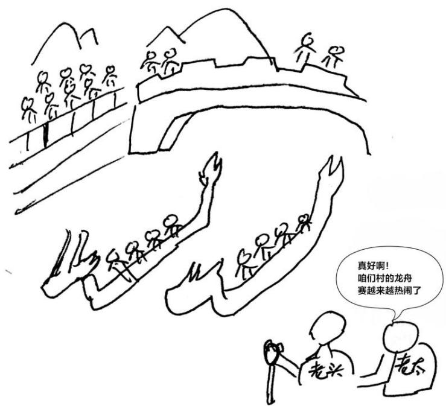

# 2023考研英语（一）真题及答案

# Section I Use of English

# Directions: Read the following text. Choose the best word (s) for each numbered blank and mark $A, B, C$ or $D$ on the ANSWER SHEET. (10 points)

Caravanserais were roadside inns that were built along the Silk Road in areas including China, North Africa and the Middle East. They were typically 1 outside the walls of a city or village and were usually funded by governments of 2.

This word "Caravanserais" is a 3 of the Persian word "karvan", which means a group of travellers or a caravan, and seray, a palace or enclosed building. The term caravan was used to 4 groups of people who travelled together across the ancient network for safety reasons, 5 merchants, travellers or pilgrims.

From the 10th century onwards, as merchant and travel routes become more developed, the $6$ of the Caravanserais increased and they served as a safe place for people to rest at night. Travellers on the Silk Road $7$ possibility of being attacked by thieves or being $8$ to extreme conditions. For this reason, Caravanserais were strategically placed $9$ they could be reached in a day's travel time.

Caravanserais served as an informal 10 point for the various people who travelled the Silk Road. 11, those structures became important centers for culture 12 and interaction, with travelers sharing their cultures, ideas and beliefs, 13 talking knowledge with them, greatly 14 the development of several civilizations.

Caravanserais were also an important marketplace for commodities and 15 in the trade of goods along the Silk Road. 16, it was frequently the first stop merchants looking to sell their wares and 17 supplies for their own journeys. It is 18 that around 120000 to 15000 caravanserais were built along the Silk Road, 19 only about 3000 are known to remain today, many of which are in 20

1.A displayed

B.occupied

C. located

D.equipped

2.A. privately

B.regularly

C.respectively

D.permanently

3.A.definition

B.transition

C.substitution

D.combination

4.A.classify

B_record

C.describe

D.connect

5.A.apart from

B.instead of

C.such as

D.along with

6.A.construction

B/restoration

C.impression

D.evaluation

7. A.doubted

B.faced

C.accepted

D.reduced

8. Aassigned

B.subjected

C.accustomed

D.opposed

9. A.so that

B.even if

C-now that

D.in case

10. A.talking

B.starting

Cbreaking

D.meeting

11. A. By the way

B.On occasion

C.In comparison

D.As a result

12. A. heritage

B. revival

C.exchange

D.status

13. A.with regard to

B.in spite of

C.as well as

D.in line with

14. A.completing

B.influencing

C.resuming

D.pioneering

15. A. aided

B.invested

C.failed

D.competed

16. A.Rather

B.Indeed

C. Otherwise

D.However

17. A.go in for

B.stand up for

C.close in on

D.stock up on

18.A.believed

B.predicted

C. recalled

D.implied

19.A. until

B.because

C.unless

D.although

20.A.ruins

B.debt

C.fashion

D(series

# Section II Reading Comprehension

# Part A

Directions: Read the following four texts. Answer the questions below each text by choosing $A$ , $B$ , $C$ or $D$ . Mark your answers on the ANSWER SHEET. (40 points)

# Text 1

The weather in Texas may have cooled since the recent extreme heat, but the temperature will be high at the State Board of Education meeting in Austin this month as officials debate how climate change is taught in Texas schools.

Pat Hardy, who sympathized with views of the energy sector, is resisting the proposed change to science standards for pre-teen pupils. These would emphasise the primacy of human activity in recent climate change and encourage discussion of mitigation measures.

Most scientists and experts sharply dispute Hardy's views. "They casually dismiss the career work of scholars and scientists as just another misguided opinion." says Dan Quinn, senior communications strategist at the Texas Freedom Network, a non-profit group that monitors public education, "What millions of Texas kids learn in their public schools is determined too often by the political ideology of partisan board members, rather than facts and sound scholarship."

Such debate reflects fierce discussions across the US and around the world, as researchers, policymakers, teachers and students step up demands for a greater focus on teaching about the facts of climate change in schools.

A study last year by the National Center for Science Education, a non-profit group of scientists and teachers, looking at how state public schools across the country address climate change in science classes, gave barely half of US states a grade $\mathrm{B + }$ or higher. Among the 10 worst performers were some of the most populous states, including Texas, which was given the lowest grade (F) and has a disproportionate influence because its textbooks are widely sold elsewhere.

Glenn Branch, the centre's deputy director, cautions that setting state-level science standards is only one limited benchmark in a country that decentralises decisions to local school boards. Even if a state is considered a high performer in its science standards, "that does not mean it will be taught", he says.

Another issue is that while climate change is well integrated into some subjects and at some ages — such as earth and space sciences in high schools — it is not as well represented in curricula for younger children and in subjects that are more widely taught, such as biology and chemistry. It is also less prominent in many social studies courses.

Branch points out that, even if a growing number of official guidelines and textbooks reflect scientific consensus on climate change, unofficial educational materials that convey more slanted perspectives are being distributed to teachers. They include materials sponsored by libertarian think-tanks and energy industry associations.

21. In paragraph 1, the weather in Texas is mentioned to

Aforecast a policy shift in Texas schools   
B.stress the consequences of climate change   
C.indicate the atmosphere at the board meeting   
D.draw the public's attention to energy shortages

22. What does Quinn think of Hardy?

A.She exaggerates the existing panic.   
B.She denies the value of scientific work.   
C.She shows no concern for pre-teens.   
D.She expresses self-contradictory views.

23.The study mentioned in Paragraph 5 indicates that

A.climate education is insufficient at state public schools   
B.policy makers have little drive for science education   
C.Texas is reluctant to rewrite its science textbooks   
D. environmental teaching in some states lacks supervision

24. According to Branch, state-level science standards in the US

A.call for regular revision   
Brequire urgent application   
C.have limited influence   
D.cater to local needs

25. It is implied in the last paragraph that climate change teaching in some schools

A.agree to major public demands

B.reflects teachers' personal bias

C.may misrepresent the energy sector

D.can be swayed by external forces

# Text 2

Communities throughout the region have been attempting to regulate short-term rentals since sites like Airbnb took off in the 2010s. Now, with record-high home prices and historically low inventory, there's an increased urgency in such regulation, particularly among those who worry that developers will come in and buy up swaths of housing to flip for a fortune on the short-term rental market.

In New Hampshire, where the rental vacancy rate has dropped below 1 percent, housing advocates fear unchecked short-term rentals will put further pressure on an already strained market. The state Legislature recently voted against a bill that would've made it illegal for towns to create legislation restricting short-term rentals.

"We are at a crisis level on the supply of rental housing, so anytime you're taking the tool out of the toolkit for communities to address this, you're potentially taking supply off the market that's already incredibly stressed," said Nick Taylor, executive director of the Workforce Housing Coalition of the Greater Seacoast. Without enough affordable housing in southern New Hampshire towns, "employers are having a hard time attracting employees, and workers are having a hard time finding a place to live," Taylor said.

However, short-term rentals also provide housing for tourists, a crucial part of the economies in places like Nantucket, Cape Cod, or the towns that make up New Hampshire's Seacoast and Lakes Region, pointed out Ryan Castle, CEO of the Cape Cod & Islands Association of Realtors. "A lot of workers are servicing the tourist industry, and the tourism industry is serviced by those people coming in short term," Castle said, "and so it's a cyclical effect."

Short-term rentals themselves are not the crux of the issue, said Keren Horn, an affordable housing policy expert at the University of Massachusetts Boston. "I think individuals being able to rent out their second home is a good thing. If it's their vacation home anyway, and it's just empty, why can't you make money off it?" Horn said. Issues arise, however, when developers attempt to create large-scale short-term rental facilities — de facto hotels — to bypass taxes and regulations. "I think the question is, shouldn't a developer who's really building a hotel, but disguising it as not a hotel, be treated and taxed and regulated like a hotel?" Horn said.

At the end of 2018, Governor Charlie Baker signed a bill to rein in those potential investor-buyers. "The bill requires every rental host to register with the state, mandates they carry insurance, and opens the potential for local taxes on top of a new state levy," the Globe reported. Boston took things even further, limiting who is authorized to rent out their home, and requiring renters to register with the city's Inspectional Services Department.

Horn said similar registration requirements could benefit other struggling cities and towns. The only way to solve the issue, however, is by creating more housing. "If we want to make a change in the housing market, the main one is we have to build a lot more."

26. Which the following is true of New England?

A. Its housing supply is at a very low level.   
B. Its communities are in need of funding.   
C. Its rental vacancy rate is going up slowly   
D. Its home prices are under strict control.

27. The bill mentioned in the Paragraph 2 was intended to

A. curb short-term rental speculation.   
B. ensure the supply of cheap housing.   
C. punish illegal dealings in housing.   
D. allow a free short-term rental market.

28. Compared with Castle, Taylor is more likely to support

A. further investment in local tourism.   
B. in increase in affordable housing.   
C. strict management of real estate agents.   
D. a favorable policy for short-term workers.

29. What does Horn emphasize in paragraph 5

A. The urgency to upgrade short-term rental facilities.   
B. The efficient operation of the local housing market.   
C. The necessity to stop developers from evading taxes.   
D. The proper procedures for renting out spare houses.

30. Horn holds that imposing registration requirements is

A. an irrational decision.   
B. an unfeasible proposal.   
C. an unnecessary measure.   
D. an inadequate solution.

# Text 3

If you're heading for your nearest branch of Waterstones in search of the Duchess of Sussex's new children's book The Bench, you might have to be prepared to hunt around a bit; the same may be true of The President's Daughter, the new thriller by Bill Clinton and James Patterson. Both of these books are published next week by Penguin Random House, a company currently involved in a stand-off with Waterstones.

The problem began late last year, when Penguin Random House confirmed that it had introduced a credit limit with Waterstones "at a very significant level". The trade magazine The Bookseller reported that Waterstones branch managers were being told to remove PRH books from prominent areas such as tables, display spaces and windows, and were "quietly retiring them to their relevant sections".

PRH declined to comment on the issue, but a spokesperson for Waterstones told me: "Waterstones are currently operating with reduced credit terms from PRH, the only publisher in the UK to place any limitations on our ability to trade. We are not控股ing PRH titles but we are doing our utmost to ensure that availability for customers remains good despite the lower overall levels of stock. We do this generally by giving their titles less prominent positioning within our bookshops. "We are hopeful with our shops now open again that normality will return and that we will be allowed to buy appropriately. Certainly, our shops are exceptionally busy and book sales are very strong. The sales for our May Books of the Month surpassed any month since 2018."

In the meantime, PRH authors have been the losers - as have customers, who might expect the new titles from the country's biggest publisher to be prominently displayed by its biggest book retailer. Big-name PRH authors may suffer a bit, but it's those mid-list authors, who normally rely on Waterstones staff's passion for promoting books by lesser-known writers, who will be praying for an end to the dispute.

It comes at a time when authors are already worried about the consequences of the proposed merger between PRH and another big publisher, Simon & Schuster - the reduction in the number of unaligned UK publishers is likely to lead to fewer bidding wars, lower advances, and more conformity in terms of what is published. And one wonders if PRH would have been confident enough to deal with Waterstones in the way it has if it weren't quite such a big company (it was formed with the merger of Penguin and Random House in 2013) and likely to get bigger.

"This is all part of a wider change towards concentration of power and cartels. Literary agencies are getting bigger to have the clout to negotiate better terms with publishers, publishers consolidating to deal with Amazon," says Lownie. "The publishing industry talks about diversity in terms of authors and staff but it also needs a plurality of ways of delivering intellectual contact, choice and different voices. After all, many of the most interesting books in recent years have come from small publishers."

31. The author mentions two books in the paragraph 1 to present

A.an ongoing conflict   
B.an intellectual concept   
C.a prevailing sentiment   
D.a literary phenomenon

32. Why did Waterstones shops retire PRH books to their relevant sections?

A.To make them easily noticeable.

B.To comply with PRH's requirement.   
C.To respond to PRH's business move.   
D.To arrange them in a systematic way.

33. What message did the spokesman of Waterstones seem to convey?

A. Their customers remain royal.   
B.The credit limit will be removed.   
C. Their stock is underestimated.   
D.The book market is rather slack.

34.What can be one consequence of current dispute?

A.Sales of books by mid-list PRH writers fall off considerably.   
B.Lesser-known PRH writers become the target of criticism.   
C.Waterstones staff hesitate to promote big-name author's books.   
D.Waterstones branches suffer a severe reduction in revenue.

35. Which of the following statements best represents Lownie's view?

A.Small publishers ought to stick together.   
B.Big publishers will lose their dominance.   
C.The publishing industry is having a hard time.   
D.The merger of publisher is a worrying trend.

# Text 4

Scientific papers are the recordkeepers of progress in research. Each year researchers publish millions of papers in more than 30,000 journals. The scientific community measures the quality of those papers in a number of ways, including the perceived quality of the journal (as reflected by the title's impact factor) and the number of citations a specific paper accumulates. The careers of scientists and the reputation of their institutions depend on the number and prestige of the papers they produce, but even more so on the citations attracted by these papers.

Citation cartels. where journals, authors, and institutions conspire to inflate citation numbers, have existed for a long time. In 2016, researchers developed an algorithm to recognize suspicious citation patterns, including groups of authors that disproportionately cite one another and groups of journals that cite each other frequently to increase the impact factors of their publications. Recently, another expression of this predatory behavior has emerged: so-called support service

consultancies that provide language and other editorial support to individual authors and to journals sometimes advise contributors to add a number of citations to their articles.

The advent of electronic publishing and authors' need to find outlets for their papers resulted in thousands of new journals. The birth of predatory journals wasn't far behind. These journals can act as milk cows where every single article in an issue may cite a specific paper or a series of papers. In some instances, there is absolutely no relationship between the content of the article and the citations. The peculiar part is that the journal that the editor is supposedly working for is not profiting at all—it is just providing citations to other journals. Such practices can lead an article to accrue more than 150 citations in the same year that it was published.

How insidious is this type of citation manipulation? In one example, an individual-acting as author, editor, and consultant - was able to use at least 15 journals as citation providers to articles published by five scientists at three universities. The problem is rampant in Scopus, a citation database, which includes a high number of the new "international"journals. In fact, a listing in Scopus seems to be a criterion to be targeted in this type of citation manipulation

Scopus itself has all the data necessary to detect this malpractice. Red flags include a large number of citations to an article within the first year. And for authors who wish to steer clear of citation cartel activities:when

an editor, a reviewer, or a support service asks you to add inappropriate references, do not oblige and do report the request to the journal.

36. According to passage 1, the carriers of scientists can be determined by

A.how many citations their papers contain   
B.how many times their papers are cited   
C.the prestige of the people they works with   
D.the status they have in scientific circles

37.The support service consultancies tend to

A.Recommend journals to their clients   
B.list citations patterns for their clients   
C.asks authors to include extra citations

D.advise contributors to cite each other

38. The function of the "milk cow"journals is to

A. boost citation counts for certain authors   
B.help scholars publish articles at low cost   
C.instruct first-time contributors in citation   
D.increase the readership of new journals

39. What can be learned about Scopus from the last two paragraphs?

A.It fosters competition among citation providers.   
B. It has the capability to identify suspicious citation.   
C. It hinders the growth of international journals.   
D.It is established to prevent citation manipulation.

40. What should an author do to deal with citation manipulation?

A.Take legal action.   
B.Demand an apology.   
C. Seek professional advice.   
D.Reveal their misconduct.

# Part B

Directions: Read the following text and answer the questions by choosing the most suitable subheading from the list A-G for each of the numbered paragraphs (41-45). There are two extra subheadings. Mark your answers on the ANSWER SHEET. (10 points)

A. Last year marks the 150th anniversary of a series of Yellowstone photographs by the renowned landscape photographer William Henry Jackson. He captured the first-ever shots of iconic landmarks such as the Tetons, Old Faithful and the Colorado Rockies.   
B. Two centuries ago, the idea of preserving nature, rather than exploiting it, was a novel one to many U.S. settlers. One of the turning points in public support for land conservation efforts — and recognizing the magnificence of the Yellowstone region in particular — came in the form of vivid photographs.   
C As an effective Washington operator, Hayden sensed that he could capitalize on the expedition's stunning visuals. He asked Jackson to print out large copies and distributed them, along with reproductions of Moran's paintings, to each member of Congress. "The visualization, particularly those photographs, really hit home that this is something that has to be protected," says Murphy.   
D Through the trip, Jackson juggled multiple cameras and plate sizes using the "collodion process" that required him to coat the plates with a chemical mixture, then expose them and develop the resulting images with a portable darkroom. The crude technique required educated

guesses on exposure times, and involved heavy, awkward equipment — several men had to assist in its transportation. Despite these challenges, Jackson captured dozens of striking photos, ranging from majestic images like his now-famous snapshot of Old Faithful, to casual portraits of expedition members at the camp.

E The journey officially began in Ogden, Utah, on June 8,1871. Over nearly four months, dozen of man made their way on horseback into Montana and traversed along the Yellowstone River and around Yellowstone lake. That fall, they concluded the survey in fort Bridger, Wyoming.

F Though Native Americans (and later miners and fur trappers) had long recognized the area's riches, most Americans did not. That's why Hayden's expedition aimed to produce a fuller understanding of the yellowstone river region, from it's hot springs and waterfalls to its variety of flora and fauna. In addition to the entourage of scientists, the team also included artists: Painter Thomas Moran and photographer Jackson were charged with capturing this astounding natural beauty and sharing it with the world.

G The bill proved largely popular and sailed through Congress with large majorities in favor. In quick succession, the Senate and House passed legislation protecting yellowstone in early 1872. That March, President Ulysses S.Grant signed an act into law that established Yellowstone as the world's first national park. While some locals opposed to the designation, the decision was largely accepted-and Jackson's photos played a key role in the fight to protect the area. I don't believe that the legal protection would have happened in the timeframe that it did without those images, says Heather Hansen, journalist and author of Prophets and Moguls, Rangers and Rogues Bison Bear: 100 years of the national Park Service.

H Perhaps most importantly, the images provided documentary evidence that later made its way to government officials. Weeks after completing the expedition, Hayden collected his team's observation into an extensive rep aimed at convincing Senators and Representatives, along with colleagues at government agency like the department of Interior that Yellowstone ought to be preserved.

41. —A—42. —E—43. —H—44. —45.

41.B 42.F 43.D 44.C 45.G

# Part C

# Directions: Read the following text carefully and then translate the underlined segments into Chinese. Write your answers on the ANSWER SHEET. (10 points)

There has been some exploration around the use of AI in digital marketing. For example, AI can be used to analyse what type of advertising content or copy would be appropriate to 'speak' to a specific target customer group by revealing information about trends and preferences through the analysis of big data. (46) AI can also be used to identify the lifestyle choices of customers regarding their hobbies, favourite celebrities and fashions to provide unique content in marketing messages put out through social media. At the same time AI can also be used to generate content

for social media posts and chat sites.AI can also provide a bridge between the need of the brand to communicate emotionally with the customer and identifying their rapidly changing needs.

The main disadvantage of using AI to respond to customers is that there are concerns about trusting personal interactions to machines, which could lead not only to the subsequent loss of interpersonal connections, but also to a decrease in marketing personnel. (47) Some believe that AI is negatively impacting on the marketer's role by reducing creativity and removing jobs, but they are aware that it is a way of reducing costs and creating new information. By allowing AI to develop content some brand marketers may find that they are losing control over the brand narrative. (48) Algorithms that are used to simulate human interactions are creating many of these concerns, especially as no-one is quite sure what the outcomes of using AI to interact with customers will be.

For AI to be successful, data needs to be accessible, but the use of personal data is becoming more regulated and the automated sharing of data is becoming more difficult. (49) If customers are not willing to share data, AI will be starved of essential information and will not be able to function effectively or employ machine learning to improve its marketing content and communication. Therefore, unless customers are prepared to sign release agreements, the use of AI may become somewhat restricted in the future. Not only can AI help to create the marketing content, but it can also provide a non-intrusive way of delivering the content to the target customers. Data can be gathered on where the customer can be engaged, such as location, devices used, website interactions, and sites visited, to display marketing messages inappropriate forms, including emails, social media posts, pop-up advertisements, and banners at an appropriate frequency. (50) The non-intrusive delivery of the marketing messages in a way that is sensitive to the needs of the target customer is one of the critical challenges to the digital marketer.

# 答案：

46. 就顾客的喜好、最爱的名人及潮流服饰方面而言，人工智能也可用于辨别顾客的这些生活选择，由此在通过社交媒体推送的营销信息中提供专属的内容。  
47. 有的人认为人工智能会降低创造性、减少工作岗位，从而对营销者的形象造成负面影响，但他们也知道，人工智能是降低成本和催生新信息的一种途径。  
48. 用于模拟人类互动行为的算法正在催生许多这方面的担忧，尤其是在大家无法完全确定运用人工智能和顾客互动会产生何种后果时。  
49. 若顾客不愿分享数据，人工智能便会缺失关键信息，无法有效运作，也不能运用机器学习来优化其营销内容和交流。  
50. 敏锐捕捉目标客户需求，对营销信息进行非侵扰式的传播，这对数字营销者而言是一项重大挑战。

# Section III Writing

# Part A

Directions:

Write a notice to recruit a student for Prof.Smith's research project on campus sports

activities. Specify the duties and requirements of the job.

Do not sign your own name at the end of the letter. Use "Li Ming" instead.

Do not write the address. (10 points)

# Notice

Dec. $24^{\mathrm{th}}$ , 2022

The notice is to recruit a student for Prof. Smith research project on campus sports activities and specify the duties and requirements of this job.

To begin with, what you need to pay close attention to is that the main duty of the position requires that you can collect and analyze the data on campus sports activities. In addition to that, you will be responsible for organizing the daily meetings with Professor Smith and other members and dealing with the problems on the campus sports activities independently. Most importantly, you should be extremely organized, enthusiastic, and patient, and expert at communicational skills.

The deadline for registration is January $31^{\mathrm{st}}$ , 2023. If you have any questions or need help, please telephone 1234567 or contact us at sports@123.com by email.

Li Ming

# Directions:

Write an essay based on the picture below. In your essay, you should

1) describe the drawing briefly,   
2) interpret the implied meaning, and   
3) give your comments.

Write your answer in 160-200 words on the ANSWER SHEET. (20 points)

聚创教育

2004

As is graphically portrayed in the picture, an aged man and a senior woman are standing hand in hand, watching a spectacular dragon-boat racing competition, with contented smiles on their faces. Simple as the picture is, the symbolic meaning is thought-provoking.

Recent years have witnessed the prevalence of preservation and promotion of traditional culture, which has aroused heated discussion. First and foremost, it must be stressed that the present situation, to a certain degree, stems from public awareness of preserving traditions. In addition, we may notice that our cultural confidence also plays an important role in leading to this phenomenon. Last but not the least, that the government has put more emphasis on culture protection is another significant factor that cannot be ignored. As a famous short video Vlogger, Li Ziqi is remembered and respected by people for her success in promoting Chinese culture. In her life, she releases her videos about cooking Chinese food and making traditional Chinese handicrafts such as embroidery.

Consequently, it is of utmost importance for us to take some measures to enhance the awareness of promoting traditions and conventions in our society. The government and the department concerned should assume the responsibility to educate every citizen to keep striving to carry forward Chinese culture.